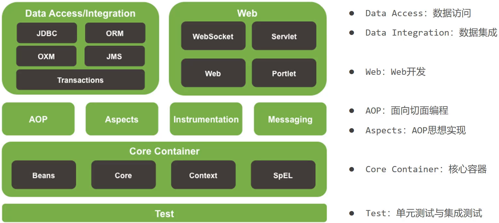
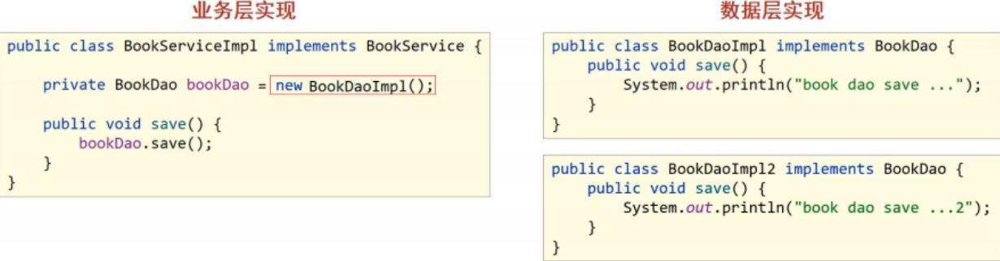
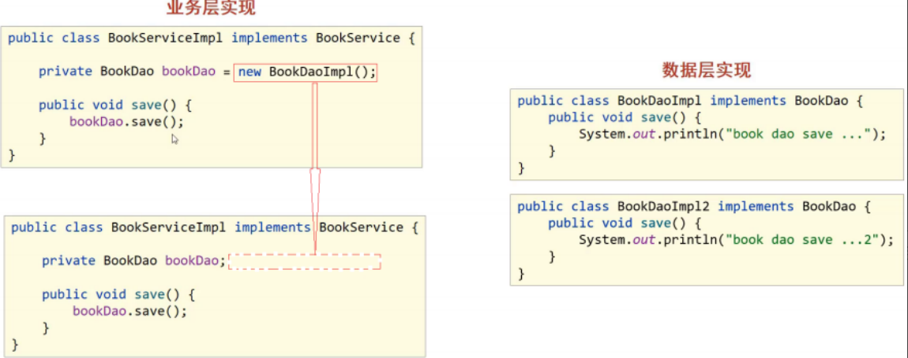
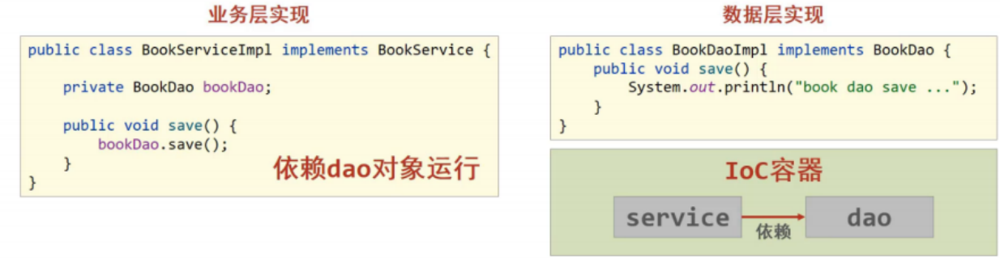
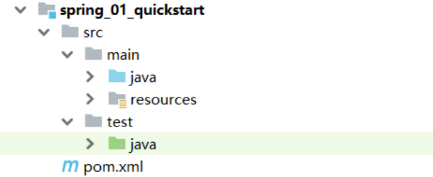
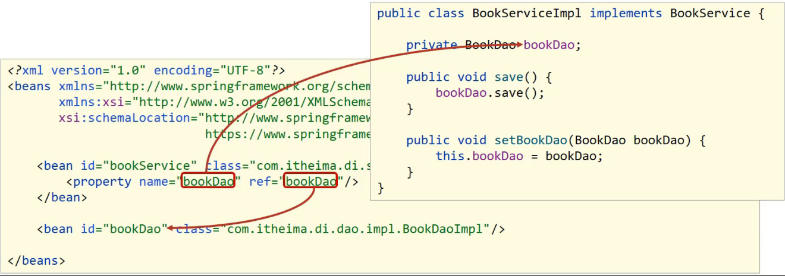

[toc]

# Spring笔记1-介绍

当前Spring的版本为5.3.22

该笔记有一部分来自于黑马程序员Spring课程视频中的课件资料。

## 介绍

### Spring家族介绍

Spring发展到今天已经形成了完整的生态圈,Spring构建了若干个项目,每个项目用于完成特定的功能。我们可以根据需要自行选择，把这些个项目组合起来使用。用于完成整个大项目工程的构建、设计与开发。


下面是需要重点关注的
* Spring Framework: 是Spring中最早最核心的技术框架，也是所有其他技术的基础。
* SpringBoot: SpringBoot是来帮助Spring在简化的基础上能更快速进行开发。
* SpringCloud: 是用来做分布式之微服务架构的相关开发。

<font color="red">我们学习的Spring其实特指的是Spring家族中的Spring Framework框架。</font>

### Spring Framework框架介绍

① Spring Framework发展史：目前最新的是Spring5
* Spring1.0是纯配置文件开发。
* Spring2.0为了简化开发引入了注解开发，此时是配置文件加注解的开发方式。
* Spring3.0已经可以进行纯注解开发，使开发效率大幅提升。
* Spring4.0根据JDK的版本升级对个别API进行了调整。
* Spring5.0已经全面支持JDK8。

② Spring Framework5的架构图


* Core Container核心容器模块：这个模块是Spring最核心的模块，其他的都需要依赖该模块
* AOP: 面向切面编程，它依赖核心层容器，目的是在不改变原有代码的前提下对其进行功能增强
* Aspects: AOP是思想,Aspects是对AOP思想的具体实现
* Data Access: 数据访问，Spring全家桶中有对数据访问的具体实现技术
* Data Integration: 数据集成，Spring支持整合其他的数据层解决方案，比如Mybatis
* Transactions: 事务，Spring中事务管理是Spring AOP的一个具体实现。
* TEST模块：Spring主要整合了Junit来完成单元测试和集成测试

### Spring Framework框架主要解决的问题是什么？



(1)在使用spring Framework框架之前,业务层调用数据层的方法，就需要在业务层先new数据层的对象
(2)如果数据层的实现类发生变化，那么业务层的代码也需要跟着改变，发生变更后，都需要进行编译，打包和重部署
(3)这种方式存在的问题是：数据层和业务层的代码耦合度偏高

针对这个问题，Spring就提出了一个解决方案:



* 使用数据层对象时，不使用new产生对象，由Spring容器来提供对象。
* 在Spring容器中维护对象与对象之间的依赖关系。

### Spring Framework 核心概念

上面的解决方案体现的就是Spring的核心概念IOC和DI。

* IOC（控制反转）：使用对象时，程序不主动new对象，由Spring容器来提供对象。
* DI（依赖注入）：在Spring容器中维护对象与对象之间的依赖关系。

#### IOC控制反转

1. Spring提供一个容器，称为IOC容器。
2. IOC容器负责对象的创建、初始化等一系列工作。让程序不主动new对象。由IOC容器来提供对象。
3. 被创建或被管理的对象在IOC容器中统称为Bean对象。
4. IOC容器中的bean对象之间，本来是没有依赖关系的，因此无法互相调用。
5. DI依赖注入就是用于在IOC容器中维护对象与对象之间的依赖关系。

#### DI依赖注入



在IOC容器中建立bean对象之间的依赖关系的过程，称为依赖注入。


#### 控制反转和依赖注入要实现的目标

IOC和DI的最终目标就是:充分解耦
1. 使用IOC容器管理bean对象（IOC)
2. 在IOC容器内将需要依赖的bean对象之间进行关系绑定（DI）
3. 最终目标：使用对象时不仅可以直接从IOC容器中获取，并且获取到的bean已经绑定了所有的依赖关系。


## Spring Framework 快速开始

Spring到底是如何来实现IOC和DI的，那接下来就通过一些简单的入门案例，来演示下具体实现过程。

### IOC控制反转入门案例

IOC控制反转入门案例思路分析：
1. 如何引入Spring依赖？
2. 如何将被管理的对象告知给IOC容器？
3. 如何从程序中获取到IOC容器?
4. 如何从容器中获取bean对象?

IOC控制反转入门案例思路实现：
1. 创建Maven项目
2. pom.xml添加Spring的依赖jar包
3. 创建BookService,BookServiceImpl，BookDao和BookDaoImpl四个类
4. resources目录下添加spring配置文件，并完成bean的配置
5. 使用Spring提供的接口完成IOC容器的创建
6. 从容器中获取对象进行方法调用

> 步骤1：创建Maven项目



> 步骤2:pom.xml文件中添加Spring的依赖jar包

```xml
<dependencies>
    <dependency>
        <groupId>org.springframework</groupId>
        <artifactId>spring-context</artifactId>
        <version>5.2.10.RELEASE</version>
    </dependency>
</dependencies>
```

<font color="red">spring-context是Spring Framework框架的核心模块</font>

> 步骤3:添加案例中需要的类

创建BookService,BookServiceImpl，BookDao和BookDaoImpl四个类

```java
//--------BookDao接口
public interface BookDao {
    public void save();
}
//------------BookDao接口实现类 BookDaoImpl
public class BookDaoImpl implements BookDao {
    public void save() {
        System.out.println("book dao save ...");
    }
}
//------BookService接口
public interface BookService {
    public void save();
}
//-------BookService接口实现类 BookServiceImpl
public class BookServiceImpl implements BookService {
    private BookDao bookDao = new BookDaoImpl();
    public void save() {
        System.out.println("book service save ...");
        bookDao.save();
    }
}
```

> 步骤4:添加spring配置文件，并完成bean对象的配置

resources目录下添加spring配置文件applicationContext.xml，并完成bean的配置。

```xml
<?xml version="1.0" encoding="UTF-8"?>
<beans xmlns="http://www.springframework.org/schema/beans"
       xmlns:xsi="http://www.w3.org/2001/XMLSchema-instance"
       xsi:schemaLocation="http://www.springframework.org/schema/beans http://www.springframework.org/schema/beans/spring-beans.xsd">
    <!--bean标签标示配置bean
        id属性标示给bean起名字
    	class属性表示给bean定义类型
	-->
	<bean id="bookDao" class="com.itheima.dao.impl.BookDaoImpl"/>
    <bean id="bookService" class="com.itheima.service.impl.BookServiceImpl"/>
</beans>
```

<font color="red">bean标签中的id属性在同一个上下文中(配置文件)不能重复。applicationContext.xml配置文件主要是对IOC容器的配置。</font>

> 步骤5:获取IOC容器

根据applicationContext.xml配置文件来完成IOC容器的创建，创建App启动类，编写main方法

```java
public class App {
    public static void main(String[] args) {
        //获取IOC容器
		ApplicationContext ctx = new ClassPathXmlApplicationContext("applicationContext.xml"); 
    }
}
```

> 步骤6:从容器中获取对象进行方法调用

```java
public class App {
    public static void main(String[] args) {
        //获取IOC容器
	    ApplicationContext ctx = new ClassPathXmlApplicationContext("applicationContext.xml");
        // 从ioc容器中获取 bookService bean对象，并调用方法
        BookService bookService = (BookService) ctx.getBean("bookService");
        bookService.save();
    }
}
```

> 步骤7:运行程序

```
测试结果为：
book service save ...
book dao save ...
```

Spring的IOC入门案例已经完成，但是在BookServiceImpl的类中依然存在BookDaoImpl对象的new操作，它们之间的耦合度还是比较高，这块该如何解决，就需要用到下面的DI:依赖注入。

### DI依赖注入 入门案例

DI依赖注入入门案例思路分析：
1. 实现依赖注入，必须要基于IOC管理Bean。
2. new形式创建的Dao对象是否保留?
3. Service中需要的Dao对象如何进入到Service中?
4. Service与Dao间的依赖关系如何描述?

DI依赖注入入门案例思路实现：
1. 删除业务层中使用new的方式创建的dao对象
2. 在业务层提供BookDao的setter方法
3. 在配置文件中添加依赖注入的配置，来维护Service与Dao的依赖关系
4. 运行程序调用方法

> 步骤1: 去除代码中的new

在BookServiceImpl类中，删除业务层中使用new的方式创建的dao对象
```java
public class BookServiceImpl implements BookService {
    //删除业务层中使用new的方式创建的dao对象
    private BookDao bookDao;
    public void save() {
        System.out.println("book service save ...");
        bookDao.save();
    }
}
```

> 步骤2:为属性提供setter方法

在BookServiceImpl类中,为BookDao提供setter方法
```java
public class BookServiceImpl implements BookService {
    //删除业务层中使用new的方式创建的dao对象
    private BookDao bookDao;
    public void save() {
        System.out.println("book service save ...");
        bookDao.save();
    }
    //提供对应的set方法
    public void setBookDao(BookDao bookDao) {
        this.bookDao = bookDao;
    }
}
```

> 步骤3:修改applicationContext.xml配置文件完成注入

在applicationContext.xml配置文件中添加依赖注入的配置
```xml
<?xml version="1.0" encoding="UTF-8"?>
<beans xmlns="http://www.springframework.org/schema/beans"
       xmlns:xsi="http://www.w3.org/2001/XMLSchema-instance"
       xsi:schemaLocation="http://www.springframework.org/schema/beans http://www.springframework.org/schema/beans/spring-beans.xsd">
    <bean id="bookDao" class="com.itheima.dao.impl.BookDaoImpl"/>

    <bean id="bookService" class="com.itheima.service.impl.BookServiceImpl">
        <!--配置server与dao的关系-->
        <!--property标签表示配置当前bean的属性
        		name属性表示配置哪一个具体的属性
        		ref属性表示参照哪一个bean
		-->
        <property name="bookDao" ref="bookDao"/>
    </bean>

</beans>
```



<font color="red">

注意:配置文件中的两个bookDao的含义是不一样的:
1. 通过`<property>`标签，将bookDao对象依赖注入到bookService对象中。
1. name="bookDao"中bookDao的作用是让Spring的IOC容器在获取到名称后，将首字母大写，前面加set找对应的setBookDao()方法进行对象注入
2. ref="bookDao"中bookDao的作用是让Spring能在IOC容器中找到id为bookDao的Bean对象注入到bookService对象中。

</font>

> 步骤4:运行程序

```
测试结果为：
book service save ...
book dao save ...
```

由结果可知，通过`<property>`标签，将bookDao对象依赖注入到bookService对象。