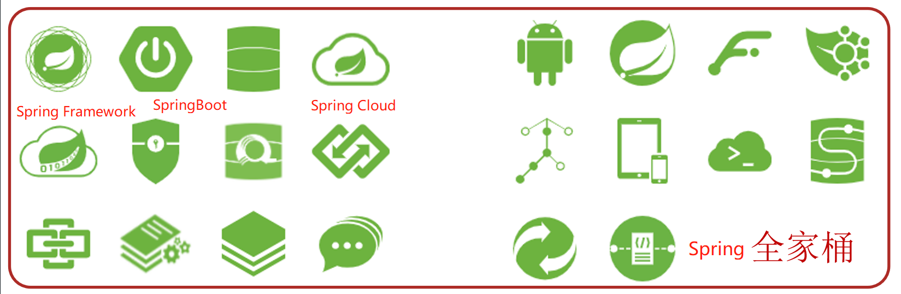

[toc]

# Spring笔记1-介绍

当前Spring的版本为5.3.22

## Spring介绍

> 狭义的 Spring

狭义的 Spring 特指 Spring Framework，通常我们将它称为 Spring 框架。

Spring 是 Java EE 编程领域的一款轻量级的开源框架，它的目标就是要简化 Java 企业级应用程序的开发难度和周期。

Spring 有两个核心部分：IoC 和 AOP。

> Spring的特点

1. 用于对象之间的解耦，简化代码的复杂程度。
2. 可以很方便集成各种优秀框架。
3. 提供了AOP功能的支持。可以方便地实现对程序进行权限拦截和运行监控等功能。

> 广义上的 Spring

广义上的 Spring 泛指以 Spring Framework 为核心的 Spring 技术栈。Spring 技术栈中的各个子项目涵盖了从企业级应用开发到云计算等各方面的内容，能够帮助开发人员解决软件发展过程中不断产生的各种实际问题，给开发人员带来了更好的开发体验。

### Spring家族介绍

Spring 经过十多年的发展，Spring 已经不再是一个单纯的应用框架，而是逐渐发展成为一个由多个不同子项目（模块）组成的生态圈，例如 Spring Framework、Spring MVC、SpringBoot、Spring Cloud、Spring Data、Spring Security 等，其中 Spring Framework 是其他子项目的基础。



例如
* Spring Framework: 是Spring中最早最核心的技术框架，也是所有其他技术的基础。
* Spring Data : Spring 提供的数据访问模块，对 JDBC 和 ORM 提供了很好的支持。通过它，开发人员可以使用一种相对统一的方式，来访问位于不同类型数据库中的数据。
* Spring Security : 前身为 Acegi，是 Spring 中较成熟的子模块之一。它是一款可以定制化的身份验证和访问控制框架。
* SpringBoot: SpringBoot是 Spring 团队提供的全新框架，它为 Spring 以及第三方库提供了一些开箱即用的配置，可以简化 Spring 应用的搭建及开发过程。
* SpringCloud: 一款基于 Spring Boot 实现的微服务框架。它并不是某一门技术，而是一系列微服务解决方案或框架的有序集合。它将市面上成熟的、经过验证的微服务框架整合起来，并通过 Spring Boot 的思想进行再封装，屏蔽调其中复杂的配置和实现原理，最终为开发人员提供了一套简单易懂、易部署和易维护的分布式系统开发工具包。

<font color="red">我们学习的Spring其实特指的是Spring家族中的Spring Framework框架。</font>

### Spring Framework框架介绍

① Spring Framework发展史：目前最新的是Spring5
* Spring1.0是纯配置文件开发。
* Spring2.0为了简化开发引入了注解开发，此时是配置文件加注解的开发方式。
* Spring3.0已经可以进行纯注解开发，使开发效率大幅提升。
* Spring4.0根据JDK的版本升级对个别API进行了调整。
* Spring5.0已经全面支持JDK8。

② Spring Framework 5 的架构图

<font color="red">Spring Framework主要有7大模块组成。每个模块既可以单独使用，又可以与其他模块组合使用。</font>


* Core Container核心容器模块：这个模块是Spring Framework最核心的模块，其他的都需要依赖该模块。它实现了IOC 模式。
* AOP: 面向切面编程，它依赖核心层容器，目的是在不改变原有代码的前提下对其进行功能增强。
* Aspects: AOP是设计思想,Aspects是对AOP思想的具体实现
* Data Access / Data Integration: 数据访问与集成，Spring Framework 中有对数据访问的具体实现技术。并且 Spring Framework支持整合其他的数据层解决方案，比如Mybatis
* Transactions: 事务，Spring Framework中事务管理是Spring AOP的一个具体实现。
* TEST模块：Spring Framework主要整合了Junit来完成单元测试和集成测试


### Spring Framework框架主要解决的问题是什么？

当某个Java对象（调用者）需要调用另一个Java对象（依赖对象）的方法时，在传统模式下通常有两种做法：

1. 原始做法: 调用者先主动创建依赖对象，然后再调用依赖对象的方法
2. 简单工厂模式: 调用者先找到依赖对象的工厂，然后主动通过工厂去获取被依赖对象，最后再调用依赖对象的方法。

主动创建依赖对象，这必然会导致调用者与依赖对象之间的硬编码耦合，非常不利于项目后续的维护。可以理解为对象与对象之间的关系太紧密，耦合度太高。

> 如图所示


(1)在使用spring Framework框架之前,业务层调用数据层的方法，就需要在业务层先new数据层的对象
(2)如果数据层的实现类发生变化，那么业务层的代码也需要跟着改变，发生变更后，都需要进行编译，打包和重部署
(3)这种方式存在的问题是：数据层和业务层的代码耦合度偏高。可以理解为对象与对象之间的关系太紧密，耦合度太高。

针对这个问题，Spring就提出了一个解决方案:


* 使用对象时，不通过new产生对象，由Spring容器来提供对象。
* 由Spring负责维护容器中对象之间的依赖关系。

## Spring Framework 核心概念

上面的解决方案体现的就是Spring Framework 的两个核心概念IOC和DI。

* IOC（控制反转）：spring负责创建所有的Java对象，这些Java对象被称为Java Bean对象。使用对象时，程序不主动new对象，由Spring来提供对象。
* DI（依赖注入）：Spring负责管理对象与对象之间的依赖关系。而不是在程序中以编码的方式将对象与对象耦合在一起。

### IOC控制反转

> 在 Spring 应用中，Java 对象创建的控制权是掌握在 IoC 容器手里的，其大致步骤如下。
1. 开发人员通过 XML 配置文件、注解 等方式，对 Java 对象进行定义，例如在 XML 配置文件中使用 `<bean>` 标签、在 Java 类上使用 `@Component` 注解等。
2. Spring 应用启动后会创建一个容器，称为IOC容器。
3. IOC容器会负责对象的创建、初始化等一系列工作。并管理起来。
4. 这个被IOC容器创建并管理的对象在IOC容器中统称为Bean对象。
5. 当我们想要使用某个 Bean 时，可以直接从 IoC 容器中获取（例如通过 ApplicationContext 的 getBean() 方法），而不需要手动通过代码（例如 new Obejct() 的方式）创建。


IoC 带来的最大改变不是代码层面的，而是从思想层面上发生了“主从换位”的改变。原本调用者是主动的一方，它想要使用什么资源就会主动出击，自己创建；但在 Spring 应用中，IoC 容器掌握着主动权，调用者则变成了被动的一方，被动的等待 IoC 容器创建它所需要的对象（Bean）。

这个过程在职责层面发生了控制权的反转，把原本调用者通过代码实现的对象的创建，反转给 IoC 容器来帮忙实现，因此我们将这个过程称为 Spring 的“控制反转”。

### DI依赖注入

IOC容器中的bean对象之间，本来是没有依赖关系的，因此无法在代码层面上互相调用。DI依赖注入就是用于在IOC容器中建立对象与对象之间的依赖关系。

> 什么是对象之间的依赖关系？

在面向对象中，对象和对象之间是存在一种叫做“依赖”的关系。简单来说，依赖关系就是一个对象中需要用到另外一个对象的时候，即对象中存在一个属性，这个属性是另外一个类的对象。

> 例子1
```java
public class B {
    String bid;
    A a;
}
```

例如，上面代码中，B 中存在一个 A 类型的对象属性 a，此时我们就可以说 B 的对象依赖于对象 a。A与B之间存在依赖关系。


> 例子2 如下图所示


BookServiceImpl的save()方法，从逻辑上是依赖于BookDaoImpl的save()方法的。但是如果没有在Ioc容器中建立两者的依赖关系。那么左边save()方法就会报错。因为无法从BookServiceImpl对象中获取BookDaoImpl对象。

但是如果提前在IOC容器中建立了两个对象的依赖关系，那么就无须先new一个BookDaoImpl对象，再调用BookDaoImpl对象的save()方法了。

### 控制反转和依赖注入要实现的目标

IOC和DI的最终目标就是:充分解耦
1. 使用IOC容器管理bean对象（IOC）
2. 在IOC容器内将需要依赖的bean对象之间进行关系绑定（DI）
3. 最终目标：使用对象时不仅可以直接从IOC容器中获取，并且获取到的bean已经绑定了所有的依赖关系。

### IOC容器的两种实现方式

Spring 框架为我们提供了两种不同类型 IoC 容器，它们分别是 BeanFactory 和 ApplicationContext。

> BeanFactory

BeanFactory 是 IoC 容器的基本实现，也是 Spring 提供的最简单的 IoC 容器，它提供了 IoC 容器最基本的功能。

BeanFactory 采用懒加载（lazy-load）机制，容器在加载配置文件时并不会立刻创建 Java 对象，只有程序中获取（使用）这个对对象时才会创建。

例如：使用 BeanFactory 获取 HelloWorld 的对象
```java
public static void main(String[] args) {
    BeanFactory context = new ClassPathXmlApplicationContext("Beans.xml");
    HelloWorld obj = context.getBean("helloWorld", HelloWorld.class);
    obj.getMessage();
}
```

> ApplicationContext

ApplicationContext 是 BeanFactory 接口的子接口，是对 BeanFactory 的扩展。ApplicationContext 在 BeanFactory 的基础上增加了许多企业级的功能，例如 AOP（面向切面编程）、国际化、事务支持等。


例如：使用 ApplicationContext 获取 HelloWorld 的对象
```java
public class App {
    public static void main(String[] args) {
        //创建IOC容器
	    ApplicationContext ctx = new ClassPathXmlApplicationContext("Beans.xml");
        // 从ioc容器中获取对象，并调用方法
        HelloWorld obj = (HelloWorld) ctx.getBean("helloWorld");
        obj.getMessage();
    }
}
```


## Spring Framework 快速开始

Spring到底是如何来实现IOC和DI的，那接下来就通过一些简单的入门案例，来演示下具体实现过程。

### IOC控制反转入门案例

IOC控制反转入门案例思路分析：
1. 如何引入Spring依赖？
2. 如何将被管理的对象告知给IOC容器？
3. 如何从程序中获取到IOC容器?
4. 如何从容器中获取bean对象?

IOC控制反转入门案例思路实现：
1. 创建Maven项目
2. pom.xml添加Spring的依赖jar包
3. 创建BookService,BookServiceImpl，BookDao和BookDaoImpl四个类
4. resources目录下添加spring配置文件，并完成bean的配置
5. 使用Spring提供的接口完成IOC容器的创建
6. 从容器中获取对象进行方法调用

> 步骤1：创建Maven项目


> 步骤2:pom.xml文件中添加spring的依赖jar包

```xml
<dependencies>
    <dependency>
        <groupId>org.springframework</groupId>
        <artifactId>spring-context</artifactId>
        <version>5.2.10.RELEASE</version>
    </dependency>
</dependencies>
```

<font color="red">注意：spring-context依赖包是Spring Framework框架的核心模块，是搭建Spring 框架必须的依赖包。</font>

> 步骤3:添加案例中需要的类

创建BookService,BookServiceImpl，BookDao和BookDaoImpl四个类

```java
//--------BookDao接口
public interface BookDao {
    public void save();
}
//------------BookDao接口实现类 BookDaoImpl
public class BookDaoImpl implements BookDao {
    public void save() {
        System.out.println("book dao save ...");
    }
}
//------BookService接口
public interface BookService {
    public void save();
}
//-------BookService接口实现类 BookServiceImpl
public class BookServiceImpl implements BookService {
    private BookDao bookDao = new BookDaoImpl();
    public void save() {
        System.out.println("book service save ...");
        bookDao.save();
    }
}
```

> 步骤4:添加spring配置文件，并完成bean对象的配置

resources目录下添加spring配置文件applicationContext.xml，并完成bean的配置。

```xml
<?xml version="1.0" encoding="UTF-8"?>
<beans xmlns="http://www.springframework.org/schema/beans"
       xmlns:xsi="http://www.w3.org/2001/XMLSchema-instance"
       xsi:schemaLocation="http://www.springframework.org/schema/beans http://www.springframework.org/schema/beans/spring-beans.xsd">
    <!--bean标签标示配置bean
        id属性标示给bean起名字
    	class属性表示给bean定义类型
	-->
	<bean id="bookDao" class="com.itheima.dao.impl.BookDaoImpl"/>
    <bean id="bookService" class="com.itheima.service.impl.BookServiceImpl"/>
</beans>
```

<font color="red">

* id : ioc容器可以用getBean方法，通过id标识符来获取bean对象。
* class : 对象的全类名。通过反射的方式,来寻找对象，并在容器中创建该bean对象。
* applicationContext.xml配置文件主要是对IOC容器的配置。

</font>

> 步骤5:获取IOC容器

spring会根据applicationContext.xml配置文件来创建IOC容器，创建App启动类，编写main方法

```java
public class App {
    public static void main(String[] args) {
        //获取IOC容器
		ApplicationContext ctx = new ClassPathXmlApplicationContext("applicationContext.xml"); 
    }
}
```

ioc容器创建时，会根据配置文件的信息来创建bean对象，并存放在IOC容器中。

> 步骤6:从容器中获取对象进行方法调用

由于spring会根据配置信息来创建bean对象，并放入到IOC容器中。所以当容器创建完成后，容器中就存在已经实例化的bean对象，可以通过ioc容器来获取这些bean对象。

```java
public class App {
    public static void main(String[] args) {
        //获取IOC容器
	    ApplicationContext ctx = new ClassPathXmlApplicationContext("applicationContext.xml");
        // 从ioc容器中获取 bookService bean对象，并调用方法
        BookService bookService = (BookService) ctx.getBean("bookService");
        bookService.save();
    }
}
```

> 步骤7:运行程序

```
测试结果为：
book service save ...
book dao save ...
```

Spring的IOC入门案例已经完成，但是在BookServiceImpl的类中依然存在BookDaoImpl对象的new操作，它们之间的耦合度还是比较高，这块该如何解决，就需要用到下面的DI:依赖注入。

### DI依赖注入 入门案例

DI依赖注入入门案例思路分析：
1. 实现依赖注入，必须要基于IOC管理Bean。
2. new形式创建的Dao对象是否保留?
3. Service中需要的Dao对象如何进入到Service中?
4. Service与Dao间的依赖关系如何描述?

DI依赖注入入门案例思路实现：
1. 删除业务层中使用new的方式创建的dao对象
2. 在业务层提供BookDao的setter方法
3. 在配置文件中添加依赖注入的配置，来维护Service与Dao的依赖关系
4. 运行程序调用方法

> 步骤1: 去除代码中的new

在BookServiceImpl类中，删除业务层中使用new的方式创建的dao对象
```java
public class BookServiceImpl implements BookService {
    //删除业务层中使用new的方式创建的dao对象
    private BookDao bookDao;
    public void save() {
        System.out.println("book service save ...");
        bookDao.save();
    }
}
```

> 步骤2:为属性提供setter方法

在BookServiceImpl类中,为BookDao提供setter方法
```java
public class BookServiceImpl implements BookService {
    //删除业务层中使用new的方式创建的dao对象
    private BookDao bookDao;
    public void save() {
        System.out.println("book service save ...");
        bookDao.save();
    }
    //提供对应的set方法
    public void setBookDao(BookDao bookDao) {
        this.bookDao = bookDao;
    }
}
```

> 步骤3:修改applicationContext.xml配置文件完成注入

在applicationContext.xml配置文件中添加依赖注入的配置
```xml
<?xml version="1.0" encoding="UTF-8"?>
<beans xmlns="http://www.springframework.org/schema/beans"
       xmlns:xsi="http://www.w3.org/2001/XMLSchema-instance"
       xsi:schemaLocation="http://www.springframework.org/schema/beans http://www.springframework.org/schema/beans/spring-beans.xsd">
    <bean id="bookDao" class="com.itheima.dao.impl.BookDaoImpl"/>

    <bean id="bookService" class="com.itheima.service.impl.BookServiceImpl">
        <!--配置server与dao的关系-->
        <!--property标签表示配置当前bean的属性
        		name属性表示配置哪一个具体的属性
        		ref属性表示参照哪一个bean
		-->
        <property name="bookDao" ref="bookDao"/>
    </bean>

</beans>
```


<font color="red">

注意:配置文件中的两个bookDao的含义是不一样的:
1. 通过`<property>`标签，将bookDao对象依赖注入到bookService对象中。
1. name="bookDao"中bookDao的作用是让Spring的IOC容器在获取到名称后，将首字母大写，前面加set找对应的setBookDao()方法进行对象注入
2. ref="bookDao"中bookDao的作用是让Spring能在IOC容器中找到id为bookDao的Bean对象注入到bookService对象中。

</font>

> 步骤4:运行程序

```
测试结果为：
book service save ...
book dao save ...
```

由结果可知，通过`<property>`标签，将bookDao对象依赖注入到bookService对象。