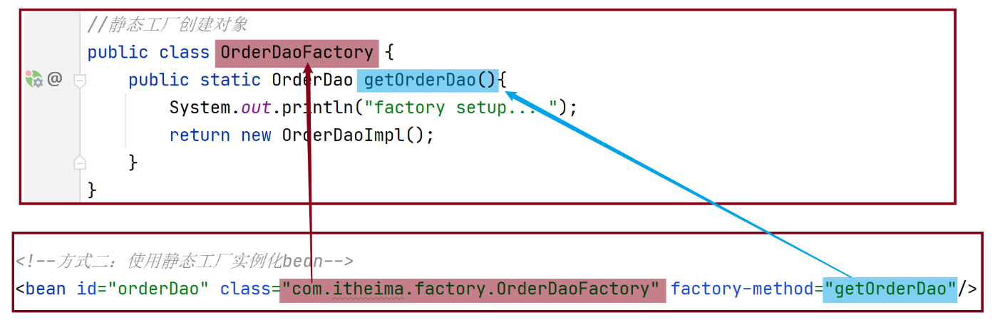
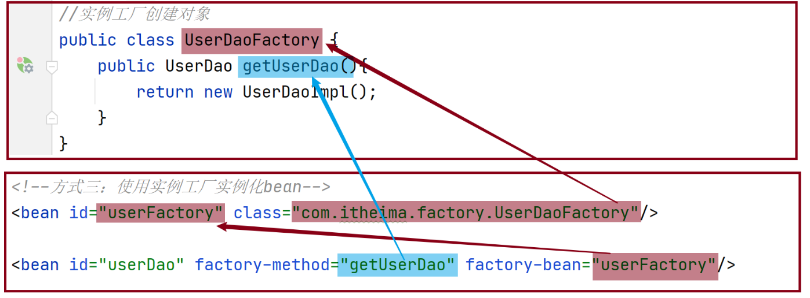

[toc]

# Spring笔记2-控制反转和依赖注入

## IOC容器中各项配置

<font color="red">

注意：
1. 在IOC容器中不能把接口作为bean对象。因为接口不能实例化为对象。所以必须要用接口的实现类来作为bean对象。
2. bean标签的id属性值在IOC容器中是唯一的，不能重复。

</font>

### bean的别名配置

```xml
<bean id="bookDao" name="dao" class="com.itheima.dao.impl.BookDaoImpl"/>

<!--name:为bean指定别名，别名可以有多个，使用逗号，分号，空格进行分隔-->
<bean id="bookService" name="service service1" class="com.itheima.service.impl.BookServiceImpl">
    <property name="bookDao" ref="bookDao"/> 
</bean>
```

* bean标签的name属性：为bean指定别名，别名可以有多个，使用逗号，分号，空格进行分隔。
* property标签的ref属性：指定某个对象并依赖注入。该属性值既可以是bean标签的id值也可是name值。

### bean的作用范围scope配置

```xml
<bean id="bookDao" class="com.itheima.dao.impl.BookDaoImpl" scope="singleton"/>
<bean id="bookService" class="com.itheima.dao.impl.BookDaoImpl" scope="prototype"/>
```

scope属性：默认为singleton(单例)，可选prototype(非单例)。可以控制IOC容器创建bean对象时是否为单例的。

#### singleton 作用域（默认）

当spring中的一个bean的作用域为 singleton 时，IOC的容器中只会存在一个共享的该bean的实例，并且所有对该bean的引用，只要id 与该bean的id 相符合，就只会返回bean的单一实例。

> singleton(单例)的优点：
1. 优点：bean为单例的意思是在Spring的IOC容器中只会有该类的一个对象
2. 优点：bean对象只有一个就避免了对象的频繁创建与销毁，达到了bean对象的复用，性能高。
3. 缺点：因为所有请求线程共用一个bean对象，所以会存在线程安全问题。


```xml
<bean id="school_card" class="com.entity.Schoolcard" scope="singleton">
	<property name="id" value="1"></property>
	<property name="name" value="xiaohuang"></property>
</bean>
```

```java
Schoolcard scard=(Schoolcard) app.getBean("school_card");	
Schoolcard scard2=(Schoolcard) app.getBean("school_card");	
System.out.println(scard==scard2);
// 运行结果为 true。
```

#### prototype 作用域

当spring中的一个bean的作用域为 prototype 时，IOC容器每次会创建一个新的bean对象实例来提供给使用者。

但是当bean创建完毕并将实例对象返回给使用者时，容器不在拥有该实例对象的引用，因此，必须使用bean的后置处理器清除prototype的bean。

```xml
<bean id="school_card" class="com.entity.Schoolcard" scope="prototype">
	<property name="id" value="1"></property>
	<property name="name" value="xiaohuang"></property>
</bean>
```

```java
Schoolcard scard=(Schoolcard) app.getBean("school_card");	
Schoolcard scard2=(Schoolcard) app.getBean("school_card");	
System.out.println(scard==scard2);
// 运行结果为 false。
```

### bean的实例化

IOC容器实例化bean对象有三种方式，构造方法,静态工厂和实例工厂。

#### 构造方法实例化bean

构造方法实例化，本质上就是IOC容器通过bean对象的构造方法来实现化bean对象

(1)步骤1:准备需要被创建的类，并给bean对象中添加无参构造方法

```java
public interface BookDao {
    public void save();
}
public class BookDaoImpl implements BookDao {
    public BookDaoImpl() {
        System.out.println("book dao constructor is running ....");
    }
    public void save() {
        System.out.println("book dao save ...");
    }
}
```

(2)步骤2:修改applicationContext.xml配置文件，将类配置到IOC容器中

```xml
<?xml version="1.0" encoding="UTF-8"?>
<beans xmlns="http://www.springframework.org/schema/beans"
       xmlns:xsi="http://www.w3.org/2001/XMLSchema-instance"
       xsi:schemaLocation="http://www.springframework.org/schema/beans http://www.springframework.org/schema/beans/spring-beans.xsd">

	<bean id="bookDao" class="com.itheima.dao.impl.BookDaoImpl"/>
</beans>
```

(3)步骤3:编写运行程序

```java
public class AppForInstanceBook {
    public static void main(String[] args) {
        ApplicationContext ctx = new ClassPathXmlApplicationContext("applicationContext.xml");
        BookDao bookDao = (BookDao) ctx.getBean("bookDao");
        bookDao.save();
    }
}
```

(4)步骤4:运行测试

```
运行结果：
book dao constructor is running ....
book dao save ...
```

<font color="red">总结：IOC容器实例化bean对象，默认使用的是bean的无参构造方法。如果bean对象没有无参构造方法，IOC容器实例化bean会报错。</font>

#### 静态工厂实例化bean

静态工厂实例化，本质上就是IOC容器通过第三方工厂类的静态方法来实现化bean对象

(1)准备一个OrderDao接口和OrderDaoImpl接口实现类

```java
//接口
public interface OrderDao {
    public void save();
}
//接口实现类
public class OrderDaoImpl implements OrderDao {
    public void save() {
        System.out.println("order dao save ...");
    }
}
```

(2)创建一个第三方工厂类OrderDaoFactory，类中提供一个静态方法,该静态方法用于new OrderDaoImpl对象。

```java
//静态工厂创建对象
public class OrderDaoFactory {
    public static OrderDao getOrderDao(){
        System.out.println("factory setup....");//模拟一些必要的业务操作
        return new OrderDaoImpl();
    }
}
```

(3)修改配置文件application.xml

```xml
<?xml version="1.0" encoding="UTF-8"?>
<beans xmlns="http://www.springframework.org/schema/beans"
       xmlns:xsi="http://www.w3.org/2001/XMLSchema-instance"
       xsi:schemaLocation="http://www.springframework.org/schema/beans http://www.springframework.org/schema/beans/spring-beans.xsd">

<bean id="orderDao" class="com.itheima.factory.OrderDaoFactory" factory-method="getOrderDao"/>

</beans>
```

* class:工厂类的类全名
* factory-mehod:工厂类中创建对象的方法名

> 对应关系如图所示




(4)编写启动类并运行测试
```java
public class AppForInstanceOrder {
    public static void main(String[] args) {
        ApplicationContext ctx = new ClassPathXmlApplicationContext("applicationContext.xml");
        OrderDao orderDao = (OrderDao) ctx.getBean("orderDao");
        orderDao.save();
    }
}
```

(5)运行后，可以查看到结果

```
order dao save ...
```

> 静态工厂实例化bean的优点：
1. 在工厂类的静态方法中，除了new对象还可以做其他的一些业务操作，例如:
```java
public class OrderDaoFactory {
    public static OrderDao getOrderDao(){
        System.out.println("factory setup....");//模拟一些必要的业务操作
        return new OrderDaoImpl();
    }
}
```

#### 实例工厂实例化bean

实例工厂实例化，本质上就是IOC容器通过第三方工厂类的静态方法来实现化bean对象

(1)准备一个UserDao和UserDaoImpl类

```java
public interface UserDao {
    public void save();
}
public class UserDaoImpl implements UserDao {
    public void save() {
        System.out.println("user dao save ...");
    }
}
```

(2)创建一个工厂类OrderDaoFactory并提供一个普通方法。

<font color="red">注意此处和静态工厂的工厂类不一样的地方是方法不是静态方法</font>

```java
public class UserDaoFactory {
    public UserDao getUserDao(){
        return new UserDaoImpl();
    }
}
```

(3)在配置文件中添加以下内容:

```xml
<?xml version="1.0" encoding="UTF-8"?>
<beans xmlns="http://www.springframework.org/schema/beans"
       xmlns:xsi="http://www.w3.org/2001/XMLSchema-instance"
       xsi:schemaLocation="http://www.springframework.org/schema/beans http://www.springframework.org/schema/beans/spring-beans.xsd">

<bean id="userFactory" class="com.itheima.factory.UserDaoFactory"/>
<bean id="userDao" factory-method="getUserDao" factory-bean="userFactory"/>

</beans>

```

* factory-bean:实例化工厂对于的bean对象
* factory-method:工厂中的方法名

> 对应关系如图所示



(4)编写测试运行类，在类中通过工厂获取对象

```java
public class AppForInstanceUser {
    public static void main(String[] args) {
        ApplicationContext ctx = new ClassPathXmlApplicationContext("applicationContext.xml");
        UserDao userDao = (UserDao) ctx.getBean("userDao");
        userDao.save();
    }
}
```

(4)运行后，可以查看到结果，说明IOC已经将对象实例化出来了。
```
user dao save ...
```

### bean的生命周期

* bean创建之后，想要添加内容，比如用来初始化需要用到资源
* bean销毁之前，想要添加内容，比如用来释放用到的资源

(1)项目中添加BookDao、BookDaoImpl、BookService和BookServiceImpl类

```java
public interface BookDao {
    public void save();
}
public class BookDaoImpl implements BookDao {
    public void save() {
        System.out.println("book dao save ...");
    }
    //表示bean初始化对应的操作，需要在配置文件中具体指明
    public void init(){
        System.out.println("init...");
    }
    //表示bean销毁前对应的操作，需要在配置文件中具体指明
    public void destory(){
        System.out.println("destory...");
    }
}
```

(2)修改配置文件

```xml
<!--
	在bean 中声明并设置init-method ，destroy-method。
	为bean指定创建 和 销毁的方法
-->
<bean id="bookDao" class="com.itheima.dao.impl.BookDaoImpl" init-method="init" destroy-method="destory"/>
```
* init-method: bean初始化方法
* destroy-method：bean销毁方法

(3)编写AppForLifeCycle运行类，加载Spring的IOC容器，并从中获取对应的bean对象

```java
public class AppForLifeCycle {
    public static void main( String[] args ) {
        // ApplicationContext中没有close方法
        // ApplicationContext ctx = new ClassPathXmlApplicationContext("applicationContext.xml");
        ClassPathXmlApplicationContext ctx = new ClassPathXmlApplicationContext("applicationContext.xml");
        BookDao bookDao = (BookDao) ctx.getBean("bookDao");
        bookDao.save();
        ctx.close(); //关闭ioc容器
    }
}
```

* 此处不能使用ApplicationContext获取IOC容器，该类没有关闭容器方法。无法触发销毁容器中的bean对象。所以使用ClassPathXmlApplicationContext类。

(4)运行结果
```
init...
book dao save ...
destory...
```

(5)bean生命周期小结

bean的生命周期如下:
* 初始化容器
  * 1.创建对象(内存分配)
  * 2.执行构造方法
  * 3.执行属性注入(set操作)
  * 4.执行bean初始化方法
* 使用bean
  * 1.执行业务操作
* 关闭/销毁容器
  * 1.执行bean销毁方法


## DI依赖注入各项配置

依赖注入可以为容器中bean与bean之间的建立依赖关系。

依赖注入主要有两种注入方式：属性注入（setter注入），构造器注入。

* 属性注入通过setter方法来给bean对象注入属性值或其他依赖对象。

### setter注入引用数据类型

(1)项目中添加类
```java
// 接口
public interface BookService {
    public void save();
}

// 接口实现类
public class BookServiceImpl implements BookService{
    private BookDao bookDao;
    public void setBookDao(BookDao bookDao) {
        this.bookDao = bookDao;
    }
    public void save() {
        System.out.println("book service save ...");
        bookDao.save();
    }
}
```

(2)修改配置文件

```xml
<bean id="bookDao" class="com.itheima.dao.impl.BookDaoImpl"/>
<bean id="bookService" class="com.itheima.service.impl.BookServiceImpl">
    <property name="bookDao" ref="bookDao"/>
</bean>
```

在标签`<property>`中
* name="bookDao"的作用是让IOC容器在获取到名称后，将首字母大写，前面加set找对应的setBookDao()方法进行对象注入。
* ref="bookDao"的作用是让Spring能在IOC容器中找到id为bookDao的Bean对象注入到bookService对象中。ref 属性表示被引用的bean。

### setter注入基本数据类型

```java
public class BookDaoImpl implements BookDao {
    private String databaseName;
    private int connectionNum;
    public void setConnectionNum(int connectionNum) {
        this.connectionNum = connectionNum;
    }
    public void setDatabaseName(String databaseName) {
        this.databaseName = databaseName;
    }
    public void save() {
        System.out.println("book dao save ..."+databaseName+","+connectionNum);
    }
}
```

```xml
<bean id="bookDao" class="com.itheima.dao.impl.BookDaoImpl">
    <property name="databaseName" value="mysql"/>
    <property name="connectionNum" value="10"/>
</bean>

<!--其他例子，给student对象的name属性，注入数值 -->
<bean id="student" class="com.entity.Student">
  	<property name="name" value="xiaobing"/>
</bean>
```

* value:后面跟的是简单数据类型，Spring在注入的时候会自动转换。

但是不能写为下面的样子。因为spring在将`abc`转换成int类型的时候就会报错。
```xml
<property name="connectionNum" value="abc"/>
```

### 构造方法注入引用数据类型

```java
public class BookServiceImpl implements BookService{
    private BookDao bookDao;
    private UserDao userDao;

    public BookServiceImpl(BookDao bookDao,UserDao userDao) {
        this.bookDao = bookDao;
        this.userDao = userDao;
    }
}
```

在applicationContext.xml中配置注入
```xml
<bean id="bookDao" class="com.itheima.dao.impl.BookDaoImpl"/>
<bean id="userDao" class="com.itheima.dao.impl.UserDaoImpl"/>
<bean id="bookService" class="com.itheima.service.impl.BookServiceImpl">
    <constructor-arg name="bookDao" ref="bookDao"/>
    <constructor-arg name="userDao" ref="userDao"/>
</bean>
```

在标签`<constructor-arg>`中
* name属性对应的值为构造函数中方法形参的参数名，必须要保持一致。
* ref属性指向的是IOC容器中其他bean对象。

### 构造方法注入基本数据类型

```java
public class BookDaoImpl implements BookDao {
    private String databaseName;
    private int connectionNum;
    public BookDaoImpl(String databaseName, int connectionNum) {
        this.databaseName = databaseName;
        this.connectionNum = connectionNum;
    }
}
```

在applicationContext.xml中进行注入配置

```xml
<bean id="bookDao" class="com.itheima.dao.impl.BookDaoImpl">
    <constructor-arg name="databaseName" value="mysql"/>
    <constructor-arg name="connectionNum" value="666"/>
</bean>
```

在标签`<constructor-arg>`中
* name属性对应的值为构造函数中方法形参的参数名，必须要保持一致。
* value属性为要注入的数值。


## 自动装配

自动装配：IoC容器根据bean所依赖的资源，在IOC容器中自动查找并注入到bean对象中的过程称为自动装配。

自动装配方式以下几种：
* 按类型（常用）
* 按名称
* 按构造方法

自动装配默认是不开启的。

### 按类型自动装配 byType

按类型自动装配是指IOC容器根据类型自动装配。

<font color="red">注意：若ioc容器中有多个与目标bean类型一致的bean对象，在这种情况下，spring无法判定，不能执行自动装配。</font>

```java
public interface BookService {
    public void save();
}
public class BookServiceImpl implements BookService{
    private BookDao bookDao;

    public void setBookDao(BookDao bookDao) {
        this.bookDao = bookDao;
    }

    public void save() {
        System.out.println("book service save ...");
        bookDao.save();
    }
}
```

修改applicationContext.xml配置文件

```xml
<bean id="bookDao" class="com.itheima.dao.impl.BookDaoImpl"/>
<!-- <bean id="bookService" class="com.itheima.service.impl.BookServiceImpl">
    <property name="bookDao" ref="bookDao"/>
</bean> -->

<!-- 这处bean标签与上面注释的bean标签功能相同 -->
<!--autowire属性：开启自动装配，通常使用按类型装配-->
<bean id="bookService" class="com.itheima.service.impl.BookServiceImpl" autowire="byType"/>
```

1. autowire="byType"意思是先根据bean对象中的setter方法名称来查询IOC容器中是否有可注入依赖对象。
2. 然后IOC容器查询到setBookDao方法，根据方法的参数来查询容器中是否相同类型的bean对象。
3. 查到后，将该bean对象注入到bookService中。

> 按类型装配注意事项

* setter方法不能省略
* 依赖对象必须要被IOC容器管理
* 若IOC容器按照类型在IOC容器中找到多个对象，会报`NoUniqueBeanDefinitionException`

### 按名称自动装配 byName

```java
public interface BookService {
    public void save();
}
public class BookServiceImpl implements BookService{
    private BookDao bookDao;

    public void setBookDao(BookDao bookDao) {
        this.bookDao = bookDao;
    }

    public void save() {
        System.out.println("book service save ...");
        bookDao.save();
    }
}
```

```xml
<bean id="bookDao" class="com.itheima.dao.impl.BookDaoImpl"/>
<!--autowire属性：开启自动装配-->
<bean id="bookService" class="com.itheima.service.impl.BookServiceImpl" autowire="byName"/>
```

autowire="byName"会根据setter方法名称，来查询IOC容器中是否有可注入依赖对象

### 按构造方法自动装配

```java
public class BookServiceImpl implements BookService{
    private BookDao bookDao;
    private UserDao userDao;
    public BookServiceImpl(BookDao bookDao,UserDao userDao) {
        this.bookDao = bookDao;
        this.userDao = userDao;
    }
}
```

在applicationContext.xml中配置注入
```xml
<bean id="bookDao" class="com.itheima.dao.impl.BookDaoImpl"/>
<bean id="userDao" class="com.itheima.dao.impl.UserDaoImpl"/>
<!--autowire属性：开启constructor自动装配-->
<bean id="bookService" class="com.itheima.service.impl.BookServiceImpl" autowire="constructor">
</bean>
```

autowire="constructor" 根据构造方法的参数来从IOC容器中找到注入依赖对象。

### 自动装配总结

1. 自动装配用于引用类型依赖注入，不能对简单类型进行操作
2. 使用按类型装配时（byType）必须保障容器中相同类型的bean唯一，推荐使用
3. 使用按名称装配时（byName）必须保障容器中具有指定名称的bean，因变量名与配置耦合，不推荐使用
4. 自动装配优先级低于setter注入与构造器注入，同时出现时自动装配配置失效。

## spring读取外部属性文件(properties文件)

Spring框架如何读取properties配置文件中的数据，并用于IOC容器的创建。

①添加mysql驱动jar包，创建jdbc.properties属性文件

```
jdbc.driver=com.mysql.jdbc.Driver 
jdbc.url=jdbc:mysql://127.0.0.1:3306/spring_db 
jdbc.username=root 
jdbc.password=root
```

②在applicationContext.xml中使用`context`标签，先加载jdbc.properties配置文件
```xml
<?xml version="1.0" encoding="UTF-8"?>
<beans xmlns="http://www.springframework.org/schema/beans"
       xmlns:xsi="http://www.w3.org/2001/XMLSchema-instance"
       xmlns:context="http://www.springframework.org/schema/context"
       xsi:schemaLocation="
            http://www.springframework.org/schema/beans
            http://www.springframework.org/schema/beans/spring-beans.xsd
            http://www.springframework.org/schema/context
            http://www.springframework.org/schema/context/spring-context.xsd">
    <!--加载jdbc.properties配置文件-->
    <context:property-placeholder location="jdbc.properties"/>
</beans>
```

③ 属性注入
使用`${key}`来读取jdbc.properties配置文件中的内容并完成属性注入
```xml
<?xml version="1.0" encoding="UTF-8"?>
<beans xmlns="http://www.springframework.org/schema/beans"
       xmlns:xsi="http://www.w3.org/2001/XMLSchema-instance"
       xmlns:context="http://www.springframework.org/schema/context"
       xsi:schemaLocation="
            http://www.springframework.org/schema/beans
            http://www.springframework.org/schema/beans/spring-beans.xsd
            http://www.springframework.org/schema/context
            http://www.springframework.org/schema/context/spring-context.xsd">
    <!-- 先加载properties文件 -->
    <context:property-placeholder location="jdbc.properties"/>
    <!--此处需要先在maven导入Druid依赖,否则找不到该类-->
    <bean id="dataSource" class="com.alibaba.druid.pool.DruidDataSource">
        <property name="driverClassName" value="${jdbc.driver}"/>
        <property name="url" value="${jdbc.url}"/>
        <property name="username" value="${jdbc.username}"/>
        <property name="password" value="${jdbc.password}"/>
    </bean>
</beans>
```

④ 从IOC容器中获取对应的bean对象

```java
public class App {
    public static void main(String[] args) {
       ApplicationContext ctx = new ClassPathXmlApplicationContext("applicationContext.xml");
       DataSource dataSource = (DataSource) ctx.getBean("dataSource");
       System.out.println(dataSource);
    }
}
```

至此，读取外部配置文件properties中的内容就已经完成。

### Spring加载properties文件，但是不加载系统属性

```xml
<context:property-placeholder location="jdbc.properties"/>
<bean id="bookDao" class="com.itheima.dao.impl.BookDaoImpl"> 
    <property name="name" value="${username}"/>
</bean>
```
`<context:property-placeholder/>`标签会优先加载系统环境变量。当username属性同时存在系统变量和properties文件时，会优先读取系统变量中的username属性值。

解决方法：
```xml
<!--system-properties-mode:设置为NEVER,表示不加载系统变量属性-->
<context:property-placeholder location="jdbc.properties" system-properties-mode="NEVER"/>
```

### Spring如何同时加载多个properties文件？

```xml
<?xml version="1.0" encoding="UTF-8"?>
<beans xmlns="http://www.springframework.org/schema/beans"
        xmlns:xsi="http://www.w3.org/2001/XMLSchema-instance"
        xmlns:context="http://www.springframework.org/schema/context"
        xsi:schemaLocation="
            http://www.springframework.org/schema/beans
            http://www.springframework.org/schema/beans/spring-beans.xsd
            http://www.springframework.org/schema/context
            http://www.springframework.org/schema/context/spring-context.xsd">
    <!--方式一 -->
    <context:property-placeholder location="jdbc.properties,jdbc2.properties" system-properties-mode="NEVER"/>
    <!--方式二-->
    <context:property-placeholder location="*.properties" system-properties-mode="NEVER"/>
    <!--方式三 -->
    <context:property-placeholder location="classpath:*.properties" system-properties-mode="NEVER"/>
    <!--方式四-->
    <context:property-placeholder location="classpath*:*.properties" system-properties-mode="NEVER"/>
</beans>	
```

说明:
* 方式一:可以实现，如果配置文件多的话，每个都需要配置
* 方式二:`*.properties`代表所有以properties结尾的文件都会被加载，可以解决方式一的问题，但是不标准
* 方式三:标准的写法，`classpath:`代表的是从根路径下开始查找，但是只能查询当前项目的根路径
* 方式四:不仅可以加载当前项目还可以加载当前项目所依赖的所有项目的根路径下的properties配置文件


