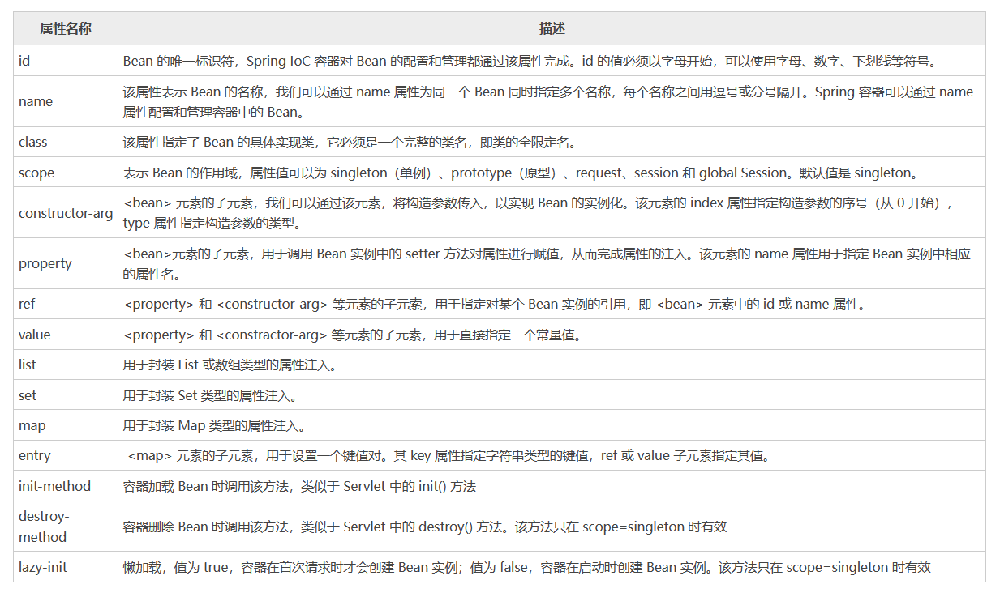
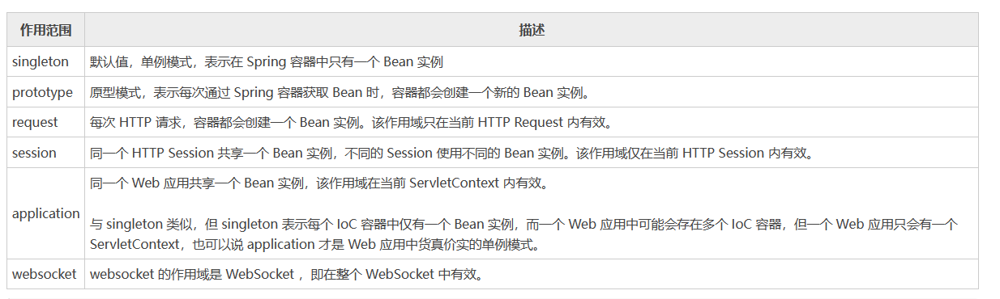
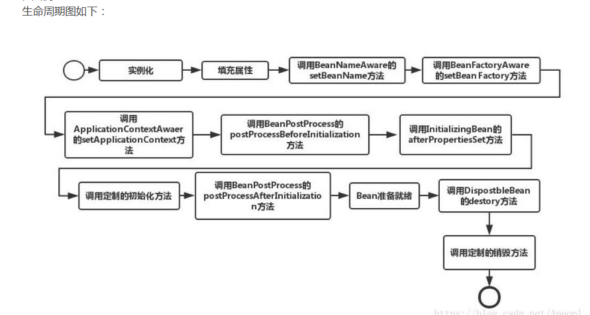
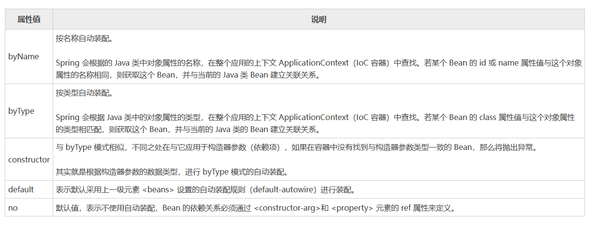
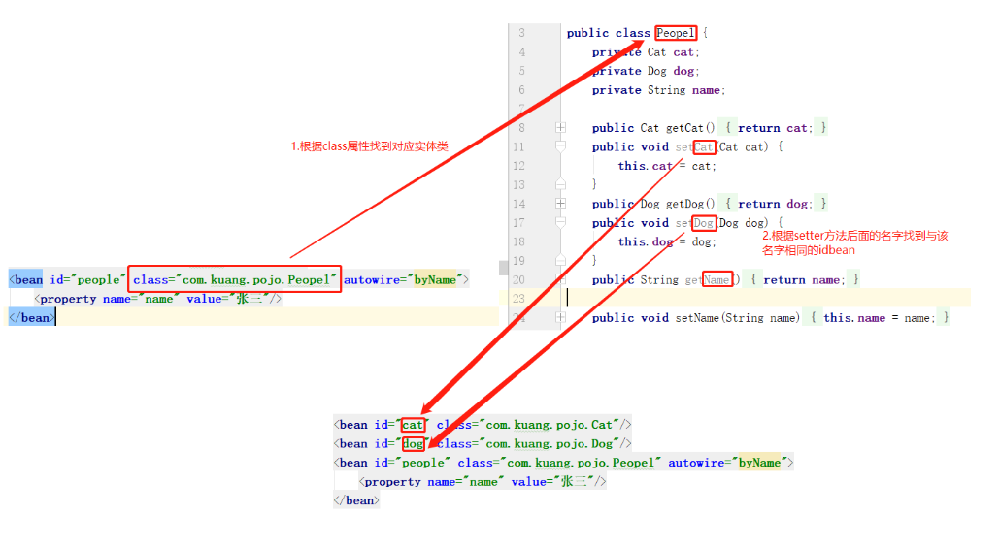
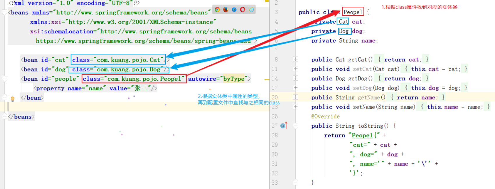
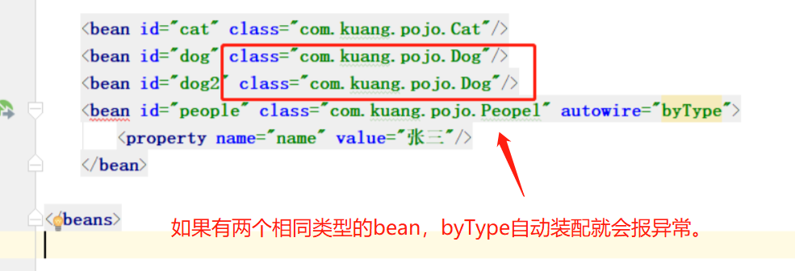

[toc]

# Spring笔记2-控制反转和依赖注入

Spring Framework 最重要的两个核心概念IOC和DI。

IOC（控制反转）：spring负责创建所有的Java对象，这些Java对象被称为Java Bean对象。使用对象时，程序不主动new对象，由Spring来提供对象。

DI（依赖注入）：Spring负责管理对象与对象之间的依赖关系。而不是在程序中以编码的方式将对象与对象耦合在一起。

下面介绍如何进行控制反转和依赖注入。控制反转涉及到IOC容器中bean的定义和实例化。依赖注入涉及到IOC容器中bean之间的注入和自动装配。

## Bean 对象

### Bean 对象的介绍

Bean对象是 IOC 容器根据 Spring 配置文件中的信息创建的。

通常情况下，Spring 的配置文件都是使用 XML 格式的。XML 配置文件的根元素是 `<beans>`，该元素包含了多个子元素 `<bean>`。每一个 `<bean>` 元素相当于一个 Bean对象，并描述了该 Bean对象 是如何被装配到 Spring 容器中的。


例如 applicationContext.xml配置文件
```xml
<?xml version="1.0" encoding="UTF-8"?>
<beans xmlns="http://www.springframework.org/schema/beans"
       xmlns:xsi="http://www.w3.org/2001/XMLSchema-instance"
       xsi:schemaLocation="http://www.springframework.org/schema/beans http://www.springframework.org/schema/beans/spring-beans.xsd">

    <!--bookDao bean对象-->
    <bean id="bookDao" class="com.itheima.dao.impl.BookDaoImpl"/>

    <!--bookService bean对象-->
    <bean id="bookService" class="com.itheima.service.impl.BookServiceImpl">
        <!--配置bookService与bookDao的依赖关系-->
        <!--property标签表示配置当前bean的属性
        		name属性表示配置哪一个具体的属性
        		ref属性表示参照哪一个bean
		-->
        <property name="bookDao" ref="bookDao"/>
    </bean>

</beans>
```

> `<bean>`元素标签的常用属性或子元素如图所示




<font color="red">

注意：
1. IOC容器不能把接口作为bean对象。因为接口不能实例化为对象。所以必须要用实体类或者接口的实现类来作为bean对象。
2. bean标签的id属性值在IOC容器中是唯一的，不能重复。

</font>

### Bean的别名 name属性

name属性是 Bean 元素标签的属性之一，可以通过 name 属性为同一个 Bean 同时指定多个名称，每个名称之间用逗号或分号隔开。IOC 容器可以通过 name 属性配置和管理容器中的 Bean。

```xml
<bean id="bookDao" name="book_dao" class="com.itheima.dao.impl.BookDaoImpl"/>

<!--name:为bean指定别名，别名可以有多个，使用逗号，分号，空格进行分隔-->
<bean id="bookService" name="service service1" class="com.itheima.service.impl.BookServiceImpl">
    <property name="bookDao" ref="book_dao"/> 
</bean>
```

* bean标签的name属性：为bean指定别名，别名可以有多个，使用逗号，分号，空格进行分隔。
* property标签的ref属性：指定某个对象并依赖注入。该属性值既可以是bean标签的id值也可是name值。


### Bean的作用域 scope 属性

scope 是 Bean 元素标签的子属性之一。表示 Bean 的作用域。Spring 5 共提供了 6 种 scope 作用域。如下图所示。




默认情况下，scope的属性值是 singleton（单例）。也就是说在整个 Spring 应用中， 一种 Bean对象 的实例只有一个。

注意：在以上 6 种 Bean 作用域中，除了 singleton 和 prototype 可以直接在常规的 IoC 容器（例如 ClassPathXmlApplicationContext）中使用外，剩下的都只能在基于 Web 的 ApplicationContext 实现（例如 XmlWebApplicationContext）IOC 容器中才能使用，否则就会抛出一个 IllegalStateException 的异常。


#### singleton 作用域（默认）

当 Bean 的作用域为 singleton 时，Spring IoC 容器中只会存在一个共享的 Bean 实例。所有对于这个 Bean 的请求和引用，都会返回这个bean实例。

> singleton(单例)的优点：
1. 优点：bean为单例的意思是在Spring的IOC容器中只会有该类的一个对象
2. 优点：bean对象只有一个就避免了对象的频繁创建与销毁，节省了重复创建对象的开销。
3. 缺点：因为所有请求线程共用一个bean对象，所以会存在线程安全问题。

> 配置方式如下
```xml
<bean id="school_card" class="com.entity.Schoolcard" scope="singleton"/>
```

> 测试代码如下
```java
ApplicationContext app = new ClassPathXmlApplicationContext("applicationContext.xml");
Schoolcard scard=(Schoolcard) app.getBean("school_card");	
Schoolcard scard2=(Schoolcard) app.getBean("school_card");	
System.out.println(scard);
System.out.println(scard2);
// 运行结果为
// com.entity.Schoolcard@65e2dbf3
// com.entity.Schoolcard@65e2dbf3
```

两个 Bean 实例的地址完全一样，这说明 IoC 容器只创建了一个实例。

#### prototype 作用域

当一个bean的作用域为 prototype 时，IOC容器每次会创建一个新的bean对象实例来提供给使用者。prototype作用域相当于new操作符。

注意：当bean创建完毕并将实例对象返回给使用者时，容器不在拥有该实例对象的引用，因此，必须使用bean的后置处理器清除prototype的bean。

> 配置方式如下
```xml
<bean id="school_card" class="com.entity.Schoolcard" scope="prototype">
</bean>
```

> 测试代码如下
```java
Schoolcard scard=(Schoolcard) app.getBean("school_card");	
Schoolcard scard2=(Schoolcard) app.getBean("school_card");	
System.out.println(scard);
System.out.println(scard2);
// 运行结果为
// com.entity.Schoolcard@61f8bee4
// com.entity.Schoolcard@65e2dbf3
```

两个 Bean 实例的地址不一样，这说明 IoC 容器创建两个不同的实例。

#### request 作用域

该属性仅对HTTP请求产生作用，使用该属性定义Bean的作用域时，每次HTTP请求,IOC容器都会创建一个新的Bean对象，适用于WebApplicationContext环境。

#### session 作用域

该属性仅用于HTTP Session，同一个Session共享一个Bean实例。不同Session使用不同的实例。

#### global-session 作用域

该属性仅用于HTTP Session,同session作用域不同的是，所有的Session共享一个Bean实例。


### bean的生命周期

> bean的生命周期的过程如下

* 首先IOC容器开始运行。通过构造器或工厂方法创建Bean实例，
* 给bean设置属性值和对其他bean的引用
* 把bean实例传给bean的前置处理器postProcessBeforeInitiallization方法处理
* 调用bean的初始化方法init-method
* 把bean实例传给bean的前置处理器postProcessAfterInitiallization方法处理
* 此时bean可以使用，把bean放到IOC容器中
* 当ioc容器关闭时，会调用bean的销毁方法destory-method



> 配置bean生命周期的属性

init-method属性和destroy-method属性分别是`<bean>`元素标签的属性。

* init-method :容器加载 Bean 时调用该方法，类似于 Servlet 中的 init() 方法
* destroy-method : 容器删除 Bean 时调用该方法，类似于 Servlet 中的 destroy() 方法。该属性只在 scope=singleton 时有效

> 例子

(1)项目中添加BookDao、BookDaoImpl、BookService和BookServiceImpl类

```java
public interface BookDao {
    public void save();
}
public class BookDaoImpl implements BookDao {
    public void save() {
        System.out.println("book dao save ...");
    }
    //表示bean初始化对应的操作，需要在配置文件中具体指明
    public void init(){
        System.out.println("init...");
    }
    //表示bean销毁前对应的操作，需要在配置文件中具体指明
    public void destory(){
        System.out.println("destory...");
    }
}
```

(2)修改配置文件

```xml
<!--
	在bean 中声明并设置init-method ，destroy-method。
	为bean指定创建 和 销毁的方法
-->
<bean id="bookDao" class="com.itheima.dao.impl.BookDaoImpl" init-method="init" destroy-method="destory"/>
```
* init-method: bean初始化方法
* destroy-method：bean销毁方法

(3)编写Test运行类，加载Spring的IOC容器，并从中获取对应的bean对象

```java
public class Test {
    public static void main( String[] args ) {
        // ApplicationContext中没有close方法
        // ApplicationContext ctx = new ClassPathXmlApplicationContext("applicationContext.xml");
        ClassPathXmlApplicationContext ctx = new ClassPathXmlApplicationContext("applicationContext.xml");
        BookDao bookDao = (BookDao) ctx.getBean("bookDao");
        bookDao.save();
        ctx.close(); //关闭ioc容器
    }
}
```

* 此处不能使用ApplicationContext获取IOC容器，该类没有关闭容器方法。无法触发销毁容器中的bean对象。因此使用ClassPathXmlApplicationContext类。

(4)运行结果
```
init...
book dao save ...
destory...
```

init-method绑定的方法为初始化方法，在bean对象初始化的时候运行。destroy-method绑定的方法为销毁方法，在bean对象销毁的时候运行。


## Bean对象的实例化

当Spring应用程序启动的时候，IOC容器会加载并解析配置文件。通过读取配置文件上的信息，来实例化Bean对象。

IOC容器实例化bean对象有三种方式，构造方法,静态工厂和实例工厂。

### 构造方法实例化bean

构造方法实例化，本质上就是IOC容器通过调用bean对象的构造方法来实例化bean对象

(1)步骤1:准备需要被创建的类，并给bean对象中添加无参构造方法

```java
public interface BookDao {
    public void save();
}
public class BookDaoImpl implements BookDao {
    public BookDaoImpl() {
        System.out.println("book dao constructor is running ....");
    }
    public void save() {
        System.out.println("book dao save ...");
    }
}
```

(2)步骤2:修改applicationContext.xml配置文件，将类配置到IOC容器中

```xml
<?xml version="1.0" encoding="UTF-8"?>
<beans xmlns="http://www.springframework.org/schema/beans"
       xmlns:xsi="http://www.w3.org/2001/XMLSchema-instance"
       xsi:schemaLocation="http://www.springframework.org/schema/beans http://www.springframework.org/schema/beans/spring-beans.xsd">

    <!--xml配置文件中的bean对象信息-->
	<bean id="bookDao" class="com.itheima.dao.impl.BookDaoImpl"/>
</beans>
```

(3)步骤3:编写运行程序

```java
public class AppForInstanceBook {
    public static void main(String[] args) {
        ApplicationContext ctx = new ClassPathXmlApplicationContext("applicationContext.xml");
        BookDao bookDao = (BookDao) ctx.getBean("bookDao");
        bookDao.save();
    }
}
```

(4)步骤4:运行测试

```
运行结果：
book dao constructor is running ....
book dao save ...
```

<font color="red">总结：由运行结果可知，IOC容器实例化一个bean对象，默认使用的是bean对象的无参构造方法。如果bean对象没有无参构造方法，IOC容器实例化bean对象会报错。</font>

### 静态工厂实例化bean

静态工厂实例化，本质上就是IOC容器通过第三方工厂类的静态方法来实例化bean对象

(1)准备一个OrderDao接口和OrderDaoImpl接口实现类

```java
//接口
public interface OrderDao {
    public void save();
}
//接口实现类
public class OrderDaoImpl implements OrderDao {
    public void save() {
        System.out.println("order dao save ...");
    }
}
```

(2)创建一个第三方工厂类OrderDaoFactory，类中提供一个静态方法,该静态方法用于new OrderDaoImpl对象。

```java
//静态工厂创建对象
public class OrderDaoFactory {
    public static OrderDao getOrderDao(){
        System.out.println("factory setup....");//模拟一些必要的业务操作
        return new OrderDaoImpl();
    }
}
```

(3)修改配置文件application.xml

```xml
<?xml version="1.0" encoding="UTF-8"?>
<beans xmlns="http://www.springframework.org/schema/beans"
       xmlns:xsi="http://www.w3.org/2001/XMLSchema-instance"
       xsi:schemaLocation="http://www.springframework.org/schema/beans http://www.springframework.org/schema/beans/spring-beans.xsd">

<!--factory-method属性 指向工厂类的静态方法-->
<bean id="orderDao" class="com.itheima.factory.OrderDaoFactory" factory-method="getOrderDao"/>

</beans>
```

* class:工厂类的类全名
* factory-mehod:指向工厂类中静态方法名称，该静态方法用于创建bean对象。

> 对应关系如图所示


(4)编写启动类并运行测试
```java
public class AppForInstanceOrder {
    public static void main(String[] args) {
        ApplicationContext ctx = new ClassPathXmlApplicationContext("applicationContext.xml");
        OrderDao orderDao = (OrderDao) ctx.getBean("orderDao");
        orderDao.save();
    }
}
```

(5)运行后，可以查看到结果

```
order dao save ...
```

> 静态工厂实例化bean的优点：
1. 在工厂类的静态方法中，除了new对象还可以做其他的一些业务操作。
```java
public class OrderDaoFactory {
    public static OrderDao getOrderDao(){
        System.out.println("factory setup....");//模拟一些必要的业务操作
        return new OrderDaoImpl();
    }
}
```

### 实例工厂实例化bean

实例工厂实例化，本质上就是IOC容器通过第三方工厂类的方法来实现化bean对象

(1)准备一个UserDao和UserDaoImpl类

```java
public interface UserDao {
    public void save();
}
public class UserDaoImpl implements UserDao {
    public void save() {
        System.out.println("user dao save ...");
    }
}
```

(2)创建一个工厂类OrderDaoFactory并提供一个普通方法。该方法用于new 一个bean对象。

<font color="red">注意此处和静态工厂的工厂类不一样的地方是方法不是静态方法</font>

```java
public class UserDaoFactory {
    public UserDao getUserDao(){
        return new UserDaoImpl();
    }
}
```

(3)在配置文件中添加以下内容:

```xml
<?xml version="1.0" encoding="UTF-8"?>
<beans xmlns="http://www.springframework.org/schema/beans"
       xmlns:xsi="http://www.w3.org/2001/XMLSchema-instance"
       xsi:schemaLocation="http://www.springframework.org/schema/beans http://www.springframework.org/schema/beans/spring-beans.xsd">

<bean id="userFactory" class="com.itheima.factory.UserDaoFactory"/>
<bean id="userDao" factory-method="getUserDao" factory-bean="userFactory"/>

</beans>

```

* factory-bean:实例化工厂对于的bean对象
* factory-method:工厂中的方法名

> 对应关系如图所示


(4)编写测试运行类，在类中通过工厂获取对象

```java
public class AppForInstanceUser {
    public static void main(String[] args) {
        ApplicationContext ctx = new ClassPathXmlApplicationContext("applicationContext.xml");
        UserDao userDao = (UserDao) ctx.getBean("userDao");
        userDao.save();
    }
}
```

(4)运行后，可以查看到结果，说明IOC已经将对象实例化出来了。
```
user dao save ...
```


## Bean 依赖注入

当IOC容器根据配置文件创建完Bean对象后，IOC容器还需要根据配置文件来为Bean对象之间建立依赖关系。这个过程称为依赖注入。

简单点说，依赖注入就是将属性注入到 Bean 中的过程，而这属性既可以普通属性，也可以是一个对象（Bean）。

依赖注入主要有两种注入方式：setter注入，构造器注入。

### 构造器注入

构造器注入的大致步骤如下：
1. 在 Bean 中添加一个有参构造函数，有参构造函数内的每一个参数代表一个需要注入的属性；
2. 在 XML 配置文件中，对 Bean 进行定义；使用 `<constructor-arg>` 元素，对构造函数内的属性进行赋值，有参构造函数内有多少参数，就需要使用多少个 `<constructor-arg>` 元素。

#### 构造方法注入基本数据类型

```java
public class BookDaoImpl implements BookDao {
    private String databaseName;
    private int connectionNum;
    // 有参构造方法，形参为基本数据类型
    public BookDaoImpl(String databaseName, int connectionNum) {
        this.databaseName = databaseName;
        this.connectionNum = connectionNum;
    }
}
```

在applicationContext.xml中进行配置
```xml
<bean id="bookDao" class="com.itheima.dao.impl.BookDaoImpl">
    <constructor-arg name="databaseName" value="mysql"/>
    <constructor-arg name="connectionNum" value="666"/>
</bean>
```

在标签`<constructor-arg>`中
* name属性对应的值为构造方法形参的参数名称，必须要保持一致。
* value属性为要注入的数值。

#### 构造方法注入引用数据类型

```java
public class BookServiceImpl implements BookService{
    private BookDao bookDao;
    private UserDao userDao;
    // 有参构造方法，形参为引用数据类型
    public BookServiceImpl(BookDao bookDao,UserDao userDao) {
        this.bookDao = bookDao;
        this.userDao = userDao;
    }
}
```

在applicationContext.xml中进行配置
```xml
<bean id="bookDao" class="com.itheima.dao.impl.BookDaoImpl"/>
<bean id="userDao" class="com.itheima.dao.impl.UserDaoImpl"/>
<bean id="bookService" class="com.itheima.service.impl.BookServiceImpl">
    <constructor-arg name="bookDao" ref="bookDao"/>
    <constructor-arg name="userDao" ref="userDao"/>
</bean>
```

在标签`<constructor-arg>`中
* name属性对应的值为构造函数中方法形参的参数名，必须要保持一致。
* ref属性指向的是IOC容器中其他bean对象。

### setter注入

setter注入通过 Bean 的 setter 方法，将属性值注入到 Bean 的属性中。

> setter注入 使用方式如下

```xml
<bean id="bookDao" class="com.xxx.xxxx">
    <!--这是setter注入基础数据类型，需要使用value属性-->
    <property name="username" value="mysql"/>
    <!--这是setter注入引用数据类型，需要使用ref属性-->
    <property name="xxx" ref="bookDao"/>
</bean>
```

> setter注入的流程如下
1. 首先找到bean元素的子元素property。
2. 获取property元素标签的name属性。将其首字母大写，加上set。例如上面的databaseName变成setDatabaseName。
3. 然后从bean对象中找到是否有这个setter方法。找到后就把property元素标签的value属性或ref属性值，注入到setter方法形参中。
4. 如果找不到setter方法，就报空指针异常。

#### setter注入基本数据类型

```java
public class BookDaoImpl implements BookDao {
    private String databaseName;
    private int connectionNum;
    //set方法
    public void setConnectionNum(int connectionNum) {
        this.connectionNum = connectionNum;
    }
    //set方法
    public void setDatabaseName(String databaseName) {
        this.databaseName = databaseName;
    }
    public void save() {
        System.out.println("book dao save ..."+databaseName+","+connectionNum);
    }
}
```

在applicationContext.xml中进行配置
```xml
<bean id="bookDao" class="com.itheima.dao.impl.BookDaoImpl">
    <property name="databaseName" value="mysql"/>
    <property name="connectionNum" value="10"/>
</bean>
```

* name是bean对象的属性名称。
* value是要注入给属性的数值。Spring在注入的时候会自动转换。但是不能写为下面的样子。因为spring在将`abc`转换成int类型的时候就会报错。

```xml
<property name="connectionNum" value="abc"/>
```

#### setter注入引用数据类型

setter注入 主要是通过 Bean 的 setter 方法，将属性值注入到 Bean 的属性中。

(1)项目中添加类
```java
// 接口
public interface BookService {
    public void save();
}

// 接口实现类
public class BookServiceImpl implements BookService{
    private BookDao bookDao;
    public void setBookDao(BookDao bookDao) {
        this.bookDao = bookDao;
    }
    public void save() {
        System.out.println("book service save ...");
        bookDao.save();
    }
}
```

(2)修改applicationContext.xml配置文件

```xml
<bean id="bookDao" class="com.itheima.dao.impl.BookDaoImpl"/>
<bean id="bookService" class="com.itheima.service.impl.BookServiceImpl">
    <property name="bookDao" ref="bookDao"/>
</bean>
```

* name="bookDao"的作用是让IOC容器在获取到名称后，将首字母大写，前面加set后，找到对应的setBookDao()方法进行对象注入。
* ref="bookDao"的作用是让Spring能在IOC容器中找到id为bookDao的Bean对象注入到bookService对象中。ref 属性表示被引用的bean。


## 自动装配 : autowire 属性

装配分为手动装配和自动装配。
- 手动装配就是在xml配置文件中，手动显式的将bean与bean装配到一起。例如之前的构造函数注入和setter方法注入。
- 自动装配就是让Spring自动的隐式的将bean与bean装配到一起。

随着Spring 应用的不断发展，IOC 容器中包含的 Bean 会越来越多，Bean 和 Bean 之间的依赖关系也越来越复杂，这就使得我们编写的 XML 配置文件也越来越复杂，越来越繁琐。

因此Spring提供了自动装配功能，可以让IOC容器自动建立Bean对象之间的依赖关系。简而言之，自动装配就是让IOC容器自动的进行依赖注入。

> 自动装配的使用方式

Spring 框架式默认不开启自动装配的，要想使用自动装配，则需要对xml配置文件中 `<bean>` 元素的 autowire 属性进行设置。

> 自动装配的规则

Spring 共提供了 5 中自动装配规则，它们分别与 autowire 属性的 5 个取值对应。

如图所示


### 默认不适用自动装配 no

autowire="no" 表示不使用自动装配，此时必须手动配置 `<bean>` 元素中的 `<constructor-arg>`或 `<property>` 子元素来维护 Bean 的依赖关系。

> 例子

```java
public interface BookService {
    public void save();
}
public class BookServiceImpl implements BookService{
    private BookDao bookDao;
    public void setBookDao(BookDao bookDao) {
        this.bookDao = bookDao;
    }
    public void save() {
        System.out.println("book service save ...");
        bookDao.save();
    }
}
```

```xml
<bean id="bookDao" class="com.itheima.dao.impl.BookDaoImpl"/>
<bean id="bookService" class="com.itheima.service.impl.BookServiceImpl">
    <!--setter注入，注入引用数据类型-->
    <property name="bookDao" ref="bookDao"/>
</bean>
```

### 按名称自动装配 byName

autowire="byName"，表示按bean中的set方法名称自动装配。

> 流程如下
1. 如果某个bean，在配置文件中设置autowire="byName"。
2. 首先找到该bean对应的类中所有的set方法名，例如setBookDao，将set去掉并且首字母小写的字符串，即bookDao。
3. 然后去IOC容器中寻找是否有此字符串作为id或name的bean对象。如果有，就取出注入；如果没有，就报空指针异常。

<font color="red">从该流程可以看出，byName自动装配，本质上还是利用bean对象的set方法来注入。</font>

> 参考图片



> 例子

```java
public interface BookService {
    public void save();
}
public class BookServiceImpl implements BookService{
    private BookDao bookDao;

    public void setBookDao(BookDao bookDao) {
        this.bookDao = bookDao;
    }

    public void save() {
        System.out.println("book service save ...");
        bookDao.save();
    }
}
```

```xml
<bean id="bookDao" class="com.itheima.dao.impl.BookDaoImpl"/>
<!--autowire属性：开启自动装配-->
<!--然后找到对应的类中是所有set方法名。去掉set,首字母小写后得到的新字符串。-->
<!--然后根据新字符串找到以其为id或name的bean对象。将其注入到set方法中-->
<bean id="bookService" class="com.itheima.service.impl.BookServiceImpl" autowire="byName"/>
``` 

### 按类型自动装配 byType

autowire="byType"，表示按bean中的属性类型来自动装配。

> 流程如下
1. 如果某个bean，在配置文件中设置autowire="byType"。
2. 首先找到该bean对应的类中所有的属性的类型，例如bookDao属性的类型是BookDao。
3. 然后去IOC容器中寻找是否有相同类型的bean对象。如果有，就取出注入；如果没有，就报`NoUniqueBeanDefinitionException`异常。

<font color="red">注意:使用byType这种方式，必须保证配置文件中所有bean的class属性的值是唯一的，否则就会报错。并且byType这种装配方式，对于基本数据类型的无效，只针对引用数据类型。</font>

> 参考图片




> 例子
```java
public interface BookService {
    public void save();
}
public class BookServiceImpl implements BookService{
    //属性
    private BookDao bookDao;

    public void setBookDao(BookDao bookDao) {
        this.bookDao = bookDao;
    }

    public void save() {
        System.out.println("book service save ...");
        bookDao.save();
    }
}
```

修改applicationContext.xml配置文件

```xml
<bean id="bookDao" class="com.itheima.dao.impl.BookDaoImpl"/>

<!--autowire属性：开启byType自动装配-->
<bean id="bookService" class="com.itheima.service.impl.BookServiceImpl" autowire="byType"/>
```

1. autowire="byType"意思是先根据bean中的属性的类型来查询IOC容器中是否有可注入依赖对象。例如bookService中有一个BookDao类型的属性。
2. 然后IOC容器查询是否有BookDao类型的bean。如果有两个，springg无法分辨就会报错，因此保证每个类型的bean在IOC容器中只有一个。
3. 查到后，将该bean注入到bookService中。


### 按构造方法自动装配 constructor

autowire="constructor"，表示按bean中的构造方法的形参类型来自动装配。

> 流程如下
1. 如果某个bean，在配置文件中设置autowire="constructor"。
2. 首先找到该bean对应的类中所有的构造方法，然后找出构造方法的形参的类型。例如BookDao类型和UserDao类型。
3. 然后去IOC容器中寻找是否有相同类型的bean对象。如果有，就取出注入；

<font color="red">从该流程可以看出，constructor自动装配，本质上还是利用bean对象的构造方法的形参来进行依赖注入。</font>

```java
public class BookServiceImpl implements BookService{
    private BookDao bookDao;
    private UserDao userDao;
    //无参构造方法
    public BookServiceImpl() {
    }
    //有参构造方法
    public BookServiceImpl(BookDao bookDao,UserDao userDao) {
        this.bookDao = bookDao;
        this.userDao = userDao;
    }
}
```

在applicationContext.xml中配置注入
```xml
<bean id="bookDao" class="com.itheima.dao.impl.BookDaoImpl"/>
<bean id="userDao" class="com.itheima.dao.impl.UserDaoImpl"/>
<!--autowire属性：开启constructor自动装配-->
<bean id="bookService" class="com.itheima.service.impl.BookServiceImpl" autowire="constructor">
</bean>
```

### 按上一级bean元素标签来自动装配 default

autowire="default", 默认采用上一级标签`<beans>`设置的自动装配规则（default-autowire）进行装配

> 例子
```xml
<beans xmlns="http://www.springframework.org/schema/beans"
       xmlns:xsi="http://www.w3.org/2001/XMLSchema-instance"
       xsi:schemaLocation="http://www.springframework.org/schema/beans
   http://www.springframework.org/schema/beans/spring-beans-3.0.xsd" default-autowire="byType">

    <bean id="aaa" class="net.xxxx" autowire="default"/>
</beans>
```

代码中`<beans>`元素标签的default-autowire="byType",因此aaa的装配规则为byType。


## spring读取外部属性文件(properties文件)

Spring框架如何读取properties配置文件中的数据，并用于IOC容器的创建。

①添加mysql驱动jar包，创建jdbc.properties属性文件

```
jdbc.driver=com.mysql.jdbc.Driver 
jdbc.url=jdbc:mysql://127.0.0.1:3306/spring_db 
jdbc.username=root 
jdbc.password=root
```

②在applicationContext.xml中使用`context`标签，先加载jdbc.properties配置文件
```xml
<?xml version="1.0" encoding="UTF-8"?>
<beans xmlns="http://www.springframework.org/schema/beans"
       xmlns:xsi="http://www.w3.org/2001/XMLSchema-instance"
       xmlns:context="http://www.springframework.org/schema/context"
       xsi:schemaLocation="
            http://www.springframework.org/schema/beans
            http://www.springframework.org/schema/beans/spring-beans.xsd
            http://www.springframework.org/schema/context
            http://www.springframework.org/schema/context/spring-context.xsd">
    <!--加载jdbc.properties配置文件-->
    <context:property-placeholder location="jdbc.properties"/>
</beans>
```

③ 属性注入
使用`${key}`来读取jdbc.properties配置文件中的内容并完成属性注入
```xml
<?xml version="1.0" encoding="UTF-8"?>
<beans xmlns="http://www.springframework.org/schema/beans"
       xmlns:xsi="http://www.w3.org/2001/XMLSchema-instance"
       xmlns:context="http://www.springframework.org/schema/context"
       xsi:schemaLocation="
            http://www.springframework.org/schema/beans
            http://www.springframework.org/schema/beans/spring-beans.xsd
            http://www.springframework.org/schema/context
            http://www.springframework.org/schema/context/spring-context.xsd">
    <!-- 先加载properties文件 -->
    <context:property-placeholder location="jdbc.properties"/>
    <!--此处需要先在maven导入Druid依赖,否则找不到该类-->
    <bean id="dataSource" class="com.alibaba.druid.pool.DruidDataSource">
        <property name="driverClassName" value="${jdbc.driver}"/>
        <property name="url" value="${jdbc.url}"/>
        <property name="username" value="${jdbc.username}"/>
        <property name="password" value="${jdbc.password}"/>
    </bean>
</beans>
```

④ 从IOC容器中获取对应的bean对象

```java
public class App {
    public static void main(String[] args) {
       ApplicationContext ctx = new ClassPathXmlApplicationContext("applicationContext.xml");
       DataSource dataSource = (DataSource) ctx.getBean("dataSource");
       System.out.println(dataSource);
    }
}
```

至此，读取外部配置文件properties中的内容就已经完成。

### Spring加载properties文件，但是不加载系统属性

```xml
<context:property-placeholder location="jdbc.properties"/>
<bean id="bookDao" class="com.itheima.dao.impl.BookDaoImpl"> 
    <property name="name" value="${username}"/>
</bean>
```
`<context:property-placeholder/>`标签会优先加载系统环境变量。当username属性同时存在系统变量和properties文件时，会优先读取系统变量中的username属性值。

解决方法：
```xml
<!--system-properties-mode:设置为NEVER,表示不加载系统变量属性-->
<context:property-placeholder location="jdbc.properties" system-properties-mode="NEVER"/>
```

### Spring如何同时加载多个properties文件？

```xml
<?xml version="1.0" encoding="UTF-8"?>
<beans xmlns="http://www.springframework.org/schema/beans"
        xmlns:xsi="http://www.w3.org/2001/XMLSchema-instance"
        xmlns:context="http://www.springframework.org/schema/context"
        xsi:schemaLocation="
            http://www.springframework.org/schema/beans
            http://www.springframework.org/schema/beans/spring-beans.xsd
            http://www.springframework.org/schema/context
            http://www.springframework.org/schema/context/spring-context.xsd">
    <!--方式一 -->
    <context:property-placeholder location="jdbc.properties,jdbc2.properties" system-properties-mode="NEVER"/>
    <!--方式二-->
    <context:property-placeholder location="*.properties" system-properties-mode="NEVER"/>
    <!--方式三 -->
    <context:property-placeholder location="classpath:*.properties" system-properties-mode="NEVER"/>
    <!--方式四-->
    <context:property-placeholder location="classpath*:*.properties" system-properties-mode="NEVER"/>
</beans>	
```

说明:
* 方式一:可以实现，如果配置文件多的话，每个都需要配置
* 方式二:`*.properties`代表所有以properties结尾的文件都会被加载，可以解决方式一的问题，但是不标准
* 方式三:标准的写法，`classpath:`代表的是从根路径下开始查找，但是只能查询当前项目的根路径
* 方式四:不仅可以加载当前项目还可以加载当前项目所依赖的所有项目的根路径下的properties配置文件


