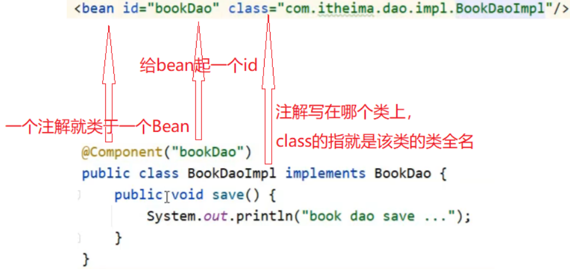
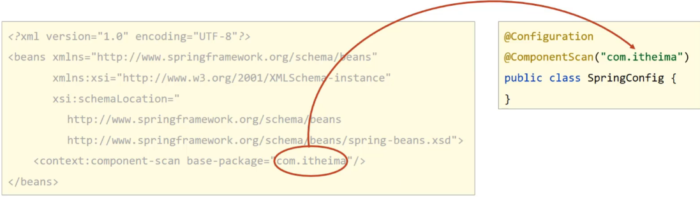
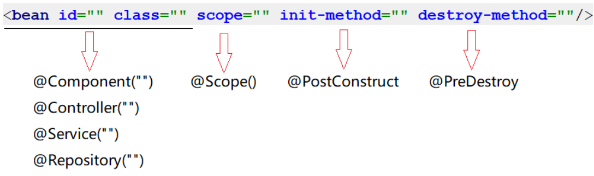
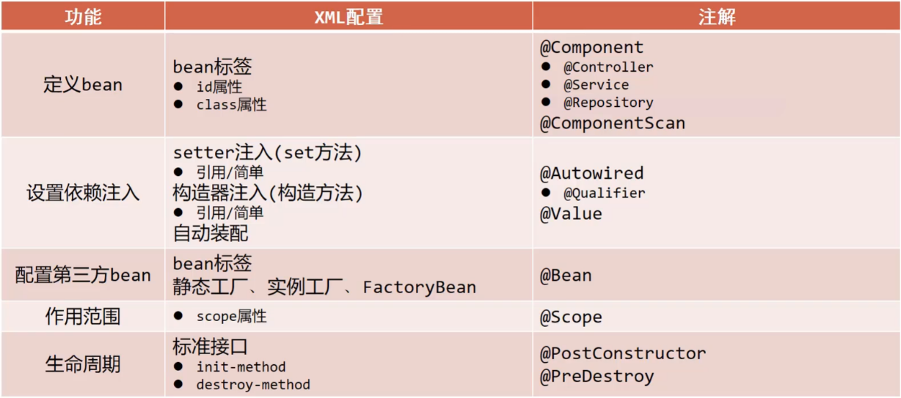

[toc]

# Spring笔记3-注解

## 控制反转（IOC） 的纯注解开发

之前都是通过xml配置文件的方式来配置IOC容器中的bean对象，并且进行bean对象之间的依赖注入。这种复杂的地方在于xml配置。但是我们可以通过注解的方式来简化xml配置文件。甚至可以做到纯注解开发（无须xml配置文件）。

spring能够自动扫描，检查，实例化具有特定注解的类。

Spring对注解支持的版本历程:
* 2.0版开始支持注解
* 2.5版注解功能趋于完善
* 3.0版支持纯注解开发

### 纯注解开发:IOC入门案例

使用注解的方式来配置IOC容器中的bean对象。

① 创建Maven项目，并引入spring依赖

```xml
<dependencies>
    <dependency>
        <groupId>org.springframework</groupId>
        <artifactId>spring-context</artifactId>
        <version>5.2.10.RELEASE</version>
    </dependency>
</dependencies>
```

② 添加BookDao、BookDaoImpl、BookService、BookServiceImpl类，并添加@Component注解

```java
// BookDao接口
public interface BookDao {
    public void save();
}
// BookDao接口实现类 BookDaoImpl
@Component("bookDao")
public class BookDaoImpl implements BookDao {
    public void save() {
        System.out.println("book dao save ..." );
    }
}

// BookDaoImpl接口
public interface BookService {
    public void save();
}

// BookDaoImpl接口实现类 BookServiceImpl
@Component("bookService")
public class BookServiceImpl implements BookService {
    public void save() {
        System.out.println("book service save ...");
    }
}
```

<font color="red">

注意:
* @Component注解不可以添加在接口上，因为接口是无法实例化为对象的。
* @Component注解只能添加到类上。
* @Component注解如果不起名称，会有一个默认值就是当前类名首字母小写。

</font>

> XML与注解配置的对应关系如下



③ 创建一个配置类用于代替applicationContext.xml配置文件。

```java
//这两个注解一起表示。该类代替applicationContext.xml配置文件。
//并且扫描com.example包下的所有文件。若找到@Component注解。则将其注解的类变成bean对象存放到IOC容器中。
@Configuration
@ComponentScan("org.example")
public class SpringApplicationConfig {
}
```

* @Configuration注解：用于设定当前类为配置类,用于替换applicationContext.xml配置文件
* @ComponentScan注解：用于设定扫描路径。替换`<context:component-scan base-package=""/>`标签。

如下图所示


④ 启动类TEST中通过加载配置类来创建IOC容器。

```java
public class TEST {
    public static void main( String[] args )
    {
        // new AnnotationConfigApplicationContext(SpringApplicationConfig.class) 加载SpringApplicationConfig配置类，根据配置类来创建IOC容器
        ApplicationContext applicationContext = new AnnotationConfigApplicationContext(SpringApplicationConfig.class);

        // 从IOC容器中获取BookDao对象
        BookDao bookDao = applicationContext.getBean("BookDao", BookDao.class);
        BookService bookService = applicationContext.getBean("BookService",BookService.class);
        bookDao.save();
        bookService.save();
    }
}

//运行结果：
//book dao save ...
//book service save ...
```

注意 xml和注解 创建IOC容器的方式是不一样的。
```java
//xml的形式：加载配置文件初始化容器 
ApplicationContext ctx = new ClassPathXmlApplicationContext("applicationContext.xml"); 

//注解的形式：加载配置类初始化容器 
ApplicationContext ctx = new AnnotationConfigApplicationContext(SpringApplicationConfig.class);
```

* ClassPathXmlApplicationContext是通过XML的方式来加载配置文件的类
* AnnotationConfigApplicationContext是通过注解的方式来加载配置类的类


### 配置类和扫描路径 @Configuration,@ComponentScan 注解

* @Configuration注解：标记当前类为spring的配置类。通过配置类的形式来代替applicationContext.xml配置文件
* @ComponentScan注解：设定 spring 的扫描路径，此注解只能添加一次，多个数据请用数组格式。

```java
//这两个注解一起表示。该类代替applicationContext.xml配置文件。
//并且扫描com.example包和com.itheima包下的所有文件。若找到@Component注解。则将该注解标记的类变成bean对象存放到IOC容器中。
@Configuration
@ComponentScan({"org.example","com.itheima"})
public class SpringApplicationConfig {
}
```


如图所示左边的applicationContext.xml配置文件与右边的配置类作用是等价的。

### Bean定义 @Component/@Controller/@Service/@Repository 注解

@Component @Controller @Service @Repository这四个注解的作用：当spring扫描到这些注解后，将注解标记的类设置为IOC容器中的bean对象。

这四个注解相当于xml配置文件中的`<bean>`元素标签。

```xml
<bean id="xxx" class="com.xxxx"/>
```

> 其余三个注解和@Component注解的作用是一样的，为什么要衍生出这三个呢?

方便区分出这个类是属于表现层、业务层，数据层还是普通的类。

* @Component :基本注解，用于标识类，该类将被IOC容器管理。
* @Respository :标识数据层类，持久层类。
* @Service: 标识业务层类。
* @Controller ：标识控制层类。

### bean作用域  @Scope注解

@Scope注解：设置该类bean对象的作用域。默认值singleton（单例）

@Scope注解就相当于`<bean>`元素标签的scope属性。Spring 5 共提供了 6 种 scope 作用域。如下图所示。


> 例子
```java
//@Scope设置bean的作用范围 
@Component("Book")
@Scope("prototype")
public class Book {
    ......
}
```


### bean生命周期 @PostConstruct @PreDestroy注解

@PostConstruct注解相当于`<bean>`元素标签的init-method属性。

@PreDestroy注解相当于`<bean>`元素标签的destroy-method属性。

```java
@Repository
public class BookDaoImpl implements BookDao {
    public void save() {
        System.out.println("book dao save ...");
    }
    @PostConstruct //在构造方法之后执行，替换init-method属性
    public void init() {
        System.out.println("init ...");
    }
    @PreDestroy //在销毁方法之前执行,替换destroy-method属性
    public void destroy() {
        System.out.println("destroy ...");
    }
}
```

* @PostConstruct注解：设置该方法为初始化方法。在bean对象构造之后执行
* @PreDestroy注解：设置该方法为销毁方法。在bean对象销毁之前执行

注意：@PreDestroy注解只有在容器关闭的时候，才会生效。

```java
public class App {
    public static void main(String[] args) {
        //加载SpringConfig.class配置类，创建对应的IOC容器
        AnnotationConfigApplicationContext ctx = new AnnotationConfigApplicationContext(SpringConfig.class);
        BookDao bookDao1 = ctx.getBean(BookDao.class);
        System.out.println(bookDao1);
        ctx.close(); //关闭容器
    }
}
```

<font color="red">
注意:@PostConstruct和@PreDestroy注解如果显示找不到，需要导入下面的jar包。找不到的原因是，从JDK9以后jdk中的javax.annotation包被移除了，这两个注解刚好就在这个包中。
</font>

```xml
<dependency>
  <groupId>javax.annotation</groupId>
  <artifactId>javax.annotation-api</artifactId>
  <version>1.3.2</version>
</dependency>
```

### 小结

如图所示，注解和xml配置的对应关系。


##  依赖注入（DI） 的注解开发

Spring为了使用注解简化DI依赖注入，并没有提供构造函数注入、setter注入对应的注解，只提供了自动装配的注解实现。

### 纯注解开发:DI入门案例

① 创建Maven项目，并引入spring依赖
```xml
<dependencies>
    <dependency>
        <groupId>org.springframework</groupId>
        <artifactId>spring-context</artifactId>
        <version>5.2.10.RELEASE</version>
    </dependency>
</dependencies>
```

② 添加BookDao、BookDaoImpl、BookService、BookServiceImpl类，并添加@Repository,@Service,@Autowired注解

```java
public interface BookDao {
    public void save();
}
@Repository
public class BookDaoImpl implements BookDao{
    @Override
    public void save() {
        System.out.println("this is BookDaoImpl save()");
    }
}
public interface BookService {
    public void add();
}
@Service
public class BookServiceImpl implements BookService{
    @Autowired
    private BookDao bookDao;

    @Override
    public void add() {
        bookDao.save();
    }
}
```

③ 创建配置类用于代替applicationContext.xml配置文件

```java
@Configuration
@ComponentScan("org.example")
public class SpringApplicationConfig {
}
```

④创建运行类并执行

```java
public class App {
    public static void main( String[] args )
    {
        ApplicationContext applicationContext = new AnnotationConfigApplicationContext(SpringApplicationConfig.class);
        BookService bookService = applicationContext.getBean(BookService.class);
        bookService.add();
    }
}
//运行结果：
//this is BookDaoImpl save()
```

* @Autowired注解作用：按照类型注入的，将该注解表示类注入到所属外部类中。

<font color="red">注意：@Autowired默认按照类型自动装配，如果IOC容器中多个同类型的Bean对象，但是name属性不相同，就按照变量名和Bean的名称匹配。</font>

如图所示


例如上图就无法完成注入。@Autowired注解默认按照类型自动装配，但是由于有多个BookDao类型Bean对象，此时会按照bookDao名称去找，因为IOC容器只有名称叫bookDao1和bookDao2 ,所以找不到，会报NoUniqueBeanDefinitionException。

### @Autowired和@Qualifier注解 

@Autowired 注解可以根据（构造器，属性字段，方法）等方式自动装配到另一个bean对象中,前提是bean存在ioc容器中。

xml的形式来自动装配
```xml
<!-- applicationContext.xml  -->
<bean id="UserImpl" class="com.service.UserServiceImpl"></bean>
	
<bean id="ucontroller" class="com.Controller.UserController" >   
    <property name="usimpl" ref="UserImpl" />
</bean>
```

注解形式来自动装配
```java
@Controller(value="UserController")
public class UserController {
	//把UserServiceImpl从ioc容器中取出，装配到UserController这个bean中。
	@Autowired
	private UserServiceImpl usimpl;

	public void add(){
		System.out.println(" UserController ");
		usimpl.addUser();
	}
}
```

@Autowired,相当于 UserController 这个bean 引用了 UserServiceImpl 这个bean,同时省去了在 UserController 类中 get/set UserServiceImpl属性的方法。效果与上面的xml配置等效。

#### @Autowired注解的问题？

因为@Autowired注解默认按照类型自动装配。但是当@Autowired注解根据类型在IOC容器中找到多个bean,并且@Autowire注解下的属性名又和IOC容器中bean对象的名称都不一致时。@Autowired注解会找不到，此时会报NoUniqueBeanDefinitionException异常。

如下图所示，该如何解决这种情况？


解决方式：需要额外添加@Qualifier注解来指定某个bean对象进行依赖注入

```java
@Service
public class BookServiceImpl implements BookService {
    @Autowired
    @Qualifier("bookDao1")
    private BookDao bookDao;
    
    public void save() {
        System.out.println("book service save ...");
        bookDao.save();
    }
}
```

@Qualifier注解值就是需要注入的bean的名称。

<font color="red">注意:@Qualifier不能独立使用，必须和@Autowired一起使用</font>

### @Value注解用法

#### @Value注解注入基本数据类型

```java
@Repository("bookDao")
public class BookDaoImpl implements BookDao {
    @Value("xiaoming")
    private String name;
    public void save() {
        System.out.println("book dao save ..." + name);
    }
}
```

@Value注解：将值直接复制给对应属性。注意数据格式要匹配，如将"abc"注入给int类型属性，这样程序就会报错。

#### @Value，@PropertySource 读取properties配置文件，

* @PropertySource注解用于加载properties配置文件
* @Value注解一般用在从properties配置文件中读取内容进行使用。

①步骤1：resource下准备jdbc.properties文件

```properties
name=小明
```

②步骤2: 使用注解加载properties配置文件

在配置类上添加`@PropertySource`注解

```java
@Configuration
@ComponentScan("com.itheima")
@PropertySource("jdbc.properties")
public class SpringConfig {
}
```

③步骤3：使用@Value读取配置文件中的内容

```java
@Repository("bookDao")
public class BookDaoImpl implements BookDao {
    @Value("${name}")
    private String name;
    public void save() {
        System.out.println("book dao save ..." + name);
    }
}
```

注意: @PropertySource注解用于加载properties配置文件

```java
//加载多个properties配置文件
//方式1
@PropertySource({"jdbc.properties","xxx.properties"})
//方式2
@PropertySource({"*.properties"})
//方式3 classpath表示当前项目根路径
@PropertySource({"classpath:jdbc.properties"})
```

### 小结

@Autowired注解：
1. 位置：属性注解 或 方法注解 或 方法形参注解
2. 作用：为引用类型属性设置值

@Qualifier注解：
1. 位置：属性定义上方 或 标准set方法上方 或 类set方法上方
2. 作用：为引用类型属性指定注入的beanId

@Value注解：
1. 位置：属性定义上方 或 标准set方法上方 或 类set方法上方
2. 作用：为 基本数据类型 或 字符串类型 属性设置值

@PropertySource注解：
1. 位置：类定义上方
2. 作用：加载properties文件
3. value（默认）设置加载的properties文件对应的文件名或文件名组成的数组。


## 注解开发管理第三方bean

如何将第三方类（其他jar包中的类）作为bean对象注入到自己的IOC容器中?
答案：使用Bean注解可将第三方类注入到IOC容器中。

①创建一个Maven项目

②pom.xml添加Spring的依赖和第三方Druid依赖
```xml
<dependencies>
    <dependency>
        <groupId>org.springframework</groupId>
        <artifactId>spring-context</artifactId>
        <version>5.2.10.RELEASE</version>
    </dependency>
    <dependency>
        <groupId>com.alibaba</groupId>
        <artifactId>druid</artifactId>
        <version>1.1.16</version>
    </dependency>
</dependencies>
```

③添加一个配置类SpringConfig，并创建一个返回第三方类的方法

@Bean注解的作用是将方法的返回值制作为IOC容器的一个bean对象

```java
@Configuration
public class SpringConfig {
    // @Bean注解作用是将返回值作为bean对象注入到IOC容器中
	@Bean
    public DataSource dataSource(){
        DruidDataSource ds = new DruidDataSource();
        ds.setDriverClassName("com.mysql.jdbc.Driver");
        ds.setUrl("jdbc:mysql://localhost:3306/spring_db");
        ds.setUsername("root");
        ds.setPassword("root");
        return ds;
    }
}
```

④创建启动类App,并打印第三方bean对象
```java
public class App {
    public static void main(String[] args) {
        AnnotationConfigApplicationContext ctx = new AnnotationConfigApplicationContext(SpringConfig.class);
        DataSource dataSource = ctx.getBean(DataSource.class);
        System.out.println(dataSource);
    }
}
```

<font color="red">注意：如果有多个第三方bean要被IOC容器管理，直接在配置类中多些几个方法，方法上添加@Bean注解。然后spring能够扫描到这些配置类即可</font>


### 小结 @Bean @Import注解

@Bean注解:
1. 位置 方法注解.定义方法上方
2. 作用 设置该方法的返回值作为IOC容器管理的bean。

@Import注解:
1. 位置 类注解.定义类上方
2. 作用 导入配置类。可将其他多个配置类注入到一个总配置类上
3. 当配置类有多个时使用数组格式一次性导入多个配置类

```java
@Configuration
//@ComponentScan("com.itheima.config")
@Import(JdbcConfig.class)
@Import(xxx.xxx.class)
public class SpringConfig {

}
```

## xml配置文件开发和注解开发总结



