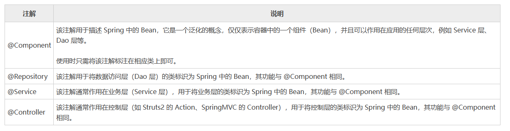

[toc]

# Spring笔记3-纯注解

## 控制反转（IOC）

之前都是通过xml配置文件的方式来配置IOC容器中的bean对象，并且进行bean对象之间的依赖注入。这种复杂的地方在于xml配置。但是我们可以通过注解的方式来简化xml配置文件。甚至可以做到纯注解开发（无须xml配置文件）。原理就是 spring 能够自动扫描，检查，实例化具有特定注解的类。

> Spring对注解支持的版本历程:
* 2.0版开始支持注解
* 2.5版注解功能趋于完善
* 3.0版支持纯注解开发

### 纯注解开发:IOC入门案例

使用注解的方式来配置IOC容器中的bean对象。

① 创建Maven项目，并引入spring依赖

```xml
<dependencies>
    <dependency>
        <groupId>org.springframework</groupId>
        <artifactId>spring-context</artifactId>
        <version>5.2.10.RELEASE</version>
    </dependency>
</dependencies>
```

② 添加BookDao、BookDaoImpl、BookService、BookServiceImpl类，并添加@Component注解

```java
// BookDao接口
public interface BookDao {
    public void save();
}
// BookDao接口实现类 BookDaoImpl
@Component("bookDao")
public class BookDaoImpl implements BookDao {
    public void save() {
        System.out.println("book dao save ..." );
    }
}

// BookDaoImpl接口
public interface BookService {
    public void save();
}

// BookDaoImpl接口实现类 BookServiceImpl
@Component("bookService")
public class BookServiceImpl implements BookService {
    public void save() {
        System.out.println("book service save ...");
    }
}
```

<font color="red">

注意:
* @Component注解不可以添加在接口上，因为接口是无法实例化为对象的。
* @Component注解只能添加到类上。
* @Component注解如果不起名称，会有一个默认值就是当前类名首字母小写。

</font>

> XML与注解配置的对应关系如下


③ 创建一个配置类用于代替applicationContext.xml配置文件。

```java
//这两个注解一起表示。该类代替applicationContext.xml配置文件。
//并且扫描com.example包下的所有文件。若找到@Component注解。则将其注解的类变成bean对象存放到IOC容器中。
@Configuration
@ComponentScan("org.example")
public class SpringApplicationConfig {
}
```

* @Configuration注解：用于设定当前类为配置类,用于替换applicationContext.xml配置文件
* @ComponentScan注解：用于设定扫描路径。替换`<context:component-scan base-package=""/>`标签。

如下图所示


④ 启动类TEST中通过加载配置类来创建IOC容器。

```java
public class TEST {
    public static void main( String[] args )
    {
        // new AnnotationConfigApplicationContext(SpringApplicationConfig.class) 加载SpringApplicationConfig配置类，根据配置类来创建IOC容器
        ApplicationContext applicationContext = new AnnotationConfigApplicationContext(SpringApplicationConfig.class);

        // 从IOC容器中获取BookDao对象
        BookDao bookDao = applicationContext.getBean("BookDao", BookDao.class);
        BookService bookService = applicationContext.getBean("BookService",BookService.class);
        bookDao.save();
        bookService.save();
    }
}

//运行结果：
//book dao save ...
//book service save ...
```

注意 xml和注解 创建IOC容器的方式是不一样的。
```java
//xml的形式：加载配置文件初始化容器 
ApplicationContext ctx = new ClassPathXmlApplicationContext("applicationContext.xml"); 

//注解的形式：加载配置类初始化容器 
ApplicationContext ctx = new AnnotationConfigApplicationContext(SpringApplicationConfig.class);
```

* ClassPathXmlApplicationContext是通过XML的方式来加载配置文件的类
* AnnotationConfigApplicationContext是通过注解的方式来加载配置类的类


### 配置类和扫描路径 @Configuration,@ComponentScan 注解

Spring 默认不使用注解装配 Bean，因此需要@ComponentScan
注解来开启Spirng的自动扫描功能。

* @Configuration注解：标记当前类为spring的配置类。通过配置类的形式来代替applicationContext.xml配置文件
* @ComponentScan注解：设定 spring 的扫描路径，此注解只能添加一次，多个数据请用数组格式。

```java
//这两个注解一起表示。该类代替applicationContext.xml配置文件。
//并且扫描com.example包和com.itheima包下的所有文件。若找到@Component注解。则将该注解标记的类变成bean对象存放到IOC容器中。
@Configuration
@ComponentScan({"org.example","com.itheima"})
public class SpringApplicationConfig {
}
```


如图所示左边的applicationContext.xml配置文件与右边的配置类作用是等价的。

### Bean定义 @Component/@Controller/@Service/@Repository 注解

@Component @Controller @Service @Repository这四个注解的作用：当spring扫描到这些注解后，将注解标记的类设置为IOC容器中的bean对象。

这四个注解相当于xml配置文件中的`<bean>`元素标签。

```xml
<bean id="xxx" class="com.xxxx"/>
```

> 其余三个注解和@Component注解的作用是一样的，为什么要衍生出这三个呢?

为了方便区分出这个类是属于表现层、业务层，数据层还是普通的类。

如图所示



### bean作用域  @Scope注解

@Scope注解：设置该类bean对象的作用域。默认值singleton（单例）

@Scope注解就相当于`<bean>`元素标签的scope属性。Spring 5 共提供了 6 种 scope 作用域。如下图所示。


> 例子
```java
//@Scope设置bean的作用范围 
@Component("Book")
@Scope("prototype")
public class Book {
    ......
}
```


### bean生命周期 @PostConstruct @PreDestroy注解

@PostConstruct注解相当于`<bean>`元素标签的init-method属性。

@PreDestroy注解相当于`<bean>`元素标签的destroy-method属性。

```java
@Repository
public class BookDaoImpl implements BookDao {
    public void save() {
        System.out.println("book dao save ...");
    }
    @PostConstruct //在构造方法之后执行，替换init-method属性
    public void init() {
        System.out.println("init ...");
    }
    @PreDestroy //在销毁方法之前执行,替换destroy-method属性
    public void destroy() {
        System.out.println("destroy ...");
    }
}
```

* @PostConstruct注解：设置该方法为初始化方法。在bean对象构造之后执行
* @PreDestroy注解：设置该方法为销毁方法。在bean对象销毁之前执行

注意：@PreDestroy注解只有在容器关闭的时候，才会生效。

```java
public class App {
    public static void main(String[] args) {
        //加载SpringConfig.class配置类，创建对应的IOC容器
        AnnotationConfigApplicationContext ctx = new AnnotationConfigApplicationContext(SpringConfig.class);
        BookDao bookDao1 = ctx.getBean(BookDao.class);
        System.out.println(bookDao1);
        ctx.close(); //关闭容器
    }
}
```

<font color="red">
注意:@PostConstruct和@PreDestroy注解如果显示找不到，需要导入下面的jar包。找不到的原因是，从JDK9以后jdk中的javax.annotation包被移除了，这两个注解刚好就在这个包中。
</font>

```xml
<dependency>
  <groupId>javax.annotation</groupId>
  <artifactId>javax.annotation-api</artifactId>
  <version>1.3.2</version>
</dependency>
```

### 小结

如图所示，注解和xml配置的对应关系。


##  依赖注入（DI）

Spring 通过提供自动装配的注解实现。从而可以纯注解的方式来实现依赖注入的功能。

### 纯注解开发:DI入门案例

① 创建Maven项目，并引入spring依赖
```xml
<dependencies>
    <dependency>
        <groupId>org.springframework</groupId>
        <artifactId>spring-context</artifactId>
        <version>5.2.10.RELEASE</version>
    </dependency>
</dependencies>
```

② 添加BookDao、BookDaoImpl、BookService、BookServiceImpl类，并添加@Repository,@Service,@Autowired注解

```java
//BookDao接口
public interface BookDao {
    public void save();
}

//BookDaoImpl接口实现类
@Repository
public class BookDaoImpl implements BookDao{
    public void save() {
        System.out.println("this is BookDaoImpl save()");
    }
}

//BookService接口
public interface BookService {
    public void add();
}

//BookServiceImpl接口实现类
@Service
public class BookServiceImpl implements BookService{
    @Autowired
    private BookDao bookDao;

    public void add() {
        bookDao.save();
    }
}
```

* @Autowired注解作用：按照byType规则来自动装配。将该BookDao类型的bean注入到BookServiceImpl类中。

③ 创建配置类并使用@Configuration注解和@ComponentScan注解，来代替applicationContext.xml配置文件

```java
@Configuration
@ComponentScan("org.example")
public class SpringApplicationConfig {
}
```

④ 创建测试类Test并执行

```java
public class Test {
    public static void main( String[] args )
    {
        ApplicationContext applicationContext = new AnnotationConfigApplicationContext(SpringApplicationConfig.class);
        BookService bookService = applicationContext.getBean(BookService.class);
        bookService.add();
    }
}
//运行结果：
//this is BookDaoImpl save()
```

### 基本数据类型属性注入 @Value 注解

* @Value注解：可以把基础数据类型的值直接注入给标识的属性中。注意数据格式要匹配，如将"abc"注入给int类型属性，这样程序就会报错。

```java
@Repository("bookDao")
public class BookDaoImpl implements BookDao {
    @Value("xiaoming")
    private String name;
    public void save() {
        System.out.println("book dao save ..." + name);
    }
}
```

上面代码中@Value注解将"xiaoming"赋值给name属性。

### 自动装配 @Autowired，@Resource，@Qualifier 注解

spring可以通过@Autowired，@Resource，@Qualifier 注解来实现自动装配的功能。


* @Autowired注解： 默认按照 byType 的规则来进行自动装配。如下想要按照 byName 的规则来自动装配，需要搭配 @Qualifier 注解一起使用。
* @Resource注解：默认先按照 byName 的规则来自动装配。如果不能匹配，则再按照 byType 的规则来自动装配。
* @Qualifier注解：与 @Autowired 注解配合，使用 byName 的规则来自动装配。


#### @Autowired注解的例子

```java
@Controller(value="UserController")
public class UserController {
	//从IOC容器中找出UserServiceImpl类型的bean，装配到UserController这个bean中。
	@Autowired
	private UserServiceImpl usimpl;

}
```

流程：@Autowired注解标记了usimpl属性。因此先找出usimpl属性的类型，即UserServiceImpl。再从IOC容器中找到UserServiceImpl类型的bean。如果找到则将该bean注入到UserController这个bean中

#### @Resource注解的例子

```java
@Controller(value="UserController")
public class UserController {
	//从IOC容器中先找出usimpl为name的bean，注入到UserController这个bean中。
    //如果没找到，则找出以UserServiceImpl为类型的bean，注入到UserController这个bean中。
	@Resource
	private UserServiceImpl usimpl;

}
```

流程：@Resource 注解标记了usimpl属性。因此先找出以usimpl为name的bean,然后注入到UserController这个bean中。如果没找到，则找出以UserServiceImpl为类型的bean，注入到UserController这个bean中。

#### @Qualifier注解的例子：用于解决@Autowired注解的问题

@Autowired注解默认按照 byType 规则来进行自动装配。但是byType
自动装配有个问题，即当IOC容器中出现多个相同类型的bean的同时，@Autowired注解不知道用哪一个bean，此时会报NoUniqueBeanDefinitionException异常。

解决方式：可以额外添加@Qualifier注解来将@Autowired注解的byType规则改变为byName规则。

```java
@Service
public class BookServiceImpl implements BookService {
    //当两个注解同时使用时，装配规则从byType变为byName
    @Autowired
    @Qualifier("bookDao1")
    private BookDao bookDao;
    
}
```

* @Qualifier注解的值就是需要注入的bean的名称。
* @Qualifier不能独立使用，必须和@Autowired一起使用

### 加载属性文件  @PropertySource 注解

* @PropertySource注解用于加载properties配置文件到spring应用中。

```java
//加载多个properties配置文件
//方式1
@PropertySource({"jdbc.properties","xxx.properties"})
//方式2 加载所有properties配置文件
@PropertySource({"*.properties"})
//方式3 classpath表示当前项目根路径
@PropertySource({"classpath:jdbc.properties"})
```

> 例子

①步骤1：resource目录下先准备jdbc.properties配置文件

```properties
name=小明
```

②步骤2: 使用@PropertySource注解加载jdbc.properties配置文件

在配置类上添加`@PropertySource`注解，用于加载jdbc.properties配置文件到spring应用中。

```java
@Configuration
@ComponentScan("com.itheima")
@PropertySource("jdbc.properties")
public class SpringConfig {

}
```

③步骤3：可以使用@Value注解读取jdbc.properties配置文件的内容

```java
public class BookDaoImpl implements BookDao {
  
    @Value("${name}")
    private String name;
    public void save() {
        System.out.println("book dao save ..." + name);
    }
}
```

`${name}`表示读取配置文件中的属性值。

## 注入第三方bean @Bean注解

如何将第三方类（其他jar包中的类）作为bean对象注入到IOC容器中?

答案：使用@Bean注解可将第三方类注入到IOC容器中。

> @Bean注解的使用方式
* 位置 方法注解.定义方法上方
* 作用 设置该方法的返回值作为IOC容器管理的bean。

> 例子

①创建一个Maven项目

②pom.xml添加Spring的依赖和第三方Druid依赖
```xml
<dependencies>
    <dependency>
        <groupId>org.springframework</groupId>
        <artifactId>spring-context</artifactId>
        <version>5.2.10.RELEASE</version>
    </dependency>
    <dependency>
        <groupId>com.alibaba</groupId>
        <artifactId>druid</artifactId>
        <version>1.1.16</version>
    </dependency>
</dependencies>
```

③添加一个配置类SpringConfig，并创建一个返回第三方类的方法

@Bean注解的作用是将方法的返回值制作为IOC容器的一个bean对象

```java
@Configuration
public class SpringConfig {
    // @Bean注解作用是将返回值作为bean对象注入到IOC容器中
	@Bean
    public DataSource dataSource(){
        DruidDataSource ds = new DruidDataSource();
        ds.setDriverClassName("com.mysql.jdbc.Driver");
        ds.setUrl("jdbc:mysql://localhost:3306/spring_db");
        ds.setUsername("root");
        ds.setPassword("root");
        return ds;
    }
}
```

④创建启动类App,并打印第三方bean对象
```java
public class App {
    public static void main(String[] args) {
        AnnotationConfigApplicationContext ctx = new AnnotationConfigApplicationContext(SpringConfig.class);
        DataSource dataSource = ctx.getBean(DataSource.class);
        System.out.println(dataSource);
    }
}
```

<font color="red">注意：如果有多个第三方bean要被IOC容器管理，直接在配置类中多写几个方法，每个方法上添加@Bean注解。然后spring能够扫描到配置类即可。</font>


### 导入配置类 @Import注解

@Import注解用于导入配置类。可将其他一个配置类注入到另一个配置类上。如果有多个配置类时，可以使用数组一次性导入多个配置类。

```java
@Configuration
//@ComponentScan("com.itheima.config")
@Import(JdbcConfig.class)
@Import(xxx.xxx.class)
public class SpringConfig {

}
```

## xml配置文件开发和注解开发总结


