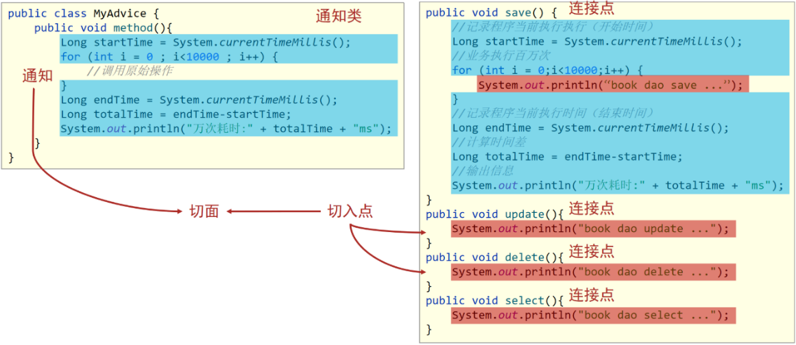
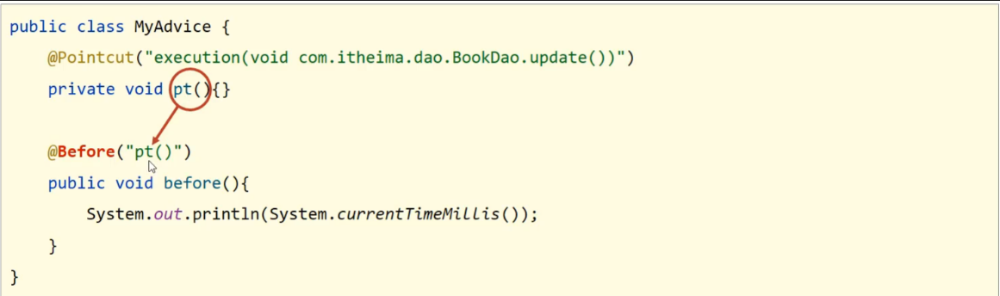
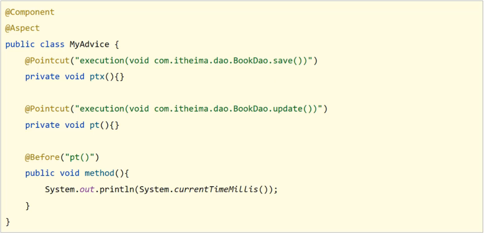
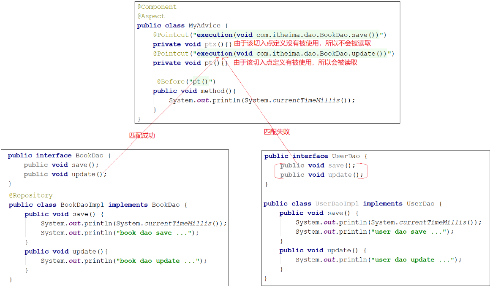
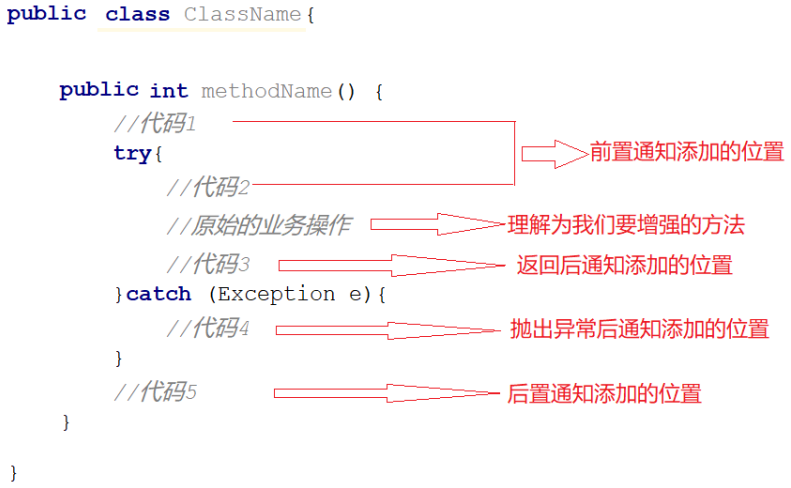
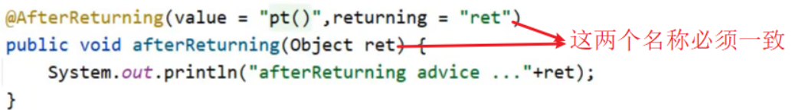
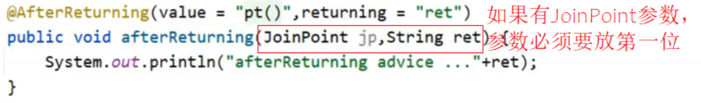
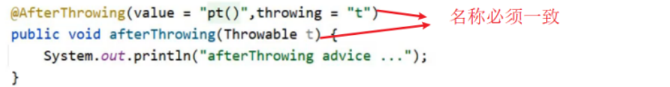

[toc]

# Spring笔记3-AOP

## AOP简介

* AOP(Aspect Oriented Programming)面向切面编程。
* OOP(Object Oriented Programming)面向对象编程。
* AOP作用：在不改原有代码的前提下对其进行功能增强。

> AOP的作用？

```java
public int add(int i,int j){
	System.out.println(" this is  "+i+" + "+j);
	return i+j;
}
public int sub(int i,int j){
	System.out.println(" this is  "+i+" - "+j);
	return i-j;
}
public int mul(int i,int j){
	System.out.println(" this is  "+i+" * "+j);
	return i*j;
}
public int div(int i,int j){
	System.out.println(" this is  "+i+" / "+j);
	return i/j;
}
```

<font color="red">上面是对两个参数之加减乘除的方法，里面有对该方法的日志输出。试想一想，如果对这四个方法的日志输出都修改，一次修改需要改四个地方，N次修改就需要修改4n次，并且这四个方法的日志，都差不多，是否可以抽象出来。</font>

**AOP可以分离与业务无关的代码出来,使得方法保持纯净。日志输入与方法的逻辑是无关的，从而方便后期维护代码。**

> AOP核心概念：

AOP 中的基本单元是 Aspect(切面)

1. 切面（Aspect）：本质上为一段程序代码，但是这些代码将通过 切入点切入到程序中。
2. 连接点（Joinpoint）: 程序执行过程中的任意一点，都可以是连接点。如执行方法、抛出异常、设置变量的时候。
3. 切入点（Pointcut）: 需要被增强的方法。切入点一定是连接点。但是连接点不一定是被增强的方法，而切入点一定是被增强的方法。
4. 通知（Advice）: 在切入点处执行的代码，也就是公共方法。通过 “通知” 来执行切面。各种类型的通知包括“after”、“before”和“throws”通知。

> 如图所示



(1)上图中BookServiceImpl中有save , update , delete和select方法,这些方法我们给起了一个名字叫连接点。
(2)save方法有计算万次执行消耗时间的功能。假如想对update和delete方法增强这个功能。我们可以对于需要增强的方法我们给起了一个名字叫切入点。
(3)将计算万次执行消耗时间这个功能抽取到另外一个方法中，换句话说就是存放公共功能的方法，起了个名字叫通知。
(4)通知是要增强的内容，可以有多个；切入点是需要被增强的方法，可以有多个；那哪个切入点需要添加哪个通知，就需要提前将它们之间的关系描述清楚，那么对于通知和切入点之间的关系描述，我们给起了个名字叫切面。
(5)通知是一个方法，方法不能独立存在需要被写在一个类中，这个类我们也给起了个名字叫通知类。

### AOP入门案例

案例：使用SpringAOP的注解方式完成在方法执行的前打印出当前系统时间。

思路分析
```
1.导入依赖(pom.xml)
2.制作连接点(原始操作，Dao接口与实现类)
3.制作共性功能(通知类与通知)
4.定义切入点
5.绑定切入点与通知关系(切面)
```

① 步骤1：创建一个Maven项目，添加依赖
```xml
<dependencies>
    <dependency>
        <groupId>org.springframework</groupId>
        <artifactId>spring-context</artifactId>
        <version>5.2.10.RELEASE</version>
    </dependency>
    <dependency>
        <groupId>org.aspectj</groupId>
        <artifactId>aspectjweaver</artifactId>
        <version>1.9.4</version>
    </dependency>
</dependencies>
```

* spring-context中已经包含了spring-aop依赖,所以不需要再单独导入spring-aop依赖。
* 导入AspectJ的jar包,AspectJ是AOP思想的一个具体实现，Spring有自己的AOP实现，但是相比于AspectJ来说比较麻烦，所以直接采用Spring整合ApsectJ的方式进行AOP开发。

② 步骤2：创建BookDao和BookDaoImpl类

现在使用SpringAOP的方式在不改变update方法的前提下让其具有打印系统时间的功能。

```java
public interface BookDao {
    public void save();
    public void update();
}
@Repository
public class BookDaoImpl implements BookDao {
    public void save() {
        //打印系统时间
        System.out.println(System.currentTimeMillis());
        System.out.println("book dao save ...");
    }
    public void update(){
        System.out.println("book dao update ...");
    }
}
```

③ 步骤3：定义通知类和通知，并在通知类中定义切入点,切面。用@Aspect将通知类标识为切面类

* 通知类：通知所在的类。
* 通知：就是需要增强的代码方法。
* 切入点：需要运行增强代码的位置点。
* 切面: 用来描述通知和切入点之间的绑定关系，并指定通知的具体执行位置。

@Before注解的作用：通知会在切入点方法执行之前执行，除此之前还有其他四种类型。

```java
@Component
@Aspect
//MyAdvice是通知类
public class MyAdvice {
    //这是切入点
    @Pointcut("execution(void com.itheima.dao.BookDao.update())")
    private void pt(){}

    //method方法是通知
    //@Before("pt()")用于绑定切入点和切面
    @Before("pt()")
    public void method(){
        System.out.println(System.currentTimeMillis());
    }
}
```

* 切入点注解@Pointcut需要定义在一个不具有实际意义的方法上，即无参数、无返回值、方法体无实际逻辑方法。




③ 步骤3：创建配置类，并开启AOP功能

```java
@Configuration
@ComponentScan("com.itheima")
@EnableAspectJAutoProxy  //开启aop功能
public class SpringConfig {
}
```

④ 步骤4：编写启动类

```java
public class App {
    public static void main(String[] args) {
        ApplicationContext ctx = new AnnotationConfigApplicationContext(SpringConfig.class);
        BookDao bookDao = ctx.getBean(BookDao.class);
        bookDao.save();
        bookDao.update();
    }
}
//运行结果
1662709232005
book dao save ...
1662709256925
book dao update ...
```

可以看到在执行update方法之前打印了系统时间戳，说明对update方法进行了增强，AOP成功。


**流程总结：**
<font color="red">当程序流程运行到切入点时，会查看该切入点在那个切面上，并且查看该切面的前置或后置等通知是否与该切入点进行了绑定。若绑定，则根据通知的类型，若是前置通知，则先执行前置通知，再执行原本的程序流程。</font>

### @EnableAspectJAutoProxy,@Aspect,@Pointcut,@Before注解

* @EnableAspectJAutoProxy
类型：配置类注解
位置：配置类定义上方
作用：开启注解格式AOP功能

* @Aspect
类型：类注解
位置：切面类定义上方
作用：设置当前类为AOP切面类

* @Pointcut
类型：方法注解
位置：切入点方法上方
作用：设置切入点方法
属性：value（默认）：切入点表达式

* @Before
类型：方法注解
位置：通知方法上方
作用：设置通知方法与切入点之间的绑定关系，通知方法在切入点方法前运行。

### AOP工作流程

由于AOP是基于Spring容器管理的bean做的增强，所以AOP工作流程需要从Spring加载bean说起。

① 流程1:Spring IOC容器启动

* 注意IOC容器启动后，此时bean对象还没有创建成功

② 流程2:读取切面类配置中的切入点



③ 流程3:初始化IOC容器中的bean对象

先判定bean对象类中的方法是否能匹配到任意切入点



* 若匹配失败，说明不需要增强，直接调用原始对象的方法即可。
* 若匹配成功
    * 因为要对目标对象进行功能增强，而采用的技术是动态代理，所以会为其创建一个代理对象。
    * 最终运行的是代理对象的方法，在该方法中会对原始方法进行功能增强。

④ 流程4:获取bean执行方法

* 若匹配失败，则获取的bean是原始对象，调用方法并执行，完成操作
* 若匹配成功，则获取的bean是代理对象，根据代理对象的运行模式运行原始方法与增强的内容，完成操作

<font color="red">
总结：
SpringAOP是在不改变原有代码的前提下对其进行增强的，它的底层采用的是代理模式实现的，所以要对原始对象进行增强，就需要对原始对象创建代理对象，在代理对象中的方法把通知内容加进去，就实现了增强,这就是我们所说的代理(Proxy)模式。
</font>


## AOP配置

### AOP切入点表达式

切入点表达式作用是要找到需要增强的方法位置。

```java
//@Pointcut切入点注解
@Pointcut("execution(void com.itheima.dao.BookDao.update(int))")
//表达式
execution(void com.itheima.dao.BookDao.update(int))
```

* execution：动作关键字，描述切入点的行为动作，例如execution表示执行到指定切入点
* public:访问修饰符,还可以是public，private等，可以省略
* void：返回值，写返回值类型
* com.itheima.dao：包名，多级包使用点连接
* BookDao:类/接口名称
* update：方法名
* int:参数，直接写参数的类型，多个类型用逗号隔开

> 表达式中使用通配符*和..

```java
execution(public * com.itheima.*.UserService.find*(*))
//匹配com.itheima包下的任意包中的UserService类或接口中所有find开头的至少带有一个参数的方法,并且返回值类型不限。

execution(public User com..UserService.findById(..))
//.. 常用于简化包名与参数的书写
```

### AOP通知

AOP通知：描述了抽取的共性功能，根据共性功能抽取的位置不同，最终运行代码时要将其加入到合理的位置。

AOP提供了5种通知类型:
- 前置通知
- 后置通知
- 环绕通知(重点)
- 返回后通知(了解)
- 抛出异常后通知(了解)

下图帮助理解这几种通知类型：


* (1)前置通知,追加功能到方法执行前,类似于在代码1或者代码2添加内容
* (2)后置通知,追加功能到方法执行后,不管方法执行的过程中有没有抛出异常都会执行，类似于在代码5添加内容
* (3)返回后通知,追加功能到方法执行后，只有方法正常执行结束后才进行,类似于在代码3添加内容，如果方法执行抛出异常，返回后通知将不会被添加
* (4)抛出异常后通知,追加功能到方法抛出异常后，只有方法执行出异常才进行,类似于在代码4添加内容，只有方法抛出异常后才会被添加
* (5)环绕通知,环绕通知功能比较强大，它可以追加功能到方法执行的前后，这也是比较常用的方式，它可以实现其他四种通知类型的功能。

```java
@Component
@Aspect
public class MyAdvice {
    //切入点
    @Pointcut("execution(void com.itheima.dao.BookDao.update())")
    private void pt(){}

    //前置通知
    @Before("pt()")
    public void before() {
        System.out.println("before advice ...");
    }
    //后置通知
    @After("pt()")
    public void after() {
        System.out.println("after advice ...");
    }
    //返回后通知
    @AfterReturning("pt()")
    public void afterReturning() {
        System.out.println("afterReturning advice ...");
    }
    //异常后通知
    @AfterReturning("pt()")
    public void afterThrowing() {
        System.out.println("afterThrowing advice ...");
    }
}

```

环绕通知案例：
* 因为环绕通知需要在原始方法的前后进行增强，所以环绕通知就必须需要对原始操作进行手动调用。
* 若原始方法有具体的返回值类型。则环绕通知要根据原始方法的返回值类型来设置环绕通知的返回值类型。

```java
@Component
@Aspect
public class MyAdvice {
    //切入点
    @Pointcut("execution(void com.itheima.dao.BookDao.update())")
    private void pt(){}
    //环绕通知
    @Around("pt()")
    public void around(ProceedingJoinPoint pjp) throws Throwable{
        System.out.println("around before advice ...");
        //表示对原始操作的调用
        pjp.proceed();
        System.out.println("around after advice ...");
    }

    @Pointcut("execution(int com.itheima.dao.BookDao.select())")
    private void pt2(){}
    
    @Around("pt2()")
    public Object aroundSelect(ProceedingJoinPoint pjp) throws Throwable {
        System.out.println("around before advice ...");
        //表示对原始操作的调用，需要设置与原始方法相同的返回值类型
        //Object类型更通用
        Object ret = pjp.proceed();
        System.out.println("around after advice ...");
        return ret;
    }
}
```

### AOP通知类型小结

* @After
类型：方法注解 
位置：通知方法定义上方
作用：当前通知方法在原始切入点方法后运行。

* @AfterReturning
类型：方法注解 
位置：通知方法定义上方
作用：当前通知方法在原始切入点方法正常执行完毕后执行。

* @AfterThrowing
类型：方法注解 
位置：通知方法定义上方
作用：当前通知方法在原始切入点方法运行抛出异常后执行

* @Around
类型：方法注解 
位置：通知方法定义上方
作用：当前通知方法在原始切入点方法前后运行

**环绕通知注意事项**
1. 环绕通知必须依赖形参ProceedingJoinPoint才能实现对原始方法的调用，进而实现原始方法调用前后同时添加通知。
2. 通知中如果未使用ProceedingJoinPoint对原始方法进行调用将跳过原始方法的执行。
3. 对原始方法的调用可以不接收返回值，通知方法设置成void即可，如果接收返回值，最好设定为Object类型
4. 原始方法的返回值如果是void类型，通知方法的返回值类型可以设置成void,也可以设置成Object
5. 由于无法预知原始方法运行后是否会抛出异常，因此环绕通知方法必须要处理Throwable异常

## AOP中获取切入点方法数据

### 获取切入点方法的参数

* 获取切入点方法的参数，所有的通知类型都可以获取参数
  * JoinPoint：适用于前置、后置、返回后、抛出异常后通知
  * ProceedingJoinPoint：适用于环绕通知

> 前置、后置、返回后、抛出异常后通知获取切入点方法参数，用JoinPoint对象获取

```java
@Component
@Aspect
public class MyAdvice {
    @Pointcut("execution(* com.itheima.dao.BookDao.findName(..))")
    private void pt(){}

    //JoinPoint对象用于获取切入点方法参数
    //以数组的形式获取参数
    @Before("pt()")
    public void before(JoinPoint jp) {
        Object[] args = jp.getArgs();
        System.out.println(Arrays.toString(args));
        System.out.println("before advice ..." );
    }
    //。。。。其他通知省略
}
```

<font color="red">使用JoinPoint的方式获取参数适用于前置、后置、返回后、抛出异常后通知。</font>

>  @Around环绕通知获取切入点方法参数，用ProceedingJoinPoint对象获取
```java
@Component
@Aspect
public class MyAdvice {
    @Pointcut("execution(* com.itheima.dao.BookDao.findName(..))")
    private void pt(){}

    //ProceedingJoinPoint对象用于获取切入点方法参数
    //以数组的形式获取参数
    @Around("pt()")
    public Object around(ProceedingJoinPoint pjp)throws Throwable {
        Object[] args = pjp.getArgs();
        System.out.println(Arrays.toString(args));
        Object ret = pjp.proceed();
        return ret;
    }
}
```

### 获取切入点方法的返回值

* 只有返回后通知@AfterReturing和环绕通知@Around可以获取返回值。

> 环绕通知获取返回值

```java
@Component
@Aspect
public class MyAdvice {
    @Pointcut("execution(* com.itheima.dao.BookDao.findName(..))")
    private void pt(){}

    @Around("pt()")
    public Object around(ProceedingJoinPoint pjp) throws Throwable{
        Object[] args = pjp.getArgs();
        //打印参数
        System.out.println(Arrays.toString(args));
        args[0] = 666;
        Object ret = pjp.proceed(args);
        return ret;
    }
	//其他的略
}
```

ret就是方法的返回值，不但可以获取，如果需要还可以进行修改。

> 返回后通知获取返回值

```java
@Component
@Aspect
public class MyAdvice {
    @Pointcut("execution(* com.itheima.dao.BookDao.findName(..))")
    private void pt(){}

    @AfterReturning(value = "pt()",returning = "ret")
    public void afterReturning(Object ret) {
        System.out.println("afterReturning advice ..."+ret);
    }
}
```

注意:
* (1)参数名的问题

* (2)afterReturning方法参数类型的问题
参数类型可以写成String，但是为了能匹配更多的参数类型，建议写成Object类型
* (3)afterReturning方法参数的顺序问题


### 获取切入点方法抛出的异常信息

对于切入点方法抛出的异常，只有抛出异常后通知@AfterThrowing和环绕通知@Around可以获取。

> 环绕通知获取异常

```java
@Component
@Aspect
public class MyAdvice {
    @Pointcut("execution(* com.itheima.dao.BookDao.findName(..))")
    private void pt(){}

    @Around("pt()")
    public Object around(ProceedingJoinPoint pjp){
        //获取方法参数
        Object[] args = pjp.getArgs();
        System.out.println(Arrays.toString(args));
        args[0] = 666;
        Object ret = null;
        //获取切入点方法抛出的参数
        try{
            ret = pjp.proceed(args);
        }catch(Throwable throwable){
            t.printStackTrace();
        }
        return ret;
    }
}
```

在try...catch方法中就可以获取到异常。

> 抛出异常后通知获取异常,用Throwable对象接受异常信息

```java
@Component
@Aspect
public class MyAdvice {
    @Pointcut("execution(* com.itheima.dao.BookDao.findName(..))")
    private void pt(){}

    @AfterThrowing(value = "pt()",throwing = "t")
    public void afterThrowing(Throwable t) {
        System.out.println("afterThrowing advice ..."+t);
    }
}
```

注意:


## AOP总结

### AOP的核心概念总结

* 概念：AOP(Aspect Oriented Programming)面向切面编程，一种编程范式
* 作用：在不惊动原始设计的基础上为方法进行功能增强
* 核心概念
    * 代理（Proxy）：SpringAOP的核心本质是采用代理模式实现的
    * 连接点（JoinPoint）：在SpringAOP中，理解为任意方法的执行
    * 切入点（Pointcut）：匹配连接点的式子，也是具有共性功能的方法描述
    * 通知（Advice）：若干个方法的共性功能，在切入点处执行，最终体现为一个方法
    * 切面（Aspect）：描述通知与切入点的对应关系
    * 目标对象（Target）：被代理的原始对象成为目标对象

### 切入点表达式总结

* 切入点表达式标准格式：动作关键字(访问修饰符  返回值  包名.类/接口名.方法名（参数）异常名)

```
execution(* com.itheima.service.*Service.*(..))
```

* 切入点表达式描述通配符：
```
作用：用于快速描述，范围描述
*  ：匹配任意符号（常用）
.. ：匹配多个连续的任意符号（常用）
+  ：匹配子类类型
```

* 切入点表达式书写技巧
```
1.按==标准规范==开发
2.查询操作的返回值建议使用\*匹配
3.减少使用..的形式描述包
4.==对接口进行描述==，使用\*表示模块名，例如UserService的匹配描述为*Service
5.方法名书写保留动词，例如get，使用\*表示名词，例如getById匹配描述为getBy\*
6.参数根据实际情况灵活调整
```

### 五种通知类型总结

- 前置通知
- 后置通知
- 环绕通知（重点）
  - 环绕通知依赖形参ProceedingJoinPoint才能实现对原始方法的调用
  - 环绕通知可以隔离原始方法的调用执行
  - 环绕通知返回值设置为Object类型
  - 环绕通知中可以对原始方法调用过程中出现的异常进行处理
- 返回后通知
- 抛出异常后通知

### 通知中获取参数总结

- 获取切入点方法的参数，所有的通知类型都可以获取参数
  - JoinPoint：适用于前置、后置、返回后、抛出异常后通知
  - ProceedingJoinPoint：适用于环绕通知
- 获取切入点方法返回值，前置和抛出异常后通知是没有返回值，后置通知可有可无，所以不做研究
  - 返回后通知
  - 环绕通知
- 获取切入点方法运行异常信息，前置和返回后通知是不会有，后置通知可有可无，所以不做研究
  - 抛出异常后通知
  - 环绕通知
