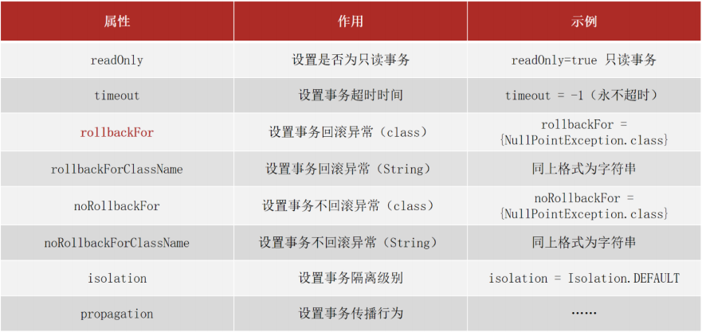
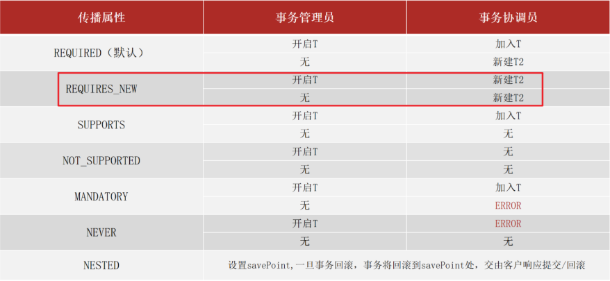
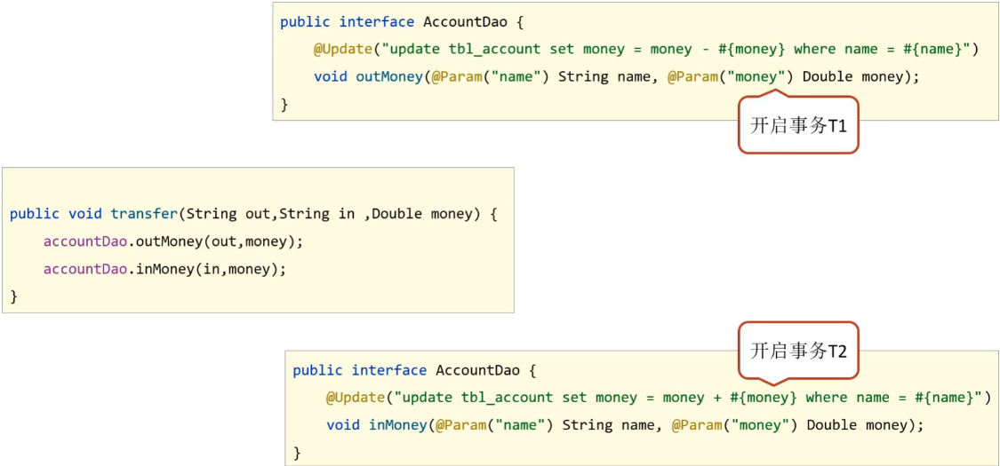
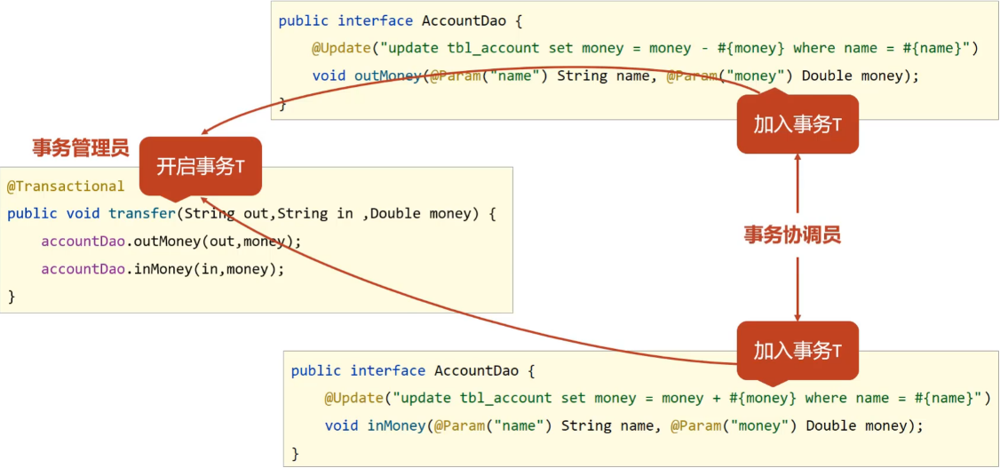

[toc]

# Spring笔记5-事务

## Spring事务管理

* 事务作用：在业务层保障一系列的业务操作同成功或同失败
* Spring事务作用：在业务层保障一系列的业务操作同成功或同失败

### @Transactional事务注解

① 对需要事务的方法上添加@Transactional事务注解
```java
public interface AccountService {
    /**
     * 转账操作
     * @param out 传出方
     * @param in 转入方
     * @param money 金额
     */
    //配置当前接口方法具有事务
    public void transfer(String out,String in ,Double money) ;
}

@Service
public class AccountServiceImpl implements AccountService {
    @Autowired
    private AccountDao accountDao;

    //添加事务注解@Transactional
	@Transactional
    public void transfer(String out,String in ,Double money) {
        accountDao.outMoney(out,money);
        //设置异常，测试事务
        int i = 1/0;
        accountDao.inMoney(in,money);
    }
}
```

注意 @Transactional可以写在接口类上、接口方法上、实现类上和实现类方法上
* 写在接口类上，该接口的所有实现类的所有方法都会有事务
* 写在接口方法上，该接口的所有实现类的该方法都会有事务
* 写在实现类上，该类中的所有方法都会有事务
* 写在实现类方法上，该方法上有事务
* 建议写在实现类或实现类的方法上。

② 在SpringConfig的配置类中开启事务

```java
@Configuration
@ComponentScan("com.itheima")
//开启注解式事务驱动
@EnableTransactionManagement
public class SpringConfig {
}
```

小结：

* @EnableTransactionManagement
类型：配置类注解
位置：配置类定义上方
作用：设置当前Spring环境中开启注解式事务支持

* @Transactional
类型：接口注解  类注解  方法注解 
位置：业务层接口上方  业务层实现类上方  业务方法上方
作用：为当前业务层方法添加事务（如果设置在类或接口上方则类或接口中所有方法均添加事务）

### @Transactional事务注解配置属性



上面这些属性都可以在@Transactional注解的参数上进行设置。

* readOnly：true只读事务，false读写事务，增删改要设为false,查询设为true。
* timeout:设置超时时间单位秒，在多长时间之内事务没有提交成功就自动回滚，-1表示不设置超时时间。
* rollbackFor:当出现指定异常进行事务回滚
* noRollbackFor:当出现指定异常不进行事务回滚
* rollbackForClassName等同于rollbackFor,只不过属性为异常的类全名字符串
* noRollbackForClassName等同于noRollbackFor，只不过属性为异常的类全名字符串
* isolation设置事务的隔离级别
  * DEFAULT :默认隔离级别, 会采用数据库的隔离级别
  * READ_UNCOMMITTED : 读未提交
  * READ_COMMITTED : 读已提交
  * REPEATABLE_READ : 重复读取
  * SERIALIZABLE: 串行化
* propagation 设置事务传播行为

<font color="red">Spring的事务只会对Error异常和RuntimeException异常及其子类进行事务回顾，其他的异常类型是不会回滚的。此时可以使用rollbackFor属性来设置出现IOException异常不回滚</font>

### 事务的传播行为

@Transactional事务注解有一个propagation属性，该属性用于设置事务传播行为。

> 什么是事务传播行为?

事务传播行为用来描述由某一个事务方法被嵌套进另一个事务方法时,事务是如何传播的。


Spring中定义了七种事务的传播行为,如下图：


* REQUIRED（默认）：如果当前没有事务，就新建一个事务，如果已经存在一个事务中，加入到这个事务中。
* REQUIRES_NEW：新建事务，如果当前存在事务，把当前事务挂起。
* SUPPORTS：支持当前事务，如果当前没有事务，就以非事务方式执行。
* NOT_SUPPORTED：始终以非事务方式执行。
* MANDATORY：使用当前的事务，如果当前没有事务，就抛出异常。
* NEVER：以非事务方式执行，如果当前存在事务，则抛出异常。
* NESTED：如果当前存在事务，则创建一个嵌套事务（子事务）内执行。如果当前没有事务，则执行与REQUIRED类似的操作。


#### REQUIRED（默认）

REQUIRED（默认）：如果当前没有事务，就新建一个事务，如果已经存在一个事务中，加入到这个事务中。

```java
//Propagation.REQUIRED为默认事务传播行为
@Transactional(propagation = Propagation.REQUIRED)
public void testMain(){
    testB();
}

@Transactional(propagation = Propagation.REQUIRED)
public void testB(){
    //发生异常
    throw Exception;
}
```

1. testMain方法有一个事务A。由于testB方法在testMain方法里面。所以testB的事务合并到事务A中。即两个方法用的都是事务A
2. 当执行testB方法抛出异常后事务会发生回滚。又因为testMain和testB使用的同一个事务，所以事务回滚后testMain和testB中的操作都会回滚。

#### REQUIRES_NEW

REQUIRES_NEW：新建事务，如果当前存在事务，把当前事务挂起。

```java
@Transactional
public void testMain(){
    testB();             //调用testB
    throw Exception;     //发生异常抛出
}
@Transactional(propagation = Propagation.REQUIRES_NEW)
public void testB(){
    //业务操作
}
```

1. testMain方法有一个事务A,testB的事务传播设置为REQUIRES_NEW,所以在执行到testB时会开启一个新的事务B。
2. 当testMain方法发生异常而事务A回滚时，由于两个方法事务不同。事务B没有影响。testB方法正常运行。

#### SUPPORTS

SUPPORTS：支持当前事务，如果当前没有事务，就以非事务方式执行。

```java
public void testMain(){
    testB();    //调用testB
}

@Transactional(propagation = Propagation.SUPPORTS)
public void testB(){
    throw Exception;     //发生异常抛出
}
```

1. testMain方法没有事务，testB的事务传播设置为SUPPORTS。因此testB方法也是没有事务的。
2. 当testB方法发生异常时，也不会回滚。
3. 若testMain方法有事务，则两个方法共用一个事务。

#### NOT_SUPPORTED

NOT_SUPPORTED：始终以非事务方式执行

```java
@Transactional
public void testMain(){
    testB();    //调用testB
    throw Exception;     //发生异常抛出
}

@Transactional(propagation = Propagation.NOT_SUPPORTED)
public void testB(){
    throw Exception;     //发生异常抛出
}
```

1. testMain方法有事务。testB的事务传播设置为NOT_SUPPORTED。因此testB方法没有事务。
2. 若testMain方法发生异常，则testMain方法会回滚。testB方法没有事务不会回滚。

#### MANDATORY

MANDATORY：使用当前的事务，如果当前没有事务，就抛出异常。

```java
public void testMain(){
    testB();    //调用testB
}
@Transactional(propagation = Propagation.MANDATORY)
public void testB(){
    throw Exception;     //发生异常抛出
}
```

1. testMain没有事务，testB的事务传播设置为MANDATORY。
2. 当执行testB方法时就直接抛出事务要求的异常（如果当前事务不存在，则抛出异常）。直接回滚

#### NEVER

NEVER：以非事务方式执行，如果当前存在事务，则抛出异常。

```java
@Transactional
public void testMain(){
    testB();    //调用testB
}
@Transactional(propagation = Propagation.NEVER)
public void testB(){
    //业务操作
}
```

1. testMain有事务，testB的事务传播设置为NEVER
2. 当执行testB方法时就直接抛出事务异常（如果当前事务存在，则抛出异常）。直接回滚

#### NESTED

NESTED：如果当前存在事务，则创建一个嵌套事务(子事务)。如果当前没有事务，则执行与REQUIRED类似的操作。

```java
@Transactional
public void testMain(){
    testB();    //调用testB
    throw Exception;     //发生异常抛出
}
@Transactional(propagation = Propagation.NESTED)
public void testB(){
    //业务操作
}
```

1. testMain有事务，testB的事务传播设置为NESTED。则testB有一个事务B，B是事务A的子事务。
2. testMain发生异常时，父事务A回滚则子事务B也跟着回滚。


## Spring事务角色

Spring事务角色有两个，分别是事务管理员和事务协调员。

1. 未开启Spring事务之前:



* AccountDao的outMoney因为是修改操作，会开启一个事务T1
* AccountDao的inMoney因为是修改操作，会开启一个事务T2
* AccountService的transfer没有事务，
  * 运行过程中如果没有抛出异常，则T1和T2都正常提交，数据正确
  * 如果在两个方法中间抛出异常，T1因为执行成功提交事务，T2因为抛异常不会被执行
  * 就会导致数据出现错误

2. 开启Spring的事务管理后



* transfer上添加了@Transactional注解，在该方法上就会有一个事务T
* AccountDao的outMoney方法的事务T1加入到transfer的事务T中
* AccountDao的inMoney方法的事务T2加入到transfer的事务T中
* 这样就保证他们在同一个事务中，当业务层中出现异常，整个事务就会回滚，保证数据的准确性。

通过上面例子的分析，可以得到如下概念:
- 事务管理员：发起事务方，在Spring中通常指代业务层开启事务的方法
- 事务协调员：加入事务方，在Spring中通常指代数据层方法，也可以是业务层方法


