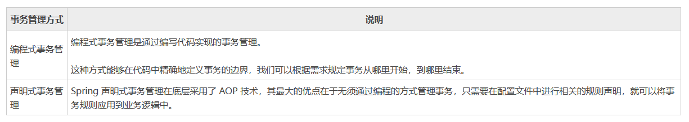
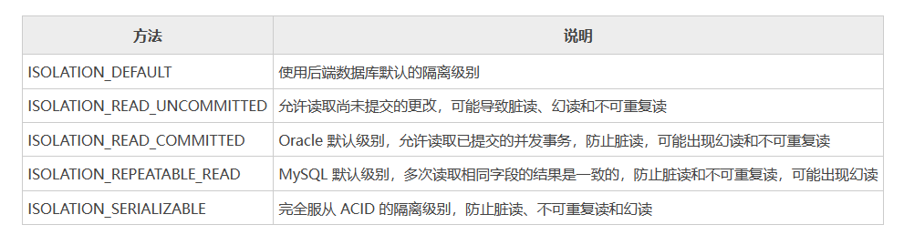
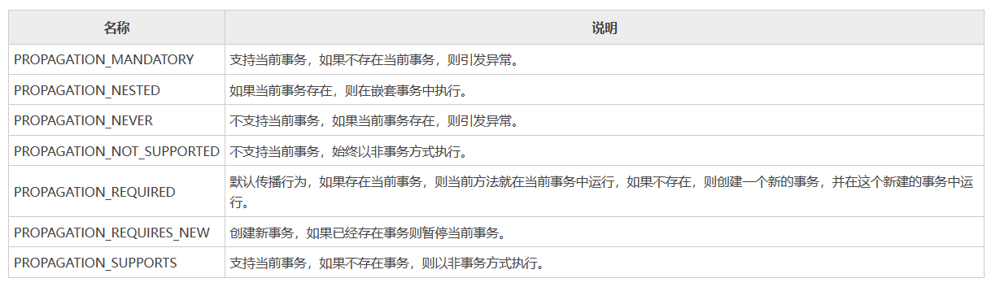

[toc]

# Spring笔记5-事务

## Spring事务介绍

事务是一个最小的逻辑执行单元，事务中的几个操作，不能分开执行，要么同时执行，要么同时不执行，绝不能只执行一部分。

如果事务中的所有的操作都执行成功，那自然万事大吉。但如果事务中的任何一个操作失败，那么事务中所有的操作都会被回滚，已经执行成功操作也会被完全清除干净，就好像什么事都没有发生一样。

Spring 也对事务提供了很好的支持。Spring 借助 IoC 容器强大的配置能力，为事务提供了丰富的功能支持。

> Spring 支持以下 2 种事务管理方式。



* 编程式对事物控制的细粒度更高，能够精确的控制事务的边界，事务的开始和结束完全取决于我们的需求，但这种方式存在一个致命的缺点，那就是事务规则与业务代码耦合度高，难以维护，因此我们很少使用这种方式对事务进行管理。
* 声明式事务易用性更高，对业务代码没有侵入性，耦合度低，易于维护，因此这种方式也是最常用的事务管理方式


## Spring实现声明式事务管理

Spring 声明式事务管理是通过 AOP 实现的，其本质是对方法前后进行拦截，然后在目标方法开始之前创建（或加入）一个事务，在执行完目标方法后，根据执行情况提交或者回滚事务。

Spring 实现声明式事务管理主要有 2 种方式：
* 基于 XML 方式。
* 通过 Annotation 注解方式。

### 注解方式的实现声明式事务管理

步骤① 对需要事务的方法上添加@Transactional事务注解
```java
public interface AccountService {
    /**
     * 转账操作
     * @param out 传出方
     * @param in 转入方
     * @param money 金额
     */
    public void transfer(String out,String in ,Double money) ;
}

@Service
public class AccountServiceImpl implements AccountService {
    @Autowired
    private AccountDao accountDao;

    //添加事务注解
    @Transactional(isolation = Isolation.DEFAULT, propagation = Propagation.REQUIRED, timeout = 10, readOnly = false)
    public void transfer(String out,String in ,Double money) {
        accountDao.outMoney(out,money);
        //手动设置异常，用于测试事务是否触发
        int i = 1/0;
        accountDao.inMoney(in,money);
    }
}
```

transfer方法被@Transactional注解标记，则表示该方法是一个事务方法。当方法内出现异常的时候，则事务就会开始回滚，该事务方法内的操作会被还原。

步骤② 在SpringConfig的配置类中开启事务

```java
@Configuration
@ComponentScan("com.itheima")
//开启事务管理器
@EnableTransactionManagement
public class SpringConfig {
}
```

### @EnableTransactionManagement 注解

> @EnableTransactionManagement 注解

@EnableTransactionManagement注解用于在Spring的配置类中开启注解式事务支持。

### @Transactional 注解

@Transactional 注解是 Spring 声明式事务编程的核心注解，该注解既可以在类上使用，也可以在方法上使用。

* 在类上使用，则该类中的所有方法都会有事务。
* 在方法上使用，则该方法有事务

> 代码如下

```java
@Transactional
public class ABC {

    @Transactional
    public void A(Order order) {
    ……
    }

    @Transactional
    public void B(Order order) {
    ……
    }
}
```

> @Transactional 注解的属性


上面这些属性都可以在@Transactional注解的参数上进行设置。

* timeout  设置超时时间单位秒，在多长时间之内事务没有提交成功就自动回滚，-1表示不设置超时时间。
* rollbackFor 当出现指定异常进行事务回滚
* noRollbackFor 当出现指定异常不进行事务回滚
* isolation 设置事务的隔离级别
* propagation 设置事务传播行为


## Spring事务的隔离级别

事务的隔离级别定义了一个事务可能受其他并发事务影响的程度。

Spring 中提供了以下隔离级别，我们可以根据自身的需求自行选择合适的隔离级别。



<font color="red">注意：@Transactional事务注解有一个isolation属性，该属性用于设置事务传播行为。</font>

## Spring事务的传播行为

> 什么是事务的传播行为?

事务传播行为指的是，当一个事务方法被另一个事务方法调用时，这个事务方法应该如何运行。例如，事务方法 A 在调用事务方法 B 时，B 方法是继续在调用者 A 方法的事务中运行呢，还是为自己开启一个新事务运行，这就是由事务方法 B 的事务传播行为决定的。

Spring 提供了以下7种不同的事务传播行为。如图所示



* REQUIRED（默认）：如果当前没有事务，就新建一个事务，如果已经存在一个事务中，加入到这个事务中。
* REQUIRES_NEW：创建一个新事务，如果当前存在事务，则把当前事务暂停。
* SUPPORTS：支持当前事务，如果当前没有事务，就以非事务方式执行。
* NOT_SUPPORTED：不支持当前事务。始终以非事务方式执行。
* MANDATORY：支持当前的事务，如果当前没有事务，就抛出异常。
* NEVER：以非事务方式执行，如果当前存在事务，则抛出异常。
* NESTED：如果当前存在事务，则创建一个嵌套事务（子事务），在嵌套事务内运行。如果当前没有事务，则执行与REQUIRED类似的操作。

<font color="red">注意：@Transactional事务注解有一个propagation属性，该属性用于设置事务传播行为。</font>

### REQUIRED（默认）

REQUIRED（默认）：如果当前没有事务，就新建一个事务，如果已经存在一个事务中，加入到这个事务中。

```java
//Propagation.REQUIRED为默认事务传播行为
@Transactional(propagation = Propagation.REQUIRED)
public void testMain(){
    testB();
}

@Transactional(propagation = Propagation.REQUIRED)
public void testB(){
    //发生异常
    throw Exception;
}
```

1. testMain方法有一个事务A。由于testB方法在testMain方法里面。所以testB的事务合并到事务A中。即两个方法用的都是事务A
2. 当执行testB方法抛出异常后事务会发生回滚。又因为testMain和testB使用的同一个事务，所以事务回滚后testMain和testB中的操作都会回滚。

### REQUIRES_NEW

REQUIRES_NEW：新建事务，如果当前存在事务，把当前事务挂起。

```java
@Transactional
public void testMain(){
    testB();             //调用testB
    throw Exception;     //发生异常抛出
}
@Transactional(propagation = Propagation.REQUIRES_NEW)
public void testB(){
    //业务操作
}
```

1. testMain方法有一个事务A,testB的事务传播设置为REQUIRES_NEW,所以在执行到testB时会开启一个新的事务B。
2. 当testMain方法发生异常而事务A回滚时，由于两个方法事务不同。事务B没有影响。testB方法正常运行。

### SUPPORTS

SUPPORTS：支持当前事务，如果当前没有事务，就以非事务方式执行。

```java
public void testMain(){
    testB();    //调用testB
}

@Transactional(propagation = Propagation.SUPPORTS)
public void testB(){
    throw Exception;     //发生异常抛出
}
```

1. testMain方法没有事务，testB的事务传播设置为SUPPORTS。因此testB方法也是没有事务的。
2. 当testB方法发生异常时，也不会回滚。
3. 若testMain方法有事务，则两个方法共用一个事务。

### NOT_SUPPORTED

NOT_SUPPORTED：始终以非事务方式执行

```java
@Transactional
public void testMain(){
    testB();    //调用testB
    throw Exception;     //发生异常抛出
}

@Transactional(propagation = Propagation.NOT_SUPPORTED)
public void testB(){
    throw Exception;     //发生异常抛出
}
```

1. testMain方法有事务。testB的事务传播设置为NOT_SUPPORTED。因此testB方法没有事务。
2. 若testMain方法发生异常，则testMain方法会回滚。testB方法没有事务不会回滚。

### MANDATORY

MANDATORY：使用当前的事务，如果当前没有事务，就抛出异常。

```java
public void testMain(){
    testB();    //调用testB
}
@Transactional(propagation = Propagation.MANDATORY)
public void testB(){
    throw Exception;     //发生异常抛出
}
```

1. testMain没有事务，testB的事务传播设置为MANDATORY。
2. 当执行testB方法时就直接抛出事务要求的异常（如果当前事务不存在，则抛出异常）。直接回滚

### NEVER

NEVER：以非事务方式执行，如果当前存在事务，则抛出异常。

```java
@Transactional
public void testMain(){
    testB();    //调用testB
}
@Transactional(propagation = Propagation.NEVER)
public void testB(){
    //业务操作
}
```

1. testMain有事务，testB的事务传播设置为NEVER
2. 当执行testB方法时就直接抛出事务异常（如果当前事务存在，则抛出异常）。直接回滚

### NESTED

NESTED：如果当前存在事务，则创建一个嵌套事务(子事务)。如果当前没有事务，则执行与REQUIRED类似的操作。

```java
@Transactional
public void testMain(){
    testB();    //调用testB
    throw Exception;     //发生异常抛出
}
@Transactional(propagation = Propagation.NESTED)
public void testB(){
    //业务操作
}
```

1. testMain有事务，testB的事务传播设置为NESTED。则testB有一个事务B，B是事务A的子事务。
2. testMain发生异常时，父事务A回滚则子事务B也跟着回滚。

