[toc]

# SpringBoot笔记 版本2.7.4

当前使用的SpringBoot版本为2.7.4

# 1 SpringBoot简介

<font color="red"> SpringBoot 基于 Spring 开发。不仅继承了Spring框架原有的优秀特性，它并不是用来替代 Spring 的解决方案，而和 Spring 框架紧密 结合进一步简化了Spring应用的整个搭建和开发过程。其设计目的是用来简化 Spring 应用的初始搭建以及开发过程怎么简化的呢?就是通过提供默认配置等方式让我们更容易使用。</font>

关于Spring Boot有一句很出名的话就是约定大于配置。采用Spring Boot可以大大的简化开发模式，它集成了大量常用的第三方库配置，所有你想集成的常用框架，它都有对应的组件支持，例如 Redis、MongoDB、Dubbo、kafka，ES等等。SpringBoot 应用中这些第 三方库几乎可以零配置地开箱即用，大部分的 SpringBoot 应用都只需要非常少量的配置代码，开发者能够更加专注于业务逻辑。另外 SpringBoot通过集成大量的框架使得依赖包的版本冲突，以及引用的不稳定性等问题得到了很好的解决。

原始Spring环境搭建和开发存在以下问题：
* 配置繁琐
* 依赖设置繁琐

SpringBoot的优点恰巧就是针对Spring的缺点
* 快速构建一个独立的 Spring 应用程序
* 内嵌的 Tomcat,Jetty服务器，无须部署WAR文件
* 提供starter POMs来简化Maven配置和减少版本冲突所带来的问题
* 对Spring和第三方库提供默认配置，也可修改默认值，简化框架配置
* 无需配置XML，无代码生成，开箱即用

# 2 SpringBoot入门案例

① 步骤1：新建SpringBoot项目

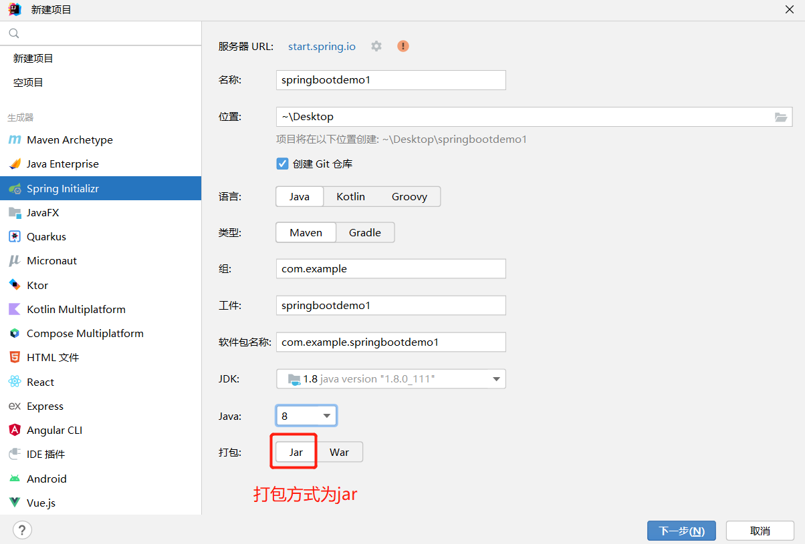
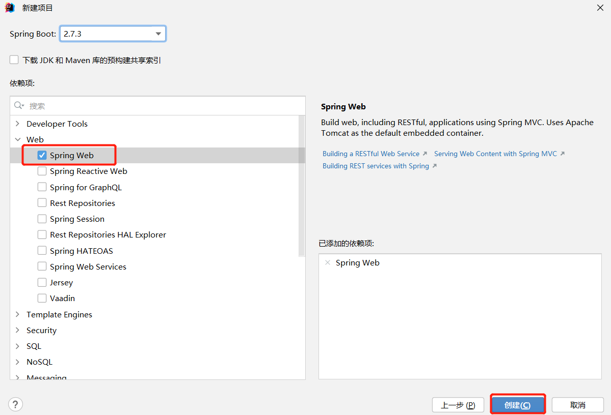
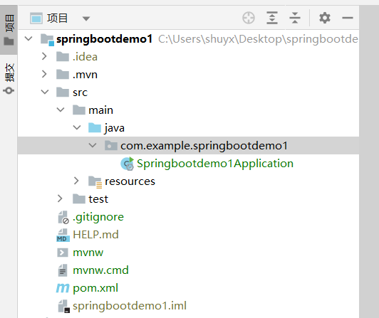

* 选择 Spring Initializr来快速构建SpringBoot工程
* 打包方式这里需要设置为Jar
* 由于开发一个web程序，需要使用SpringMVC技术。因此选择加载Spring Web依赖。
* 创建好的项目会自动生成其他的一些文件，而这些文件目前对我们来说没有任何作用，所以可以将这些文件删除。

```
可以删除的目录和文件如下：
.mvn
.gitignore
HELP.md
mvnw
mvnw.cmd
```

② 步骤2：创建 Controller方法

创建BookController方法，代码如下：
```java
@RestController
@RequestMapping("/books")
public class BookController {
    @GetMapping("/{id}")
    public String getById(@PathVariable Integer id){
        System.out.println("id ==> "+id);
        return "hello , spring boot!";
    }
}
```

③ 步骤3：运行Springbootdemo1Application启动类，并测试

```java
//启动类上会添加@SpringBootApplication注解
@SpringBootApplication
public class Springbootdemo1Application {
    public static void main(String[] args) {
        SpringApplication.run(Springbootdemo1Application.class, args);
    }
}
```

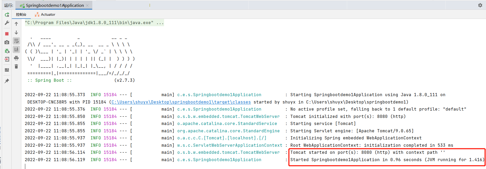


* SpringBoot的引导类是项目的入口，运行启动类的main方法就可以启动项目
* SpringBoot工程内置了tomcat服务器。不需要使用Tomcat插件和配置其他tomcat服务器。


④ 将springboot工程打包为jar包

pom文件中的spring‐boot‐maven‐plugin插件。可以把springboot工程打包为jar包。

```xml
<build>
    <plugins>
        <plugin>
            <groupId>org.springframework.boot</groupId>
            <artifactId>spring-boot-maven-plugin</artifactId>
        </plugin>
    </plugins>
</build>
```

⑤ 部署jar包到服务器

在服务器中执行`java -jar xxxxx.jar`命令，让jar包在服务器中运行。

# 3 SpringBoot起步依赖（启动依赖）

<font color="red">Spring Boot将所有的功能场景都抽取出来，做成一个个的starter（启动依赖）,只需要在项目里面引入这些starte启动依赖。对应相关场景的所有依赖都会导入进来。要用什么功能就导入什么场景的启动依赖。</font>

SpringBoot工程的的pom.xml配置文件中包含了很多的启动依赖。

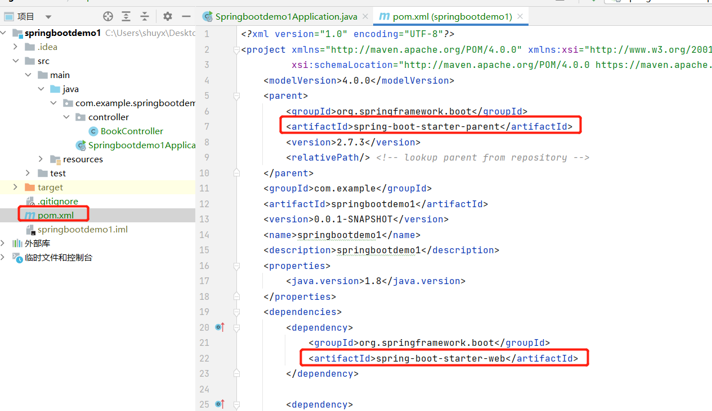

例如：如下
```xml
<!--工程继承spring-boot-starter-parent启动依赖，表示当前项目也是Spring Boot项目，主要用来提供相关的Maven默认依赖。使用它之后，常用的包依赖可以省去version标签。-->
<parent>
    <groupId>org.springframework.boot</groupId>
    <artifactId>spring-boot-starter-parent</artifactId>
    <version>2.7.4</version>
    <relativePath/> <!-- lookup parent from repository -->
</parent>

<!-- spring-boot-starter-web，web场景启动依赖 -->
<dependency>
    <groupId>org.springframework.boot</groupId>
    <artifactId>spring-boot-starter-web</artifactId>
</dependency>
```
鼠标追踪进入到第二个启动依赖中，会发现它又引入了如下的依赖：

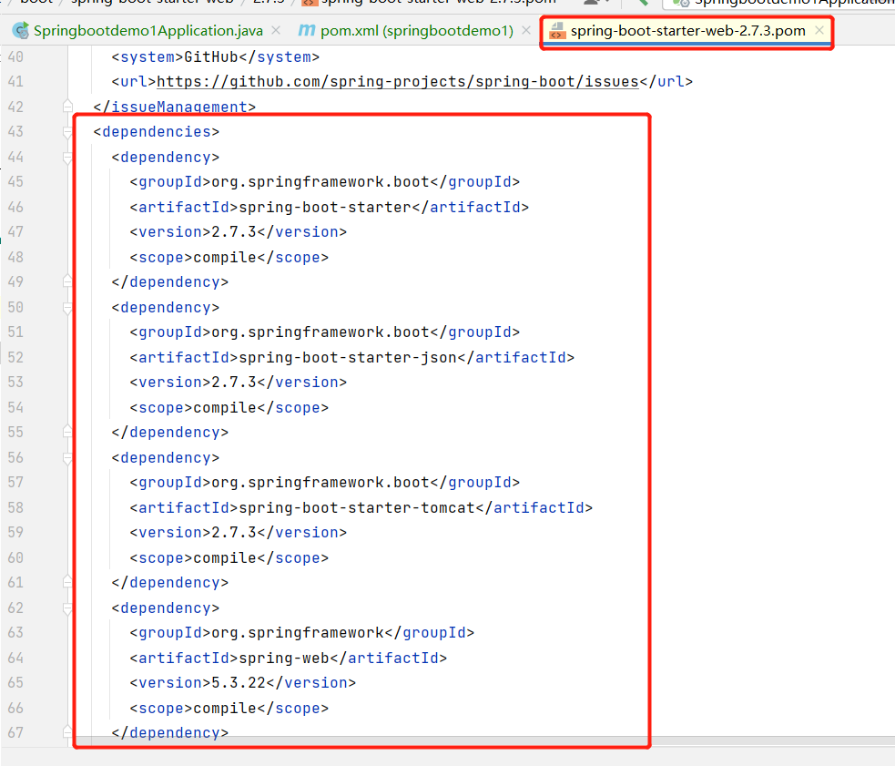

* spring-boot-starter-web启动依赖中又引入了spring-web和spring-webmvc的依赖等，这就是为什么工程中没有依赖这两个包还能正常使用springMVC注解的原因。
* 上图中的spring-boot-starter-tomcat启动依赖。因为该启动依赖内置了tomcat，所以SpringBoot工程无须配置tomcat服务器和tomcat插件就能正常启动。

<font color="red">小结：引入某个启动依赖，就相当于间接引入大量相关依赖。解决了Spring依赖繁琐的问题。</font>

## 1. 如何更换SpringBoot项目内置的web服务器?

如何把SpringBoot项目内置的tomcat服务器，更换为jetty服务器。

① 去除内置的tomcat服务器
```xml
<dependency>
    <groupId>org.springframework.boot</groupId>
    <artifactId>spring-boot-starter-web</artifactId>
    <exclusions>
        <exclusion>
            <artifactId>spring-boot-starter-tomcat</artifactId>
            <groupId>org.springframework.boot</groupId>
        </exclusion>
    </exclusions>
</dependency>
```

② 添加jetty服务器
```xml
<dependency>
    <groupId>org.springframework.boot</groupId>
    <artifactId>spring-boot-starter-jetty</artifactId>
</dependency>
```

# 4 配置文件

SpringBoot提供了3种属性配置方式

* application.properties

```properties
server.port=80   
```

* application.yml 或 application.yaml
```yaml
# 注意在:后，数据前一定要加空格。
server:
    port: 81
```

yml和yaml主要是文件的后缀名区别。其他没区别。

<font color="red">

注意：
1.SpringBoot程序的配置文件名必须是application,只是后缀名不同而已。
2.配置文件必须放在resources目录下
3.三种配置文件的优先级是：application.properties > application.yml > application.yaml
</font>

## 1. 两种配置文件中的配置格式
在springboot框架中，resource文件夹里可以存放配置的文件有两种：properties和yml。建议使用yml格式，因为它的可读性更强。

* application.properties的格式：扁平的k/v格式。
```properties
server.port=8081
```

* application.yml的用法：树型结构。
```yaml
enterprise:
  name: itcast
  age: 16
  tel: 4006184000
  subject:
    - Java
    - 前端
    - 大数据
```

yml格式语法规则
* 大小写敏感
* 使用缩进表示层级关系，只允许使用空格（不允许使用Tab键）
* 属性值前面添加空格（属性名与属性值之间使用冒号+空格作为分隔）

## 2. 读取配置文件数据

### 1 使用 @Value注解

```yaml
server:
  port: 82
enterprise:
  name: itcast
  age: 16
  tel: 4006184000
  subject:
    - Java
    - 前端
    - 大数据
```

```java
@RestController
@RequestMapping("/books")
public class BookController {
    //使用 @Value注解读取配置文件中的数据
    @Value("${server.port}")
    private Integer port;
    @Value("${enterprise.subject[0]}")
    private String subject_00;

    @GetMapping("/{id}")
    public String getById(@PathVariable Integer id){
        System.out.println(port);
        System.out.println(subject_00);
        return "hello , spring boot!";
    }
}
```

### 2 Environment对象

可以使用@Autowired注解注入Environment对象的方式读取数据。这种方式SpringBoot会将配置文件中所有的数据封装到Environment对象中，如果需要使用哪个数据只需要通过调用Environment对象的getProperty(String name)方法获取。

```yaml
server:
  port: 82
enterprise:
  name: itcast
  age: 16
  tel: 4006184000
  subject:
    - Java
    - 前端
    - 大数据
```

```java
@RestController
@RequestMapping("/books")
public class BookController {
    
    @Autowired
    private Environment env;
    
    @GetMapping("/{id}")
    public String getById(@PathVariable Integer id){
        System.out.println(env.getProperty("enterprise.name"));
        System.out.println(env.getProperty("enterprise.subject[0]"));
        return "hello , spring boot!";
    }
}
```

<font color="red">注意：这种方式在开发中很少使用。</font>


## 3 多环境配置文件设置

SpringBoot给开发者提供了多环境的快捷配置，需要切换环境时只需要改一个配置即可。

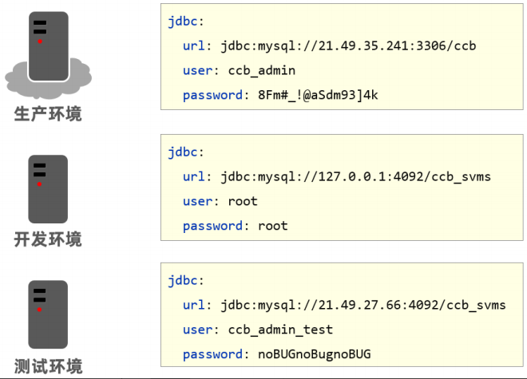

### 1. properties配置文件

properties类型的配置文件配置多环境需要定义不同的配置文件，在resources目录下创建4个配置文件，分别对应生产，测试，开发环境和默认配置文件。

* application-dev.properties是开发环境的配置文件。在该文件中配置端口号为80

```properties
server.port=80
```

* application-test.properties是测试环境的配置文件。在该文件中配置端口号为81

```properties
server.port=81
```

* application-pro.properties是生产环境的配置文件。在该文件中配置端口号为82

```properties
server.port=82
```

SpringBoot只会默认加载名为application.properties的配置文件，所以需要创建application.properties配置文件，在其中设置启用哪个环境配置文件，配置如下:

```properties
# 启动生产环境配置文件
spring.profiles.active=pro
```

### 2. yaml配置文件

> 方法1

在resources目录下创建4个配置文件，分别对应生产，测试，开发环境和默认配置文件。

* application-dev.yml是开发环境的配置文件。在该文件中配置端口号为80

```yml
server:
  port: 8080
```

* application-test.yml是测试环境的配置文件。在该文件中配置端口号为81

```yml
server:
  port: 8081
```

* application-pro.yml是生产环境的配置文件。在该文件中配置端口号为82

```yml
server:
  port: 8082
```

SpringBoot只会默认加载名为application.yml的配置文件，所以需要创建application.yml配置文件，在其中设置启用哪个环境配置文件，配置如下:

```yml
# 启动测试环境配置文件
spring:
  profiles:
    active: test
```

> 方法2

不用创建多个额外的环境配置文件。在application.yml中使用 `---` .可以分割不同的环境配置。

```yaml
#设置启用的环境
spring:
  profiles:
    active: dev  #表示使用的是开发环境的配置
```

综上所述，`application.yml` 配置文件内容如下

```yaml
#设置启用的环境
spring:
  profiles:
    active: pro

### 用---来分割不同环境的配置信息
---
#开发环境
spring:
  config:
    activate:
      on-profile: dev
server:
  port: 80
---
#生产环境
spring:
  config:
    activate:
      on-profile: pro
server:
  port: 81
---
#测试环境
spring:
  config:
    activate:
      on-profile: test
server:
  port: 82
---


```

## 4. 命令行启动参数设置配置参数

SpringBoot提供了在运行jar时设置开启指定的环境的方式。

```shell
## 通过命令行的方式设置选择那个环境配置文件
java –jar xxx.jar –-spring.profiles.active=test

## 设置临时端口号
java –jar xxx.jar –-server.port=88

## 同时指定启用哪个环境配置，又指定临时端口号
java –jar xxx.jar –-server.port=88 –-spring.profiles.active=test
```

<font color="red">优先级：在命令行启动参数设置配置数据 > 在配置文件中设置配置数据</font>


# 5 启动类上的@SpringBootApplication注解

@SpringBootApplication注解作用：
用来标注在某个类上,说明这个类是SpringBoot的主配置类，SpringBoot需要运行这个类的main方法来启动SpringBoot服务应用。

鼠标点击进入到@SpringBootApplication注解中
```java
@Target({ElementType.TYPE})   //设置当前注解可以标记在哪
@Retention(RetentionPolicy.RUNTIME) //设置注解标注的类编译以什么方式保留
@Documented //java doc 会生成注解信息
@Inherited  //是否会被继承
@SpringBootConfiguration  //表示这是一个Spring Boot的配置类
@EnableAutoConfiguration  //SpringBoot开启自动配置，会自动去加载自动配置类
@ComponentScan(  //扫描，若指定basepackage,springboot会自动扫描当前配置类所在包及其子包。
    excludeFilters = {@Filter(
    type = FilterType.CUSTOM,
    classes = {TypeExcludeFilter.class}
), @Filter(
    type = FilterType.CUSTOM,
    classes = {AutoConfigurationExcludeFilter.class}
)}
)
public @interface SpringBootApplication {
  //......................
}
```

<font color="red">springboot所有的配置类，都在启动类中被扫描并加载。</font>


# 6 SpringBoot热部署

为了进一步提高开发效率,springboot提供了全局项目热部署,在开发过程中修改了部分代码以及相关配置文件后,不需要每次重启使修改生效,在项目中开启了springboot全局热部署之后只需要在修改之后等待几秒即可使修改生效。

① 步骤1：导入热部署依赖

```xml
<dependency>
    <groupId>org.springframework.boot</groupId>
    <artifactId>spring-boot-devtools</artifactId>
    <scope>runtime</scope>
    <!-- 设置可选依赖为true,子项目不会继承该依赖 -->
    <optional>true</optional>
</dependency>
```

② 步骤2：在IDEA中修改配置

```
（1）File-Settings-Compiler-Build Project automatically 
（2）ctrl + shift + alt + / ,选择Registry,勾上 Compiler autoMake allow when app running
```

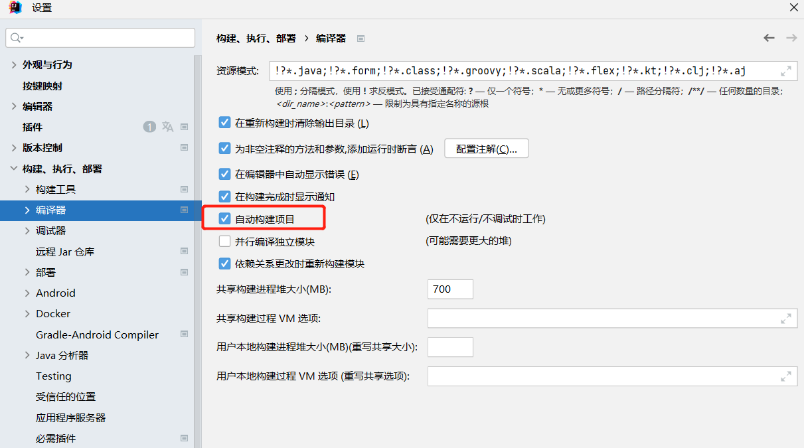
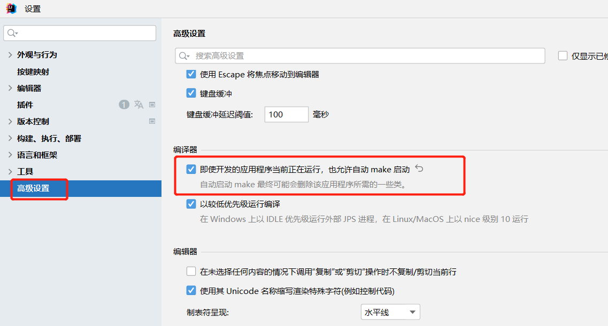


③ 步骤3：启动项目，修改配置,试试热部署。

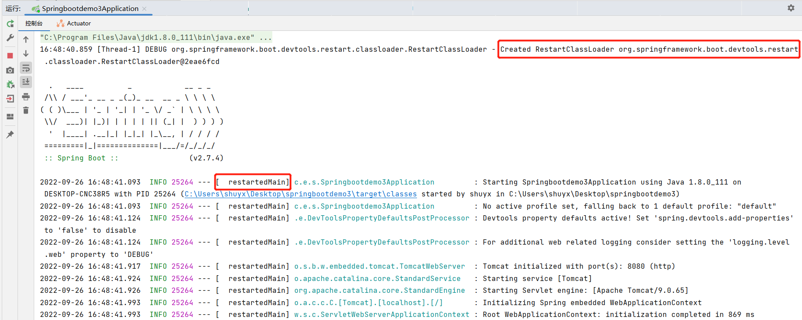

注意:日志出现restartedMain代表已经生效,在使用热部署时如果遇到修改之后不能生效,请重试重启项目在试

④ 小结：
* DevTools严格意义上其实不算热部署，而是快速重启。DevTools通过监控类路径资源，当类路径上的文件发生更改时，自动重新启动应用程序，由于只需要重新读取被修改的类所，所以要比冷启动快。


# 7 SpringBoot统一日志

## 1 介绍

市面上常见的日志框架有：JUL,JCL,Jboss-logging,logback,log4j,log4j2, slf4j等等，主要分类如下：

日志门面(日志的抽象接口层) | 日志实现（日志的实现层）
------------ | -------------
JCL,SLF4J,Jboss-logging | Log4j,JUL,Log4j2,Logback

>小知识：SLF4J , Log4j , Logback是同一个人写的，这个人想优化Log4j，但是认为重新写比较麻烦，于是写了SLF4J这个抽象层日志框架，又写了Logback这个实现类。Log4j2是Apache公司的。

日志门面接口本身通常并没有实际的日志输出能力，它底层还是需要去调用具体的日志实现，也就是日志门面需要跟具体的日志框架结合使用。由于具体日志框架比较多，而且互相也大都不兼容，日志门面接口要想实现与任意日志框架结合需要对应的桥接器。

这是关于slf4j的集成图如下所示:
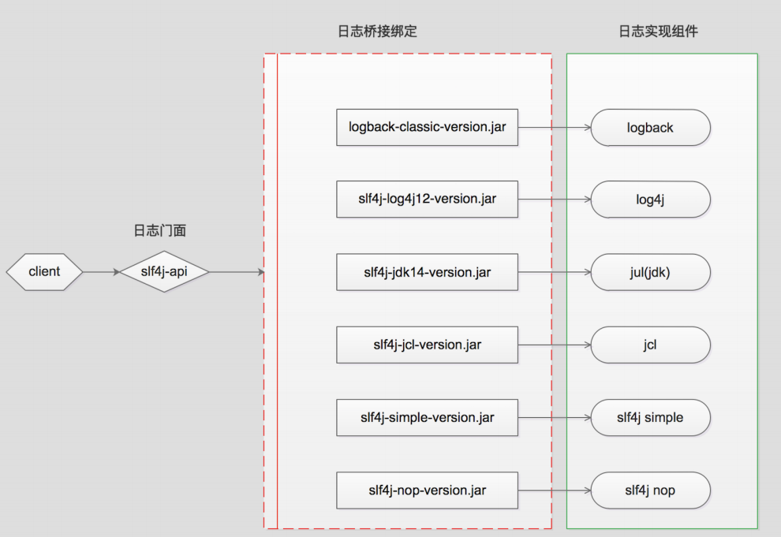


<font color="red">SpringBoot默认的日志实现是slf4j+logback</font>


在代码中应该这么写日志：

* 代码中不可直接使用日志系统（log4j、logback）中的 API ，而应依赖使用日志框架SLF4J中的 API 。使用日志门面框架，有利于维护和各个类的日志处理方式的统一。

```Java
//注意导入日志门面slf4j
import org.slf4j.Logger;
import org.slf4j.LoggerFactory;
public class BookController {
    //获取日志对象
    private Logger logger = LoggerFactory.getLogger(BookController.class);
    
    //打印日志
    @RequestMapping("/logger")
    public void logger(){
        logger.trace("日志级别: trace");  //不会在控制台显示
        logger.debug("日志级别: degue");  //不会在控制台显示
        logger.info("日志级别: info");    //在控制台显示
        logger.warn("日志级别: warn");    //在控制台显示
        logger.error("日志级别: error");  //在控制台显示
    }
}
```

<font color="red">SpringBoot默认日志级别是 info，因此控制台只能打印 info 及更高级别的日志。</font>

## 2 日志级别

各个日志级别：fatal > error > warn > info > debug > trace

<font color="red">SpringBoot默认日志级别是 info，因此控制台只能打印 info 及更高级别的日志。</font>

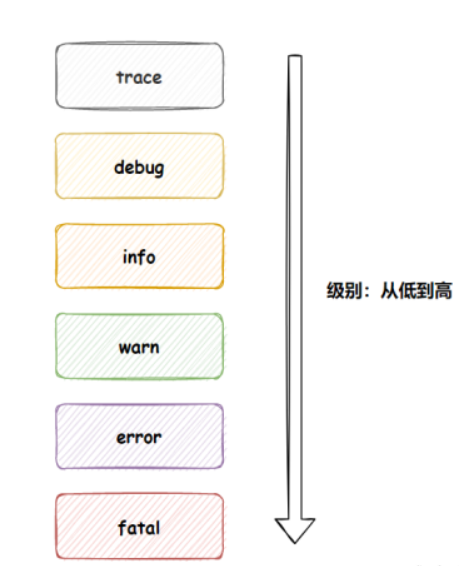

* trace：级别最低
* debug：需要调试时候的关键信息
* info：普通的打印信息
* warn：警告信息
* error：错误信息
* fatal：灾难级的，因为代码异常导致程序退出执行的事件；系统级别，程序无法打印显示

springboot中设置日志级别：
```yaml
logging:
  level:
    root: warn  # 设置所有目录的日志级别
    com:
      example:
        springbootdemo3:
          controller: trace   # 单独设置该目录的日志级别
          service: info       # 单独设置该目录的日志级别
```
* 同时设置全局日志级别和指定目录日志级别，指定目录的日志级别优先级高
* 注意的是:必须从根目录（com包）开始，一步一步的到指定目录；否则springboot找不到。设置无效。


## 3 日志持久化

日志持久化：将控制台打印的日志写到相应的目录或文件下。

```yaml
logging:
  file:
    path: C:\Users\shuyx\Desktop   # 设置日志文件的目录，系统默认命名 spring.log
    name: C:\Users\shuyx\Desktop\springboot-%d{yyyy-MM-dd HH:mm:ss}.log # 设置日志文件的文件名
```

* logging.file.name属性
    * 可以指定路径+文件名。没有路径会默认在项目的相对路径下。
    * 文件名称可以携带日期。例如：springboot-%d{yyyy-MM-dd}.log
* logging.file.path属性
    *  指定文件存放路径。默认名称为spring.log

## 4 日志输出格式

```yaml
logging:
    pattern:
        # 控制台日志输出格式
        console: %d{yyyy-MM-dd hh:mm:ss} [%thread] %-5level %logger{50} - %msg%n
        # 日志文件中日志的输出格式
        file: %d{yyyy-MM-dd} === [%thread] === %-5level === %logger{50} === - %msg%n
```

## 5 日志框架各自配置文件

在类路径下放上每个日志框架自己的配置文件即可, springboot就不使用默认的日志配置。

日志框架 | 日志框架对应的配置文件
------------ | -------------
Logback | logback-spring.xml, logback.xml
Log4j2 | og4j2-spring.xml,log4j2.xml
JUL | logging.properties

例如：当类路径下存在logback.xml日志文件时, 这个文件会直接就被logback日志框架识别。然后替换springboot的默认日志配置。

> logback-spring.xml 与 logback.xml的区别?
1. logback.xml早于application.yml加载，logback-spring.xml要晚于application.yml加载。如果logback配置需要使用application.yml中的属性，需要命名为logback-spring.xml。
2. logback使用application.yml中的属性。使用springProperty标签才可使用application.yml中的值,可以设置默认值。


## 6 日志综合案例

springboot框架下服务每天生成一份日志。

① 删除application.yml文件中的日志配置。

② 在resources目录下创建logback-spring.xml。

logback-spring.xml日志配置文件内容：
```xml
<?xml version="1.0" encoding="UTF-8"?>
<configuration>
    <!--
    说明：
    1. 文件的命名和加载顺序有关
       logback.xml早于application.yml加载，logback-spring.xml晚于application.yml加载
       如果logback配置需要使用application.yml中的属性，需要命名为logback-spring.xml
    2. logback使用application.yml中的属性
       使用springProperty标签才可使用application.yml中的值 可以设置默认值
    -->

    <!-- 日志文件路径 -->
    <!--    windows系统下，路径要用 / 符号 -->
    <property name="logPath" value="C:/Users/shuyx/Desktop"></property>
    <!--    linux系统下-->
<!--    <property name="logPath" value="/home/logs"></property>-->

    <!-- 日志文件名称（应用服务名称） -->
    <property name="appName" value="springbootdemo3"></property>

    <!-- 控制台输出 -->
    <appender name="CONSOLE" class="ch.qos.logback.core.ConsoleAppender">
        <encoder>
            <!--格式化输出：%d表示日期，%thread表示线程名，%-5level：级别从左显示5个字符宽度%message：日志消息，%n是换行符-->
            <pattern>%d{yyyy-MM-dd HH:mm:ss.SSS} - [%X{traceID}] - [%thread] %-5level %logger{50}.%M\(%line\) - %msg%n
            </pattern>
        </encoder>
    </appender>

    <!-- 按照每天生成日志文件 -->
    <appender name="FILE" class="ch.qos.logback.core.rolling.RollingFileAppender">
        <rollingPolicy class="ch.qos.logback.core.rolling.SizeAndTimeBasedRollingPolicy">
            <!--日志文件输出的文件名  %i是指日志文件的索引号-->
            <fileNamePattern>${logPath}/${appName}.%d{yyyy-MM-dd}.%i.log</fileNamePattern>
            <!--日志文件最大大小-->
            <maxFileSize>300MB</maxFileSize>
            <!--日志文件保留天数-->
            <MaxHistory>30</MaxHistory>
        </rollingPolicy>
        <encoder class="ch.qos.logback.classic.encoder.PatternLayoutEncoder">
            <!--格式化输出：%d表示日期，%thread表示线程名，%-5level：级别从左显示5个字符宽度%message：日志消息，%n是换行符-->
            <pattern>%d{yyyy-MM-dd HH:mm:ss.SSS} - [%X{traceID}] - [%thread] %-5level %logger{50}.%M\(%line\) - %msg%n
            </pattern>
        </encoder>
    </appender>
    <!-- 基础日志等级：全局日志输出等级 -->
    <root level="INFO">
        <appender-ref ref="FILE"/>
        <appender-ref ref="CONSOLE"/>
    </root>
</configuration>
```


# 8 SpringBoot整合Mybatis

## 1 创建SpringBoot项目

创建SpringBoot项目，选择导入Spring Web,Mybatis,Mysql相关依赖

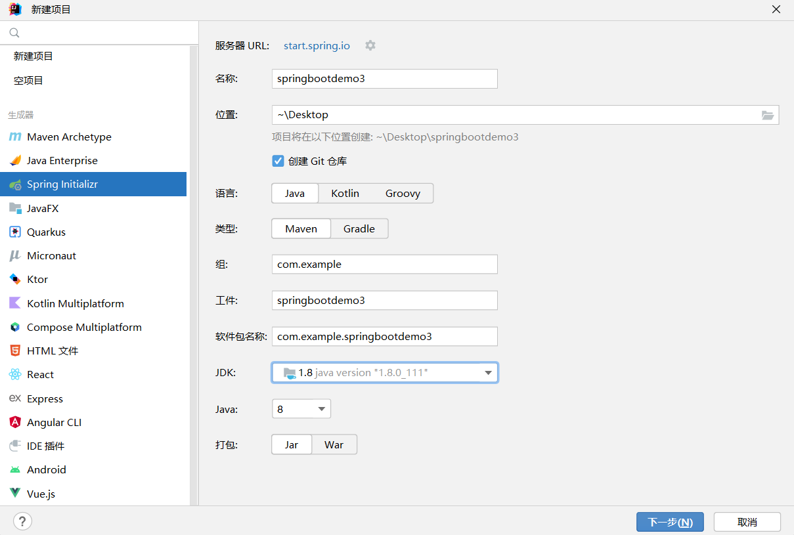
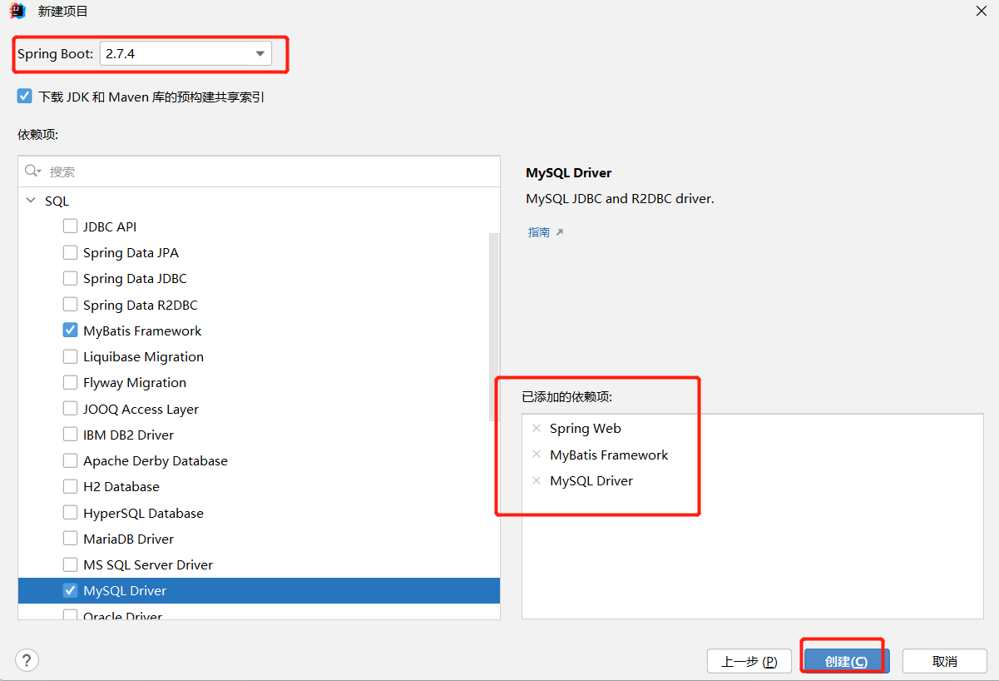
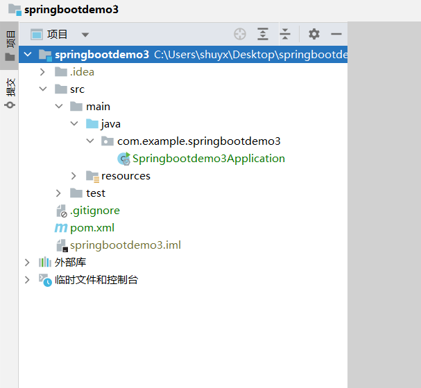

删除项目中的无用目录和文件：
```
.mvn
HELP.md
mvnw
mvnw.cmd
```

完整依赖
```xml
<dependencies>
    <!-- web依赖 -->
    <dependency>
        <groupId>org.springframework.boot</groupId>
        <artifactId>spring-boot-starter-web</artifactId>
    </dependency>
    <!--mybatis 依赖 -->
    <dependency>
        <groupId>org.mybatis.spring.boot</groupId>
        <artifactId>mybatis-spring-boot-starter</artifactId>
        <version>2.2.2</version>
    </dependency>
    <!--mysql 依赖 -->
    <dependency>
        <groupId>mysql</groupId>
        <artifactId>mysql-connector-java</artifactId>
        <scope>runtime</scope>
    </dependency>
</dependencies>
```

## 2 创建数据库表，实体类

1. 创建数据库test,其中创建表book

```
CREATE TABLE `book` (
  `id` int NOT NULL,
  `name` varchar(255) DEFAULT NULL,
  `type` varchar(255) DEFAULT NULL,
  `description` varchar(255) DEFAULT NULL,
  PRIMARY KEY (`id`)
) ENGINE=InnoDB DEFAULT CHARSET=utf8mb4;
```

2. 创建entity包下。其中根据表book创建实体类Book，内容如下

```java
public class Book {
    private Integer id;
    private String name;
    private String type;
    private String description;
    //setter and  getter
    //toString
}
```

## 3  定义dao接口与@Mapper注解

创建dao包下。其中创建BookDao接口，内容如下

```java
//@Mapper让该dao接口能注入到spring容器
@Mapper
public interface BookDao {
    @Select("select * from tbl_book where id = #{id}")
    public Book getById(Integer id);
}
```

说明:Dao接口要想被SpringIOC容器扫描到，有两种解决方案:
* 方案一:在Dao接口上添加@Mapper注解，并且确保Dao处在引导类（启动类）所在包或其子包中。该方案的缺点是需要在每个Dao接口中添加注解。
* 方案二:在引导类上添加@MapperScan注解，其属性为所要扫描的Dao所在包。该方案的好处是只需要写一次，则指定包下的所有Dao接口都能被扫描到，@Mapper注解就可以不写。
* 通常使用更多的是方案一。

```Java
//通过@MapperScan注解扫描包。把dao接口注入到spring容器中
@SpringBootApplication
@MapperScan("com.example.springbootdemo3.dao")
public class Springbootdemo3Application {
    public static void main(String[] args) {
        SpringApplication.run(Springbootdemo3Application.class, args);
    }
}
```


## 4 定义service接口及其实现类

创建service包下。其中创建BookService接口及其实现类，内容如下

```java
public interface BookService {
    public Book getById(Integer id);
}

//////////////////

@Service
public class BookServiceImpl implements BookService {
    @Autowired
    private BookDao dao;
    @Override
    public Book getById(Integer id) {
        return dao.getById(id);
    }
}
```

## 5 定义controller层

创建controller包下。其中创建BookController实现类，内容如下

```java
@RestController
@RequestMapping("/book")
public class BookController {
    @Autowired
    private BookService bookService;

    @RequestMapping("/getById/{id}")
    public Book getById(@PathVariable("id") Integer id){
        return bookService.getById(id);
    }
}
```

## 6 添加数据源配置信息

```yaml
spring:
  datasource:
    driver-class-name: com.mysql.jdbc.Driver
    url: jdbc:mysql://localhost:3306/test?serverTimezone=UTC
    username: root
    password: root
```

## 7 运行启动类，测试接口

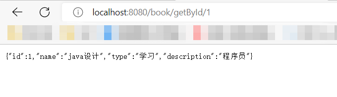

## 8 小结（@Mapper注解）

Dao接口要想被SpringIOC容器扫描到，有两种解决方案:
* 方案一:在Dao接口上添加@Mapper注解，并且确保Dao处在引导类（启动类）所在包或其子包中。该方案的缺点是需要在每个Dao接口中添加注解。
* 方案二:在引导类上添加@MapperScan注解，其属性为所要扫描的Dao所在包。该方案的好处是只需要写一次，则指定包下的所有Dao接口都能被扫描到，@Mapper注解就可以不写。
* 通常使用更多的是方案一。

```Java
//通过@MapperScan注解扫描包。把dao接口注入到spring容器中
@SpringBootApplication
@MapperScan("com.example.springbootdemo3.dao")
public class Springbootdemo3Application {
    public static void main(String[] args) {
        SpringApplication.run(Springbootdemo3Application.class, args);
    }
}
```

# 9 SpringBoot中使用Druid数据源

## 什么是数据源?

数据源简单理解为数据源头，提供了应用程序所需要数据的位置。数据源保证了应用程序与目标数据之间交互的规范和协议,他可以是数据库，文件系统等等。

## 为什么要用数据源?

数据源是提高数据库连接性能的常规手段，数据源会负责维持一个数据库连接池,当程序创建数据源实例时,系统会一次性的创建多个数据库连接，并把这些数据库连接保存在连接池中.当程序需要进行数据库访问时,无须重新获取数据库连接，而是从连接池中取出一个空闲的数据库连接。当程序使用数据库结束后,无需关闭数据库连接，而是将数据库连接归还给连接池即可。通过这种方式,
就可避免频繁的获取数据库连接、关闭数据库连接所导致的性能下降。

## 有那些数据源?

* dbcp数据库连接池是apache上的一个java连接池项目，也是tomcat使用的连接池组件。单独使用dbcp需要3个包来进行数据库连接是一个非常耗时耗资源的行为，dbcp没有自动回收空闲连接的功能。
* c3p0是一个开源的jdbc连接池，实现了数据源和jndi绑定，支持jdbc3和jdbc2的标准扩展。
* Proxool是一种Java数据库连接池技术，是sourceforge下的一个开源项目，这个项目提供一个健壮、易用的连接池，最为关键的是这个连接池提供一个健壮、易用，便于发现连接泄漏的情况
* Druid是一个开源项目，该源码自带SQl监控、SQL防火墙、Web应用监控、Url监控、Session监控、Spring,而且使用起来很方便，只要在web.xml或Spring的配置文件中加以配置即可。

## 使用Druid数据源

SpringBoot有默认的数据源，也可以指定使用Druid数据源，按照以下步骤实现

* 导入Druid数据源依赖
```xml
<dependency>
    <groupId>com.alibaba</groupId>
    <artifactId>druid</artifactId>
    <version>1.1.16</version>
</dependency>
```

* 在application.yml配置文件中配置
可以通过 `spring.datasource.type` 来配置使用什么数据源。配置文件内容可以改进为

```yaml
spring:
  datasource:
    driver-class-name: com.mysql.cj.jdbc.Driver
    url: jdbc:mysql://localhost:3306/test?serverTimezone=UTC
    username: root
    password: root
    type: com.alibaba.druid.pool.DruidDataSource
```


# 10 Spring Boot整合Redis

① 添加依赖

```xml
<dependency>
    <groupId>org.springframework.boot</groupId>
    <artifactId>spring-boot-starter-data-redis</artifactId>
</dependency>
```

② 添加redis配置

```yaml
spring:
  redis:
    host: localhost
    port: 6379
    database: 0
    password: 123456
```

③ 编写redis配置类

该配置类的作用：修改RedisTemplate序列化方式，防止redis客服端查看key和value显示乱码。

```java
@Configuration
public class RedisTemplateConfig {
    @Autowired
    private RedisTemplate redisTemplate;

    @Bean
    public RedisTemplate<String, Object> stringSerializerRedisTemplate() {
        RedisSerializer<String> stringSerializer = new StringRedisSerializer();
        redisTemplate.setKeySerializer(stringSerializer);
        redisTemplate.setValueSerializer(stringSerializer);
        redisTemplate.setHashKeySerializer(stringSerializer);
        redisTemplate.setHashValueSerializer(stringSerializer);
        return redisTemplate;
    }
}
```

③ 使用RedisTemplate编写测试类

* RedisTemplate是Spring封装的操控reids的类。

```java
@RestController
@RequestMapping("/book")
public class BookController {
    @Autowired
    private RedisTemplate redisTemplate;

    @RequestMapping("/testRedis")
    public void testRedis(){
        redisTemplate.opsForValue().set("student","11111");
    }
}
```

④ 客户端查询存入的key和value

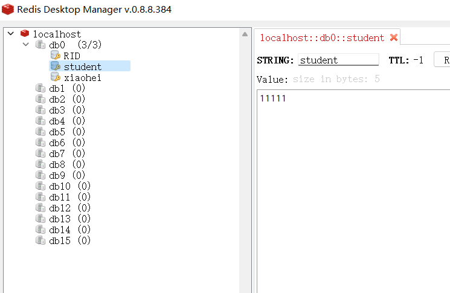


## 使用RedisTemplate造成的redis客服端乱码问题

问题：
使用RedisTemplate连接redis数据库，在保存中文时，发现存进去的key和value有乱码问题，也就是有\xa\xc…之类的前缀，虽然使用通过RedisTemplate读、写key和value时不会有乱码问题，但如果通过命令行或客户端直连到redis库，就会发现数据带了乱码前缀，甚至有些中文值全是乱码。

原因：
乱码是因为RedisTemplate默认使用的序列化器是JdkSerializationRedisSerializer。它默认的序列化器会带来乱码问题。

解决方法：
把RedisTemplate默认的序列化器改成StringRedisSerializer

```java
@Configuration
public class RedisTemplateConfig {
    @Autowired
    private RedisTemplate redisTemplate;
    @Bean
    public RedisTemplate<String, Object> stringSerializerRedisTemplate() {
        RedisSerializer<String> stringSerializer = new StringRedisSerializer();
        redisTemplate.setKeySerializer(stringSerializer);
        redisTemplate.setValueSerializer(stringSerializer);
        redisTemplate.setHashKeySerializer(stringSerializer);
        redisTemplate.setHashValueSerializer(stringSerializer);
        return redisTemplate;
    }
}
```