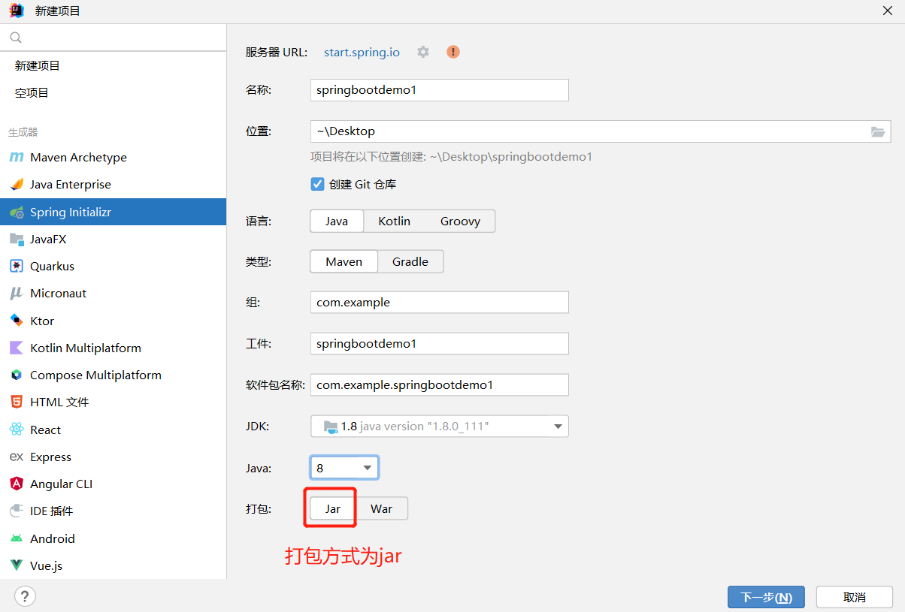
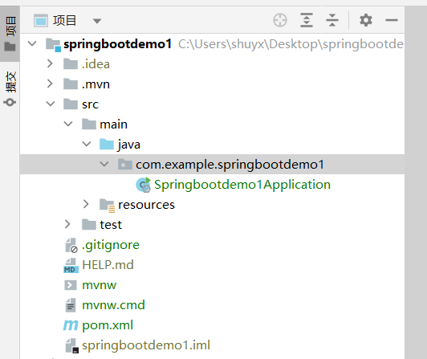
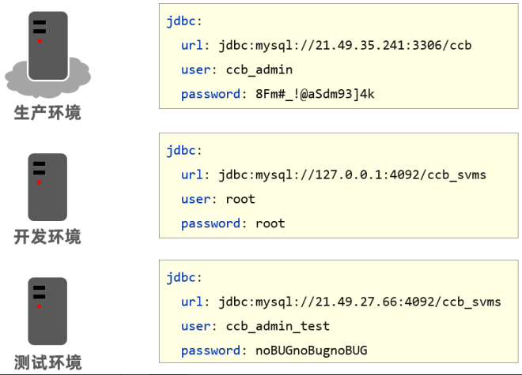
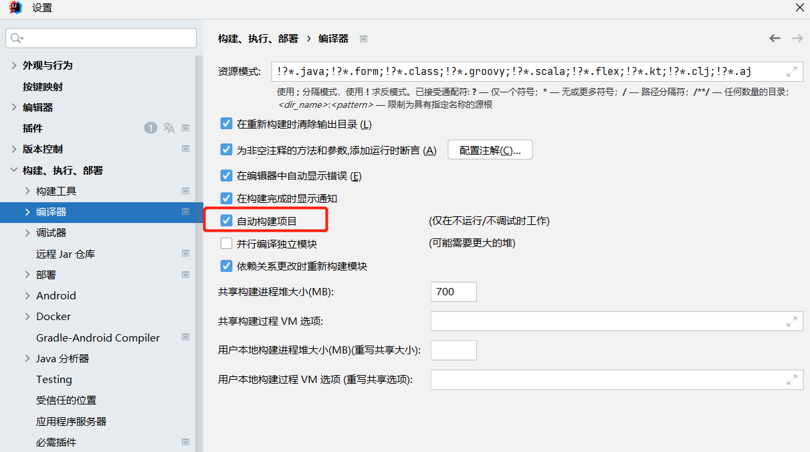
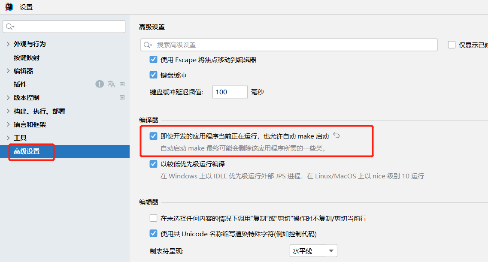

[toc]

# SpringBoot笔记1

当前springboot版本为2.7.4


# SpringBoot介绍

Spring Boot 是 Pivotal 团队在 Spring Framework 的基础上开发的一套全新的开源框架，其目的是为了简化 Spring Framework 应用的搭建和开发过程。Spring Boot 去除了大量的 XML 配置文件，简化了复杂的依赖管理。

关于Spring Boot有一句很出名的话就是约定大于配置。采用Spring Boot可以大大的简化开发模式，它集成了大量常用的第三方库配置，例如 Redis、MongoDB、Dubbo、kafka，ES等等。SpringBoot 应用中这些第三方库几乎可以零配置地开箱即用，大部分的 SpringBoot 应用都只需要非常少量的配置代码，从而让开发者能够更加专注于业务逻辑。

> 原始Spring环境搭建和开发存在以下问题
* 配置繁琐
* 依赖设置繁琐

> SpringBoot的优点
* 快速构建一个独立的 Spring 应用程序
* 内嵌的 Tomcat,Jetty服务器，无须部署WAR文件
* 提供starter POMs来简化Maven配置和减少版本冲突所带来的问题
* 对Spring和第三方库提供默认配置，也可修改默认值，简化框架配置
* 无需配置XML，无代码生成，开箱即用

# SpringBoot入门案例

① 步骤1：新建SpringBoot项目





* 选择 Spring Initializr来快速构建SpringBoot工程
* 打包方式这里需要设置为Jar
* 由于开发一个web程序，需要使用SpringMVC。因此选择加载Spring Web依赖。
* 创建好的项目会自动生成其他的一些文件，而这些文件目前对我们来说没有任何作用，所以可以将这些文件删除。

```
可以删除的目录和文件如下：
.mvn
.gitignore
HELP.md
mvnw
mvnw.cmd
```

② 步骤2：创建 Controller方法

创建BookController方法，代码如下：
```java
@RestController
@RequestMapping("/books")
public class BookController {
    @GetMapping("/{id}")
    public String getById(@PathVariable Integer id){
        System.out.println("id ==> "+id);
        return "hello , spring boot!";
    }
}
```

③ 步骤3：运行Springbootdemo1Application启动类，并测试

默认情况下，SpringBoot项目会自动创建一个名为 ***Application 的主程序启动类 ，该类中使用了一个组合注解 @SpringBootApplication，用来开启 SpringBoot 的自动配置，另外该启动类中包含一个 main() 方法，用来启动该项目。

```java
//启动类上添加@SpringBootApplication注解
@SpringBootApplication
public class Springbootdemo1Application {
    public static void main(String[] args) {
        SpringApplication.run(Springbootdemo1Application.class, args);
    }
}
```


* SpringBoot的引导类是项目的入口，运行引导类的main方法就可以启动项目
* SpringBoot工程内置了tomcat服务器。不需要使用Tomcat插件和配置其他tomcat服务器。

④ 将springboot工程打包为jar包

在pom文件中添加spring‐boot‐maven‐plugin插件。可以把springboot工程打包为jar包。

```xml
<build>
    <plugins>
        <plugin>
            <groupId>org.springframework.boot</groupId>
            <artifactId>spring-boot-maven-plugin</artifactId>
        </plugin>
    </plugins>
</build>
```

⑤ 部署jar包到服务器

在服务器中执行`java -jar xxxxx.jar`命令，让jar包在服务器中运行。

## 启动依赖starter

> 什么是starter

Spring Boot 将日常企业应用研发中的各种场景都抽取出来，做成一个个的 starter（启动器），starter 中整合了该场景下各种可能用到的依赖，用户只需要在 Maven 中引入 starter 依赖，SpringBoot 就能自动扫描到要加载的信息并启动相应的默认配置。

starter 提供了大量的自动配置，让用户摆脱了处理各种依赖和配置的困扰。

注意：并不是所有的 starter 都是由 Spring Boot 官方提供的，也有部分 starter 是第三方技术厂商提供的。

> SpringBoot工程的的pom.xml配置文件中包含了很多的启动依赖。


例如
```xml
<!--工程继承spring-boot-starter-parent启动依赖，表示当前项目也是Spring Boot项目，主要用来提供相关的Maven默认依赖。使用它之后，常用的包依赖可以省去version标签。-->
<parent>
    <groupId>org.springframework.boot</groupId>
    <artifactId>spring-boot-starter-parent</artifactId>
    <version>2.7.4</version>
    <relativePath/> <!-- lookup parent from repository -->
</parent>

<!-- spring-boot-starter-web，web场景启动依赖 -->
<dependency>
    <groupId>org.springframework.boot</groupId>
    <artifactId>spring-boot-starter-web</artifactId>
</dependency>
```

鼠标追踪进入到第二个启动依赖中，会发现它又引入了如下的依赖：


* spring-boot-starter-web启动依赖中又引入了spring-web和spring-webmvc的依赖等，这就是为什么工程中没有依赖这两个包还能正常使用springMVC注解的原因。
* 上图中的spring-boot-starter-tomcat启动依赖。因为该启动依赖内置了tomcat，所以SpringBoot工程无须配置tomcat服务器和tomcat插件就能正常启动。

<font color="red">小结：引入某个启动依赖，就相当于间接引入大量相关依赖。解决了Spring依赖繁琐的问题。</font>


## 启动类上的@SpringBootApplication注解

默认情况下，SpringBoot项目会自动创建一个名为 ***Application 的主程序启动类 ，该类中使用了一个组合注解 @SpringBootApplication，用来开启 SpringBoot 的自动配置，另外该启动类中包含一个 main() 方法，用来启动该项目。

> @SpringBootApplication注解作用

用来标注在某个类上,说明这个类是SpringBoot的主配置类，SpringBoot需要运行这个类的main方法来启动SpringBoot服务应用。

鼠标点击进入到@SpringBootApplication注解中。

```java
@Target({ElementType.TYPE})   //设置当前注解可以标记在哪
@Retention(RetentionPolicy.RUNTIME) //设置注解标注的类编译以什么方式保留
@Documented //java doc 会生成注解信息
@Inherited  //是否会被继承
@SpringBootConfiguration  //表示这是一个Spring Boot的配置类
@EnableAutoConfiguration  //SpringBoot开启自动配置，会自动去加载自动配置类
@ComponentScan(  //扫描，若指定basepackage,springboot会自动扫描当前配置类所在包及其子包。
    excludeFilters = {@Filter(
    type = FilterType.CUSTOM,
    classes = {TypeExcludeFilter.class}
), @Filter(
    type = FilterType.CUSTOM,
    classes = {AutoConfigurationExcludeFilter.class}
)}
)
public @interface SpringBootApplication {
  //......................
}
```

<font color="red">springboot所有的配置类，都在启动类中被扫描并加载。</font>


## 更换SpringBoot项目内置的web服务器

如何把SpringBoot项目内置的tomcat服务器，更换为jetty服务器。

① 去除内置的tomcat服务器
```xml
<dependency>
    <groupId>org.springframework.boot</groupId>
    <artifactId>spring-boot-starter-web</artifactId>
    <exclusions>
        <exclusion>
            <artifactId>spring-boot-starter-tomcat</artifactId>
            <groupId>org.springframework.boot</groupId>
        </exclusion>
    </exclusions>
</dependency>
```

② 添加jetty服务器
```xml
<dependency>
    <groupId>org.springframework.boot</groupId>
    <artifactId>spring-boot-starter-jetty</artifactId>
</dependency>
```

# SpringBoot 配置文件

SpringBoot 默认使用以下3种全局的配置文件，其文件名是固定的。
* application.properties
* application.yml 或 application.yaml
* yml和yaml主要是文件的后缀名区别。其他没区别。

> 注意
1. 配置文件必须放在resources目录下
2. 三种配置文件的优先级是：application.properties > application.yml > application.yaml

## 配置文件中的格式

在springboot框架中，建议使用yml配置文件，因为它的可读性更强。

* application.properties的格式：扁平的k/v格式。
```properties
server.port=8081
spring.profiles.active=dev
spring.datasource.username=root
spring.datasource.password=root
```

* application.yml的格式：树型结构。
```yaml
server:
  port: 8081
spring:
  profiles:
    active: dev
  datasource:
    driver-class-name: com.mysql.jdbc.Driver
    url: jdbc:mysql://127.0.0.1:3306/test
    username: root
    password: root
```

> yml配置文件的格式
* 大小写敏感
* 使用缩进表示层级关系，只允许使用空格（不允许使用Tab键）
* 属性值前面添加空格（属性名与属性值之间使用冒号+空格作为分隔）


## 多个配置文件

通常情况下，Spring Boot 在启动时会将 resources 目录下的 application.properties 或 apllication.yml 作为其默认配置文件。

但是Spring Boot 项目中可以同时存在多个 application.properties 或 application.yml。

> 相同配置的配置文件的优先级

在同一位置下，application.properties 的优先级高于 application.yml。

> 不同位置的配置文件的优先级

Spring Boot 启动时会扫描以下 5 个位置的 application.properties 或 apllication.yml 文件，并将它们作为 Spring boot 的默认配置文件。这5个位置的优先级从上到下，依次降低。

```
file:./config/*/
file:./config/
file:./
classpath:/config/
classpath:/
```

* file: 指当前项目根目录；
* classpath: 指当前项目的类路径，即resources目录。

如下图


> 多配置文件是否会互相覆盖？

SpringBoot会把所有位置的文件都加载，高优先级配置会覆盖低优先级配置，形成互补配置，即：
* 存在相同的配置项时，高优先级的内容会覆盖低优先级的内容；
* 存在不同的配置项时，高优先级和低优先级的配置内容取并集。


## 程序中读取配置文件数据

### 使用 @Value注解

```yaml
server:
  port: 82
enterprise:
  name: itcast
  age: 16
  tel: 4006184000
  subject:
    - Java
    - 前端
    - 大数据
```

```java
@RestController
@RequestMapping("/books")
public class BookController {
    //使用 @Value注解读取配置文件中的数据
    @Value("${server.port}")
    private Integer port;
    @Value("${enterprise.subject[0]}")
    private String subject_00;

    @GetMapping("/{id}")
    public String getById(@PathVariable Integer id){
        System.out.println(port);
        System.out.println(subject_00);
        return "hello , spring boot!";
    }
}
```

### 使用 Environment 类型对象

可以使用@Autowired注解注入Environment对象的方式读取数据。这种方式SpringBoot会将配置文件中所有的数据封装到Environment对象中，如果需要使用哪个数据只需要通过调用Environment对象的getProperty(String name)方法获取。

<font color="red">注意：这种方式在开发中很少使用。</font>

```yaml
server:
  port: 82
enterprise:
  name: itcast
  age: 16
  tel: 4006184000
  subject:
    - Java
    - 前端
    - 大数据
```

```java
@RestController
@RequestMapping("/books")
public class BookController {
    
    @Autowired
    private Environment env;
    
    @GetMapping("/{id}")
    public String getById(@PathVariable Integer id){
        System.out.println(env.getProperty("enterprise.name"));
        System.out.println(env.getProperty("enterprise.subject[0]"));
        return "hello , spring boot!";
    }
}
```

## 多环境配置文件设置

SpringBoot给开发者提供了多环境的快捷配置，需要切换环境时只需要改一个配置即可。



### properties配置文件

properties类型的配置文件配置多环境需要定义不同的配置文件，在resources目录下创建4个配置文件，分别对应生产，测试，开发环境和默认配置文件。

* application-dev.properties是开发环境的配置文件。在该文件中配置端口号为80

```properties
server.port=80
```

* application-test.properties是测试环境的配置文件。在该文件中配置端口号为81

```properties
server.port=81
```

* application-pro.properties是生产环境的配置文件。在该文件中配置端口号为82

```properties
server.port=82
```

SpringBoot只会默认加载名为application.properties的配置文件，所以需要创建application.properties配置文件，在其中设置启用哪个环境配置文件，配置如下:

```properties
# 启动生产环境配置文件
spring.profiles.active=pro
```

### yaml配置文件

> 方法1

在resources目录下创建4个配置文件，分别对应生产，测试，开发环境和默认配置文件。

* application-dev.yml是开发环境的配置文件。在该文件中配置端口号为80

```yml
server:
  port: 8080
```

* application-test.yml是测试环境的配置文件。在该文件中配置端口号为81

```yml
server:
  port: 8081
```

* application-pro.yml是生产环境的配置文件。在该文件中配置端口号为82

```yml
server:
  port: 8082
```

SpringBoot只会默认加载名为application.yml的配置文件，所以需要创建application.yml配置文件，在其中设置启用哪个环境配置文件，配置如下:

```yml
# 启动测试环境配置文件
spring:
  profiles:
    active: test
```

> 方法2

不用创建多个额外的环境配置文件。在application.yml中使用 `---` .可以分割不同的环境配置。

```yaml
#设置启用的环境
spring:
  profiles:
    active: dev  #表示使用的是开发环境的配置
```

综上所述，`application.yml` 配置文件内容如下

```yaml
#设置启用的环境
spring:
  profiles:
    active: pro

### 用---来分割不同环境的配置信息
---
#开发环境
spring:
  config:
    activate:
      on-profile: dev
server:
  port: 80
---
#生产环境
spring:
  config:
    activate:
      on-profile: pro
server:
  port: 81
---
#测试环境
spring:
  config:
    activate:
      on-profile: test
server:
  port: 82
---

```

## 命令行启动参数设置配置参数

SpringBoot提供了在运行jar时设置开启指定的环境的方式。

```bash
## 通过命令行的方式设置选择那个环境配置文件
java –jar xxx.jar –-spring.profiles.active=test

## 设置临时端口号
java –jar xxx.jar –-server.port=88

## 同时指定启用哪个环境配置，又指定临时端口号
java –jar xxx.jar –-server.port=88 –-spring.profiles.active=test
```

<font color="red">优先级：在命令行启动参数设置配置数据 > 在配置文件中设置配置数据</font>

## 外部程序配置文件

Spring Boot 还可以加载一些位于项目外部的配置文件。

1. 先创建一个外部配置文件my-application.yml

2. 命令行加载外部配置文件

```bash
# --spring.config.location
java -jar xxx.jar  --spring.config.location=D:\myConfig\my-application.yml

# --spring.config.additional-location
java -jar xxx.jar  --spring.config.additional-location=D:\myConfig\my-application.yml
```

与 `--spring.config.location` 不同，`--spring.config.additional-location` 不会使项目默认的配置文件失效，使用该命令行参数添加的外部配置文件会与项目默认的配置文件共同生效，形成互补配置，且其优先级是最高的，比所有默认配置文件的优先级都高。


# SpringBoot热部署

为了进一步提高开发效率,springboot提供了全局项目热部署,在开发过程中修改了部分代码以及相关配置文件后,不需要每次重启使修改生效,在项目中开启了springboot全局热部署之后只需要在修改之后等待几秒即可使修改生效。

① 步骤1：导入热部署依赖

```xml
<dependency>
    <groupId>org.springframework.boot</groupId>
    <artifactId>spring-boot-devtools</artifactId>
    <scope>runtime</scope>
    <!-- 设置可选依赖为true,子项目不会继承该依赖 -->
    <optional>true</optional>
</dependency>
```

② 步骤2：在IDEA中修改配置

```
（1）File-Settings-Compiler-Build Project automatically 
（2）ctrl + shift + alt + / ,选择Registry,勾上 Compiler autoMake allow when app running
```





③ 步骤3：启动项目，修改配置,试试热部署。


注意:日志出现restartedMain代表已经生效,在使用热部署时如果遇到修改之后不能生效,请重试重启项目在试

④ 小结：

* DevTools严格意义上其实不算热部署，而是快速重启。DevTools通过监控类路径资源，当类路径上的文件发生更改时，自动重新启动应用程序，由于只需要重新读取被修改的类所，所以要比冷启动快。
