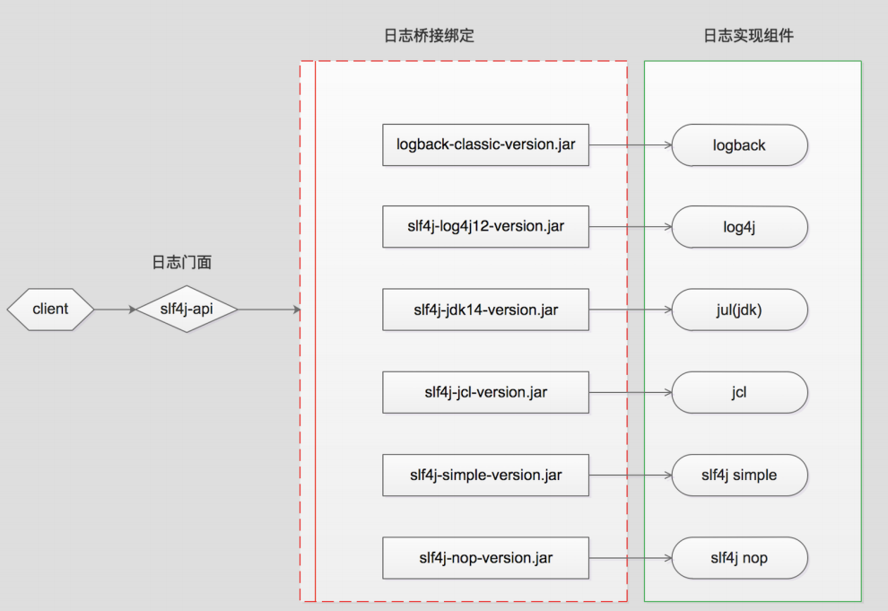
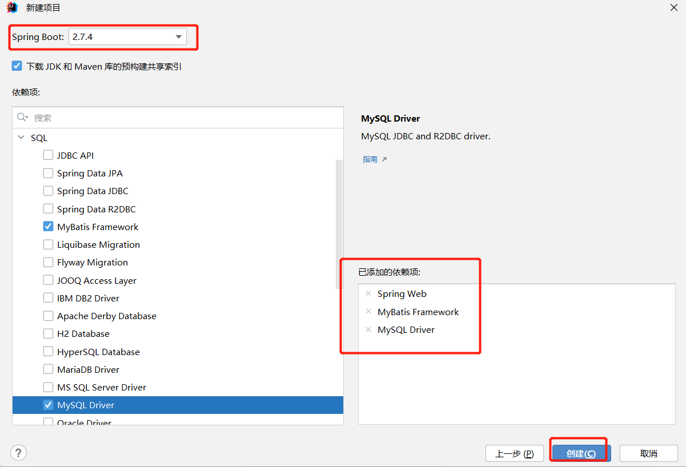
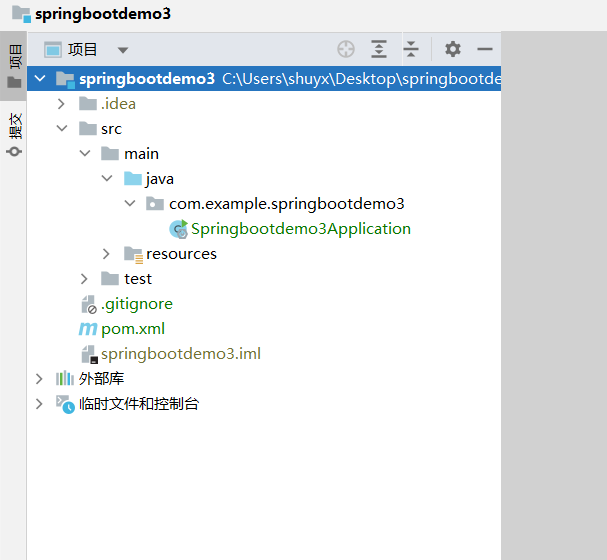

[toc]

# SpringBoot笔记2

当前springboot版本为2.7.4

# SpringBoot 静态资源映射

在 Web 应用中会涉及到大量的静态资源，例如 JS、CSS 和 HTML 等。例如通过 Spring MVC 访问静态资源文件时，需要先配置静态资源的映射；但在 SpringBoot 中则不再需要进行此项配置，因为 SpringBoot 已经默认完成了这一工作。

## 默认静态资源映射

SpringBoot默认已经完成静态资源映射的工作。

当访问项目中的任意静态资源（即“/**”）时，Spring Boot会默认从以下路径中查找静态资源文件（优先级依次降低）：

```
classpath:/META-INF/resources/
classpath:/resources/
classpath:/static/
classpath:/public/
```

1. 例如在resources目录下，创建一个hello.html文件。
2. 启动SpringBoot项目。
3. 打开浏览器，访问该html文件。请求路径为：`http://localhost:8080/hello.html`
4. Spring Boot就会依次从优先级高的目录开始查询hello.html并返回。


# SpringBoot 自定义拦截器

Spring Boot 同样提供了拦截器功能。 

在 Spring Boot 项目中，使用拦截器功能通常需要以下 3 步：
1. 定义拦截器。
2. 注册拦截器。
3. 指定拦截规则（如果是拦截所有，静态资源也会被拦截）。


> 定义拦截器

```java
public class MyInterceptor implements HandlerInterceptor {
   
    @Override
    public boolean preHandle(HttpServletRequest request, HttpServletResponse response, Object handler) throws Exception {
        //方法执行前
        return true;
    }

    @Override
    public void postHandle(HttpServletRequest request, HttpServletResponse response, Object handler, ModelAndView modelAndView) throws Exception {
        //方法执行前
    }

    @Override
    public void afterCompletion(HttpServletRequest request, HttpServletResponse response, Object handler, Exception ex) throws Exception {
        //页面渲染后
    }
}

```

定义一个拦截器类需要先创建一个拦截器类，并实现HandlerInterceptor接口。HandlerInterceptor接口中有以下 3 个方法,如图所示。


> 注册拦截器

创建一个实现了 WebMvcConfigurer 接口的配置类，重写 addInterceptors() 方法，并在该方法中调用 registry.addInterceptor() 方法将自定义的拦截器注册到容器中。

```java
@Configuration
public class MyMvcConfig implements WebMvcConfigurer {
    ......
    //重写WebMvcConfigurer接口的addInterceptors方法
    @Override
    public void addInterceptors(InterceptorRegistry registry) {
        // 注册自己创建拦截器
        registry.addInterceptor(new MyInterceptor());
    }
}
```

> 指定拦截规则

修改 MyMvcConfig 配置类中 addInterceptors() 方法的代码，指定拦截器的拦截规则。

```java
@Configuration
public class MyMvcConfig implements WebMvcConfigurer {
    ......
    @Override
    public void addInterceptors(InterceptorRegistry registry) {
        // 注册自己创建拦截器，并且指定拦截规则
        //拦截所有请求，包括静态资源文件
        //放行登录页，登陆接口，静态资源等
        registry.addInterceptor(new LoginInterceptor())
        .addPathPatterns("/**")
        .excludePathPatterns("/", "/login", "/index.html", "/user/login", "/css/**", "/images/**", "/js/**", "/fonts/**"); 
    }
}
```

* addPathPatterns：该方法用于指定拦截路径，例如拦截路径为“/**”，表示拦截所有请求，包括对静态资源的请求。
* excludePathPatterns：该方法用于排除拦截路径，即指定不需要被拦截器拦截的请求。


# SpringBoot统一日志

## 介绍

市面上常见的日志框架有：JUL,JCL,Jboss-logging,logback,log4j,log4j2, slf4j等等，主要分类如下：

日志门面(日志的抽象接口层) | 日志实现（日志的实现层）
------------ | -------------
JCL,SLF4J,Jboss-logging | Log4j,JUL,Log4j2,Logback

>小知识：SLF4J , Log4j , Logback是同一个人写的，这个人想优化Log4j，但是认为重新写比较麻烦，于是写了SLF4J这个抽象层日志框架，又写了Logback这个实现类。Log4j2是Apache公司的。

日志门面接口本身通常并没有实际的日志输出能力，它底层还是需要去调用具体的日志实现，也就是日志门面需要跟具体的日志框架结合使用。由于具体日志框架比较多，而且互相也大都不兼容，日志门面接口要想实现与任意日志框架结合需要对应的桥接器。

这是关于slf4j的集成图如下所示:



<font color="red">SpringBoot默认的日志实现是slf4j+logback</font>


在代码中应该这么写日志：

* 代码中不可直接使用日志系统（log4j、logback）中的 API ，而应依赖使用日志框架SLF4J中的 API 。使用日志门面框架，有利于维护和各个类的日志处理方式的统一。

```Java
//注意导入日志门面slf4j
import org.slf4j.Logger;
import org.slf4j.LoggerFactory;
public class BookController {
    //获取日志对象
    private Logger logger = LoggerFactory.getLogger(BookController.class);
    
    //打印日志
    @RequestMapping("/logger")
    public void logger(){
        logger.trace("日志级别: trace");  //不会在控制台显示
        logger.debug("日志级别: degue");  //不会在控制台显示
        logger.info("日志级别: info");    //在控制台显示
        logger.warn("日志级别: warn");    //在控制台显示
        logger.error("日志级别: error");  //在控制台显示
    }
}
```

<font color="red">SpringBoot默认日志级别是 info，因此控制台只能打印 info 及更高级别的日志。</font>

## 日志级别

各个日志级别：fatal > error > warn > info > debug > trace

<font color="red">SpringBoot默认日志级别是 info，因此控制台只能打印 info 及更高级别的日志。</font>


* trace：级别最低
* debug：需要调试时候的关键信息
* info：普通的打印信息
* warn：警告信息
* error：错误信息
* fatal：灾难级的，因为代码异常导致程序退出执行的事件；系统级别，程序无法打印显示

springboot中设置日志级别：
```yaml
logging:
  level:
    root: warn  # 设置所有目录的日志级别
    com:
      example:
        springbootdemo3:
          controller: trace   # 单独设置该目录的日志级别
          service: info       # 单独设置该目录的日志级别
```
* 同时设置全局日志级别和指定目录日志级别，指定目录的日志级别优先级高
* 注意的是:必须从根目录（com包）开始，一步一步的到指定目录；否则springboot找不到。设置无效。


## 日志持久化

日志持久化：将控制台打印的日志写到相应的目录或文件下。

```yaml
logging:
  file:
    path: C:\Users\shuyx\Desktop   # 设置日志文件的目录，系统默认命名 spring.log
    name: C:\Users\shuyx\Desktop\springboot-%d{yyyy-MM-dd HH:mm:ss}.log # 设置日志文件的文件名
```

* logging.file.name属性
    * 可以指定路径+文件名。没有路径会默认在项目的相对路径下。
    * 文件名称可以携带日期。例如：springboot-%d{yyyy-MM-dd}.log
* logging.file.path属性
    *  指定文件存放路径。默认名称为spring.log

## 日志输出格式

```yaml
logging:
    pattern:
        # 控制台日志输出格式
        console: %d{yyyy-MM-dd hh:mm:ss} [%thread] %-5level %logger{50} - %msg%n
        # 日志文件中日志的输出格式
        file: %d{yyyy-MM-dd} === [%thread] === %-5level === %logger{50} === - %msg%n
```

## 日志框架各自配置文件

在类路径下放上每个日志框架自己的配置文件即可, springboot就不使用默认的日志配置。

日志框架 | 日志框架对应的配置文件
------------ | -------------
Logback | logback-spring.xml, logback.xml
Log4j2 | og4j2-spring.xml,log4j2.xml
JUL | logging.properties

例如：当类路径下存在logback.xml日志文件时, 这个文件会直接就被logback日志框架识别。然后替换springboot的默认日志配置。

> logback-spring.xml 与 logback.xml的区别?
1. logback.xml早于application.yml加载，logback-spring.xml要晚于application.yml加载。如果logback配置需要使用application.yml中的属性，需要命名为logback-spring.xml。
2. logback使用application.yml中的属性。使用springProperty标签才可使用application.yml中的值,可以设置默认值。


## 日志综合案例

springboot框架下服务每天生成一份日志。

① 删除application.yml文件中的日志配置。

② 在resources目录下创建logback-spring.xml。

logback-spring.xml日志配置文件内容：
```xml
<?xml version="1.0" encoding="UTF-8"?>
<configuration>
    <!--
    说明：
    1. 文件的命名和加载顺序有关
       logback.xml早于application.yml加载，logback-spring.xml晚于application.yml加载
       如果logback配置需要使用application.yml中的属性，需要命名为logback-spring.xml
    2. logback使用application.yml中的属性
       使用springProperty标签才可使用application.yml中的值 可以设置默认值
    -->

    <!-- 日志文件路径 -->
    <!--    windows系统下，路径要用 / 符号 -->
    <property name="logPath" value="C:/Users/shuyx/Desktop"></property>
    <!--    linux系统下-->
<!--    <property name="logPath" value="/home/logs"></property>-->

    <!-- 日志文件名称（应用服务名称） -->
    <property name="appName" value="springbootdemo3"></property>

    <!-- 控制台输出 -->
    <appender name="CONSOLE" class="ch.qos.logback.core.ConsoleAppender">
        <encoder>
            <!--格式化输出：%d表示日期，%thread表示线程名，%-5level：级别从左显示5个字符宽度%message：日志消息，%n是换行符-->
            <pattern>%d{yyyy-MM-dd HH:mm:ss.SSS} - [%X{traceID}] - [%thread] %-5level %logger{50}.%M\(%line\) - %msg%n
            </pattern>
        </encoder>
    </appender>

    <!-- 按照每天生成日志文件 -->
    <appender name="FILE" class="ch.qos.logback.core.rolling.RollingFileAppender">
        <rollingPolicy class="ch.qos.logback.core.rolling.SizeAndTimeBasedRollingPolicy">
            <!--日志文件输出的文件名  %i是指日志文件的索引号-->
            <fileNamePattern>${logPath}/${appName}.%d{yyyy-MM-dd}.%i.log</fileNamePattern>
            <!--日志文件最大大小-->
            <maxFileSize>300MB</maxFileSize>
            <!--日志文件保留天数-->
            <MaxHistory>30</MaxHistory>
        </rollingPolicy>
        <encoder class="ch.qos.logback.classic.encoder.PatternLayoutEncoder">
            <!--格式化输出：%d表示日期，%thread表示线程名，%-5level：级别从左显示5个字符宽度%message：日志消息，%n是换行符-->
            <pattern>%d{yyyy-MM-dd HH:mm:ss.SSS} - [%X{traceID}] - [%thread] %-5level %logger{50}.%M\(%line\) - %msg%n
            </pattern>
        </encoder>
    </appender>
    <!-- 基础日志等级：全局日志输出等级 -->
    <root level="INFO">
        <appender-ref ref="FILE"/>
        <appender-ref ref="CONSOLE"/>
    </root>
</configuration>
```

# SpringBoot整合Mybatis

## 创建SpringBoot项目

创建SpringBoot项目，选择导入Spring Web,Mybatis,Mysql相关依赖





删除项目中的无用目录和文件：
```
.mvn
HELP.md
mvnw
mvnw.cmd
```

完整依赖
```xml
<dependencies>
    <!-- web依赖 -->
    <dependency>
        <groupId>org.springframework.boot</groupId>
        <artifactId>spring-boot-starter-web</artifactId>
    </dependency>
    <!--mybatis 依赖 -->
    <dependency>
        <groupId>org.mybatis.spring.boot</groupId>
        <artifactId>mybatis-spring-boot-starter</artifactId>
        <version>2.2.2</version>
    </dependency>
    <!--mysql 依赖 -->
    <dependency>
        <groupId>mysql</groupId>
        <artifactId>mysql-connector-java</artifactId>
        <scope>runtime</scope>
    </dependency>
</dependencies>
```

## 创建数据库表，实体类

1. 创建数据库test,其中创建表book

```
CREATE TABLE `book` (
  `id` int NOT NULL,
  `name` varchar(255) DEFAULT NULL,
  `type` varchar(255) DEFAULT NULL,
  `description` varchar(255) DEFAULT NULL,
  PRIMARY KEY (`id`)
) ENGINE=InnoDB DEFAULT CHARSET=utf8mb4;
```

2. 创建entity包下。其中根据表book创建实体类Book，内容如下

```java
public class Book {
    private Integer id;
    private String name;
    private String type;
    private String description;
    //setter and  getter
    //toString
}
```

## 定义dao接口与@Mapper注解

创建dao包下。其中创建BookDao接口，内容如下

```java
//@Mapper让该dao接口能注入到spring容器
@Mapper
public interface BookDao {
    @Select("select * from tbl_book where id = #{id}")
    public Book getById(Integer id);
}
```

说明:Dao接口要想被SpringIOC容器扫描到，有两种解决方案:
* 方案一:在Dao接口上添加@Mapper注解，并且确保Dao处在引导类（启动类）所在包或其子包中。该方案的缺点是需要在每个Dao接口中添加注解。
* 方案二:在引导类上添加@MapperScan注解，其属性为所要扫描的Dao所在包。该方案的好处是只需要写一次，则指定包下的所有Dao接口都能被扫描到，@Mapper注解就可以不写。
* 通常使用更多的是方案一。

```Java
//通过@MapperScan注解扫描包。把dao接口注入到spring容器中
@SpringBootApplication
@MapperScan("com.example.springbootdemo3.dao")
public class Springbootdemo3Application {
    public static void main(String[] args) {
        SpringApplication.run(Springbootdemo3Application.class, args);
    }
}
```


## 定义service接口及其实现类

创建service包下。其中创建BookService接口及其实现类，内容如下

```java
public interface BookService {
    public Book getById(Integer id);
}

//////////////////

@Service
public class BookServiceImpl implements BookService {
    @Autowired
    private BookDao dao;
    @Override
    public Book getById(Integer id) {
        return dao.getById(id);
    }
}
```

## 定义controller层

创建controller包下。其中创建BookController实现类，内容如下

```java
@RestController
@RequestMapping("/book")
public class BookController {
    @Autowired
    private BookService bookService;

    @RequestMapping("/getById/{id}")
    public Book getById(@PathVariable("id") Integer id){
        return bookService.getById(id);
    }
}
```

## 添加数据源配置信息

```yaml
spring:
  datasource:
    driver-class-name: com.mysql.jdbc.Driver
    url: jdbc:mysql://localhost:3306/test?serverTimezone=UTC
    username: root
    password: root
```

## 运行启动类，测试接口


## 小结（@Mapper注解）

Dao接口要想被SpringIOC容器扫描到，有两种解决方案:
* 方案一:在Dao接口上添加@Mapper注解，并且确保Dao处在引导类（启动类）所在包或其子包中。该方案的缺点是需要在每个Dao接口中添加注解。
* 方案二:在引导类上添加@MapperScan注解，其属性为所要扫描的Dao所在包。该方案的好处是只需要写一次，则指定包下的所有Dao接口都能被扫描到，@Mapper注解就可以不写。
* 通常使用更多的是方案一。

```Java
//通过@MapperScan注解扫描包。把dao接口注入到spring容器中
@SpringBootApplication
@MapperScan("com.example.springbootdemo3.dao")
public class Springbootdemo3Application {
    public static void main(String[] args) {
        SpringApplication.run(Springbootdemo3Application.class, args);
    }
}
```

# SpringBoot中使用Druid数据源

## 什么是数据源?

数据源简单理解为数据源头，提供了应用程序所需要数据的位置。数据源保证了应用程序与目标数据之间交互的规范和协议,他可以是数据库，文件系统等等。

## 为什么要用数据源?

数据源是提高数据库连接性能的常规手段，数据源会负责维持一个数据库连接池,当程序创建数据源实例时,系统会一次性的创建多个数据库连接，并把这些数据库连接保存在连接池中.当程序需要进行数据库访问时,无须重新获取数据库连接，而是从连接池中取出一个空闲的数据库连接。当程序使用数据库结束后,无需关闭数据库连接，而是将数据库连接归还给连接池即可。通过这种方式,
就可避免频繁的获取数据库连接、关闭数据库连接所导致的性能下降。

## 有那些数据源?

* dbcp数据库连接池是apache上的一个java连接池项目，也是tomcat使用的连接池组件。单独使用dbcp需要3个包来进行数据库连接是一个非常耗时耗资源的行为，dbcp没有自动回收空闲连接的功能。
* c3p0是一个开源的jdbc连接池，实现了数据源和jndi绑定，支持jdbc3和jdbc2的标准扩展。
* Proxool是一种Java数据库连接池技术，是sourceforge下的一个开源项目，这个项目提供一个健壮、易用的连接池，最为关键的是这个连接池提供一个健壮、易用，便于发现连接泄漏的情况
* Druid是一个开源项目，该源码自带SQl监控、SQL防火墙、Web应用监控、Url监控、Session监控、Spring,而且使用起来很方便，只要在web.xml或Spring的配置文件中加以配置即可。

## 使用Druid数据源

SpringBoot有默认的数据源，也可以指定使用Druid数据源，按照以下步骤实现

* 导入Druid数据源依赖
```xml
<dependency>
    <groupId>com.alibaba</groupId>
    <artifactId>druid</artifactId>
    <version>1.1.16</version>
</dependency>
```

* 在application.yml配置文件中配置
可以通过 `spring.datasource.type` 来配置使用什么数据源。配置文件内容可以改进为

```yaml
spring:
  datasource:
    driver-class-name: com.mysql.cj.jdbc.Driver
    url: jdbc:mysql://localhost:3306/test?serverTimezone=UTC
    username: root
    password: root
    type: com.alibaba.druid.pool.DruidDataSource
```


# Spring Boot整合Redis

① 添加依赖

```xml
<dependency>
    <groupId>org.springframework.boot</groupId>
    <artifactId>spring-boot-starter-data-redis</artifactId>
</dependency>
```

② 添加redis配置

```yaml
spring:
  redis:
    host: localhost
    port: 6379
    database: 0
    password: 123456
```

③ 编写redis配置类

该配置类的作用：修改RedisTemplate序列化方式，防止redis客服端查看key和value显示乱码。

```java
@Configuration
public class RedisTemplateConfig {
    @Autowired
    private RedisTemplate redisTemplate;

    @Bean
    public RedisTemplate<String, Object> stringSerializerRedisTemplate() {
        RedisSerializer<String> stringSerializer = new StringRedisSerializer();
        redisTemplate.setKeySerializer(stringSerializer);
        redisTemplate.setValueSerializer(stringSerializer);
        redisTemplate.setHashKeySerializer(stringSerializer);
        redisTemplate.setHashValueSerializer(stringSerializer);
        return redisTemplate;
    }
}
```

③ 使用RedisTemplate编写测试类

* RedisTemplate是Spring封装的操控reids的类。

```java
@RestController
@RequestMapping("/book")
public class BookController {
    @Autowired
    private RedisTemplate redisTemplate;

    @RequestMapping("/testRedis")
    public void testRedis(){
        redisTemplate.opsForValue().set("student","11111");
    }
}
```

④ 客户端查询存入的key和value


## 使用RedisTemplate造成的redis客服端乱码问题

问题：
使用RedisTemplate连接redis数据库，在保存中文时，发现存进去的key和value有乱码问题，也就是有\xa\xc…之类的前缀，虽然使用通过RedisTemplate读、写key和value时不会有乱码问题，但如果通过命令行或客户端直连到redis库，就会发现数据带了乱码前缀，甚至有些中文值全是乱码。

原因：
乱码是因为RedisTemplate默认使用的序列化器是JdkSerializationRedisSerializer。它默认的序列化器会带来乱码问题。

解决方法：
把RedisTemplate默认的序列化器改成StringRedisSerializer

```java
@Configuration
public class RedisTemplateConfig {
    @Autowired
    private RedisTemplate redisTemplate;
    @Bean
    public RedisTemplate<String, Object> stringSerializerRedisTemplate() {
        RedisSerializer<String> stringSerializer = new StringRedisSerializer();
        redisTemplate.setKeySerializer(stringSerializer);
        redisTemplate.setValueSerializer(stringSerializer);
        redisTemplate.setHashKeySerializer(stringSerializer);
        redisTemplate.setHashValueSerializer(stringSerializer);
        return redisTemplate;
    }
}
```