[toc]

# SpringCloud基础
Spring Cloud是一个基于Spring Boot实现的云应用开发工具，它为基于JVM的云应用开发中涉及的<font color="red">配置管理、服务发现、断路器、智能路由、微代理、控制总线、全局锁、决策竞选、分布式会话和集群状态管理等操作提供了一种简单的开发方式。</font>

> 那么什么是“微服务架构”呢？
> 简单的说，<font color="red">微服务架构就是将一个完整的应用从数据存储开始垂直拆分成多个不同的服务，每个服务都能独立部署、独立维护、独立扩展，服务与服务间通过诸如RESTful API的方式互相调用。</font>


<h3>Spring Cloud 包含了多个子项目（针对分布式系统中涉及的多个不同开源产品）：</h3>

> Spring Cloud Netflix
>　　是对Netflix开发的一套分布式服务框架的封装，包括服务的发现和注册，负载均衡、断路器、REST客户端、请求路由等。
> Spring Cloud Config:
>　　将配置信息中央化保存, 配置Spring Cloud Bus可以实现动态修改配置文件
> Spring Cloud Bus
>　　分布式消息队列，是对Kafka, MQ的封装
> Spring Cloud Security
>　　对Spring Security的封装，并能配合Netflix使用
>Spring Cloud Zookeeper
>　　对Zookeeper的封装，使之能配置其它Spring Cloud的子项目使用
>Spring Cloud Eureka
> 是 Spring Cloud Netflix 微服务套件中的一部分，它基于Netflix Eureka 做了二次封装，主要负责完成微服务架构中的服务治理功能。
> .........


## 0.Springcloud 与Springboot的关系：

1. Spring boot 是 Spring 的一套快速配置脚手架，可以基于spring boot 快速开发单个微服务，Spring Cloud是一个基于Spring Boot实现的云应用开发工具；
2. Spring boot专注于快速、方便集成的单个个体，Spring Cloud是关注全局的服务治理框架；
3. spring boot使用了默认大于配置的理念，很多集成方案已经帮你选择好了，能不配置就不配置，**Spring Cloud很大的一部分是基于Spring boot来实现,可以不基于Spring boot吗？不可以**。
4. Spring boot可以离开Spring Cloud独立使用开发项目，但是Spring Cloud离不开Spring boot，属于依赖的关系。

> spring -> spring booot > spring cloud 这样的关系。


## 1.SpringCloud建立基础依赖（创建Maven父pom项目）：
<font color="red">在实际的SpringCloud项目中，我们需要建立统一的父pom文件,来方便对SpringCloud的子项目的公共配置进行统一管理。</font>

**一个maven项目（SpringcCloud的基础配置），多个maven module 用于对应不同的子项目**

①：建立一个maven项目（名称：springcloud-parent），作为父项目，然后删除除了pom.xml文件的所有文件，删除干净后，**添加以下依赖：**

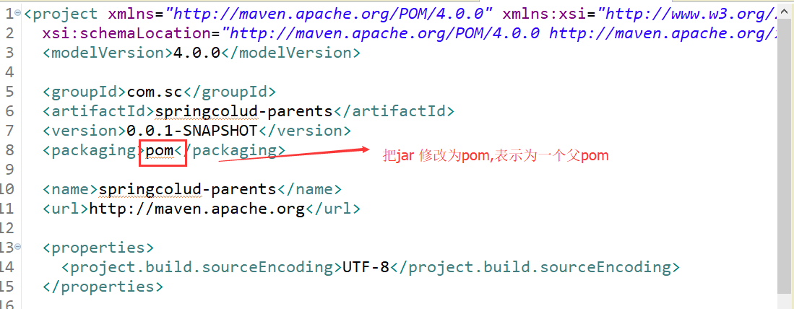

pom.xml:
```xml
 <parent>    
    <groupId>org.springframework.boot</groupId>    
    <artifactId>spring-boot-starter-parent</artifactId>    
    <version>2.0.0.RELEASE</version>    
</parent>    
  
<!-- 管理依赖  -->    
<dependencyManagement>    
    <dependencies>    
        <dependency>    
            <groupId>org.springframework.cloud</groupId>    
            <artifactId>spring-cloud-dependencies</artifactId>    
            <version>Finchley.M8</version>    
            <type>pom</type>    
            <scope>import</scope>    
        </dependency>    
    </dependencies>    
</dependencyManagement>    
  
<!-- 注意： 这里必须要添加， 否者各种依赖有问题  -->    
<repositories>    
    <repository>    
        <id>spring-milestones</id>    
        <name>Spring Milestones</name>    
        <url>https://repo.spring.io/libs-milestone</url>    
        <snapshots>    
            <enabled>false</enabled>    
        </snapshots>    
    </repository>    
</repositories>    
  
<build>    
    <plugins>    
        <plugin>    
            <groupId>org.springframework.boot</groupId>    
            <artifactId>spring-boot-maven-plugin</artifactId>    
        </plugin>    
    </plugins>    
</build>   

```

②：基本的spring-boot 和 spring-cloud 的基础依赖就添加好了。

## 2.搭建注册中心eureka模块：

### 1.介绍：

Eureka包含两个组件：**Eureka Server和Eureka Client。**

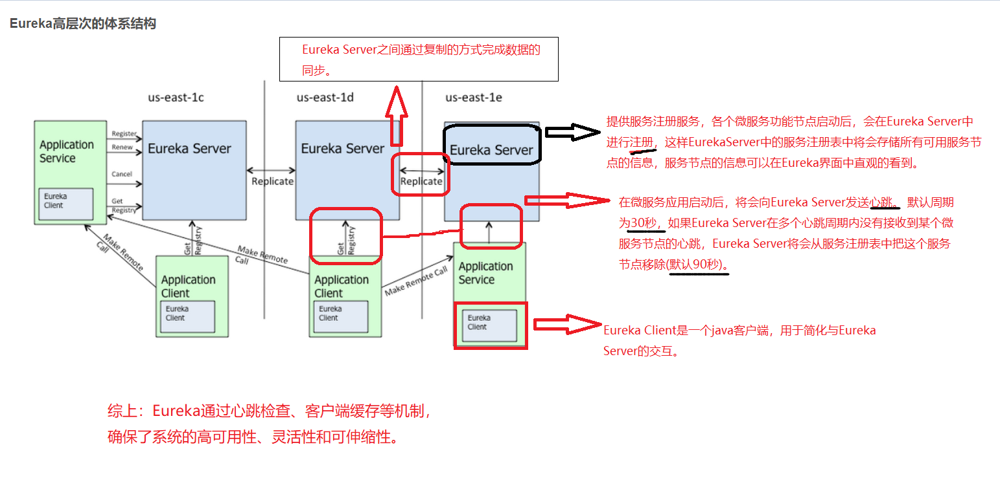

### 2.DEMO:

①：**在上面maven的基础上，新建一个maven module，取名为 springcloud-child-eureka**。

②：在module的pom文件添加依赖：

```xml
<dependency>    
    <groupId>org.springframework.cloud</groupId>    
    <artifactId>spring-cloud-starter-netflix-eureka-server</artifactId>    
</dependency>    
```


> <font color="red"><h3>注意： 引入的是xxx-eureka-server 依赖</h3></font>


③：创建EurekaServerApplication.class 添加如下内容：

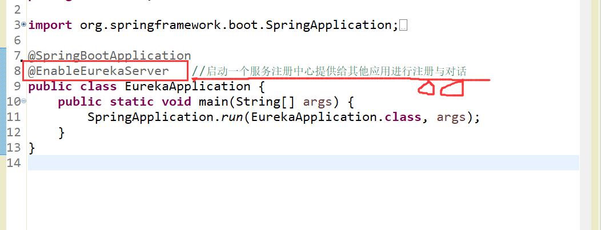

> EurekaServerApplication.class:
```java
@SpringBootApplication  
@EnableEurekaServer  //开启eureka服务中心，启动一个服务注册中心提供给其他应用进行对话
public class EurekaApplication {  
    public static void main(String[] args) {  
        SpringApplication.run(EurekaApplication.class, args);  
    }  
}  

```


④：创建application.yml添加如下内容：

> application.yml :
```
server:  
  port: 8080  
eureka:  
  instance:  
    hostname: localhost  #表示是否将自己注册到Eureka Server，默认为true。
  client:  
    registerWithEureka: false   #表示是否从Eureka Server获取注册信息，默认为true。
    fetcahRegistry: false  
    serviceUrl:  
      defaultZone: http://${eureka.instance.hostname}:${server.port}/eureka/  
      # 设置与Eureka Server交互的地址，查询服务和注册服务都需要依赖这个地址。多个地址可使用 , 分隔。 
```

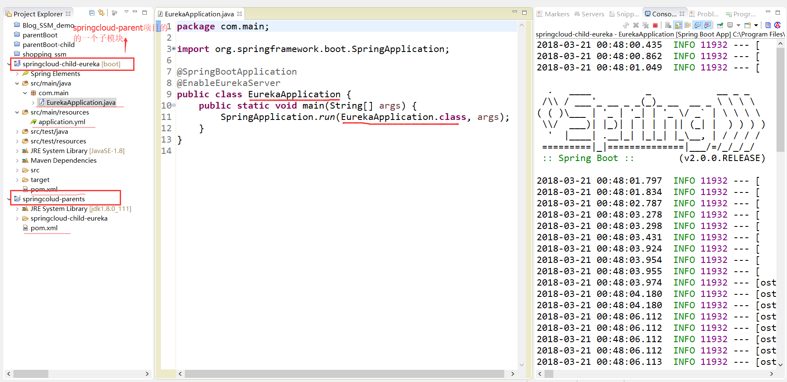
⑤：运行程序，并输入 http://localhost:8080/，将会出现以下画面：
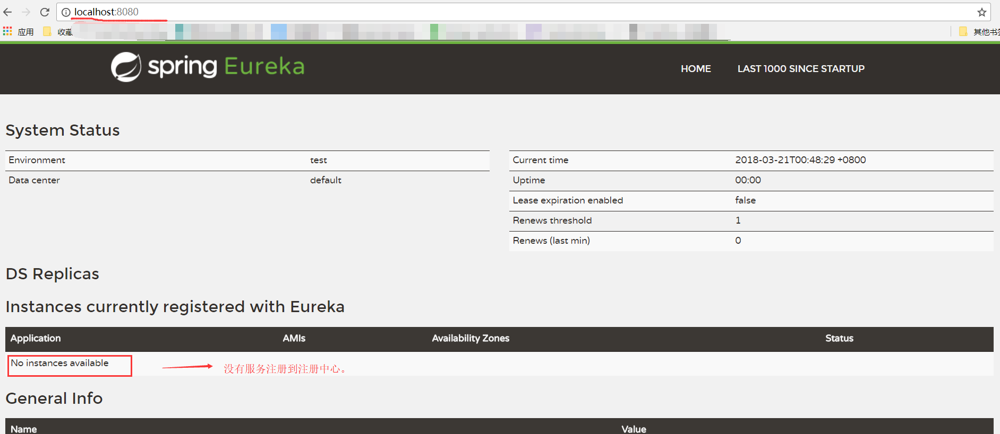


### 3.把Eureka client 来注册服务到Eureka Server上：
---

①：在maven父项目中新建module，取名为eureka-UserClient:

<h2>★★★★★PS:</h2>
<font color="red">
当你在maven项目中创建第二个module模块时，可能会导致父pom文件的改变（例如，maven父项目，两个子module的pom文件都报错，原因是，父pom的maven依赖代码片段消失了，你应该重新添加maven依赖）。此时，你应该修改父pom文件。把它修改之前的模样。

</font>

---

②：在module的pom文件添加依赖：
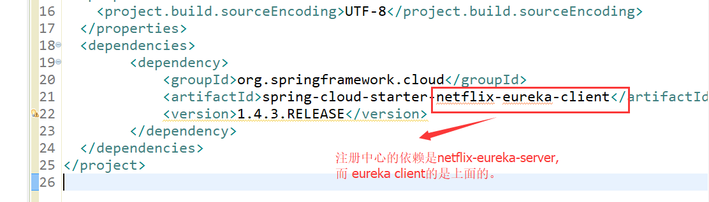

> pom.xml:
```xml
<dependency>
		<groupId>org.springframework.cloud</groupId>
		<artifactId>spring-cloud-starter-netflix-eureka-client</artifactId>
		<version>1.4.3.RELEASE</version>
</dependency>   
```


③：创建UserController类：
```java
@RestController
public class userController {
	
	@RequestMapping(value="/getUser")
	public String getUser() {
		return "i am a user";
	}
}
```


④：创建application.yml:
```
eureka:
  client:
    serviceUrl:
      defaultZone: http://localhost:8080/eureka/             #eureka注册中心的网络地址 
spring:
  application:
    name: cloud-client    #为你的当前项目的微服务起个名字，该名字所代表的项目将注册到eureka注册中心
    
server:
  port: 8762   #当前项目的端口地址，可通过该地址，来访问该项目，执行该项目的功能。
```

⑤：创建MainStart.class 添加如下内容：

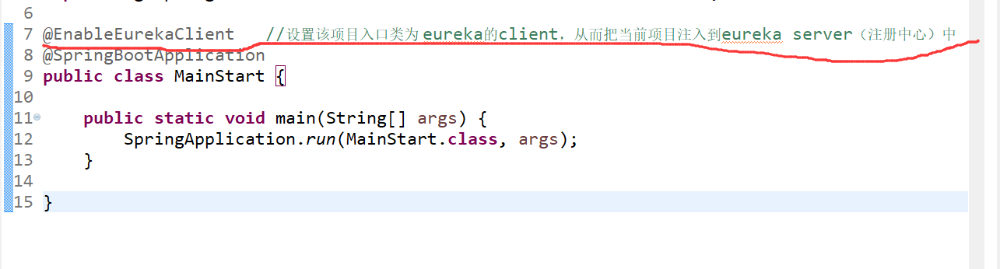

> EurekaServerApplication.class:
```java
@EnableEurekaClient   //设置该项目入口类为 eureka的client，从而把当前项目注入到eureka server（注册中心）中
@SpringBootApplication
public class MainStart {

    public static void main(String[] args) {
        SpringApplication.run(MainStart.class, args);
    }

}

```


⑥：<font color="red"><h3>先运行 eureka-server的程序，在运行eureka-Userclient的程序</h3></font>

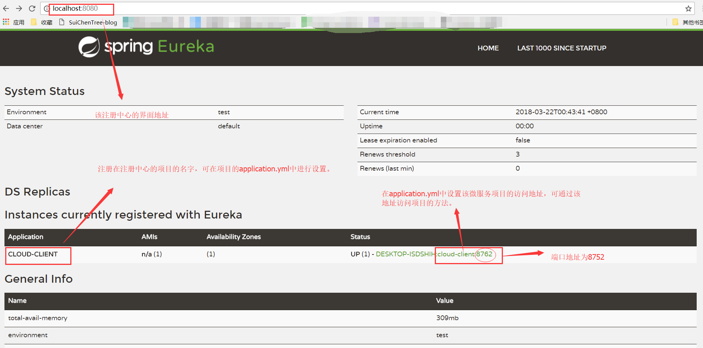
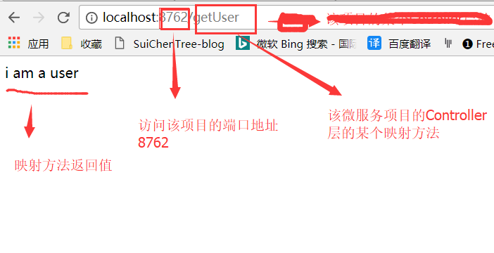


### 4.注册中心的服务之间的调用（使用RestTemplate类）：

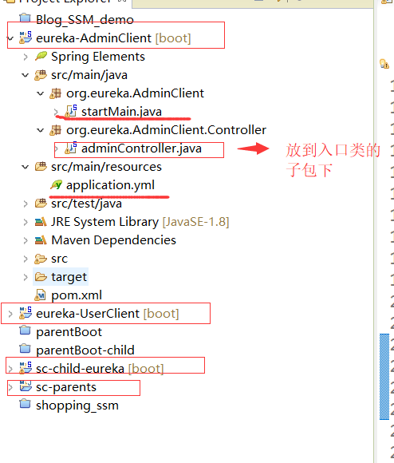


①：之前在上面的demo中建立了eureka-UserClient微服务节点，现在在新建立一个微服务节点eureka-AdminClient去调用它。

②：在module的pom文件添加依赖：
> pom.xml:
```xml
<dependency>
		<groupId>org.springframework.cloud</groupId>
		<artifactId>spring-cloud-starter-netflix-eureka-client</artifactId>
		<version>1.4.3.RELEASE</version>
</dependency>   
```


③：创建application.yml:
```
eureka:
  client:
    serviceUrl:
      defaultZone: http://localhost:8080/eureka/             #eureka注册中心的网络地址 
spring:
  application:
    name: eureka-Adminclient    #为你的当前项目的微服务起个名字，该名字所代表的项目将注册到eureka注册中心
    
server:
  port: 8763   #当前项目的端口地址，可通过该地址，来访问该项目，执行该项目的功能。
```


④：编写控制器类
```java
package org.eureka.AdminClient.Controller;

@RestController
public class adminController {
    
	@Bean
	public RestTemplate restTemplate() {
	    return new RestTemplate();
	}
	
	@Autowired
    RestTemplate restTemplate;

    @RequestMapping("/adminClient_getUser")
    public String excuteUserClient_getUser() {
    	return restTemplate.getForObject("http://localhost:8762/getUser", String.class);
    }
    
}
```

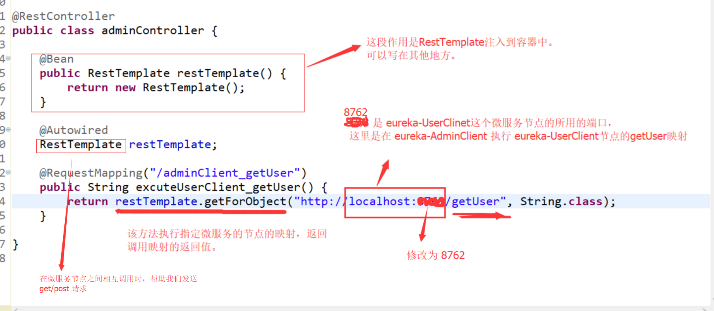


⑤：创建入口类：

> startMain.class:
```java
package org.eureka.AdminClient;

@SpringBootApplication
@EnableEurekaClient   //开启服务注册
public class startMain {
	
	public static void main(String[] args) {
		SpringApplication.run(startMain.class, args);
	}

}

```

⑥：<font color="red"><h3>先运行 eureka-server的程序，下面运行eureka-Userclient或eureka-AdminClient</h3></font>

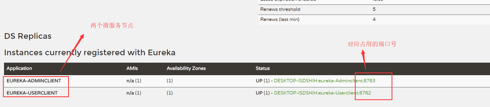
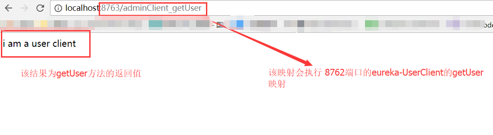


---

## 3.Spring Cloud Ribbon 实现服务调用与客户端负载均衡:


<h2><font color="red">什么是负载均衡？:</font></h2>

分布式就是利用大量计算机节点完成单个计算机无法完成的计算、存储服务，既然有大量计算机节点，那么均衡的调度就非常重要。

负载均衡的意义在于，让所有节点以最小的代价、最好的状态对外提供服务，这样系统吞吐量最大，性能更高，对于用户而言请求的时间也更小。而且，负载均衡增强了系统的可靠性，最大化降低了单个节点过载、甚至crash的概率。不难想象，如果一个系统绝大部分请求都落在同一个节点上，那么这些请求响应时间都很慢，而且万一节点降级或者崩溃，那么所有请求又会转移到下一个节点，造成雪崩。


---

**Spring Cloud Ribbon是基于Netflix Ribbon实现的一套客户端负载均衡的工具**。它是一个基于HTTP和TCP的客户端负载均衡器。它可以通过在客户端中配置ribbonServerList来设置服务端列表去轮询访问以达到均衡负载的作用。

 > 当Ribbon与Eureka联合使用时，ribbonServerList会被DiscoveryEnabledNIWSServerList重写，扩展成从Eureka注册中心中获取服务实例列表。


### 1.根据上面的2-4的demo实现服务调用：

①：根据上面的例子，在服务消费者（eureka-AdminClient）的pom文件中添加 ribbon依赖：

```xml
<dependency>
	    <groupId>org.springframework.cloud</groupId>
	    <artifactId>spring-cloud-starter-ribbon</artifactId>
	    <version>1.4.3.RELEASE</version>
</dependency>
```


②：在RestTemplate类上增加@LoadBalanced注解并修改Controller代码：
```java
package org.eureka.AdminClient.Controller;

@RestController
public class adminController {
    
	@Bean
	@LoadBalanced
	public RestTemplate restTemplate() {
	    return new RestTemplate();
	}
	
	@Autowired
    RestTemplate restTemplate;

    @RequestMapping("/adminClient_getUser")
    public String excuteUserClient_getUser() {
    	return restTemplate.getForObject("http://eureka-Userclient/getUser", String.class);
    }
    
    @RequestMapping("/aa")
    public String aa() {
    	return "aa";
    }
    
}

```


③：ok,修改完毕，运行程序,与2-4效果一摸一样。


---

## 4.Spring Cloud Feign 对eureka-client服务的定义和调用：

Spring Cloud Feign是一套基于Netflix Feign实现的声明式服务调用客户端。它使得编写Web服务客户端变得更加简单。我们只需要通过创建接口并用注解来配置它既可完成对Web服务接口的绑定。它具备可插拔的注解支持，包括Feign注解、JAX-RS注解。它也支持可插拔的编码器和解码器。Spring Cloud Feign还扩展了对Spring MVC注解的支持，**同时还整合了Ribbon和Eureka来提供均衡负载的HTTP客户端实现。**


①：根据上面的2-4的demo，在服务消费者（eureka-AdminClient）的pom文件中添加Feign依赖：
```xml
<dependency>
	    <groupId>org.springframework.cloud</groupId>
	    <artifactId>spring-cloud-starter-feign</artifactId>
	    <version>1.4.3.RELEASE</version>
</dependency>
```


②：修改主类（运行类），添加@EnableFeignClients注解：
```java
@EnableFeignClients         //添加Feign注解
@SpringBootApplication
@EnableEurekaClient         //开启服务注册
public class startMain {
	
	public static void main(String[] args) {
		SpringApplication.run(startMain.class, args);
	}

}
```

③：在服务消费者工程中创建一个Feign的客户端接口.
> FeClient.java
```java
package org.eureka.AdminClient.Controller;

@FeignClient("eureka-UserClient")       //该注解指明被调用的服务名称
public interface FeClient {

    @GetMapping(value="/sayhello")          //该注解指明被调用的服务的那个映射名称
    String get_UserClient_sayhello();

}
```

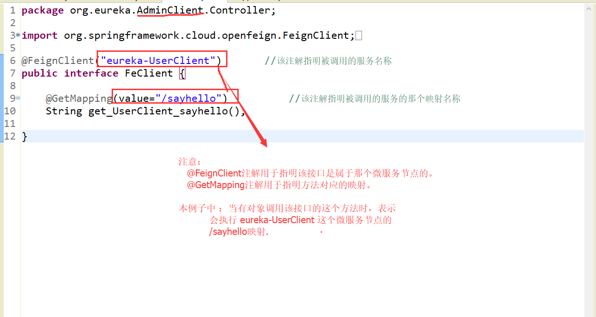


④：修改Controller
```java
package org.eureka.AdminClient.Controller;

@RestController
public class adminController {
	
	@Autowired
	FeClient fec;         //获取该接口的实例化对象
   
    @RequestMapping("/Fegin_getUser")
    public String Fegin_getUser() {
    	return fec.get_UserClient_sayhello();     
    	// 调用该接口的某个方法，相当与调用某个微服务节点的某个映射
    }
 
}

```


⑤：运行程序。
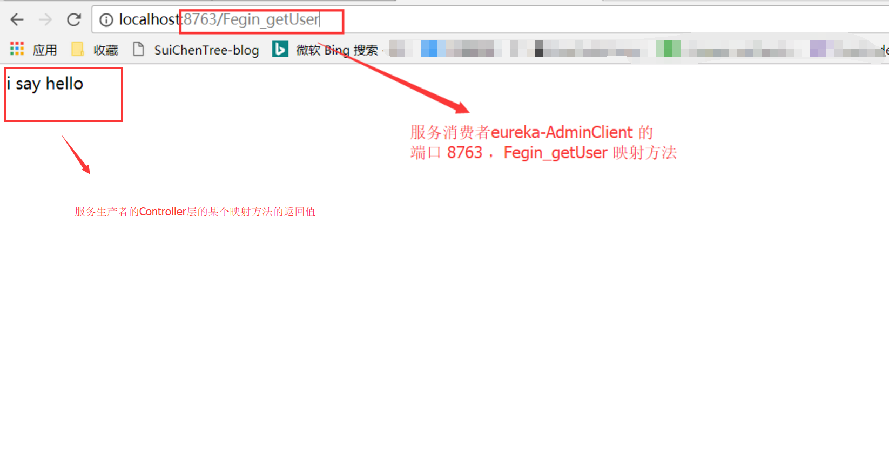
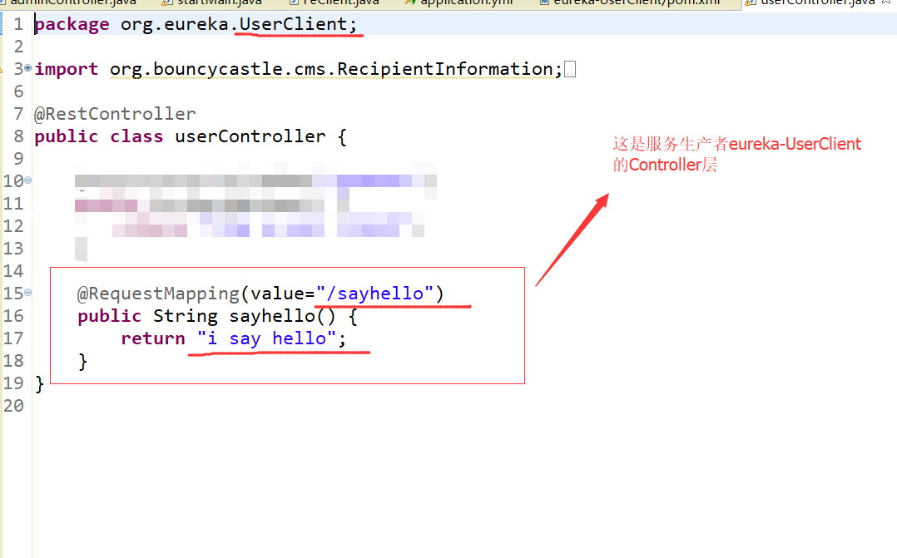


**通过@FeignClient修饰的接口来统一需要进行调用的的微服务接口。而在具体使用的时候就跟调用本地方法一点的进行调用即可。由于Feign是基于Ribbon实现的，所以它自带了客户端负载均衡功能。**


---


## 5.Spring Cloud Zuul 服务网关：

Spring Cloud Zuul路由是微服务架构的不可或缺的一部分，提供动态路由，监控，弹性，安全等的边缘服务。Zuul是Netflix出品的一个基于JVM路由和服务端的负载均衡器。

<h2>服务网关:</h2>

> **在微服务架构中，后端服务往往不直接开放给调用端，而是通过一个API网关根据请求的url，路由到相应的服务**。当添加API网关后，在第三方调用端和服务提供方之间就创建了一面墙，这面墙直接与调用方通信进行权限控制，后将请求均衡分发给后台服务端。

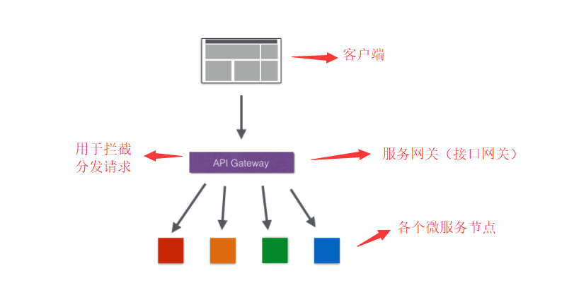


### 1.简单使用：

①：创建子项目模块（Maven Module）添加依赖：
```xml
<dependency>
		<groupId>org.springframework.cloud</groupId>
		<artifactId>spring-cloud-starter-netflix-eureka-client</artifactId>
		<version>1.4.3.RELEASE</version>
    </dependency> 
    <!-- 这个依赖是把zuul，注册到注册中心区 -->
    
	<dependency>
		    <groupId>org.springframework.cloud</groupId>
		    <artifactId>spring-cloud-starter-zuul</artifactId>
		    <version>1.4.3.RELEASE</version>
	</dependency>
```


②：添加配置文件：
```
eureka:
  client:
    serviceUrl:
      defaultZone: http://localhost:8080/eureka/          
spring:
  application:
    name: sc-zuul    
    
server:
  port: 8769   
  

zuul:
  routes:
    api-userClient:    # api-userClient只是给路由一个名称，可以随便命名
     path: /userClient/**      # path:表示拦截/userClient/下的所有请求. 
     serviceId: eureka-Userclient   
     # serviceId:表示服务的id名称（每个注册中心的服务节点都由一个serviceId,在不同的yml文件中写有）
     
     # 这里表示api-userClient 路由，当碰到/userClient/这个路径时，不管后面接上什么路径，
     # 都会调转 访问到 eureka-Userclient 这个服务节点的路径 
     # 直接说：访问/userClient/** 路径时，直接重定向到http://eureka-Userclient/**
     
  routes:
    api-adminClient:    
     path: /adminClient/**      
     serviceId: eureka-Adminclient   

```


③：启动类：
```java
package org.sc.zuul;

@SpringBootApplication
@EnableZuulProxy       //开启zuul功能
@EnableEurekaClient    //注册到注册中心
public class startMain {
	
	public static void main(String[] args) {
		SpringApplication.run(startMain.class, args);
	}

}
```

④：运行程序：
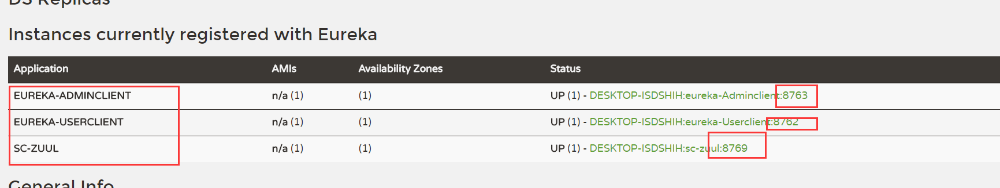

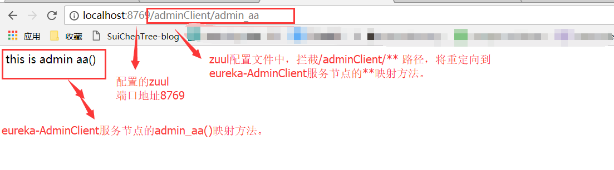


### 2.zuul的过滤器功能：

> 为了实现对客户端请求的安全校验和权限控制，最简单和粗暴的方法就是为每个微服务应用都实现一套用于校验签名和鉴别权限的过滤器或拦截器。

>最好的方法是，**在网关中完成校验和过滤，微服务应用端就可以去除各种复杂的过滤器和拦截器了**，这使得微服务应用的接口开发和测试复杂度也得到了相应的降低。

> 为了在API网关中实现对客户端请求的校验，我们将需要使用到Spring Cloud Zuul的另外一个核心功能：**过滤器**。


> Zuul允许开发者在API网关上通过定义过滤器来实现对请求的拦截与过滤，实现的方法非常简单，我们只**需要继承ZuulFilter抽象类并实现它定义的四个抽象函数就可以完成对请求的拦截和过滤了**。


<font color="red">Filter是Zuul的核心，用来实现对外服务的控制。Filter的生命周期有4个，分别是“PRE”、“ROUTING”、“POST”、“ERROR”</font>
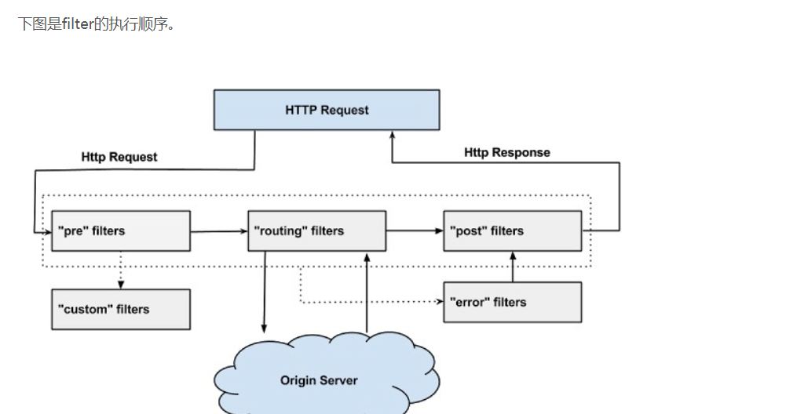

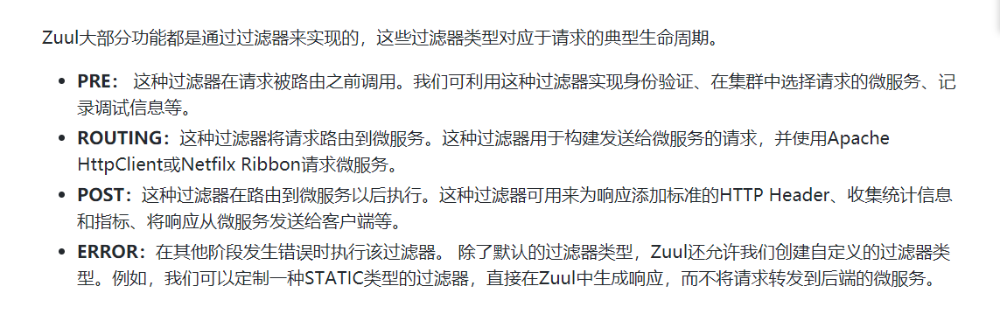


<h2>PS:</h2>
禁用指定的Filter

可以在application.yml中配置需要禁用的filter，格式：
```
zuul:
	FormBodyWrapperFilter:   # 过滤器名字
		pre:                 # 过滤器类型 pre 为前置过滤器。
			disable: true
```


<h2>DEMO(pre，前置过滤器的例子):</h2>

> 定义了一个简单的Zuul过滤器，它实现了**在请求被路由之前**检查HttpServletRequest中是否有accessToken参数，若有就进行路由，若没有就拒绝访问，返回401 Unauthorized错误。

①：编写过滤器类：
```java
package org.sc.zuul;

import javax.servlet.http.HttpServletRequest;

import com.netflix.zuul.ZuulFilter;
import com.netflix.zuul.context.RequestContext;
import com.netflix.zuul.exception.ZuulException;

public class AccessFilter extends ZuulFilter {

	@Override
    public String filterType() {
        return "pre";   //设置filter的类型，有pre、route、post、error四种，pre表示前置过滤器，会在请求被路由之前执行。
    }

    @Override
    public int filterOrder() {
        return 0;      //定义filter的优先级，数字越小表示优先级越高，越先执行。
                       //当请求在一个阶段中存在多个过滤器时，需要根据该方法返回的值来依次执行
    }

    @Override
    public boolean shouldFilter() {
        return true;    //表示是否需要执行该filter，true表示执行，false表示不执行
    }

    @Override
    public Object run() {
        RequestContext ctx = RequestContext.getCurrentContext();  //获取当前上下文内容
        HttpServletRequest request = ctx.getRequest();            //获取上下文的请求内容

        Object accessToken = request.getParameter("token");  //获取请求的token
        if(accessToken == null) {
        	System.out.println("access token is empty");
            ctx.setSendZuulResponse(false);                  //令zuul过滤该请求，不对其进行路由
            ctx.setResponseStatusCode(401);                  //设置了其返回的错误码
                 //也可以通过ctx.setResponseBody(body)对返回body内容进行编辑。
            
            return null;
        }
        System.out.println("access token is ok"+accessToken);
        return null;
    }

}

```


②：把过滤器类注入到容器中(可以写在启动类上)：
```java
	@Bean  
    public AccessFilter accessFilter() {   //把过滤器类注入到容器中
        return new AccessFilter(); 
    }
	
```


③：运行程序：
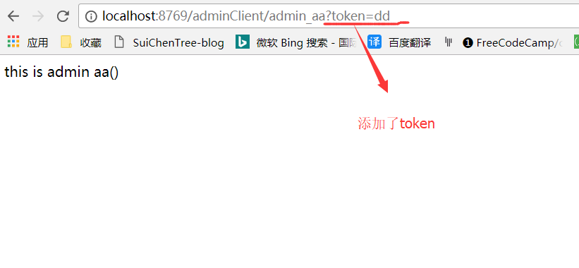
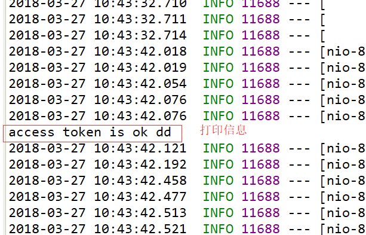


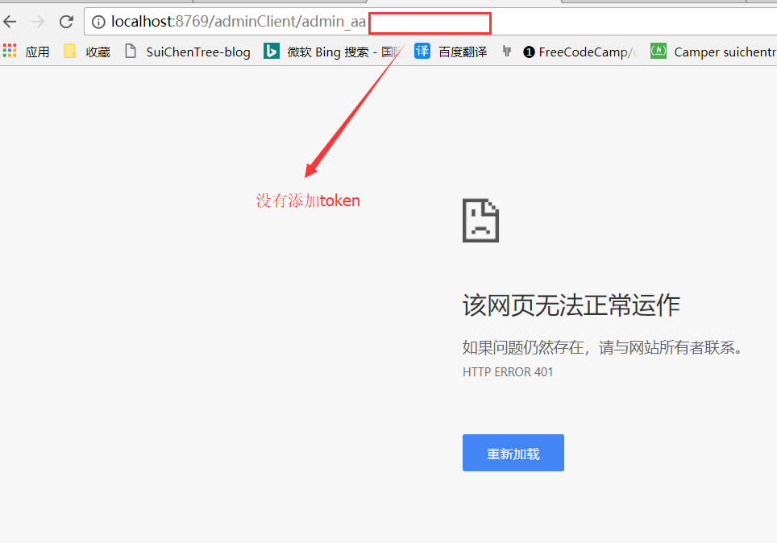
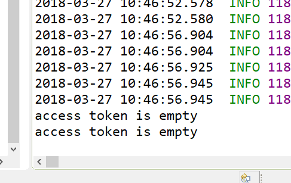


<br/>

**ps:此外可以根据自己的需要在服务网关上定义一些与业务无关的通用逻辑实现对请求的过滤和拦截，比如：签名校验、权限校验、请求限流等功能。**


### 3.其他过滤器样例（与上面的demo相同）：

> 第二个前置过滤器 SecondFilter：
```java
public class SecondFilter extends ZuulFilter {  
  
    @Override  
    public String filterType() {  
        //前置过滤器  
        return "pre";  
    }  
  
    @Override  
    public int filterOrder() {  
        //优先级，数字越大，优先级越低  
        return 1;  
    }  
  
    @Override  
    public boolean shouldFilter() {  
        //是否执行该过滤器，true代表需要过滤  
        return true;  
    }  
  
    @Override  
    public Object run() {  
        RequestContext ctx = RequestContext.getCurrentContext();  
        HttpServletRequest request = ctx.getRequest();  

        System.out.println("second过滤器");
        return null;  
  
    }  
  
}  
```


> 后置过滤器 PostFilter:
```java
public class PostFilter extends ZuulFilter {  
  
    @Override  
    public String filterType() {  
        return "post";  
    }  
  
    @Override  
    public int filterOrder() {  
        return 0;  
    }  
  
    @Override  
    public boolean shouldFilter() {  
        return true;  
    }  
  
    @Override  
    public Object run() {  
        RequestContext ctx = RequestContext.getCurrentContext();  
        System.out.println("进行 后置过滤器 PostFilter----");
        System.out.println(ctx.getResponseBody());  
  
        ctx.setResponseBody("post后置数据 ------");  
        return null;  
  
    }  
  
}  
```


> 异常(错误)过滤器
```java
public class ErrorFilter extends ZuulFilter {  

    @Override  
    public String filterType() {  
        return "error";  
    }  
  
    @Override  
    public int filterOrder() {  
        return 0;  
    }  
  
    @Override  
    public boolean shouldFilter() {  
        return true;  
    }  
  
    @Override  
    public Object run() {  
        RequestContext ctx = RequestContext.getCurrentContext();  
  
        System.out.println("进行 异常过滤器 ErrorFilter----"); 
        System.out.println(ctx.getResponseBody());  
  
        int i = 1 / 0; 
        ctx.setResponseBody("出现异常");  
        return null;  
    }  
  
}  
```


## 6. Spring Cloud Hystrix

推荐链接：[纯洁的微笑-Spring Cloud Hystrix](http://www.ityouknow.com/springcloud/2017/05/16/springcloud-hystrix.html)


**在微服务架构中通常会有多个服务层互相调用，基础服务的故障可能会导致其他服务的故障，进而造成整个系统不可用的情况，这种现象被称为服务雪崩效应。**


<h2>雪崩效应:</h2>

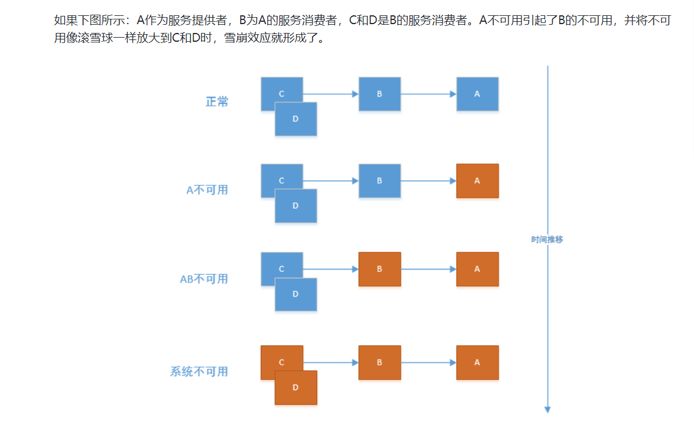


<h2>Hystrix特性</h2>

> 1.断路器机制
 Hystrix的断路器就像我们家庭电路中的保险丝, 一旦后端服务(**服务生产者**)不可用, 断路器会直接切断请求链, 避免发送大量无效请求影响系统吞吐量, 并且断路器有自我检测并恢复的能力.

> 2.Fallback
Fallback相当于是降级操作. 对于查询操作, 我们可以实现一个fallback方法, 当请求后端服务出现异常的时候, 可以使用fallback方法返回的值. fallback方法的返回值一般是设置的默认值或者来自缓存.


### 1.在Feign中使用Hystrix断路器机制(对4中的fegin使用的eureka-AdminClient项目为基础)：

<font color="red">Feign是自带Hystrix断路器的。</font>

①：在application.yml 中添加以下：
```
feign:
   hystrix:
     enabled: true     #Feign中已经依赖了Hystrix,只需要开启断路器
```


②：编写当服务生产者不可用时的回调方法：
```java
package org.eureka.AdminClient.Controller;

@Component
public class adminHystrix implements FeClient {

	@Override
	public String get_UserClient_sayhello() {
		return "this is method shibai ";
	}

}

```

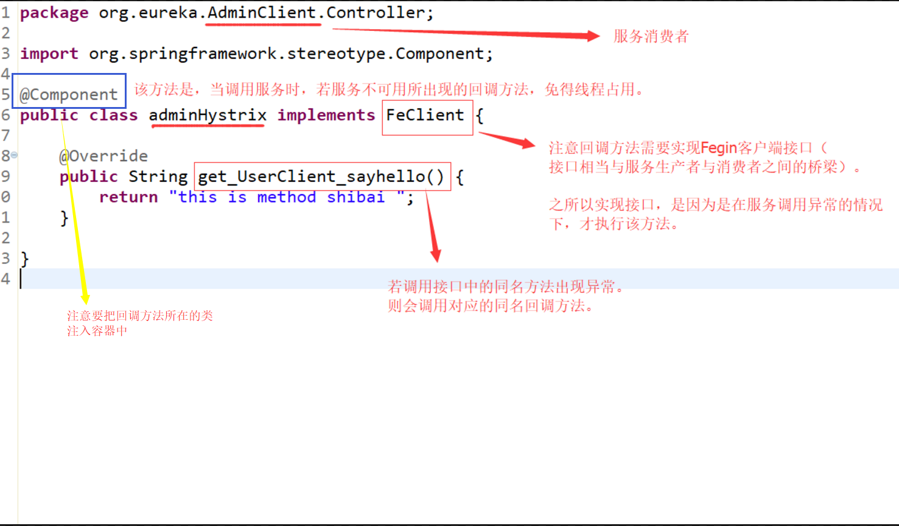


③：在Fegin服务调用接口中添加fallback属性：
```java
package org.eureka.AdminClient.Controller;

@FeignClient(name="eureka-UserClient",fallback = adminHystrix.class)  
public interface FeClient {
    @GetMapping(value="/sayhello")          //该注解指明被调用的服务的那个映射名称
    String get_UserClient_sayhello();
}

```

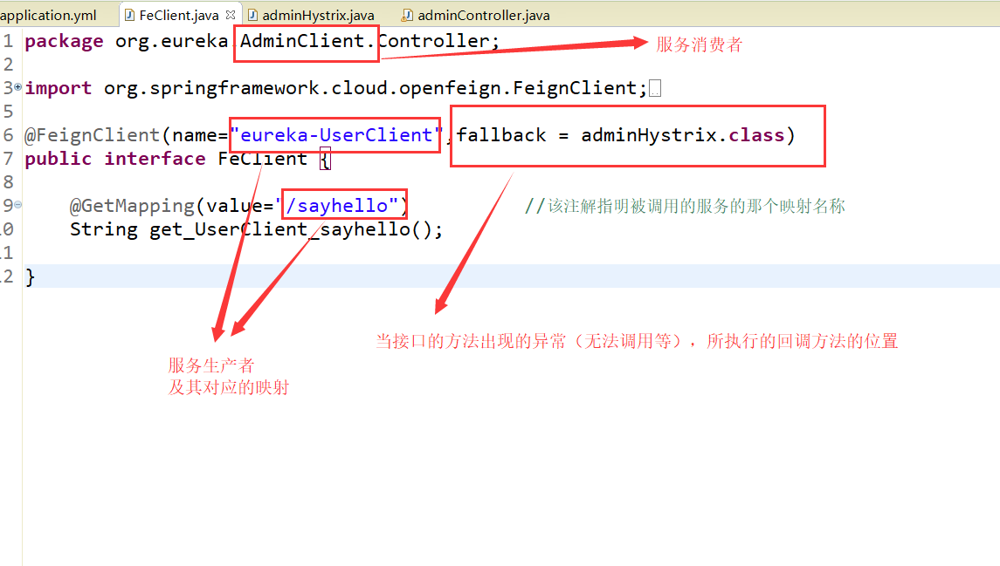

④：运行程序，测试：

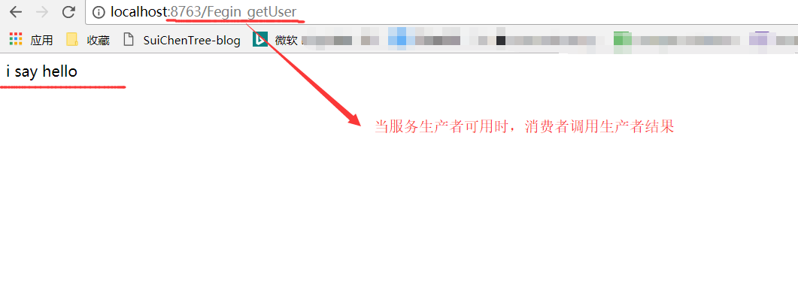
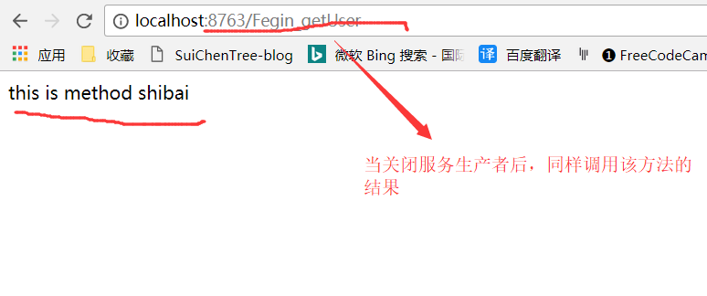

### 2. Hystrix Dashboard(Hystrix 仪表盘)：

待续；