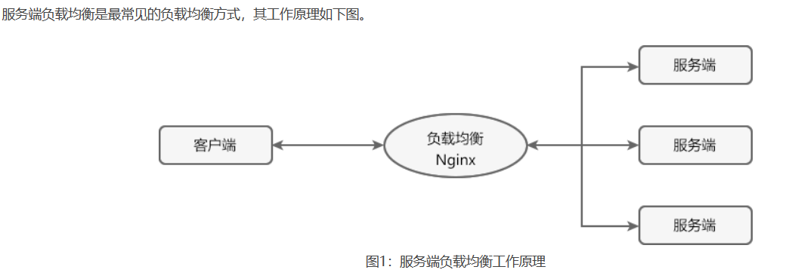

[toc]

# SpringCloud笔记1

## 微服务是什么

微服务即微小的服务。每一个服务体积小，复杂度低。一个微服务通常只提供单个业务功能的服务。

> 微服务的特点

* 每个服务通常只专注于某一个特定的业务、所需代码量小，复杂度低、易于维护。
* 每个微服都可以独立开发、部署和运行，且代码量较少，因此启动和运行速度较快。
* 采用单体架构的应用程序只要有任何修改，就需要重新部署整个应用才能生效，而微服务则完美地解决了这一问题。在微服架构中，某个微服务修改后，只需要重新部署这个服务即可，而不需要重新部署整个应用程序。
* 在微服务架构中，不同的微服务可以使用不同的语言和工具。
* 微服务具备良好的可扩展性。
* 微服务能够与容器（Docker）配合使用，实现快速迭代、快速构建、快速部署。
* 微服务具有良好的故障隔离能力，当应用程序中的某个微服发生故障时，该故障会被隔离在当前服务中，而不会波及到其他微服务造成整个系统的瘫痪。
* 微服务系统具有链路追踪的能力。

> 什么是微服务架构

微服务架构是由微服务与微服务之间组成的架构。

与传统的单体式架构（ALL IN ONE）不同，微服务架构提倡将一个单一的应用程序拆分成多个小型服务，这些小型服务都在各自独立的进程中运行，服务之间使用轻量级通信机制（通常是 HTTP RESTFUL API）进行通讯。

> 微服务架构与单体架构的区别

在项目的初期，单体架构无论是在开发速度还是运维难度上都具有明显的优势。但随着业务复杂度的不断提高，单体架构的许多弊端也逐渐凸显出来，主要体现在以下 3 个方面：
* 随着业务复杂度的提高，单体应用的代码量也越来越大，导致代码的可读性、可维护性以及扩展性下降。
* 随着用户越来越多，程序所承受的并发越来越高，而单体应用处理高并发的能力有限。
* 单体应用将所有的业务都集中在同一个工程中，修改或增加业务都可能会对其他业务造成一定的影响，导致测试难度增加。

由于单体架构存在这些弊端，因此许多公司和组织都开始将将它们的项目从单体架构向微服务架构转型。

如下图所示，两者的区别。

> 微服务框架有哪些

随着微服务的流行，很多编程语言都相继推出了它们的微服务框架，下面我们就来简单列举下。

Java 微服务框架
* Spring Cloud：它能够基于 REST 服务来构建服务，帮助架构师构建出一套完整的微服务技术生态链。
* Dropwizard：用于开发高性能和 Restful 的 Web 服务，对配置、应用程序指标、日志记录和操作工具都提供了开箱即用的支持。
* Restlet： 该框架遵循 RST 架构风格，可以帮助 Java 开发人员构建微服务。
* Spark：最好的 Java 微服务框架之一，该框架支持通过 Java 8 和 Kotlin 创建微服务架构的应用程序。
* Dubbo：由阿里巴巴开源的分布式服务治理框架。

Go 语言微服务框架
* Go 语言中的微服务框架较少，使用的较多的是 GoMicro，它是一个 RPC 框架，具有负载均衡、服务发现、同步通信、异步通讯和消息编码等功能。

Phyton 微服务框架
* Phyton 中的微服务框架主要有 Flask、Falcon、Bottle、Nameko 和 CherryPy 等。 

NodeJS微服务框架
* Molecular 是一种使用 NodeJS 构建的事件驱动架构，该框架内置了服务注册表、动态服务发现、负载均衡、容错功能和内置缓存等组件。 

## SpringCloud介绍

> 什么是SpringCloud

Spring Cloud 并不是某一门技术，而是一系列微服务框架的有序集合。它将市面上成熟的、经过验证的微服务框架整合起来，把每个微服务框架通过 Spring Boot 的思想进行再封装，屏蔽调其中复杂的配置和实现原理，最终为开发人员提供了一套简单易懂、易部署和易维护的分布式微服务系统的“全家桶”。

> Springcloud 与Springboot的分工

Spring Boot 是一个基于 Spring 的快速开发框架，它能够帮助开发者快速、方便地开发单个微服务。

Spring Cloud 专注于全局微服务的协调和治理工作。简而言之，Spring Cloud 相当于微服务的大管家，负责将 Spring Boot 开发的一个个微服务管理起来，并为它们提供配置管理、服务发现、断路器、路由、微代理、事件总线、决策竞选以及分布式会话等服务。

> Springcloud 与Spring Boot的联系

* Spring Boot 不需要 Spring Cloud，就能开发单个微服务。但是它并不具备管理和协调微服务的能力。
* Spring Cloud 是基于 Spring Boot 实现的，它不能独立创建工程或模块，更不能脱离 Spring Boot 独立运行。

Spring Cloud 本身并不是一个拿来即可用的技术框架，它同时也是一套微服务规范，目前共有两套实现方案。
* Spring Cloud Netflix 是 Spring Cloud 的第一套实现方案，主要由 Eureka、Ribbon、Feign、Hystrix 等组件组成。
* Spring Cloud Alibaba 是 Spring Cloud 的第二套实现方案，主要由 Nacos、Sentinel、Seata 等组件组成。

## Spring Cloud Netflix

Spring Cloud Netflix 主要是由 Netflix 公司开发并发布的。

Spring Cloud Netflix 是 Spring Cloud 的第一套实现方案，主要由 Eureka、Ribbon、Feign、Hystrix 等组件组成。

这些组件提供了服务治理、服务网关、智能路由、负载均衡、熔断器、监控跟踪、分布式消息队列、配置管理等领域的解决方案。

各个组件的描述，如图所示。

下面是对各个组件的简单介绍。

### Eureka 服务注册和发现组件

Eureka 是 Netflix 公司开发的一款开源的服务注册与发现组件。

Spring Cloud 通过Spring Boot框架 对 Eureka 进行二次封装。变成了Spring Cloud Eureka。

> Eureka的客户端和服务端

* Eureka Server：Eureka 注册中心服务端，主要用于提供服务注册功能。当某个微服务启动时，会将自己的服务注册到 Eureka Server。Eureka Server 维护了一个可用服务列表，存储了所有注册到 Eureka Server 的可用服务的信息，这些可用服务可以在 Eureka Server 的管理界面中直观看到。
* Eureka Client：Eureka 客户端，通常指的是微服务架构中各个微服务，主要用于和 Eureka Server 进行交互。在微服务应用启动后，Eureka Client 会向 Eureka Server 发送心跳（默认周期为 30 秒）。若 Eureka Server 在多个心跳周期内没有接收到某个 Eureka Client 的心跳，Eureka Server 将它从可用服务列表中移除（默认 90 秒）。 

服务注册中心十分重要，它是服务提供者和服务消费者之间的桥梁。服务提供者只有将自己的服务注册到服务注册中心才可能被服务消费者调用，而服务消费者也只有通过服务注册中心获取可用服务列表后，才能调用所需的服务。

> Eureka 服务注册与发现原理

* 服务注册中心（Register Service）：它是一个 Eureka Server，用于提供服务注册和发现功能。
* 服务提供者（Provider Service）：它是一个 Eureka Client，用于提供服务。它将自己提供的服务注册到服务注册中心，以供服务消费者发现。
* 服务消费者（Consumer Service）：它是一个 Eureka Client，用于消费服务。它可以从服务注册中心获取服务列表，调用所需的服务。

> Eureka 实现服务注册与发现的流程

1. 搭建一个 Eureka Server 作为服务注册中心；
2. 服务提供者 Eureka Client 启动时，会把当前服务器的信息以服务名（spring.application.name）的方式注册到服务注册中心；
3. 服务消费者 Eureka Client 启动时，也会向服务注册中心注册；
4. 服务消费者还会获取一份可用服务列表，该列表中包含了所有注册到服务注册中心的服务信息（包括服务提供者和自身的信息）；
5. 在获得了可用服务列表后，服务消费者通过 HTTP 或消息中间件远程调用服务提供者提供的服务。

### Ribbon 负载均衡与服务调用组件

Ribbon 是 Netflix 公司发布的开源组件，其主要功能是提供客户端的负载均衡算法和服务调用。

Spring Cloud 通过Spring Boot框架 对 Ribbon 进行二次封装。变成了Spring Cloud Ribbon。

Ribbon 是 Spring Cloud 体系中最核心、最重要的组件之一。它并不像 Eureka 那样需要独立部署，但它几乎存在于每一个微服务中。微服务之间的调用，API 网关的请求转发等内容，实际上都是通过 Spring Cloud Ribbon 来实现的。

Ribbon 本质上就是一个基于 HTTP 和 TCP 的客户端负载均衡器，将 Ribbon 和 Eureka 一起使用时，Ribbon 会从 Eureka Server（服务注册中心）中获取服务端列表，然后通过负载均衡策略将请求分摊给多个服务提供者，从而达到负载均衡的目的。

#### 负载均衡

负载均衡（Load Balance） ，简单点说就是将用户的请求平摊分配到多个服务器上运行，以达到扩展服务器带宽、增强数据处理能力、增加吞吐量、提高网络的可用性和灵活性的目的。

常见的负载均衡方式有两种：服务端负载均衡，客户端负载均衡。

> 服务端负载均衡

服务端负载均衡是在客户端和服务端之间建立一个独立的负载均衡服务器，该服务器既可以是硬件设备（例如 F5），也可以是软件（例如 Nginx）。这个负载均衡服务器维护了一份可用服务端清单，然后通过心跳机制来删除故障的服务端节点，以保证清单中的所有服务节点都是可以正常访问的。

当客户端发送请求时，该请求不会直接发送到服务端进行处理，而是全部交给负载均衡服务器，由负载均衡服务器按照某种算法（例如轮询、随机等），从其维护的可用服务清单中选择一个服务端，然后进行转发。

> 服务端负载均衡的特点

* 需要建立一个独立的负载均衡服务器。
* 负载均衡是在客户端发送请求后进行的，因此客户端并不知道到底是哪个服务端提供的服务。
* 可用服务端清单存储在负载均衡服务器上。

> 服务端负载均衡

客户端负载均衡是将负载均衡逻辑以代码的形式封装到客户端上，即负载均衡器位于客户端中。客户端通过服务注册中心（例如 Eureka Server）获取到一份服务端提供的可用服务清单。有了可以服务清单后，负载均衡器会在客户端发送请求前通过负载均衡算法选择一个服务端实例再进行访问，以达到负载均衡的目的。

客户端负载均衡也需要心跳机制去维护服务端清单的有效性，这个过程需要配合服务注册中心一起完成。

> 客户端负载均衡具有以下特点

* 负载均衡器位于客户端，不需要单独搭建一个负载均衡服务器。
* 负载均衡是在客户端发送请求前进行的，因此客户端清楚地知道是哪个服务端提供的服务。
* 每个客户端都维护了一份可用服务清单，而这份清单都是从服务注册中心获取的。

### OpenFeign 负载均衡与服务调用组件

Feign是 Netflix 公司发布的一种实现负载均衡和服务调用的开源组件。Feign 本质上是对 Ribbon 进行了集成，利用 Ribbon 维护了一份可用服务清单，并通过 Ribbon 实现了客户端的负载均衡。

OpenFeign 全称 Spring Cloud OpenFeign，它是 Spring 官方推出的一种声明式服务调用与负载均衡组件，它的出现就是为了替代进入停更维护状态的 Feign。

OpenFeign 本质上是 Spring Cloud 对 Feign 的二次封装。

> OpenFeign 与 Feign的区别

相同点：
* Feign 和 OpenFeign 作用一样，都可以实现服务的远程调用和负载均衡。
* Feign 和 OpenFeign 都对 Ribbon 进行了集成，都利用 Ribbon 维护了可用服务清单，并通过 Ribbon 实现了客户端的负载均衡。
* Feign 和 OpenFeign 都是在服务消费者（客户端）定义服务绑定接口并通过注解的方式进行配置，以实现远程服务的调用。

不同点
* Feign 和 OpenFeign 的依赖项不同，Feign 的依赖为 spring-cloud-starter-feign，而 OpenFeign 的依赖为 spring-cloud-starter-openfeign。
* Feign 和 OpenFeign 支持的注解不同，Feign 支持 Feign 注解和 JAX-RS 注解，但不支持 Spring MVC 注解；OpenFeign 除了支持 Feign 注解和 JAX-RS 注解外，还支持 Spring MVC 注解。

### Hystrix 服务熔断与降级组件

Spring Cloud Hystrix 是基于 Netflix 公司的开源组件 Hystrix 二次封装实现的，它提供了熔断器功能，能够有效地阻止分布式微服务系统中出现联动故障，以提高微服务系统的弹性。Spring Cloud Hystrix 具有服务降级、服务熔断、线程隔离、请求缓存、请求合并以及实时故障监控等强大功能。

> 什么是服务雪崩？

在微服务架构中，一个应用往往由多个服务组成，这些服务之间相互依赖，依赖关系错综复杂。并且通常情况下，一个请求往往需要多个服务配合才能完成。

如图所示

当服务 E 发生故障或网络延迟时，会出现以下情况：
1. 即使其他所有服务都可用，由于服务 E 的不可用，那么用户请求 1、2、3 都会处于阻塞状态，等待服务 E 的响应。在高并发的场景下，会导致整个服务器的线程资源在短时间内迅速消耗殆尽。
2. 所有依赖于服务 E 的其他服务，例如服务 B、D 以及 F 也都会处于线程阻塞状态，等待服务 E 的响应，导致这些服务的不可用。
3. 所有依赖服务B、D 和 F 的服务，例如服务 A 和服务 C 也会处于线程阻塞状态，以等待服务 D 和服务 F 的响应，导致服务 A 和服务 C 也不可用。

从以上过程可以看出，当微服务系统的一个服务出现故障时，故障会沿着服务的调用链路在系统中疯狂蔓延，最终导致整个微服务系统的瘫痪，这就是“服务雪崩”。为了防止此类事件的发生，微服务架构引入了“熔断器”的一系列服务容错和保护机制。

> 什么是服务熔断

熔断机制是为了应对雪崩效应而出现的一种微服务链路保护机制。

当微服务系统中的某个微服务不可用或响应时间太长时，为了保护系统的整体可用性，熔断器会暂时切断请求对该服务的调用，并快速返回一个友好的错误响应。这种熔断状态不是永久的，在经历了一定的时间后，熔断器会再次检测该微服务是否恢复正常，若服务恢复正常则恢复其调用链路。

熔断状态分为以下3种
* 熔断关闭状态（Closed）：当服务访问正常时，熔断器处于关闭状态，服务调用方可以正常地对服务进行调用。
* 熔断开启状态（Open）：默认情况下，在固定时间内接口调用出错比率达到一个阈值（例如 50%），熔断器会进入熔断开启状态。进入熔断状态后，后续对该服务的调用都会被切断，熔断器会执行本地的降级（FallBack）方法。
* 半熔断状态（Half-Open）： 在熔断开启一段时间之后，熔断器会进入半熔断状态。在半熔断状态下，熔断器会尝试恢复服务调用方对服务的调用，允许部分请求调用该服务，并监控其调用成功率。如果成功率达到预期，则说明服务已恢复正常，熔断器进入关闭状态；如果成功率仍旧很低，则重新进入熔断开启状态。

3种熔断状态转化,如图所示

> Hystrix的熔断机制

在 Spring Cloud 中，熔断机制是通过 Hystrix 实现的。Hystrix 会监控微服务间调用的状况，当失败调用到一定比例时（例如 5 秒内失败 20 次），就会启动熔断机制。

Hystrix 实现服务熔断的步骤如下：
1. 当服务的调用出错率达到或超过 Hystix 规定的比率（默认为 50%）后，熔断器进入熔断开启状态。
2. 熔断器进入熔断开启状态后，Hystrix 会启动一个休眠时间窗，在这个时间窗内，该服务的降级逻辑会临时充当业务主逻辑，而原来的业务主逻辑不可用。
3. 当有请求再次调用该服务时，会直接调用降级逻辑快速地返回失败响应，以避免系统雪崩。
4. 当休眠时间窗到期后，Hystrix 会进入半熔断转态，允许部分请求对服务原来的主业务逻辑进行调用，并监控其调用成功率。
5. 如果调用成功率达到预期，则说明服务已恢复正常，Hystrix 进入熔断关闭状态，服务原来的主业务逻辑恢复；否则 Hystrix 重新进入熔断开启状态，休眠时间窗口重新计时，继续重复第 2 到第 5 步。

### Gateway API网关组件

> 什么是API网关

API 网关是一个搭建在客户端和微服务之间的服务，API 网关就像整个微服务系统的门面一样，是系统对外的唯一入口。有了它，客户端会先将请求发送到 API 网关，然后由 API 网关根据请求的标识信息将请求转发到具体的微服务实例。

使用 API 网关具有以下好处：
* 客户端通过 API 网关与微服务交互时，客户端只需要知道 API 网关地址即可，而不需要维护大量的服务地址，简化了客户端的开发。
* 客户端直接与 API 网关通信，能够减少客户端与各个服务的交互次数。
* 客户端与后端的服务耦合度降低。
* API 网关还提供了安全、流控、过滤、缓存、计费以及监控等 API 管理功能。

> Spring Cloud Gateway 是什么

Spring Cloud Gateway 是 Spring Cloud 团队开发的高性能 API 网关组件。Spring Cloud Gateway 旨在提供一种简单而有效的途径来发送 API，并为它们提供横切关注点，例如：安全性，监控/指标和弹性。

>  Spring Cloud Gateway 的工作流程

Spring Cloud Gateway 工作流程说明如下：
1. 客户端将请求发送到 Spring Cloud Gateway 上。
2. Spring Cloud Gateway 通过 Gateway Handler Mapping 找到与请求相匹配的路由，将其发送给 Gateway Web Handler。
3. Gateway Web Handler 通过指定的过滤器链（Filter Chain），将请求转发到实际的服务节点中，执行业务逻辑返回响应结果。
4. 过滤器之间用虚线分开是因为过滤器可能会在转发请求之前（pre）或之后（post）执行业务逻辑。
5. 过滤器（Filter）可以在请求被转发到服务端前，对请求进行拦截和修改，例如参数校验、权限校验、流量监控、日志输出以及协议转换等。
6. 过滤器可以在响应返回客户端之前，对响应进行拦截和再处理，例如修改响应内容或响应头、日志输出、流量监控等。
7. 响应原路返回给客户端。

### Config 分布式配置组件

Spring Cloud Config 是由 Spring Cloud 团队开发的分布式配置组件，它可以为微服务架构中各个微服务提供集中化的外部配置支持。

简单点说就是，Spring Cloud Config 可以将各个微服务的配置文件集中存储在一个外部的存储仓库或系统（例如 Git 、SVN 等）中，对配置的统一管理，可以对各个微服务进行动态配置。

> Spring Cloud Config的客户端和服务端

* Config Server：也被称为分布式配置中心，它是一个独立运行的微服务应用，需要单独部署。主要用来连接配置仓库并为客户端提供获取配置信息、加密信息和解密信息的访问接口。
* Config Client：指的是微服务架构中的各个微服务，它们通过 Config Server 对配置进行管理，并从 Config Sever 中获取和加载配置信息。

> Spring Cloud Config的工作流程

Spring Cloud Config 工作流程如下：
1. 开发或运维人员提交配置文件到远程的 Git 仓库。
2. Config 服务端（分布式配置中心）负责连接配置仓库 Git，并对 Config 客户端暴露获取配置的接口。
3. Config 客户端通过 Config 服务端暴露出来的接口，拉取配置仓库中的配置。
4. Config 客户端获取到配置信息，以支持服务的运行。

## Spring Cloud Alibaba

Spring Cloud Alibaba 是 Spring Cloud 的第二套实现方案，主要由 Nacos、Sentinel、Seata 等组件组成。

自 Spring Cloud Netflix 进入停更维护后，Spring Cloud Alibaba 逐渐代替它成为主流的微服务框架。

Spring Cloud Alibaba 包含了多种开发分布式微服务系统的必需组件
* Nacos：阿里巴巴开源产品，一个更易于构建云原生应用的动态服务发现,配置管理和服务管理平台。
* Sentinel：阿里巴巴开源产品，把流量作为切入点,从流量控制,熔断降级,系统负载保护等多个维度保护服务的稳定性。
* RocketMQ：Apache RocketMQ 是一款基于Java 的高性能、高吞吐量的分布式消息和流计算平台。
* Dubbo：Apache Dubbo 是一款高性能的 Java RPC 框架。
* Seata：阿里巴巴开源产品，一个易于使用的高性能微服务分布式事务解决方案。
* Alibaba Cloud OSS：阿里云对象存储服务器（Object Storage Service，简称OSS），是阿里云提供的海量、安全、低成本、高可靠的云存储服务。
* Alibaba Cloud Schedulerx：阿里中间件团队开发的一款分布式调度产品,支持周期性的任务与固定时间点触发任务。

通过 Spring Cloud Alibaba 的这些组件，我们只需要添加一些注解和少量配置，就可以将 Spring Cloud 应用接入阿里微服务解决方案，通过阿里中间件来迅速搭建分布式应用系统。

Spring Cloud Alibaba中的组件介绍，请阅读其他文章。
