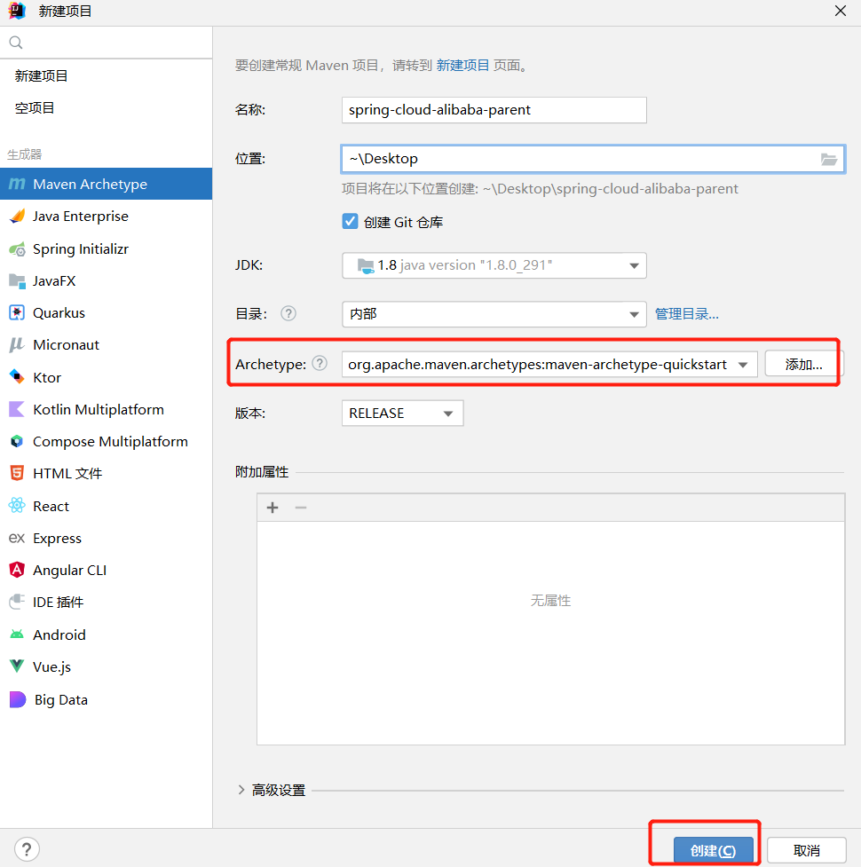

[toc]

# SpringCloudAlibaba笔记

## 什么是SpringCloud,SpringCloudAlibaba?

* SpringCloud是微服务架构下的一站式解决方案。
* SpringCloud是一个包含多个开发框架的工具集，集合了一套解决微服务问题的技术。让用户可以直接使用，不需要关心技术整合的问题。
* SpringCloud使用了SpringBoot作为底层，通过SpringBoot的自动配置来简化分布式架构的开发

* SpringCloudAlibaba 是阿里巴巴的微服务开发一站式解决方案

|  组件上的区别   | SpringCloud  | 	SpringCloudAlibaba  |
|  ----  | ----  | ----  |
| 注册中心  | Eureka、Consul | Nacos |
| 配置中心  | SpringCloud Config | Nacos |
| 网关      | SpringCloud Zuul | SpringCloud Gateway |
| 负载均衡	| Ribbon | Loadbalancer |
| 熔断降级  | Hystrix | Sentinel |
| 服务调用  | Feign | OpenFeign |

下图是微服务架构图


## 版本说明

注意：在搭建微服务框架的时候，要注意SpringCloudAlibaba，SpringCloud，SpringBoot三者的版本，不要各自使用最新的版本。

目前三者之间推荐的版本搭配

|  Spring Cloud Alibaba Version   | Spring Cloud Version | 	Spring Boot Version  |
|  ----  | ----  | ----  |
| 2.2.8.RELEASE  | Spring Cloud Hoxton.SR12 | 2.3.12.RELEASE |

目前SpringCloudAlibaba中各个组件的版本搭配

|  Spring Cloud Alibaba Version | Sentinel Version | Nacos Version | RocketMQ Version | Dubbo Version | Seata Version | 
|  ----  | ----  | ----  | ----  | ----  | ----  |
| 2.2.8.RELEASE  | 1.8.4 | 2.1.0 | 4.9.3 | ~ | 1.5.1 |

## maven项目中引入SpringCloudAlibaba依赖

1. 百度IDEA如何创建父子模块maven项目

```
1. idea创建一个springboot项目，注意SpringBoot的版本。
2. 删除项目中其余文件，只保留pom文件。注意修改pom文件中的springboot的版本，修改为2.3.12.RELEASE
3. 右键该项目，给该项目创建新的子项目。指定子项目的父项目。
```

2. 引入SpringCloudAlibaba，SpringCloud依赖,注意SpringCloudAlibaba，SpringCloud，SpringBoot三者的版本

```xml
<dependencyManagement>
    <dependencies>
        <dependency>
            <groupId>org.springframework.cloud</groupId>
            <artifactId>spring-cloud-dependencies</artifactId>
            <version>Hoxton.SR12</version>
            <type>pom</type>
            <scope>import</scope>
        </dependency>
        <dependency>
            <groupId>com.alibaba.cloud</groupId>
            <artifactId>spring-cloud-alibaba-dependencies</artifactId>
            <version>2.2.8.RELEASE</version>
            <type>pom</type>
            <scope>import</scope>
        </dependency>
    </dependencies>
</dependencyManagement>
```

## 创建spring-cloud-alibaba 父子工程

目前三者之间推荐的版本搭配

|  Spring Cloud Alibaba Version   | Spring Cloud Version | 	Spring Boot Version  |
|  ----  | ----  | ----  |
| 2.2.8.RELEASE  | Spring Cloud Hoxton.SR12 | 2.3.12.RELEASE |

### 新建一个maven项目，作为父工程



删除不必要的文件目录,最终保留文件目录。

1. .idea目录是idea用来管理项目的目录，不需要强制删除。不用理会。
2. .iml文件是idea用来管理项目的文件，不需要强制删除。不用理会。
3. 父工程主要保留pom.xml文件即可。


### 修改父工程的pom.xml

注意修改父工程的打包方式为pom

```xml
<?xml version="1.0" encoding="UTF-8"?>
<project xmlns="http://maven.apache.org/POM/4.0.0" xmlns:xsi="http://www.w3.org/2001/XMLSchema-instance"
         xsi:schemaLocation="http://maven.apache.org/POM/4.0.0 https://maven.apache.org/xsd/maven-4.0.0.xsd">
    <modelVersion>4.0.0</modelVersion>

    <groupId>org.example</groupId>
    <artifactId>spring-cloud-alibaba-parent</artifactId>
    <version>1.0-SNAPSHOT</version>

    <!--修改打包方式为pom-->
    <packaging>pom</packaging>

    <properties>
        <!-- java版本 -->
        <java.version>1.8</java.version>
        <!-- SpringBoot 版本 -->
        <spring.boot.version>2.3.12.RELEASE</spring.boot.version>
        <!-- Spring Cloud Alibaba 版本 -->
        <spring.cloud.alibaba>2.2.8.RELEASE</spring.cloud.alibaba>
        <!-- Spring Cloud 版本 -->
        <spring.cloud>Hoxton.SR12</spring.cloud>
    </properties>

    <dependencies>
        <dependency>
            <groupId>org.springframework.boot</groupId>
            <artifactId>spring-boot-starter</artifactId>
        </dependency>

        <dependency>
            <groupId>org.springframework.boot</groupId>
            <artifactId>spring-boot-starter-test</artifactId>
            <scope>test</scope>
        </dependency>
    </dependencies>

    <!-- 版本依赖统一管理 -->
    <dependencyManagement>
        <dependencies>
            <!-- SpringBoot 版本 -->
            <dependency>
                <groupId>org.springframework.boot</groupId>
                <artifactId>spring-boot-starter-parent</artifactId>
                <version>${spring.boot.version}</version>
                <type>pom</type>
                <scope>import</scope>
            </dependency>

            <!-- Spring Cloud Alibaba 版本 -->
            <dependency>
                <groupId>com.alibaba.cloud</groupId>
                <artifactId>spring-cloud-alibaba-dependencies</artifactId>
                <version>${spring.cloud.alibaba}</version>
                <type>pom</type>
                <scope>import</scope>
            </dependency>

            <!-- Spring Cloud 版本 -->
            <dependency>
                <groupId>org.springframework.cloud</groupId>
                <artifactId>spring-cloud-dependencies</artifactId>
                <version>${spring.cloud}</version>
                <type>pom</type>
                <scope>import</scope>
            </dependency>
        </dependencies>
    </dependencyManagement>

</project>
```
