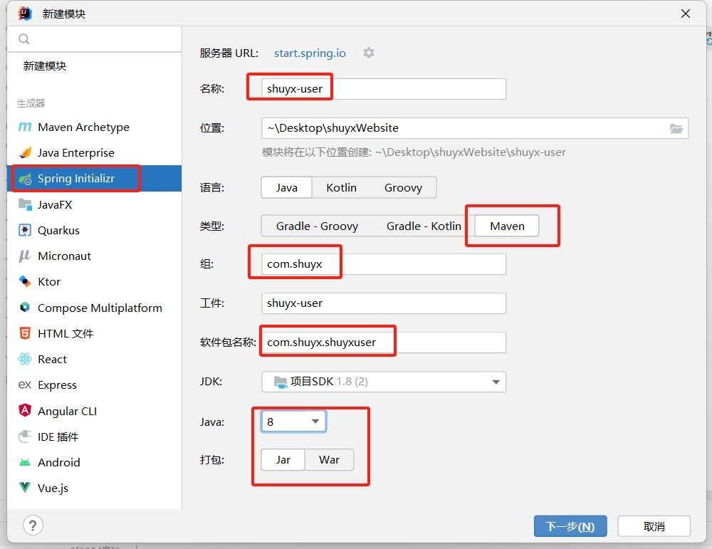

[toc]

# SpringCloudAlibaba笔记

## SpringCloud,SpringCloudAlibaba是什么?

* SpringCloud是微服务架构下的一站式解决方案。它是一个工具集，集合了一套解决微服务问题的技术。让用户可以直接使用，不需要关心技术整合的问题。
* SpringCloudAlibaba 是阿里巴巴在springcloud的基础上开发的微服务架构一站式解决方案。

> springcloud和SpringCloudAlibaba的区别？

|  组件上的区别   | SpringCloud  | 	SpringCloudAlibaba  |
|  ----  | ----  | ----  |
| 注册中心  | Eureka、Consul | Nacos |
| 配置中心  | SpringCloud Config | Nacos |
| 网关      | SpringCloud Zuul | SpringCloud Gateway |
| 负载均衡	| Ribbon | Loadbalancer |
| 熔断降级  | Hystrix | Sentinel |
| 服务调用  | Feign | OpenFeign |

下图是微服务架构图


## 三者依赖版本说明

注意：在搭建微服务框架的时候，要注意SpringCloudAlibaba，SpringCloud，SpringBoot三者的版本，不要各自使用最新的版本。

目前三者之间推荐的版本搭配

|  Spring Cloud Alibaba Version   | Spring Cloud Version | 	Spring Boot Version  |
|  ----  | ----  | ----  |
| 2.2.8.RELEASE  | Spring Cloud Hoxton.SR12 | 2.3.12.RELEASE |

目前SpringCloudAlibaba中各个组件的版本搭配

|  Spring Cloud Alibaba Version | Sentinel Version | Nacos Version | RocketMQ Version | Dubbo Version | Seata Version | 
|  ----  | ----  | ----  | ----  | ----  | ----  |
| 2.2.8.RELEASE  | 1.8.4 | 2.1.0 | 4.9.3 | ~ | 1.5.1 |

## IDEA 搭建 SpringCloudAlibaba 微服务项目

### 1 先创建一个空的maven父工程

① 先创建一个空的maven父工程

由于是空的父工程，可以不使用maven的模板骨架来创建。


② 删除父工程中不必要的文件和目录，只保留pom.xml和.gitignore文件


> 为什么让父工程是空的？

父工程的主要作用是为后续的子工程提供Maven依赖的统一管理，起到版本管理器的作用。例如我们可以通过父工程，让各个子工程的maven依赖的版本都是一样。并且我们不需要在父工程中编写代码，因此父工程可以是空的。

③ 修改父工程的pom文件.

完整的父工程pom文件如下
```xml
<?xml version="1.0" encoding="UTF-8"?>
<project xmlns="http://maven.apache.org/POM/4.0.0" xmlns:xsi="http://www.w3.org/2001/XMLSchema-instance"
         xsi:schemaLocation="http://maven.apache.org/POM/4.0.0 https://maven.apache.org/xsd/maven-4.0.0.xsd">
    <modelVersion>4.0.0</modelVersion>
    <groupId>com.shuyx</groupId>
    <artifactId>shuyxWebsite</artifactId>
    <version>1.0-SNAPSHOT</version>
    <name>shuyxWebsite</name>
    <description>this is shuyx website system</description>

    <!--修改打包方式为pom-->
    <packaging>pom</packaging>

    <!--properties属性配置。主要设置各个依赖的版本号-->
    <properties>
        <!-- java版本 -->
        <java.version>1.8</java.version>
        <!-- SpringBoot 版本 -->
        <spring.boot.version>2.3.12.RELEASE</spring.boot.version>
        <!-- Spring Cloud Alibaba 版本 -->
        <spring.cloud.alibaba>2.2.8.RELEASE</spring.cloud.alibaba>
        <!-- Spring Cloud 版本 -->
        <spring.cloud>Hoxton.SR12</spring.cloud>
    </properties>

    <!--这里是子工程都能用到的公共依赖。-->
    <dependencies>
        <dependency>
            <groupId>org.springframework.boot</groupId>
            <artifactId>spring-boot-starter</artifactId>
        </dependency>
        <dependency>
            <groupId>org.springframework.boot</groupId>
            <artifactId>spring-boot-starter-test</artifactId>
            <scope>test</scope>
        </dependency>
    </dependencies>

    <!--对SpringCloudAlibaba、SpringCloud,Spring Boot的依赖统一进行管理-->
    <!--子工程依赖的时候就不用指定版本了。会直接继承下面的依赖。-->
    <dependencyManagement>
        <dependencies>
            <!-- Spring Boot 版本 -->
            <dependency>
                <groupId>org.springframework.boot</groupId>
                <artifactId>spring-boot-starter-parent</artifactId>
                <version>${spring.boot.version}</version>
                <type>pom</type>
                <scope>import</scope>
            </dependency>
            <!-- Spring Cloud 版本 -->
            <dependency>
                <groupId>org.springframework.cloud</groupId>
                <artifactId>spring-cloud-dependencies</artifactId>
                <version>${spring.cloud}</version>
                <type>pom</type>
                <scope>import</scope>
            </dependency>
            <!-- Spring Cloud Alibaba 版本 -->
            <dependency>
                <groupId>com.alibaba.cloud</groupId>
                <artifactId>spring-cloud-alibaba-dependencies</artifactId>
                <version>${spring.cloud.alibaba}</version>
                <type>pom</type>
                <scope>import</scope>
            </dependency>
        </dependencies>
    </dependencyManagement>

    <!--使用spring-boot-maven-plugin打包项目，会将项目打包成可执行jar包。-->
    <build>
        <plugins>
            <plugin>
                <groupId>org.springframework.boot</groupId>
                <artifactId>spring-boot-maven-plugin</artifactId>
            </plugin>
        </plugins>
    </build>
</project>
```

> 修改要点

- 修改父工程的打包方式为pom
- 添加子工程要用的公共依赖spring-boot-starter
- 对SpringCloudAlibaba、SpringCloud,Spring Boot的依赖统一进行管理。
- 添加spring-boot-maven-plugin插件来打包项目。

> 目前三者之间推荐的版本搭配

|  Spring Cloud Alibaba Version   | Spring Cloud Version | 	Spring Boot Version  |
|  ----  | ----  | ----  |
| 2.2.8.RELEASE  | Spring Cloud Hoxton.SR12 | 2.3.12.RELEASE |


### 2 创建子工程

在微服务项目中，一般是根据系统中的服务来拆分出子工程。每个子工程都是一个独立的项目，一个独立的服务。

① 在当前父工程下，创建一个模块。这个模块就是子工程。





例如图中的shuyx-user子工程。每个子工程都是以springboot为基础。选择导入基本的web依赖即可。注意springboot的版本随便选，后面要修改为与父工程的版本一致。

② 删除子工程不必要的目录文件


③ 修改父工程的pom文件

给父工程的pom文件新增modules标签

```xml
<!--父pom文件新增modules标签-->
<modules>
    <module>shuyx-user</module>
</modules>
```

④ 修改子工程的pom文件

修改要点：
- 添加parent标签,替换为现在的父工程
- 删除不必要的标签。
- 添加packaging标签：如果子工程需要打出jar包，那么可以设置packaging标签。如果不需要打包，那么可以不添加packaging标签。

完整的子工程pom文件如下
```xml
<?xml version="1.0" encoding="UTF-8"?>
<project xmlns="http://maven.apache.org/POM/4.0.0" xmlns:xsi="http://www.w3.org/2001/XMLSchema-instance"
         xsi:schemaLocation="http://maven.apache.org/POM/4.0.0 https://maven.apache.org/xsd/maven-4.0.0.xsd">
    <modelVersion>4.0.0</modelVersion>
    <!--更换parent标签,替换为现在的父工程-->
    <parent>
        <artifactId>shuyxWebsite</artifactId>
        <groupId>com.shuyx</groupId>
        <version>1.0-SNAPSHOT</version>
    </parent>
    <artifactId>shuyx-user</artifactId>
    <groupId>com.shuyx</groupId>
    <version>0.0.1-SNAPSHOT</version>
    <name>shuyx-user</name>
    <description>shuyx-user</description>
    <!--子工程的打包方式-->
    <packaging>jar</packaging>

    <dependencies>
        <!--web依赖，版本继承自父工程的web依赖版本号-->
        <dependency>
            <groupId>org.springframework.boot</groupId>
            <artifactId>spring-boot-starter-web</artifactId>
        </dependency>
        <dependency>
            <groupId>org.springframework.boot</groupId>
            <artifactId>spring-boot-starter-test</artifactId>
            <scope>test</scope>
        </dependency>
    </dependencies>

    <build>
        <plugins>
            <plugin>
                <groupId>org.springframework.boot</groupId>
                <artifactId>spring-boot-maven-plugin</artifactId>
            </plugin>
        </plugins>
    </build>
</project>
```

⑤ modules标签和parent标签

modules标签和parent标签，会让父工程与子工程形成一种继承和聚合的关系。

- maven中的继承关系：会让子工程自动继承父工程的依赖。
- maven中的聚合关系：可以让父工程批量管理子工程。例如对父工程进行编译，则相当于对所有的子工程进行编译。

<font color="red">注意：只有在父子工程都是maven工程的情况下，才会自动添加modules和parent标签。如果不是，则需要手动添加modules和parent标签才行。</font>


### 3 总结

创建完父工程和子工程后，就可以开始根据业务需求编写代码了。

注意：父工程是空的，因此无论是空的maven父工程还是空的springboot父工程。都是要删除不必要的文件，保留pom文件的。因此只要pom文件是正确的，那么就ok。


