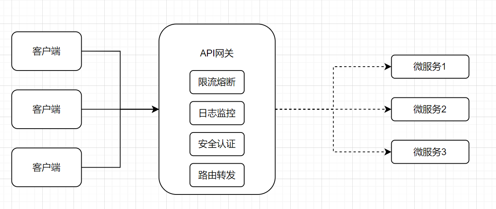
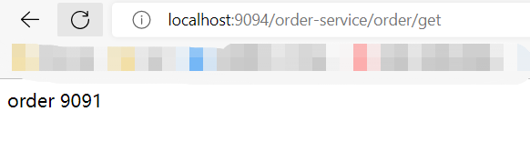
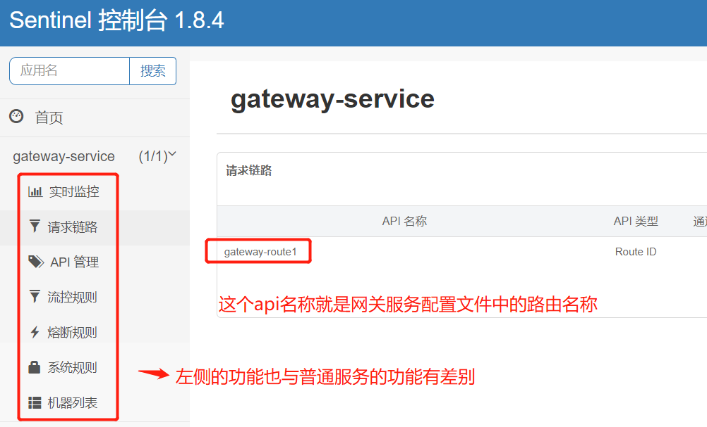
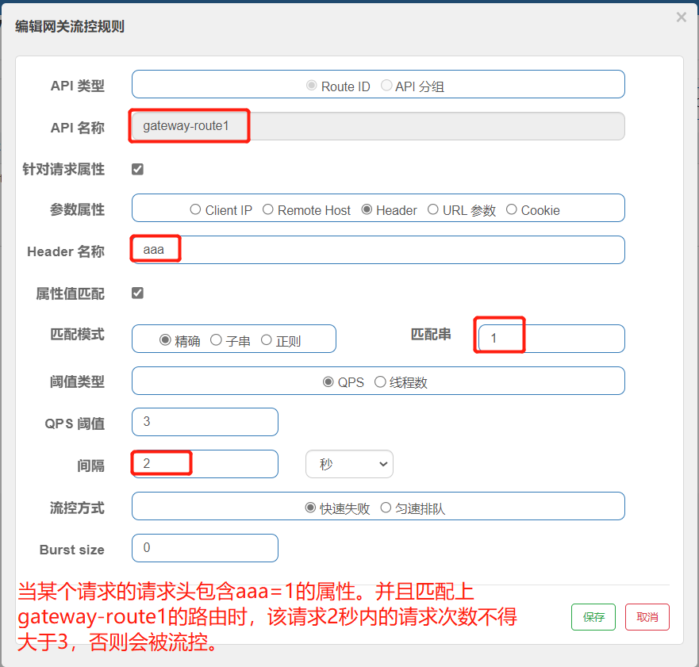
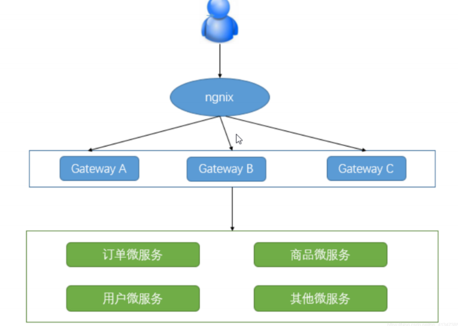

[toc]

# 微服务网关组件Spring Cloud Gateway 

<font color="red">当前Spring Cloud Gateway版本为2.2.9</font>

下图为微服务架构图,图中可以看到网关的定位。


## 1 网关介绍

在微服务架构中，通常一个系统会被拆分为多个微服务，面对这么多微服务客户端应该如何去调用呢？如果没有其他更优方法，我们只能记录每个微服务对应的地址，让客户端分别去调用，但是这样会有很多的问题和潜在因素。

* 客户端多次请求不同的微服务，会增加客户端代码和配置的复杂性，维护成本比价高。
* 鉴权认证复杂，每个微服务可能存在不同的认证方式，客户端去调用，要去适配不同的认证，
* 存在跨域的请求，调用链有一定的相对复杂性（防火墙 / 浏览器不友好的协议）。

为了解决上面的问题，微服务引入了API网关的概念，在微服务架构中API网关就是系统的统一入口，它封装了应用程序的内部结构，为客户端提供统一服务，一些与业务本身功能无关的公共逻辑可以在这里实现，诸如认证、鉴权、限流熔断、路由转发等等。



## 2 Spring Cloud Gateway介绍

Spring Cloud Gateway 是Spring Cloud官方推出的第二代API网关框架。定位于取代 Netflix Zuul1.0。相比 Zuul 来说，Spring Cloud Gateway 提供更优秀的性能，更强大的功能。

### Gateway功能特征

* 路由转发：针对请求URL，能够匹配任何请求属性，并进行过滤处理。
* 可以集成 Spring Cloud 服务发现功能（Nacos、Eruka）
* 可集成流控降级功能（Sentinel、Hystrix）

### Gateway核心概念

> 路由（Route) 
    
路由（Route）是GateWay中最基本的组件之一，是一个具体的路由信息载体。主要由下面几个部分组成：
* id：路由唯一标识，区别于其他的route
* url： 路由指向的目的地URL，客户端请求最终被转发到的微服务地址
* order： 用于多个Route之间的排序，数值越小越靠前，匹配优先级越高
* predicate：断言的作用是进行条件判断，只有断言为true，才执行路由
* filter: 过滤器用于修改请求和响应信息 

> 断言(predicates) 

断言允许开发者去定义匹配Http请求中的任何信息，比如请求头和参数等。

> 过滤器（Filter) 

Gateway中的filter可以对请求和响应进行处理。例如响应内容、响应头的修改、日志输出、流量监控等

### Gateway工作原理


执行流程大体如下：
1. Gateway Client向Gateway Server发送请求
2. 请求首先会被HttpWebHandlerAdapter进行提取组装成网关上下文
3. 然后网关的上下文会传递到DispatcherHandler，它负责将请求分发给RoutePredicateHandlerMapping
4. RoutePredicateHandlerMapping负责路由查找，并根据路由断言判断路由是否可用
5. 如果断言成功，由FilteringWebHandler创建过滤器链并调用
6. 请求会一次经过PreFilter（前过滤）--微服务处理--PostFilter（后过滤）的流程，最终返回响应结果。

<font color="red">当用户发出请求达到 GateWay 之后，会通过一些匹配条件，定位到真正的服务节点，并且在这个转发过程前后，GateWay可以进行一些细粒度的控制，其中 Predicate（断言） 是匹配条件，Filter 是一个拦截器，有了这两点，再加上URL，就可以实现一个具体的路由。核心思想：路由转发+执行过滤器链。</font>

## 3 Spring Cloud Gateway快速开始

①：新建一个maven工程，引入依赖
不用写明版本号，具体版本号通过父pom来决定
```xml
<dependency>
    <groupId>org.springframework.cloud</groupId>
    <artifactId>spring-cloud-starter-gateway</artifactId>
</dependency>
```

<font color="red">注意：一定要排除掉 spring-boot-starter-web 依赖，否则会启动报错。因为springmvc 和 springcloudgateway 两者的依赖包有冲突。</font>

② 增加Gateway配置

```yml
server:
  port: 9094  #服务端口
spring:
  application:
    name: gateway-service # 服务名称
  cloud:
    gateway:
      ## gateway路由规则
      routes:                         #路由数组，数组形式
        - id: gateway-route1          #路由唯一标识
          uri: http://localhost:9091  #请求转发地址
          order: 1                    #路由的优先级,数字越小级别越高
          ## 断言规则（用于匹配路由），数组形式
          predicates:
            ## 满足 /order-service/** 路径格式的请求,会被路由到转发地址中
            - Path=/order-service/**
          ## 过滤器规则，数组形式
          filters:
            ## StripPrefix去除原始请求路径中的第1级路径，即/order-service/aa/bb 变成 /aa/bb
            - StripPrefix=1
```

上面配置的意思是：若某个http请求满足 /order-service/** 路径格式。则gateway网关会把该请求的第1级路径去除，重新转发到http://localhost:9091地址上。若不满足该路径格式，则直接拒绝该http请求。

③ 重启该服务，并访问。



上图中的http请求被gateway网关重新转发到http://localhost:9091/order/get地址上。

## 4 Gateway集成nacos

Gateway集成nacos。主要作用是从nacos注册中心中获取服务名称（转发地址），防止转发路径地址写死的问题。

① 引入nacos注册中心依赖
```xml
<dependency>
    <groupId>com.alibaba.cloud</groupId>
    <artifactId>spring-cloud-starter-alibaba-nacos-discovery</artifactId>
</dependency>
```

②修改配置文件
```yml
server:
  port: 9094  #服务端口
spring:
  application:
    name: gateway-service # 服务名称
  cloud:
    gateway:
      ## gateway路由规则
      routes:                         #路由数组
        - id: gateway-route1                  #路由唯一标识
          uri: lb://order-service  #请求转发地址,lb指的是从nacos中按照名称获取微服务,并遵循负载均衡策略
          order: 1                    #路由的优先级,数字越小级别越高
          ## 断言规则数组（用于匹配路由）
          predicates:
            ## 满足 /order-service/** 路径的请求,会被路由到转发地址中
            - Path=/order-service/**
          ## 过滤器规则数组
          filters:
            ## StripPrefix去除原始请求路径中的第1级路径，即/order-service/aa/bb 变成 /aa/bb
            - StripPrefix=1
    
    nacos:
      discovery:
        server-addr: localhost:7070/nacos ## nacos注册中心配置地址
```

修改两处地方：
1. 增加注册中心地址
2. 将url的值从转发地址，改为lb://注册中心的某个服务名称。（lb是启用nacos负载均衡的意思）

<font color="red">此时只要按照网关地址/微服务/接口的格式去访问，就可以成功响应接口</font>


> 上面的配置有一种简化写法，效果跟上面的配置一样
```yml
server:
  port: 9094  #服务端口
spring:
  application:
    name: gateway-service # 服务名称
  cloud:
    gateway:
      ## 这段配置的意思是。自动将nacos中的服务名作为转发地址和断言规则，并且默认去除第1级路径
      discovery:
        locator:
          enabled: true
    nacos:
      discovery:
        server-addr: localhost:7070/nacos
```

修改两处地方：
1. 删除之前设置的gateway路由规则。
2. 只增加gateway.discovery.locator.enabled=true的属性。意思是把nacos中的服务名默认作为转发地址和断言规则。并且转发请求时自动去除第1级路径。

<font color="red">这种是约定大于配置的写法，不够灵活。不推荐</font>


## 5 路由断言工厂（Route Predicate Factories）配置

路由断言工厂的作用：当请求gateway时，gateway使用断言规则对请求进行匹配，如果匹配成功就路由转发，如果匹配失败就返回404。

下面是部分断言工厂配置的示例。具体信息请参照官网。

① 基于Path请求路径的断言工厂
Path：接收一个参数，判断请求的URI部分是否满足路径规则。{segment}占位符
```yml
predicates:
  - Path=/red/{segment},/blue/{segment},/green/**
```

② 基于Method请求方法的断言工厂
Method：接收一个参数，判断请求类型是否跟指定的类型匹配。
```yml
predicates:
  - Method=GET,POST
```

③ 基于Datetime类型的断言工厂
After： 接收一个日期参数，判断请求日期是否晚于指定日期
Before： 接收一个日期参数，判断请求日期是否早于指定日期
Between： 接收两个日期参数，判断请求日期是否在指定时间段内
```yml
predicates:
  ### 当请求时间>下面的时间，则断言匹配成功
  - After=2019‐12‐31T23:59:59.789+08:00[Asia/Shanghai]
# - Before=2017-01-20T17:42:47.789-07:00[Asia/Shanghai]
# - Between=2017-01-20T17:42:47.789-07:00[Asia/Shanghai], 2017-01-21T17:42:47.789-07:00[Asia/Shanghai]
```

④ 基于远程地址的断言工厂
RemoteAddr：接收一个IP地址段，判断请求主机地址是否在地址段中
```yml
predicates:
  ### 当请求地址在下面的地址段中，则断言匹配成功
  - RemoteAddr=192.168.1.1/24
```

⑤ 基于Cookie的断言工厂
Cookie：接收两个参数，cookie名字和值（正则表达式也行）。判断请求的cookie是否具有给定名称且值与正则表达式匹配。
```yml
predicates:
  ### 当请求的cookie，键值对有chocolate属性，值为111
  - Cookie=chocolate,111
  ### 当请求的cookie，键值对有chocolate属性，值能够匹配ch.正则表达式
  - Cookie=chocolate,ch.
```

⑥ 基于Header的断言工厂
Header：接收两个参数，标题名称和值（正则表达式也行）。判断请求Header是否具有给定名称且值与正则表达式匹配。
```yml
predicates:
  ### 请求头包含X‐Request‐Id属性，值111
  - Header=X‐Request‐Id,111
  ## 请求头包含X‐Request‐Id属性，值匹配\d+正则表达式
  - Header=X‐Request‐Id,\d+
```

⑦ 基于Host的断言工厂
Host：接收一个参数，主机名模式。判断请求的Host是否满足匹配规则。
```yml
predicates:
  ‐ Host=**.test.com
```

⑧ 基于Query请求参数的断言工厂
Query：接收两个参数，请求param参数和值（正则表达式也行）， 判断请求参数是否具有给定名称且值与正则表达式匹配。
```yml
predicates:
  # 请求参数包含name-xiaoming。例如/xxx?name=xiaoming
  ‐ Query=name,xiaoming
```

⑨ 基于路由权重的断言工厂
Weight：接收一个[ 组名,权重 ], 然后对于同一个组内的路由按照权重转发
```yml
spring:
  cloud:
    gateway:
      routes:
      - id: weight_high
        uri: https://weighthigh.org
        predicates:
          - Weight=group1,8
      - id: weight_low
        uri: https://weightlow.org
        predicates:
          - Weight=group1,2
```


## 6 自定义路由断言工厂

自定义路由断言工厂需要继承 AbstractRoutePredicateFactory 类，重写 apply 方法的逻辑。在apply方法中可以通过exchange.getRequest() 拿到ServerHttpRequest 对象，从而可以获取到请求的参数、请求方式、请求头等信息。 

自定义路由断言工厂类必须满足下面要求：
1. 该自定义类必须为spring的bean
2. 自定义类名必须以RoutePredicateFactory作为结尾。即XXXRoutePredicateFactory
3. 自定义类必须继承AbstractRoutePredicateFactory类
4. 自定义类中必须声明静态内部类声明属性来接收配置文件中的断言规则配置信息
5. 自定义类中需要结合shortcutFieldOrder进行绑定配置文件中的断言信息
6. 自定义类中通过apply进行逻辑判断。true就是匹配成功,false匹配失败

① 编写自定义断言工厂类
```java
@Component
public class CheckAuthRoutePredicateFactory extends AbstractRoutePredicateFactory<CheckAuthRoutePredicateFactory.Config> {

    public CheckAuthRoutePredicateFactory() {
        super(CheckAuthRoutePredicateFactory.Config.class);
    }

    //该方法是将配置文件中的自定义断言信息，绑定到config对象中
    public List<String> shortcutFieldOrder() {
        return Arrays.asList("value");
    }

    //断言匹配方法
    @Override
    public Predicate<ServerWebExchange> apply(Config config) {
        return new GatewayPredicate() {
            public boolean test(ServerWebExchange exchange) {
                //从请求参数中获取auth的属性值
                String auth = exchange.getRequest().getQueryParams().getFirst("auth");
                //将auth属性值与从配置文件中的自定义断言信息对比。若相同就断言成功
                if(StringUtils.isNotBlank(auth)){
                    if(auth.equals(config.value)){
                        return true;
                    }
                }
                return false;
            }
        };
    }


    //接受配置文件中的断言信息，若-CheckAuth:xxx，那么value就是接受xxx的值的。
    @Validated
    public static class Config {
        private String value;

        public String getValue() {
            return value;
        }
        public void setValue(String value) {
            this.value = value;
        }
    }
}
```

② 修改配置文件，增加自定义断言
CheckAuthRoutePredicateFactory自定义断言工厂用法
```yml
predicates:
  ## 自定义断言规则，当请求参数中auth的值为admin的请求才能匹配成功
  - CheckAuth=admin
```

当请求http://localhost:9094/order-service/order/get?auth=admin 中的请求参数auth为admin时，才能断言匹配成功。


## 7 过滤器工厂（ GatewayFilter Factories）配置

过滤器工厂可以对进入Gateway网关的请求和微服务返回的响应做处理，比如添加去除响应头，添加去除参数等操作。

下面是部分过滤器工厂配置的示例。具体信息请参照官网。

|  过滤器工厂配置 | 作用 | 参数 | 
|  ----  | ----  | ----  | 
| AddRequestHeader  | 为原始请求添加Header | Header的名称及值 | 
| AddRequestParameter  | 为原始请求添加请求参数 | 参数名称及值 | 
| AddResponseHeader  | 为原始响应添加Header | Header的名称及值 | 
| PrefixPath  | 为原始请求路径添加前缀 | 前缀路径 | 
| RedirectTo  | 将原始请求重定向到指定的URL | http状态码及重定向的url | 
| RemoveRequestHeader  | 为原始请求删除某个Header | Header名称 | 
| RemoveResponseHeader  | 为原始响应删除某个Header | Header名称 | 
| StripPrefix  | 用于截断原始请求的路径 | 使用数字表示要截断的路径的数量 |


示例：
```yml
filters:
  # 添加响应头,属性为X-Response-Red，值为Blue
  - AddResponseHeader=X-Response-Red,Blue
  # 给请求路由添加前缀 相当于spring的server.servlet.context‐path配置
  - PrefixPath=/api
```

## 8 自定义过滤器工厂设置

① 编写自定义过滤器工厂类，编写自定义过滤操作。
```java
@Component
public class CuetomGatewayFilterFactory extends AbstractNameValueGatewayFilterFactory {
    Logger logger = LoggerFactory.getLogger(CuetomGatewayFilterFactory.class);
    //在apply方法进行自定义过滤操作
    @Override
    public GatewayFilter apply(NameValueConfig config) {
        return new GatewayFilter() {
            public Mono<Void> filter(ServerWebExchange exchange, GatewayFilterChain chain) {
                //获取配置文件中自定义过滤器的属性和值
                //例如：- Cuetom=name,xiaoming。config会获取到属性和值，并赋值到config的name，value属性中
                logger.info("调用CuetomGatewayFilterFactory");
                logger.info("config.getName() = "+config.getName());
                logger.info("config.getValue() = "+config.getValue());
                return chain.filter(exchange);
            }
        };
    }
}
```

②修改配置文件
```yml
gateway:
      routes:                      
        - id: gateway-route1       #路由唯一标识
          filters:
            # 自定义过滤
            - Cuetom=name,xiaoming
```

③配置文件中的name和xiaoming。会被打印到控制台中。


## 9 全局过滤器

局部过滤器和全局过滤器区别：
局部过滤器：针对某个路由,需要在配置文件的路由中进行配置。
全局过滤器：针对所有路由请求， 一旦定义就会投入使用，无须再配置文件中定义。

编写全局过滤器类
```java
@Component
public class CustomGateWayGlobalFilter implements GlobalFilter {
    Logger logger = LoggerFactory.getLogger(CustomGateWayGlobalFilter.class);
    //全局过滤器过滤方法
    @Override
    public Mono<Void> filter(ServerWebExchange exchange, GatewayFilterChain chain) {
        //将请求路径打印出来
        logger.info("CustomGateWayGlobalFilter,"+exchange.getRequest().getPath().value());
        return chain.filter(exchange);
    }
}
```

## 10 gateway跨域配置

有两种方式配置跨域。

通过在配置文件配置的方式
```yml
spring:
  cloud:
    gateway:
      globalcors:
        cors-configurations:
          ["/**"]:
            allowedOrigins: "*"
            allowedHeaders: "*"
            allowedMethods: "*"

```

通过java配置类的方式
```java
import org.springframework.context.annotation.Bean;
import org.springframework.context.annotation.Configuration;
import org.springframework.web.cors.CorsConfiguration;
import org.springframework.web.cors.reactive.CorsWebFilter;
import org.springframework.web.cors.reactive.UrlBasedCorsConfigurationSource;
import org.springframework.web.util.pattern.PathPatternParser;

@Configuration
public class GatewayCorsConfig {
    @Bean
    public CorsWebFilter corsFilter() {
        CorsConfiguration config = new CorsConfiguration();
        config.addAllowedMethod("*");
        config.addAllowedOrigin("*");
        config.addAllowedHeader("*");
        UrlBasedCorsConfigurationSource source = new UrlBasedCorsConfigurationSource(new PathPatternParser());
        source.registerCorsConfiguration("/**", config);
        return new CorsWebFilter(source);
    }
}

```

## 11 gateway整合sentinel实现流控降级功能

gateway网关作为内部系统外的一层屏障, 对内起到一定的保护作用, 限流便是其中之一. 网关层的限流可以简单地针对不同路由进行限流, 也可针对业务的接口进行限流，或者根据接口的特征分组限流。

### 控制台方式整合

①引入依赖
```xml
<!--sentinel的依赖-->
<dependency>
    <groupId>com.alibaba.cloud</groupId>
    <artifactId>spring-cloud-starter-alibaba-sentinel</artifactId>
</dependency>
<!--gateway整合sentinel的依赖-->
<dependency>
    <groupId>com.alibaba.cloud</groupId>
    <artifactId>spring-cloud-alibaba-sentinel-gateway</artifactId>
</dependency>
```
②修改配置文件
```yml

server:
  port: 9094  #服务端口
spring:
  application:
    name: gateway-service # 服务名称
  cloud:
    gateway:
      routes:                      #路由数组，数组形式
        - id: gateway-route1       #路由唯一标识
          uri: lb://order-service  #请求转发地址,lb指的是从nacos中按照名称获取微服务,并遵循负载均衡策略
          ## 断言规则（用于匹配路由），数组形式
          predicates:
            - Path=/order/**
    nacos:
      discovery:
        server-addr: localhost:7070/nacos

##### 下面是新增的sentinel控制台配置，上面是之前的配置########## 
    sentinel:
      transport:
        port: 8720
        dashboard: localhost:8898

```

③ 重启服务，访问一下网关接口。然后登录sentinel控制台



④ 可以通过sentinel控制台来对某个gateway网关路由设置流控规则，如下图




## 12 网关高可用（gateway网关集群）

为了保证 Gateway 的高可用性，可以同时启动多个 Gateway 实例进行负载，在 Gateway 集群的上游使用 Nginx进行负载转发以达到高可用。



① 重新创建一个新的gateway网关服务。

② 设置nginx配置，让nginx对多个网关服务进行负载,让gateway网关高可用。

```
upstream gateway-cluster {
    server 192.168.11.109:9094;
    server 192.168.11.109:9095;
}

server {
    listen       6060;
    server_name  localhost;
    location / {
        proxy_pass http://gateway-cluster;
    }
}
```

③访问localhost:6060就会转发到其中一个网关地址。