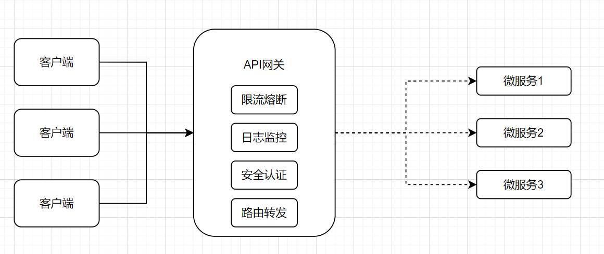
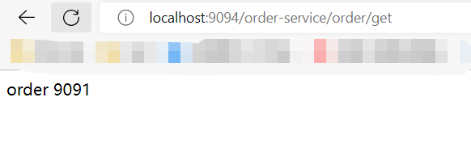
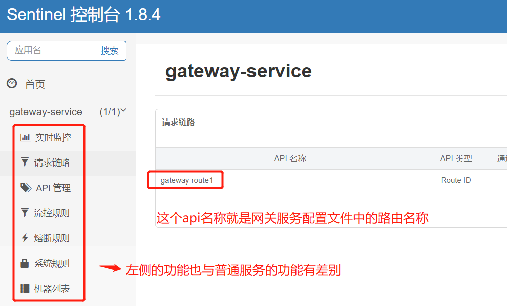
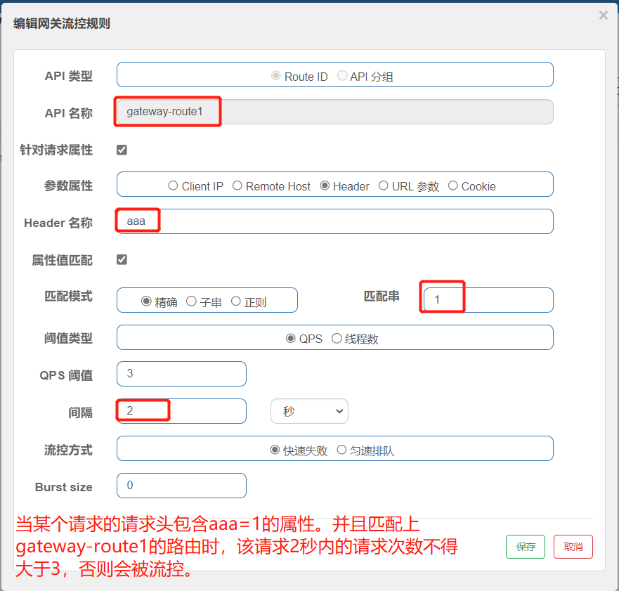

[toc]

# 微服务网关组件SpringCloudGateway笔记1

当前Spring Cloud Gateway版本为2.2.9

下图为微服务架构图,图中可以看到网关的定位。


## 为什么要有网关？

在微服务架构中，通常一个系统会被拆分为多个微服务。那么微服务系统之外的客户端（前端页面）如何去调用微服务系统中的各个服务呢？

* 如果一个客户端请求很多个微服务，这样会增加客户端代码和配置的复杂性。
* 如果每个服务都需要鉴权，校验，跨域，日志记录等公共业务逻辑。如果每个服务都自己实现一遍，这样会增加每个服务的复杂度。我们可以将这样公共业务逻辑抽离出来，统一放到一个服务中完成。

为了解决上面的问题，微服务引入了API网关的概念。

即API网关是微服务中的一个服务节点，也是微服务系统的入口。客户端首先访问API网关后，再由API网关将客户端的请求转发到微服务系统中的服务上。

同时API网关也是一个服务。我们可以把系统中的公共业务逻辑，放到API网关中。从而让各个服务专注于各自的业务功能。

如下图是API网关可以提供的功能


## 网关和openFeign的区别？

- openFeign是用于处理微服务系统内部中服务与服务之间的调用。
- 网关是用于处理微服务系统外部（客户端）向微服务系统中的服务的调用。即系统外部调用系统内部的服务

<font color="red">
总结：API网关作为微服务系统的入口服务节点，所有的外部请求都通过API网关来调用微服务系统中的内部服务节点。而微服务内部服务之间的请求都是走OpenFeign来进行调用。
</font>


## Spring Cloud Gateway介绍

Spring Cloud Gateway 是Spring Cloud官方推出的第二代网关框架。

### Spring Cloud Gateway的3个核心概念

> 路由（Route）
    
路由（Route）是一个具体的请求路径信息载体。主要由下面几个部分组成：
* id：路由唯一标识，区别于其他的路由
* url：路由指向的目的地，客户端的请求最终被转发到的地址。
* order：用于多个路由之间的排序，数值越小越靠前，匹配优先级越高。
* predicate：断言是用于对请求路径进行条件判断，如果断言为true，才执行对于的路由。
* filter: 过滤器是用于对请求信息和响应信息进行过滤并处理。

路由 = 路由信息 + 断言 + 过滤器。

> 断言(predicates) 

断言是一种规则，这个规则用来匹配请求中的任何信息，比如请求头和参数等。满足了这个规则，就表示断言成功。断言成功后，才会执行对应的路由。

> 过滤器（Filter）

filter可以对请求信息和响应信息进行过滤并处理。例如获取请求/响应内容、对请求头/响应头的修改等。

## Spring Cloud Gateway 快速开始

①：新建一个Springboot工程，引入Spring Cloud Gateway 的依赖

如果这个工程的父工程导入了Spring Cloud Alibaba依赖。那么可以不用写明Spring Cloud Gateway 的依赖版本号。具体版本由Spring Cloud Alibaba来决定。

```xml
<!--gate网关-->
<dependency>
    <groupId>org.springframework.cloud</groupId>
    <artifactId>spring-cloud-starter-gateway</artifactId>
</dependency>
```

<font color="red">注意：一定要排除掉 spring-boot-starter-web 依赖，否则会启动报错。因为springmvc 和 springcloudgateway 两者的依赖包有冲突。</font>

② 添加Gateway的配置

```yml
server:
  port: 9094  #服务端口
spring:
  application:
    name: gateway-service # 服务名称
  cloud:
    gateway:
      ## gateway的路由规则
      routes:                         #路由数组，数组形式
        - id: gateway-route1          #路由的唯一标识id
          uri: http://localhost:9091  #请求转发的地址
          order: 1                    #路由的优先级,数字越小级别越高
          ## 断言规则（用于匹配路由），数组形式
          predicates:
            ## 满足 /order-service/** 路径格式的请求,会被路由到转发地址中
            - Path=/order-service/**
          ## 过滤器规则，数组形式
          filters:
            ## StripPrefix去除原始请求路径中的第1级路径，例如将/order-service/aa/bb 变成 /aa/bb
            - StripPrefix=1
```

gateway会拦截客户端的请求。并将请求与gateway的路由逐一进行匹配。若请求满足路由A的断言规则。那么gateway会根据路由A的设置，把请求进行转发。

例如上面配置的意思是：若某个http请求路径满足 /order-service/** 的格式，表示断言成功，则gateway网关会把该请求的第1级路径去除，重新转发到http://localhost:9091地址上。若不满足该路径格式，表示断言失败，则将该请求与其他路由进行匹配。

③ 重启该服务，并访问。



上图中的请求被gateway网关重新转发到`http://localhost:9091/order/get`地址上。

## Spring Cloud Gateway 集成 Nacos

Spring Cloud Gateway 集成nacos。主要作用是从nacos注册中心中获取服务名称（转发地址），从而在gateway的路由配置中，不会把转发地址写死。

① 引入nacos依赖
```xml
<dependency>
    <groupId>com.alibaba.cloud</groupId>
    <artifactId>spring-cloud-starter-alibaba-nacos-discovery</artifactId>
</dependency>
```

② 修改gateway配置文件
```yml
server:
  port: 9094  #服务端口
spring:
  application:
    name: gateway-service # 服务名称
  cloud:
    gateway:
      ## gateway路由规则
      routes:                         #路由数组
        - id: gateway-route1          #路由唯一标识
          uri: lb://order-service     #请求转发地址,从nacos中获取服务名称,lb指的是负载均衡策略
          order: 1                    #路由的优先级,数字越小级别越高
          ## 断言规则数组（用于匹配路由）
          predicates:
            ## 满足 /order-service/** 路径的请求,会被路由到转发地址中
            - Path=/order-service/**
          ## 过滤器规则数组
          filters:
            - StripPrefix=1
    ## nacos注册中心配置地址
    nacos:
      discovery:
        server-addr: localhost:7070/nacos
        username: nacos
        password: nacos
```

配置文件修改了两处地方：
1. 增加注册中心地址
2. 将url的值从转发地址，改为lb://注册中心的某个服务名称。（lb是启用nacos负载均衡的意思）

<font color="red">此时只要按照网关地址/nacos中的服务名称/接口路径的格式去进行请求，就可以成功响应接口</font>
 
③ 简写配置

上面的配置有一种简化写法，效果跟上面的配置一样

```yml
server:
  port: 9094  #服务端口
spring:
  application:
    name: gateway-service # 服务名称
  cloud:
    gateway:
      ## 这段配置的意思是。自动将nacos中的服务名作为转发地址和断言规则，并且默认去除第1级路径
      discovery:
        locator:
          enabled: true
    nacos:
      discovery:
        server-addr: localhost:7070/nacos
```

修改两处地方：
1. 删除之前设置的gateway路由规则。
2. 增加gateway.discovery.locator.enabled=true的属性。意思是把nacos中的服务名默认作为转发地址和断言规则。并且转发请求时自动去除第1级路径。

<font color="red">这一种是约定大于配置的写法，不够灵活，并且也无法用到断言和过滤器等功能。不推荐</font>

## 路由断言工厂

路由断言工厂的作用：当请求gateway时，gateway会把请求与路由逐一匹配。具体的匹配方式就是把请求与路由中的断言规则进行匹配。如果匹配成功，则请求会被路由进行转发。如果匹配失败就返回404。

下面是部分断言工厂配置的示例。具体信息请参照官网。

### 基于Path请求路径的断言工厂

Path：接收一个参数，判断请求的URI是否满足路径规则。

{segment}是占位符，也可以是任意字符。

```yml
spring:
  cloud:
    gateway:
      routes:
        predicates:
          - Path=/red/{segment},/green/**
```

当请求路径满足`/red/1`或`/green/11`的时候，断言成功。

### 基于Method请求方法的断言工厂

Method：接收一个参数，判断请求类型是否跟指定的类型匹配。

```yml
## 当请求方式为GET,POST的时候，才能断言成功
predicates:
  - Method=GET,POST
```

### 基于Datetime类型的断言工厂

- After： 接收一个时间参数，判断请求时间是否晚于指定时间
- Before： 接收一个时间参数，判断请求时间是否早于指定时间
- Between： 接收两个时间参数，判断请求时间是否在指定时间段内

时间参数是带有时区的时间。可以通过`ZonedDateTime.now()`方法获取当前时区时间。

```yml
predicates:
  ### 当请求时间 >下面的时间参数，则断言匹配成功
  - After=2019‐12‐31T23:59:59.789+08:00[Asia/Shanghai]
# - Before=2017-01-20T17:42:47.789-07:00[Asia/Shanghai]
# - Between=2017-01-20T17:42:47.789-07:00[Asia/Shanghai], 2017-01-21T17:42:47.789-07:00[Asia/Shanghai]
```

### 基于远程地址的断言工厂

RemoteAddr：接收一个IP地址段，判断请求的主机地址是否在地址段中。

```yml
predicates:
  ### 当请求的IP地址在下面的地址段中，则断言匹配成功
  - RemoteAddr=192.168.1.1/24
```

### 基于Cookie的断言工厂

Cookie：接收两个参数，Cookie的key和value。

判断请求的cookie是否具有指定key并且value与正则表达式匹配。

```yml
predicates:
  ### 当请求的cookie，key-value为chocolate和111的时候，断言成功
  - Cookie=chocolate,111
  ### 当请求的cookie，key是chocolate，value能够匹配`ch.`正则表达式的时候，断言成功
  - Cookie=chocolate,ch.
```

### 基于Header的断言工厂

Header：接收两个参数，key和value。

判断请求Header是否具有指定key并且value与正则表达式匹配。

```yml
predicates:
  ### 请求头包含X‐Request‐Id属性，值为111
  - Header=X‐Request‐Id,111
  ## 请求头包含X‐Request‐Id属性，值需要匹配`\d+`正则表达式
  - Header=X‐Request‐Id,\d+
```

### 基于Host的断言工厂

Host：接收一个参数，主机名模式。

判断请求的Host是否满足匹配规则。

```yml
# 当请求的域名，满足**.test.com格式的时候，断言成功
predicates:
  ‐ Host=**.test.com
```

### 基于Query请求参数的断言工厂

Query：接收两个参数，key和value。

判断请求参数是否具有指定key并且value与正则表达式匹配。

```yml
predicates:
  # 请求需要包含请求参数name-xiaoming。例如/xxx?name=xiaoming
  ‐ Query=name,xiaoming
```

### 基于路由权重的断言工厂

Weight：接收一个[ 组名,权重 ], 然后对于同一个组内的路由按照权重转发

```yml
spring:
  cloud:
    gateway:
      routes:
      # 路由01
      - id: router01
        uri: https://weighthigh.org
        predicates:
          - Weight=group1,8
      # 路由02
      - id: router02
        uri: https://weightlow.org
        predicates:
          - Weight=group1,2
```

上面路由01和路由02都是在一个路由组group1中。并且路由01的权重为8，路由02的权重为2。

例如当有大量的请求访问路由组group1，则80%的请求访问路由01，20%的请求访问路由02。
 

## 自定义路由断言工厂

如果我们想自定义一个自定义路由断言工厂。首先需要创建一个自定义工厂类，该类需要去继承 AbstractRoutePredicateFactory 类，重写 apply 方法的逻辑。

在apply方法中可以通过exchange.getRequest() 拿到ServerHttpRequest 请求对象，从而可以获取到请求的参数、请求方式、请求头等信息。 

自定义路由断言工厂类必须满足下面要求：
1. 该自定义类必须为spring的bean
2. 自定义类名必须以RoutePredicateFactory作为结尾。即XXXRoutePredicateFactory
3. 自定义类必须继承AbstractRoutePredicateFactory类
4. 自定义类中必须声明静态内部类Config，来接收配置文件中的断言规则配置信息
5. 自定义类中需要结合shortcutFieldOrder进行绑定配置文件中的断言信息
6. 自定义类中需要重写apply方法中的逻辑判断。true就是匹配成功,false匹配失败。

① 编写自定义断言工厂类

```java
@Component
public class CheckAuthRoutePredicateFactory extends AbstractRoutePredicateFactory<CheckAuthRoutePredicateFactory.Config> {

    public CheckAuthRoutePredicateFactory() {
        super(CheckAuthRoutePredicateFactory.Config.class);
    }

    //该方法是将配置文件中的自定义断言信息，绑定到config对象中
    public List<String> shortcutFieldOrder() {
        return Arrays.asList("value");
    }

    //重写apply方法，进行自定义断言规则匹配
    @Override
    public Predicate<ServerWebExchange> apply(Config config) {
        return new GatewayPredicate() {
            public boolean test(ServerWebExchange exchange) {
                //从请求参数中获取auth的属性值
                String auth = exchange.getRequest().getQueryParams().getFirst("auth");
                //将auth属性值与从配置文件中的自定义断言信息对比。若相同就断言成功
                if(StringUtils.isNotBlank(auth)){
                    if(auth.equals(config.value)){
                        return true;
                    }
                }
                return false;
            }
        };
    }

    //接收配置文件中的断言信息，若-CheckAuth:xxx，那么value就是接受xxx的值的。
    @Validated
    public static class Config {
        private String value;

        public String getValue() {
            return value;
        }
        public void setValue(String value) {
            this.value = value;
        }
    }
}
```

② 修改配置文件，增加自定义断言

CheckAuthRoutePredicateFactory自定义断言工厂的用法如下

```yml
predicates:
  ## 自定义断言规则，当请求参数中auth的值为admin的请求才能匹配成功
  - CheckAuth=admin
```

③ 测试

当请求`http://localhost:9094/order-service/order/get?auth=admin`中的请求参数auth为admin时，才能断言匹配成功。


## 过滤器工厂

过滤器工厂可以对进入Gateway网关的请求和微服务返回的响应进行处理。比如添加/去除响应头，添加/去除参数等操作。


下面是部分过滤器工厂配置的示例。具体信息请参照官网。

|  过滤器工厂配置 | 作用 | 参数 | 
|  ----  | ----  | ----  | 
| AddRequestHeader  | 为原始请求添加Header | Header的名称及值 | 
| AddRequestParameter  | 为原始请求添加请求参数 | 参数名称及值 | 
| AddResponseHeader  | 为原始响应添加Header | Header的名称及值 | 
| PrefixPath  | 为原始请求路径添加前缀 | 前缀路径 | 
| RedirectTo  | 将原始请求重定向到指定的URL | http状态码及重定向的url | 
| RemoveRequestHeader  | 为原始请求删除某个Header | Header名称 | 
| RemoveResponseHeader  | 为原始响应删除某个Header | Header名称 | 
| StripPrefix  | 用于截断原始请求的路径 | 使用数字表示要截断的路径的数量 |


示例：
```yml
filters:
  # 添加请求的响应头,属性为X-Response-Red，值为Blue
  - AddResponseHeader=X-Response-Red,Blue
  # 给请求路由添加前缀 相当于spring的server.servlet.context‐path配置
  - PrefixPath=/api
  # 将请求重定向
  - RedirectTo=302,https://www.baidu.com/
```

## 自定义过滤器工厂

① 编写自定义过滤器工厂类，编写自定义过滤操作。

```java
@Component
public class CuetomGatewayFilterFactory extends AbstractNameValueGatewayFilterFactory {
    Logger logger = LoggerFactory.getLogger(CuetomGatewayFilterFactory.class);
    //在apply方法进行自定义过滤操作
    @Override
    public GatewayFilter apply(NameValueConfig config) {
        return new GatewayFilter() {
            public Mono<Void> filter(ServerWebExchange exchange, GatewayFilterChain chain) {
                //获取配置文件中自定义过滤器的属性和值
                //例如：- Cuetom=name,xiaoming。config会获取到属性和值，并赋值到config的name，value属性中
                logger.info("调用CuetomGatewayFilterFactory");
                logger.info("config.getName() = "+config.getName());
                logger.info("config.getValue() = "+config.getValue());
                return chain.filter(exchange);
            }
        };
    }
}
```

②修改配置文件

```yml
gateway:
      routes:                      
        - id: gateway-route1       #路由唯一标识
          filters:
            # 自定义过滤
            - Cuetom=name,xiaoming
```

③ 测试

配置文件中的name和xiaoming。会被打印到控制台中。


## 全局过滤器

> 局部过滤器和全局过滤器区别：

- 局部过滤器：针对某个路由,需要在配置文件的路由中进行配置。
- 全局过滤器：针对所有路由请求。无须再配置文件中定义。

编写全局过滤器类

```java
@Component
public class CustomGateWayGlobalFilter implements GlobalFilter {
    Logger logger = LoggerFactory.getLogger(CustomGateWayGlobalFilter.class);
    //全局过滤器过滤方法
    @Override
    public Mono<Void> filter(ServerWebExchange exchange, GatewayFilterChain chain) {
        //将请求路径打印出来
        logger.info("CustomGateWayGlobalFilter,"+exchange.getRequest().getPath().value());
        return chain.filter(exchange);
    }
}
```

## Spring Cloud Gateway 跨域配置

Spring Cloud Gateway有两种方式配置跨域。

方式1：通过在配置文件配置的方式
```yml
spring:
  cloud:
    gateway:
      globalcors:
        cors-configurations:
          ["/**"]:                ## 允许跨域访问的资源
            allowedOrigins: "*"   ## 允许跨域的来源
            allowedHeaders: "*"   ## 允许跨域的请求头
            allowedMethods: "*"   ## 允许跨域的请求方式。如GET,POST

```

方式2：通过java配置类的方式
```java
import org.springframework.context.annotation.Bean;
import org.springframework.context.annotation.Configuration;
import org.springframework.web.cors.CorsConfiguration;
import org.springframework.web.cors.reactive.CorsWebFilter;
import org.springframework.web.cors.reactive.UrlBasedCorsConfigurationSource;
import org.springframework.web.util.pattern.PathPatternParser;

@Configuration
public class GatewayCorsConfig {
    @Bean
    public CorsWebFilter corsFilter() {
        CorsConfiguration config = new CorsConfiguration();
        config.addAllowedMethod("*");
        config.addAllowedOrigin("*");
        config.addAllowedHeader("*");
        UrlBasedCorsConfigurationSource source = new UrlBasedCorsConfigurationSource(new PathPatternParser());
        source.registerCorsConfiguration("/**", config);
        return new CorsWebFilter(source);
    }
}

```

## Spring Cloud Gateway 整合 Sentinel

Spring Cloud Gateway 整合 Sentinel，从而实现网关的流控降级功能。

网关作为微服务系统的入口节点，对微服务系统内部有一定的保护作用。

限流便是其中之一. 网关的限流可以简单地针对不同路由进行限流, 也可针对业务的接口进行限流，或者根据接口的特征分组限流。

① 引入依赖
```xml
<!--sentinel的依赖-->
<dependency>
    <groupId>com.alibaba.cloud</groupId>
    <artifactId>spring-cloud-starter-alibaba-sentinel</artifactId>
</dependency>
<!--gateway整合sentinel的依赖-->
<dependency>
    <groupId>com.alibaba.cloud</groupId>
    <artifactId>spring-cloud-alibaba-sentinel-gateway</artifactId>
</dependency>
```

② 修改配置文件
```yml
server:
  port: 9094  #服务端口
spring:
  application:
    name: gateway-service # 服务名称
  cloud:
    gateway:
      routes:                      #路由数组，数组形式
        - id: gateway-route1       #路由唯一标识
          uri: lb://order-service  #请求转发地址,lb指的是从nacos中按照名称获取微服务,并遵循负载均衡策略
          ## 断言规则（用于匹配路由），数组形式
          predicates:
            - Path=/order/**
    nacos:
      discovery:
        server-addr: localhost:7070/nacos

##### 下面是新增的sentinel控制台配置，上面是之前的配置########## 
    sentinel:
      transport:
        port: 8720
        dashboard: localhost:8898

```

③ 重启服务，访问一下网关接口。然后登录sentinel控制台



④ 可以通过sentinel控制台来对某个gateway网关路由设置流控规则，如下图




## Spring Cloud Gateway 集群

为了保证 Gateway 的高可用性，可以同时启动多个 Gateway 实例进行负载，在 Gateway 集群的上游使用 Nginx 进行负载转发以达到高可用。

如图所示


① 创建多个 Spring Cloud Gateway 网关服务

② 进行nginx配置，让nginx对多个网关服务进行负载,从而让gateway网关高可用。

nginx配置文件如下

```
upstream gateway-cluster {
    server 192.168.11.109:9094;
    server 192.168.11.109:9095;
}

server {
    listen       6060;
    server_name  localhost;
    location / {
        proxy_pass http://gateway-cluster;
    }
}
```

③ 访问localhost:6060 就会访问其中一个网关地址。