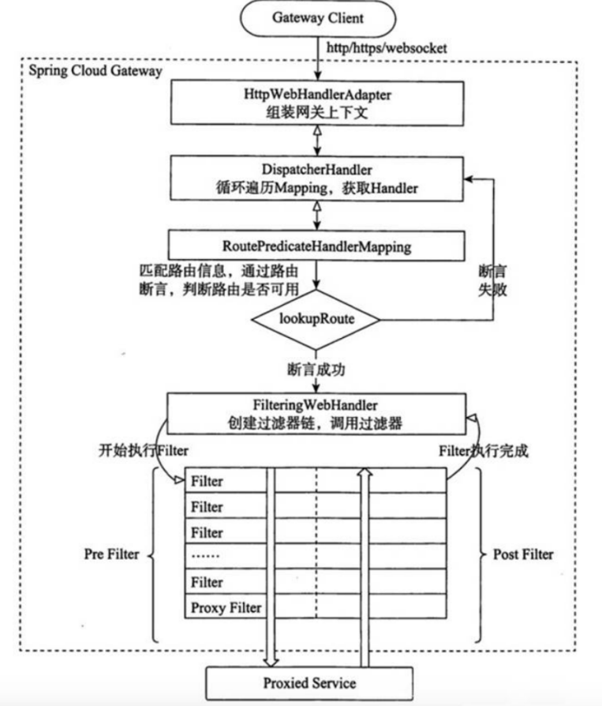

[toc]

# 微服务网关组件SpringCloudGateway笔记2

## Spring Cloud Gateway 的工作原理

执行流程大体如下：
1. 客户端向Gateway网关发送请求
2. 请求首先会被HttpWebHandlerAdapter进行提取组装成网关上下文
3. 然后网关的上下文会传递到DispatcherHandler，它负责将请求分发给RoutePredicateHandlerMapping
4. RoutePredicateHandlerMapping负责路由查找，并根据路由断言判断路由是否可用
5. 如果断言成功，由FilteringWebHandler创建过滤器链并调用
6. 请求会一次经过PreFilter（前过滤）--微服务处理--PostFilter（后过滤）的流程，最终返回响应结果。

当用户发出请求达到 GateWay 之后，会通过一些匹配条件，定位到真正的服务节点，并且在这个转发过程前后，GateWay可以进行一些细粒度的控制，其中 Predicate（断言） 是匹配条件，Filter 是一个拦截器，有了这两点，再加上URL，就可以实现一个具体的路由。核心思想：路由转发+执行过滤器链。
