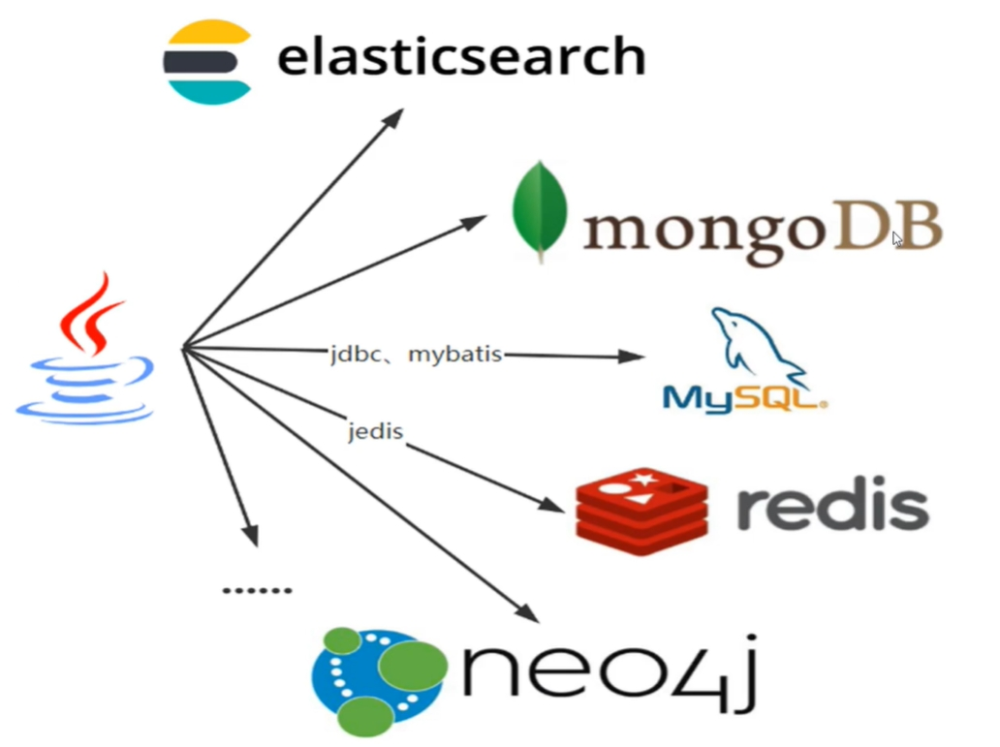
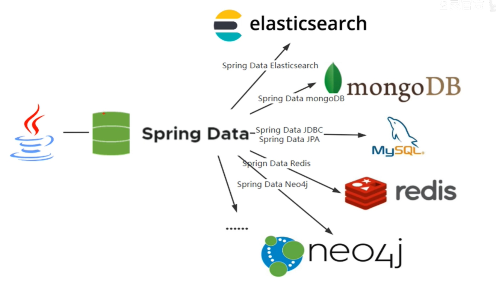
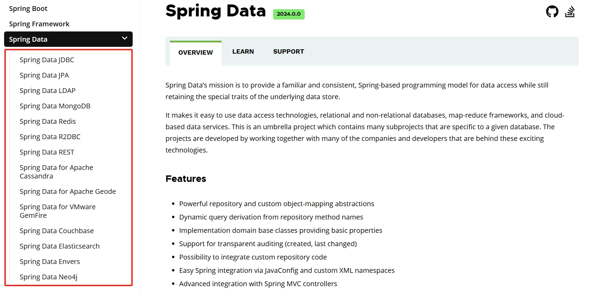

[toc]

# Spring Data 笔记

Spring Data 为各个数据库的访问，提供了一套通用模板。作用是简化和统一了代码对于各个数据库的访问。

## Spring Data 介绍

> 什么是spring data ?

Spring data 是spring公司推出的一个框架。主要是用来与数据库打交道的，即Spring data是一个用于数据持久层的框架。

另外Spring data 框架不光可以与关系型数据库mysql,oracle等交互，也可以与非关系型数据库redis,mongodb等进行交互。

Spring data 框架的一个作用就是统一代码中的数据持久层。从而实现一套数据持久层的代码，可以与不同的数据库进行交互。从而减少代码与多个数据库之间的耦合度和复杂度。

简而言之，Spring data框架统一了数据持久层的代码。

> 为什么要用Spring data ?

某些情况下，如果一个项目中要访问多个数据库，例如 Java 通过 jedis 来访问redis数据库，Java 通过 jdbc或mybatis 访问mysql数据库，java 通过 mogo 来访问 mongdb数据库。

这种情况下，一个项目为了访问多个数据库，从而导入多个中间件工具包来进行数据库的访问。这会导致项目代码中的数据持久层的复杂度大大上升。

因此 Spring Data 框架的作用就是把代码中访问各个数据库的部分，统一起来。

如上图所示，代码可以通过 spring data redis 来访问redis数据库，通过spring data mongodb 来访问mongodb 数据库，通过spring data jpa 来访问mysql数据库等。

最终，通过spring data 框架，将项目中访问各个数据库的代码进行了统一。从而让项目编写一套数据持久层的代码，就可以访问各个数据库。

## Spring Data的各个子模块

Spring Data 是一个伞形框架。即 Spring Data 框架中包含了访问各个数据库的子模块。

下图是spring-data官网。链接是`https://spring.io/projects/spring-data`

Spring Data 主要模块如下
- Spring Data common : 公共模块，提供给其他各个模块使用。
- Spring Data JDBC: 对JDBC进行封装后的子模块，可以让 spring 应用程序轻松配置和使用JDBC的各种功能。 
- Spring Data JPA: 通过该模块，可以让 spring 应用程序轻松配置和访问支持JPA规范的关系型数据库。
- Spring Data MongoDB: 通过该模块，可以让 spring 应用程序轻松配置和访问MongoDB数据库。
- Spring Data Redis: 通过该模块，可以让 spring 应用程序轻松配置和访问Redis数据库。
- .....

## Spring Data 的特性

1. 模板类。

例如spring data redis 提供了 redisTemplate 模板类。这个模板类内置了大量访问和操作redis数据库的方法。我们直接使用模板类，就可以很方便的操作数据库。

2. 提供了类和数据库表的一对一映射。

例如spring data 可以让一个类与数据库中的一个表进行一对一的映射。类的实例化对象就像相当于表中的一行数据。从而做到操作这个类就相当于操作这个表。

3. 提供了Repository功能

Repository是一个访问数据库的抽象接口。该接口有各个实现类，不同的实现类具有不同的访问数据库的功能。

