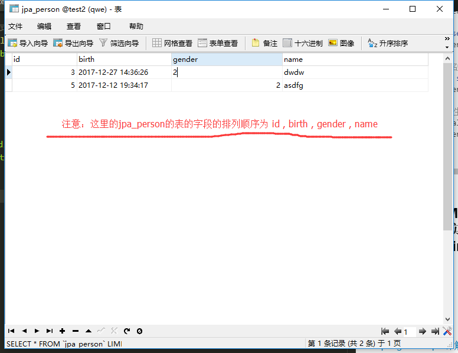

[toc]

# SpringDataJPA基础

**Spring Data JPA，主要用于简化传统连接数据库中，dao层的写法的代码，重复代码太多等问题来提供的解决方案。** 

## 概述：

<h2>JPA( JPA规范 )和Hibernate的关系：</h2>

<font color="red">JPA,又可以叫做JPA规范。</font>其本质上就是一种ORM规范，注意不是ORM框架——因为JPA并未提供ORM实现，它只是制订了一些规范，提供了一些编程的API接口，但具体实现则由用用服务器厂商来提供实现。例如：JBoss应用服务器底层就以Hibernate作为JPA的实现。

<font color="red">既然JPA作为一种规范——也就说JPA规范中提供的只是一些接口，显然接口不能直接拿来使用。虽然应用程序可以面向接口编程，但JPA底层一定需要某种JPA实现，否则JPA依然无法使用。</font>

<font color="blue">JPA规范的出现，其目的是统一各种ORM框架的规范，包括著名的Hibernate、TopLink等。当开发者面向JPA规范的接口，但底层的JPA实现可以任意切换：觉得Hibernate好的，可以选择Hibernate的JPA实现；觉得TopLink好的，可以选择TopLink的JPA实现……这样开发者可以避免为使用Hibernate学习一套ORM框架，为使用TopLink又要再学习一套ORM框架。</font>


<h3>JPA和Hibernate的关系就像JDBC和JDBC驱动的关系。</h3>

> jdbc 是Java 提供的数据库连接接口，该接口没有实现类。其接口的实现类（ jdbc 驱动 ）由每个数据库厂商提供。

<font color="red">JDBC(Java DataBase Connectivity) 是 sun 公司统一不同数据库与Java之间连接的规范。</font>

JDBC访问数据库的主要工作：
1. 得到JDBC驱动程序
2. 使用DriverManager，Connection，Statement，ResulrSet等；


> JPA是规范，该规范提供的只是一些接口，没有实现类。Hibernate除了作为ORM框架之外，它也实现JPA规范

<font color="red">JPA(Java Persistence API),java 持久性API。是sun 公司统一不同的ORM框架中的DAO层,Service层的写法（业务逻辑层次的写法）的规范。</font>

JPA当问数据库主要工作
1. 得到JDBC驱动程序
2. 得到持久性提供者相关类库和配置文件
3. 提供实体类
4. 使用Persistence、EntityManagerFactory和Entity等接口。


<h2>Spring Data JPA与JPA (JPA规范)的关系</h2>

1. **Spring Data JPA 是在JPA规范的基础下提供了Repository层的实现。**
2. 虽然ORM框架都实现了JPA规范，但是在不同ORM框架之间切换是需要编写的代码有一些差异，而<font color="red">通过使用Spring Data Jpa能够方便大家在不同的ORM框架中间进行切换而不要更改代码。并且Spring Data Jpa对Repository层封装的很好，可以省去不少的麻烦。</font>


## 2.第一个Spring Data JPA：

<h2>①：配置spring ，JPA。</h2>

<h3>1.导入jar 包到工程文件的classpath 下：</h3>

1. 加入spring的全部jar包：
路径： spring-framework-4.3.8.RELEASE\libs
2. 添加spring data 的jar包：
spring-data-commons-1.13.7.RELEASE.jar
spring-data-jpa-1.11.8.RELEASE.jar

<h4><font color="red">注意：spring-data-commons 2.0及其以上的的版本是要支持spring framework 5。</font></h4>

3. 添加slf4j日志包（SpringData使用slf4作为日志框架）：
slf4j-api-1.7.25.jar
4. 导入hobernate 需要的jar包：
需要的jar包所在是路径：hibernate-release-5.2.12.Final\lib\required
5. 导入hibernate的 JPA的jar包： hibernate-jpamodelgen-5.2.12.Final.jar
路径： hibernate-release-5.2.12.Final\lib\jpa-metamodel-generator
6. 加入 C3P0数据源 jar包：
路径：hibernate-release-5.2.12.Final\lib\optional\c3p0
7. 加入MySQL驱动包：
 mysql-connector-java-5.1.42-bin.jar

<h3>2.配置spring 与JPA 的配置文件：</h3>

applicationContext.xml

```
<?xml version="1.0" encoding="UTF-8"?>
<beans xmlns="http://www.springframework.org/schema/beans"
	xmlns:p="http://www.springframework.org/schema/p"
	xmlns:jpa="http://www.springframework.org/schema/data/jpa"
	xmlns:mybatis="http://mybatis.org/schema/mybatis-spring"
    xmlns:xsi="http://www.w3.org/2001/XMLSchema-instance" xmlns:mvc="http://www.springframework.org/schema/mvc"
    xmlns:context="http://www.springframework.org/schema/context" xmlns:tx="http://www.springframework.org/schema/tx"
    xsi:schemaLocation="http://www.springframework.org/schema/mvc http://www.springframework.org/schema/mvc/spring-mvc-4.3.xsd
        http://www.springframework.org/schema/beans http://www.springframework.org/schema/beans/spring-beans.xsd
        http://www.springframework.org/schema/tx http://www.springframework.org/schema/tx/spring-tx-4.3.xsd
        http://www.springframework.org/schema/context http://www.springframework.org/schema/context/spring-context-4.3.xsd
        http://mybatis.org/schema/mybatis-spring
        http://mybatis.org/schema/mybatis-spring.xsd
        http://www.springframework.org/schema/data/jpa 
        http://www.springframework.org/schema/data/jpa/spring-jpa.xsd">
       <!-- 配置c3p0数据源 -->
    <bean id="dataSource" class="com.mchange.v2.c3p0.ComboPooledDataSource">
			<property name="driverClass" value="com.mysql.jdbc.Driver"/>
			<property name="jdbcUrl" value="jdbc:mysql://localhost:3306/test2"/>   
			<property name="user" value="root"/>
			<property name="password" value="123456"/>
	</bean>

	<!-- 配置jpa的EntityManagerFactory -->
	<bean id="entityManagerFactory" class="org.springframework.orm.jpa.LocalContainerEntityManagerFactoryBean">
		<!-- 指定数据源 -->
        <property name="dataSource" ref="dataSource"/>
        <!-- 指定Jpa持久化实现厂商类,这里以Hibernate为例 -->
        <property name="jpaVendorAdapter">
        	<bean class="org.springframework.orm.jpa.vendor.HibernateJpaVendorAdapter"/>
        </property>
        <!-- 指定扫描@Entity等注解的实体类包路径 -->
        <property name="packagesToScan" value="com.entity"/>
        <!-- 指定JPA属性；如Hibernate中指定是否显示SQL的是否显示、方言等 -->
        <property name="jpaProperties">
            <props>
                <prop key="hibernate.dialect">org.hibernate.dialect.MySQL5InnoDBDialect</prop>
                <!-- 生成数据表的列的生存策略 -->
                <prop key="hibernate.ejb.naming_strategy">org.hibernate.cfg.ImprovedNamingStrategy</prop>
                <prop key="hibernate.show_sql">true</prop>
                <prop key="hibernate.format_sql">true</prop>
                <prop key="hibernate.hbm2ddl.auto">update</prop>
            </props>
        </property>
	</bean>
       
       
    <!-- 配置 Jpa事务管理器 -->
    <bean id="transactionManager" class="org.springframework.orm.jpa.JpaTransactionManager">
        <property name="entityManagerFactory" ref="entityManagerFactory"/>
    </bean>
       
    <!-- 开启注解事务 -->
    <tx:annotation-driven transaction-manager="transactionManager"/>
    
   	<!--配置springdata , 重要配置：启用扫描并自动创建代理的功能, 要加入jpa的命名空间
   			base-package ：扫描Repository bean的路径，并注入到ioc容器中
   	-->
     <jpa:repositories base-package="com.entity" entity-manager-factory-ref="entityManagerFactory"/>
    
	<!--把实体包的类注入到ioc容器中-->
	<context:component-scan base-package="com.entity"/>
</beans>
```


<h2>②：在spring的配置文件中配置Spring Data</h2>

在spring的配置文件applicationContext.xml中添加代码：

```xml
 	<!--配置springdata , 重要配置：启用扫描并自动创建代理的功能, 要加入Spring data jpa的命名空间
   	base-package ：扫描Repository bean的路径，并注入到ioc容器中
   	-->
     <jpa:repositories base-package="com.entity" entity-manager-factory-ref="entityManagerFactory"/>
```

<h3><font color="red">注意：在配置文件中加上Spring Date JPA 的命名空间。</font></h3>

```
> xmlns:jpa="http://www.springframework.org/schema/data/jpa"
> http://www.springframework.org/schema/data/jpa 
> http://www.springframework.org/schema/data/jpa/spring-jpa.xsd
```

<h2>③：声明持久化接口，该接口必须继承 Repostory</h2>

<h3>1.创建持久化类：</h3>

Person.java
```java
package com.entity;
import java.util.Date;
import javax.persistence.Entity;
import javax.persistence.GeneratedValue;
import javax.persistence.Id;
import javax.persistence.Table;
import org.springframework.stereotype.Repository;

/*
 * @Entity注释指名这是一个实体Bean，
 * @Table注释指定了Entity所要映射带数据库表，其中@Table.name()用来指定映射表的表名。
 * 如果缺省@Table注释，系统默认采用类名作为映射表的表名。
 * 
 * */
@Table(name="jpa_Person")
@Entity
public class Person {
	/*
	 * @Id 标注用于声明一个实体类的属性映射为数据库的主键列。
	 * @GeneratedValue 用于标注主键的生成策略（  这是默认选项  ： @GeneratedValue(strategy=GenerationType.AUTO) ），
	 *
	 * */
	@GeneratedValue
	@Id
	private Integer id;
	private String name;
	private Integer gender;
	private Date birth;
	
	public Person(){}

	@Column(length=20)              //设置该字段的长度为20
	public Integer getId() {
		return id;
	}

	public void setId(Integer id) {
		this.id = id;
	}

	public String getName() {
		return name;
	}

	public void setName(String name) {
		this.name = name;
	}

	....

	@Override
	public String toString() {
		return "Person [id=" + id + ", name=" + name + ", gender=" + gender
				+ ", birth=" + birth + "]";
	}
}

```


<h3>2.创建持久化类的接口，该接口必须继承 Repostory。 <font color="red">注意:类与接口放在一起。</font></h3>

PersonRepsotory.java
```java
package com.entity;
import org.springframework.data.repository.Repository;
import org.springframework.data.repository.RepositoryDefinition;
/*
   Repository<Person, Integer> 中 Person为对应的持久化类，Integer 为对应的数据表主键的java类型
*/
public interface PersonRepsotory extends Repository<Person, Integer>{        
	public Person getById(Integer id); 
}
```

<h2>④：test：</h2>

```java
public class test {
	public static void main(String[] args) {
		ApplicationContext app = new ClassPathXmlApplicationContext("applicationContext.xml");
		PersonRepsotory personRepsotory = app.getBean(PersonRepsotory.class);
		Person person = personRepsotory.getById(1);
		System.out.println(person);
	}
}

```

<h2>控制台打印结果：</h2>

```
Hibernate: 
    select
        person0_.id as id1_0_,
        person0_.birth as birth2_0_,
        person0_.gender as gender3_0_,
        person0_.name as name4_0_ 
    from
        jpa_Person person0_ 
    where
        person0_.id=?

Person [id=1, name=xiaoming, gender=1, birth=2017-12-15 14:01:58.0]
```

<h2>⑤：分析</h2>

```
<jpa:repositories base-package="com.entity" entity-manager-factory-ref="entityManagerFactory"/>
```

1. 当spring初始化时，会扫描 base-package 指定的包目录及其子目录，当扫描到继承 Repository 接口的 接口对象时，会为该接口对象创建代理对象并注入到 IOC 容器中。

```java
public interface PersonRepsotory extends Repository<Person, Integer>{
	public Person getById(Integer id); 
}
```

2. Repository 是一个空接口，不含任何方法。Spring data 也可以是实现Repository的其他子接口，这些子接口定义了一些CRUD 方法或分页查询的方法。

## 3.继承Repository 接口 或 实现@RepositoryDefinition 注解：

### 1.继承Repository 接口:

```java
package com.entity;
import org.springframework.data.repository.Repository;
import org.springframework.data.repository.RepositoryDefinition;
public interface PersonRepsotory extends Repository<Person, Integer>{
	public Person getById(Integer id); 
}
```

1. Repository 是一个空接口(标记)，其中没有任何实现方法。

```java

// Repository 是一个空接口，其中没有任何实现方法
public interface Repository<T, ID extends Serializable> { 
}
```

2. 当我们编写的接口继承 Repository 时。应该在spring的配置文件中编写如下配置。

```xml
<jpa:repositories base-package="com.entity" entity-manager-factory-ref="entityManagerFactory"/>
```

3. <font color="red">当spring 的ioc 容器开启时，IOC 容器会扫描 base-package 指向的路径，若扫描到继承 Repository接口的类，ioc 容器会把它标记为一个Repository bean </font>。
<br/>
4. 被标记为Repository bean，会被注入到ioc 容器中。
<br/>
5. <font color="red">继承 Repository的接口，需要在其中编写 具有一定规范的方法。</font>

### 2.实现@RepositoryDefinition 注解:

```java
		@RepositoryDefinition(domainClass=Person.class,idClass=Integer.class)
		public interface PersonRepsotory{
				public Person getById(Integer id); 
		}
```

### 3.Repsotory的几个子接口:

<h4>①：CrudRepsotory : 继承自Repsotory， 实现了一组CRUD的方法。</h4>
<h4>②：PagingAndSortingRepsotory : 继承自CrudRepsotory， 实现了一组分页排序的方法。</h4>
<h4>③：JpaRepsotory : 继承自PagingAndSortingRepsotory ，实现了一组jpa规范的方法 。</h4>
<h4>④：自定义的 XxxRepsotory : <font color="red">需要继承JpaRepsotory,这样该自定义的接口，就具备通用的数据访问控制层的能力。</font></h4>
<h4>⑤：JpaSpecificationExecutor : 不属于Repsotory 的体系。可实现一组JPA Criteria 查询相关的方法。</h4>

## 4.在XxxRepsotory 接口中编写CRUD方法（CRUD方法编写具有一定的规则）：

### 1.使用关键字的方式定义方法名：

```java
@Table(name="jpa_Person")
@Entity
public class Person {
	@GeneratedValue
	@Id
	private Integer id;
	private String name;
	private Integer gender;
	private Date birth;
	public Person(){}
	//省略get/set/toString() 方法。	
}
```


<font color="red">1. 查询方法必须以 find | read | get 开头。</font>
<font color="red">2. 当涉及到条件查询时，属性的首字母大写，并且若有多个属性，则必须以关键字相连接。</font>

**例子：**
```java
public interface PersonRepsotory extends Repository<Person, Integer>{
	//通过id查询 对象  , where id=？1
	public Person getById(Integer id); 
	//条件查询，以name ，gender 为条件  ~where name=？1 and gender=?2
	public Person getByNameAndGender(String name,Integer gender);
	// where name like %？1  and  gender < ?2
	public List<Person> getByNameEndingWithAndGenderLessThan(String name,Integer gender);
	// where name in (?1,?2,?3,~) 
	public List<Person> getByNameIn(List<String> name);
}
```


### 2.使用 @Query 注解的方式（可以用自定义 JPQL 语句来实现更为复杂的查询）：

JPQL语句： 类似于SQL 语句，只不过SQL语句查询是通过表名，字段名。而JPQL语句查询通过 实体类名与其属性名。

<font color="red">

注意：
1. JPQ语句中，实体名和属性区分大小写，保留关键字不区分大小写。
2. @Param注解的包是在：org.springframework.data.jpa.repository.Query;
3. **向@Query 注解传递参数有两种： ①占位符 ？。 ②命名参数+@Param 注解 。 ③：使用原生sql语句来查询。**

</font>

<br/>

```java
public interface PersonRepsotory extends Repository<Person, Integer>{
	/*
	 * 1.  为@Query 注解传递参数方法一: 使用占位符 ？ ，注意 第一个占位符 是 ?1 ,第二个占位符是 ?2 。
	 * 
	 * 2.  为@Query 注解传递参数方法二: 使用命名参数的方式。 
	 * 
	 * 			@Query(" select p from Person p where id =:id")
				public Person getbY_ID_by_Param(@Param("id") Integer id);
	 * 
	 *    @Param作用是， 指定 Integer id 是 @Query注解中的 id
	 * 
	 * 3. 在@Query 注解中可以编写原生的 SQL 语句来查询结果。jpa_person是表名
	 * 			nativeQuery=true ：表面@Query注解的内容是原生sql语句。
	 * 
	 * 			@Query(value=" select * from jpa_person  where id = ? ",nativeQuery=true)
				public Person getbY_ID_by_Param2(Integer id);
	 * 		
	 * */
	
	@Query("select p from Person p")
	public List<Person> getAll();
	@Query("select p from Person p where id= ?1 ")
	public Person getby_id(Integer id);
	@Query("select p from Person p where name= ?1 and gender=?2 ")
	public Person getbyname_and_gender(String name,Integer gender);
	@Query("select p from Person p where name like %?1%  and  gender < ?2 ")
	public Person getby_name_and_gender(String name,Integer gender);
	//使用命名参数的方式查询
	@Query(" select p from Person p where id =:id")
	public Person getbY_ID_by_Param(@Param("id") Integer id);
	// 使用原生SQL的方式查询
	@Query(value=" select * from jpa_person  where id = ? ",nativeQuery=true)
	public Person getbY_ID_by_Param2(Integer id);
}
```


### 3.使用 @Query,@Modifying,@Transactional注解来实现update, delete（springdata 的jpql语句不支持 insert，但可以用sql的方式编写insert）：




PersonRepsotory.java
```java
public interface PersonRepsotory extends Repository<Person, Integer>{
	/*
	 * 1. 使用 @Modifying 进行修饰. 以通知 SpringData， 这是一个 UPDATE 或 DELETE 操作 。
	 *    由于update ,delete 操作涉及到修改数据库的数据，所以要使用 @Transactional注解，用于开启事务，提交事务。
	 *    
	 * 2. 可以选择在@Query 注解中写入 原生sql的方式来实现 insert ，update， delete 
	 * */
	
	@Transactional
	@Modifying
	@Query("UPDATE Person set name=?1 where id=?2")
	public int  update_name(String name,Integer id);
	
	@Transactional
	@Modifying
	@Query("delete from Person where id=?1")
	public int delete_PersonByid(Integer id);
	
	//使用原生sql语句的方式进行update
	@Transactional
	@Modifying
	@Query(value="update jpa_person set name=? where id=?",nativeQuery=true)
	public int update_name2(String name,Integer id);
	
	//使用原生sql语句的方式进行 delete
	@Transactional
	@Modifying
	@Query(value="delete from jpa_person where id=?",nativeQuery=true)
	public int delete_PersonByid2(Integer id);
	
	//使用原生sql语句的方式进行insert  , 注意 sql语句的参数的顺序 需要与 数据库中表的字段的顺序对应
	@Transactional
	@Modifying
    @Query(value="insert into jpa_person values(?,?,?,?)",nativeQuery=true)
	public int insertPerson(Integer id,Date birth,Integer gender,String name);

	//使用原生sql语句的方式进行insert  ,注意 这里在sql语句中指定了参数的排列顺序
	@Transactional
	@Modifying
	@Query(value="insert into jpa_person(id,name,gender,birth) values(?,?,?,?)",nativeQuery=true)
	public int insertPerson2(Integer id,String name,Integer gender,Date birth);
}

```

test.java:

```java
public class test {
	public static void main(String[] args) {
		ApplicationContext app = new ClassPathXmlApplicationContext("applicationContext.xml");
		PersonRepsotory personRepsotory = app.getBean(PersonRepsotory.class);
		int a=personRepsotory.update_name("xiaoming", 3);
		int b=personRepsotory.update_name2("xiaoho",44);
		int c=personRepsotory.delete_PersonByid(2);
		int d=personRepsotory.delete_PersonByid2(3);
		int e=personRepsotory.insertPerson(22, new Date(), 1, "ssssss");
		int f=personRepsotory.insertPerson2(334,"xx",2,new Date());
	}
	
}

```


<font color="red">

注意:
①：由于update ,delete，insert 操作涉及到修改数据库的数据，所以要使用 @Transactional注解，提交事务。
②：当使用insert 增加数据库时，若sql语句中没有指定参数顺序，那么参数顺序需要与数据库中表的字段的顺序对应。

</font>

>没有指定参数顺序：
> insert into jpa_person values(?,?,?,?)     
指定了参数顺序：
> insert into jpa_person(id,name,gender,birth) values(?,?,?,?)   


### 4.事务操作（update，insert，delete）在springdata jpa的使用（一般把涉及到事务操作的方法，不放在 XxxRepsotory 接口中，单独放在service层中）：

PersonRepsotory.java
```java
public interface PersonRepsotory extends Repository<Person, Integer>{
	@Modifying
	@Query("UPDATE Person set name=?1 where id=?2")
	public int  update_name(String name,Integer id);
	@Modifying
	@Query("delete from Person where id=?1")
	public int delete_PersonByid(Integer id);
}
```


PersonService.java:

```java
....

@Service
public class PersonService{
	/*
	  @Autowired 注解使用的前提条件，在配置文件中：
					<!--把实体包的类注入到ioc容器中-->
					<context:component-scan base-package="com.entity"/>
	*/
	@Autowired
	private PersonRepsotory personrepsotory;

	//设计到事务操作的方法，不放在 XxxRepsotory 接口中，单独放在service层中。

	@Transactional
	public void update(Integer id){
		personrepsotory.update_name(name,id);
	}

	@Transactional
	public void delete(String name,Integer id){
		personrepsotory.delete_PersonByid(id);
	}
}
```

test.java:

```java
public class test {
	public static void main(String[] args) {
		ApplicationContext app = new ClassPathXmlApplicationContext("applicationContext.xml");
		//PersonRepsotory personRepsotory = app.getBean(PersonRepsotory.class);
		PersonService pers=app.getBean(PersonService.class);
		pers.update("xiaoming",3);
		pers.delete(3);
	}
}

```

