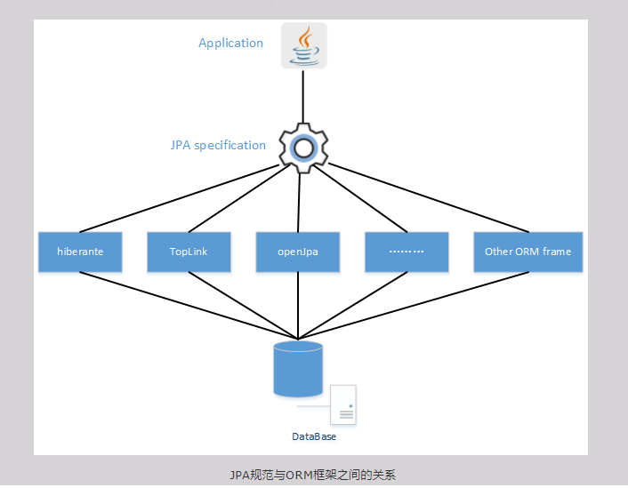
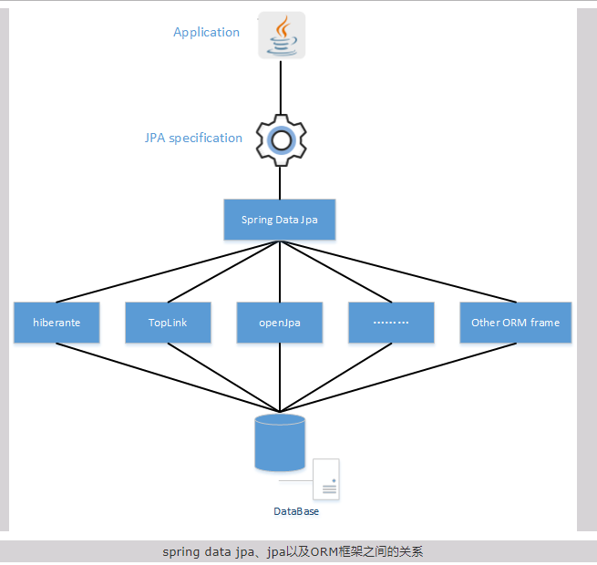
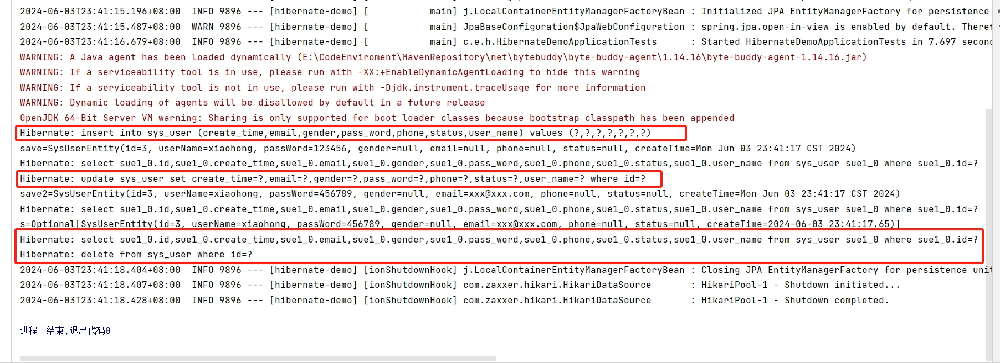
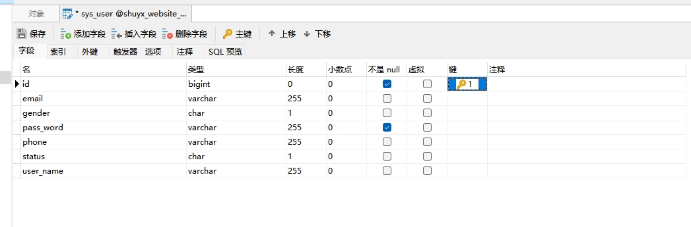
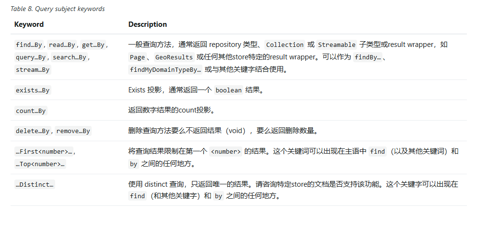
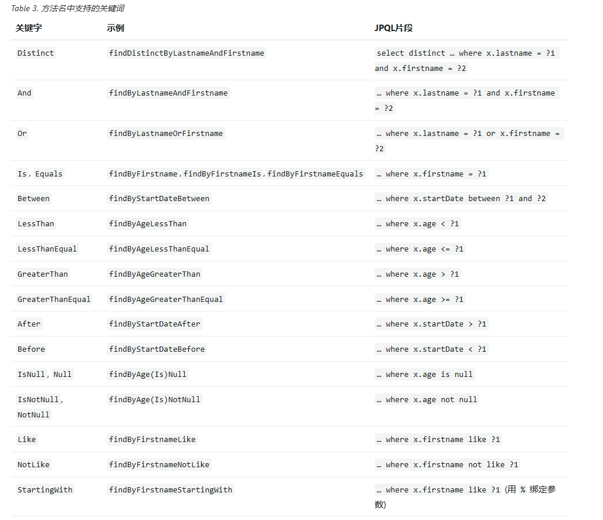
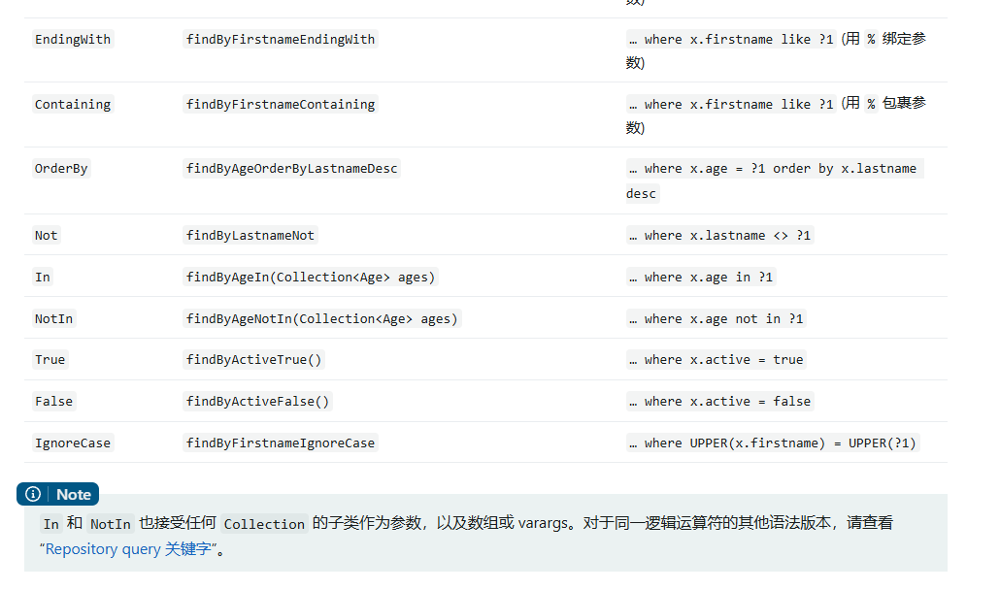

[toc]

# Spring Data JPA笔记

Spring Data JPA 是 Spring Data 框架中的一个子模块。

## Spring Data JPA 介绍

> JDBC的缺点？

由于JDBC是直接通过编写SQL语句来访问数据库的。但是不同的数据库的SQL语句是不通用的。

如果项目中需要更换数据库的话，那么项目中的SQL语句也需要进行更换，部分业务代码也需要更换。

因此使用JDBC会导致项目中的业务代码和数据持久层的耦合度过高。项目无法无损替换数据库。

最终SUN公司推出了JPA规范。用于将业务代码和数据持久层的代码（操作数据库的代码）进行解耦。

> 什么是JPA？

<font color="red">JPA 全称 Java Persistence API（java 持久性 API）。是 sun 公司提出的一个ORM （对象关系映射）规范。</font>

JPA规范的作用：
1. 简化数据持久层的操作，让开发者从JDBC的SQL语句脱离出来，以面向对象的方式来操作数据库。
2. SUN公司希望通过JPA规范，把数据持久层的代码和数据库解耦，从而做到不改变代码就可以无损切换数据库。

> JPA的特性

1. JPA规范提供了对象关系映射。即类和数据库表的互相映射关系。并通过xml文本或注解的方式来维护这种关系。
2. JPA规范提供了一系列API接口。通过这些接口，可以很方便的执行CRUD操作。
3. JPA规范提供了JPQL查询语言。该语言可以使用面向对象的方式来查询数据。

> JPA 和 JDBC 的区别？

相同点：
1. JDBC和JPA 都是一组规范接口。
2. JDBC和JPA 都是由SUN公司推出的。

不同点:
1. JPA是在JDBC的基础上进行封装的。JPA也需要依赖JDBC。
1. JDBC是由各个数据库厂商实现的。JPA是由各个ORM框架来实现的。
2. java 通过JDBC来直接操作数据库。JDBC通过执行SQL语句来直接操作数据库。
3. java 通过 JPA 来直接操作各个ORM框架。JPA用面向对象的方式，通过ORM框架来生成SQL语句，然后进行数据库的操作。

简而言之：
- JDBC -> 执行SQL -> 操作数据库
- JPA -> ORM框架 -> 生成SQL -> 调用JDBC -> 执行SQL -> 操作数据库

> 为什么需要JPA规范？

JPA规范的出现，其目的是统一各种ORM框架，包括著名的Hibernate、TopLink等。

当开发者实现一套JPA规范的代码后，代码底层的ORM框架可以任意切换：觉得Hibernate好的，可以选择Hibernate的JPA规范实现；觉得TopLink好的，可以选择TopLink的JPA规范实现……这样开发者可以避免为使用Hibernate学习一套ORM框架，为使用TopLink又要再学习一套ORM框架。

简而言之就是写一套JPA规范的代码，但是代码底层的ORM框架可以随时更换。

> JPA和Hibernate的关系

注意JPA不是ORM框架，而是一种 ORM 接口规范。

因此JPA规范的具体实现则由各个ORM框架来具体实现。

例如：Hibernate这个ORM框架就实现了JPA规范。

如图所示



> 什么是 Spring Data JPA ？

Spring Data JPA 是 spring公司提供的一套简化JPA开发的框架。如果按照约定好的JPA规范去写数据持久层（Repository层，Dao层）的接口代码。就可以在不写接口实现的情况下，实现对数据库的访问和操作。同时提供很多额外功能，如分页，排序，复杂查询等。

简而言之，Spring Data JPA 可以让我们不用写数据持久层的具体实现代码。极大的提高开发者的工作效率。

推荐使用 Spring Data JPA + ORM框架 (Hibernate) 组合。

> Spring Data JPA 与 JPA 与 Hibernate 的关系

JPA是一种规范，Hibernate是一个实现了JPA规范的ORM框架，Spring Data JPA是对JPA规范的再次封装的框架，并实现了更多可用的功能。

如图所示


## Spring Boot 整合 Spring Data JPA

1. 新建一个spring boot 工程。
2. 在pom文件中导入JPA依赖,数据库驱动依赖

```xml
<!--web 依赖-->
<dependency>
    <groupId>org.springframework.boot</groupId>
    <artifactId>spring-boot-starter-web</artifactId>
</dependency>
<!--JPA依赖-->
<dependency>
	<groupId>org.springframework.boot</groupId>
	<artifactId>spring-boot-starter-data-jpa</artifactId>
</dependency>
<!-- MySQL连接驱动依赖 -->
<dependency>
	<groupId>com.mysql</groupId>
	<artifactId>mysql-connector-j</artifactId>
</dependency>
<!--测试依赖（可选）-->
<dependency>
    <groupId>org.springframework.boot</groupId>
    <artifactId>spring-boot-starter-test</artifactId>
    <scope>test</scope>
</dependency>
```

此处没有添加依赖版本号，主要是因为Spring Boot 内部已经指定了JPA依赖,数据库驱动依赖的版本号了。

另外自 Spring Boot 2.7.8 起，mysql驱动依赖的改为`mysql-connector-j`了。

spring-data-JPA依赖内部默认使用了 Hibernate依赖 作为 JPA规范的实现。因此导入spring-data-JPA依赖，相当于也导入了 Hibernate 依赖。

<font color="red">注意：目前最新的springboot，hibernate等依赖包都是基于JDK17的，因此最好将项目工程中依赖的JDK版本调整到JDK17以上。</font>

3. 在application.properties配置文件中添加配置

```properties
#数据库配置
spring.datasource.driverClassName=com.mysql.cj.jdbc.Driver
spring.datasource.url=jdbc:mysql://127.0.0.1:3306/shuyx_website_db?useUnicode=true&characterEncoding=utf8&serverTimezone=UTC
spring.datasource.username=root
spring.datasource.password=123456

#JPA 配置
spring.jpa.database=MySQL
#是否显示SQL
spring.jpa.show-sql=true
spring.jpa.generate-ddl=true
#表生成策略，默认为none。update会实时更新表。create 每次创建表
spring.jpa.hibernate.ddl-auto=update

```

`spring.jpa.hibernate.ddl-auto`表生成策略配置比较重要。可选值如下。
- create: 不管表是否存在，每次启动都会重新建表（会导致数据丢失）。
- none：每次启动程序，不进行任何操作。
- update：每次启动程序，若表不存在则创建。若表存在，则检查表是否更新（不会删除已经存在的数据）。
- validate：启动的时候验证数据表的结构。验证不通过，启动不成功。


在开发阶段中，通常使用update。在生产阶段建议使用 none，手动维护数据表结构，以避免不小心修改了实体对象后导致表结构被修改，甚至是数据丢失。


4. 创建实体类，并用注解配置实体类 (相当于 Entity 层)

创建entity包，并创建SysUserEntity类

```java
import jakarta.persistence.*;
import java.io.Serializable;

@Entity
@Table(name="sys_user")
public class SysUserEntity implements Serializable {
    private static final long serialVersionUID = 1L;
    @Id
    @Column
    @GeneratedValue(strategy = GenerationType.IDENTITY)     // id字段使用数据库自增
    private Long id;                        //用户id
    @Column("user_name")
    private String userName;                //用户名称
    @Column
    private String passWord;                //密码
    @Column
    private String gender;                 //性别 男‘0’女‘1’
    @Column
    private String email;                   //邮箱
    @Column
    private String phone;                   //电话
    @Column
    private String status;                 //用户状态 正常0 禁用1
	
    // 无参，有参构造函数等
	// get set 等方法....
}

```

- 注意实体类中必须包含无参构造函数。
- @Entity 注解用于表示这个类是一个实体类。
- @Table 注解用于指定了实体在数据库中所对应的表名称。
- @Id 注解用于指定 ID 主键字段
- @GeneratedValue(strategy = GenerationType.IDENTITY) 注解指定了 ID 主键字段值的生成方式，其中 GenerationType.IDENTITY 表示主键由数据库自动生成（自增）。
- @Column 注解表示类的属性和表的字段列的映射关系。如果@Column 注解设置了name属性，则表的列名是name属性的值。


5. 创建Repository 接口 (相当于 Dao 层)

创建repository包，并创建SysUserRepository接口，并且继承JpaRepository接口。

```java
@Repository
public interface SysUserRepository extends JpaRepository<SysUserEntity, Long> {

}
```

- 使用@Repository注解表示这是一个 Repository 接口。
- 通过继承 JpaRepository接口。可以获得已经预定义的各种 CRUD 方法。

6. 配置启动类

之后需要在启动类上定义 `@EnableJpaRepositories`注解和`@EntityScan` 注解，分别指定 repository接口 和实体类所在的包。

```java
@SpringBootApplication
// 实体所在的包
@EntityScan(basePackages = "com.example.hibernatedemo.entity") 
// repository 所在的包
@EnableJpaRepositories(basePackages = "com.example.hibernatedemo.repository")  
public class HibernateDemoApplication {

    public static void main(String[] args) {
        SpringApplication.run(HibernateDemoApplication.class, args);
    }
}
```


7. 编写单元测试
```java
@SpringBootTest
class HibernateDemoApplicationTests {

    @Autowired
    private SysUserRepository sysUserRepository;

    @Test
    void contextLoads() {
        SysUserEntity one = new SysUserEntity();
        one.setUserName("xiaohong");
        one.setPassWord("123456");

        //新增操作
        SysUserEntity save = sysUserRepository.save(one);
        System.out.println("save="+save);

        //通过save方法来实现更新操作
        one.setEmail("xxx@xxx.com");
        one.setPassWord("456789");
        sysUserRepository.save(one);
        System.out.println("save2="+save);

        //查询操作
        Optional<SysUserEntity> s = sysUserRepository.findById(one.getId());
        System.out.println("s="+s);

        //删除操作
        sysUserRepository.delete(one);
    }
}

```

在单元测试类中，创建一个SysUserEntity对象，然后调用SysUserRepository的各个方法，将对象作为方法参数传入其中。

Spring Data JPA 会把Repository接口的各个方法会转换为对应的SQL语句，并让数据库表去执行。

执行日志如图所示。



8. 总结

- 当程序启动后,由于配置中的表生成策略是update,因此Spring Data JPA 或者说 Hibernate 会自动在对应的数据库中创建/更新表。

如图所示，是Hibernate自动创建的表


- Repository接口的各种方法，Spring data jpa 会将其转换为对应的SQL语句，然后传递给数据库执行。因此执行各种CRUD方法，就相当于在执行各种SQL语句。

## Repository 接口中的数据持久化操作

Repository 接口是Spring Data JPA的核心概念。

Repository 接口提供了许多封装好的CRUD方法。Repository 接口的作用是减少数据持久层（dao层）的代码量。

> 常用的Repository 接口

- CrudRepository : 继承自Repository，内部实现了一套CRUD的方法。
- PagingAndSortingRepository : 继承自CrudRepository， 内部实现了一套分页排序的CRUD方法。
- JpaRepository : 继承自PagingAndSortingRepository ，实现了一组jpa规范的方法 。
- 自定义的 XxxRepository : 需要继承JpaRepository,这样该自定义的接口，就具备通用的数据访问控制层的能力。


如下是CrudRepository接口中的CRUD方法

```java
// save方法用来新增和更新。
//当实体对象参数没有主键id值的时候，就是新增。插入数据库后，新增的主键id字段值会与返回值一起返回。
//当实体对象参数有主键id值的时候，就是更新。
<S extends T> S save(S entity);

//传入实体对象集合，批量插入数据到数据库中
<S extends T> Iterable<S> saveAll(Iterable<S> entities);

//通过主键字段查询数据
Optional<T> findById(ID id);

// 通过主键字段查询数据是否存在
boolean existsById(ID id);

//查询所有数据
Iterable<T> findAll();

//传入实体对象集合，批量查询数据
Iterable<T> findAllById(Iterable<ID> ids);

//查询表的数据总量
long count();

//根据主键字段id，删除数据
void deleteById(ID id);

//传入实体对象，删除数据
void delete(T entity);

//传入id集合，批量删除多个数据
void deleteAllById(Iterable<? extends ID> ids);

//传入实体对象集合，批量删除多个数据
void deleteAll(Iterable<? extends T> entities);

//删除所有数据
void deleteAll();
```

### 自定义 Repository 接口

自定义 Repository 接口的使用方法
1. 通常情况下，每当我们创建好一个实体类后，还需要创建对应的一个自定义Repository接口。
2. 自定义 Repository 接口需要继承一个Spring Data JPA提供的Repository 接口。
3. 当继承后，自定义 Repository 接口就会拥有各种封装好的CRUD方法。
4. 然后我们再Service层或者Controller层的代码中，调用自定义 Repository 接口中的方法。
5. Spring Data JPA 会将这些CRUD方法转换为各个SQL，并让数据库去执行。


如下是SysUser实体类对应的SysUserRepository接口。
```java
//自定义SysUserRepository接口，泛型参数为实体类，实体类中的主键ID字段类型
@Repository
public interface SysUserRepository extends CrudRepository<SysUserEntity, Long> {
    //....内置了许多CRUD方法
}
```

然后在Service层或者Controller层的代码中，调用自定义 Repository 接口中的方法。
```java
@Service
public class SysUserServiceImpl {
    //依赖注入SysUserRepository接口
    @Autowired
    private SysUserRepository repository;

    //添加数据
    public void add(SysUserEntity entity){
        repository.save(entity);
    }
    //更新数据
    public void update(SysUserEntity entity){
        repository.save(entity);
    }
    //删除数据
    public void delete(SysUserEntity entity){
        repository.delete(entity);
    }
    //根据id查询数据
    public Object findById(Long id){
        return repository.findById(id);
    }
}
```

注意：自定义的Repository 接口无需编写实现类。调用自定义的Repository 接口中的CRUD方法时，Spring Data JPA 会自动将这些CRUD方法转换为SQL语句，并让数据库去执行。


## 自定义的数据持久化操作

当我们自定义Repository 接口，并且继承官方提供的Repository 接口。可以实现一些CRUD操作，但是这些CRUD方法是有限的，无法满足所有的需求。

因此我们可以通过以下几种方法，自已实现自定义的数据持久化操作。

1. 自定义方法名称。
2. @Query注解（JPQL语句）
3. @Query注解（原生SQL语句）
4. Query by Example （支持动态条件查询）
5. Specifications
6. QueryDSL

### 自定义持久化方法名称

除了官方提供的Repository 接口中的CRUD方法之外。我们还可以在Repository 接口中自定义持久化方法名称。

只要自定义后的方法名称，符合Spring Data的规范的规定。Spring Data JPA就能够将该方法转换为对应的SQL语句。

规则如下：
1. 按照Spring Data的规范的规定，方法名称以find、findBy、read、readBy、get、getBy 等前缀关键字开头。
2. 方法名称中实体类的属性名称就是查询条件，只不过属性名称要以大写字母开头。
3. 拼接多个查询条件的时候，需要用关键字进行连接。

如图 关键字所示：

前缀关键字


中间和后缀关键字




> 示例如下

```java
//自定义SysUserRepository接口
@Repository
public interface SysUserRepository extends CrudRepository<SysUserEntity, Long> {

    // findByUserName 根据userName查询数据
    List<SysUserEntity> findByUserName(String userName);

    // findByUserNameAAndPassword 根据userName和password查询数据
    List<SysUserEntity> findByUserNameAndPassword(String userName,String password);
    
    // findOrderByIdDesc 根据userName查询,然后根据id倒序
    List<SysUserEntity> findByUserNameOrderByIdAsc(String userName);
    
    // 传入Pageable参数 分页全查
    List<SysUserEntity> findAll(Pageable pageable);

    //...........

    //删除操作
    void deleteById(Long id);

}

```

> 自定义持久化方法名称 不适合动态查询

自定义持久化方法名称 这种方式适合简单查询。

如果方法传入的查询条件为null的时候，例如 `dao.findByUserNameAndSex(null, "男");` 会被转换为SQL为 `where (user_name is null) and sex=男 `。

因此方法传入的查询条件为null的时候，数据库中只有该字段是null的记录才符合条件，并不是说忽略这个条件。


### @Query注解（JPQL语句）

JPQL（JavaPersistence Query Language）是一种面向对象的查询语言，它在框架中最终会翻译成为sql进行查询。

JPQL的核心就是@Query注解。我们可以在@Query注解中编写JPQL语句。来实现CRUD操作。

```java
//@Query注解源代码
@Retention(RetentionPolicy.RUNTIME)
@Target({ ElementType.METHOD, ElementType.ANNOTATION_TYPE })
@QueryAnnotation
@Documented
public @interface Query {
	String value() default "";
	String countQuery() default "";
	String countProjection() default "";
	boolean nativeQuery() default false;
	String name() default "";
	String countName() default "";
}
```

@Query注解中有6个参数。
- value参数是需要填入的JPQL/SQL查询语句；
- nativeQuery参数是标识，填写的语句是否为原生SQL语句，默认为false；
- ....

> @Query注解使用示例

在@Query注解中填写的就是JPQL语句，JPQL语句与SQL语句有一些不同，例如其中的表名是实体类的类名。

注意：当Repository接口的方法中含有Pageable参数时，那么SpringData认为该查询是需要分页的。

```java
//自定义SysUserRepository接口
@Repository
public interface SysUserRepository extends CrudRepository<SysUserEntity, Long> {

    //根据参数位置索引进行绑定
    @Query(value =" from SysUserEntity s where s.userName=?1 and s.password=?2 ")
    SysUserEntity find_by_username_password(String userName, String password);

    //根据参数名称进行绑定
    @Query(value = "from SysUserEntity s where s.userName=:name1 and s.email=:email1")
    SysUserEntity find_by_NameAndEmail(@Param("name1") String name, @Param("email1")String email);

    //like模糊查询
    @Query(value = "from SysUserEntity s where s.userName like %:nameLike%")
    List<SysUserEntity> find_by_NameLike(@Param("nameLike") String nameLike);

    //between间隔查询
    @Query(value = "from SysUserEntity s where s.id between :start and :end")
    List<SysUserEntity> find_by_IdBetween(@Param("start")Long start, @Param("end")Long end);

    //传入集合参数查询,in 用法
    @Query(value = "from SysUserEntity s where s.userName in :nameList")
    List<SysUserEntity> find_by_NameIn(@Param("nameList") Collection<String> nameList);

    //传入Bean对象进行查询
    @Query(value = "from SysUserEntity s where s.userName=:#{#usr.userName} and s.password=:#{#usr.password}")
    SysUserEntity find_by_NameAndPassword(@Param("usr")SysUserEntity usr);

    //使用Spring自带分页查询
    @Query("from SysUserEntity s")
    Page<SysUserEntity> findAllPage(Pageable pageable);

    //带有条件的分页查询
    @Query(value = "from SysUserEntity s where s.userName=:name1 ")
    Page<SysUserEntity> findByEmailLike(Pageable pageable, @Param("name1")String name1);
    
    // 修改操作
    // @Modifying注解的作用是告诉spring data jpa 这是一个增删改的操作
    @Modifying
    @Query(value =" UPDATE SysUserEntity su set su.password=?2 WHERE su.userName=?1 ")
    int update_sysuser_password(String userName, String password);

    // 删除操作
    // @Modifying注解的作用是告诉spring data jpa 这是一个增删改的操作
    @Modifying
    @Query(value =" DELETE FROM SysUserEntity su WHERE su.id=?1 ")
    int delete_sysuser(Long id);

}

//测试类
@SpringBootTest
class HibernateDemoApplicationTests {

	@Autowired
	private SysUserRepository sysUserRepository;
	
    //测试增删改操作，需要在方法上添加@Transactional，表示这是一个事务方法才行。
	@Test
	@Transactional
	void test02(){
		int i = sysUserRepository.delete_sysuser(2L);
		System.out.println("i="+i);
	}
}


```

- 主要是通过两种方式，将参数赋值到SQL语句中。一种是通过索引的方式，另一种就是通过指定参数名称的方式。
- 另外@Query注解中通常用于进行查询操作的。对于非查询操作，不建议使用JPQL语句。使用官方Repository接口中提供的CRUD方法即可。
- 另外如果在@Query注解中填写增删改的SQL语句，还需要加上@Modifying和@Transactional注解，告诉Spring Data JPA 这是一个增删改的事务操作。


### @Query注解（原生SQL语句）

有些时候，在特定场合还是需要用到原生SQL查询的。我们也可以在@Query注解编写原生的SQL语句。

只需要把@Query注解中的nativeQuery属性设置为true。此时就可以在@Query注解中填写原生SQL语句。

> 使用示例如下

```java
//自定义SysUserRepository接口
@Repository
public interface SysUserRepository extends CrudRepository<SysUserEntity, Long> {

    //原生SQL语句。select 普通查询
    @Query(value = "select * from sys_user su where su.id=:id",nativeQuery = true)
    SysUserEntity findByIdNative(@Param("id")Long id);

    //原生SQL语句。select 普通查询
    @Query(value = "select * from sys_user", nativeQuery = true)
    List<SysUserEntity> findAllNative();

    //原生SQL语句，关联查询
    @Query(value = "select * from sys_user su left join sys_dept sd on su.department_id = sd.id group by su.id limit :start,:size",nativeQuery = true)
    List<Object[]> find_limit_user_dept(@Param("start")int start, @Param("size")int size);

    //原生SQL语句，count语句
    @Query(value = "select count(u.id) from sys_user u", nativeQuery = true)
    long count_ById();

}
```


### Query by Example（支持动态条件查询）

不建议在Spring Data JPA 中 使用 Query by Example 方法进行复杂的动态条件查询。

太麻烦了,直接弃用。

### Specifications （支持动态条件查询）

太麻烦了,直接弃用。

### QueryDSL （支持动态条件查询）

太麻烦了,直接弃用。


## 多表关联

Spring Data JPA的多表关联。是基于Hibernate实现的。

因此直接看Hibernate的多表关联的具体内容即可。
