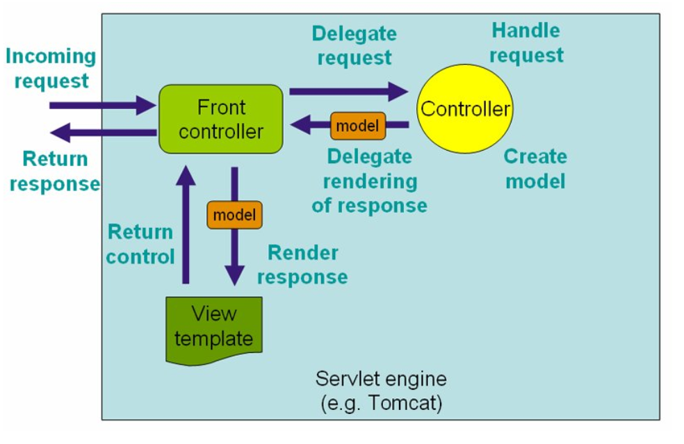

# SpringMVC基础

## 概述：
&emsp;&emsp;Spring MVC属于SpringFrameWork的后续产品，已经融合在Spring Web Flow里面。Spring 框架提供了构建 Web 应用程序的全功能 MVC 模块。使用 Spring 可插入的 MVC 架构，从而在使用Spring进行WEB开发时，可以选择使用Spring的SpringMVC框架或集成其他MVC开发框架，如Struts1，Struts2等。

&emsp;&emsp;Spring的模型-视图-控制器（MVC）框架是围绕一个<font color="red"> DispatcherServlet </font>来设计的，<font color="blue">这个Servlet会把你做出的各个请求按照你事先定好的规则分发给各个处理器，</font>并支持可配置的处理器映射、视图渲染、本地化、时区与主题渲染等，甚至还能支持文件上传。**处理器是你的应用中注解了@Controller和@RequestMapping的类和方法**，Spring为处理器方法提供了极其多样灵活的配置。

##  DispatcherServlet介绍:
&emsp;&emsp;Spring MVC框架，与其他很多web的MVC框架一样：请求驱动；<font color="red">所有设计都围绕着一个中央Servlet来展开，它负责把所有请求分发到控制器；</font>同时提供其他web应用开发所需要的功能。不过Spring的中央处理器，DispatcherServlet，能做的比这更多。**它与Spring IoC容器做到了无缝集成，这意味着，Spring提供的任何特性，在Spring MVC中你都可以使用。**

&emsp;&emsp;下图展示了Spring Web MVC的DispatcherServlet处理请求的工作流。DispatcherServlet应用的其实就是一个“前端控制器”的设计模式（其他很多优秀的web框架也都使用了这个设计模式）。




## 第一个springmvc：


<h4>1. 导入spring的所有jar包。</h4>
<h4>2. 编写web.xml(配置DispatcherServlet和springmvc配置文件的位置)</h4>

```xml
<?xml version="1.0" encoding="UTF-8"?>
<web-app xmlns:xsi="http://www.w3.org/2001/XMLSchema-instance"
	xmlns="http://java.sun.com/xml/ns/javaee"
	xsi:schemaLocation="http://java.sun.com/xml/ns/javaee http://java.sun.com/xml/ns/javaee/web-app_3_0.xsd"
	id="WebApp_ID" version="3.0">

<!-- 配置DispatcherServlet  -->
<servlet>
    <servlet-name>springmvc</servlet-name>
    <servlet-class>org.springframework.web.servlet.DispatcherServlet</servlet-class>
      
    <!-- 设置 springmvc 配置文件的位置 --> 
    <init-param>
        <param-name>contextConfigLocation</param-name>
        <param-value>classpath:springmvc_config.xml</param-value>
    </init-param>
    
    <load-on-startup>1</load-on-startup>
</servlet>

<!-- '/' 表示 springmvc 这个servlet 拦截所有请求  -->
<servlet-mapping>
    <servlet-name>springmvc</servlet-name>
    <url-pattern>/</url-pattern>
</servlet-mapping>
  
</web-app>

```

<h4>3. 编写springmvc配置文件(springmvc_config.xml)</h4>

```xml
<?xml version="1.0" encoding="UTF-8"?>  
<beans  
    xmlns="http://www.springframework.org/schema/beans"  
    xmlns:xsi="http://www.w3.org/2001/XMLSchema-instance"  
    xmlns:tx="http://www.springframework.org/schema/tx"  
    xmlns:context="http://www.springframework.org/schema/context"    
    xmlns:mvc="http://www.springframework.org/schema/mvc"    
    xsi:schemaLocation="http://www.springframework.org/schema/beans   
    http://www.springframework.org/schema/beans/spring-beans-3.2.xsd   
    http://www.springframework.org/schema/tx   
    http://www.springframework.org/schema/tx/spring-tx-3.2.xsd  
    http://www.springframework.org/schema/context  
    http://www.springframework.org/schema/context/spring-context-3.2.xsd  
    http://www.springframework.org/schema/mvc  
    http://www.springframework.org/schema/mvc/spring-mvc-3.2.xsd">  
    <!-- 自动扫描的包名 ， 若扫描到spring注解的类，这些类被注册为bean -->  
    <context:component-scan base-package="com.Controller"/>  
    <!-- 默认的注解映射的支持，自动注册DefaultAnnotationHandlerMapping和AnnotationMethodHandlerAdapter 
       	 该配置的的作用： Spring MVC为@Controller分发请求所必需的。 并且提供了数据绑定支持，读写JSON的支持（默认Jackson）等功能。.
    -->  
    <mvc:annotation-driven />  
    <!-- 视图解析器， 把控制器的方法 返回的值通过   prefix + 返回值  + suffix 的形式，得到响应的jsp页面 -->  
    <bean class="org.springframework.web.servlet.view.InternalResourceViewResolver">  
        <property name="prefix" value="/WEB-INF/views/"/>  
        <property name="suffix" value=".jsp"/>  
    </bean>  
</beans>   
```


<h4>4. 编写控制器 HelloController（DispatcherServlet接受请求后执行的操作）</h4>

```java
package com.Controller;

import org.springframework.stereotype.Controller;
import org.springframework.web.bind.annotation.RequestMapping;
import org.springframework.web.servlet.ModelAndView;

@Controller    //指示该类是一个控制器
public class HelloController {
	
   	/** 1. 使用@RequestMapping注解来映射url请求
   	 *  2. 方法的返回值会通过视图解析器的加工，得到某个jsp页面的位置，然后做具体的转发操作：
   	 *  		prefix+ 返回值 + suffix  :  /WEB-INF/views/hello.jsp
   	 * 	
   	 *  3. ModelAndView对象，该对象包含了返回的视图名，模型的名称，模型对象的名称
   	 * @return
   	 */
   	@RequestMapping(value="/sayhello")
	public ModelAndView sayhello(ModelAndView model) {
   		System.out.println("say hello ");
   		model.setViewName("hello");                   //该值会被视图解析器解析
   		model.addObject("message", "Hello world");    //添加模型数据，可以在返回的视图中取出模型数据
		return model;
	}
}

```

<h4>5. 编写jsp页面（一个发送请求的index.jsp，一个控制器返回的jsp页面hello.jsp）</h4>

```html
<!--index.jsp-->
<%@ page language="java" contentType="text/html; charset=UTF-8"
    pageEncoding="UTF-8"%>
<!DOCTYPE html PUBLIC "-//W3C//DTD HTML 4.01 Transitional//EN" "http://www.w3.org/TR/html4/loose.dtd">
<html>
<head>
<meta http-equiv="Content-Type" content="text/html; charset=UTF-8">
<title>Insert title here</title>
</head>
<body>
<a href="sayhello">发送sayhello请求给DispatcherServlet</a>

</body>
</html>

=================================

<!--hello.jsp-->
<%@ page language="java" contentType="text/html; charset=UTF-8"
    pageEncoding="UTF-8"%>
<!DOCTYPE html PUBLIC "-//W3C//DTD HTML 4.01 Transitional//EN" "http://www.w3.org/TR/html4/loose.dtd">
<html>
<head>
<meta http-equiv="Content-Type" content="text/html; charset=UTF-8">
<title>Insert title here</title>
</head>
<body>
<!-- 通过EL表达式，取出模型数据 -->
<h2>${requestScope.message }</h2>
this is hello.jsp

</body>
</html>

```


<h4>6.分析：</h4>
<font color="red">

1. 当用户点击index.jsp的a标签, 该请求被DispatcherServlet拦截。
2. DispatcherServlet 会根据该请求的名称，执行对应的控制器方法。
3. 控制器方法会处理业务逻辑代码。完成后，会返回字符串，该字符串会被视图解析器，解析成响应的jsp页面的位置。
4. 打开解析的jsp页面。

</font>

## 常用注解&请求处理方法的参数类型：

### 1.@Controller注解：

&emsp;&emsp;@Controller注解用于标记一个类，被它标记的类就是一个控制器类。
&emsp;&emsp;控制器类负责处理由DispatcherServlet 分发的请求，它把用户请求的数据经过业务处理层处理之后封装成一个Model ，然后再把该Model 返回给对应的View 进行展示。

<font color="red">
springmvc的DispatcherServlet如何找到对应的控制器类 ？ 当spring的ioc容器启动时。通过扫描到@Controller注解，来把该控制器类注入到ioc容器中。
</font>
```xml
 <!-- 自动扫描的包名 ， 若扫描到spring注解的类，这些类被注册为bean -->  
    <context:component-scan base-package="com.Controller"/>  
```

### 2.@RequestMapping注解(为控制器类指定可以处理那些URL请求)：

**DispatcherServlet 拦截请求后，springmvc会根据@RequestMapping 提供的映射信息来确定对应的处理方法。**

1. @RequestMapping注解可以标记在类上和方法上：
- 标记在类上： 相当与类级别的处理器。
- 标记在方法上： 相当与方法级别的处理器。
- 类上的URL映射可以与方法上的URL映射进行拼接。

```java
@Controller
@RequestMapping(value="first")
public class firstController {
	
	@RequestMapping(value="login")
	public String login() {
		System.out.println("this is login");
		return "hello";
	}
}

```

```html
<a href="first/login">sss</a>
```


2. @RequestMapping注解有六个属性(对应Http请求报文)：
```java
/*@RequestMapping 有六种属性
	 * 
	 * 1. value(请求的URL)  : 指定URL请求的实际地址。

	 * 2. method(请求的方法) : 指示该方法仅仅处理那些请求post/get 若不写，则可处理任意请求。

	 * 3. consumes : 表示方法仅处理  application/json 类型的请求。

	 * 4. produces : 指明返回的内容类型

	 * 5. params（请求参数）   : 指定request中必须包含某些参数值时，才让该方法处理(这里是，该方法仅仅处理请求参数名为myparam，值为myvalue的请求)

	 * 6. headers（请求头）  : 指定request中必须包含某些指定的header值，才能让该方法处理请求。(这里是仅仅处理 header中包含了指定Referer请求头，对应值为http://www.abc.org/的请求 )

	 * */
	@RequestMapping(value="/sayhello", method=RequestMethod.GET,consumes="application/json",produces="application/json")
	public ModelAndView test(ModelAndView model) {
		return model;
	}
	
	@RequestMapping(value="/sayhello2",params="myparam=myvalue",headers="Referer=http://www.abc.org/")
	public ModelAndView test1(ModelAndView model) {
   	    
		return model;
	}
```

### 3.@PathVariable注解：
<font color="red">此注解可以很方便的获取请求URL中的动态参数</font>
```html
<a href="test_PathVariable/1">测试@PathVariable注解</a>
```

```java
     /*
	 * 通过@PathVariable("id") 可以把URL请求中的占位符参数绑定 到方法的形参中
	 * 
	 * index.jsp 的URL请求：  test_PathVariable/1
	 */
	@RequestMapping(value = "/test_PathVariable/{id}")
	public String test3(@PathVariable(value = "id") Integer id) {
		System.out.println("id  "+id);          //此处的id=1 
		return "hello";
	}
```


### 4.@RequestParam注解

&nbsp;&nbsp;@RequestParam注解会把Http请求的参数信息绑定到响应的方法的形参中。

1. value属性：请求参数的属性名。
2. required : 请求参数中是否必须存在，默认为 true。
<font color="red">注意：@RequestParam注解绑定的请求参数信息必须在url中存在。若不存在时，报出异常。</font>

```html
<a href="RequestParam?username=xiaoming&age=12">测试@RequestParam注解</a>
```

```java
    /** @RequestParam 会把请求的url中的参数信息，绑定到处理方法的形参上。
	 *  注意： 若url的参数信息没有 @RequestParam 标识的值，程序会报异常。
	 *  
	 *  required=false :表示该属性不是必须的，即使url的参数信息没有username，程序也不会报异常。
	 *  defaultValue="aa" : 表示该请求参数的默认值。
	 *  
	 * @param model
	 * @param username
	 * @param age
	 * @return
	 */
	@RequestMapping(value="/RequestParam")
	public ModelAndView testRequestParam(ModelAndView model,@RequestParam(value="username",required=false,defaultValue="aa")
                                        String username,@RequestParam(value="age") Integer age) {
		System.out.println("username :"+username+"  age: "+age);      
   		model.setViewName("hello");                    //该值会被视图解析器解析
		return model;
	}
```


### 5.@RequestHeader注解：
&nbsp;&nbsp;可以把URL请求header部分的值绑定到方法的参数上。 

```html
<a href="RequestHeader">测试@RequestHeader注解</a>
```

```java
/**@RequestHeader注解：
	 *  绑定请求信息的请求头部分，到方法的参数上。
	 	这里会把请求头的 Accept-Language 的值 赋到al参数上。
	 * @param model
	 * @param al
	 * @return
	 */
	@RequestMapping(value="/RequestHeader")
	public ModelAndView testRequestHeader(ModelAndView model,@RequestHeader(value="Accept-Language") String al) {
		System.out.println("Accept-Language : "+al);      
   		model.setViewName("hello");                   
		return model;
	}
   	
```


### 6.@CookieValue注解：
<font color="red">用于把请求的cookie数据绑定到方法参数上</font>

```html
<a href="CookieValue">测试@CookieValue注解</a>
```

```java
/**
	 * 用法同@RequestHeader注解相同
	 这里把cookie中的JSESSIONID值 赋值给 参数
	 */
	@RequestMapping(value="/CookieValue")
	public ModelAndView testCookieValue(ModelAndView model,@CookieValue(value="JSESSIONID") String cookievalue) {
		System.out.println("CookieValue : "+cookievalue);      
   		model.setViewName("hello");                     //跳转到hello.jsp页面
		return model;
	}
```

### 7.@SessionAttributes注解：
该注解可以指定Model中的某些属性加入到HttpSession对象中。<font color="red">@SessionAttributes注解只能声明在类上，不能声明在方法上</font>

index.jsp:
```html
<form action="SessionAttributes" method="post">
username:<input type="text" name="username"/>
password:<input type="text" name="password"/>
<input type="submit" value="submit"/>
</form>
```

HelloController.java:
```java
@SessionAttributes(value= {"username","password"})        //把model中的属性名为 username , password 的属性放入HttpSession对象中。
@Controller    //指示该类是一个控制器
public class HelloController {

	@RequestMapping(value="/SessionAttributes")
	public ModelAndView testSessionAttributes(ModelAndView model,HttpServletRequest request) {
		System.out.println("username  :"+request.getParameter("username")+" password:"+request.getParameter("password"));       //获取表单传过来的username
		model.addObject("username", request.getParameter("username"));       //添加模型数据到ModelAndView中
		model.addObject("password", request.getParameter("password"));
		model.setViewName("hello");                                          //设置响应的视图名称
		return model;
	}

}
```

hello.jsp:
```html
<h2> request username: ${requestScope.username }</h2>
<h2> session username: ${sessionScope.username }</h2>
<h2> request password: ${requestScope.password }</h2>
<h2> session password: ${sessionScope.password }</h2>

```


### 8.@ModelAttribute注解：

#### 1.用法一：@ModelAttribute注解有value属性值

index.jsp:
```html

<form action="ModelAttribute_1" method="post">
username:<input type="text" name="username"/>
<input type="submit" value="submit"/>
</form>
```

```java
/*
	 * 有@ModelAttribute标记的方法，会在所有的请求处理方法之前被调用一次。
	 * 
	 * 1. 在这次例子中，ModelAttribute_method方法会优先testModelAttribute方法调用。
	 * 2. 它会把index.jsp 页面的请求参数username 赋值给方法的形参的un.
	 * 3. 并在 model中 设置一个  属性名为username ，其属性值为 方法的返回值 un
	 * */
	@ModelAttribute(value="username")      //这里的 value="username" 表示在model设置一个属性。属性的名称为username，而属性的值就是该方法的返回值
	public String ModelAttribute_method(@RequestParam(value="username") String un) {
		System.out.println("un :"+un);
		if(un!=null) {
			un=un+"  by ModelAttribute_method";     //这里对传过来的username请求参数进行加工
		}
		return un;               
	}
	
	
	@RequestMapping(value="/ModelAttribute_2")
	public String testModelAttribute() {
		return "hello";
	}
```

hello.jsp:
```html
<!-- 通过EL表达式，取出model中的数据 -->
<h2> request username: ${requestScope.username }</h2>
```


#### 2.用法二：@ModelAttribute注解没有value属性值

index.jsp:
```html
<form action="ModelAttribute_2" method="post">
username:<input type="text" name="username"/>
password:<input type="text" name="password"/>
<input type="submit" value="submit"/>
</form>

```

```java

	/*
	 * 有@ModelAttribute标记的方法，会在所有的请求处理方法之前被调用一次。
	 * 
	 * 在这次例子中，ModelAttribute_method方法会优先testModelAttribute方法调用。
	 * */
	@ModelAttribute   
	public void ModelAttribute_method(Model model,@RequestParam(value="username") String un,
			@RequestParam(value="password") String pd) {
		model.addAttribute("username", un);     //在model中添加一个属性。  属性名为username ，其属性值un
		model.addAttribute("password",pd);         
	}
	
	@RequestMapping(value="/ModelAttribute_2")
	public String testModelAttribute() {
		return "hello";
	}
```

```html
<!-- 通过EL表达式，取出模型数据 -->
<h2> request username: ${requestScope.username }</h2>
<h2> request password: ${requestScope.password }</h2>
```

**运行结果：**
> request username: syx
> request password: 1231


#### 3.用法三：@ModelAttribute 与 @RequestMapping同时注释一个方法

```html
<a href="hello?username">@ModelAttribute注解用法三</a>
```

```java
/**
	 * 注意：发送请求时，要携带请求参数 username
	 *  
	 * @return
	 */ 
	@ModelAttribute(value="username")       //在model中设置一个属性。名为 username ， 值为方法的返回值 "xiaoming"
	@RequestMapping(value="/hello")        //这里的 /hello  是视图名称， 就是@RequestMapping 的value值
	public String testModelAttribute() {
		return "xiaoming";                  //方法的返回值不是视图的名称，而是属性值
	}
	
```

```html
<!-- 通过EL表达式，取出model中的数据 -->
<h2> request username: ${requestScope.username }</h2>
```

#### 4.用法四：@ModelAttribute标记一个方法的参数

```html
<form action="ModelAttribute_4" method="post">
id:<input type="text" name="id"/>
name:<input type="text" name="name"/>
birth:<input type="date" name="birth"/>
<input type="submit" value="submit"/>
</form>

```

```java
	/*
	 * 在model设置一个属性，属性名为 orders ，值为方法返回值ord ，就是表单传过来的值
	 * */
	@ModelAttribute(value = "orders")
	public Orders ModelAttribute_method(Orders ord_value) {
		return ord_value;
	}

	/*
	 * @ModelAttribute(value="orders") Orders ord    
	 *  
	 *  表示参数ord 的值就是 model中 属性为orders的值 ord_value
	 * */
	@RequestMapping(value = "/ModelAttribute_4") 
	public String testModelAttribute(@ModelAttribute(value="orders") Orders ord) {
		ord.setName("这是被修改的orders.name");     //把参数的name属性值，修改
		return "hello";                         //视图名称
	}

```

```html
<h2> id: ${orders.id }</h2>
<h2> name: ${orders.name }</h2>
<h2> birth: ${orders.birth }</h2>
```


### 9.HttpMessageCoverter 接口(★★★)：

<font color="red">
这个接口，它负责将请求信息转换为一个对象或bean,并将bean或对象绑定到请求处理方法的参数中，或者绑定到请求处理方法的返回值（响应信息中）。
</font>

**DispatcherServlet 装配了默认的RequestMappingHandlerAdapter类 作为HttpMessageCoverter接口的实现类。**

> RequestMappingHandlerAdapter
> <font color="blue">该类作用是把请求信息转化为对象，或者把对象转化为响应信息。</font>

当使用 `<mvc:annotation-driven />`标签配置springmvc时，默认配置了RequestMappingHandlerAdapter

<h4>处理流程：</h4>


### 10.@RequestBody注解(主要用于处理json格式数据，并转换为对应的数据类型)：

<font color="red">该注解用于读取Request请求的body部分数据,使用系统默认配置的HttpMessageConverter接口的实现类，进行解析成对象或者bean,并绑定到controller中方法的参数上。</font>

**注意：springmvc 默认使用 Jackson来转换 json格式的数据，所以在使用前，要下载 jackson的jar包**

jackson的jar包：
> jackson-annotations-2.9.0.jar
> jackson-core-2.9.0.jar
> jackson-databind-2.9.0.jar

demo:

<font color="red">注意，这里使用js文件，需要在web.xml中设置对js资源文件不要拦截 </font>

index.jsp:
```html

<script src="jq/jquery.js"></script>  <!-- 注意，这里使用js文件，需要在web.xml中对js资源文件不要拦截 -->
<title>Insert title here</title>
</head>
<script>

	function select(){
		$.ajax({
			type:"post",
			//dataType:"json",                                 //服务器返回的数据格式
			contentType:'application/json;charset=UTF-8',    //contentType :上传给服务器的数据格式
			data:JSON.stringify({"id":"1","name":"xiaoming","birth":"2012-2-2"}),   //把发送的数据变成json格式
			url:"test_RequestBody",                          //${pageContext.request.contextPath} 表示当前项目的根路径
			success:function(result){                     //当请求处理方法添加了@ResponseBody注解后，
				alert("success "+result);                  // result就是该方法的返回值。
			},
			error:function(){
				alert("shibai ");
			}
		});
	}
</script>
<body>
<button type="button" onclick="select()">按钮1</button>
</body>

```

web.xml:
```xml
<!-- 放行页面的js,html,jpg,css等静态资源 -->
  <servlet-mapping>
    <servlet-name>default</servlet-name>
    <url-pattern>*.css</url-pattern>
  </servlet-mapping>
  <servlet-mapping>
    <servlet-name>default</servlet-name>
    <url-pattern>*.js</url-pattern>
  </servlet-mapping>
  <servlet-mapping>
    <servlet-name>default</servlet-name>
    <url-pattern>*.jpg</url-pattern>
  </servlet-mapping>
  <servlet-mapping>
    <servlet-name>default</servlet-name>
    <url-pattern>*.html</url-pattern>
  </servlet-mapping> 
```

firstController.java:
```java
@Controller
public class firstController {
	
	/**
	 * 1. @RequestBody 用于处理 由前台页面提交的json或xml格式的数据
	 *    （或用于读取Request请求的body部分数据），并绑定到请求处理方法的参数上。
	 * 
	 * 2. @ResponseBody 把请求处理方法的返回值，
	 *    变成响应数据（写进Response对象的body数据区）而不是页面的名称。
	 * 
	 * 3. 当该方法返回String类型时，若没有添加@ResponseBody注解，
	 *    则该String类型的返回值会被视图解析器解析。变成某个视图页面
	 *    
	 * 4. 若添加@ResponseBody注解，则String类型的返回值，会直接返回给ajax的success回调函数
	 * 
	 * @param ord
	 * @return
	 */
	@ResponseBody
	@RequestMapping(value="test_RequestBody")
	public String test_RequestBody(@RequestBody Orders ord) {
		System.out.println("ord : "+ord);
		return "hello";         
	}
}
```


### 11.自定义HttpMessageCoverter接受JSON格式的数据(这里也需要在web.xml中放行js文件)：
<font color="red">由于springmvc的HttpMessageCoverter默认使用 jackson 处理json数据，但有些时候可以使用其他开源jar包来处理json数据，例如：fastjson。</font>

在springmvc_config.xml 文件中进行如下配置：
<font color="red">让springmvc使用fastjson作为http消息转换器的实现类。</font>

```xml
 <!-- 设置配置方案 -->
    <mvc:annotation-driven>
			<!-- 不使用默认的消息转换器 -->
			<mvc:message-converters register-defaults="false">
				<!-- 配置Spring的转换器 -->
		      	 	<bean class="org.springframework.http.converter.StringHttpMessageConverter"/>
			    	<bean class="org.springframework.http.converter.xml.XmlAwareFormHttpMessageConverter"/>
		    		<bean class="org.springframework.http.converter.ByteArrayHttpMessageConverter"/>
			    	<bean class="org.springframework.http.converter.BufferedImageHttpMessageConverter"/>
		    		<!-- 配置fastjson中实现HttpMessageConverter接口的转换器 ,
		    		      FastJsonHttpMessageConverter是实现HttpMessageConverter接口的实现类 -->
			    	<bean id="fastJsonHttpMessageConverter" class="com.alibaba.fastjson.support.spring.FastJsonHttpMessageConverter">
		    			<!-- 加入支持的媒体类型，返回contentType -->
		    			<property name="supportedMediaTypes">
		    				<list>
		    				<!-- 注意：这里的顺序不能反 -->
		    					<value>text/html;charset=UTF-8</value>
			    				<value>application/json;charset=UTF-8</value>
		    				</list>
		    			</property>
			    	</bean>
			</mvc:message-converters>
    </mvc:annotation-driven>
```

```html
<script>
	function select(){
		$.ajax({
			type:"post",
			dataType:"json",                                 //服务器返回的数据格式
			contentType:'application/json;charset=UTF-8',    //contentType :上传给服务器的数据格式
			data:JSON.stringify({"id":"1","name":"xiaoming","birth":"2012-2-2"}),   //把发送的数据变成json格式
			url:"test_fastjson_RequestBody",                 //${pageContext.request.contextPath} 表示当前项目的根路径
			success:function(result){                        
				alert("success : "+JSON.stringify(result));     //result 是通过@ResponseBody注解 把请求处理方法的返回值写入到 response信息中
			},												 	//，被ajax的success的回调函数接受。
			error:function(){									//JSON.stringify(result) ： 把对象转换为json字符串
				alert("shibai ");
			}
		});
	}
</script>
<body>
<button type="button" onclick="select()">按钮1</button>
</body>
```


```java
@Controller
public class SecondController {
		
	    /** @ResponseBody 注解：
	     * 	 用于把Controller的方法返回值，通过合适的http消息转换器（HttpMessageCoverter）,
	     * 	转换为指定的格式，并写入到response响应的body数据区中。
	     *  通常当返回的数据不是html页面，而是其他格式（json.xml）的数据时，使用它。	
	     * 	
	     * @param ord
	     * @return
	     */
	    @ResponseBody
		@RequestMapping("test_fastjson_RequestBody")
		public Orders test_fastjson_RequestBody(@RequestBody Orders ord) {
			System.out.println("orders :"+ord);
			return ord;
		}
}
```


### 12.springmvc可以使用bean对象绑定方法形参：
&nbsp;&nbsp;SpringMVC会按请求参数名与bean对象的属性名进行自动匹配,相当与自动填充该bean对象。

```java
package com.entity;

import java.util.Date;

public class Orders {
	private Integer id;
	private String name;
	private String birth;
	
	public Orders() {}
	
    //省略get/set/toString方法
}

```

```html
<form action="POJO" method="post">
id:<input type="text" name="id"/>
name:<input type="text" name="name"/>
birth:<input type="Date" name="birth"/>
<input type="submit" value="submit"/>
</form>

```

```java
	/**
	 * SpringMVC会把请求参数名与bean对象的属性名进行自动匹配,若都匹配的上，会自动填充该bean对象。
	 * @param model
	 * @param ord
	 * @return
	 */
	@RequestMapping(value="/POJO")
	public ModelAndView testPOJO(ModelAndView model,Orders ord) {
		System.out.println("Orders : "+ord);      
   		model.setViewName("hello");                     //跳转到hello.jsp页面
		return model;
	}

```


### 13.请求处理方法可以支持多种数据类型的参数：

&nbsp;&nbsp;**每个请求方法可以有多个不同类型的参数**

```html
<a href="ServletAPI">测试请求处理方法可以支持多种数据类型的参数</a>
```

```java
	/**
	 * 请求处理方法可以支持多种数据类型的参数：
	 * HttpServletRequest
	 * HttpServletResponse
	 * HttpSession
	 * Reader
	 * Writer
	 * Map
	 * Model
	 * ModelAndView
	 * .....
	 * ....
	 */
	@RequestMapping(value="/ServletAPI")
	public ModelAndView testServletAPI(ModelAndView model,HttpServletRequest request,HttpServletResponse response) {
		System.out.println("HttpServletRequest : "+request+"   HttpServletResponse:"+response);      
   		model.setViewName("hello");     
		return model;
	}
	
```


### 14.ModelAndView(模型和视图数据类型)& Model & ModelMap：
<font color="red">在springmvc框架中，Controller控制器执行业务逻辑，用于产生模型数据(Model),而视图（View）用于渲染模型数据。</font>

index.jsp:
```html
<form action="test_Model" method="post">
id:<input type="text" name="id"/>
name:<input type="text" name="name"/>
birth:<input type="date" name="birth"/>
<input type="submit" value="submit"/>
</form>
```

HelloController.java:
```java

这里有两种写法：①：Model或者ModelMap  ②：ModelAndView

①：--------------------------
	@ModelAttribute                          //该注解修饰的方法会先于请求处理方法调用。
	public void before(Model m,Orders ord) {
		System.out.println("before  "+ord);
		m.addAttribute("orde",ord);        //把从表单传来的值，放到model中 ，属性名为"orde" ,值为ord
		
	}
	
	@RequestMapping(value="test_Model")
	public String test_Model(Model m) {
		Orders orders = (Orders) m.asMap().get("orde");   //取出model中的名为orde属性
		System.out.println("test_Model  "+orders);
		return "hello";
	}


②：--------------------------	
   	@ModelAttribute                          //该注解修饰的方法会先于请求处理方法调用。
	public void before(ModelAndView mv,Orders ord) {
		System.out.println("before  "+ord);
		mv.addObject("orde", ord);       //把从表单传来的值，放到ModelAndView中 ，属性名为"orde" ,值为ord
	}
	
	@RequestMapping(value="test_Model")
	public ModelAndView test_Model(ModelAndView mv) {
		Orders orders = (Orders) mv.getModel().get("orde");    //取出ModelAndView中model中的名为orde属性
		System.out.println("test_Model  "+orders);
		mv.setViewName("hello");                                          //设置响应的视图名称
		return mv;
	}


```

hello.jsp:
```html
<!--orde 是 model/ModelAndView 中的属性名-->
<h2> id: ${orde.id }</h2>
<h2> name: ${orde.name }</h2>
<h2> birth: ${orde.birth }</h2>
```

<br/>


## Springmvc的数据转换，格式化：

### 1. 使用Converter`<S,T>`接口转换数据（支持任意类型之间相互转换，例如：String -> Date）：

<font color="red">JSP页面的表单控件的转换的数据类型为String</font>

```java
package com.entity;

import java.util.Date;

public class User {
	private Integer id;
	private String name;
	private Date time;
	public User() {}
	//省略get/set/toString方法
}

```

index.jsp:
```html
...
<form action="login" method="post">
id  <input type="text" name="id"/>
name：<input type="text" name="name"/>
time：   <input type="Date" name="time"/> <!--这里的type="Date"，但传给服务器的信息还是String类型-->
<input type="submit" value="submit"/>
</form>
...
```


```java
@Controller
public class SecondController {
		@RequestMapping(value="/login")
		public String login(User user) {     // 由于User的time为Date类型，而表单传来的time为String类型，会报错
			System.out.println("User : "+user);
			return "hello";
		}
}

```

<h4>①：编写自定义的数据转换器</h4>

```java
public class StringDateConverter implements Converter<String,Date>{
	private String datepattern="yyyy-MM-dd";     //日期的模板格式，会把yyyy-MM-dd 这种形式的字符串转换为DATE类型
	public String getDatepattern() {             
		return datepattern;
	}
	public void setDatepattern(String datepattern) {
		this.datepattern = datepattern;
	}

	@Override
	public Date convert(String date) {
		SimpleDateFormat simpledateformat=new SimpleDateFormat(datepattern);    //把yyyy-MM-dd 这种形式的字符串转换为DATE类型
		try {
			return simpledateformat.parse(date);                                
		} catch (ParseException e) {
			System.out.println("=================日期转换失败");
			return null;
		}      
	}
}

```


<h4>②：使自定义的数据转换器生效,在springmvc_config.xml 添加以下代码：</h4>
```xml
    <!-- 装配自定义的conversionService  -->
    <mvc:annotation-driven conversion-service="conversionService"/>
	<bean id="conversionService"
		class="org.springframework.context.support.ConversionServiceFactoryBean">
		<property name="converters">
			<list>
				<bean class="com.other.StringDateConverter" />
			</list>
		</property>
	</bean>
```


### 2. 数据格式化（只支持String->其他类型对象，例如：String-> Date）：

**Spring提供两个可以用于格式化数字、日期和时间的注解@NumberFormat和@DateTimeFormat，这两个标签可以用于bean的属性或方法参数上**

<h4>①：使用注解@NumberFormat和@DateTimeFormat</h4>
```java
public class User {
	@NumberFormat(style=Style.NUMBER,pattern="#,###")  //正常数字类型 ，把String类型—> Integer类型
	private Integer id;
	private String name;
	@DateTimeFormat(pattern="yyyy-MM-dd")   //日期类型，String-> Date
	private Date time;
	public User() {}
	
	//省略get/set/toString方法
}

```

<h4>②：装配格式化转换器</h4>
```xml
    <mvc:annotation-driven/>
```

<h4>
 从表单传过来的String类型数据，会被@NumberFormat和@DateTimeFormat注解进行格式化，然后绑定到bean对象的属性上.
</h4>


## SpringMVC 的文件上传与下载：
<font color="red">例子：上传图片到D盘中，下载D盘的图片。</font>

### 1.文件上传(上传图片到D盘中)：
<font color="red">文件也可以成为某个bean的属性，例如：用户头像image文件</font>

①：导入 commons-fileupload-1.3.3.jar , commons-io-2.6.jar 到类路径中

②：编写文件上传表单与处理方法
index.jsp:
```html
<form action="upload" enctype="multipart/form-data"   method="post">
文件描述信息：
<input type="text" name="file_message"/>
请选择文件：
<input type="file" name="file"/>
<input type="submit" value="上传"/>
</form>

```

```java
@Controller
public class SecondController {
	
		@RequestMapping(value = "/upload")
	    public String updateThumb(@RequestParam("file_message") String name,
	            @RequestParam("file") MultipartFile file)
	            throws IllegalStateException, IOException {
	        if (!file.isEmpty()) {                   //判断文件是否为空
	            file.transferTo(new File("d:/"       //把文件保存在指定路径，文件名为表单传过来的文件信息
	                    + name
	                    + file.getOriginalFilename().substring(
	                            file.getOriginalFilename().lastIndexOf("."))));
	        	return "hello";
	        } else {
	        	return "hello";
	        }
	    }
}
```

③：开启spring的文件上传功能(在springmvc_config.xml增加如下代码)：
```xml
 <bean id="multipartResolver" class="org.springframework.web.multipart.commons.CommonsMultipartResolver">
        <property name="defaultEncoding" value="UTF-8"></property>   <!-- 请求的编码方式，必须与jsp的编码方式一致 -->
        <property name="maxUploadSize" value="5242880"></property>   <!-- 上传文件大小上限，单位为字节 -->
</bean>
```


### 2.文件下载(下载D盘的图片)：
文件下载比较简单，直接在页面给出了一个超链接，该链接href的属性等于要下载文件的文件名，就可以实现文件下载了。
SpringMVC提供了一个ResponseEntity类型，使用它可以很方便地定义返回的HttpHeaders和HttpStatus。

```html
<form action="download">
name:<input type="text" name="name"/>
<input type="submit" value="下载"/>
</form>
```

```java
@RequestMapping(value="/download")
	public ResponseEntity<byte[]> download(HttpServletRequest request,
			@RequestParam("name") String name,
			Model model)throws Exception {
	//下载文件路径
	String path = request.getServletContext().getRealPath("D:/");
	File file = new File("D:/" + File.separator + name +".jpg");
	HttpHeaders headers = new HttpHeaders();  
	//下载显示的文件名，解决中文名称乱码问题  
	String downloadFielName = new String(name.getBytes("UTF-8"),"iso-8859-1");
	//通知浏览器以attachment（下载方式）打开图片
	headers.setContentDispositionFormData("attachment", downloadFielName); 
	//application/octet-stream ： 二进制流数据（最常见的文件下载）。
	headers.setContentType(MediaType.APPLICATION_OCTET_STREAM);
	return new ResponseEntity<byte[]>(FileUtils.readFileToByteArray(file),    
			headers, HttpStatus.CREATED);  
	}
```


## SpringMVC 拦截器:

它的主要作用是拦截用户的请求并进行相应的处理。比如通过它来进行**权限验证，或者是来判断用户是否登陆**，或者是像12306 那样子判断当前时间是否是购票时间。

<font color="red">SpringMVC 中的Interceptor 拦截请求是通过HandlerInterceptor接口来实现的。</font>


**例子：输入admin，才能登录，否则一直跳转登录页面：**

```html
<form action="login" method="post">
name:<input type="text" name="name"/>
<input type="submit" value="submit"/>
</form>
```


```java
@RequestMapping(value="/login")
		public String login(User user,HttpSession session) {
			System.out.println("这是 login 的请求处理方法");
			System.out.println(user);
			session.setAttribute("user", user);       //把user加入到session中
			return "hello";
}
```

**①：编写拦截器，实现HandlerInterceptor接口：**
```java
public class SpringMVCInterceptor implements HandlerInterceptor{

   /** 
     * preHandle方法是进行处理器拦截用的，顾名思义，该方法将在Controller处理之前进行调用.
     * 
     * SpringMVC中的Interceptor拦截器是链式的，可以同时存在 多个Interceptor，
     * 然后SpringMVC会根据声明的前后顺序一个接一个的执行，而且所有的Interceptor中的preHandle方法都会在 Controller方法调用之前调用。
     * 
     * SpringMVC的这种Interceptor链式结构也是可以进行中断的，这种中断方式是令preHandle的返 
     * 回值为false，当preHandle的返回值为false的时候整个请求就结束了。 
     */  
    @Override  
    public boolean preHandle(HttpServletRequest request,  
            HttpServletResponse response, Object handler) throws Exception {  
    	System.out.println("拦截器的  preHandle  ----->  ");
//    	return true;           //当返回之为true ，表示这里的拦截放行， 为false表示已经拦截
    	
    	String name =request.getParameter("name");
    	if(!name.equals("admin")) {
    		System.out.println("name: "+name);
    		System.out.println(" name 值 不为 admin，重新回到index.jsp  ----->  ");
    		request.getRequestDispatcher("index.jsp").forward(request, response);
    		return false;
    	}else {
    		System.out.println("name: "+name);
    		System.out.println(" name 值为 admin，成功登录  ----->  ");
    		return true;
    	}
    	
    	
    }  
      
    /** 
     * 这个方法只会在当前这个Interceptor的preHandle方法返回值为true的时候才会执行。
     * 
     * postHandle是进行处理器拦截用的，它的执行时间是在处理器进行处理之后，也就是在Controller的方法调用之后执行，
     * 但是它会在DispatcherServlet进行视图的渲染之前执行，也就是说在这个方法中你可以对ModelAndView进行操 
     * 作。
     * 
     * 这个方法的链式结构跟正常访问的方向是相反的，也就是说先声明的Interceptor拦截器该方法反而会后调用，
     * 
     */  
    @Override  
    public void postHandle(HttpServletRequest request,  
            HttpServletResponse response, Object handler,  
            ModelAndView modelAndView) throws Exception {  
       System.out.println("拦截器的   postHandle   -------------->");
          
    }  
  
    /** 
     * 该方法也是需要当前对应的Interceptor的preHandle方法的返回值为true时才会执行。该方法将在整个请求完成之后，也就是DispatcherServlet渲染了视图执行， 
     * 这个方法的主要作用是用于清理资源的，当然这个方法也只能在当前这个Interceptor的preHandle方法的返回值为true时才会执行。 
     */  
    @Override  
    public void afterCompletion(HttpServletRequest request,  
            HttpServletResponse response, Object handler, Exception ex)  
    throws Exception {  
       System.out.println("拦截器的   afterCompletion ----------->");
          
    }  

}
```


**②：在springmvc上下文中配置拦截器：**
springmvc——config.xml:
```xml
  <!-- 自定义拦截链配置 -->  
    <mvc:interceptors>  
        <mvc:interceptor>  
            <mvc:mapping path="/*"/>    <!-- 拦截所有请求 -->
            <bean class="com.other.SpringMVCInterceptor"></bean>  
        </mvc:interceptor>  
    </mvc:interceptors>  
    
```


## Rest风格（全称：Resource Representational State Transfer，资源表现层状态传递）：

Resource（资源）： 网络上的任何一种实体都可以称作资源。<font color="red">URL 为每一个资源给定了标识符。</font>
Representational（表现层）：<font color="red"> 把资源呈现出来的形式，叫做该资源的表现层</font>。例如：文本可以用txt,html,json格式表现出来。
State Transfer(状态转化) ： <font color="red">Http协议中，GET用来获取资源，POST用来新建资源，Delete用来删除资源，Put 用来更新资源</font>