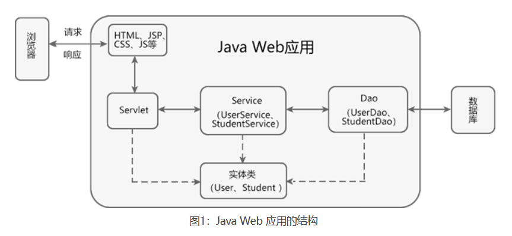
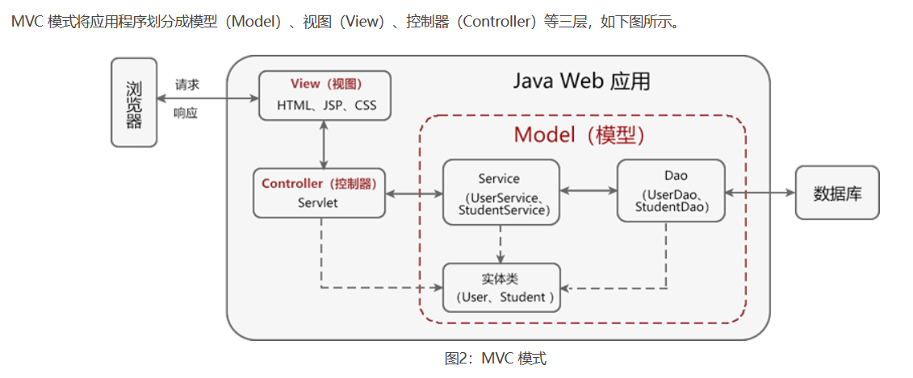
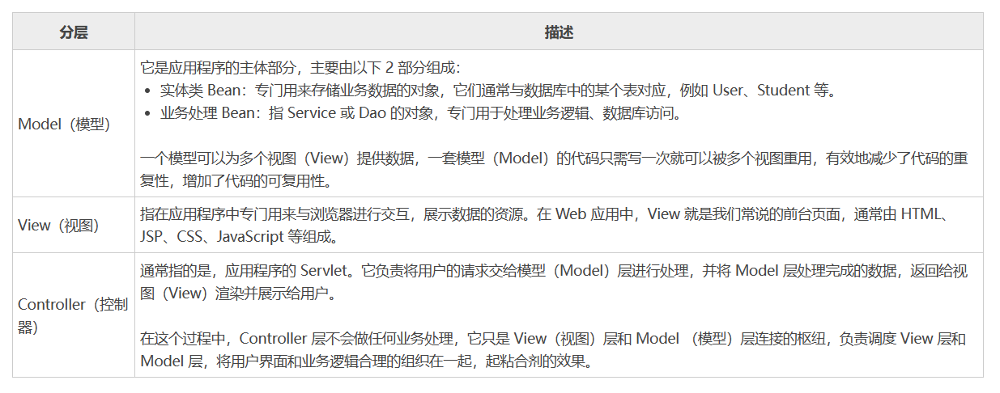
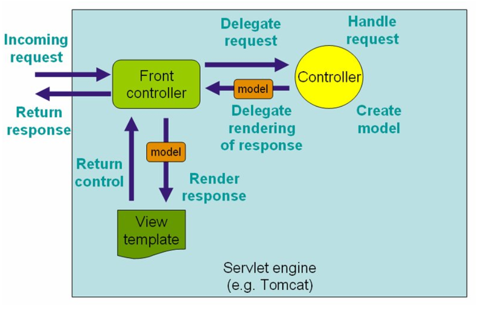
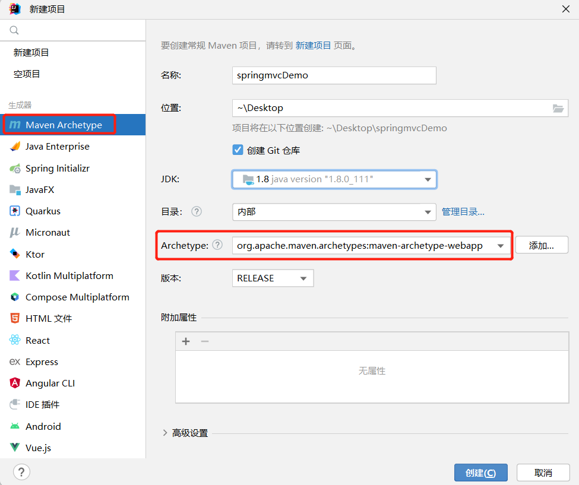
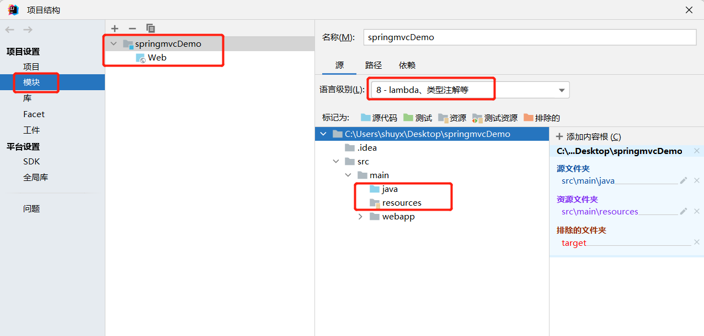
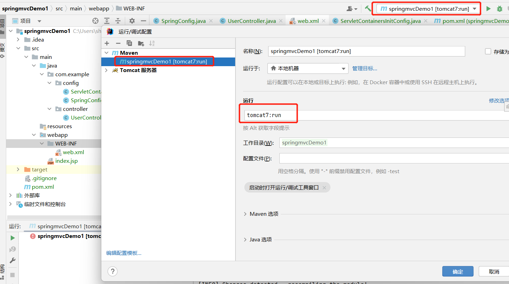
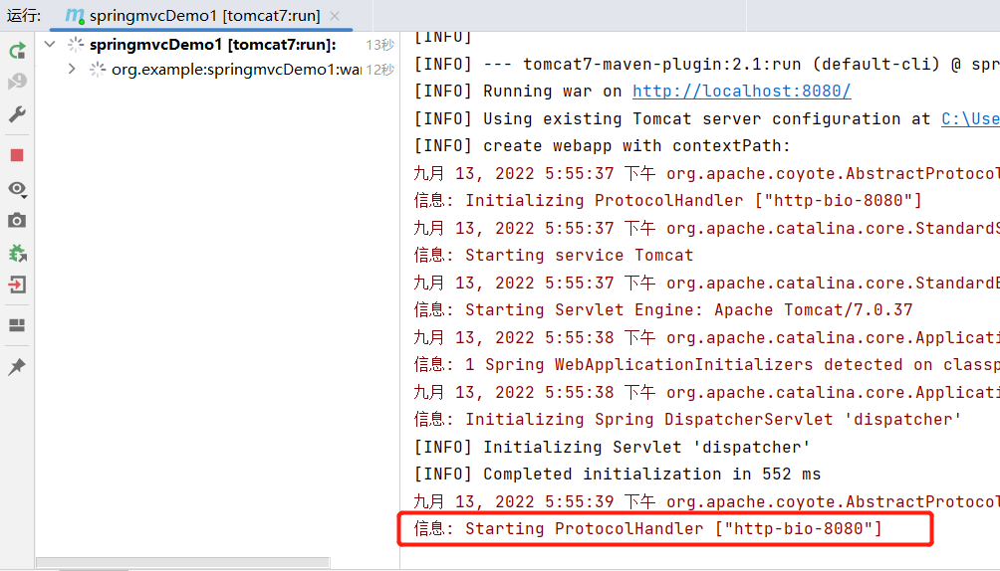
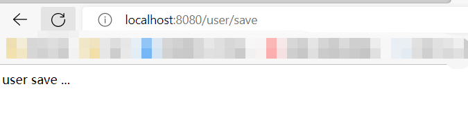
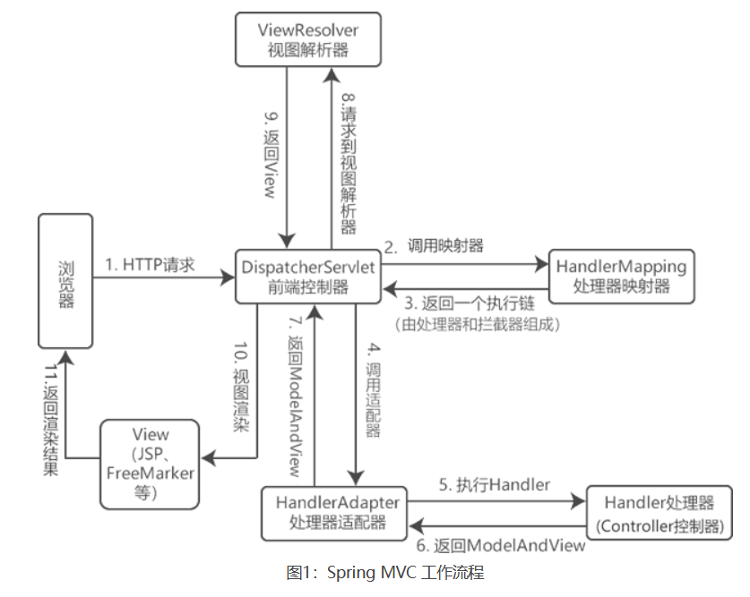

[toc]

# SpringMVC笔记1

当前SpringMVC的版本为5.3.22

## 什么是MVC模式？

MVC 模式，全称为 Model-View-Controller（模型-视图-控制器）模式，它是一种软件架构模式，其目标是将软件的用户界面（即前台页面）和业务逻辑分离，使代码具有更高的可扩展性、可复用性、可维护性以及灵活性。

> 传统的java web 软件架构



> MVC模式下的java web 软件架构





> MVC架构的工作流程

1. 用户通过浏览器发送请求到服务器；
2. 在服务器中，请求被控制层（Controller）接收；
3. Controller 调用相应的 Model 层处理请求；
4. Model 层处理完毕将结果返回到 Controller；
5. Controller 再根据 Model 返回的请求处理结果，找到相应的 View 视图。
6. View 视图渲染数据后最终响应给浏览器。

> MVC架构的优点

* 降低代码耦合性：在 MVC 模式中，三层之间相互独立，各司其职。一旦某一层的需求发生了变化，只需要更改相应层中的代码即可，而不会对其他层中的代码造成影响。
* 有利于分工合作：在 MVC 模式中，将应用系统划分成了三个不同的层次，可以更好地实现开发分工。
* 有利于组件的重用：在 MVC 中，多个视图（View）可以共享同一个模型（Model），大大提高了系统中代码的可重用性。

## SpringMVC介绍

Spring MVC 是 Spring 创建的一个基于 MVC 模式的轻量级 Web 开发框架。

Spring MVC 本质上是对 Servlet 的进一步封装，其最核心的组件是 DispatcherServlet。由于 Spring MVC 本身就是 Spring 框架的一部分，可以和 Spring 框架无缝集成。性能方面具有先天的优越性，是当今业界最主流的 Web 开发框架。

> Spring MVC 中各层的职责如下
* Model：负责对请求进行处理，并将结果返回给 Controller；
* View：负责将请求的处理结果进行渲染，展示在客户端浏览器上；
* Controller：是 Model 和 View 交互的纽带；主要负责接收用户请求，并调用 Model 对请求处理，然后将 Model 的处理结果传递给 View。


## DispatcherServlet介绍

Spring MVC 本质是对 Servlet 的进一步封装，其最核心的组件是 DispatcherServlet，它是 Spring MVC 的前端控制器，主要负责对请求和响应的统一地处理和分发。Controller 接收到的请求其实就是 DispatcherServlet 根据一定的规则分发给它的。

下图展示了DispatcherServlet处理请求的工作流程。




## SpringMVC入门案例（注解和配置类的形式）

① 创建maven web工程

1. 使用IDEA创建maven web工程。
2. maven模板选择org.apache.maven.archetypes:maven-archetype-webapp。



PS: 由于maven-archetype-webapp模板目录不完整，缺少java和resources目录，所以需要手动创建目录。



② 在pom.xml中添加springmvc依赖和tomcat插件

```xml
<!-- springmvc的两个依赖 -->
<dependency>
      <groupId>org.springframework</groupId>
      <artifactId>spring-webmvc</artifactId>
      <version>5.2.1.RELEASE</version>
</dependency>
<dependency>
    <groupId>javax.servlet</groupId>
    <artifactId>javax.servlet-api</artifactId>
    <version>4.0.1</version>
    <!-- 
        设置该依赖只在编译和测试的时候使用 
        运行的时候直接用tomcat7-maven-plugin插件的javax.servlet-api。避免冲突
    -->
    <scope>provided</scope>
</dependency>


<!-- tomcat-maven插件：在maven工程中内嵌tomcat -->
<build>
    <plugins>
        <plugin>
        <groupId>org.apache.tomcat.maven</groupId>
        <artifactId>tomcat7-maven-plugin</artifactId>
        <version>2.1</version>
        <!-- 设置tomcat的启动端口号为8080,上下文映射路径为/ -->
        <configuration>
            <port>8080</port>
            <path>/</path>
            <uriEncoding>UTF-8</uriEncoding><!--设置编解码字符集-->
        </configuration>
        </plugin>
    </plugins>
</build>
```

* SpringMVC是基于Spring框架的，在pom.xml只导入了`spring-webmvc`jar包的原因是它会自动依赖其他spring相关依赖包。
* tomcat7-maven-plugin：在maven工程中内嵌tomcat。让项目在内嵌tomcat中运行。
* `<scope>provided</scope>` : 
  * 1.默认是compile,在编译、测试、运行时均有效。
  * 2.设置provided表示该依赖只在编译和测试的时候有效。
  * 3.运行的时候直接用tomcat7-maven-plugin插件中的servlet-api包。避免依赖和插件的servlet-api包发生冲突。

<font color="red">注意：目前IDEA只对tomcat7插件进行了适配。</font>

③ 创建springMVC配置类,用于扫描com.example.controller包下的所有类

```java
@Configuration
@ComponentScan("com.example.controller")
public class SpringMVCConfig {
    //SpringMVC配置类
}
```

④ 创建servlet web容器配置类,用于代替web.xml

1. 将webapp/WEB-INF/web.xml删除
2. 创建自定义servlet web容器配置类.该类继承AbstractDispatcherServletInitializer类,重写其中几个方法。
3. AbstractDispatcherServletInitializer类用于创建Servlet容器时，并加载springmvc相关的bean到servlet容器中。

```java
import org.springframework.web.context.WebApplicationContext;
import org.springframework.web.context.support.AnnotationConfigWebApplicationContext;
import org.springframework.web.servlet.support.AbstractDispatcherServletInitializer;
//自定义servlet web容器配置类
public class ServletContainersInitConfig extends AbstractDispatcherServletInitializer {
    //初始化servlet web容器。并且容器加载SpringMVC配置类
    protected WebApplicationContext createServletApplicationContext() {
        //初始化servlet web容器
        AnnotationConfigWebApplicationContext ctx = new AnnotationConfigWebApplicationContext();
        //加载SpringMvcConfig配置类
        ctx.register(SpringMVCConfig.class);
        return ctx;
    }

    //拦截所有请求，并将所有请求交给spring mvc处理
    // "/" 表示所有，但不包括.jsp/.html等文件; "/*" 表示所有，包括.jsp/.html等文件
    protected String[] getServletMappings() {
        return new String[]{"/"};
    }

    protected WebApplicationContext createRootApplicationContext() {
        return null;
    }
}
```

⑤ 创建Controller类
```java
@Controller
@RequestMapping("/user")
public class UserController {
    @RequestMapping("/save")
    @ResponseBody
    public String save(){
        System.out.println("user save ...");
        return "user save ...";
    }
}
```

⑥ 配置tomcat运行环境



maven运行命令：`tomcat7:run`,意思是启动maven工程内嵌的tomcat服务器。把项目放在内嵌tomcat中运行。

⑦ 启动运行项目，浏览器访问地址 localhost:8080/user/save





### AbstractDispatcherServletInitializer类描述

* AbstractDispatcherServletInitializer类是SpringMVC提供的快速初始化Web3.0容器的抽象类
* AbstractDispatcherServletInitializer提供了三个接口方法供用户实现
  * createServletApplicationContext方法：创建Servlet容器时，加载SpringMVC对应的bean并放入WebApplicationContext对象范围中，而WebApplicationContext的作用范围为ServletContext范围，即整个web容器范围
  * getServletMappings方法，设定SpringMVC对应的请求映射路径，即SpringMVC拦截哪些请求
  * createRootApplicationContext方法，如果创建Servlet容器时需要加载非SpringMVC对应的bean,使用当前方法进行，使用方式和createServletApplicationContext相同。
  * createRootApplicationContext用来加载Spring环境

### @Controller @RequestMapping @ResponseBody注解

@Controller
位置：SpringMVC控制器类上方定义
作用：设定为SpringMVC的控制器bean

@RequestMapping
位置：SpringMVC控制器类或方法上方定义
作用：设置当前控制器方法的请求访问路径

@ResponseBody
位置：SpringMVC控制器类或方法定义上方
作用：设置当前控制器方法响应内容为当前返回值，无需解析

> 注意： 
* springmvc默认会解析方法返回值。并把返回值当成页面名称在项目中进行查找并返回页面给前端。
* @ResponseBody注解会让springmvc不把返回值作为页面名称，直接把方法返回值给前端。

### 小结

上面例子中分别是web服务器初始化过程和单次请求过程。

> 启动web服务器初始化过程

1. 服务器启动，执行ServletContainersInitConfig类，初始化web容器，代替了以前的web.xml
2. 执行createServletApplicationContext方法，创建了WebApplicationContext对象。该方法加载SpringMVC的配置类来初始化SpringMVC的容器
3. 创建springMVC配置类,用于扫描com.example.controller包下的所有类
```java
@Configuration
@ComponentScan("com.example.controller")
public class SpringMVCConfig {
    //SpringMVC配置类
}
```
5. 扫描@ComponentScan注解指定包及其子包下所有类上的注解，如Controller类上的@Controller，@RequestMapping注解等。
6. 加载UserController，每个@RequestMapping的名称对应一个具体的方法。例如下面方法中就建立了`/user/save`映射路径和save方法的对应关系
```java
@Controller
@RequestMapping("/user")
public class UserController {
    @RequestMapping("/save")
    @ResponseBody
    public String save(){
        System.out.println("user save ...");
        return "user save ...";
    }
}
```
7. 执行getServletMappings方法，设定SpringMVC拦截请求的路径规则
```java
//  /代表所拦截请求的路径规则，只有被拦截后才能交给SpringMVC来处理请求
protected String[] getServletMappings() {
    return new String[]{"/"};
}
```

> 单次请求过程

1. 发送请求`http://localhost/user/save`
2. web容器发现该请求满足SpringMVC拦截规则，将请求交给SpringMVC处理
3. 解析请求路径/user/save
4. 由/user/saveq匹配执行对应的方法save()
   * 上面的第五步已经将请求路径和方法建立了对应关系，通过/user/save就能找到对应的save方法
5. 执行save()方法
6. 检测到方法有@ResponseBody注解。则直接将save()方法的返回值作为响应体返回给请求方。

## SpringMVC工作流程



> SpringMVC的常用组件

如上图所示，Spring MVC的常用组件共有6个，它们分别是： DispatcherServlet（前端控制器）、HandlerMapping（处理器映射器）、HandlerAdapter（处理器适配器）、Handler（处理器）、ViewResolver（视图解析器）和 View（视图）。

* DispatcherServlet：Spring MVC 的核心，其本质就是一个Servlet。它负责将所有的请求进行统一分发。
* HandlerMapping：负责根据请求的 url、method 等信息查找响应的 Handler 处理器。
* HandlerAdapter：根据找到的处理器（Handler）信息，按照特定规则执行处理器（Handler）方法。
* Handler：常说的 Controller 控制器，对具体的用户请求进行处理。
* ViewResolver：对 ModelAndView 对象中的 View 信息进行解析，将其解析成真正的视图 View。
* View：将 Model 模型数据通过页面展示给用户。

> SpringMVC 的执行流程如下。
1. 用户通过浏览器发起一个 HTTP 请求，该请求会被 DispatcherServlet（前端控制器）拦截；
2. DispatcherServlet 调用 HandlerMapping（处理器映射器）找到具体的处理器（Handler）及拦截器，最后以 HandlerExecutionChain 执行链的形式返回给 DispatcherServlet。
3. DispatcherServlet 将执行链返回的 Handler 信息发送给 HandlerAdapter（处理器适配器）；
4. HandlerAdapter 根据 Handler 信息找到并执行相应的 Handler（即 Controller 控制器）对请求进行处理；
5. Handler 执行完毕后会返回给 HandlerAdapter 一个 ModelAndView 对象（Spring MVC 的底层对象，包括 Model 数据模型和 View 视图信息）；
6. HandlerAdapter 接收到 ModelAndView 对象后，将其返回给 DispatcherServlet ；
7. DispatcherServlet 接收到 ModelAndView 对象后，会请求 ViewResolver（视图解析器）对视图进行解析；
8. ViewResolver 解析完成后，会将 View 视图并返回给 DispatcherServlet；
9. DispatcherServlet 接收到具体的 View 视图后，进行视图渲染，将 Model 中的模型数据填充到 View 视图中的 request 域，生成最终的 View（视图）；
10. 最终将结果显示到浏览器（客户端）。