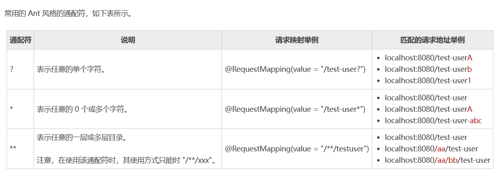
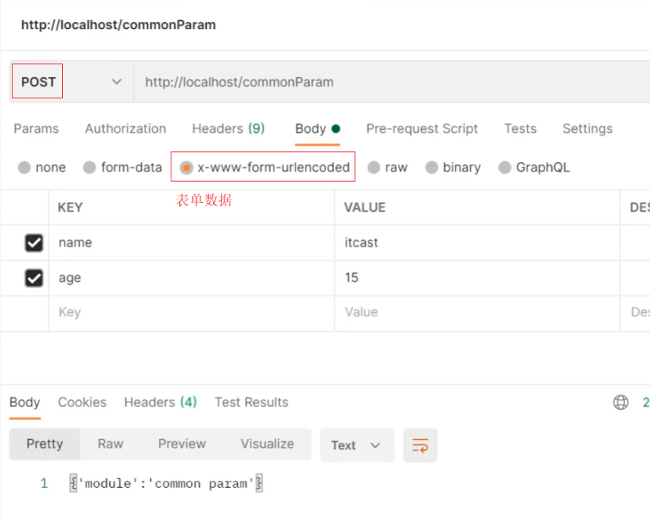
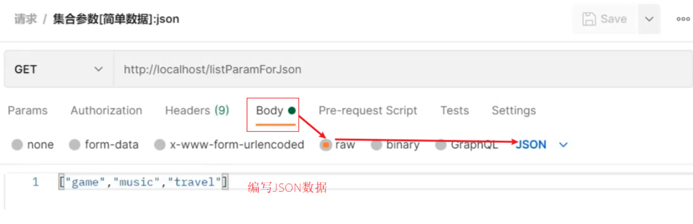
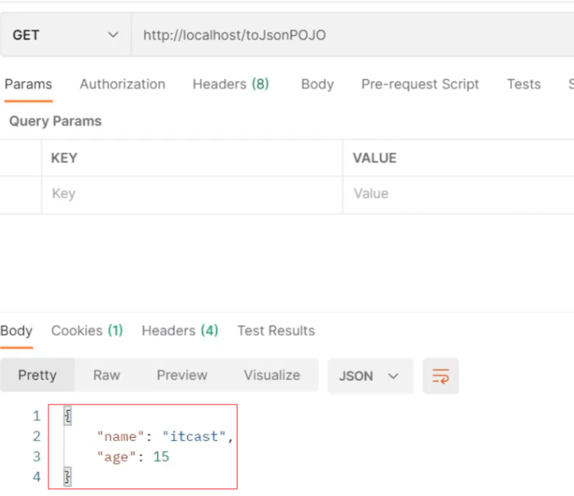
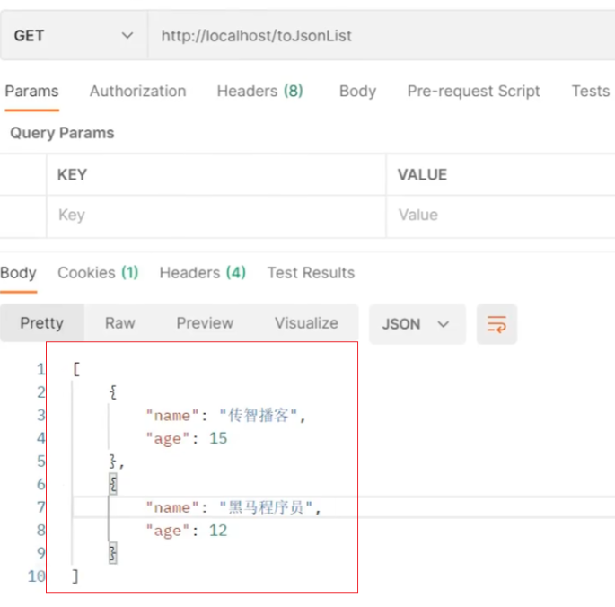

[toc]

# SpringMVC笔记2

当前SpringMVC的版本为5.3.22

SpringMVC是web层的框架，主要的作用是接收请求、处理数据、响应结果。
* 接收请求：设置请求映射路径,用于匹配前端的请求。
* 处理数据：接受请求传递的数据并进行处理。
* 响应结果：请求方法处理后的返回值包装成响应结果，返回给前端。

## @Controller 注解 ：标识控制器类

@Controller注解用于标记一个类，被它标记的类就是一个控制器类。具体的请求处理方法就在控制器类中。

* 控制器类负责接受DispatcherServlet分发的请求。
* 当请求处理完之后，将响应的数据封装成一个Model,返回给对应的View。

```java
// @Controller注解标记一个类为控制器类。
@Controller
public class TestController {
    // 处理请求的方法
}
```

> DispatcherServlet如何找到对应的控制器类？

当spring的ioc容器启动时，扫描到@Controller注解，就把该控制器类注入到ioc容器中。DispatcherServlet可直接通过IOC容器来找到对应控制器类。

## @RequestMapping 注解 ：设置请求映射路径

@RequestMapping 注解通常被标注在控制器方法上，负责将请求与处理请求的控制器方法关联起来，建立映射关系。

DispatcherServlet 拦截到用户发来的请求后，会通过 @RequestMapping 注解的映射信息找到对应的控制器类中的方法，从而处理这个请求。

简单来说，@RequestMapping 注解会把请求和控制器方法绑定在一起。即访问特定的请求，就会执行对应的方法。

### @RequestMapping 注解的使用方式

@RequestMapping注解可以标记在控制器类上和控制器方法上。

① 修饰控制器方法

请求http://ip:port/login 可以访问到下面的login方法
```java
// 标记在控制器方法上
@Controller
public class firstController {
	@RequestMapping(value="/login")
	public String login() {
		System.out.println("this is login");
		return "hello";
	}
}
```

② 修饰控制器类+控制器方法

请求http://ip:port/first/login 可以访问到下面的login方法

```java

// 标记在控制器类和控制器方法上
@Controller
@RequestMapping(value="/first")
public class firstController {
	@RequestMapping(value="/login")
	public String login() {
		System.out.println("this is login");
		return "hello";
	}
}
```

### @RequestMapping 注解的属性

> value属性

value 属性用来设置控制器方法的请求映射地址。也是默认属性，可省略。

```java
@RequestMapping("/login")
//效果等同
@RequestMapping(value="/login")

//可匹配多个映射地址
@RequestMapping( value = {"/login", "/login2"})
```

<font color="red">注意：value属性是支持通配符的。</font>



> name属性

name 属性相当于控制器方法的注释。

```java
@RequestMapping(value="/login",name="登录方法")
public String login() {
    .....
}
```

> method属性

method 属性用来设置控制器方法支持的请求方式。若没有设置method 属性，则说明可以处理所有类型的请求方式。

```java
// 设置该方法只支持GET方式的http请求
@RequestMapping(value = "/login",method = RequestMethod.GET)

// 设置该方法只支持GET，POST方式的http请求
@RequestMapping(value = "/login2",method = {RequestMethod.GET,RequestMethod.POST})

// 设置该方法支持所有方式的http请求
@RequestMapping(value = "/login3")
```

> param属性

params 属性用于指定请求中的请求参数，只有当请求中携带了符合条件的参数时，控制器方法才会对该请求进行处理。

```java
//只有当请求中同时携带 name 和 age 两个请求参数，且参数值必须分别为111和222时，控制器方法 testParam() 才会处理该请求。
@RequestMapping(value = "/testParam", params = {"name=111", "age=222"})
public String testParam() {
    .....
}
```

> headers 属性

headers 属性用于设置请求中请求头信息，只有当请求中携带指定的请求头信息时，控制器方法才会处理该请求。

```java
//只有当请求的头信息中包含“Referer=http://c.biancheng.net”时，控制器方法 testHeader() 才会处理该请求。
@RequestMapping(value = "testHeader",headers = "Referer=http://c.biancheng.net")
public String testHeader() {
    ……
}
```

## @GetMapping，@PostMapping，@PutMapping，@DeleteMapping

@RequestMapping有四个变体，分别是@GetMapping，@PostMapping，@PutMapping，@DeleteMapping。它们分别对应请求的四种方式，get请求，post请求，put请求，delete请求。

```java
// @GetMapping 相当于下面的写法
@GetMapping(value = "/login")
@RequestMapping(value = "/login",method = RequestMethod.GET)

// @PostMapping 相当于下面的写法
@PostMapping(value = "/login")
@RequestMapping(value = "/login",method = RequestMethod.POST)

// @PutMapping 相当于下面的写法
@PutMapping(value = "/login")
@RequestMapping(value = "/login",method = RequestMethod.PUT)

// @DeleteMapping 相当于下面的写法
@DeleteMapping(value = "/login")
@RequestMapping(value = "/login",method = RequestMethod.DELETE)

```


## GET和POST请求

目前比较常见的两种请求方式为GET和POST方式。在GET和POST请求中可以设置请求参数。


> GET方式设置请求参数

请求路径：`http://localhost:8080/test?name=xiaoming&age=15`


> POST方式设置请求参数

请求路径：`http://localhost:8080/commonParam`

POST请求的参数通过表单传递，不用写在请求路径上。



## SpringMVC 接收请求参数

当通过@Controller注解和RequestMapping注解，将请求和控制器方法绑定后。即访问特定的http请求，就执行对应的方法。

下一步还需要接收请求中的请求参数。Spring MVC 提供了多种接收请求参数的方式：
* 通过 HttpServletRequest 接收请求参数
* 通过控制器方法的形参接收请求参数
* 通过@RequestParam 注解接收请求参数
* 通过实体类对象接收请求参数
* 通过数组来接收请求参数
* 通过集合对象来接收请求参数

### 通过 HttpServletRequest 接收请求参数

Spring MVC 会自动将请求中携带的参数封装到 HttpServletRequest 形参中，然后可以通过 HttpServletRequest 类提供的 getParameter() 方法接收所需的请求参数了。

请求路径：`http://localhost:8080/test?name=111&age=222`

```java
@Controller
public class TestController {
    //通过 HttpServletRequest 接收请求参数
    @RequestMapping("/test")
    public String test(HttpServletRequest request) {
        String name = request.getParameter("name");
        String age = request.getParameter("age");
        System.out.println("name:" + name);
        System.out.println("age:" + age);
        return "index";
    }
}

//运行结果如下
// name: 111
// age: 222
```

### 通过方法形参接收请求参数

当控制器方法的形参与请求参数同名的时候，Spring MVC会自动将请求参数赋值给相应的方法形参。

请求路径：`http://localhost:8080/test?name=111&age=222`

```java
@Controller
public class TestController {
    // 通过方法形参接收请求参数
    @RequestMapping("/test")
    public String test(String name,Integer age) {
        System.out.println("name:" + name);
        System.out.println("age:" + age);
        return "index";
    }
}

//运行结果如下
// name: 111
// age: 222
```

> 需要注意下面几点
* 请求参数必须与形参名称相同
* String 字符串类型的形参接收所有的请求参数。其他类型的形参可以接收对应的请求参数。
* 不适用于参数过多的请求

### 通过 @RequestParam 注解接收请求参数

在控制器方法中通过 @RequestParam 注解，把请求参数与控制器方法形参建立起映射关系，将它们绑定起来。这样即使请求参数与控制器方法中的形参名称不一致，我们也能接收到对应的请求参数值。

请求路径：`http://localhost:8080/test?name=111&age=222`

```java
@Controller
public class TestController {
    // 通过 @RequestParam 注解接收请求参数
    @RequestMapping("/test")
    public String test(@RequestParam("name") String username, @RequestParam("age") Integer userage) {
        System.out.println("username:" + username);
        System.out.println("userage:" + userage);
        return "index";
    }
}

//运行结果如下
// name: 111
// age: 222
```

> @RequestParam 注解有以下4个属性
* name属性：请求参数名。与value属性等价。
* value属性：请求参数名。与name属性等价。
* required属性：请求参数名是否必须。默认值为true
* defaultValue属性：请求参数的默认值。


### 通过实体类对象接收请求参数

当方法形参为实体类对象时，并且实体类对象中的属性名称与请求参数的名称一致的时候， Spring MVC 会自动将请求参数封装到该实体类对象中。

请求路径：`http://localhost:8080/test?name=111&age=222`

```java
public class User {
    private String id;
    private String name;
    private Integer age;

    //省略构造方法，get/set方法
}


@Controller
public class TestController {
    // 通过 @RequestParam 注解接收请求参数
    @RequestMapping("/test")
    public String test(User user) {
        System.out.println("name:" + user.name);
        System.out.println("age:" + user.age);
        return "index";
    }
}

//运行结果如下
// name: 111
// age: 222
```

### 通过数组来接收请求参数

当多个请求参数名与形参对象属性名相同时，控制器方法的形参可以用数组来接收请求参数。

请求路径：`http://localhost:8080/test?likes=游戏&likes=电影&likes=音乐`


```java
//请求路径中的3个请求参数名称都是likes
@Controller
public class TestController {
    // 通过数组来接收请求参数
    @RequestMapping("/test")
    public String test(String[] likes) {
        System.out.println("数组："+ Arrays.toString(likes));
        return "index";
    }
}

//运行结果如下
// 数组：游戏 电影 音乐
```

### 通过集合对象来接收请求参数

当多个请求参数有相同名称时，可以使用@RequestParam注解映射到对应名称的集合对象中

请求路径：`http://localhost:8080/test?likes=游戏&likes=电影&likes=音乐`

```java
//集合参数：多个同名请求参数可以使用@RequestParam注解映射到对应名称的集合对象中作为数据
@Controller
public class TestController {
    // 通过数组来接收请求参数
    @RequestMapping("/test")
    public String test(@RequestParam List<String> likes) {
        System.out.println("集合："+ likes);
        return "index";
    }
}

//运行结果如下
// 集合：游戏 电影 音乐
```

### @RequestBody注解：接受请求体中的参数

@RequestBody注解用于读取http请求的body部分数据,解析成对象或者bean,并绑定到控制器方法的形参上。

POST请求的请求参数，一般设置在请求体中，并且通常为JSON格式。

常见的JSON格式有三种:
- json普通数组 ["value1","value2","value3"] 
- json对象     {key1:value1,key2:value2}
- json对象数组 [{key1:value1,...},{key2:value2,...}]


#### 接收请求体中的json普通数组

① 步骤1:pom.xml添加json处理依赖

SpringMVC默认使用的是jackson来处理json的转换，所以需要在pom.xml添加jackson依赖
```xml
<dependency>
    <groupId>com.fasterxml.jackson.core</groupId>
    <artifactId>jackson-databind</artifactId>
    <version>2.9.0</version>
</dependency>
```

② 步骤2:开启SpringMVC注解支持
在配置类中开启@EnableWebMvc注解，该注解包含了将JSON转换成对象的功能。

```java
@Configuration
@ComponentScan("com.example.controller")
//开启json数据类型自动转换
@EnableWebMvc
public class SpringMvcConfig {
    ......
}
```

③ 步骤3:设置请求参数，参数格式JSON数组



④ 步骤4:在方法形参前添加@RequestBody
```java
//使用@RequestBody注解将外部传递的json数组数据映射到形参的集合对象中作为数据
@RequestMapping("/listParamForJson")
@ResponseBody
public String listParamForJson(@RequestBody List<String> likes){
    System.out.println("list common(json)参数传递 list ==> "+likes);
    return "{'module':'list common for json param'}";
}
```

⑤ 步骤5:启动运行程序，请求测试。

#### 接收请求体中的JSON对象数据

json对象数据如下
```json
//json对象数据
{
	"name":"itcast",
	"age":15
}
```


```java
@RequestMapping("/pojoParamForJson")
@ResponseBody
// 注意User对象中有name和age属性
public String pojoParamForJson(@RequestBody User user){
    System.out.println("user ==> "+user);
    return "{'module':'pojo for json param'}";
}
```

由于User对象中有name和age属性。因此json对象中的name和age属性会转换为User对象中的name和age属性。

#### 接收请求体中的JSON对象数组

JSON对象数组如下
```json
[
    {"name":"itcast","age":15},
    {"name":"itheima","age":12}
]
```

```java
@RequestMapping("/listPojoParamForJson")
@ResponseBody
// 注意User对象中有name和age属性
public String listPojoParamForJson(@RequestBody List<User> list){
    System.out.println("list ==> "+list);
    return "{'module':'list pojo for json param'}";
}
```

#### 小结：@EnableWebMvc，@RequestBody注解

> @EnableWebMvc注解
位置：SpringMVC配置类上方定义
作用：开启SpringMVC多项辅助功能，包含json对象转换，日期字符串转换等

> @RequestBody注解
位置：方法形参前面定义
作用：将请求中请求体所包含的数据传递给请求参数，此注解一个方法只能使用一次

> @RequestBody与@RequestParam区别
* @RequestParam注解用于接收请求路径中的参数
* @RequestBody注解用于接收请求体body中的数据


<font color="red">
注意:在SpringMVC的配置类中要把@EnableWebMvc当做标配配置上去，不要省略。
</font>


### @DateTimeFormat 注解：接收日期类型请求参数

请求路径如下
`http://localhost/dataParam?date1=2088/08/08&date2=2088-08-08&date3=2088/08/08 8:08:08`

例子
```java
@RequestMapping("/dataParam")
public String dataParam(Date date1,@DateTimeFormat(pattern="yyyy-MM-dd") Date date2,@DateTimeFormat(pattern="yyyy/MM/dd HH:mm:ss") Date date3){
    System.out.println("参数传递 date ==> "+date);
	System.out.println("参数传递 date1(yyyy-MM-dd) ==> "+date1);
	System.out.println("参数传递 date2(yyyy/MM/dd HH:mm:ss) ==> "+date2);
    return "{'module':'data param'}";
}
```

* SpringMVC默认支持的字符串转日期的格式为yyyy/MM/dd。Date类型形参可以接收 'yyyy/MM/dd' 格式日期参数。其他日期格式，Date类型形参无法接受。
* @DateTimeFormat注解可以通过设置日期格式，让Date类型形参接收请求参数。


### @PathVariable注解：获取请求路径上的动态参数

@PathVariable注解可以获取请求URL中的动态参数。

请求路径：`http://localhost/users/1`
请求路径：`http://localhost/users/1/tom`

> 例子
```java
@Controller
public class UserController {
    //单个请求路径参数
	@RequestMapping(value = "/users/{id}")
    public String test1(@PathVariable Integer id) {
        System.out.println(id);
        return "hello";
    }
    //多个请求路径参数
	@RequestMapping(value = "/users/{id}/{name}")
    public String test2(@PathVariable Integer id,@PathVariable String name) {
        System.out.println(id+","+name);
        return "hello";
    }
}

@RequestMapping(value = "/test/{id}")
public String test(@PathVariable(value = "id") Integer id) {
    System.out.println("id  "+id); //此处的id=1 
    return "hello";
}
```

@PathVariable注解可以把请求路径中的占位符参数赋值到方法的形参中。

> 若请求路径占位符参数与方法形参不同名时

请求路径：`http://localhost/users/1`

```java
@Controller
public class UserController {
    //此时请求路径占位符参数名称为id,方法形参名称为userId
    //可以通过@PathVariable注解设置表达式来匹配占位符和方法形参
	@RequestMapping(value = "/users/{id}")
    public String delete(@PathVariable("id") Integer userId) {
        System.out.println(id);
        return "hello";
    }
}
```

* 可以通过@PathVariable注解设置表达式来匹配请求路径占位符参数和方法形参

### @RequestHeader注解：获取请求头的属性参数

@RequestHeader注解会获取到请求中的请求头信息，并把请求头中的属性数据绑定到控制器方法形参上。

请求路径：`http://localhost:8080/testHeader`

```java
@RequestMapping(value="/testHeader")
public String testHeader(@RequestHeader(value="Accept-Language") String al) {
    System.out.println("Accept-Language: "+al);      
    return "hello";
}
   	
```

* `@RequestHeader(value="Accept-Language")`获取请求头中的Accept-Language属性的值。将值绑定到方法形参上。

### @CookieValue注解：获取请求中cookie的数据

@CookieValue注解用于把请求中的cookie数据绑定到控制器方法参数上。


请求路径：`http://localhost:8080/testcookie`

```java
	@RequestMapping(value="/testcookie")
	public String testcookie(@CookieValue(value="JSESSIONID") String JSESSIONID) {
		System.out.println("JSESSIONID : "+JSESSIONID);      
		return "hello";
	}
```

* `@CookieValue(value="JSESSIONID")`获取请求cookile中的JSESSIONID属性的值。将值绑定到方法形参上。


### 接收请求参数的乱码问题

当请求参数中包含中文时，控制器方法形参接收的请求参数值可能会出现乱码。

>解决方法：在自定义servlet配置类中设置过滤器。进行编码处理。

```java
public class ServletContainersInitConfig extends AbstractDispatcherServletInitializer {
    //编码设置为UTF-8。用于处理中文乱码
    @Override
    protected Filter[] getServletFilters() {
        CharacterEncodingFilter filter = new CharacterEncodingFilter();
        filter.setEncoding("UTF-8");
        return new Filter[]{filter};
    }
}
```


## SpringMVC的响应结果

当控制器方法接收到请求参数后，就可以对请求参数进行处理。处理完后，就可以返回响应结果数据。

### @ResponseBody 注解：方法返回值作为响应数据

springmvc中的控制器方法，默认情况下会把方法的返回值解析为视图页面来返回。但是如果控制器方法添加了 @ResponseBody 注解后，springmvc则不会把方法返回值解析为页面名称了，而是直接作为响应数据来返回。

#### 响应页面

```java
@Controller
public class UserController {
    @RequestMapping("/toJumpPage")
    //注意
    //1.此处没有添加@ResponseBody注解,如果加了会解析为page.jsp,找到同名页面返回前端。
    //2.方法需要返回String
    public String toJumpPage(){
        System.out.println("跳转页面");
        return "page.jsp";
    }
}
```

#### 响应文本数据

```java
@Controller
public class UserController {
   	@RequestMapping("/toText")
    @ResponseBody
    public String toText(){
        System.out.println("返回纯文本数据");
        return "response text";
    }
}
```

#### 响应JSON对象数据

如果方法的返回值为对象类型，则@ResponseBody注解会把对象转换为json对象来返回。

<font color="red">注意：此处需要在配置类中提前开启@EnableWebMvc注解</font>

```java
@Controller
public class UserController {
    @RequestMapping("/toJsonPOJO")
    //@ResponseBody注解会把User类对象，转换为json数据格式响应
    //需要提前开启@EnableWebMvc注解
    @ResponseBody
    public User toJsonPOJO(){
        System.out.println("返回json对象数据");
        User user = new User();
        user.setName("itcast");
        user.setAge(15);
        return user;
    }
}
```



#### 响应JSON对象数组

如果方法的返回值为集合对象类型，则@ResponseBody注解会把集合转换为json对象数组来返回。

<font color="red">注意：此处需要在配置类中提前开启@EnableWebMvc注解</font>

```java
@Controller
public class UserController {
    @RequestMapping("/toJsonList")
    @ResponseBody
    public List<User> toJsonList(){
        User user1 = new User();
        user1.setName("传智播客");
        user1.setAge(15);
        User user2 = new User();
        user2.setName("黑马程序员");
        user2.setAge(12);
        List<User> userList = new ArrayList<User>();
        userList.add(user1);
        userList.add(user2);
        return userList;
    }
}
```



#### 小结：@ResponseBody注解

@ResponseBody注解：
* 该注解可以写在类上或者方法上
* 写在类上就是该类中的所有方法都有@ReponseBody功能
* 当方法上有@ReponseBody注解后
  * 方法的返回值为字符串，会将其作为文本内容直接响应给前端
  * 方法的返回值为对象，会将对象转换成JSON响应给前端


### @RestController 注解

@RestController注解的作用等同于@Controller + @ResponseBody。

通过使用@RestController对控制器类进行标记，则类中的控制器方法默认自动标记了@ResponseBody注解。

```java
@Controller
public class UserController {
   	@RequestMapping("/toText")
    @ResponseBody
    public String toText(){
        System.out.println("返回纯文本数据");
        return "response text";
    }

    @RequestMapping("/toText2")
    @ResponseBody
    public String toText2(){
        System.out.println("返回纯文本数据2");
        return "response text";
    }
}

//-----------上下两段代码，效果等同。
//

@RestController
public class UserController {
   	@RequestMapping("/toText")
    public String toText(){
        System.out.println("返回纯文本数据");
        return "response text";
    }

    @RequestMapping("/toText2")
    public String toText2(){
        System.out.println("返回纯文本数据2");
        return "response text";
    }
}


```

