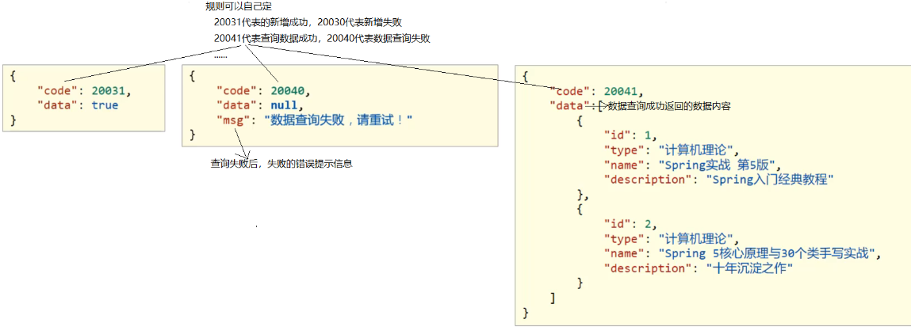

[toc]

# 自定义异常和统一结果返回对象


> 统一结果返回对象

使用场景：随着业务的增长，需要返回的数据类型会越来越多。对于前端来说，如果后台能够返回一个统一的数据结果，前端在解析的时候就可以按照一种方式进行解析。开发就会变得更加简单。

统一响应结果封装思路分析为:
* 封装data数据:创建响应结果类，封装响应数据到data属性中
* 封装结果码数据:封装操作结果到code属性中
* 封装错误信息数据:封装错误消息到message(msg)属性中

例如下图：



> 自定义异常

使用场景：java的异常信息对于用户难以理解，因此将系统产生的异常信息封装为更加容易理解的自定义异常信息。当程序中出现异常时，结合统一结果返回对象，将自定义异常信息返回给用户看到。

SpringMVC对于异常的统一处理已经提供了一套解决方案:
* 自定义异常处理器: 集中的、统一的处理项目中出现的异常。
* 自定义异常处理器需要添加@RestControllerAdvice注解修饰


## 1 自定义异常和统一结果返回对象结合使用

两种逻辑思路：
1. 对可能发生异常的地方，在程序中用try catch捕获java异常。把java异常转化为自定义异常，然后手动throw抛出。此时异常会被异常处理器处理。在异常处理器的方法中将异常对象封装进统一结果中，最后将统一结果返回给用户。
2. 也可以当程序进行到某个地方时，手动throw自定义异常来中止程序继续运行。

① 步骤1: 创建结果代码枚举类。将错误信息与错误代码封装到一起

```java
/**
 * 结果代码枚举类
 */
public enum ResultCodeEnum {
    /* 成功状态码 */
    HTTP_REQUEST_SUCCESS(200, "请求成功"),
    /* 失败状态码 */
    HTTP_REQUEST_ERROR(500, "请求错误"),

    /* 参数错误：10001-19999 */
    PARAM_IS_INVALID(10001, "参数无效"),
    PARAM_IS_BLANK(10002, "参数为空"),
    PARAM_IS_MISS(10003, "参数缺失"),

    /* accessToken错误：30001-39999 */
    TOKEN_IS_ERROR(30001, "accessToken错误"),
    TOKEN_IS_NULL(30002, "accessToken缺失"),

    /* 系统错误：40001-49999 */
    SYSTEM_INNER_ERROR(40001, "系统繁忙，请稍后重试"),

    /* 接口错误：60001-69999 */
    REMOTE_REQUEST_CHNL_ERROR(60001, "远程调用电子处方中心错误"),

    /* 权限错误：70001-79999 */
    PERMISSION_NO_ACCESS(70001, "无访问权限"),

    /*业务错误：80001-89999*/
    BUSINESS_VERIFY_ERROR(80001,"验签错误"),
    BUSINESS_VERIFY_WRONG(80001,"验签失败"),
    BUSINESS_MAPTOSTRING_WRONG(80002,"加签过程中MAP转换String失败"),

    BUSINESS_END_WRONG(89999,"业务END失败");

    private int code;
    private String message;

    private ResultCodeEnum() {}
    private ResultCodeEnum(int code, String message) {
        this.code = code;
        this.message = message;
    }
    public int getCode() {
        return code;
    }
    public String getMessage() {
        return message;
    }
}

```

② 步骤2: 创建自定义异常类

自定义异常类继承RuntimeException类的好处是，后面在抛出自定义异常的时候，就不用在try...catch...或throws了。

```java
public class MyException extends RuntimeException{
    private int code;  //状态码
    private String message;  //异常信息

    public MyException() {}

    //传入结果枚举类来构造自定义异常对象
    public MyException(ResultCodeEnum codeEnum) {
        this.code = codeEnum.getCode();
        this.message = codeEnum.getMessage();
    }

    public int getCode() {
        return code;
    }

    public String getMessage() {
        return message;
    }
}

```

③ 步骤3: 创建统一结果对象类ReturnUtil

```java
/**
 * 统一结果对象
 * @param
 */
public class ReturnUtil {
    //成功
    //请求成功时，不传入data数据
    public static JSONObject success(){
        JSONObject json = new JSONObject();
        json.put("message", ResultCodeEnum.HTTP_REQUEST_SUCCESS.getMessage());
        json.put("code",ResultCodeEnum.HTTP_REQUEST_SUCCESS.getCode());
        return json;
    }

    //成功
    //请求成功时，传入要返回的data数据
    public static JSONObject success(Object obj){
        JSONObject json = new JSONObject();
        json.put("data",obj);
        json.put("message",ResultCodeEnum.HTTP_REQUEST_SUCCESS.getMessage());
        json.put("code",ResultCodeEnum.HTTP_REQUEST_SUCCESS.getCode());
        return json;
    }

    //失败
    //传入结果枚举类，当请求失败时，返回明确的失败原因
    public static JSONObject fail(ResultCodeEnum codeEnum){
        JSONObject json = new JSONObject();
        json.put("message",codeEnum.getMessage());
        json.put("code",codeEnum.getCode());
        return json;
    }

    //请求结果失败
    //传入自定义异常类，当发生异常时，直接返回请求失败时产生的异常错误信息
    public static JSONObject fail(MyException exception){
        JSONObject json = new JSONObject();
        json.put("message",exception.getMessage());
        json.put("code",exception.getCode());
        return json;
    }

    //请求结果失败
    //传入Exception异常类，当发生非自定义异常时，直接返回Exception异常错误信息
    public static JSONObject fail(Exception exception){
        JSONObject json = new JSONObject();
        json.put("message",exception.getMessage());
        json.put("code",ResultCodeEnum.HTTP_REQUEST_ERROR.getCode());
        return json;
    }
}

```

④ 步骤4: 创建自定义异常处理类

```java
@RestControllerAdvice
public class MyExceptionAdvice {
    //对MyException类型的异常处理，用于处理自定义异常。这个方法是针对MyException的异常处理
    @ExceptionHandler(MyException.class)
    public Object doMyException(MyException e){
        //记录日志
        //发送消息给运维
        //发送邮件给开发人员,ex对象发送给开发人员
        //日志打印异常信息
        e.printStackTrace();
        //用统一结果类封装异常信息并返回给用户
        return ReturnUtil.fail(e);
    }

    //对Exception类型的异常处理，用于处理非自定义异常。这个方法是针对Exception的异常处理
    @ExceptionHandler(Exception.class)
    public Object doException(Exception e){
        //记录日志
        //发送消息给运维
        //发送邮件给开发人员
        //日志打印异常信息
        e.printStackTrace();
        //用统一结果类封装异常信息并返回给用户
        return ReturnUtil.fail(e);
    }
}

```

* @ExceptionHandler 注解：异常拦截器。
* @RestControllerAdvice注解 = @ControllerAdvice + @ResponseBody + @Component
* @ControllerAdvice 是 @Controller 的增强版。@ControllerAdvice主要用来处理全局数据，可以搭配@ExceptionHandler注解来定义全局异常处理机制。

⑤ 步骤5：编写测试方法。

两种使用思路：
1. 对可能发生异常的地方，在程序中用try catch捕获java异常。把java异常转化为自定义异常，然后手动throw抛出。此时异常会被异常处理器处理。在异常处理器的方法中将异常对象封装进统一结果中，最后将统一结果返回给用户。
2. 也可以当程序进行到某个地方时，手动throw自定义异常来中止程序继续运行。

```java
@Service
@Slf4j
public class EncUtilServiceImpl implements EncUtilService {
    @Override
    public Object test() {
        log.info("开始--------------------------");
        try {
            log.info("执行业务代码，若此处发生java异常。会被try catch 捕获");
            return resDTO;
        }catch (Exception e){
            //打印原始异常日志信息
            e.printStackTrace();
            //将捕获的java异常转换为自定义异常并抛出,该自定义异常会被异常处理器处理
            throw new MyException(ResultCodeEnum.REQUEST_ERROR);
        }
    }

    @Override
    public Object test2() {
        log.info("开始--------------------------");
        //当条件满足时，直接手动抛出自定义异常，来中止程序继续运行。
        if("条件表达式"){
            throw new MyException(ResultCodeEnum.REQUEST_ERROR);
        }
    }
}
```

⑥ 步骤6：运行测试。

