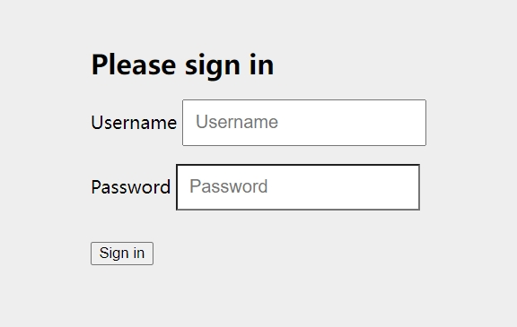
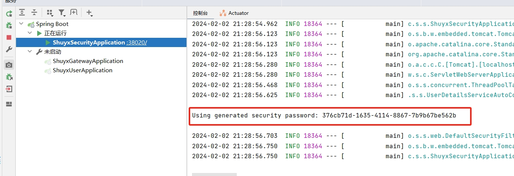

[toc]

# Spring Security笔记1

## Spring Security 介绍

Spring Security是 Spring 官方开源的一个安全框架。利用Spring的IOC/AOP功能，为整个系统提供安全访问功能。

Spring Security框架的目的是减少系统中安全控制相关代码的重复工作。能够最大效率的帮助开发者快速开发系统中的安全访问功能。

> 什么是系统中的安全访问功能？

通常来讲系统中的安全访问功能主要包括两点：认证 和 授权。

- 认证：是指系统判断当前用户是否能够登录到系统中。
- 授权：是指系统判断用户的当前操作是否有权限执行。

## 第一个Spring Security 项目

① 创建一个springboot工程

② 导入Spring Security依赖

```xml
<!--Spring Security的依赖-->
<dependency>
    <groupId>org.springframework.boot</groupId>
    <artifactId>spring-boot-starter-security</artifactId>
</dependency>
<!--web依赖用来测试的-->
<dependency>
    <groupId>org.springframework.boot</groupId>
    <artifactId>spring-boot-starter-web</artifactId>
</dependency>
```

- Security的依赖是直接继承springboot的依赖，所以不用写版本号。
- web依赖中内置了tomcat web容器。是用来测试的。

③ 添加配置

```yml
server:
  ## 服务运行端口
  port: 38020
spring:
  ## 服务名称
  application:
    name: shuyx-security
```

④ 启动服务，访问登录页面

访问 `http://localhost:38020/login`路径，可以发现下面的login页面。



- 这个login登录页面，是Spring Security自动生成的登录页面。
- 登录页面的账户是user，密码是随机生成的，可以在控制台上找到。



- 登录成功后，我们才可以访问其他路径。
- 如果登录失败，或者没有登录，那么我们只能访问/login路径，访问其他路径会被自动跳转到/login路径。


