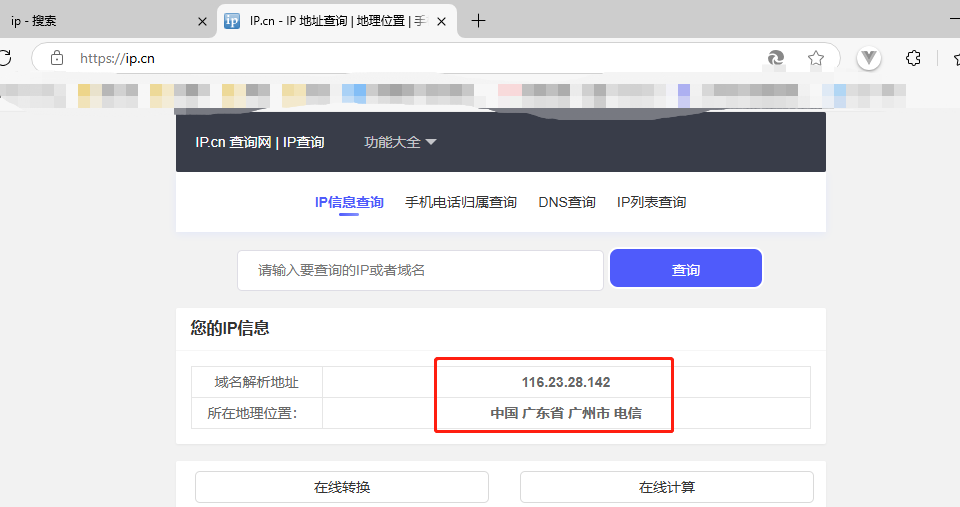
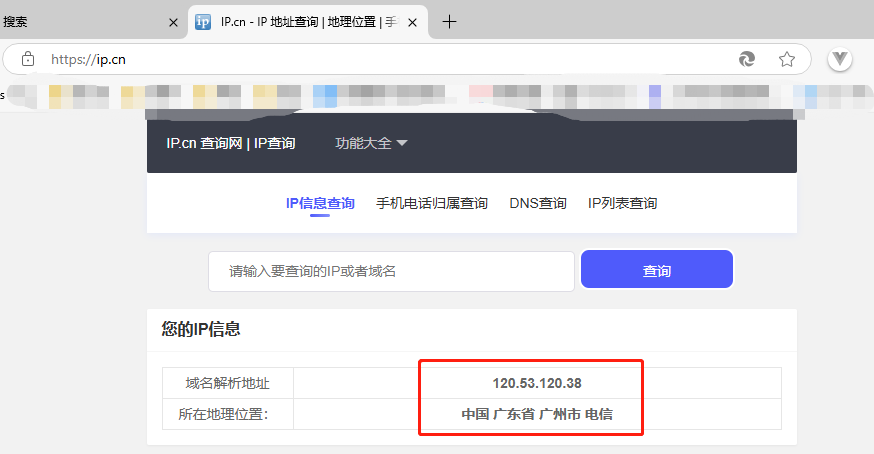

[toc]

# Squid笔记

## Squid介绍

Squid是一款非常流行的开源代理和缓存服务器。它主要用于各种网络协议的内容缓存，以提高访问速度，减少带宽使用，并提供更有效的网络服务。

[Squid官网 https://www.squid-cache.org/](https://www.squid-cache.org/)

> Squid的特点

1. 缓存和加速：Squid可以缓存请求的网页、图片和其他文件，这样当同一个资源再次被请求时，它可以快速从本地缓存提供，而不是每次都从原始服务器下载。
2. 控制访问：Squid可以用来控制哪些内容可以被用户访问。它支持强大的访问控制列表（ACLs），允许管理员根据源地址、目的地、使用的协议等标准过滤内容。
3. 提供安全性：Squid可以作为一个透明代理来提高网络安全，可以用来拦截恶意流量和提供 SSL/TLS加密的代理服务。
4. 减少带宽使用：通过缓存频繁访问的内容，Squid可以显著减少带宽需求，特别是在网络连接有限或昂贵的环境中非常有用。
5. 提高响应时间：由于从近距离缓存提供内容，Squid能够减少数据的往返时间，从而提高响应速度。
6. 支持多种协议：Squid支持 HTTP、HTTPS、FTP等多种网络协议。

> Squid的使用场景

1. 企业网关：在企业环境中，Squid通常用作网关代理，来管理和监控员工的互联网使用。
2. ISP缓存解决方案：互联网服务提供商（ISP）使用 Squid来减少带宽使用，加快用户访问互联网资源的速度。
3. 内容分发网络：Squid可以用作内容分发网络（CDN）的一部分，来提供地理分布式的缓存服务。
4. 反向代理和负载均衡：Squid还可以配置为反向代理，用于负载均衡和为后端服务器提供缓存服务。
5. 安全和匿名浏览：Squid还可用于提高浏览的安全性和匿名性，尤其是当结合 VPN或 Tor使用时。

## Squid代理服务

通过在目标服务器上部署Squid代理服务，将目标服务器变成代理服务器。

用途1：将能够翻墙的服务器，变成代理服务器。然后通过本地服务器的代理设置去访问代理服务器。从而实现让本地服务器翻墙的效果。

用途2：若本地服务器的IP，已经被某个网站禁止了。导致本地服务器无法访问该网站。那么将一个第三方服务器变成代理服务器。通过本地服务器的代理设置去访问代理服务器，然后再去访问网站。从而实现解决网站封禁IP的方式。

## Docker部署Squid

1. 下载Squid的docker镜像

```bash
docker search squid
docker pull ubuntu/squid
```

2. 创建Squid配置文件 squid.conf

主要修改一处地方 `acl allowed_ips src 112.17.xx.xx`，其他不变。

```bash
acl localnet src 0.0.0.1-0.255.255.255  # RFC 1122 "this" network (LAN)
acl localnet src 10.0.0.0/8             # RFC 1918 local private network (LAN)
acl localnet src 100.64.0.0/10          # RFC 6598 shared address space (CGN)
acl localnet src 169.254.0.0/16         # RFC 3927 link-local (directly plugged) machines
acl localnet src 172.16.0.0/12          # RFC 1918 local private network (LAN)
acl localnet src 192.168.0.0/16         # RFC 1918 local private network (LAN)
acl localnet src fc00::/7               # RFC 4193 local private network range
acl localnet src fe80::/10              # RFC 4291 link-local (directly plugged) machines
acl SSL_ports port 443
acl Safe_ports port 80          # http
acl Safe_ports port 21          # ftp
acl Safe_ports port 443         # https
acl Safe_ports port 70          # gopher
acl Safe_ports port 210         # wais
acl Safe_ports port 1025-65535  # unregistered ports
acl Safe_ports port 280         # http-mgmt
acl Safe_ports port 488         # gss-http
acl Safe_ports port 591         # filemaker
acl Safe_ports port 777         # multiling http
acl CONNECT method CONNECT
# 这里配置哪些ip可以使用本代理服务器，多个用空格隔开或写到文件里
# 例如可以写为 acl allowed_ips src 116.23.0.0/16 
acl allowed_ips src 112.17.xx.xx
http_access deny !Safe_ports
http_access deny CONNECT !SSL_ports
http_access allow localhost manager
http_access deny manager
http_access allow localhost
http_access allow localnet
# 这里运行自己配置的ip
http_access allow allowed_ips
# 其他一律拒绝
http_access deny all
# 绑定ip和端口号
http_port 0.0.0.0:3128
coredump_dir /var/spool/squid
refresh_pattern ^ftp:           1440    20%     10080
refresh_pattern ^gopher:        1440    0%      1440
refresh_pattern -i (/cgi-bin/|\?) 0     0%      0
refresh_pattern \/(Packages|Sources)(|\.bz2|\.gz|\.xz)$ 0 0% 0 refresh-ims
refresh_pattern \/Release(|\.gpg)$ 0 0% 0 refresh-ims
refresh_pattern \/InRelease$ 0 0% 0 refresh-ims
refresh_pattern \/(Translation-.*)(|\.bz2|\.gz|\.xz)$ 0 0% 0 refresh-ims
refresh_pattern .               0       20%     4320
logfile_rotate 0

```

3. 运行容器

```bash
# 3128 是Squid容器的默认端口
# /usr/local/squid:/etc/squid/ 宿主机的/usr/local/squid目录映射Squidr容器的/etc/squid/目录。

docker run --name mySquid -d --restart=always --publish 33128:3128 --volume /usr/local/squid:/etc/squid/ ubuntu/squid:latest
```

注意：squid的配置文件squid.conf需要存放到宿主机的/usr/local/squid目录中，这样Squid容器才能读取配置文件中的信息。

## 测试代理效果

1. 本地服务器设置代理前。访问查询IP网站。



2. 本地服务器添加代理后。再次访问查询IP网站。可以发现IP变化。




## Squid和VPN的区别

Squid是一个功能强大且灵活的工具，它的应用范围从简单的缓存代理到复杂的网络流量管理和安全增强。它的高度可配置性使它适用于各种网络环境，从小型办公室到大型企业和 ISP网络。

但是Squid和VPN还是有区别的：
- Squid主要用于缓存和控制 HTTP/HTTPS流量，而 VPN用于保护整个网络连接的安全和隐私。
- Squid在隐私保护方面不如 VPN，因为它不会对所有流量进行加密，也不会隐藏用户的真实 IP地址。
- Squid的配置可能比 VPN复杂，尤其是在进行高级过滤和控制时。

