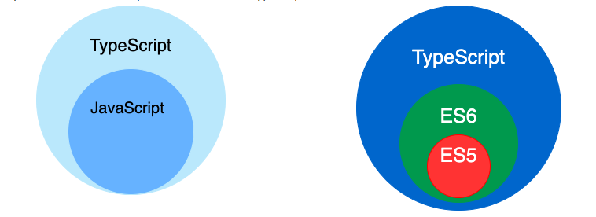
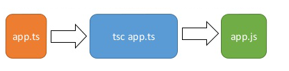
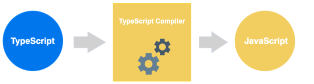
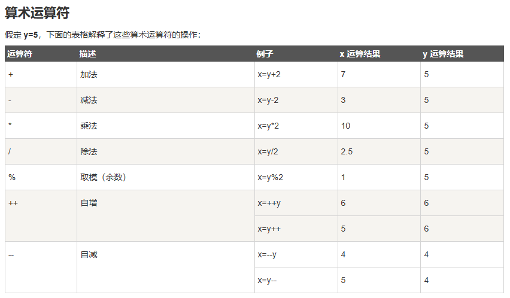
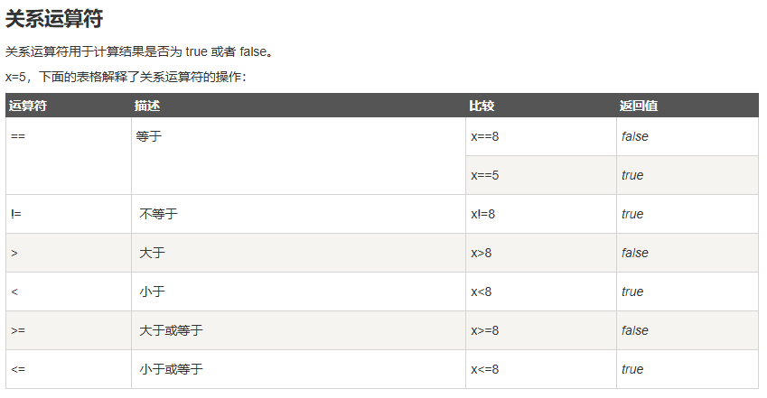
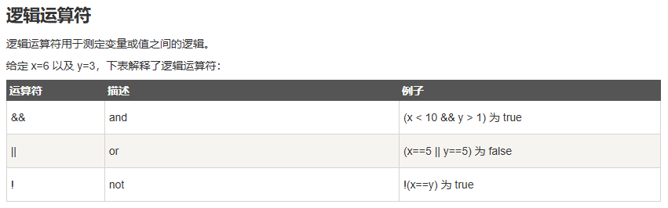
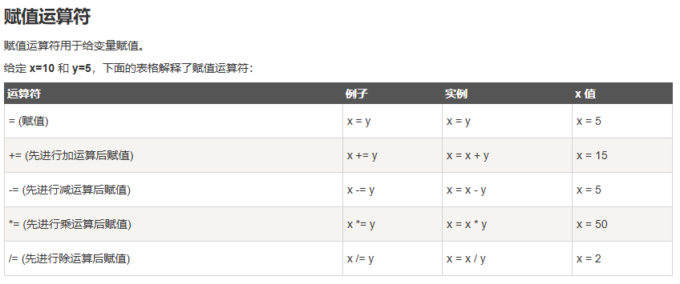
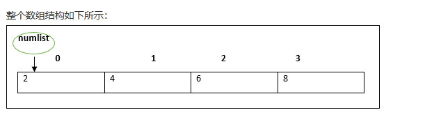
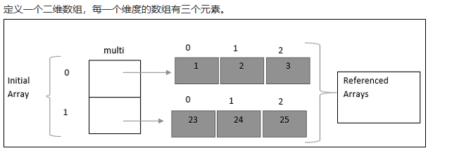

[toc]

# TypeScript笔记1

## TypeScript 介绍

TypeScript 由微软开发的自由和开源的编程语言。TypeScript 是 JavaScript 的一个超集，它的设计目标是开发大型应用，它可以编译成纯 JavaScript，编译出来的 JavaScript 可以运行在任何浏览器上。

> JavaScript 与 TypeScript 的区别

TypeScript 是 JavaScript 的超集，扩展了 JavaScript 的语法。

因此现有的 JavaScript 代码可与 TypeScript 代码一起工作无需任何修改，TypeScript 通过类型注解提供编译时的静态类型检查。

TypeScript 可处理已有的 JavaScript 代码，并只对其中的 TypeScript 代码进行编译。



## TypeScript 安装

> NPM 安装 TypeScript

```js
// 配置国内镜像
$ npm config set registry https://registry.npmmirror.com

// 全局安装 TypeScript
$ npm install -g typescript

// 查询 TypeScript 版本
$ tsc -v
Version 5.5.4
```

tsc 全称是 typescript compiler , 即 typescript 编译器。

## 第一个 TS 例子 (Hello World)

① 新建一个 app.ts 的文件，代码如下：

```ts
var message:string = "Hello World" 
console.log(message)
```

TypeScript 代码文件的扩展名是`.ts `。

② 把ts代码转化为js代码

执行以下命令将 TypeScript 转换为 JavaScript 代码。

```bash
tsc app.ts
```

TypeScript 转换为 JavaScript 代码,如图所示。


此时在当前目录下（与 app.ts 同一目录）就会生成一个 app.js 文件，代码如下：

```js
var message = "Hello World";
console.log(message);
```

③ 使用 Node 命令来执行 app.js 文件

```js
$ node app.js 
Hello World
```

TypeScript 转换为 JavaScript 过程如下图所示



## 基础语法

### 保留关键字

TypeScript 的部分保留关键字如下所示。

```ts
break	as	catch	switch
case	if	throw	else
var	number	string	get
module	type	instanceof	typeof
public	private	enum	export
finally	for	while	void
null	super	this	new
in	return	true	false
any	extends	static	let
package	implements	interface	function
do	try	yield	const
```

### 区分大小写

TypeScript 区分大写和小写字符。

### 注释

- 单行注释 ( // )  在 // 后面的文字都是注释内容。
- 多行注释 (/* */) 这种注释可以跨越多行。

```ts
// 这是一个单行注释
 
/* 
 这是一个多行注释 
 这是一个多行注释 
 这是一个多行注释 
*/
```

## 基础数据类型

TypeScript 的基础数据类型如下所示

### 任意类型 any

any 任意类型的变量，可以赋予任意类型的值。

any 是 TypeScript 针对编程时类型不明确的变量使用的一种数据类型，它常用于以下三种情况。

1. 变量的值会动态改变时，比如来自用户的输入，任意值类型可以让这些变量跳过编译阶段的类型检查。
2. 改写现有代码时，任意值允许在编译时可选择地包含或移除类型检查。
3. 定义存储各种类型数据的数组时。any类型数组可以存储任意类型的数据元素。


```ts
// 情况1
let x: any = 1;    // 数字类型
x = 'I am who I am';    // 字符串类型
x = false;    // 布尔类型

// 情况2
let x: any = 4;
x.ifItExists();    // 正确，ifItExists方法在运行时可能存在，但这里并不会检查
x.toFixed();    // 正确

// 情况3
let arrayList: any[] = [1, false, 'fine'];
arrayList[1] = 100;
```

### 浮点数类型 number

number 类型的变量，用来表示整数和分数。是双精度 64 位浮点值。

```ts
let a: number = 0b1010; // 二进制
let b: number = 0o744;    // 八进制
let c: number = 6;    // 十进制
let d: number = 0xf00d;    // 十六进制
```

<font color="red">注意：TypeScript 和 JavaScript 都没有整数类型。</font>

### 字符串类型	string

string 类型的变量，用来表示字符串。

```ts
let name: string = "Runoob";
let years: number = 5;
let words: string = `您好，今年是 ${ name } 发布 ${ years + 1} 周年`;
```

单引号（'）或双引号（"）是字符串类型。反引号（`）用来定义多行文本和内嵌表达式。

### 布尔类型 boolean

boolean 类型的变量，用来表示逻辑值：true 和 false。

```ts
let flag: boolean = true;
```

### 枚举类型 enum

enum 类型的变量，用于定义数值集合。

```ts
enum Color {Red, Green, Blue};
let c: Color = Color.Blue;
console.log(c);    // 输出 2
```

### void类型

void类型用于标识方法返回值的类型，表示该方法没有返回值。

```ts
// 表示该方法无返回值
function hello(): void {
    alert("Hello Runoob");
}
```

### null类型

null类型表示对象值缺失。

在 JavaScript 中 null 表示 "什么都没有"。

null是一个只有一个值的特殊类型。表示一个空对象引用。用 typeof 检测 null 变量返回是 object。

### undefined类型

在 JavaScript 中, undefined 是一个没有设置值的变量。

用 typeof 检测 undefined 变量返回是 undefined。

### never类型

never 是其它类型（包括 null 和 undefined）的子类型，代表从不会出现的值。

这意味着声明为 never 类型的变量只能被 never 类型所赋值，在函数中它通常表现为抛出异常或无法执行到终止点（例如无限循环）。

```ts
let x: never;
let y: number;

// 编译错误，数字类型不能转为 never 类型
x = 123;

// 运行正确，never 类型可以赋值给 never类型
x = (()=>{ throw new Error('exception')})();

// 运行正确，never 类型可以赋值给 数字类型
y = (()=>{ throw new Error('exception')})();

// 返回值为 never 的函数可以是抛出异常的情况
function error(message: string): never {
    throw new Error(message);
}

// 返回值为 never 的函数可以是无法被执行到的终止点的情况
function loop(): never {
    while (true) {}
}

```

## 变量

变量是一种使用方便的占位符，可以把变量看做存储数据的容器。

TypeScript 变量的命名规则：
- 变量名称可以包含数字和字母。
- 除了下划线 _ 和美元 $ 符号外，不能包含其他特殊字符，包括空格。
- 变量名不能以数字开头。

### 声明变量的类型及初始值

```ts
// 语法如下
var [变量名] : [类型] = 初始值;
var [变量名] : [类型];
// 不设置变量的类型，TypeScript 会根据值的类型，来推断出变量类型。
// 如果TypeScript不能推断出类型，则变量被视作 any 类型。
var [变量名] = 值;
// 不设置类型和初始值，表示该变量的类型可以是任意类型，并且变量的默认初始值为 undefined：
var [变量名];

//例子如下
var a:string = "Runoob";
var b:string;
var c = "Runoob";
var d;

```

TypeScript 遵循强类型，如果将不同的类型赋值给变量会编译错误。如下所示

```ts
var num:number = "hello"     // 这个代码会编译错误
```

### 变量类型推断

当变量的类型没有明确给出时，TypeScript 编译器利用变量的值来推断出变量的类型。

```ts
var num = 2;    // 推断变量num的类型为 number
num = "12";    // 编译错误
//error TS2322: Type '"12"' is not assignable to type 'number'.
```

第二行代码，编译错误的原因是变量num的类型为number，无法赋予字符串的值。

### 变量作用域

变量作用域指定了变量生效的范围。

TypeScript 有以下几种作用域：
- 全局作用域 ： 全局变量定义在程序结构的外部，它可以在你代码的任何位置使用。
- 类作用域 ：这个变量也可以称为类变量，类变量声明在一个类里头。在类的内部中可以直接使用类变量。在类的外部，需要通过类的对象来访问该类变量。 类变量也可以设置为静态的，静态的类变量可以通过类名直接访问。
- 局部作用域 ：又称局部变量。局部变量只能在声明它的一个代码块（如：方法）中使用。方法中定义的变量就是一种局部变量。

```ts
var global_num = 12          // 全局变量

//Numbers类
class Numbers { 
   num_val = 13;             // 实例变量
   static sval = 10;         // 静态变量

   //storeNum方法
   storeNum():void { 
      var local_num = 14;    // 局部变量
   } 
} 

console.log("全局变量为: "+global_num)  
console.log("静态变量为: "+Numbers.sval)
var obj = new Numbers(); 
console.log("实例变量为: "+obj.num_val)

//运行结果如下
// 全局变量为: 12
// 静态变量为：10
// 实例变量为: 13
```

## 运算符

TypeScript 主要包含以下几种运算：
```
算术运算符
逻辑运算符
关系运算符
按位运算符
赋值运算符
三元/条件运算符
类型运算符
```

> 算术运算符



> 关系运算符

关系运算符用于计算结果是否为 true 或者 false。



> 逻辑运算符

逻辑运算符用于测定变量或值之间的逻辑。



> 位运算符

位操作是程序设计中对位模式按位或二进制数的一元和二元操作。


> 赋值运算符

赋值运算符用于给变量赋值。



> 三元运算符

三元运算符的作用：判断表达式，决定哪个值应该赋值给变量。

```ts
//语法如下
//如果表达式返回 true ，则返回语句1。否则返回语句2
表达式 ? 语句1 : 语句2


var num:number = -2 
var result = num > 0 ? "大于 0" : "小于 0，或等于 0" 
console.log(result)   //小于 0，或等于 0

```

> 类型运算符 typeof

typeof 运算符作用是返回变量的数据类型。

```ts
var num = 12 
console.log(typeof num);   //输出结果: number
```

## 条件语句

在 TypeScript 中，有以下条件语句：
- if 语句 - 只有当指定条件为 true 时，使用该语句来执行代码
- if...else 语句 - 当条件为 true 时执行代码，当条件为 false 时执行其他代码
- if...else if....else 语句- 使用该语句来选择多个代码块之一来执行
- switch 语句 - 使用该语句来选择多个代码块之一来执行

### if 语句

if 语句由一个布尔表达式后跟一个或多个语句组成。

```ts
// 语法格式
if(boolean_expression){
    // 在布尔表达式 boolean_expression 为 true 执行
}

//例子
var num:number = 5
if (num > 0) { 
   console.log("数字是正数") 
}

```

### if...else 语句

一个 if 语句后可跟一个可选的 else 语句，else 语句在布尔表达式为 false 时执行。

```ts
// 语法格式
if(boolean_expression){
   //在布尔表达式 boolean_expression 为 true 执行
}else{
   //在布尔表达式 boolean_expression 为 false 执行
}

//例子
var num:number = 12; 
if (num % 2==0) { 
    console.log("偶数"); 
} else {
    console.log("奇数"); 
}
```

### if...else if....else 语句

if...else if....else 语句在执行多个判断条件的时候很有用。

```ts
// 语法格式
if(boolean_expression 1) {
    // 在布尔表达式 boolean_expression 1 为 true 执行
} else if( boolean_expression 2) {
    // 在布尔表达式 boolean_expression 2 为 true 执行
} else if( boolean_expression 3) {
    // 在布尔表达式 boolean_expression 3 为 true 执行
} else {
    // 布尔表达式的条件都为 false 时执行
}

//例子
var num:number = 2 
if(num > 0) { 
    console.log(num+" 是正数") 
} else if(num < 0) { 
    console.log(num+" 是负数") 
} else { 
    console.log(num+" 不是正数也不是负数") 
}
```

### switch…case 语句

一个 switch 语句允许测试一个变量等于多个值时的情况。每个值称为一个 case，且被测试的变量会对每个 switch case 进行检查。

注意：
- switch 语句中的 expression 表达式，可以是任何类型。
- 一个 switch 中可以有任意数量的 case 语句。每个 case 后跟一个要比较的值和一个冒号。
- case 的 constant-expression 必须与 switch 的 expression 表达式具有相同或兼容的数据类型。
- 当expression 表达式的结果等于 case 中的constant-expression时，case 后跟的语句将被执行，直到遇到 break 语句为止。
- 不是每一个 case 都需要包含 break。如果 case 语句不包含 break，控制流将会 继续 后续的 case，直到遇到 break 为止。
- 当遇到 break 语句时，switch 终止，控制流将跳转到 switch 语句后的下一行。
- 一个 switch 语句可以有一个可选的 default case，出现在 switch 的结尾。default 关键字则表示当表达式的值与所有 case 值都不匹配时执行的代码块。default case 中的 break 语句不是必需的。

```ts
// 语法格式
switch(expression){
    case constant-expression  :
       statement(s);
       break; /* 可选的 */
    case constant-expression  :
       statement(s);
       break; /* 可选的 */
  
    /* 您可以有任意数量的 case 语句 */
    default : /* 可选的 */
       statement(s);
}


//例子
var grade:string = "A"; 
switch(grade) { 
    case "A": { 
        console.log("优"); 
        break; 
    } 
    case "B": { 
        console.log("良"); 
        break; 
    } 
    case "C": {
        console.log("及格"); 
        break;    
    } 
    case "D": { 
        console.log("不及格"); 
        break; 
    }  
    default: { 
        console.log("非法输入"); 
        break;              
    } 
}
```


## 循环语句

循环语句允许我们多次执行一个语句或语句组。

### for 循环语句

```ts
// 语法格式
for ( init; condition; increment ){
    statement(s);
}

// statement(s) 可以是一个单独的语句，也可以是几个语句组成的代码块。
// condition 可以是任意的表达式，当条件为 true 时执行循环，当条件为 false 时，退出循环。
```

for 循环的控制流程解析：
1. init 会首先被执行，且只会执行一次。也可以不在这里写任何语句，只要有一个分号出现即可。
2. 接下来，会判断 condition 表达式。如果为 true，则执行循环主体。如果为 false，则不执行循环主体，且控制流会跳转到紧接着 for 循环的下一条语句。
3. 在执行完 for 循环主体后，控制流会跳回上面的 increment 语句。该语句允许您更新循环控制变量。该语句可以留空，只要在条件后有一个分号出现即可。
4. 条件再次被判断。如果为 true，则执行循环，这个过程会不断重复（循环主体，然后增加步值，再然后重新判断条件）。在条件变为 false 时，for 循环终止。

```ts
// 例子
var num:number = 5; 
var i:number; 
var factorial = 1; 
 
for(i = num;i >= 1;i--) {
   factorial *= i;
}
console.log(factorial)

```

### for...in 循环语句

for...in 语句用于一组值的集合或列表进行迭代输出。

```ts
// 语法格式
for (var val in list) { 
    //语句 
}

//例子
var j:any; 
var n:any = "a b c" 
for(j in n) {
    console.log(n[j])  
}
```

### forEach 循环语句

```ts
//例子
let list = [4, 5, 6];
list.forEach((val, idx, array) => {
    // val: 当前值
    // idx：当前index
    // array: Array
});
```

### for…of 循环语句

for...of 语句创建一个循环来迭代可迭代的对象。在 ES6 中引入的 for...of 循环，以替代 for...in 和 forEach() 语句。

for...of 允许你遍历 Arrays（数组）, Strings（字符串）, Maps（映射）, Sets（集合）等可迭代的数据结构等。

```ts
//例子
let someArray = [1, "string", false];
 
for (let entry of someArray) {
    console.log(entry); // 1, "string", false
}
```

### while 循环

while 语句在给定条件为 true 时，重复执行语句或语句组。

- statement(s) 可以是一个单独的语句，也可以是几个语句组成的代码块。
- condition 可以是任意的表达式，当条件为 true 时执行循环。 当条件为 false 时，程序流将退出循环。

```ts
// 语法格式如下
while(condition)
{
   statement(s);
}

// 例子
var num:number = 5; 
var factorial:number = 1; 
 
while(num >= 1) { 
    factorial = factorial * num; 
    num--; 
} 
console.log("5 的阶乘为："+factorial);
// 5 的阶乘为：120
```

### do...while 循环

do...while 循环是在循环的尾部检查它的条件。

```ts
// 语法格式如下
do
{
   statement(s);
}while( condition );


// 例子
var n:number = 10;
do { 
    console.log(n); 
    n--; 
} while(n >= 0);
```

do...while 循环的条件表达式出现在循环的尾部，所以循环中的 statement(s) 会在条件被测试之前至少执行一次。

### break 语句

break 语句有以下两种用法：
1. 用法1：当 break 语句出现在一个循环内时，循环会立即终止，且程序流将继续执行紧接着循环的下一条语句。
2. 用法2：它可用于终止 switch 语句中的一个 case。

如果您使用的是嵌套循环（即一个循环内嵌套另一个循环），break 语句会停止执行最内层的循环，然后开始执行该块之后的下一行代码。

```ts
//语法格式
break;

// 例子
var i:number = 1 
while(i<=10) { 
    if (i % 5 == 0) {   
        console.log ("在 1~10 之间第一个被 5 整除的数为 : "+i) 
        break;     // 找到一个后退出循环
    } 
    i++ 
}  // 输出 5 然后程序执行结束

```

### continue 语句

continue 语句有点像 break 语句。但它不是强制终止，continue 会跳过当前循环中的代码，强迫开始下一次循环。

对于 for 循环，continue 语句执行后自增语句仍然会执行。对于 while 和 do...while 循环，continue 语句会重新执行条件判断语句。

```ts
//语法格式
continue;

// 例子
var num:number = 0
var count:number = 0;
for(num=0;num<=20;num++) {
    if (num % 2==0) {
        continue
    }
    count++
}
console.log ("0 ~20 之间的奇数个数为: "+count)    //输出10个偶数

```

### 无限循环

无限循环就是一直在运行不会停止的循环。 for 和 while 循环都可以创建无限循环。

```ts
for(;;) { 
   console.log("这段代码会不停的执行") 
}

while(true) { 
   console.log("这段代码会不停的执行") 
}
```

## 数组

数组是一个用来存储一系列的值的数据类型。

```ts
//语法如下
var array_name[:datatype];        //声明 
array_name = [val1,val2,valn..]   //初始化
//或者
var array_name[:datatype] = [val1,val2…valn]


// 定义一个numlist变量，数据类型是 number 类型的数组
var numlist:number[] = [2,4,6,8]
console.log(numlist[0]);   //2
console.log(numlist[1]);   //4
```



### 遍历数组

```ts
var j:any; 
var nums:number[] = [1001,1002,1003,1004] 
//遍历数组
for(j in nums) { 
    console.log(nums[j]) 
}
```

### 多维数组

一个数组的元素可以是另外一个数组，这样就构成了多维数组。

```ts
//多维数组定义如下
var arr_name:datatype[][]=[ [val1,val2,val3],[v1,v2,v3] ]

//例子,定义一个二维数组，每一个维度的数组有三个元素。
var multi:number[][] = [[1,2,3],[23,24,25]]  
console.log(multi[0][0])    //1
console.log(multi[0][1])    //2
console.log(multi[0][2])    //3
console.log(multi[1][0])    //23
console.log(multi[1][1])    //24
console.log(multi[1][2])    //25
```



### 常见数组方法

> concat() 连接两个或更多的数组，并返回结果。

```ts
var alpha = ["a", "b", "c"]; 
var numeric = [1, 2, 3];

var alphaNumeric = alpha.concat(numeric); 
console.log("alphaNumeric : " + alphaNumeric );    // a,b,c,1,2,3   

```

> filter() 检测数值元素，并返回符合条件所有元素的数组。

```ts
function isBigEnough(element, index, array) { 
   return (element >= 10); 
} 
var passed = [12, 5, 8, 130, 44].filter(isBigEnough); 
console.log("Test Value : " + passed ); // 12,130,44

```

> forEach() 数组每个元素都执行一次回调函数。

```ts
let num = [7, 8, 9];
num.forEach(function (value) {
    console.log(value);
}); 

```

> indexOf()

搜索数组中的元素，并返回它所在的位置。如果搜索不到，返回值 -1，代表没有此项。

```ts
var index = [12, 5, 8, 130, 44].indexOf(8); 
console.log("index is : " + index );  // 2
```

> join() 把数组的所有元素放入一个字符串。

```ts
var arr = new Array("Google","Runoob","Taobao"); 
          
var str = arr.join(); 
console.log("str : " + str );  // Google,Runoob,Taobao
var str = arr.join(", "); 
```

> toString() 把数组转换为字符串，并返回结果。

```ts
var arr = new Array("orange", "mango", "banana", "sugar");         
var str = arr.toString(); 
console.log("Returned string is : " + str );  // orange,mango,banana,sugar
```

> sort() 对数组的元素进行排序。

```ts
var arr = new Array("orange", "mango", "banana", "sugar"); 
var sorted = arr.sort(); 
console.log("Returned string is : " + sorted );  // banana,mango,orange,sugar
```

> push() 向数组的末尾添加一个或更多元素，并返回新的长度。

```ts
var numbers = new Array(1, 4, 9); 
var length = numbers.push(10); 
console.log("new numbers is : " + numbers );  // 1,4,9,10 
```

> pop() 删除数组的最后一个元素并返回删除的元素。

```ts
var numbers = [1, 4, 9]; 
var element = numbers.pop(); 
console.log("element is : " + element );  // 9
```

## 元组

数组中元素的数据类型都一般是相同的（any[] 类型的数组可以不同）。

TypeScript 中的元组（Tuple）是一种特殊类型的数组，它允许在数组中存储不同类型的元素，与普通数组不同，元组中的每个元素都有明确的类型和位置。

元组可以在很多场景下用于表示固定长度、且各元素类型已知的数据结构。

```ts
//语法
let tuple: [类型1, 类型2, 类型3, ...];

//例子，定义一个元组mytuple
let mytuple: [number, string, boolean] = [42, "Runoob", true];
 
// 访问元组中的元素
let num = mytuple[0]; // 访问第一个元素，值为 42，类型为 number
let str = mytuple[1]; // 访问第二个元素，值为 "Runoob"，类型为 string
let bool = mytuple[2]; // 访问第三个元素，值为 true，类型为 boolean
 
console.log(num);  // 输出: 42
console.log(str);  // 输出: Runoob
console.log(bool); // 输出: true
```

### 元组的常用方法

> push() 和 pop() 方法

push() 向元组添加元素，添加在最后面。pop() 从元组中移除元素（最后一个），并返回移除的元素。

```ts
let tuple = [42, "Hello"];
tuple.push("World"); 
console.log(tuple); // 输出: [42, "Hello", "World"]

let tuple: [number, string, boolean] = [42, "Hello", true];
let lastElement = tuple.pop();
console.log(tuple);       // 输出: [42, "Hello"]
```

> concat()方法

concat 方法可以连接多个元组，但需要注意连接后的结果是一个普通的数组，而不是元组。

```ts
let tuple1: [number, string] = [42, "Hello"];
let tuple2: [boolean, number] = [true, 100];

let result = tuple1.concat(tuple2);
console.log(result); // 结果是一个数组 [42, "Hello", true, 100]
```

> slice()方法

slice 方法可以对元组进行切片操作，返回一个新的数组。

```ts
let tuple: [number, string, boolean] = [42, "Hello", true];
let sliced = tuple.slice(1); // 从索引 1 开始切片
console.log(sliced); // 输出: ["Hello", true]
```

### 扩展元组

使用剩余运算符可以轻松地将多个元组合并成一个新的元组。

```ts
let tuple1: [number, string] = [42, "Hello"];
let tuple2: [boolean] = [true];

let extendedTuple: [number, string, ...typeof tuple2] = [42, "Hello", ...tuple2];
console.log(extendedTuple); // 输出: [42, "Hello", true]
```

### 元组转换为数组

元组是一个固定长度、固定类型的数组，但可以通过 Array.prototype 的方法将其转换为普通数组进行进一步处理。

```ts
let tuple: [number, string, boolean] = [42, "Hello", true];

// 转换为数组并使用数组方法
let array = Array.from(tuple);
array.push("New Element");

console.log(array); // 输出: [42, "Hello", true, "New Element"]
```

