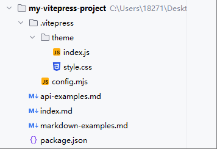
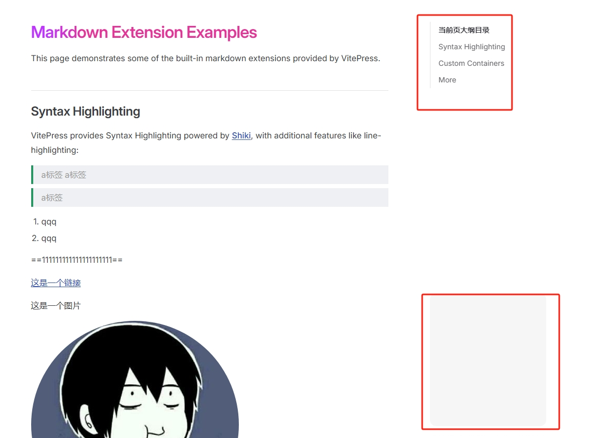
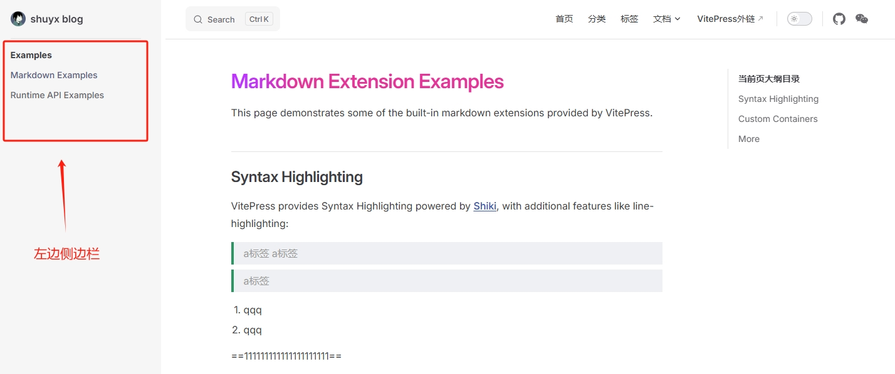
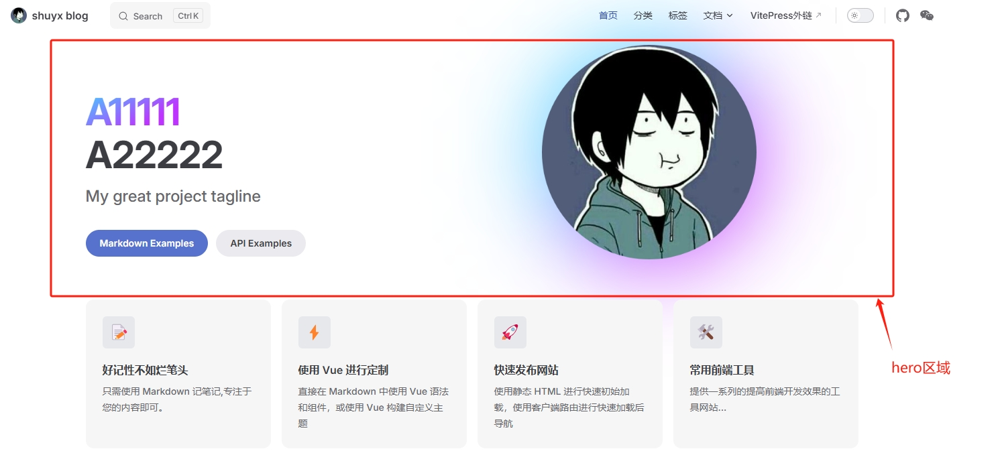
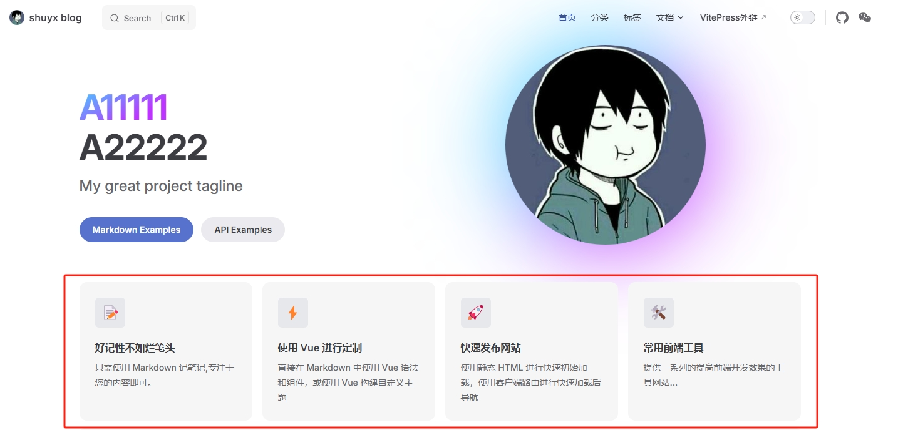

[toc]

# VitePress笔记1


目前最新的vitepress版本为 1.6.3

VitePress 由 Vite 和 Vue 驱动的静态站点生成器（SSG框架）。它简单、强大、快速,可以快速将 Markdown 变成优雅的文档。

[VitePress官网：https://vitepress.dev/zh/](https://vitepress.dev/zh/)
[VitePress 中文官网：https://vitepress.vuejs.org/zh/](https://vitepress.vuejs.org/zh/logo.png)
[VitePress 快速上手中文教程 https://vitepress.yiov.top/](https://vitepress.yiov.top/logo.png)


> 什么是静态站点生成器（SSG框架）？
> 静态站点生成器（SSG）是一种将网站的内容预渲染为静态 HTML 文件的工具。与传统的动态网站不同，SSG 在构建时生成静态文件，这些文件可以直接在服务器上部署，无需运行时的服务器配置。这使得静态站点生成器（SSG）成为构建高性能网站的理想选择。

> 静态站点生成器的工作原理如下：
> 1. 开发人员编写网站的内容和布局。
> 2. SSG 框架工具将内容和布局转换为静态 HTML 文件。
> 3. 这些静态文件可以直接部署在服务器上，无需运行时的服务器端代码和配置。
> 4. 当用户访问网站时，服务器返回预渲染的静态 HTML 文件，无需等待服务器端代码的执行。
> 5. 静态站点生成器还可以处理动态内容，例如博客文章、产品列表等。这些内容可以在构建时生成静态文件，或者使用服务器端渲染（SSR）在运行时生成。

## VitePress 安装

> 必备环境
>必装：安装nodejs
>建议安装：安装vscode编辑器
>可选安装：安装git版本控制工具

```bash
# 用npm包管理工具安装 VitePress
npm install -D vitepress
```

## 创建VitePress项目

```bash
# 创建一个目录，用于当作项目工程目录
mkdir my-vitepress-project

# 进入到项目工程目录中
cd my-vitepress-project

# 执行 初始化 VitePress 命令
npx vitepress init
```

初始化VitePress的时候,需要对如下选项进行下选择。如下所示
```
T  Welcome to VitePress!
|
o  Where should VitePress initialize the config?  # 选择vitepress项目的根目录。默认即可
|  ./
|
o  Site title:              # 选择vitepress项目的标题,默认即可
|  My Awesome Project
|
o  Site description:        # 选择vitepress项目的描述,默认即可
|  A VitePress Site
|
o  Theme:  # 选择vitepress项目的主题配置（有三种，默认、默认+自定义、自定义）选择第二种即可。
|  Default Theme + Customization
|
o  Use TypeScript for config and theme files? # 选择vitepress项目是否使用TypeScript
|  No
|
o  Add VitePress npm scripts to package.json? # 选择vitepress项目是否添加npm脚本
|  Yes
|
—  Done! Now run npm run docs:dev and start writing.

Tips:
- Since you've chosen to customize the theme, you should also explicitly install vue as a dev dependency.

```

如图是vitepress项目的工程目录结构



```
├─ my-vitepress-project         # vitepress项目根目录
│  ├─ .vitepress                # vitepress项目的配置目录
│  ├─ └─theme                   # 主题配置目录
│  ├─ ├─ ├─ index.js               # 主题相关的js文件      
│  ├─ ├─ └─ style.css              # 主题相关的css文件
│  ├─ └─ config.mjs             # vitepress项目的主题配置文件
│  ├─ api-examples.md           # 文章1
│  ├─ markdown-examples.md      # 文章2
│  └─ index.md                  # vitepress项目的首页markdown文件
└─ package.json                 # vitepress项目的依赖配置文件
```

在vitepress项目的根目录中，打开终端窗口，执行`npm run docs:dev`命令，即可启动vitepress项目。然后在浏览器中访问`http://localhost:5173/`，即可查看vitepress项目的首页。


## 配置

找到config.mjs文件。配置一般都在这个文件中编辑。更多的详细配置需要去vitepress官网查询。

### 网站元数据配置

```js
import { defineConfig } from 'vitepress'

// https://vitepress.dev/reference/site-config
// 网站元数据配置
export default defineConfig({
  lang: 'zh-CN',                        //网站语言设置 可选 en-US
  title: "VitePress1111111111111",      //网站标题名称 类似<title>网址名称</title>
  description: "我的vitpress文档教程22222222222222",  //网站描述 类似<meta name="description" content="网站描述">
  //favicon图标
  head: [
    ['link',{ rel: 'icon', href: '/favicon.ico'}],
  ],
  // 站点地图
  sitemap: {
    hostname: 'https://你的网址.com',
  },
})
```

### 多语言配置

要启用多语言支持，需要先在config.mjs文件中配置多语言。

```js
import { defineConfig } from 'vitepress'
export default defineConfig({
  locales: {
    root: {
      label: '简体中文',
      lang: 'Zh_CN',
    },
    en: {
      label: 'English',
      lang: 'en', // 可选，将作为 `lang` 属性添加到 `html` 标签中
      link: '/en/', // 默认 /fr/  会显示在导航栏翻译菜单上
      // 其余 locale 特定属性...
    },
    fr: {
      label: 'French',
      lang: 'fr',
      link: '/fr/',
    }
  }
})
```

然后需要使用如下的文件目录结构。本质上是新建一个目录,专门存放另一个语言的文件。注意：vitepress默认读取目录中的index文件。

```
├─ my-vitepress-project
│  ├─ en
│  │  ├─ index.md   # 英文首页
│  │  ├─ ...
│  │  ...
│  └─ fr
│  │  ├─ index.md   # 法语首页
│  │  ├─ ...
│  │  ...  
│  └─ index.md      # 中文首页(默认)
└─ package.json
```

## 默认主题的配置

vitepress默认提供一个主题。这个默认主题在config.mjs文件中配置。

```js
import { defineConfig } from 'vitepress'
export default defineConfig({
  //主题相关配置
  themeConfig: {
    //头部导航栏
    nav: [
      { text: '首页', link: '/' },
      { text: '分类',link: '/markdown-examples'},
      { text: '标签',link: '/markdown-examples'},
      {
        text: '文档',
        items: [
          { text: '前端', link: '/preface' },
          { text: '大数据', link: '/getting-started' },
          { text: '后端', link: '/configuration' }
        ]
      },
      { text: 'VitePress外链', link: 'https://vitepress.dev/' },
    ],
    // 头部导航栏的logo,会默认读取public目录下的logo.png文件。
    logo: '/logo.png',
    // 头部导航栏的标题
    siteTitle: 'shuyx blog',
    // 头部导航栏的社交链接部分
    socialLinks: [
      { icon: 'github', link: 'https://github.com/vuejs/vitepress' },
    ],
    //手机端深浅模式默认显示为Appearance,可修改
    darkModeSwitchLabel: '深浅模式', 
    //头部导航栏的本地搜索框
    search: { 
      provider: 'local'
    },
    //主页的页脚
    footer: { 
      message: 'Released under the MIT License.', 
      // 自动更新时间
      copyright: `Copyright © 2017- ${new Date().getFullYear()} present shuyx`, 
      // 带有备案号的文本
      // copyright: `Copyright © 2017-${new Date().getFullYear()} 备案号：<a href="https://beian.miit.gov.cn/" target="_blank">*****号</a>`, 
    },
    //文章展示页面的右侧的大纲目录 
    outline: { 
      level: 'deep', // 显示2-6级标题
      label: '当前页大纲目录' // 文字显示
    },
    //文章展示页面的底部的编辑链接，可跳转到指定网址进行在线编辑。
    editLink: { 
      pattern: 'https://github.com/vuejs/vitepress/edit/main/docs/:path', // 改成自己的仓库地址
      text: '在线编辑'
    },
    //文章展示页面的底部的 Carbon 广告展示
    carbonAds: { 
      code: 'your-carbon-code', 
      placement: 'your-carbon-placement', 
    }
  }
})


```


### 头部导航栏配置

先在vitepress项目的根目录中创建public目录。用来存放静态资源。

头部导航栏的配置包含以下内容：
1. 导航栏左边的logo和标题
3. 导航栏的下拉菜单
4. 导航栏的社交链接
5. 导航栏的本地搜索框
6. 导航栏的深浅模式切换按钮

配置如下
```js
export default defineConfig({
  //主题相关配置
  themeConfig: {
    //头部导航栏
    nav: [
      { text: '首页', link: '/' },
      { text: '分类',link: '/markdown-examples'},
      { text: '标签',link: '/markdown-examples'},
      {
        text: '文档',
        items: [
          { text: '前端', link: '/preface' },
          { text: '大数据', link: '/getting-started' },
          { text: '后端', link: '/configuration' }
        ]
      },
      { text: 'VitePress外链', link: 'https://vitepress.dev/' },
    ],
    // 头部导航栏的logo,会默认读取public目录下的logo.png文件。
    logo: '/logo.png',
    // 头部导航栏的标题
    siteTitle: 'shuyx blog',
    // 头部导航栏的社交链接部分
    socialLinks: [
      { icon: 'github', link: 'https://github.com/vuejs/vitepress' },
    ],
    //手机端深浅模式默认显示 Appearance,可自定义
    darkModeSwitchLabel: '深浅模式', 
    //头部导航栏的本地搜索框
    search: { 
      provider: 'local'
    },
  },
})
```

如图所示


### 首页页脚

```js
import { defineConfig } from 'vitepress'
export default defineConfig({
  //主题相关配置
  themeConfig: {
    //主页的页脚
    footer: { 
      message: 'Released under the MIT License.', 
      // 自动更新时间
      copyright: `Copyright © 2017-${new Date().getFullYear()} present shuyx`, 
      // 带有备案号的文本
      // copyright: `Copyright © 2017-${new Date().getFullYear()} 备案号：<a href="https://beian.miit.gov.cn/" target="_blank">*****号</a>`, 
    },
  }
})

```

如图所示


### 文章展示页面

在vitepress中文章展示页面专门用于展示文章内容的。我们可以对文章展示页面进行配置。

```js
import { defineConfig } from 'vitepress'
export default defineConfig({
  //主题相关配置
  themeConfig: {
    //文章展示页面的右侧的大纲目录 
    outline: { 
      level: 'deep', // 显示2-6级标题
      label: '当前页大纲目录' // 文字显示
    },
    //文章展示页面的底部的编辑链接，可跳转到指定网址进行在线编辑。
    editLink: { 
      pattern: 'https://github.com/vuejs/vitepress/edit/main/docs/:path', // 改成自己的仓库地址
      text: '在线编辑'
    },
    //文章展示页面的底部的 Carbon 广告展示
    carbonAds: { 
      code: 'your-carbon-code', 
      placement: 'your-carbon-placement', 
    },
  }
})

```



### 左边侧边栏

除首页之外。其他页面都会显示左边侧边栏。类似快捷页面，但是配置比较麻烦。也可以使用插件自动生成侧边栏。

```js
import { defineConfig } from 'vitepress'
export default defineConfig({
  //主题相关配置
  themeConfig: {
    //侧边栏
    sidebar: [
      {
        text: 'Examples',
        items: [
          { text: 'Markdown Examples', link: '/markdown-examples' },
          { text: 'Runtime API Examples', link: '/api-examples' }
        ]
      }
    ],
  }
})

```

如图


## Frontmatter

Frontmatter可以看作markdown文件的元数据。它包含了markdown文件的一些信息。例如标题、描述、标签、分类等。

Frontmatter实际就是md文件内容中最顶部的用`---`包含的内容。例如

```yaml
--- 
lang: zh-CN
title: VitePress
titleTemplate: Vite 和 Vue 强力驱动的静态网站生成器
description: 简单、强大、快速。满足你一直想要的现代SSG框架
---
```

vitepress最终会将markdown文件渲染为html页面，并根据md文件的frontmatter配置来进行不同的渲染。


### layout

layout属性有三个选项值。
1. home ：vitepress会将当前md文件作为首页渲染。一般都将根目录下的index.md文件作为首页。
2. doc  ：vitepress会将当前md文件作为文档页渲染。
3. page ：vitepress会将当前md文件作为无样式的文档页，自定义页面进行渲染

```markdown
layout: home
# layout: doc
# layout: page
```


### hero

hero类似居中区域

```md
# hero区域的配置
hero:
  # 文本
  name: "A11111"
  text: "A22222"
  tagline: My great project tagline
  # 图片
  image:
    src: /logo.png
    alt: logo.png
  actions:
    - theme: brand
      text: Markdown Examples
      link: /blogs/markdown-examples
    - theme: alt
      text: API Examples
      link: /blogs/api-examples
```

如图所示


### features

features类似居中偏下的区域，用于描述项目的一些功能特征。

```md
# features区域的配置
features:
  - icon: 📝
    title: 好记性不如烂笔头
    details: 只需使用 Markdown 记笔记,专注于您的内容即可。
  - icon: ⚡️
    title: 使用 Vue 进行定制
    details: 直接在 Markdown 中使用 Vue 语法和组件，或使用 Vue 构建自定义主题
  - icon: 🚀
    title: 快速发布网站
    details: 使用静态 HTML 进行快速初始加载，使用客户端路由进行快速加载后导航
  - icon: 🛠️
    title: 常用前端工具
    details: 提供一系列的提高前端开发效果的工具网站...
```

如图所示


### 导航栏

默认 true 开启，当开启时，该md文件渲染的页面会显示导航栏。可以选择关闭，但仅在当前md文件中不显示。

```md
---
navbar: false
---
```

### 侧边栏

默认 true 开启，当开启时，该md文件渲染的页面会显示侧边栏。可以选择关闭，仅在当前文档不显示

```md
---
sidebar: false
---
```

### 大纲

大纲默认在右侧，可以通过 aside 设置左侧或关闭，默认 true 开启。

```md
---
aside: left
---
```

### 页脚

默认 true 开启，当开启时，该md文件渲染的页面会在最底部显示页脚。可以选择关闭，仅在当前文档不显示。

```md
---
footer: false
---
```


