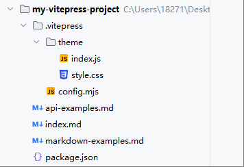
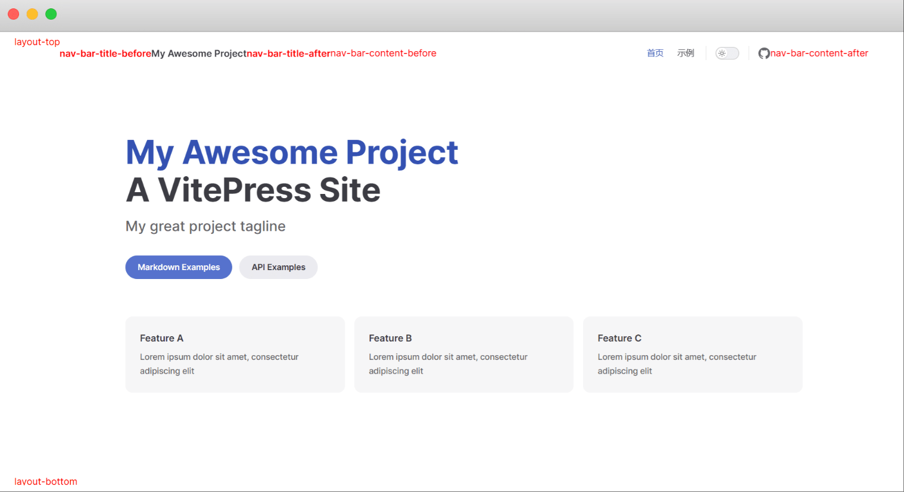
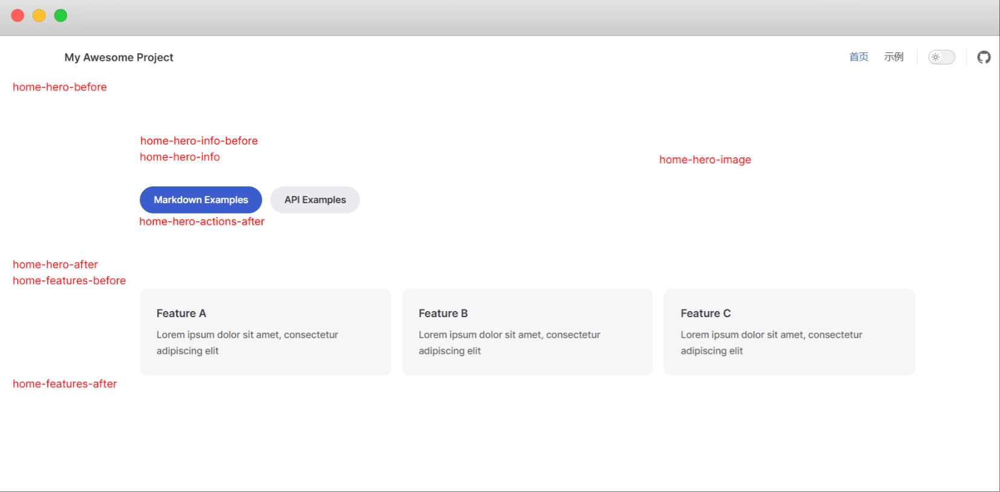
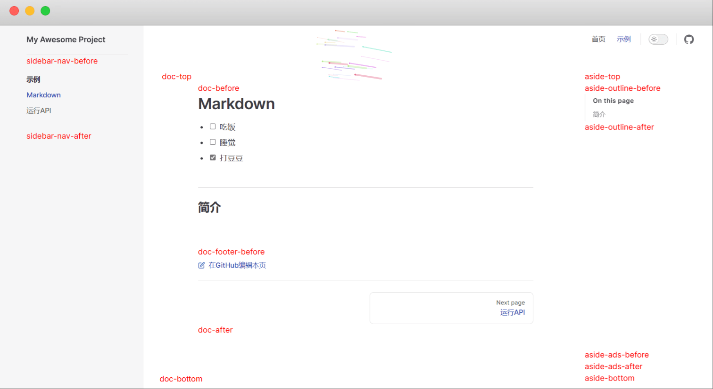
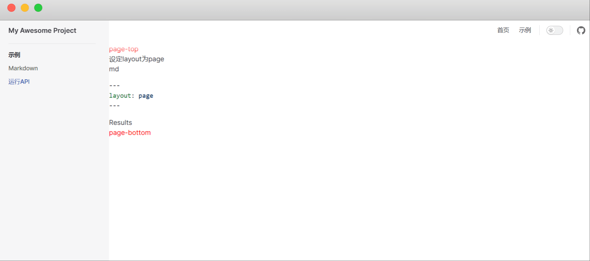
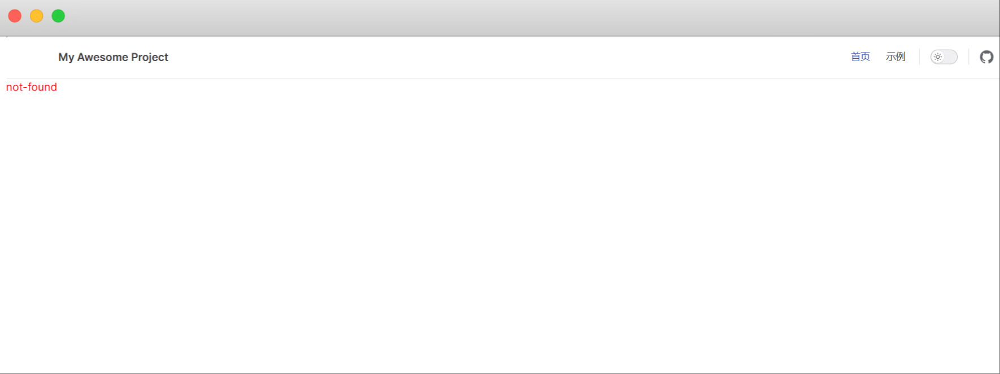

[toc]

# VitePress笔记2


目前最新的vitepress版本为 1.6.3

## 样式美化

当我们在创建vitepress项目中选择了默认+自定义的主题配置时。vitepress会自动在`.vitepress`目录中创建`theme`目录。如图所示。



如果想要美化vitepress的样式，就需要修改`theme`目录下的index.js文件和index.css文件。


### h1标题颜色

我们可以全局修改h1标题的颜色。

```CSS
/* .vitepress/theme/index.css */

/* 给h1标题弄个渐变颜色 */
.VPDoc h1 {
  background: -webkit-linear-gradient(10deg, #bd34fe 5%, #e43498 15%);
  background-clip: text;
  -webkit-background-clip: text;
  -webkit-text-fill-color: transparent;
}

```

### 给首页的feature添加悬停效果

```css
/* .vitepress/theme/index.css */

/* VPFeatures 页卡悬浮效果 */
.VPFeatures .items .item {
  transition: transform 0.3s;
}

.VPFeatures .items .item:hover {
  transform: translateY(-5px);
}
```

### 引用颜色

在Markdown中，常用的引用符号是 >，我们可以给这个符号添加一些样式。

```css
/* .vitepress/theme/index.css */

.vp-doc blockquote {
    border-radius: 10px;
    padding: 18px 20px 20px 15px;
    position: relative;
    background-color: var(--vp-c-gray-soft);
    border-left: 6px solid var(--vp-c-green-2);
}
```

### 导航栏毛玻璃效果

```css
/* .vitepress/theme/index.css */

:root {
    /* 首页下滑后导航透明 */
    .VPNavBar:not(.has-sidebar):not(.home.top) {
        background-color: rgba(255, 255, 255, 0);
        backdrop-filter: blur(10px);
    }

    /* 搜索框透明 */
    .DocSearch-Button {
        background-color: rgba(255, 255, 255, 0);
        backdrop-filter: blur(10px);
    }

    /* Feature透明 */
    .VPFeature {
        border: 1px solid transparent;
        box-shadow: 0 10px 30px 0 rgb(0 0 0 / 15%);
        background-color: transparent;
    }

    /* 文档页侧边栏顶部透明 */
    .curtain {
        background-color: rgba(255, 255, 255, 0);
        backdrop-filter: blur(10px);
    }

    @media (min-width: 960px) {

        /* 文档页导航中间透明 */
        .VPNavBar:not(.home.top) .content-body {
            background-color: rgba(255, 255, 255, 0);
            backdrop-filter: blur(10px);
        }
    }

    /* 移动端大纲栏透明 */
    .VPLocalNav {
        background-color: rgba(255, 255, 255, 0);
        backdrop-filter: blur(10px);
    }

}

```

## 组件

在这里组件通常是指一个将HTML、CSS以及JavaScript封装的 *.vue 文件。使用组件之前，我们需要先安装一下vue。

```
npm i vue
```

### 使用组件

① 创建一个组件。Mycomponent.vue

```vue
<script setup>
// 这里是JavaScript
</script>

<template>
<!-- 这里是HTML -->
</template>

<style>
/* 这里是CSS */
</style>
```

② 在theme/index.js文件中将这个组件注册为全局组件。

```js
/* .vitepress/theme/index.js */
import Mycomponent from "./components/Mycomponent.vue"

export default {
  extends: DefaultTheme,
  enhanceApp({app}) { 
    // 注册全局组件
    app.component('Mycomponent' , Mycomponent)
  }
}

```

③ 使用组件

当组件注册为全局组件后，我们就可以在任何页面中使用它了。

例如在首页index.md中使用。

```md

# 一级标题

## 二级标题

### 在markdown中使用组件

<Mycomponent />

```


## 布局插槽

Vitepress基于Vue3用到了`<slot>`插槽，在`<Layout/>`布局组件中预留了一些插槽，可以对页面布局进行自定义修改。

> 插槽与组件的区别
- 插槽：在页面中有固定的孔位，适用于需要频繁显示的内容，比如：广告
- 组件：在页面中无固定的孔位，适用于单次或少次显示内容，比如：视频播放

### 插槽表

不同的页面，可使用的插槽不同。下面是常用的几种插槽。更多的插槽请去官网查询。

所有布局都可以使用的插槽如图所示。



当 md文件中的 Frontmatter 配置 `layout: home` 时插槽及位置。如图所示

  

当 md文件中的 Frontmatter 配置 `layout: doc`  时插槽及位置。如图所示

 

当 Frontmatter 配置 `layout: page` 时插槽及位置。如图所示

  

除此之外还有一个not-found插槽。当页面不存在时，会使用这个插槽。如图所示




### 使用方式

>布局插槽有两种使用方式
- Layout 赋值: 直接写在Layout组件中。
- h函数 渲染: 写在配置文件中。

#### Layout 赋值 - 方式1

① 创建一个组件 Mycomponent.vue ，并在组件中使用插槽

```html
<script setup lang="ts">
import DefaultTheme from 'vitepress/theme'
const { Layout } = DefaultTheme
</script>

<template>
    <Layout>
        <!-- 使用aside-outline-before插槽 --> 
        <template #aside-outline-before>
          <!-- 这里写内容，下面是一个简单示例 -->
          <div>我是aside-outline-before</div>
        </template>
    </Layout>
</template>

<style>
</style>
```

② 在`.vitepress/theme/index.js`文件中引入组件。

```js
// .vitepress/theme/index.js
import DefaultTheme from 'vitepress/theme'

import MyComponent from './components/MyComponent.vue' // 导入组件

export default {
  extends: DefaultTheme,
  Layout: MyComponent, // 应用组件
}
```

此次自定义组件会代替默认的Layout组件。但是这样只能单个使用，不适用组件多的情况


#### Layout 赋值 - 方式2

这种方式适合组件多的情况

① 新建一个 MyLayout.vue 布局组件。并且在MyLayout.vue中引入其他组件。

```html
<!-- MyLayout.vue -->
<script setup lang="ts">
import DefaultTheme from 'vitepress/theme'
// 组件1、2、3
import MyComponent from "./MyComponent.vue";
import MyComponent2 from "./MyComponent2.vue";
import MyComponent3 from "./MyComponent3.vue";
</script>

<template>
  <DefaultTheme.Layout v-bind="$attrs">
    <!-- doc-footer-before插槽1个组件 -->
    <template #doc-footer-before>
      <MyComponent />
    </template>
    <!-- layout-top插槽2个组件 -->
    <template #layout-top>
      <MyComponent2 />
      <MyComponent3 />
    </template>
  </DefaultTheme.Layout>
</template>

<style scoped>
</style>
```

② 在`.vitepress/theme/index.js`文件中引入组件。

```js
// .vitepress/theme/index.ts
import DefaultTheme from 'vitepress/theme'
import MyLayout from './components/MyLayout.vue' // 导入布局组件

export default {
  extends: DefaultTheme,
  Layout: MyLayout, // 应用布局组件
}
```

MyLayout组件会代替默认的Layout组件。

#### h函数

由于h函数是Vue渲染层的底层 API，不需要写入`<slot>`插槽。因此可以直接导入现成的vue组件，在 `.vitepress/theme/index.js`文件中引入生效

```js
// .vitepress/theme/index.ts
import DefaultTheme from 'vitepress/theme'
import { h } from 'vue' // h函数
// 组件1、2、3、4
import MyComponent from "./MyComponent.vue";
import MyComponent2 from "./MyComponent2.vue";
import MyComponent3 from "./MyComponent3.vue";
import MyComponent3 from "./MyComponent4.vue";

export default {
  extends: DefaultTheme,
  Layout() {
    return h(DefaultTheme.Layout, null, {

      // 指定组件使用aside-outline-before插槽
      'aside-outline-before': () => h(MyComponent),

      // 指定组件使用doc-before插槽
      'doc-before': () => h(MyComponent2),

      // 指定多个组件同时使用layout-top插槽
      'layout-top': () => [
        h(MyComponent3),
        h(MyComponent4),
        ],
    })
  }
}

```


## 插件

下面是一些比较好用的插件

### 浏览量插件

浏览量插件使用的是不蒜子，免费的且足够好用。

下载不蒜子库
```sh
npm install busuanzi.pure.js
```

在`.vitepress/theme/index.js`中引入

```js
// .vitepress/theme/index.js
import DefaultTheme from 'vitepress/theme'

import { inBrowser } from 'vitepress'
import busuanzi from 'busuanzi.pure.js'

export default {
  extends: DefaultTheme,

  enhanceApp({ app , router }) {
    if (inBrowser) {
      router.onAfterRouteChanged = () => {
        busuanzi.fetch()
      }
    }
  },
}
```

然后直接在任何一个页面中引入下面代码即可使用。注意本地开发出现数字就算成功，等你部署后会显示正确的数值

```html
本站总访问量 <span id="busuanzi_value_site_pv" /> 次
本站访客数 <span id="busuanzi_value_site_uv" /> 人次
```

### 禁用F12插件

下载
```sh
npm install vitepress-protect-plugin
```

在 `config.mjs` 中配置，不用的功能不配置即可

```js
import { defineConfig } from "vitepress"
import vitepressProtectPlugin from "vitepress-protect-plugin"

export default defineConfig({
  // other VitePress configs...
  vite: {
    plugins: [
      vitepressProtectPlugin({
        disableF12: true, // 禁用F12开发者模式
        disableCopy: true, // 禁用文本复制
        disableSelect: true, // 禁用文本选择
      }),
    ],
  },
})
```

### 看板娘插件

看板娘其实就是在首页右下角有个二次元的人物，类似电子宠物。

先下载看板娘库

```sh
npm install vitepress-theme-website
```

在`.vitepress/theme/index.js`中引入

```js
import DefaultTheme from 'vitepress/theme'

// 看板娘插件
import { useLive2d } from 'vitepress-theme-website'

export default {
  extends: DefaultTheme,

  setup() {
    //引入看板娘
    useLive2d({
      enable: true,
      model: {
        url: 'https://raw.githubusercontent.com/iCharlesZ/vscode-live2d-models/master/model-library/hibiki/hibiki.model.json'
      },
      display: {
        position: 'right',
        width: '135px',
        height: '300px',
        xOffset: '35px',
        yOffset: '5px'
      },
      mobile: {
        show: true
      },
      react: {
        opacity: 0.8
      }
    })
  }
}
```

### 切换路由进度条

当你切换页面，顶部会显示进度条，类似github的进度条。

下载
```sh
npm install nprogress-v2
```

在`.vitepress/theme/index.js`中引入
```js
import { NProgress } from 'nprogress-v2/dist/index.js' // 进度条组件
import 'nprogress-v2/dist/index.css' // 进度条样式

if (inBrowser) {
      NProgress.configure({ showSpinner: false })
      router.onBeforeRouteChange = () => {
        NProgress.start() // 开始进度条
      }
      router.onAfterRouteChanged = () => {
         busuanzi.fetch()
         NProgress.done() // 停止进度条
      }
}
```


