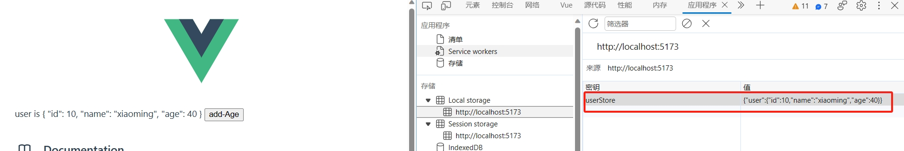

[toc]

# Pinia笔记

[Pinia官网：https://pinia.vuejs.org/zh/](https://pinia.vuejs.org/zh/)


> 什么是Pinia?

Pinia 是 Vue 的最新状态管理库 ，是 Vuex 状态管理库的替代品。

## 手动添加Pinia到Vue3工程中

Pinia可以在工程创建时自动添加，也可以工程创建完毕后手动添加到工程中。

1. 首先安装Pinia

```bash
# yarn 包管理器
yarn add pinia
# npm 包管理器
npm install pinia
```

2. 创建一个空的Vue3工程

```bash
npm init vue@latest
```

3. 修改工程的main.js文件，引入pinia

```js
//引入样式文件
import './assets/main.css'
//引入createApp和createPinia函数
import { createApp } from 'vue'
import { createPinia } from 'pinia'
//引入根组件App.vue
import App from './App.vue'

//创建根组件App.vue的实例对象app
const app = createApp(App)
//创建实例对象pinia
const pinia = createPinia()

//将根组件实例对象app与实例对象pinia产生关联
app.use(pinia)
//将根组件实例对象app挂载到index.html中id=app的标签下
app.mount('#app')
```

4. 以上就将Pinia添加到前端工程中了。


## Pinia基础使用

### 核心概念：Store 仓库

仓库 Store 是一个保存状态和业务逻辑的实体，它并不与组件树绑定。它承载着全局状态，每个组件都可以读取和写入它。

Store有三个子概念，state、getter 和 action。这些子概念相当于组件中的 data、 computed 和 methods。

> 什么时候使用 Store?

- 一个Store应该包含可以在整个应用中访问的公共数据。例如显示在导航栏中的用户信息。
- 另外，应该避免在Store中引入那些可以在组件中保存的本地数据。

> 如何使用 Store？

例如我们想在整个应用中，创建一个用户信息store。

① 在工程中的src目录下创建store目录，并且在目录中创建userStore.js文件

- store目录主要存放整个应用中的所有仓库文件
- userStore.js文件用来存储和管理全局用户信息的。

② 在userStore.js文件中创建用户信息store对象。

```js
import { defineStore } from 'pinia'
// 通过defineStore，你可以创建一个store仓库对象。
// store仓库对象的名字，最好以`use`开头且以`Store`结尾。(比如 `useUserStore`,`useCartStore`)
// 第一个参数是你的整个应用中 Store 的唯一 ID。
// 第二个参数是Setup 函数
export const useUserStore = defineStore('userStore', ()=>{
  // 仓库的其他配置...
})
```

- id是必须传入的。建议将defineStore()返回的函数命名为 use...
- defineStore() 的第二个参数可接受两类值：Setup 函数或 Option 对象。

③ 完整例子

1. 定义store
2. 组件使用store

userStore.js
```js
import { defineStore } from 'pinia'
import { computed, ref } from 'vue'
//defineStore() 的第二个参数传入Setup函数
//在Setup函数可以使用vue3的组合式API
export const useUserStore = defineStore('userStore',()=>{
    // 定义数据。ref()响应式对象 就是 state 属性
    const age = ref(10)
    // 定义数据的计算属性。computed() 就是 getters
    const age2 = computed(()=> age.value * 2)
    // 定义操作数据的方法。function() 就是 actions
    function addAge() {
        age.value ++
    }
    //将数据和方法 return出去
    return { age, addAge, age2 }
})
```

defineStore的第二个参数可以传入setup函数。在这个setup函数中
- ref() 就是 state 
- computed() 就是 getters
- function() 就是 actions

HelloWorld.vue
```vue
<script setup>
//引入useUserStore
import { useUserStore } from '@/store/userStore'
//执行useUserStore函数，获取仓库对象实例
const userStore = useUserStore()
</script>

<!--在模板组件中使用state数据和actions方法和计算属性。-->
<template>
  user age is {{ userStore.age }} - {{ userStore.age2 }}
  <button @click="userStore.addAge">button1</button>
</template>
```

### state

如果说store是仓库，那么state就是仓库中存储的数据了。

defineStore的第二个参数可以传入setup函数。在这个setup函数中 ref()返回的响应式对象就是 state 数据。

> 在store中定义state数据

useUserStore.js
```js
import { defineStore } from 'pinia'
import { ref } from 'vue'
export const useUserStore = defineStore('userStore',()=>{
    // 定义state数据 user
    const count = ref(0)
    const user = ref({ id:10,name:"xiaoming",age:10})
    //将数据 return 出去
    return { user,count }
})
```

> 在组件中操作state数据

Hello.vue
```vue
<script setup>
//引入useUserStore
import { useUserStore } from '@/store/userStore'
//执行useUserStore函数，获取仓库对象实例
const userStore = useUserStore()
</script>

<!--在模板组件中使用state数据和actions方法和计算属性。-->
<template>
  user is {{ userStore.user }}
  count is {{ userStore.count }}
</template>
```

一般可以通过store对象实例直接修改state数据。但是对于全局数据，不建议直接修改。而是应该通过store中设置的函数来修改state数据。

### getter

store是仓库，state是仓库中的数据。那么getter就是对state数据的计算属性值。

defineStore的第二个参数可以传入setup函数。在这个setup函数中computed() 就是 getter。

例子如下

> 在store中定义state数据和Getter计算属性

useUserStore.js
```js
import { defineStore } from 'pinia'
import { ref } from 'vue'
export const useUserStore = defineStore('userStore',()=>{
    // 定义state数据 user
    const count = ref(0)
    const count2 = computed(()=> count.value * 2)
    //将数据 return 出去
    return { count2,count }
})
```

> 在组件中操作state数据和getters计算属性

Hello.vue
```vue
<script setup>
//引入useUserStore
import { useUserStore } from '@/store/userStore'
//执行useUserStore函数，获取仓库对象实例
const userStore = useUserStore()
</script>

<!--在模板组件中使用state数据和actions方法和计算属性。-->
<template>
  count is {{ userStore.count }}
  count2 is {{ userStore.count2 }}
</template>
```

### action

store是仓库，state是仓库中的数据，getter是计算属性值。那么action就是修改state数据的方法。

defineStore的第二个参数可以传入setup函数。在这个setup函数中function() 就是 actions

> 例子

userStore.js
```js
import { defineStore } from 'pinia'
import { computed, ref } from 'vue'
export const useUserStore = defineStore('userStore',()=>{
    const age = ref(10)
    // 定义操作数据的方法。function() 就是 actions
    function addAge() {
        age.value ++
    }
    //将数据和方法 return出去
    return { age, addAge}
})
```

HelloWorld.vue
```vue
<script setup>
//引入useUserStore
import { useUserStore } from '@/store/userStore'
//执行useUserStore函数，获取仓库对象实例
const userStore = useUserStore()
</script>

<!--在模板组件中使用state数据和actions方法和计算属性。-->
<template>
  user age is {{ userStore.age }}
  <button @click="userStore.addAge">button1</button>
</template>
```

> action的异步实现

action可以是异步的，你可以在它们里面 await 调用任何 API，以及其他 action。

例子
```js
import { defineStore } from 'pinia'
import { computed, ref } from 'vue'
export const useUserStore = defineStore('userStore',()=>{
    const ageList = ref([])
    // 异步实现
    // 通过axios来请求接口，异步给ageList赋值    
    const getAge = async() => {
        const a = await axios.get("http://xxxxxx")
        ageList.value = a
        console.log(a)
    }
    //将数据和方法 return出去
    return { ageList, getAge}
})
```

## Pinia持久化

pinia 和 vuex 一样，数据是短时的。只要一刷新页面，数据就会恢复成初始状态。为了避免这个问题，可以对其采用持久化保存方法。

持久化保存的原理是在 pinia 中对数据更新时，同步保存到 localStorage 或 sessionStorage 中，刷新页面后从本地存储中读取数据写入到pinia的store中。

推荐使用插件去实现持久化存储，这样更便捷，省时省力。推荐插件为pinia-plugin-persistedstate

[pinia-plugin-persistedstate官网](https://prazdevs.github.io/pinia-plugin-persistedstate/zh/)

1. 安装pinia-plugin-persistedstate插件

```shell
npm i pinia-plugin-persistedstate
## 或者
yarn add pinia-plugin-persistedstate
```

2. 将插件添加到 pinia 实例上

```js
import { createPinia } from 'pinia'
import piniaPluginPersistedstate from 'pinia-plugin-persistedstate'

const pinia = createPinia()
pinia.use(piniaPluginPersistedstate)
```

3. 创建 Store时，在defineStore函数的第三个参数上设置persist选项为true

组合式写法
```js
import { defineStore } from 'pinia'
import { ref } from 'vue'
export const useUserStore = defineStore('userStore',()=>{
    // 定义state数据 user
    const user = ref({ id:10,name:"xiaoming",age:10})
    function addAge() { 
        user.value.age ++
    }
    //return 出去
    return { user,addAge }
},{
    persist: true
})
```

```vue
<script setup>
import { useUserStore } from '@/store/userStore'
const userStore = useUserStore()
</script>
<template>
  user is {{ userStore.user }} 
  <button @click="userStore.addAge">add-Age</button>
</template>
```


4. 重启工程，此时pinia持久化就会生效。
5. 当我们对store中的数据进行更新的时候，pinia会将更新的数据保存在 localStorage 中。然后刷新页面的时候，将 localStorage 中的数据写入到store中。



注意：localStorage中的数据的key是defineStore函数的第一个参数，即id值。


### 配置

如何你不想使用默认的配置，那么你可以将一个对象传递给 Store 的 persist 属性来进行自定义配置持久化。

```js
import { defineStore } from 'pinia'
import { ref } from 'vue'
export const useUserStore = defineStore('userStore',()=>{
    // 定义state数据 user
    const user = ref({ id:10,name:"xiaoming",age:10})
    function addAge() { 
        user.value.age ++
    }
    //return 出去
    return { user,addAge }
},{
    persist: {
        //这里进行自定义配置持久化
        key: 'my-user-key',
        storage: localStorage,
        paths: ['user.id', 'user.name']
    }
})
```

- key 设置本地缓存数据的key。默认是defineStore的第一个参数。
- storage 设置本地缓存数据存储的位置。默认是localStorage。
- paths 可以设置state 中哪些数据需要被持久化。默认是所有state数据都持久化。

其余配置参考官网文档。


