# Vue.js基础 - version : 2.5.16

## 1. 简介

Vue 是一套用于构建用户界面的渐进式框架,遵循MVVM模式。
Vue 的核心库只关注视图层，不仅易于上手，还便于与第三方库或既有项目整合。

**什么是渐进式框架？**
渐进式框架就是拥有一个最核心的功能。其余次要功能就想插件一样。想用就用。例如：vue.js就是最核心的。组件和路由等就为插件。
    
**什么是MVVM？**
MVVM是Model-View-ViewModel的简写。它本质上就是MVC 的改进版。它可以取出 Model 的数据同时帮忙处理 View 中由于需要展示内容而涉及的业务逻辑。

## 2. 引用：

> ①：`<script>引入`

<font color="red">在开发环境下不要使用压缩版本，不然你就失去了所有常见错误相关的警告!</font>

```html
<!-- 开发环境版本，包含了用帮助的命令行警告 -->
<script src="https://cdn.jsdelivr.net/npm/vue/dist/vue.js"></script>
```

或者

```html
<!-- 生产环境版本，优化了尺寸和速度 -->
<script src="https://cdn.jsdelivr.net/npm/vue"></script>
```


> ②:CDN:
```html
<script src="https://cdn.jsdelivr.net/npm/vue@2.5.16/dist/vue.js"></script>
```

> ③:NPM:

在用 Vue 构建大型应用时推荐使用 NPM 安装。NPM 能很好地和诸如 webpack 或 Browserify 模块打包器配合使用。同时 Vue 也提供配套工具来开发单文件组件。

```
# 最新稳定版
$ npm install vue
```

## 3.Vue实例

<font color="red">PS:先引用vue的js文件.PS2:每个 Vue 应用都需要通过实例化 Vue 来实现。</font>

{{ }} 用于输出vue实例的值。

```html
<body>
<div id="vue_det">
    <h1>site : {{site}}</h1>    
    <h1>url : {{url}}</h1>
    <h1>方法返回值:{{hanshu()}}</h1>
    <h1>方法返回data内的值:{{hanshu2()}}</h1>
</div>

<script type="text/javascript">
    //创建vue的实例对象
    //el是元素区域。data是数据区域，methods是方法区域
    var vm = new Vue({
        el: '#vue_det',
        data: {
            site: "菜鸟教程",
            url: "www.runoob.com"
        },
        methods:{
            hanshu: function() {
                return  "这是vue对象中的hanshu方法的返回值！";
            },
            hanshu2:function(){
                return  this.site;   //this.site指的是data域中的site值
            }
        }
    })
</script>
```

①：el元素区域:它的值对应为样式标签的id值。
②：data 数据区域，实例中有二个数据属性分别为：site、url。
③：methods方法区域，通过 return 来返回函数值。
④：值得注意的是只有当vue实例被创建时 data 中存在的属性才是响应式的，实时更新的。若实例创建后，再次添加属性。之后的属性不再是响应式。
⑤：可以通过前缀$,调用vue实例中的属性。

```js
var vm = new Vue({
    el: '#vue_det',
    data: data
})
document.write(vm.$data) 
document.write(vm.$el)
```

## 4.数据绑定

```
数据绑定最常见的形式就是使用 `{{...}}`（双大括号）的文本插值。

{{ }} 用于输出对象属性和函数返回值。
```

### 1. 给标签绑定文本值：

{{ }}还支持javascript表达式：

```html
<div id="app">
   {{ message }}
   {{5+5}}
   {{ ok ? 'YES' : 'NO' }}
   {{ message.split('').reverse().join('') }}
</div>
<script>
new Vue({
  el: '#app',
  data: {
    message: '菜鸟教程',
    ok:true,
    message:'SUI'
  }
})
</script>
```

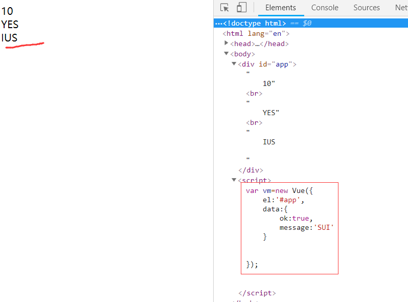

### 2. v-html---给标签插入html代码

>使用 v-html 指令用于输出 html 代码
```html
<div id="app">
   <div v-html="message"></div>
</div>
    
<script>
new Vue({
  el: '#app',
  data: {
     message: '<h1>菜鸟教程</h1>'
  }
})
</script>
```

### 3.绑定标签属性：v-bind指令

v-bind 主要用于属性绑定，比方你的class属性，style属性，value属性，href属性等等

#### 0. v-bind 缩写

```html
<!-- 完整语法 -->
<a v-bind:href="url">...</a>

<!-- 缩写 -->
<a :href="url">...</a>
```

#### 1. v-bind:href,绑定herf属性

```html
<div id="vue_det">
    <a v-bind:href="web">baidu</a>  <!--绑定herf属性-->
</div>

<script type="text/javascript">
    var vm = new Vue({
        el: '#vue_det',   
        data: {
           web:"http:baidu.com"
        }
    })
</script>
```

#### 2. v-bind:class 绑定class属性

>v-bind:class="{'样式名':ture/false}"

方式①：

```html
<style>
      .textColor{
          color:blue;
      }
</style>

<body>
  <ul class="box" v-bind:class="{'textColor':isColor}">
    <li>Vue</li>
    <li>Angular</li>
    <li>React</li>
 </ul>
</body>

<script>
var vm= new Vue({
    el:'.box',    
    data:{
        isColor:true,     //当为true时，ul标签会渲染textColor样式
    }
})
</script>
```
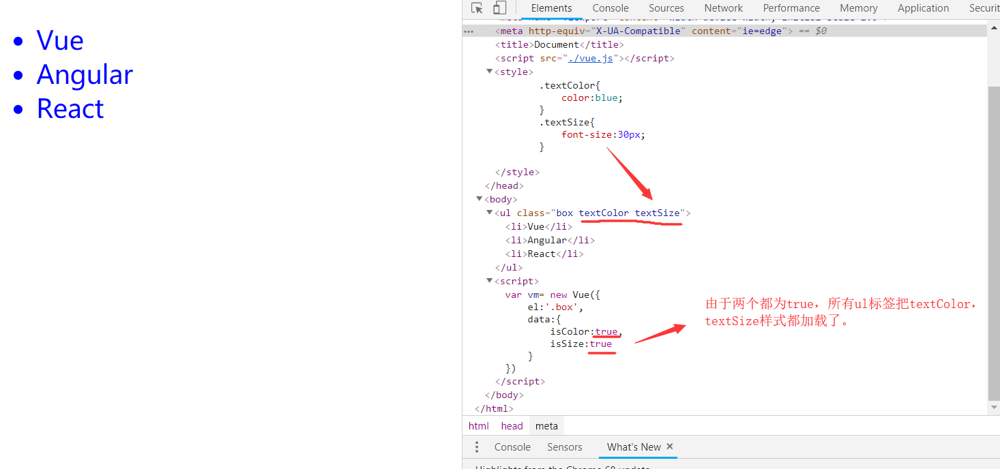

**当 isColor变化时，class列表将相应的更新.**

方式②:传一个数据对象给v-bind:class

```html
<style>
      .textColor{
          color:red;
      }
</style>

<ul class="box" v-bind:class="classObject">
    <li>Vue</li>
    <li>Angular</li>
    <li>React</li>
</ul>

<script>
var vm= new Vue({
    el:‘.box‘,
    data:{
        classObject:{
            'textColor':true
        }
    }
})
</script>
```

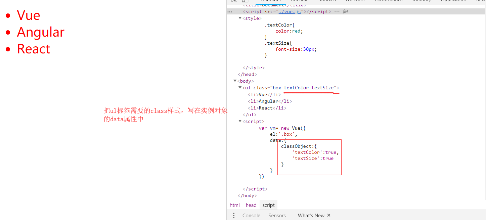

**把class样式写在数据对象中，在用ul标签引用这个数据对象.**

方式③：传一个数组给v-bind:class，形成一个class列表

```html
<style>
      .textColor{
          color:green;
      }
    
</style>

<ul class="box" v-bind:class="[classA]">
    <li>Vue</li>    
    <li>Angular</li>
    <li>React</li>
</ul>

<script>
var vm= new Vue({
    el:'.box',
    data:{
      classA:'textColor'   //默认加载该样式，为true
    }
})
</script>
```

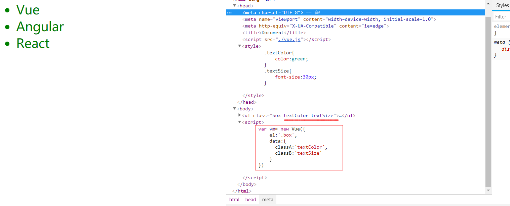


方式④：通过三目运算符，来切换列表中的class

```html
<ul class="box"  v-bind:class="[isA?classA:classB]">
        <li>学习Vue</li>
        <li>学习Node</li>
        <li>学习React</li>
</ul>
<script>
    var vm= new Vue({
        el:'.box',
        data:{
            classA:'textColor',
            classB:'textSize',
            isA:true 
        }
    })
</script>
```
**首先判断isA的boolean值，如果为true，则渲染classA；如果为false，则渲染classB。**

---

#### 3.v-bind:style绑定style属性,CSS属性(必须用驼峰命名法):

<font color="red">CSS属性名必须用驼峰命名法</font>

方式①：

```html
<div id="box" v-bind:style="{color:activeColor, fontSize:size}">
     哈哈哈哈哈哈
</div>
    
<script>
var vm= new Vue({
    el:'#box',
    data:{
      activeColor:'pink',
      size:'20px'
    }
})
</script>
```

**color:activeColor, fontSize:size，这里用驼峰命名法书写。**

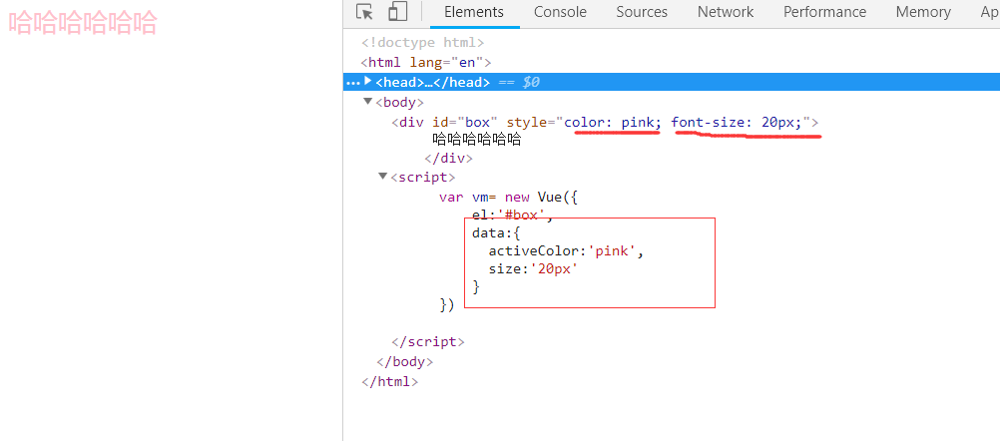


#### 4.v-bind:src绑定src属性:

```html
<blog_img class="box" v-bind:src="url"/>
<script>
    var vm= new Vue({
        el:'.box',
        data:{
         url:'~~~'
        }
    })
</script>
```

#### 5.v-bind:value 绑定表单的value值:

```html
<div id="vue_det">
    <input type="text" v-bind:value="val">  <!--绑定表单的value值-->
</div>

<script>
    var vm = new Vue({
        el: '#vue_det',   
        data: {
           val:"job"
        }
    })
</script>
```

## 5.指令：

指令是带有 v- 前缀的特殊属性。当表达式的值改变时，将其产生的连带影响，响应式地作用于 DOM。

### 1.v-bind和v-on指令缩写：

1. v-bind 缩写

```html
<!-- 完整语法 -->
<a v-bind:href="url">...</a>
<!-- 缩写 -->
<a :href="url">...</a>
```
2. v-on 缩写

```html
<!-- 完整语法 -->
<a v-on:click="doSomething">...</a>
<!-- 缩写 -->
<a @click="doSomething">...</a>
```

: 与 @ 都是合法字符,支持 Vue.js 的浏览器都能被正确地解析。

### 2.条件语句：

#### 1.v-if 指令：

```html
<div id="app">
    <p v-if="seen">现在你看到我了</p>
</div>
<script>
    new Vue({
        el: '#app',
        data: {
         seen: true   //默认为true
        }
    })
</script>
```
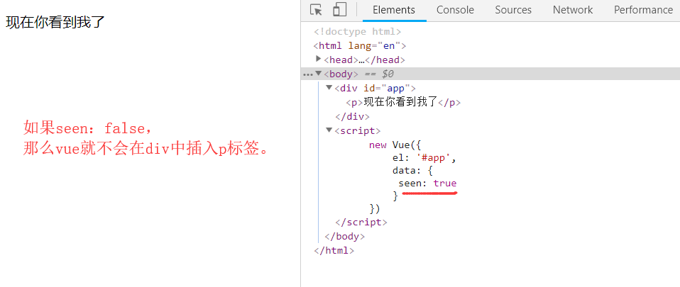

v-if 指令将根据表达式 seen 的值(true 或 false )来决定是否插入p元素。

#### 2.v-else 指令：

```html
<div id="app">
    <div v-if="isboolean">
            you
    </div>
    <div v-else>
            and me
    </div>
</div>
<script>
new Vue({
    el: '#app',
    data:{
        isboolean:true  //为flase时，显示and me
    }
})
</script>
```

#### 3.v-else-if 指令：

用作 v-if 的 else-if 块。可以链式的多次使用,
v-else 、v-else-if 必须跟在 v-if 或者 v-else-if之后。

```html
<div id="app">
    <div v-if="type === 'A'">
        A
    </div>
    <div v-else-if="type === 'B'">
        B
    </div>
    <div v-else-if="type === 'C'">
        C
    </div>
    <div v-else>
        Not A/B/C is {{type}}
    </div>
</div>
    
<script>
new Vue({
    el: '#app',
    data: {
    type: 'D'
    }
})
</script>
```

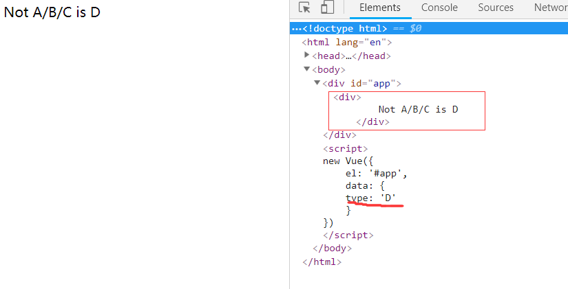


#### 4.用key来复用if-else：

```html
<div id="app">
    <div v-if="loginType==='username'">
            <label>Username</label>
            <input placeholder="Enter your username">
    </div>
    <div v-else>
            <label>Email</label>
            <input placeholder="Enter your email address">
    </div>
    <button v-on:click="changeInput">切换输入内容</button>
</div>

<script>
var vm=new Vue({
    el:'#app',
    data:{
        loginType:'username'
    },
    methods:{
        changeInput:function(){
            return this.loginType= this.loginType==='username'?'email':'username'
            //检测当前的loginType是否为username，是：转变为email，并赋值给loginType
        }
    }
})
</script>
```


---


### 3.v-for指令---循环语句：

**v-for指令需要以 todo in todos 形式的写法,todos是数组,todo是数组中单个元素的别名。**

**可以用 of 替代 in 作为分隔符:**
```html
<div v-for="todo in todos"></div>
```

#### 1. v-for 迭代数组

```html
<div id="app-4">
    <ol>
        <li v-for="todo in todos">
        {{ todo.text }}
        </li>
    </ol>
</div>
<script>
var app4 = new Vue({
  el: '#app-4',
  data: {
    todos: [
      { text: '学习 JavaScript' },
      { text: '学习 Vue' },
      { text: '整个牛项目' }
    ]
  }
})
</script>
```
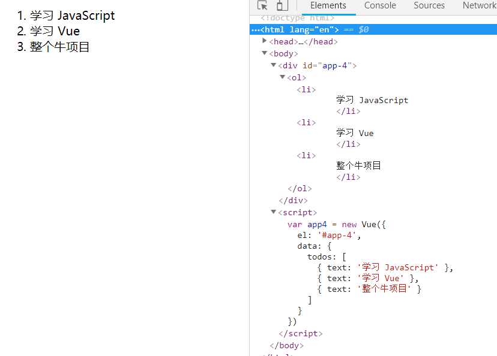

#### 2. v-for 迭代对象:

```html
<div id="app">
  <ul>
    <li v-for="value in object">
    {{ value }}
    </li>
  </ul>
</div>
<script>
new Vue({
  el: '#app',
  data: {
    object: {
      name: '菜鸟教程',
      url: 'http://www.runoob.com',
      slogan: '学的不仅是技术，更是梦想！'
    }
  }
})
</script>
```

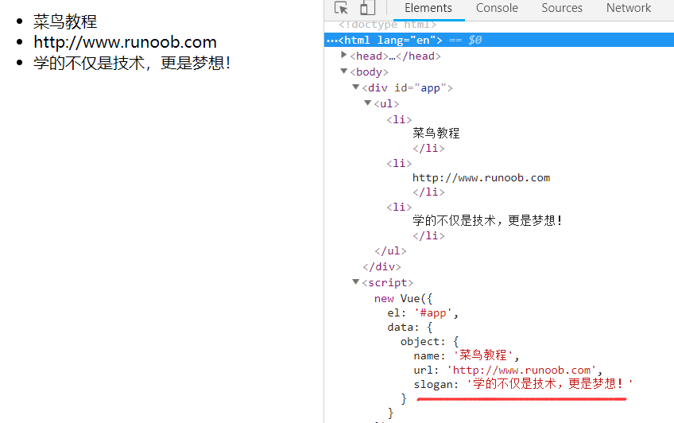

<font color="red">或者把属性名和索引也迭代出来:</font>

```html
<div id="app">
  <ul>
    <li v-for="(value,key,index) in object">
     {{ index }}. {{ key }} : {{ value }}
    </li>
  </ul>
</div>
<script>
new Vue({
  el: '#app',
  data: {
    object: {
      name: '菜鸟教程',
      url: 'http://www.runoob.com',
      slogan: '学的不仅是技术，更是梦想！'
    }
  }
})
</script>
```


#### 3. v-for 迭代整数:

```html
<div id="app">
<ul>
    <li v-for="n in 10"> 
    {{ n }}
    </li>
</ul>
</div>
<script>
new Vue({
el: '#app'
})
</script>
```

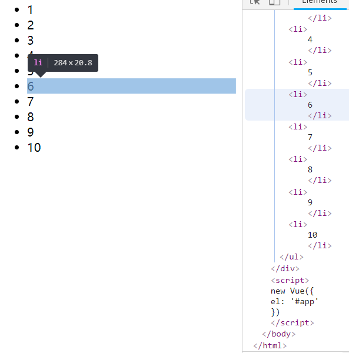


### 4.v-model表单双向数据绑定：

**input 输入框中可以使用 v-model 指令来实现表单输入和应用状态之间的双向绑定：**

#### 1.input 和 textarea 标签
```html
<div id="app">
        <p>input 元素：</p>
        <p>{{ message }}</p>
        <input v-model="message">

        <p>textarea 元素：</p>
        <p>{{ message2 }}</p>
        <textarea v-model="message2"></textarea>
</div>
        
<script>
new Vue({
    el: '#app',
    data: {
    message: 'Runoob!',
    message2: '菜鸟教程\r\nhttp://www.runoob.com'
    }
})
</script>
```

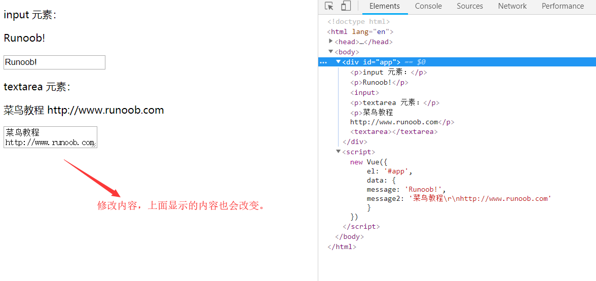

#### 2.复选框：

单个复选框，绑定到布尔值：

```html
<div id="app">
  <p>单个复选框：</p>
  <input type="checkbox" id="checkbox" v-model="checked">
</div>
<script>
new Vue({
  el: '#app',
  data: {
    checked : false //为false，表示未选状态，true为选中状态。
  }
})
</script>
```

多个复选框，绑定到同一个数组：
```html
<div id="app">
  <p>多个复选框：</p>
  <input type="checkbox"  v-model="checkedNames">
  <input type="checkbox"  v-model="checkedNames">
  <input type="checkbox"  v-model="checkedNames">
  <br>
  <span>选择的值为: {{ checkedNames }}</span>
</div>
<script>
new Vue({
  el: '#app',
  data: {
    checkedNames: []    //数组为空，表示开始没有一个复选框选中。
  }
})
</script>
```

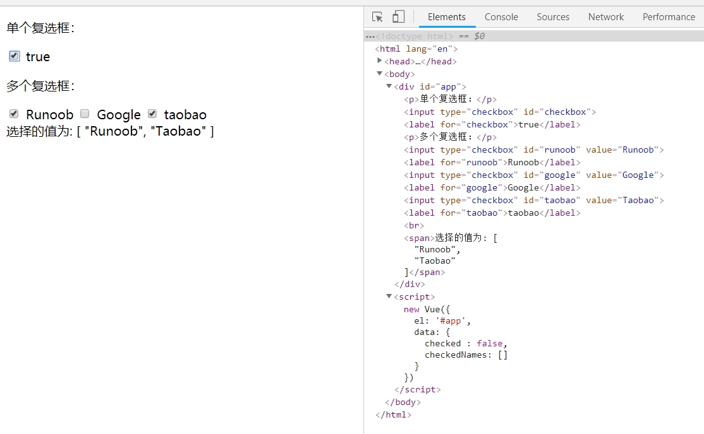

#### 3.单选按钮：

```html
<div id="example-4">
  <input type="radio" value="One" v-model="picked">
  <label for="one">One</label>
  <br>
  <input type="radio" value="Two" v-model="picked">
  <label for="two">Two</label>
  <br>
  <span>Picked: {{ picked }}</span>
</div>
 
<script>
new Vue({
  el: '#example-4',
  data: {
    picked: ''  //为空，表示一开始未选
  }
})
</script>
```


#### 4.下拉框：

单选时：

```html
<div id="example-5">
  <select v-model="selected">
    <option disabled value="">请选择</option>
    <option>A</option>
    <option>B</option>
    <option>C</option>
  </select>
  <span>Selected: {{ selected }}</span>
</div>
<script>
new Vue({
  el: '#example-5',
  data: {
    selected: ''    //为空，将被渲染为“未选中”状态
  }
})
</script>
```

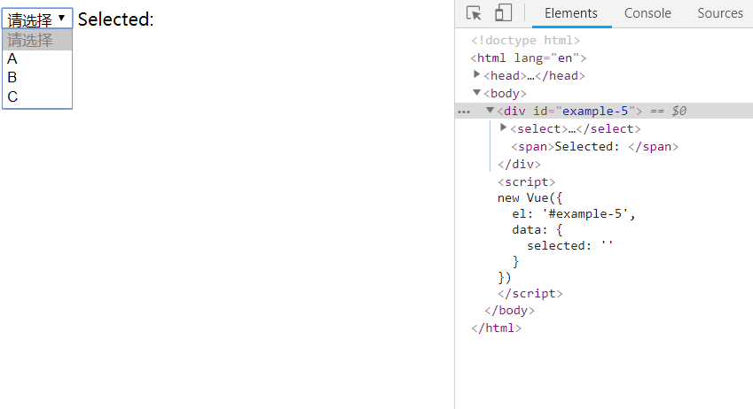

多选时 (绑定到一个数组)：
<font color="red">多选时，用Ctrl+鼠标左键 选中选项。</font>

```html
<div id="example-6">
  <select v-model="selected">
    <option>A</option>
    <option>B</option>
    <option>C</option>
  </select>
  <span>Selected: {{ selected }}</span>
</div>
<script>
new Vue({
  el: '#example-6',
  data: {
    selected: []
  }
})
</script>
```
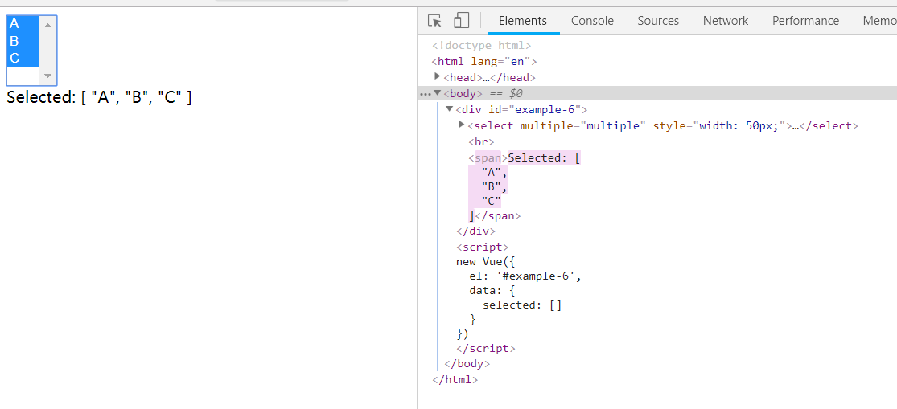

#### 5.用v-for对下拉框选项进行修饰：

```html
<div id="example-6">
  <select v-model="selected">
  <option disabled value="">请选择</option>
  <option v-for="option in options" v-bind:value="option.value">
    {{ option.text }}
  </option>
  </select>
  <span>Selected: {{ selected }}</span>
</div>
<script>
new Vue({
  el: '#example-6',
  data: {
    selected: '',  //默认选A选项
    options: [
      { text: 'One', value: 'A' },    //A选项对于的文本值是one
      { text: 'Two', value: 'B' },
      { text: 'Three', value: 'C' }
    ]
  }
})
</script>
```
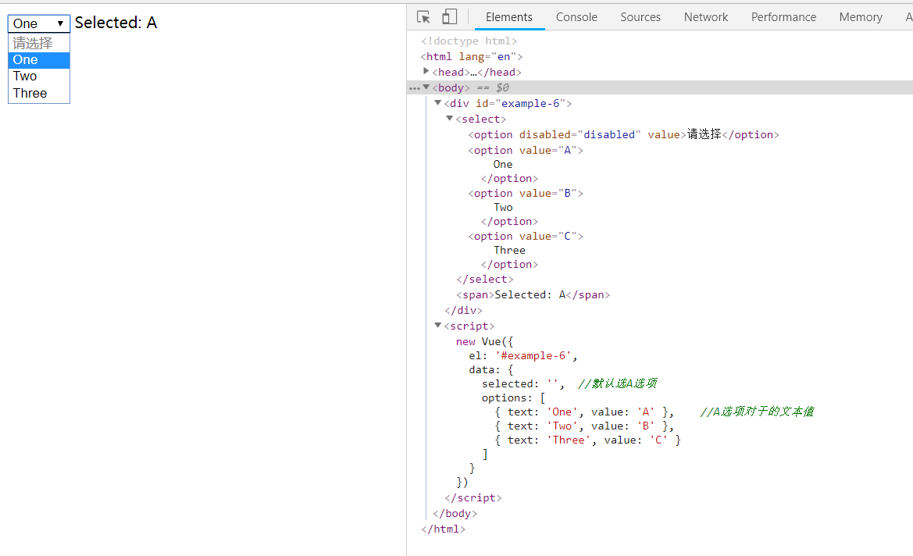

#### 6.用v-bind对表单进行值绑定：

1.单选按钮：

```html
<input type="radio" v-model="pick" v-bind:value="a">
// 当选中时,单选按钮传递的值是a
//vm.pick = vm.a
```

2.下拉框的选项

```html
<select v-model="selected">
  <option v-bind:value="{ number: 123 }">123</option>
</select>
// 当选中时,下拉框传递的值是{number:123}
typeof vm.selected // => 'object'
vm.selected.number // => 123
```

3.复选框：

```html
<input type="checkbox" v-model="toggle" true-value="yes" false-value="no">
// 当选中时，传递的值是yes
vm.toggle === 'yes'
// 当没有选中时
vm.toggle === 'no'
```

#### 7.修饰符：

① .lazy

在默认情况下， v-model 在 input 事件中同步输入框的值与数据，但添加一个修饰符 lazy ，从而转变为在 change 事件中同步：
```html
<!-- 在 "change" 而不是 "input" 事件中更新 -->
<input v-model.lazy="msg" >
```
② .number

如果想自动将用户的输入值转为 Number 类型（如果原值的转换结果为 NaN 则返回原值），可以添加一个修饰符 number 给 v-model 来处理输入值：
```html
<input v-model.number="age" type="number">
```

③ .trim

如果要自动过滤用户输入的首尾空格，可以添加 trim 修饰符到 v-model 上过滤输入：
```html
<input v-model.trim="msg">
```
---

### 5.事件监听 v-on:


#### 1.点击事件：

**使用 v-on 监听 DOM 事件，可以对用户的输入进行响应,触发一些JavaScript代码。**

> <font color="red">方式①：直接把 JS 代码写在 v-on 指令中</font>

**例子1：计数器**

```html
<div id="example-1">
    <button v-on:click="counter += 1">Add +1</button>
    <p>The button above has been clicked {{ counter }} times.</p>
</div>
<script>
var example1 = new Vue({
  el: '#example-1',
  data: {
    counter: 0
  }
})
</script>
```
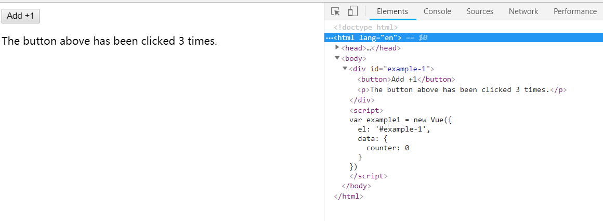

> <font color="red">方式②：把被调用方法名写在v-on指令中，在methods对象中定义具体方法</font>

**例子2：在用户点击按钮后对字符串进行反转操作：**

```html
<div id="app">
        <p>{{ message }}</p>
        <button v-on:click="reverseMessage">反转字符串</button>
</div>
<script>
var app = new Vue({
    el: '#app',
    data: {
        message: 'Runoob!'   
    },
    methods: {   //method是实例的方法区域，内部写各个方法。
            reverseMessage: function () {   //reverseMessage是方法名
            this.message = this.message.split('').reverse().join('')
        }
    }
})
</script>
```

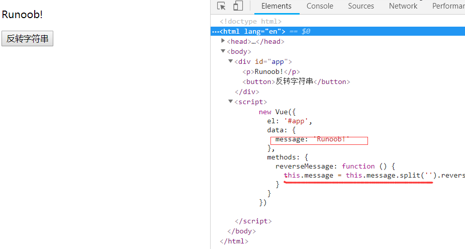

> <font color="red">方式③：在 v-on 指令中也可以用 JS 语句中调用方法：</font>

```html
<div id="example-3">
    <button v-on:click="say('hi')">Say hi</button>
    <button v-on:click="say('what')">Say what</button>
</div>
<script>
new Vue({
  el: '#example-3',
  methods: {
    say: function (message) {
      alert(message)
    }
  }
})
</script>
```
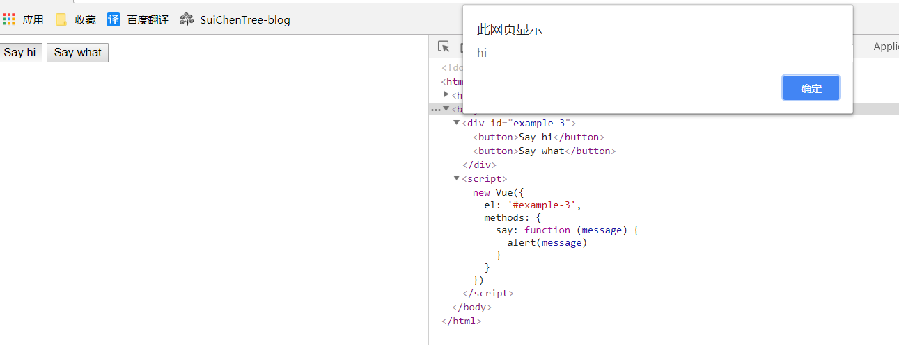

#### 2.v-on指令的事件修饰符：

修饰符示例：
```
.stop
.prevent
.capture
.self
.once
.passive
```

```html
<!-- 阻止单击事件继续传播 -->
<a v-on:click.stop="doThis"></a>

<!-- 提交事件不再重载页面 -->
<form v-on:submit.prevent="onSubmit"></form>

<!-- 修饰符可以串联 -->
<a v-on:click.stop.prevent="doThat"></a>

<!-- 只有修饰符 -->
<form v-on:submit.prevent></form>

<!-- 添加事件监听器时使用事件捕获模式 -->
<!-- 即元素自身触发的事件先在此处理，然后才交由内部元素进行处理 -->
<div v-on:click.capture="doThis">...</div>

<!-- 只当在 event.target 是当前元素自身时触发处理函数 -->
<!-- 即事件不是从内部元素触发的 -->
<div v-on:click.self="doThat">...</div>
```

#### 3.v-on指令监听键盘的修饰符：

**Vue 允许为 v-on 在监听键盘事件时添加按键修饰符：**

```html
<!-- 只有在 keyCode 是 13 时调用 vm.submit() -->
<input v-on:keyup.13="submit">
<!-- Vue 为最常用的按键提供了别名-->
<input v-on:keyup.enter="submit">
<!-- 缩写语法 -->
<input @keyup.enter="submit">
<!--
全部的按键别名：
.enter
.tab
.delete (捕获 "删除" 和 "退格" 键)
.esc
.space
.up
.down
.left
.right
.ctrl
.alt
.shift
.meta
-->
```
---

### 6.v-show

> v-show根据条件展示元素

例子：点击一个按钮时，切换一个元素的显示或隐藏状态。
```html
<div id="app">
    　<p v-show="ok">v-show可以控制元素的显隐状态，点击下面的按钮可看到效果</p>
    　<p>ok：{{ok}}</p>
</div>
<script>
var vm=new Vue({
　　el:'#app',
    data:{
　　　ok:true
　　}
})
</script>
```
**如果需要非常频繁地切换，则使用 v-show 较好；如果在运行时条件很少改变，则使用 v-if 较好。**

---

## 7.计算属性 computed --- 与methods属性类似

### 1.基础：

**计算属性的由来：**
```html
<div id="example">
  {{ message.split('').reverse().join('') }}
</div>
```

<font color="red">这段代码的功能是把messgae的字符进行逆序输出.
例如：message="Hello"，则打印输出"olleH"</font>

<font color="blue">如果表达式存在过多逻辑，html页面就会变得臃肿不堪，难以维护。为了简单逻辑，我们可以使用计算属性。计算属性可以完成各种复杂的逻辑，包括运算、函数调用等，只要最终返回一个结果就可以。并使html页面看起来美观，简洁。</font>


例子：
```html
<div id="app">
    <p>原始字符串: {{ message }}</p>
    <p>计算后反转字符串: {{ reversedMessage }}</p>
</div>

<script>
    var vm = new Vue({
        el: '#app',
        data: {
            message: 'Runoob!'
        },
        computed: {
            reversedMessage: function () {
            // `this` 指向 vm 实例
            return this.message.split('').reverse().join('')
            }
        }
    })
</script>
```

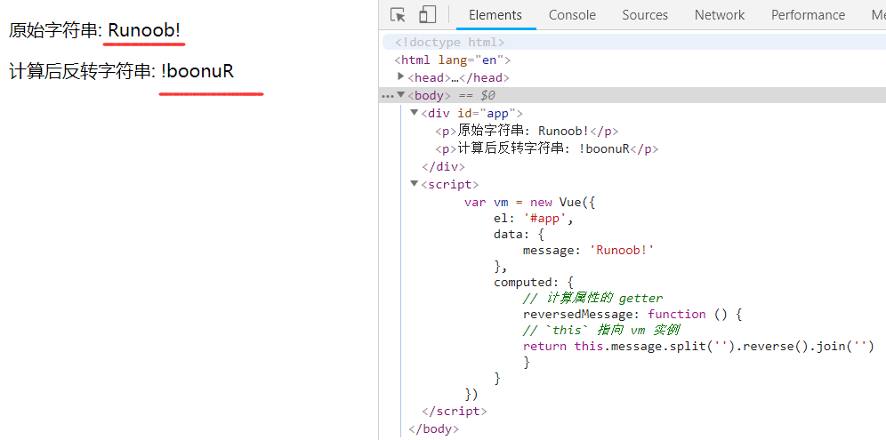


### 2.getter

<font color="red">vue.js中计算属性默认只有 getter，因为是默认值所以我们也常常省略不写，如下代码：</font>

```html
<div id="app">
    <p>原始字符串: {{ message }}</p>
    <p>计算后反转字符串: {{ reversedMessage }}</p>
</div>

<script>
    var vm = new Vue({
        el: '#app',
        data: {
            message: 'Runoob!'
        },
        computed: {
            reversedMessage: function () {
            return this.message.split('').reverse().join('')
            }
        }
    })
</script>
```

其实computed里的代码完整的写法应该是：

```js
computed: {
    reversedMessage: {
      //getter，用于读取
      get(){
         return this.message.split('').reverse().join('')
      }
    }
  }
```

或者是
```js
computed: {
    reversedMessage: {
        //getter，用于读取
        get:function (){
            return this.message.split('').reverse().join('')
        }
    }
}
```

### 3.settter

**当手动修改计算属性的值时，就会触发setter函数，执行函数的自定义操作。同时也会触发getter函数。其执行顺序是 setter -> getter**

PS: setter与getter，它们两个是相互独立的

<font color="red">本例中计算属性的值为fullName</font>

```html
<div id="demo">
        <p> {{ fullName }} </p>
        <input type="text" v-model="fullName">
        <input type="text" v-model="firstName">
        <input type="text" v-model="lastName">
</div>
<script>
var vm = new Vue({
    el: '#demo',
    data: {
        firstName: 'zhang',
        lastName: 'san'
    },
    computed: {
        fullName: {
        //getter 方法
            get(){
                console.log('computed getter...')
                return this.firstName + ' ' + this.lastName  //把firstName与lastName拼成"zhang san"
            },
        //setter 方法
            set(newValue){    //这里的newValue是fullName的值"zhang san"
                console.log('computed setter...')
                var names = newValue.split(' ')  //把zhang san以空格分开，分成zhang,san。放到数组names中。
                this.firstName = names[0]
                this.lastName = names[names.length - 1]
                return this.firstName + ' ' + this.lastName  //把得到的firstName与lastName值返回
            }
        }
    }
})
</script>

```

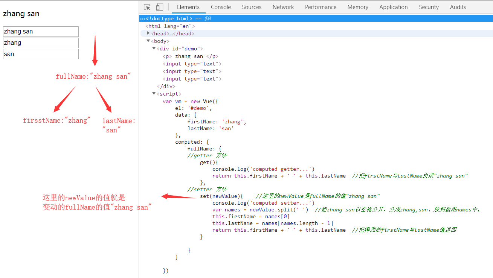

### 4.computed 和 methods的区别

<font color="red">可以使用 methods 来替代 computed，效果上两个都是一样的</font>

但是：方法属性是当页面重新渲染时，方法会重新调用执行。而计算属性时只有当页面缓存改变时。才会重新执行。


---


## 8.watch(侦听属性)---响应数据的变化：

通过 watch 来响应Vue实例上数据的变化。watch会实时监听数据变化并改变自身的值

<font color="red">当watch监听的数据属性发生改变时。会触发watch区域的方法。</font>

```html
<div id="app">
  <p>{{ message }}</p>
  <button v-on:click="reverseMessage">反转字符串</button>
</div>
<script>
new Vue({
    el: '#app',
    data: {
        message: 'Runoob!'
    },
    methods: {
        reverseMessage: function () {
            this.message = this.message.split('').reverse().join('')
        }
    },
    watch:{
        message: function (newValue, oldValue) {
            console.log('this is watch...')
        }
    }
})
</script>
```

```js
watch:{
  //message 是被侦听的属性值，当message值发生变化，便会执行这个函数。
  message: function (newValue, oldValue) {
      console.log('this is watch...')
  }
}
```

message是被侦听的属性值，当它发生变化，便会执行这个函数

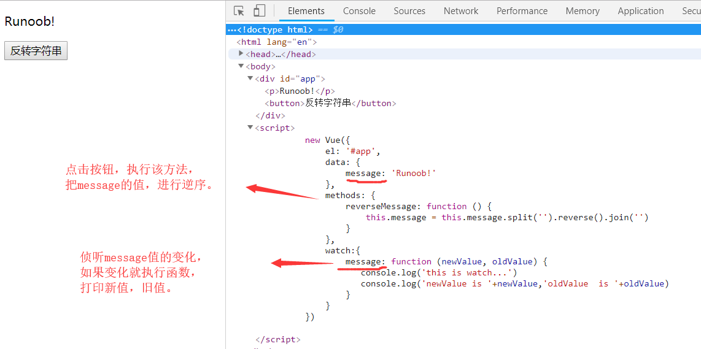
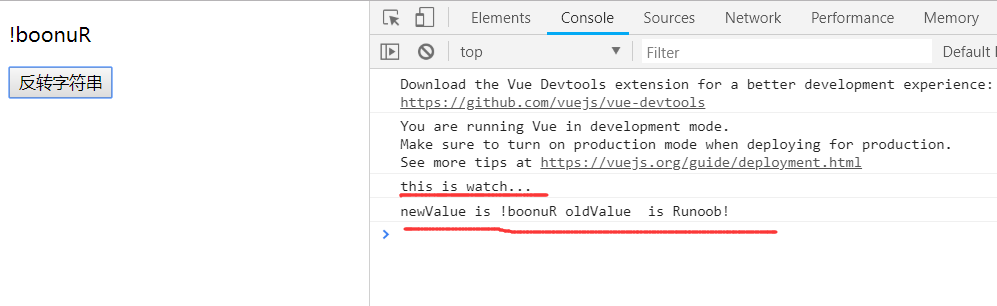

---

## 9.组件

### 1.组件基础

> 组件是可复用的 Vue 实例。可以s封装需要多次重复使用的html代码。

```html
<div id="components-demo">
    <!--button-counter 是组件-->
  <button-counter></button-counter>
</div>
<script>
// 定义一个名为 button-counter 的新组件
Vue.component('button-counter', {
  data: function () {  //初始化组件的内容，一开始组件内容的count为0
    return {
      count: 0
    }
  },
  //template是组件的html模板代码
  template: '<button v-on:click="count++">You clicked me {{ count }} times.</button>'
})

//组件必须在vue实例中才会生效
var vm = new Vue({
  el:'#components-demo'
})
</script>
```

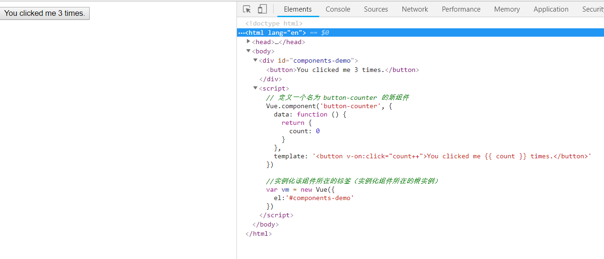

<font color="red">

1. el是组件所在的根实例特有的选项。
2. 所有组件必须写在根实例标签的里面才会生效。
3. 组件注册必须写在Vue实例创建之前，组件才会渲染生效。
4. 组件的 data 必须是一个函数。

</font>

> PS:组件的 data 必须是一个函数

<font color="blue">组件的data属性必须是一个函数。只有这样当组件复用时。每个组件才能改变自己的data属性。若不是函数。则改变某一个组件的data属性值时。其他复用组件的data属性值都会改变。</font>，

```js
data: function () {
  return {
    count: 0
  }
}
```

### 2.组件注册

组件必须先注册后以便Vue能够识别。才能在页面中使用。注册分为全局注册和局部注册。
1. 全局注册： 在所有的vue实例中可以使用该组件
2. 局部注册： 局部组件只能在特定的vue实例中使用。

#### 1.全局注册组件

**通过 Vue.component('...',{...}) 全局注册的,就叫全局组件。**


```js
Vue.component('component-a', {
  data: function () {  
    return {
      ....
    }
  },
  //template是组件的html模板代码
  template: '...'
})
```

#### 2.局部注册组件

**局部注册组件，通常在Vue实例里面注册。**

例子：
```html
<div id="app1">
    <!--使用局部组件-->
   <child-component></child-component>
</div>
<script>
  //定义child组件
  var child={
    template:"<h1>我是局部组件</h1>"
  };
  new Vue({
    el: "#app1",
    //在vue实例中局部注册child组件。组件取名为child-component
    components:{
      "child-component":child
    }
  });
</script>
```

<h3 style="color:red">局部组件需要注意。vue实例中的属性名是components</h3>

---

## 10.组件中的Prop属性---父组件向子组件传递数据：

prop 是父组件用来传递数据给子组件的一个自定义属性。<font color="red">在组件中定义prop属性就相当在该组件的data中添加属性。</font>

**父组件的数据需要通过 props 把数据传给子组件，子组件需要显式地用 props 选项声明 "prop"**


<font color="blue">注意: prop 是单向绑定的：当父组件的属性变化时，将传导给子组件，但是不会反过来。</font>


### 1.Prop静态传递数据

```html
<div id="app1">
  <blog-post title="My journey with Vue"></blog-post>
  <blog-post title="Blogging with Vue"></blog-post>
  <blog-post title="Why Vue is so fun"></blog-post>
</div>
<script>
Vue.component('blog-post', {
  props: ['title'],
  template: '<h3>{{ title }}</h3>'
})
new Vue({
  el:'#app1'
})
</script>
```


> props: ['title'],相当于给这个组件添加一个title的data属性。
> title="Why Vue is so fun"：是给这个标签的title赋值。


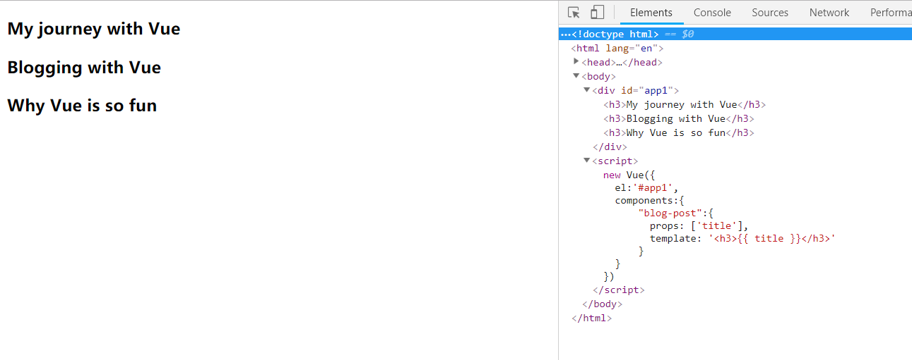


### 2.Prop动态传递数据：

用 v-bind 动态绑定 props 的值到父组件的数据中。每当父组件的数据变化时，该变化也会传导给子组件。

```html
<div id="app">
    <div>
      <input v-model="parentMsg">
      <child v-bind:message="parentMsg"></child>
    </div>
</div>
 
<script>

Vue.component('child', {
  props: ['message'],
  template: '<span>{{ message }}</span>'
})

new Vue({
  el: '#app',
  data: {
    parentMsg: '父组件内容'
  }
})
</script>
```

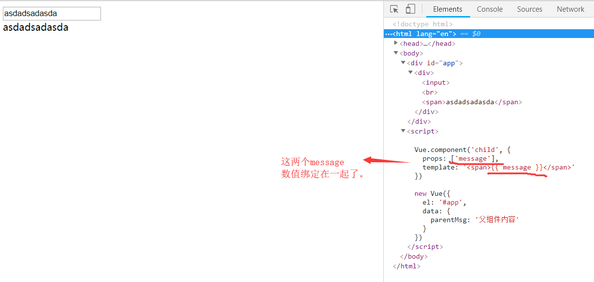

---

## 11.生命周期

<font color="red">在vue对象或组件的整个生命周期中，都有对应的函数来表示对象或组件的当前状态。每当组件或对象状态进行变化时，会触发这些函数。</font>


```html
<div id="vue_det">
    <span>{{val}}</span>
    <button v-on:click="change()">更改</button>
</div>

<script type="text/javascript">
    var vm = new Vue({
        el: '#vue_det',   
        data: {
           val:"job"
        },
        methods:{
            change:function(){
                this.val="tom";
            }
        },
        beforeCreate:function(){
            alert("组件或对象实例化前执行的beforeCreate函数");
        },
        created:function(){
            alert("组件或对象实例化后执行的created函数，但页面还未显示");
        },
        beforeMount:function(){
            alert("组件或对象加载前执行的beforeMount函数，但页面还未显示");
        },
        mounted:function(){
            alert("组件或对象加载后执行的mounted函数，页面已经显示");
        },
        beforeUpdate:function(){
            alert("组件或对象更新前执行的beforeUpdate函数，页面已经显示");
        },
        updated:function(){
            alert("组件或对象更新后执行的updated函数，页面已经显示");
        },
        beforeDestory:function(){
            alert("组件或对象销毁前执行的beforeDestory函数");
        },
        destoryed:function(){
            alert("组件或对象销毁后执行的destoryed函数");
        }
    })
</script>
```

---


## 12.vue-router路由

路由可以通过不同的 URL 访问不同的页面。类似于a标签。**使用Vue.js路由需要载入 vue-router库**

vue-router库的安装：
1. CDN方式: `https://unpkg.com/vue-router/dist/vue-router.js`
2. NPM方式：`cnpm install vue-router`

### 1.基础使用

步骤：1.创建组件。2，创建路由对象，并且配置路由规则(把路由路径和组件进行键值对匹配)。3，把路由对象加载到Vue实例中

```html
<!--引入必要的js文件-->
<script src="https://unpkg.com/vue/dist/vue.js"></script>
<script src="https://unpkg.com/vue-router/dist/vue-router.js"></script>

<div id="vue_det">
    <router-link to="/login">登录路由</router-link>
    <router-link to="/register">注册路由</router-link>
    <!--显示当前路由路径匹配的组件页面-->
    <router-view></router-view>
</div>

<script>
// 1. 定义组件
var loginView = { template: '<div>登录组件</div>' }
var registerView = { template: '<div>注册组件</div>' }
var rootView = { template:'<div>初始化组件</div>' }

// 2.创建路由对象.并且配置路由规则routes
//路由规则为键值对数据。分别是路由路径path,和匹配的组件component
var routerObj = new VueRouter({
  routes : [
    { path: '/', component: rootView },
    { path: '/login', component: loginView },
    { path: '/register', component: registerView }
  ]
})

// 3.把路由对象挂载道vue实例中
// 从而让页面有路由功能
var vm = new Vue({
    el: '#vue_det',   
    //把路由对象加载到Vue实例中
    router:routerObj    
})
</script>
```

<font color="red">

PS:
`<router-view></router-view>`是显示当前路由路径下匹配的组件的标签

</font>

### 2.`<router-link>`导航标签

1. to属性

to属性的几种使用方式
```js
//login是目标路由路径
<router-link to="/login">Login路由</router-link>
//to属性可以绑定vue实例中的data值
<router-link v-bind:to = "{path:'/login1'}">Login路由1</router-link>
//to属性可以传递参数
//请求变为：/login?id=1&name=qwe
<router-link v-bind:to = "{path:'/route1', query: { id:'1',name:'qwe' }}">Login路由2</router-link>
```

2. replace属性

使用replace属性。导航后不会留下 history 记录
```js
<router-link to="/login" replace>Login路由</router-link>
```

3. append属性

 设置append属性后，则在当前路径前添加基路径。

 ```js
//若当前页面路径为/a.点击下面的标签后。跳转的页面路径是 /b
<router-link to="/b"></router-link>

//若当前页面路径为/a.点击下面的标签后。跳转的页面路径是 /a/b
<router-link to="/b" append></router-link>
 ```

4. tag属性

使用tag属性，把标签改变为其他标签

```js
<router-link to="/login" tag="li">login</router-link>
//会渲染为li标签
<li>login</li>
```

---

## 13.VueAjax --- axios

Axios是一个HTTP库，可以用在浏览器和node.js中。Vue.js版本推荐使用axios来完成ajax请求。

使用方式：
1. CDN：`<script src="https://unpkg.com/axios/dist/axios.min.js"></script>`
2. NPM：`$ npm install axios`

### 1.GET请求

```js
new Vue({
    el: '#app',
    data () {
    },
    //mounted是当页面加载完成后执行
    mounted () {
    axios
        .get('...')
        .then(
          function(response){ // 请求成功处理
              console.log(response);
          }
        )
        .catch(
          function(error) { // 请求失败处理
              console.log(error);
          }
        );
    }
})
```

GET请求传递参数(两种)

```js
// 直接在 URL 上添加参数 ID=12345
axios.get('/user?ID=12345').then(...}).catch(...});

// 也可以通过 params 设置参数：
axios.get('/user',{params: { ID: 12345 } }).then(...}).catch(...});
```

### 2.POST请求

```js
new Vue({
  el: '#app',
  data () {
  },
  mounted () {
    axios
      .post('....')
      .then(
        function(response){ // 请求成功处理
          console.log(response);
        }
      )
      .catch(
        function (error) { // 请求失败处理
          console.log(error);
        }
      );
  }
})
```

POST请求传递参数

```js
axios.post('/user', {
    firstName: 'Fred',        // 参数 firstName
    lastName: 'Flintstone'    // 参数 lastName
  })
  ...
  ;
```

### 3.多个请求并发执行

```js
function a() {
  return axios.get('/user/12345');
}

function b() {
  return axios.get('/user/12345/permissions');
}

axios.all([a(), b()])
  .then(axios.spread(function (acct, perms) {
    // acct,perms是两个请求返回的值
  }));
```

### 4.请求后返回的响应数据结构

```js
{
  // `data` 由服务器提供的响应
  data: {},
  // `status` 来自服务器响应的 HTTP 状态码
  status: 200,
  // `statusText` 来自服务器响应的 HTTP 状态信息
  statusText: 'OK',
  // `headers` 服务器响应的头
  headers: {},
  // `config` 是为请求提供的配置信息
  config: {}
}

```

把请求返回的响应数据打印出来
```js
axios.get('/login')
  .then(function(response) {
    console.log(response.data);
    console.log(response.status);
    console.log(response.statusText);
    console.log(response.headers);
    console.log(response.config);
  });
```

## 14.使用 vue-cli构建工具 创建vue项目--当前教程内容为vue-cli2.0版本


<h3>什么是vue-cli？</h3>

vue-cli(vue-command line interface),vue命令行界面。
vue-cli是一个官方的cli,能为单页面应用 (SPA) 快速搭建繁杂的脚手架。只需要几分钟的时间就可以构建一个带有热重载、保存时 lint 校验，以及生产环境可用的项目文件。

<h3>什么是webpack？</h3>

webpack是一款模块加载器兼打包工具,能把less/sass文件,json文件，乃至css文件，全都打包成浏览器识别的js文件和静态资源文件。

<font color="red">注意：浏览器本身不能识别less/sass等文件。webpack就是把这些文件进行打包，编译，变成浏览器能识别的js,html文件</font>


**在使用vue-cli创建项目之前，需要之前安装 node.js + npm(一般安装node.js，就安装了npm)**

>1. 用npm 全局安装 vue-cli。（最新版本的vue-cli，本身就内部封装了webpack。所有安装vue-cli,就安装了webpack）

```
npm install -g vue-cli   #最新版本的vue-cli，本身就内部封装了webpack。所有安装vue-cli,就安装了webpack
```

<font color="red">使用命令 vue -V , 查看是否安装成功。</font>


>2. 创建一个文件夹，使用cmd 命令进入到文件夹。创建vue项目

```
##可以创建五种不同的模板

vue init webpack <project-name>  # 一个全面的webpack+vue-loader的模板，功能包括热加载，linting,检测和CSS扩展。
vue init webpack-simple <project-name>  # 一个简单webpack+vue-loader的模板，不包含其他功能，让你快速的搭建vue的开发环境。
vue init browserify <project-name>  # 一个全面的Browserify+vueify 的模板，功能包括热加载，linting,单元检测。
vue init browserify-simple <project-name>  # 一个简单Browserify+vueify的模板，不包含其他功能，让你快速的搭建vue的开发环境。
vue init simple <project-name>  # 一个最简单的单页应用模板。

```

样例：
```
D:\iview\demo>vue init webpack demo3

? Project name demo3   //项目名称 ，如果不需要更改直接回车就可以了。注意：这里不能使用大写字母
? Project description A Vue.js project   //项目描述，默认就回车
? Author suichen      //作者
? Vue build standalone       
? Install vue-router? Yes     //是否安装vue的路由插件，这里需要安装，所以选择Y
? Use ESLint to lint your code? No   //是否用ESLint来限制你的代码错误和风格。单人开发一般不需要，团队一般就需要
? Set up unit tests No     //是否需要安装单元测试工具
? Setup e2e tests with Nightwatch? No   //是否安装e2e来进行用户行为模拟测试
? Should we run `npm install` for you after the project has been created? (recommended) npm                    

   vue-cli · Generated "demo3".

~ ~ ~ ~ ~ ~
~ ~ ~ ~ ~ ~
~ ~ ~ ~ ~ ~
```

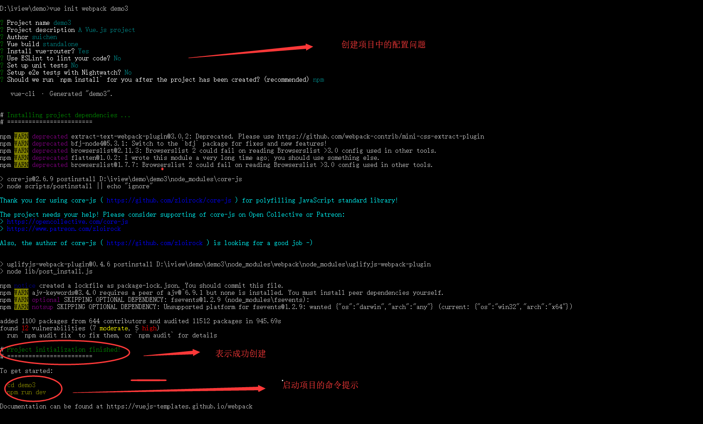

> 3. 安装完成后，可以进入到创建好的项目文件夹中，打开命令行，运行项目。

运行命令：`npm run dev`
```
D:\iview\demo\demo3>npm run dev

> demo3@1.0.0 dev D:\iview\demo\demo3
> webpack-dev-server --inline --progress --config build/webpack.dev.conf.js

 12% building modules 22/29 modules 7 active ...o\demo3\src\components\HelloWorld.vue{ parser: "babylon" } is deprecated; we now treat it as { parser: " 95% emitting

 DONE  Compiled successfully in 9162ms          23:14:11

 I  Your application is running here: http://localhost:8080
```

> 4. 打开http://localhost:8080地址,ctrl+c 关于项目运行

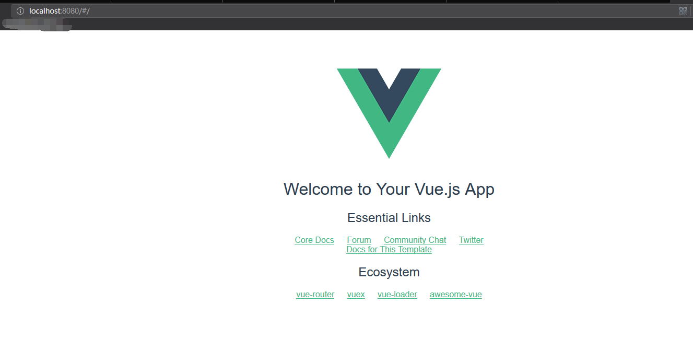

> 5. vue项目文件的结构

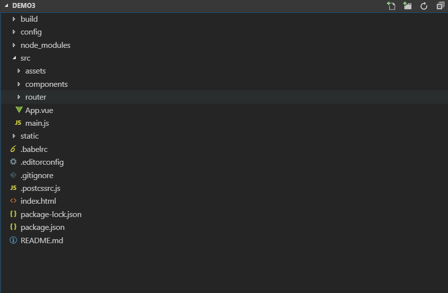

build:关于打包的配置文件所在文件夹
config：相关配置文件的文件夹
node_modules : 依赖的node工具包目录
src：前端源码文件
-- assets : 公共资源文件夹
-- router : 路由文件夹
-- components : 组件文件夹
-- App.vue:项目入口组件，.vue结尾的都是组件
-- main.js：项目入口js
static：存放静态资源，例如：图片等
baletrc: es6解析配置，用于解析最新的es6语法
editorconfig：编辑器配置文件
gitignore：git忽略配置，项目将不会进行提交有关git的文件
index.html:项目单页面入口
package.json:项目配置文件，项目描述，项目版本号，项目依赖安装库等

> 6.vue项目进行打包, `npm run build`。打包完成后，项目结构会出现dist文件夹。

```
D:\iview\demo\demo3>npm run build

> demo3@1.0.0 build D:\iview\demo\demo3
> node build/build.js

Hash: 811a1826f96982d65b8d
Version: webpack 3.12.0
Time: 5734ms
                                                  Asset       Size  Chunks             Chunk Names
               static/js/vendor.eefaac73d06c156e050b.js     120 kB       0  [emitted]  vendor
                  static/js/app.b22ce679862c47a75225.js    11.6 kB       1  [emitted]  app
             static/js/manifest.2ae2e69a05c33dfc65f8.js  857 bytes       2  [emitted]  manifest
    static/css/app.30790115300ab27614ce176899523b62.css  432 bytes       1  [emitted]  app
static/css/app.30790115300ab27614ce176899523b62.css.map  828 bytes          [emitted]
           static/js/vendor.eefaac73d06c156e050b.js.map     602 kB       0  [emitted]  vendor
              static/js/app.b22ce679862c47a75225.js.map    22.2 kB       1  [emitted]  app
         static/js/manifest.2ae2e69a05c33dfc65f8.js.map    4.97 kB       2  [emitted]  manifest
                                             index.html  507 bytes          [emitted]

  Build complete.

  Tip: built files are meant to be served over an HTTP server.
  Opening index.html over file:// won't work.


D:\iview\demo\demo3>
```

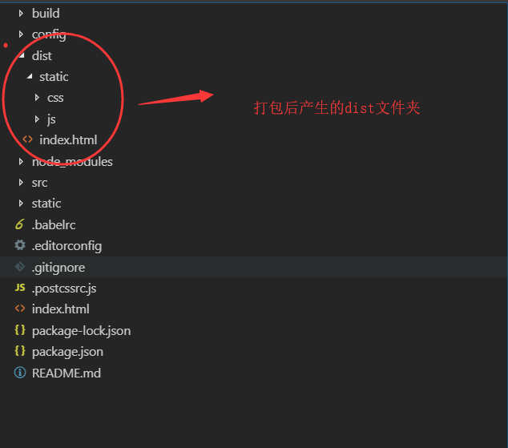

最后只需要将 dist 文件夹放到服务器中运行就行了。


