[toc]

# Vue3笔记

[vue3官方文档](https://cn.vuejs.org/guide/introduction.html)

> Vue3和Vue2相比，有什么区别？

区别如图所示
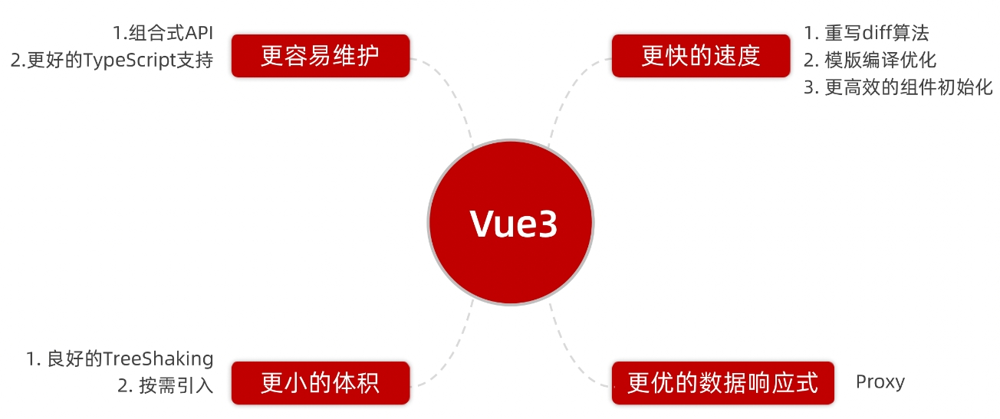


> 新的脚手架工具 create-vue

- vue-cli是上一代Vue官方的脚手架工具，其底层是webpack。
- create-vue是Vue官方最新的脚手架工具，这个脚手架工具的底层是 vite 。

目前主要通过crete-vue脚手架工具来搭建vue3的前端工程。而vue-cli脚手架工具是搭建vue2的前端工程。
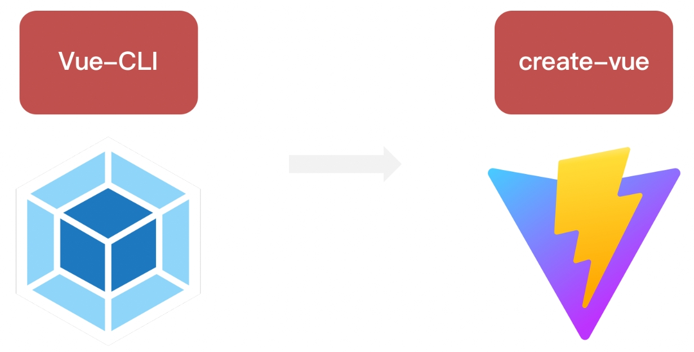

## 使用create-vue脚手架创建vue3工程

前置条件如下
- 需要安装16.0或更高版本的Node.js
- 需要安装create-vue脚手架

① 执行如下命令，这一指令将会安装create-vue脚手架工具。并为你创建一个vue3模板工程

```bash
# 如果检测到没有create-vue脚手架工具，会帮助你安装。
# 如果已安装create-vue脚手架工具，则直接创建一个vue3模板工程
npm init vue@latest
```

注意：在创建工程的过程中，会有很多选项。由于现在只是展示如果创建工程。因此选择都选否。

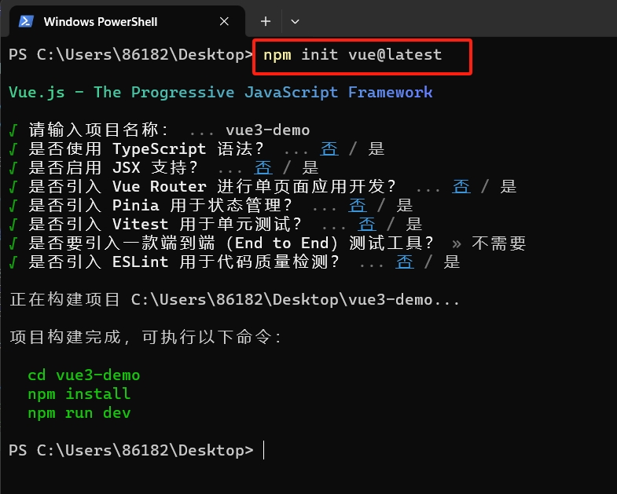

② 下载工程依赖，并启动工程

```bash
# 进入到工程目录
cd vue3-demo
# 下载安装工程的依赖包
npm install 
# 启动工程
npm run dev
```

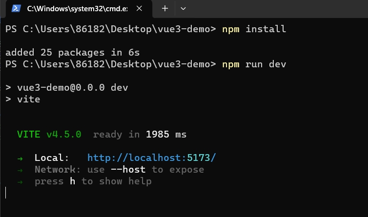

③ 当前端工程启动后，浏览器访问前端工程的首页。

如图所示
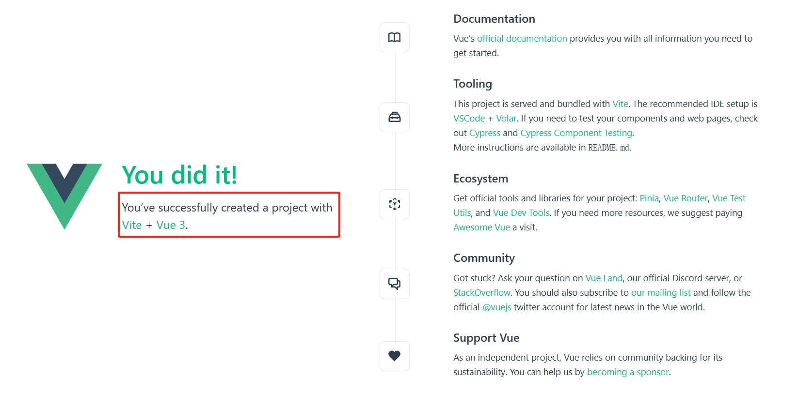

### 工程中的文件

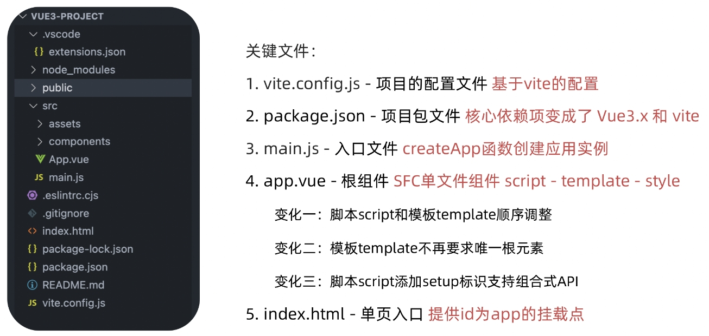

- index.html 主页面
```html
<!DOCTYPE html>
<html lang="en">
  <head>
    <meta charset="UTF-8">
    <link rel="icon" href="/favicon.ico">
    <meta name="viewport" content="width=device-width, initial-scale=1.0">
    <title>Vite App</title>
  </head>
  <body>
    <div id="app"></div>
    <script type="module" src="/src/main.js"></script>
  </body>
</html>
```

- APP.vue APP根组件
```html
<script setup>
import HelloWorld from './components/HelloWorld.vue'
import TheWelcome from './components/TheWelcome.vue'
</script>

<template>
  <header>
    

    <div class="wrapper">
      <HelloWorld msg="You did it!" />
    </div>
  </header>

  <main>
    <TheWelcome />
  </main>
</template>
```

APP.vue就是vue的根组件文件。所有的vue组件都是挂载到APP.vue这个根组件下的。

- main.js 主js文件
```js
// 导入主要的样式文件
import './assets/main.css'
// 从vue库中导入一个函数，createApp
import { createApp } from 'vue'
// 导入APP.vue文件
import App from './App.vue'
//通过createApp函数将APP.vue文件挂载到index.html中的id=app的html标签上。
createApp(App).mount('#app')
```

main.js文件的作用如下：
- 首先导入主样式main.css文件
- 导入createApp函数和APP.vue文件
- 将APP.vue文件挂载到index.html中id=app的html标签上。
- 所有有关vue的页面样式都是先在APP.vue根组件中渲染，然后在挂载到index.html中展示出来。


## 组合式API

### Vue3的组合式API和Vue2的选项式API的区别

vue2的选项式API的写法：

```vue
<script>
export default {
  //数据
  data(){
    return {
      count:0
    }
  },
  //方法
  methods:{
    addCount(){
      this.count++
    }
  }
}
</script>
<template>
  <div>{{count}}</div>
  <button @click="addCount">按钮</button>
</template>
```

- 在Vue2的选项式API中是将某个模块的数据和方法代码分别写在data区域和methods区域中，等于将某个模块关联的数据和方法代码拆分开了。这样不利于模块的维护，并且后期如果想要复用模块，由于数据和方法代码的分散，反而不好进行复用了。

vue3的组合式API的写法（有两种）：

第一种：
```vue
<script>
import { ref } from 'vue'
export default {
    setup(){
      const count = ref(0)
      const addCount = ()=>{ count.value++ }
      // 必须return才可以
      return {
        count,
        addCount
      }
    }
}
</script>
<template>
  <div>{{ count }}</div>
  <button @click="addCount">按钮</button>
</template>
```

第二种
```vue
<script setup>
import { ref } from 'vue'
//数据
const count = ref(0)
//方法
const addCount = ()=> { count.value ++ }
</script>
<template>
  <div>{{ count }}</div>
  <button @click="addCount">按钮</button>
</template>
```

- Vue3的组合式API的写法，是将功能模块的数据和方法代码集中写在一起。这样容易对模块进行维护和复用代码。
- 注意组合式API写法中，数据和方法的代码都是写在setup函数中。并且必须将数据和方法以对象的方式return出去，才能让模板页面使用。第一种写法就return了，第二种写法是通过`<script setup>`标签，这个标签默认会添加return语句。


### setup 函数

- setup()函数是在组件中使用组合式API的入口。setup()函数中return的对象可以让模板和组件实例来使用。
- 通常情况下推荐使用`<script setup>`标签，这个标签封装了setup函数和return。

setup函数的生命周期是在beforeCreate函数之前执行
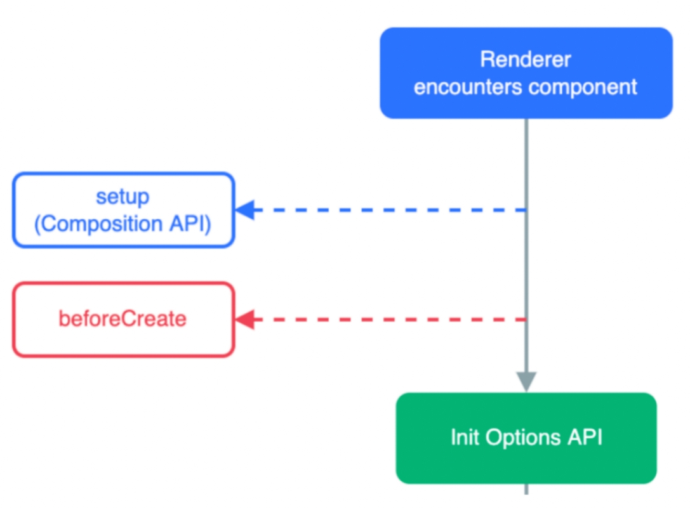

### ref 函数

ref函数接收简单类型或者对象类型的数据传入并返回一个响应式的对象。

例子
```vue
<script setup>
 // 导入 ref 函数
 import { ref } from 'vue'
 // 执行ref函数 传入参数 变量接收
 const count = ref(0)
 const student = ref({id:1,name:'xiaoming',age:11})
 const setCount = ()=>{
   // 修改数据更新视图必须加上.value
   count.value ++
   student.value.age ++
 }
</script>

<template>
    <div>
        <li>学生信息</li>
        <li>id: {{ student.id }}</li>
        <li>name: {{ student.name }}</li>
        <li>age: {{ student.age }}</li>
    </div>
    <button @click="setCount">{{count}}</button>
</template>
```

- 在js代码中使用 ref函数 返回的响应对象时，我们需要添加.value。才能获取响应对象的值。
- 在模板组件中使用 ref函数 返回的响应对象时，我们不需要附加 .value，就能获取响应对象的值。


> 为什么要使用 ref函数？

为什么我们需要通过 ref 函数获取响应式对象，而不是直接使用普通的变量？这涉及 Vue 的响应式系统是如何工作的。

当你在模板组件中使用了一个 ref ，然后改变了这个 ref 的值时，Vue 会自动检测到这个变化，并且相应地更新 DOM。这是通过一个基于依赖追踪的响应式系统实现的。当一个组件首次渲染时，Vue 会追踪在渲染过程中使用的每一个 ref。然后，当一个 ref 被修改时，它会触发追踪它的组件的一次重新渲染。

总结：通过 ref 函数获取的响应式对象。vue会实施监控这个响应式对象的变化，并及时更新。然后会重新渲染与响应式对象相关的模板组件。

如果不使用ref函数获取的响应式对象，而是使用普通的对象。那么vue无法实时检测和更新这些普通对象。

### reactive 函数

reactive 函数接受对象类型数据的参数传入并返回一个响应式的对象。作用和ref函数类似，只不过只能接收对象类型数据，不能接收普通数据。

例子
```vue
<script setup>
 // 导入
 import { reactive } from 'vue'
 // 执行函数 传入参数 变量接收
 const state = reactive({ msg:'this is msg'})
 const setSate = ()=>{
   // 修改数据更新视图
   state.msg = 'this is new msg'
 }
</script>

<template>
  {{ state.msg }}
  <button @click="setState">change msg</button>
</template>
```

> reactive函数 对比 ref函数

1. 都是用来生成响应式数据对象的。
2. 不同点
   - reactive不能处理简单类型的数据，ref能处理更新参数类型。
   - ref函数返回的对象必须在js代码中通过.value做访问修改。reactive不用
   - ref函数的内部实现基于reactive函数
3. 在实际工作中的推荐
   - 推荐使用ref函数，减少记忆负担。


### 计算属性: computed 函数

计算属性computed函数基本和Vue2保持一致，组合式API下的计算属性computed函数只是修改了API写法。

例子
```vue
<script setup>
import { reactive, computed } from 'vue'
const author = reactive({
  name: 'John Doe',
  books: [
    'Vue 2 - Advanced Guide',
    'Vue 3 - Basic Guide',
    'Vue 4 - The Mystery'
  ]
})
// 一个计算属性 ref
const publishedBooksMessage = computed(() => {
  return author.books.length > 0 ? 'Yes' : 'No'
})
</script>

<template>
  <p>Has published books:</p>
  <span>{{ publishedBooksMessage }}</span>
</template>
```

Vue 的计算属性会自动追踪响应式对象。它会检测到 publishedBooksMessage 依赖于 author.books，所以当 author.books 改变时，任何依赖于 publishedBooksMessage 的绑定都会同时更新。


### watch 函数

- watch 函数用于侦听一个或者多个数据的变化，数据变化时执行回调函数。
- watch 函数有两个额外参数: immediate用来控制回调函数是否立刻执行，deep用于开启深度侦听

> 侦听单个数据

```vue
<script setup>
  // 1. 导入watch
  import { ref, watch } from 'vue'
  const count = ref(0)
  const updateCount = () => { count.value ++ }

  // 2. 调用watch 侦听变化
  watch(count, (newValue, oldValue)=>{
    console.log(`count发生了变化，老值为${oldValue},新值为${newValue}`)
  })
</script>

<template>
  <div>{{ count }}</div>
  <button @click="updateCount"> change button</button>
</template>
```

> 侦听多个数据，第一个参数可以改写成数组的写法

```vue
<script setup>
  // 1. 导入watch
  import { ref, watch } from 'vue'
  const count = ref(0)
  const name = ref('cp')
  // 2. 调用watch 侦听变化
  watch([count, name], ([newCount, newName],[oldCount,oldName])=>{
    console.log("count或者name变化了"，[newCount, newName],[oldCount,oldName])
  })
</script>
```

> immediate 参数

watch监听器默认是懒执行的：仅当数据源变化时，才会执行回调函数。但在某些场景中，我们希望在创建侦听器时，立即执行一遍回调函数。

可以通过传入 immediate: true 选项来强制侦听器的回调函数立即执行一次。

```vue
<script setup>
  // 1. 导入watch
  import { ref, watch } from 'vue'
  const count = ref(0)
  // 2. 调用watch 侦听变化
  watch(count, (newValue, oldValue)=>{
    console.log(`count发生了变化，老值为${oldValue},新值为${newValue}`)
  },{immediate: true})
</script>
```

> deep 参数

通过watch监听的ref响应式对象默认是浅层侦听的，直接修改响应式对象的属性值是不会触发回调执行，需要开启deep深度监听才行。

```vue
<!-- 没有开启deep深度监听 -->
<script setup>
  // 1. 导入watch
  import { ref, watch } from 'vue'
  const state = ref({ count: 0 })
  // 2. 监听对象state
  watch(state, ()=>{
    console.log('数据变化了')
  })
  const changeStateByCount = ()=>{
    // 直接修改不会引发回调执行
    state.value.count++
  }
</script>

<!-- 开启deep深度监听 -->
<script setup>
  // 1. 导入watch
  import { ref, watch } from 'vue'
  const state = ref({ count: 0 })
  // 2. 监听对象state 并开启deep
  watch(state, ()=>{
    console.log('数据变化了')
  },{deep:true})
  const changeStateByCount = ()=>{
    // 此时修改可以触发回调
    state.value.count++
  }
</script>
```

## 生命周期

vue生命周期图示


选项式API和组合式API的生命周期函数对比
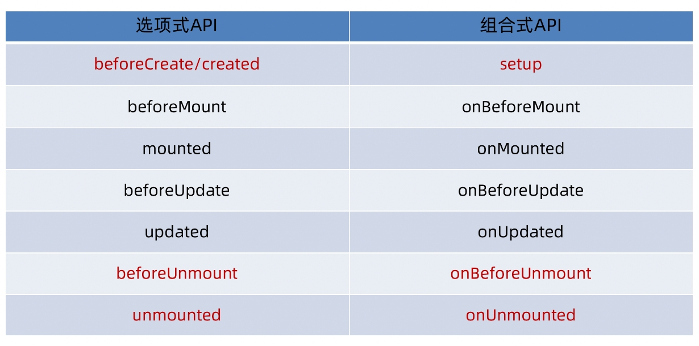

如图所示，beforeCreate和created相关方法都被setup代替了，因此经常写在beforeCreate和created的代码都写在setup中即可。

这些生命周期函数会在模板组件生命周期的不同阶段被调用，最常用的是 onMounted、onUpdated 和 onUnmounted。

> 使用生命周期函数

1. 导入生命周期函数
2. 执行生命周期函数，传入回调。
3. 有多个相同的生命周期函数的时候，会按照顺序依次执行。

例子

```vue
<script setup>
import { onBeforeMount, onBeforeUnmount, onBeforeUpdate, onMounted, onUnmounted, onUpdated } from 'vue'
onBeforeMount(()=>{
  console.log("this is onBeforeMount");
})
onMounted(() => {
    // 自定义逻辑
  console.log("this is onMounted11111");
})
onMounted(()=>{
   // 自定义逻辑
   console.log("this is onMounted2222");
})
onBeforeUpdate(()=>{
  console.log("this is onBeforeUpdate");
})
onUpdated(()=>{
  console.log("this is onUpdated");
})
onBeforeUnmount(()=>{
  console.log("this is onBeforeUnmount");
})
onUnmounted(()=>{
  console.log("this is onUnmounted");
})
</script>
```

## 父子组件通信

### 父传子数据

1. 父组件中给子组件绑定属性
2. 子组件内部通过props选项接收数据

父组件
```vue
<script setup>
import { ref } from 'vue';
// 引入子组件
import child from './child.vue'
const student = ref({
  id:10,
  name:"xiaoming"
})
</script>

<!--父组件传递普通数据和响应式对象数据给子组件-->
<template>
  <div><child message="this is message" :info="student"/></div>
</template>
```

- message="this is message"。给message属性绑定字符串。
- :info的意思是v-bind:info。即给info属性绑定info响应式对象数据。

子组件
```vue
<script setup>
// 由于setup，无法直接在子组件中配置props选项。
// 子组件通过defineProps函数来接收父组件传递的数据
const props = defineProps({
    message: String,
    info: Object
})
console.log("message is ",props.message);
console.log("info is ",props.info);
</script>

<template>
  <div>Child.vue : {{ message }}</div>
  <div>Child2.vue : {{ info }}</div>
</template>
```

### 子传父数据

1. 在父组件中给子组件标签通过@绑定事件
2. 子组件内部通过 emit 方法触发这个事件。从而让子组件传递数据给父组件。

父组件
```vue
<script setup>
// 引入子组件
import child from './child.vue'
const getMessage = (str)=>{
  console.log("str is ",str);
}
</script>

<template>
<!--给子组件绑定事件-->
  <div><child @get-message = "getMessage"/></div>
</template>
```

子组件
```vue
<script setup>
// 通过defineEmits来创建emits方法
const emits = defineEmits(['get-message'])
const sendMsg = ()=>{
    //触发自定义事件，并传递参数给该事件。从而传递数据给父组件
    emits('get-message','this is a message')
}
</script>

<template>
  <button @click="sendMsg">button 1</button>
</template>
```

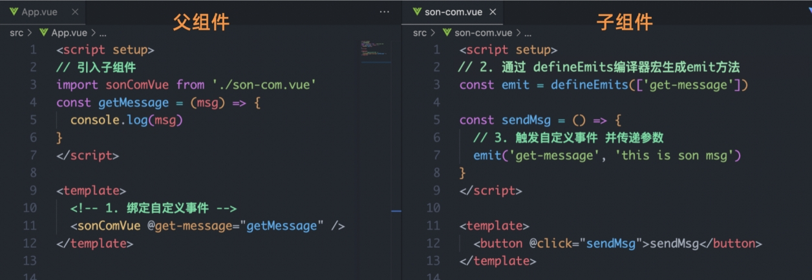


## 组件跨层通信

通常情况下，当我们需要从父组件向子组件传递数据时，会使用 props。若父组件与子组件相隔很多中间组件，那么使用 props 则必须将其沿着组件链逐级传递下去，这会非常麻烦。

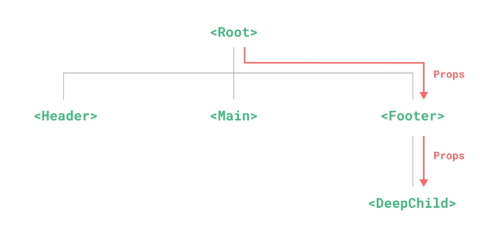

provide()函数 和 inject()函数 可以帮助我们解决这一问题。可以让上层组件向任意的底层组件传递数据和方法，实现跨层组件通信
- 上层组件通过provide()函数给底层组件提供数据。
- 底层组件通过inject()函数获取上层组件提供的数据。

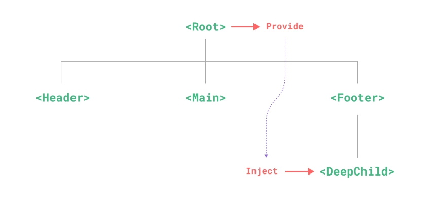


<font color="red">注意：顶层组件与底层组件之间可以通过组件链互相联系，否则无法传递数据。</font>


### 跨层传递普通数据

实现步骤
1. 顶层组件通过 `provide` 函数提供数据
2. 底层组件通过 `inject` 函数获取数据

父组件
```vue
<script setup>
import { provide } from 'vue';
import child from './child.vue';
//在父组件将key1数据提供出去
provide("key1","this is key1")
</script>

<template>
  <div><child/></div>
</template>
```

子组件
```vue
<script setup>
import { inject } from 'vue';
// 获取上层组件提供的数据key1
const key1 = inject("key1")
</script>

<template>
  <div>Child.vue : {{ key1 }}</div>
</template>
```

### 跨层传递响应式对象数据

在调用provide函数时，第二个参数设置为ref对象

父组件
```vue
<script setup>
import { provide, ref } from 'vue';
import child from './child.vue'
// 创建响应式对象key1
const key1 = ref({id:1,name:"xiaoming"})
//在父组件将key1数据提供出去
provide("key1",key1)
</script>

<template>
  <div><child/></div>
</template>
```

子组件
```vue
<script setup>
import { inject } from 'vue';
// 获取上层组件提供的数据key1
const key1 = inject("key1")
</script>

<template>
  <div>Child.vue : {{ key1 }}</div>
</template>
```

### 跨层传递方法

顶层组件可以向底层组件传递方法，底层组件可以调用方法修改顶层组件的数据。通常情况下建议不要修改。遵循那个组件的数据就由那个组件负责修改。

父组件
```vue
<script setup>
import { provide } from 'vue';
import child from './child.vue'

const key1Method = ()=>{
  console.log("this is key1");
}
provide("key1",key1Method)
</script>

<template>
  <div><child/></div>
</template>
```

子组件
```vue
<script setup>
import { inject } from 'vue';
const key1Method = inject("key1")
</script>

<template>
  <div>Child.vue : {{ key1 }}</div>
  <button @click="key1Method">Button</button>
</template>
```

## 模板引用

虽然Vue的声明性渲染模型为你抽象了大部分对 DOM 的直接操作，但在某些情况下，我们仍然需要直接访问底层 DOM 元素。要实现这一点，我们可以使用特殊的 ref 标签属性。

通过ref标签属性可以获取真实的dom元素对象或者组件实例对象

### 基本使用

实现步骤：
1. 调用ref函数生成一个ref对象
2. 通过ref标识绑定ref对象到标签上
3. 通过ref对象.value即可获取到绑定标签的DOM元素。

例子：
```vue
<script setup>
import { ref, onMounted } from 'vue'

// 首先声明一个 ref 来存放该DOM元素的引用
// 必须和模板里的 ref 同名
// 例如这里获取了input DOM元素对象
const input = ref(null)

onMounted(() => {
    // 在这里操作input元素，获取到输入框的聚焦事件。
  input.value.focus()
})
</script>

<template>
  <input ref="input"/>
</template>

```

> v-for中模板应用

当在 v-for 中使用模板引用时，对应的 ref 中包含的值是一个数组，它将在元素被挂载后包含对应整个列表的所有元素。

```vue
<script setup>
import { ref, onMounted } from 'vue'

const list = ref([1, 2, 3])
// 数组DOM元素
const itemRefs = ref([])
onMounted(() => {
    //弹框
  alert(itemRefs.value.map(i => i.textContent))
})
</script>

<template>
  <ul>
    <li v-for="item in list" ref="itemRefs">
      {{ item }}
    </li>
  </ul>
</template>
```

> 获取组件实例对象

例子：
```vue
<script setup>
import { ref } from 'vue';
//引入子组件
import child from './child.vue'
// 定义ref对象key
const key = ref(null);
// 将ref对象key的值打印出来
const getMessage = ()=>{
//这里会把ref对象key绑定的组件child信息打印出来
  console.log("key is ",key.value);
}

</script>

<template>
  <!--将ref对象key与子组件child绑定-->
  <div><child ref="key"/></div>
  <button @click="getMessage">button1</button>
</template>
```

### defineExpose()

默认情况下在`<script setup>`中组件内部的属性和方法是无法通过ref标识获取到的。但是可以通过defineExpose编译宏指定组件的哪些属性和方法可以访问。

具体用法，查阅官方文档。


## Vue3.3 新特性-defineOptions

在 Vue 3.3 中新引入了defineOptions宏函数。主要是用来定义模板页面的基本信息选项。可以用 defineOptions 定义任意的选项， props, emits, expose, slots 除外（因为这些可以使用 defineXXX 来做到）

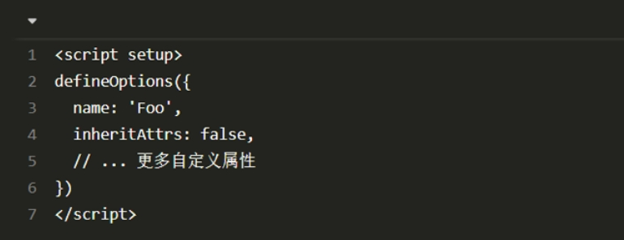
