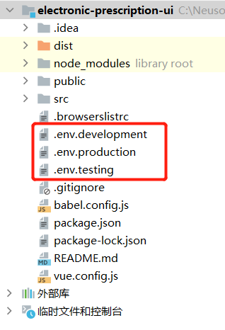

[toc]

## 配置不同环境的配置文件



```conf
## 开发环境配置
## .env.development
VUE_APP_ENV = 'development'
VUE_APP_AXIOS_BASE_URL = "/elec-prcs/dev"
```

```conf
## 生产环境配置
## .env.production
VUE_APP_ENV = 'production'
VUE_APP_AXIOS_BASE_URL = "/elec-prcs/prd"
```

```conf
## 测试环境配置
## .env.testing
VUE_APP_ENV = 'testing'
VUE_APP_AXIOS_BASE_URL = "/elec-prcs/test"
```

如果获取配置文件的参数变量：
```js
// 注意：用户自定义的变量需要以 VUE_APP_ 前缀开头，这样才能在代码中访问到变量。

//使用方式
console.log(process.env.VUE_APP_AXIOS_BASE_URL)

```

## 打包不同环境的项目

当不同环境的配置文件不同时。可以让vue-cli3脚手架打包不同环境的前端项目。

第一步： 修改package.json文件

```json
{
  "scripts": {
    "dev": "vue-cli-service serve",
    "build": "vue-cli-service build",
    "testing": "vue-cli-service build --mode=testing"
  }
}

//注意：mode后面test、production 等预留参数是无效的。必须添加预留之外的参数。
```

第二步：运行打包命令

```conf

# 测试环境打包
npm run testing

# 生产环境打包
npm run build

```
