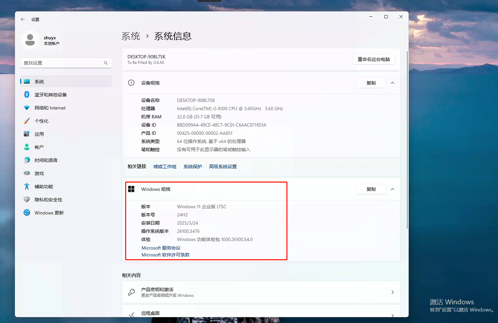
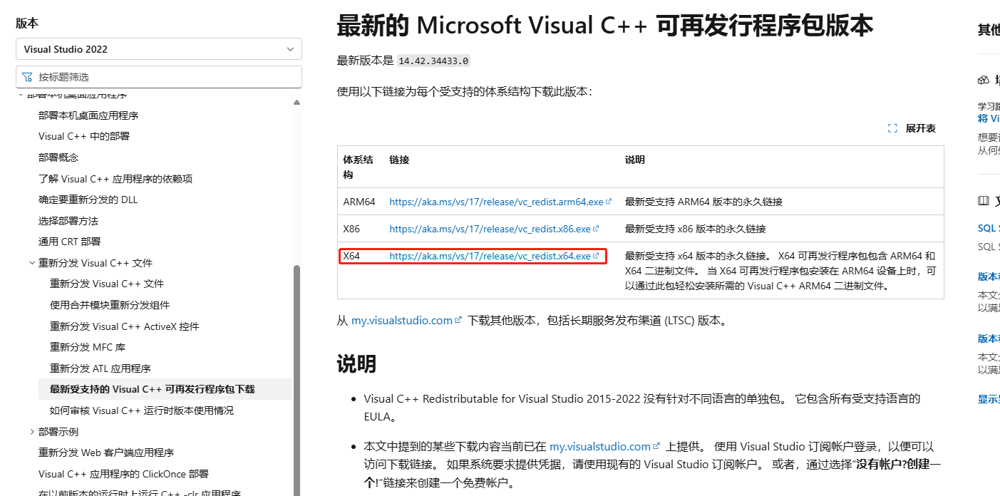
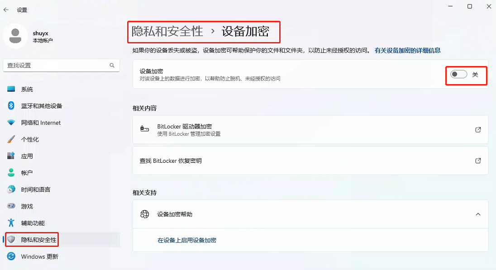
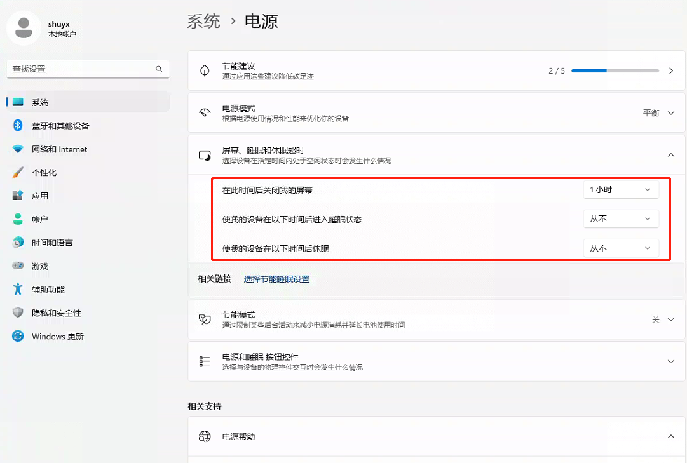
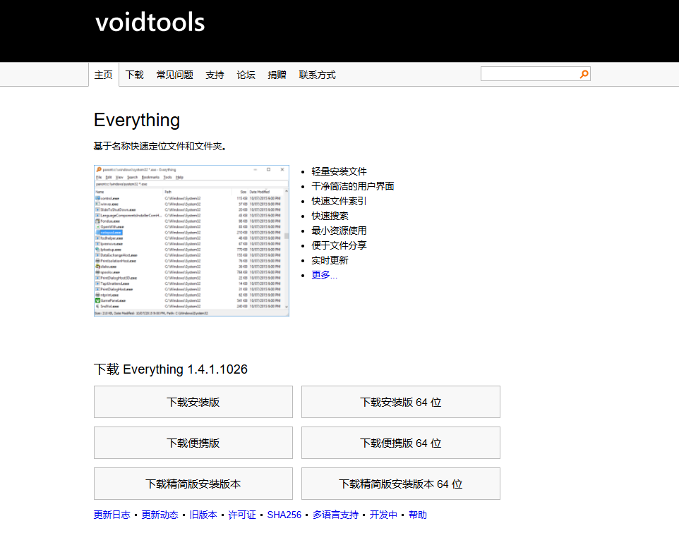

[toc]

# win11 NAS笔记

之前用过黑群晖，unraid作为nas系统。但是由于各种原因，目前打算将windows 11作为nas系统。

正好win 11 LTSC 2024 版发布了。

## 安装 Win 11 LTSC 2024 版

> 什么是LTSC版本

简单来说，LTSC版本 是微软针推出的长期服务版。相比企业版或消费者版。LTSC版去掉了很多不必要功能和软件，系统大幅精简，同时还没有频繁的更新打扰。

正因为这些特性，LTSC 版本才深受大量普通消费者喜爱。

> 下载

推荐大家在 [微软官网 https://www.microsoft.com/zh-cn/](https://www.microsoft.com/zh-cn/) 或者 [itellyou网站 https://next.itellyou.cn/](https://next.itellyou.cn/) 中下载Win 11 LTSC版本的ISO镜像文件。

> 安装系统

自行百度。我在安装的过程，多次安装失败。结果发现是其他硬盘的原因。

可以先把电脑中的其他硬盘全部取出，只保留安装win11系统的硬盘。然后再开始安装win11 ltsc系统。

> 系统信息

系统信息如图所示



## win11 设置

当win11 ltsc系统安装成功后。但是想要作为一个nas系统，还需要进行一些设置。

### 推荐使用本地账户

在系统初始化界面中，我们可以选择「我没有 Intemet 连接」即可顺利注册本地账户。

### Windows 11 LTSC KMS激活（非激活工具）

安装系统之后，还需要激活系统。否则一些功能无法使用。

1. 打开PowerShell，选择以管理员身份运行 PowerShell。
2. 输入以下命令激活系统。

```sh
slmgr -ipk M7XTQ-FN8P6-TTKYV-9D4CC-J462D
slmgr -skms kms.0t.net.cn
slmgr -ato
```

注意KMS激活有效期限为180天，只要KMS服务器还能访问，那么就可以一直持续激活下去。除非KMS服务器无法访问了。

### 删除C盘中多余的文件

当系统安装好后,会发现C盘占用在50G左右，我们可以清理C盘。分别删除 Win 11 默认的保留空间、休眠文件。

> 删除保留空间和休眠文件

1. 打开PowerShell，选择以管理员身份运行 PowerShell。
2. 输入以下命令并回车即可。

```sh
## 删除保留的储存空间
dism.exe /online /set-reservedstoragestate /state:disabled

## 删除休眠文件
powercfg -h off
```


### 安装微软商店

微软对 Win 11 LTSC 2024 进行了大量精简工作，系统仅自带 edge 浏览器和部分的必要软件，像微软商店和常用的新版照片查看器都已被砍掉。

> 安装微软商店

1. 打开PowerShell，选择以管理员身份运行 PowerShell。
2. 输入以下命令。即可自动安装微软商店。

```sh
wsreset –i
```

当微软商店安装好后，就可以在商店中下载照片查看器了。


### 安装完整运行库和环境

在使用 Win 11 LTSC 2024 时会担心无法稳定兼容各类生产力和游戏环境，其实这是因为没有安装完整运行库和环境的原因。

> 可以前往以下地址下载最新微软`.NET`运行库。


[最新微软.NET 运行库下载 https://dotnet.microsoft.com/zh-cn/download](https://dotnet.microsoft.com/zh-cn/download)

> 可以前往以下地址下载最新 Visual C++ 运行库



[最新微软Visual C++ 运行库下载 https://learn.microsoft.com/zh-cn/cpp/windows/latest-supported-vc-redist?view=msvc-170](https://learn.microsoft.com/zh-cn/cpp/windows/latest-supported-vc-redist?view=msvc-170)

### 关闭 Bitlocker 硬盘加密

1. 进入到系统设置界面
2. 点击左侧“隐私和安全性”菜单，然后进入右侧的“设备加密”选项
3. 将设备加密选项关闭即可

等待系统解密完成后，就完成了Bitlocker关闭。



### 显示文件扩展名

windows系统默认不显示文件的文件扩展名。

有时候，当我们处理文件的时候，可以直接通过文件扩展名来判断文件类型，比较方便。

### 关闭休眠

由于win11 作为nas系统，需要长期运行。因此建议关闭休眠。



## 应用

### 360压缩

一个好用的压缩，解压软件。

[360压缩下载地址 https://yasuo.360.cn/](https://yasuo.360.cn/)

### 向日葵 远程控制

用于远程控制，无需公网IP。

### potplayer 视频播放器

[potplayer 中文官网 https://potplayer.tv/?lang=zh_CN](https://potplayer.tv/?lang=zh_CN)


### 迅雷下载

国内下载一些文件，特别是一些冷门文件，还是需要用到迅雷。

### Everything 文件搜索

Everything 是一个非常好用的文件搜索工具。

[Everything 官网 https://www.voidtools.com/zh-cn/](https://www.voidtools.com/zh-cn/)



### FastCopy 文件复制

FastCopy是Windows上最快的复制/备份软件

[FastCopy 官网 https://fastcopy.jp/](https://fastcopy.jp/)


### 硬盘检测工具 CrystalDiskInfo

CrystalDiskInfo 是一款免费开源的硬盘健康监测工具，主要通过读取硬盘的 S.M.A.R.T.（自我监测、分析及报告技术） 数据，实时评估硬盘的健康状态并提供预警功能。

通过 CrystalDiskInfo，可直观掌握硬盘状态，及时采取措施保护数据安全。

[CrystalDiskInfo 下载链接 https://crystalmark.info/en/software/crystaldiskinfo/](https://crystalmark.info/en/software/crystaldiskinfo/)

### 安装 docker desktop

docker desktop 是 docker 在 windows系统上的docker开发工具。可以通过它来更具快捷方便的使用docker。

[docker desktop 下载地址 ]()

