[toc]

# XXL-job笔记1

[xxl-job官网文档](https://www.xuxueli.com/xxl-job/)

XXL-JOB是一个分布式任务调度平台，其核心设计目标是开发迅速、学习简单、轻量级、易扩展。

XXL是作者名字的首字母的缩写。

> 什么是任务调度平台？

任务调度平台本质上就是一个定时任务的实现方案。

在生活中，经常有一些业务场景需要定时任务来执行。例如在某个时间点批量处理数据或者每隔10分钟需要执行一次特定任务等。

## docker 部署XXL-job的调度中心

XXL-job的调度中心需要依赖Mysql。因此部署调度中心，需要先在Mysql中创建xxl-job相关的数据库表。

> 步骤① 创建xxl-job数据库

去Github下载最新发布的xxl-job源码，`https://github.com/xuxueli/xxl-job/releases`，找到`/xxl-job/doc/db/tables_xxl_job.sql`文件。在mysql中执行sql文件即可，脚本里面包含xxl_job数据库的创建。

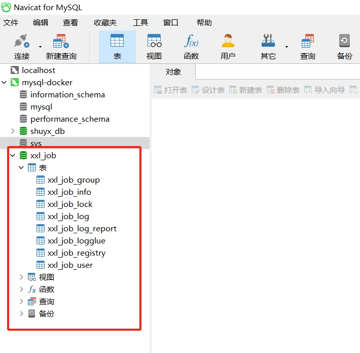

> 步骤② 创建并启动xxl-job容器

xxl-job的docker镜像地址：`https://hub.docker.com/r/xuxueli/xxl-job-admin`

```bash
# 下载指定版本的xxl-job镜像
docker pull xuxueli/xxl-job-admin:2.4.0

# 创建xxl-job容器

# 如需自定义 mysql 等配置，可通过 "-e PARAMS" 指定，参数格式 PARAMS="--key=value  --key2=value2"
# 配置项参考文件：/xxl-job/xxl-job-admin/src/main/resources/application.properties
# 如需自定义 JVM内存参数 等配置，可通过 "-e JAVA_OPTS" 指定，参数格式 JAVA_OPTS="-Xmx512m"
# /d/DockerVolumes/xxljob 容器数据卷。指代D盘的DockerVolumes目录中的。。。

docker run -e PARAMS="--spring.datasource.url=jdbc:mysql://172.17.0.2:3306/xxl_job?useUnicode=true&characterEncoding=utf8&autoReconnect=true&allowPublicKeyRetrieval=true&useSSL=false&serverTimezone=Asia/Shanghai --spring.datasource.username=root --spring.datasource.password=123456" -p 37100:8080 -v /d/DockerVolumes/xxljob/data/applogs:/data/applogs --name myXXLjob-admin  -d xuxueli/xxl-job-admin:2.4.0
```

<font color="red">

注意事项：
1. `172.17.0.2`是mysql容器的ip。`3306`是mysql容器的端口，切记是3306端口，而不是mysql容器的映射到宿主机上的端口，映射端口是给宿主机访问使用的，容器之间互相访问不需要映射端口。另外xxl-job容器需要依赖mysql，否则xxl-job容器无法成功启动。
2. `/d/DockerVolumes/xxljob/data/applogs`是xxl-job容器的容器数据卷。用来保存xxl-job容器的数据。
3. mysql容器重启之后，mysql容器的ip容易发生改变。解决方法：更换xxl-job容器的配置。或者通过docker network来连接mysql容器。
4. 另外调度中心的配置文件是源代码中的`/xxl-job/xxl-job-admin/src/main/resources/application.properties`。可以自行在容器命令中进行修改。

</font>

调度中心完整配置内容如下所示。上面就是通过命令行的方式来替换为自己的配置。

```properties
### 调度中心连接mysql的连接地址，可替换为自己的mysql连接地址
spring.datasource.url=jdbc:mysql://127.0.0.1:3306/xxl_job?useUnicode=true&characterEncoding=utf8&autoReconnect=true&allowPublicKeyRetrieval=true&useSSL=false&serverTimezone=Asia/Shanghai
# 默认的mysql账号密码，可以替换为自己的mysql账号密码
spring.datasource.username=root
spring.datasource.password=root_pwd
spring.datasource.driver-class-name=com.mysql.jdbc.Driver
### 报警邮箱
spring.mail.host=smtp.qq.com
spring.mail.port=25
spring.mail.username=xxx@qq.com
spring.mail.password=xxx
spring.mail.properties.mail.smtp.auth=true
spring.mail.properties.mail.smtp.starttls.enable=true
spring.mail.properties.mail.smtp.starttls.required=true
spring.mail.properties.mail.smtp.socketFactory.class=javax.net.ssl.SSLSocketFactory
### 调度中心通讯TOKEN [选填]：非空时启用；
xxl.job.accessToken=
### 调度中心国际化配置 [必填]： 默认为 "zh_CN"/中文简体, 可选范围为 "zh_CN"/中文简体, "zh_TC"/中文繁体 and "en"/英文；
xxl.job.i18n=zh_CN
## 调度线程池最大线程配置【必填】
xxl.job.triggerpool.fast.max=200
xxl.job.triggerpool.slow.max=100
### 调度中心日志表数据保存天数 [必填]：过期日志自动清理；限制大于等于7时生效，否则, 如-1，关闭自动清理功能；
xxl.job.logretentiondays=30
```

> 步骤③ 当xxl-job容器成功运行之后

访问调度中心访问地址：`http://localhost:37100/xxl-job-admin` (该地址执行器将会使用到，作为回调地址)

默认登录账号 “admin/123456”, 登录后运行界面如下图所示。至此xxl-job调度中心部署成功。

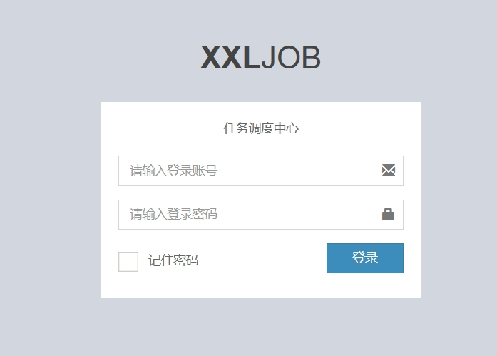
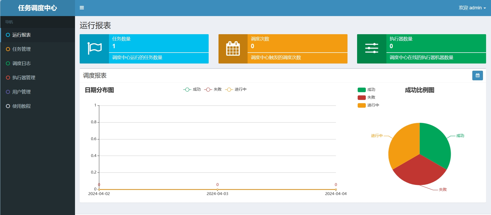


## 创建并部署XXL-job的执行器

xxl-job的执行器本质上就是一个java应用服务。通过在调度中心中配置执行器之后，调度中心就可以让执行器去执行定时任务。

xxl-job执行定时任务的调用顺序：调度中心 -》 执行器 -》 定时任务。

执行器的作用：接收“调度中心”的调度并执行定时任务。我们可直接部署官方提供的执行器项目，也可以将执行器集成到现有业务项目中。

> 步骤① 创建一个空的java项目，作为自己的执行器项目。项目中导入xxl-job的依赖。

```xml
<!-- xxl-job-core 依赖 -->
<dependency>
    <groupId>com.xuxueli</groupId>
    <artifactId>xxl-job-core</artifactId>
    <version>2.4.0</version>
</dependency>
```

> 步骤② 配置执行器项目的配置文件

xxl-job官方提供了一个执行器项目模板。在xxl-job源码`https://github.com/xuxueli/xxl-job/releases`中，找到`/xxl-job/xxl-job-executor-samples/xxl-job-executor-sample-springboot/src/main/resources/application.properties`文件。

```yml
### 调度中心部署根地址 [选填]：如调度中心集群部署存在多个地址则用逗号分隔。执行器将会使用该地址进行"执行器心跳注册"和"任务结果回调"；为空则关闭自动注册；
xxl.job.admin.addresses=http://127.0.0.1:8080/xxl-job-admin
### 执行器通讯TOKEN [选填]：非空时启用；
xxl.job.accessToken=
### 执行器应用名称AppName [选填]：执行器心跳注册分组依据；为空则关闭自动注册
xxl.job.executor.appname=xxl-job-executor-sample
### 执行器注册 [选填]：优先使用该配置作为注册地址，为空时使用内嵌服务"xxl.job.executor.port和xxl.job.executor.ip"作为注册地址。从而更灵活的支持容器类型执行器动态IP和动态映射端口问题。
xxl.job.executor.address=
### 执行器IP [选填]：默认为空表示自动获取IP，多网卡时可手动设置指定IP，该IP不会绑定Host仅作为通讯实用；地址信息用于 "执行器注册" 和 "调度中心请求并触发任务"；
xxl.job.executor.ip=
### 执行器端口号 [选填]：小于等于0则自动获取；默认端口为9999，单机部署多个执行器时，注意要配置不同执行器端口；
xxl.job.executor.port=9999
### 执行器运行日志文件存储磁盘路径 [选填] ：需要对该路径拥有读写权限；为空则使用默认路径；
xxl.job.executor.logpath=/data/applogs/xxl-job/jobhandler
### 执行器日志文件保存天数 [选填] ： 过期日志自动清理, 限制值大于等于3时生效; 否则, 如-1, 关闭自动清理功能；
xxl.job.executor.logretentiondays=30
```

这个文件是官方执行器项目模板的配置文件。我们可以根据这个配置文件来修改自己的执行器项目配置。

自己的执行器项目配置如下。
```yaml
server:
  ## 服务运行端口
  port: 38060
spring:
  application:
    name: shuyx-xxljob
xxl:
  job:
    admin:
      addresses: http://localhost:37100/xxl-job-admin  # 调度中心地址
    accessToken: default_token
    executor:
      address: 172.25.0.1:9999    # address就是ip和port的综合方式。可填可不填
      appname: shuyx-xxl-job
      port: 9999                  #指定一个端口，用来与调度中心进行通信
      ip: 172.25.0.1              #该ip是执行器的ip,该ip用来与调度中心进行通信
      # 日志保存地址
      logpath: /data/applogs/xxl-job/jobhandler
      # 日志保存时间
      logretentiondays: 30
```

<font color="red">

注意事项：
1. `xxl.job.executor.ip`配置是执行器所在的IP地址。调度中心需要通过它与执行器互相通信。因此如果调度中心是部署在docker容器中，而执行器是在宿主机中，那么此处填写的就是执行器所在的docker0网卡的ip地址，而不是localhost或127等IP，否则调度中心找不到执行器。
2. `xxl.job.executor.port`配置是执行器与调度中心进行互相通信的端口。与执行器项目的默认启动端口不同。该配置默认为9999。

</font>

> 步骤③ 配置执行器项目的配置类

```java
@Configuration
@Slf4j
public class XxlJobConfig {
    @Value("${xxl.job.admin.addresses}")
    private String adminAddresses;
    @Value("${xxl.job.executor.appname}")
    private String appName;
    @Value("${xxl.job.executor.ip}")
    private String ip;
    @Value("${xxl.job.executor.port}")
    private int port;
    @Value("${xxl.job.accessToken}")
    private String accessToken;
    @Value("${xxl.job.executor.logpath}")
    private String logPath;
    @Value("${xxl.job.executor.logretentiondays}")
    private int logRetentionDays;
    @Bean(initMethod = "start", destroyMethod = "destroy")
    public XxlJobSpringExecutor xxlJobExecutor() {
        log.info(">>>>>>>>>>> xxl-job config init.");
        XxlJobSpringExecutor xxlJobSpringExecutor = new XxlJobSpringExecutor();
        xxlJobSpringExecutor.setAdminAddresses(adminAddresses);
        xxlJobSpringExecutor.setAppname(appName);
        //xxlJobSpringExecutor.setIp(ip);  
        xxlJobSpringExecutor.setPort(port);
        xxlJobSpringExecutor.setAccessToken(accessToken);
        xxlJobSpringExecutor.setLogPath(logPath);
        xxlJobSpringExecutor.setLogRetentionDays(logRetentionDays);
        return xxlJobSpringExecutor;
    }
}
```

> 步骤④ 运行执行器项目。

若执行器项目运行成功，那么执行器项目便创建完成了。

### 启动XXL-job的执行器项目报错

报错问题：当运行执行器项目的时候，报如下错误的时候。
```
xxl-job registry fail ... [code=500, msg=The access token is wrong., content=null]
```

报错原因: 在使用springboot整合xxl-job中，执行器向调度中心注册的时候提示注册失败，原因是因为token出错。

解决办法：
1. 如果使用的xxl-job是2.4.0版本以上的。需要在执行器项目的配置文件中配置`xxl.job.accessToken: default_token`。
2. 另外还需要再xxl-job的配置类中通过@Value将`xxl.job.accessToken`的值获取到并注入到xxlJobSpringExecutor中。

之所以要添加`xxl.job.accessToken`这个配置参数。是因为最新的2.4.0版本的xxl-job中该配置参数变成了默认选项。执行器必须加上`xxl.job.accessToken`配置参数。

## xxl-job的运行模式

### Bean模式

Bean模式是指基于Java方法的开发方式，每个定时任务对应执行器中的一个Java方法。

> 优点：
每个任务代表一个方法，并添加”@XxlJob”注解即可，更加方便、快速。支持自动扫描任务并注入到执行器容器。
> 缺点：要求Spring容器环境；

Bean模式实现方式

> 步骤① 在执行器项目中创建任务

任务本质上就是一段代码。我们需要在执行器项目中创建一个定时任务。

1. 先在执行器项目中创建一个任务类。在任务类中编写具体方法。
2. 在方法上添加@XxlJob注解，注解值为自定义任务的名称。

```java
@Slf4j
public class XxlJobController {
    @XxlJob("testTask1")
    public void testTask1(){
        String param = XxlJobHelper.getJobParam();
        //XxlJobHelper.log会把信息呈现在调度中心中。
        XxlJobHelper.log("测试开始");
        //打印任务参数
        log.info("任务开始执行");
        log.info("任务参数为:",param);
        log.info("任务执行完成");
        XxlJobHelper.log("测试结束");
    }
}
```

> 步骤② 创建执行器

在调度中心，创建执行器。该执行器指向对应的执行器java项目。

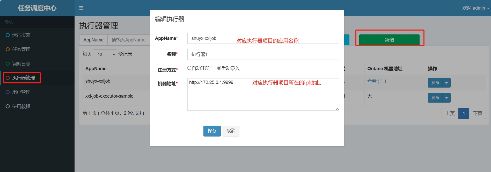

> 步骤③ 在调度中心中创建任务。指向执行器项目中的任务。

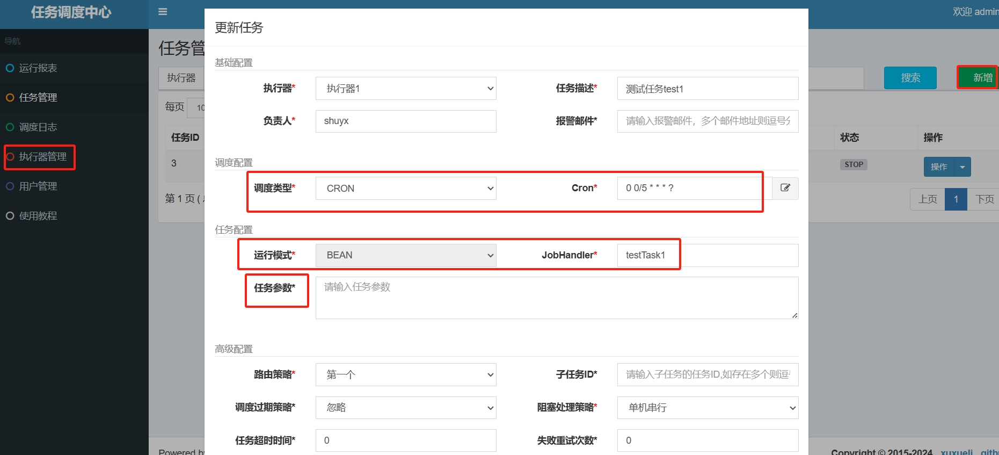

1. JobHandler属性填写任务注解“@XxlJob”中定义的值
2. 调度类型可以选择定时或者不定时。
3. 任务参数会传递给`XxlJobHelper.getJobParam();`

> 步骤④ 执行任务

在调度中心中执行一次任务。
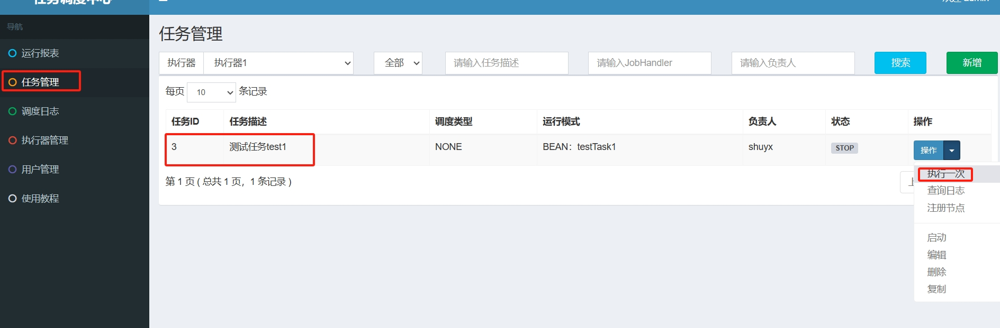
输入任务参数和机器地址（选填），点击保存
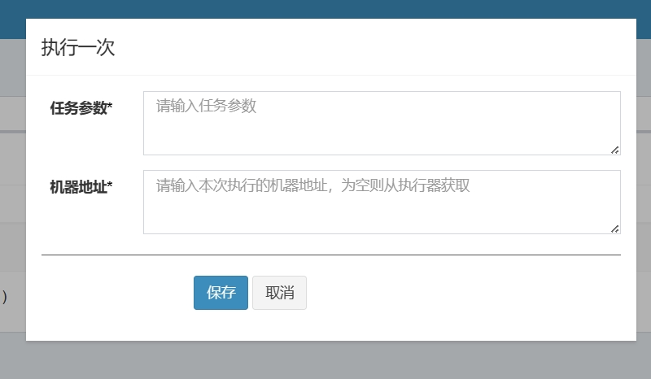
当任务执行完成后，可以查看调度中心的日志信息
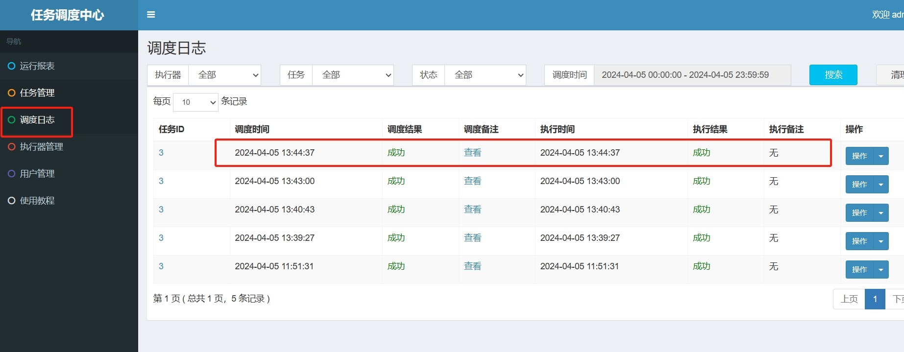
执行器项目中的运行截图如下
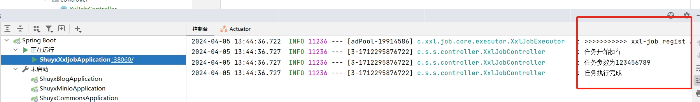


### GLUE模式(Java)

GLUE模式(Java)中的任务代码，直接在调度中心在线维护任务代码。调度中心支持Web IDE在线更新带啊吗，实时编译和生效，因此不需要指定JobHandler。

> 步骤1 在调度中心，新建调度任务

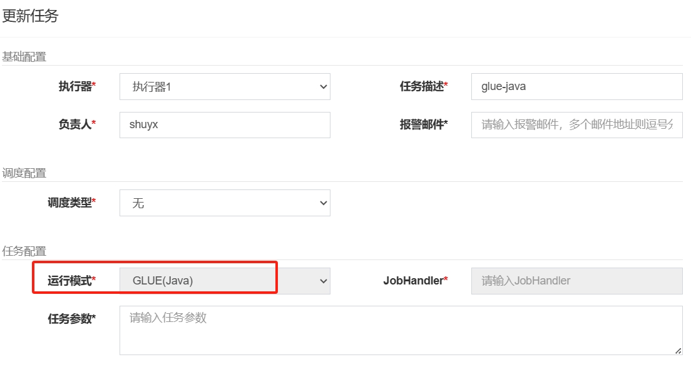

> 步骤2 维护调度任务代码

选中指定任务，点击该任务右侧“GLUE IDE”按钮，将会前往Web IDE界面，在该界面支持对任务代码进行开发（也可以在IDE中开发完成后，复制粘贴到编辑中）。

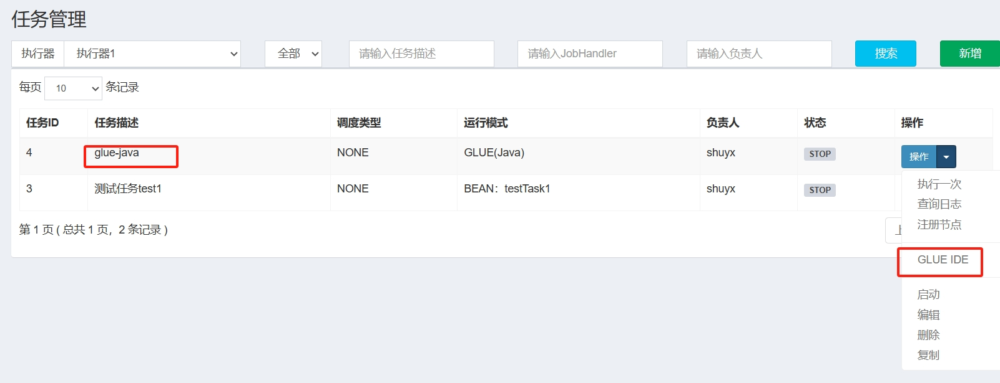
Web IDE界面如图所示
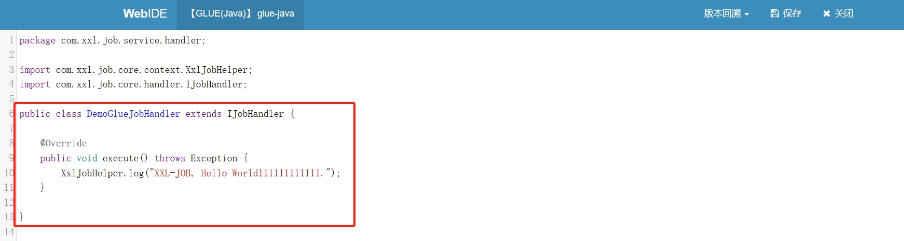

> 步骤3 执行任务

后面自行执行任务，然后查询日志信息即可。

### GLUE模式(Shell)

同理，GLUE模式(Shell)是指可以在调度中心在线维护任务。该任务就是一段shell脚本。

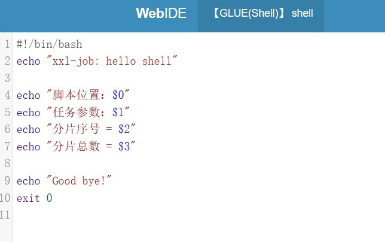

### GLUE模式(Python)

该模式的任务实际上是一段 “python” 脚本。

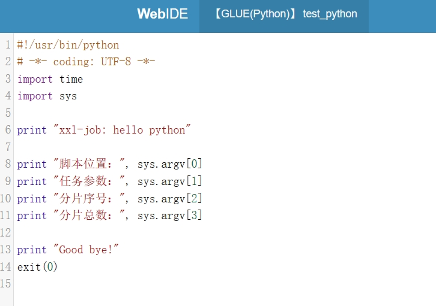

### GLUE模式(NodeJS)

该模式的任务实际上是一段 “nodeJS” 脚本；

### GLUE模式(PHP)

同上

### GLUE模式(PowerShell)

同上