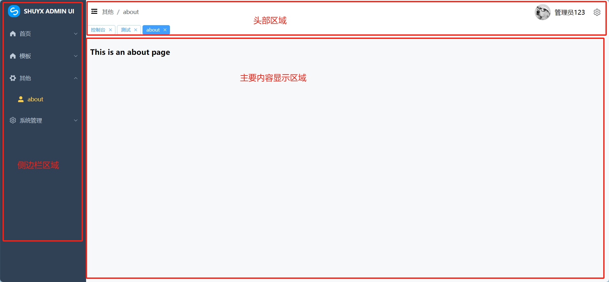
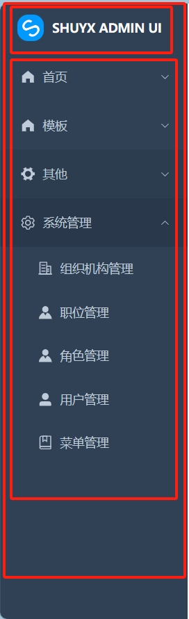
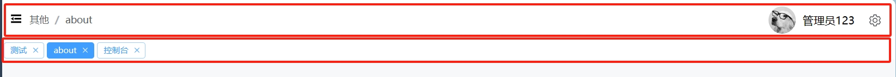

[toc]

# shuyx-admin-ui笔记

## 介绍

shuyx-admin-ui是一个中后台前端解决方案，基于VUE3和elementPlus实现。 

shuyx-admin-ui使用最新的前端技术栈，采用的技术栈为 Vue3 + Vite4 + Element Plus + Pinia + Vue Router4 等当前主流前端框架。

shuyx-admin-ui可以帮助我们快速搭建企业级中后台前端页面。

## 全局样式

为了保证后续样式的统一，因此需要先设置好全局样式。

当新建好前端工程后，在index.html页面中添加如下全局样式。

```html
<!DOCTYPE html>
<html lang="en">
  <!-- .....省略部分 -->
  <body>
    <div id="app"></div>
    <script type="module" src="/src/main.js"></script>
  </body>
</html>
<style>
/* 添加全局样式 */
#app, body, html {
  margin: 0;
  padding: 0;
  width: 100%;
  height: 100%;
}
</style>
```

index.html页面中的`<div id="app"></div>`元素是根元素。提前设置全局样式，主要是方便后续开发。

## 布局

### 整体布局



整体布局由侧边栏区域+头部区域+主要内容区域组成。

代码部分如下

LayoutView.vue
```html
<script setup>
// 组件注册
import Header from './Header/HeaderView.vue'
import Aside from './Aside/AsideView.vue'
import TagsView from "./Header/TagsView.vue"
</script>

<template>
  <!--最外层容器高宽都为100%-->
  <el-container style="width: 100%;height: 100%;">
    <!--左边区域高100%,宽auto自适应,宽度会随着侧边栏的折叠而变化-->
    <el-aside style="padding: 0px;width: auto;height: 100%;">
      <!--侧边栏组件-->
      <Aside></Aside>
    </el-aside>
    <!--右边区域高100%,宽auto自适应-->
    <el-container style="height: 100%;width: auto;">
      <!--头部区域高auto自适应，宽100%-->
      <el-header style="padding: 0px;width: 100%;height:auto;">
        <!--头部导航栏组件-->
        <Header></Header>
        <!--tagview组件-->
        <TagsView></TagsView>
      </el-header>
      <!--主区域高90%，宽100%，背景色灰白-->
      <el-main style="padding: 10px;width: 100%;height: auto;background-color: #f6f8f9;">
        <!--通过router-view标签来显示嵌套路由的内容-->
        <router-view />
      </el-main>
    </el-container>
  </el-container>
</template>

<style scoped>
</style>

```

代码解析：
1. 布局页面最外层el-container容器标签，设置宽高都是100%。
2. 左边区域设置高100%，宽auto自适应。之所以宽度设置为auto,是因为侧边栏会折叠，宽度会变化。
3. 右边区域设置高度100%，宽度auto，由于左边区域的宽度会随时变化，因此右边区域的宽度也要随之变化。 
    1. 右边头部导航栏区域设置宽度100%，高度auto。
    2. 右边主区域设置宽度100%，高度auto，背景色设置为灰白色#f6f8f9。灰白色与普通的白色不同。

### 侧边栏

侧边栏由：侧边栏整体 + logo标题 + 菜单 三部分组成。



侧边栏整体页面相关代码

AsideView.vue
```html
<template>
  <el-scrollbar style="background-color: #304156;height:100%">
    <!-- 侧边栏 -->
    <el-menu
      style="border: none;"
      :collapse="isCollapse"
      mode="vertical"
      :router="true"
      background-color="#304156"
      active-text-color="#ffd04b"
      text-color="#bfcbd9"
    >
      <!--LogoTitle-->
      <LogoTitle />
      <!--菜单-->
      <SidebarItem v-for="route in sideMenuList" :key="route.path" :item="route" />
    </el-menu>
  </el-scrollbar>
</template>
<script setup>
import LogoTitle from './LogoTitle.vue'
import SidebarItem from './SidebarItem.vue'
import { computed } from 'vue'
//导入headerStore，从headerStore中获取侧边栏伸展变量
import { useHeaderStore } from '@/stores/headerStore'
// isCollapse需要设置为计算属性，计算属性才会实时更新
const isCollapse = computed(() => {
  return useHeaderStore().sideIsExpand
})
//导入MenuStore，获取侧边栏菜单信息
import { useMenuStore } from '@/stores/menuStore'
let sideMenuList = useMenuStore().sideBarMenuInfo
</script>
<style scoped>
</style>
```

headerStore.js
```js
import { ref } from 'vue'
import { defineStore } from 'pinia'
//导航栏信息store
export const useHeaderStore = defineStore('headerStore', () => {
  //侧边栏是否伸展变量
  const sideIsExpand = ref(false)
  //控制侧边栏伸展变量
  function changeSideExpand(){
    sideIsExpand.value = !sideIsExpand.value
  }
  return {sideIsExpand,changeSideExpand}
})
```


logo标题组件相关代码

LogoTitle.vue
```html
<template>
  <el-menu-item >
      
      <span style="font-weight:bold;font-size: 14px;color:#fff;padding: 10px;">SHUYX ADMIN UI</span>
  </el-menu-item>
</template>
<script setup>
import logoImg from '@/assets/logo.png'
</script>

<style scoped>
</style>
```

菜单项组件相关代码 

- 接收全局路由（静态路由+动态路由）信息。然后通过嵌套调用自身的方式渲染出所有的菜单。
- 并且当用户点击菜单的时候，将具体的路由信息添加到tagview数组中。

SidebarItem.vue
```html
<template>
  <!--路由是否显示。此处最外层标签不要用div，用div会导致文字无法完全隐藏-->
  <template v-if="!route.hidden">
    <!--若有子路由-->
    <template v-if="hasOneShowingChild(route)">
      <el-sub-menu :index="route.path" teleported>
        <template #title>
          <el-icon ><component :is="route.icon"></component></el-icon>
          <span>{{ route.name }}</span>
        </template>
        <!--嵌套使用 SidebarItem组件-->
        <sidebar-item
          v-for="child in route.children"
          :key="child.path"
          :item="child"
        />
      </el-sub-menu>
    </template>
    <!--若无子路由-->
    <template v-else>
      <el-menu-item :index="route.path" @click="clickMenuItem(route)">
        <template #title>
          <el-icon ><component :is="route.icon"></component></el-icon>
          <span>{{ route.name }}</span>
        </template>
      </el-menu-item>
    </template>
  </template>
</template>

<script setup>
import {ref} from "vue"
import SidebarItem from './SidebarItem.vue'
//导入tagViewStore，获取tagview菜单信息
import { useTagViewStore } from '@/stores/tagViewStore'
const props = defineProps({
  item: Object
})
const route = ref(props.item)

//判断当前路由是否有子路由
//有子路由返回true,无子路由返回false
function hasOneShowingChild(route) {
  if(route.children == undefined){
    return false
  }else{
    if(route.children.length == 0){
      return false
    }
    return true
  }
}
//点击菜单，将菜单信息添加到tagview中
function clickMenuItem(obj) {
  useTagViewStore().addTagViewMenuInfo(obj)
}
</script>
```

### 头部区域

头部区域由 头部导航栏 + tagView 两部分组成。



#### 头部导航栏 

头部导航栏主要包括：折叠图标 + 面包屑导航 + 用户信息等

- 折叠图标：当点击折叠图标的时候，侧边栏会进行伸展和折叠。
- 面包屑导航：通过监控当前路由，并且当前路径的具体信息。通过面包屑组件展示。
- 用户信息：展示登录用户的相关信息。

> 相关代码

HeaderView.vue

```html
<template>
    <!--最外层容器 flex布局，space-between水平排列-->
    <div style="display:flex;justify-content:space-between;align-items:center;padding: 10px;">
        <!--左边区域 flex布局，flex-start水平排列，center垂直居中-->
        <div style="display: flex;justify-content:flex-start;align-items:center;">
            <div>
                <el-icon @click="changeExpand()" :size="20" v-if="sideIsExpand"><Expand/></el-icon>
                <el-icon @click="changeExpand()" :size="20" v-else><Fold/></el-icon>
            </div>
            <el-breadcrumb separator="/" style="padding: 10px;">
                <el-breadcrumb-item v-for="(item, index) in breadCrumbList" :key="item.path">
                    <span v-if="index == breadCrumbList.length - 1">{{ item.name }}</span>
                    <span v-else>{{ item.name }}</span>
                    <!-- <router-link v-else :to="item.path">22{{ item.name }}</router-link> -->
                </el-breadcrumb-item>

            </el-breadcrumb>
        </div>
        <!--右边区域 flex布局，flex-end水平排列，垂直居中-->
        <div style="display:flex;justify-content:flex-end;align-items:center;">
            <el-avatar :src="avatarImg"/>
            <span style="padding: 10px;">管理员123</span>
            <el-dropdown trigger="click" style="padding: 10px;">
                <el-icon :size="20"><Setting/></el-icon>
                <template #dropdown>
                    <el-dropdown-menu>
                        <el-dropdown-item>退出登录</el-dropdown-item>
                    </el-dropdown-menu>
                </template>
            </el-dropdown>
        </div>
    </div>
</template>
<script setup>
import { ref,watch } from 'vue';
import avatarImg from '@/assets/avatar.jpg'
import { useRoute } from "vue-router"
const route = useRoute()
import { useHeaderStore } from '@/stores/headerStore'
const headerStore = useHeaderStore()
//侧边栏扩展
const sideIsExpand = ref(false)
const changeExpand = () => {
    sideIsExpand.value = !sideIsExpand.value
    //控制侧边栏伸展变量
    headerStore.changeSideExpand()
}

//监控当前路由，组成面包屑导航列表
let breadCrumbList = ref([])
watch(() => route.matched, (to) => {
    breadCrumbList.value = to
},{immediate:true,deep:true})

</script>
<style scoped>
</style>

```

#### tagview区域 TagsView.vue

> 什么是tagview?

tagview其实就是快捷标签，当用户每点击一次侧边栏的菜单的时候，在tagview区域就出现一个代表该菜单的快捷标签。用户可以点击不同的快捷标签，从而可以方便的切换菜单。

> tagview实现逻辑

1. 定义一个tagViewList数组。这个数组存储路由信息，并且数组中的路由不能重复。
2. 当点击侧边栏的菜单的时候，将菜单对应的路由信息添加到tagViewList数组中。
4. 如果当前页面的路由路径 等于 数组中的某个路由路径。那么对于的快捷标签颜色变蓝。其他快捷标签颜色变白。
5. 当要关闭快捷标签的时候，相当于把数组中的对应路由信息从数组中删除。如果关闭的是当前路径的快捷标签，那么默认路由到数组中最后一个路径。即最后一个快捷标签颜色变蓝。

> tagview相关代码

TagsView.vue
```html
<template>
  <el-scrollbar style="height: auto">
    <div class="scrollbar-flex-content">
      <el-tag
        v-for="(item,index) in tagViewList"
        :key="item.path"
        style="margin: 2px"
        @close="handleClose(index,item)"
        @click="handClick(item)"
        :effect="currentPath === item.path ? 'dark': 'plain'"
        closable
      >
        {{ item.name }}
      </el-tag>
    </div>
  </el-scrollbar>
</template>

<script setup>
import { computed,ref,watch } from 'vue'
import { useRouter } from "vue-router"
const router = useRouter()
import { useTagViewStore } from '@/stores/tagViewStore'
const tagViewList = computed(() => {
  return useTagViewStore().tagViewMenuInfo
})

//监控当前路由path,获取currentPath
let currentPath = ref(null)
watch(() => router.currentRoute.value.fullPath, (to) => {
  currentPath.value = to
},{immediate:true,deep:true})

//关闭tag
function handleClose(index,item) {
  //判断删除的tag是不是当前path的tag
  if(item.path == currentPath.value){
    //如果是，则跳转到最后一个tag路由上
    let length = tagViewList.value.length
    router.push(tagViewList.value[length-1].path)
  }
  //删除tag
  useTagViewStore().deleteTagViewMenuInfo(index)
}

//点击tag，跳转到这个tag路由上
function handClick(item){
  router.push(item.path)
}
</script>

<style scoped>
.scrollbar-flex-content {
  display: flex;
}
</style>
```

tagViewStore.js
```js
import { ref} from 'vue'
import { defineStore } from 'pinia'
//tagViewStore
export const useTagViewStore = defineStore('tagViewStore', () => {
   //tagview菜单信息,主要用于存储tagview中展示的菜单
   const tagViewMenuInfo = ref([])
  //添加tagview菜单信息
  function addTagViewMenuInfo(obj){
    let item = {
      path:obj.path,
      name:obj.name
    }
    //判断新加入tag是否已经存在tag数组中，若不存在则加入数组
    if (!tagViewMenuInfo.value.some(obj => obj.path === item.path && obj.name === item.name)) {
      tagViewMenuInfo.value.push(item)
    }

  }
  //删除tagview菜单信息
  function deleteTagViewMenuInfo(index){
    return tagViewMenuInfo.value.splice(index, 1)
  }
  return {tagViewMenuInfo,addTagViewMenuInfo,deleteTagViewMenuInfo}
},{persist: true})

```


## 数据状态

主要是通过pinia来对前端工程中的数据进行保存和持久化。

例如针对用户数据进行保存

/store/userStore.js
```js
import { ref } from 'vue'
import { defineStore } from 'pinia'

//用户信息store
export const useUserStore = defineStore('userStore', () => {
  //用户基础信息
  const userInfo = ref({})
  //设置用户信息
  function setUserInfo(obj){
    userInfo.value = obj
  }
  //获取用户信息
  function getUserInfo(){
    return userInfo.value
  }
  return {userInfo,setUserInfo,getUserInfo}
},{persist: true})
```

## 路由

路由主要分为常规路由+动态路由两部分组成。
- 常规路由就是静态路由，任何用户都能够访问静态路由中对应的页面。
- 动态路由就是根据用户权限来动态生成的。例如，用户登录成功后，后端返回了该用户可以访问的菜单信息数据。前端将该菜单信息转换为动态路由，并添加到整个全局路由当中。

路由相关代码分为三部分：全局路由 + 动态路由 + 动态路由转换。

### 全局路由

全局路由部分的代码主要是把动态路由和静态路由组合在一起，形成一个全局路由。

每当页面刷新，路由都会重新初始化，前置守卫beforeEach会被执行一次。因此在前置守卫beforeEach中获取持久化的动态路由数据，并把动态路由加载到全局路由当中。

/router/index.js
```js
import { createRouter, createWebHistory } from 'vue-router'
import { useMenuStore } from '@/stores/menuStore'

// 布局页面（包含侧边栏，头部导航栏）。 除了注册登录等少数页面，其他页面都会嵌套在布局页面的main区域中展示。
import LayoutView from '@/views/layout/LayoutView.vue'
//常规路由,任何用户都可访问的路由
export const constantRoutes = [
  {
    path: '/',
    name: "/",
    redirect: '/login', //根路由默认重定向到/login路由
    hidden: true
  },
  {
    path: '/login',
    name: "登录",
    component: () => import('@/views/login/LoginView.vue'),
    hidden: true
  },
  {
    path: '/register',
    name: "注册",
    component: () => import('@/views/register/RegisterView.vue'),
    hidden: true
  },
  {
    path: '/home',
    name: "首页",
    icon:"HomeFilled",
    component: LayoutView,
    hidden: false,
    children: [
      {
        path: '/home/index',
        name: '控制台',
        icon:"UserFilled",
        component: () => import('@/views/home/HomeView.vue')
      }
    ]
  },
  {
    path: '/demo',
    name: "模板",
    icon:"HomeFilled",
    component: LayoutView,
    hidden: false,
    children: [
      {
        path: '/demo/test',
        name: '测试',
        icon:"UserFilled",
        component: () => import('@/views/demo/DemoView.vue')
      }
    ]
  },
  {
    path: '/other',
    name: "其他",
    icon:"Tools",
    component: LayoutView,
    hidden: false,
    children: [
      {
        path: '/other/about',
        name: 'about',
        icon:"UserFilled",
        component: () => import('@/views/other/AboutView.vue')
      }
    ]
  }
]

const router = createRouter({
  history: createWebHistory(),
  routes: constantRoutes
})

//是否已加载过动态路由
let isAddDynamicRouter = false
//router路由前置守卫
router.beforeEach(async (to,from,next) => {
  //判断是否添加了动态路由
  if(!isAddDynamicRouter){
    //获取menuStore中存储的动态路由信息
    let dynamicRoute = useMenuStore().dynamicRouteInfo
    if (dynamicRoute.length !== 0) {
        await dynamicRoute.forEach(obj =>{
            router.addRoute(obj)
        })
        //手动添加，若路由路径无法匹配，就会自动匹配到404页面
        router.addRoute({
            path: '/:catchAll(.*)',
            name: '404',
            component: () => import('@/views/other/404View.vue')
        })   
    }
    isAddDynamicRouter = true
    //中断此次的路由，重新进行下一次路由。即重新执行beforeEach
    next({ ...to, replace: true })
  }else{
    //放行当前路由
    next()
  }
})
export default router
```

###  动态路由

动态路由部分主要是用pinia保存并持久化后台传过来的用户可访问的菜单信息。然后再把用户菜单信息转换为动态路由数据并添加到全局路由当中。

<font color="red">之所以要保存并持久化动态路由数据。主要是因为当页面刷新的时候，路由会被重新初始化。此时的路由只有静态路由，没有动态路由。因此需要后续需要再次把动态路由加载到全局路由当中。</font>

另外之所以持久化用户菜单信息，而不是直接保存转换后的动态路由数据。是因为pinia只能持久化字符串数据，而动态路由数据中的`component`属性的非字符串数据无法被持久化。所以才选择持久化用户菜单信息，后续再转换为动态路由数据。

/store/menuStore.js
```js
import { ref,computed } from 'vue'
import { defineStore } from 'pinia'
import buildRouter from "@/utils/menuRouter"
import {constantRoutes} from "@/router"

//菜单信息store
export const useMenuStore = defineStore('menuStore', () => {
  //菜单信息
  const menuInfo = ref([])
  //设置菜单信息
  function setMenuInfo(obj){
    menuInfo.value = obj
  }
  //设置菜单信息
  function getMenuInfo(){
    return menuInfo.value
  }
  //动态路由信息
  const dynamicRouteInfo = computed(() => {
    //buildRouter方法,将后台传过来的用户菜单信息转换为vue-router可用的动态路由数组
    let dynamicRoute = []
    dynamicRoute = buildRouter(menuInfo.value)
    return dynamicRoute
  })
  //侧边栏菜单信息,侧边栏菜单就是常规路由+动态路由
  const sideBarMenuInfo = computed(()=>{
    let sideBarMenu = []
    sideBarMenu = constantRoutes.concat(dynamicRouteInfo.value)
    return sideBarMenu
  })
  return {menuInfo,dynamicRouteInfo,sideBarMenuInfo,setMenuInfo,getMenuInfo}
},{persist: true})

```

###  动态路由转换

动态路由转换部分，主要是把后台传过来的用户可访问菜单数组，转换为可以被vue-router使用的动态路由信息。

/utils/menuRouter.js
```js
/**
 * menuRouter.js文件主要用于将后台传过来的用户菜单信息，转换为可以被vue-router使用的动态路由信息。
 */

//导入Layout视图组件
const LayoutView = () => import("@/views/layout/LayoutView.vue");

//全局获取views目录中所有的.vue文件信息
const modules = import.meta.glob('@/views/**/*.vue')

// loadView方法：用于把数据库中存储的菜单页面信息转换为实际的.vue文件信息
// 例如 数据库中某个菜单A的页面信息为 /src/views/system/user/UserView.vue 。
// 步骤如下：
// 0. 菜单A的页面信息作为参数传入到loadView方法中。
// 1. 然后开始遍历 modules对象（即遍历views目录中所有的.vue文件信息对象）
// 2. 在遍历过程中，会把/src/views/system/user/UserView.vue 与 所有的.vue文件进行匹配。
// 3. 如果匹配上了，说明找到了菜单A的对应.vue文件。并将菜单A对应的.vue文件信息返回。
// 注意：这里需要提前规定。在数据库中的菜单页面信息必须是该页面在前端工程中的具体路径。例如/src/views/system/user/UserView.vue
const loadView = (view) => {
  let res = undefined;
  for (let path in modules) {
    if (path === view) {
      res = modules[path];
    }
  }
  return res;
}

// 构建动态路由数组。用于把后台传过来的用户菜单信息，转换为可以被vue-router使用的路由信息。
function buildRouter(userMenuInfo){
    //路由数组
    let router = []
    //遍历后台传过来的用户菜单信息
    userMenuInfo.forEach(menuObj => {
      //新建一个router元素
      let routerObj = {
        name: undefined,
        path: undefined,
        component: undefined,
        icon: undefined,
        children:[]
      }
      routerObj.name = menuObj.menuName
      routerObj.path = menuObj.menuPath
      routerObj.icon = menuObj.icon
      //如果菜单类型为0（目录），则该router元素中的component为LayoutView
      //如果菜单类型不为0（非目录），则该router元素中的component为菜单页面匹配的.vue文件信息
      if(menuObj.menuType == 0){
        routerObj.component = LayoutView
      }else{
        routerObj.component = loadView(menuObj.menuPage)
      }
      //如果菜单有子菜单，递归访问buildRouter方法，传入子菜单对象
      if(menuObj.children && menuObj.children.length){
        routerObj.children = buildRouter(menuObj.children)
      }
      //如果菜单没有子菜单,就把路由元素添加到路由数组中
      router.push(routerObj)
    })
    //最后返回路由数组，这个路由数组就是可以被vue-router使用的路由信息
    return router
}

//导出
export default buildRouter
```

转换前的用户可访问菜单信息如下
```js
{
    "menuId": 2,
    "menuName": "系统管理",
    "parentId": 0,
    "menuPath": "/system",
    "menuPage": null,
    "menuType": 0,
    "icon": "Setting",
    "children": [
        {
            "menuId": 8,
            "menuName": "组织机构管理",
            "parentId": 2,
            "menuPath": "/system/org",
            "menuPage": "/src/views/system/org/OrgView.vue",
            "menuType": 1,
            "icon": "OfficeBuilding",
            "children": []
        },
        {
            "menuId": 9,
            "menuName": "职位管理",
            "parentId": 2,
            "menuPath": "/system/position",
            "menuPage": "/src/views/system/position/PositionView.vue",
            "menuType": 1,
            "icon": "Avatar",
            "children": []
        },
        {
            "menuId": 10,
            "menuName": "角色管理",
            "parentId": 2,
            "menuPath": "/system/role",
            "menuPage": "/src/views/system/role/RoleView.vue",
            "menuType": 1,
            "icon": "Avatar",
            "children": []
        },
        {
            "menuId": 3,
            "menuName": "用户管理",
            "parentId": 2,
            "menuPath": "/system/user",
            "menuPage": "/src/views/system/user/UserView.vue",
            "menuType": 1,
            "icon": "UserFilled",
            "children": []
        },
        {
            "menuId": 4,
            "menuName": "菜单管理",
            "parentId": 2,
            "menuPath": "/system/menu",
            "menuPage": "/src/views/system/menu/MenuView.vue",
            "menuType": 1,
            "icon": "Collection",
            "children": []
        }
    ]
}
```

转换后的动态路由信息如下
```js
[
    {
        "name": "系统管理",
        "path": "/system",
        "icon": "Setting",
        "component": () => import('@/views/layout/LayoutView.vue'),
        "children": [
            {
                "name": "组织机构管理",
                "path": "/system/org",
                "icon": "OfficeBuilding",
                "component": () => import("/src/views/system/org/OrgView.vue"),
                "children": []
            },
            {
                "name": "职位管理",
                "path": "/system/position",
                "icon": "Avatar",
                "component": () => import("/src/views/system/position/PositionView.vue"),
                "children": []
            },
            {
                "name": "角色管理",
                "path": "/system/role",
                "icon": "Avatar",
                "component": () => import("/src/views/system/role/RoleView.vue"),
                "children": []
            },
            {
                "name": "用户管理",
                "path": "/system/user",
                "icon": "UserFilled",
                "component": () => import("/src/views/system/user/UserView.vue"),
                "children": []
            },
            {
                "name": "菜单管理",
                "path": "/system/menu",
                "icon": "Collection",
                "component": () => import("/src/views/system/menu/MenuView.vue"),
                "children": []
            }
        ]
    }
]
```

## HTTP请求

前端主要是通过axios来发起HTTP请求调用后台接口，并获取后台的数据。

axios相关的代码主要分为 axios封装 + 具体的业务请求接口 + 页面使用

### axios封装

axios封装部分主要是设置axios的全局设置。例如request 拦截器和response 拦截器等。

/api/request.js

```js
/**
 * request.js 是对 axios 进行封装。
 * */ 
import axios from 'axios';		//引入axios
import { ElNotification, ElMessageBox,ElMessage} from 'element-plus'; //引入element-plus的消息通知

//接口根路径
let baseurl = null
//获取环境配置文件中的接口根路径
baseurl = import.meta.env.VITE_APP_API_BASEURL

// 创建axios实例
const axiosService = axios.create({
    baseURL: baseurl,
    // 超时时间
    timeout: 10000
})

// axios request 拦截器
axiosService.interceptors.request.use(
	//请求成功的时候
	(config) => {
		//将cookie中的TOKEN内容加入到请求头Authorization中
		let token = document.cookie.match(new RegExp("(^| )TOKEN=([^;]*)(;|$)"))
		if(token){
			config.headers['Authorization'] = "Bearer " + token
		}
		Object.assign(config.headers)
		return config;
	},
	//请求失败的时候
	(error) => {
		return Promise.reject(error);
	}
);

// axios response 拦截器
axiosService.interceptors.response.use(
	//当响应成功的时候。返回响应内容中的data数据
	(response) => {
		//如果响应成功，但是业务办理失败
		if(response.data.code != 200){
			ElMessage.error('Code: ' + response.data.code + ',Message: ' + response.data.message)
		}
		//响应成功且业务办理成功。
		return response.data;
	},
	//当响应失败的时候，根据不同的失败状态，进行不同的动作
	(error) => {
		if (error.response) {
			if (error.response.status == 404) {
				ElNotification.error({
					title: '请求错误',
					message: "Status:404，正在请求不存在的服务器记录！"
				});
			} else if (error.response.status == 500) {
				ElNotification.error({
					title: '请求错误',
					message: error.response.data.message || "Status:500，服务器发生错误！"
				});
			} else if (error.response.status == 401) {
				ElMessageBox.confirm('当前用户已被登出或无权限访问当前资源，请尝试重新登录后再操作。', '无权限访问', {
					type: 'error',
					closeOnClickModal: false,
					center: true,
					confirmButtonText: '重新登录'
				});
			} else if (error.response.status == 503) {
				ElNotification.error({
					title: '服务不可用。',
					message: error.response.data.message || "Status:503，服务不可用。！"
				});
			} else {
				ElNotification.error({
					title: '请求错误',
					message: error.message || `Response Status:${error.response.status}，未知错误！`
				});
			}
		} else {
			ElNotification.error({
				title: '请求错误',
				message: "请求服务器无响应！"
			});
		}
		return Promise.reject(error.response);
	}
);

export default axiosService;
```

### 具体的业务请求接口

下面以用户相关接口举例。

/api/user.service.js

```js
import axiosService from '@/api/request';		//引入 request.js 中的axiosService

// 针对特定资源，创建资源访问对象
const APIResources = {
    //分页查询用户
    pagelist(queryData,pageData) {
        return axiosService.request({
            url: '/shuyx-user/user/pagelist',
            method: 'POST',
            data: Object.assign({},queryData,pageData), //assign方法可以把两个对象合并
            headers: { 'Content-Type': 'application/json' }
        })
    },
    //添加用户
    addUser(queryData) {
        return axiosService.request({
            url: '/shuyx-user/user/addUser',
            method: 'POST',
            data: queryData,
            headers: { 'Content-Type': 'application/json' }
        })
    },
    //查询用户
    selectById(queryData) {
        return axiosService.request({
            url: '/shuyx-user/user/selectById',
            method: 'GET',
            params: queryData,
            headers: { 'Content-Type': 'multipart/form-data' }
        })
    },
    //更新用户
    updateUser(queryData) {
        return axiosService.request({
            url: '/shuyx-user/user/updateUser',
            method: 'POST',
            data: queryData,
            headers: { 'Content-Type': 'application/json' }
        })
    },
    //删除用户
    deleteUser(queryData) {
        return axiosService.request({
            url: '/shuyx-user/user/deleteUser',
            method: 'DELETE',
            params: queryData,
            headers: { 'Content-Type': 'multipart/form-data' }
        })
    }
  }
  
export default APIResources
```

### 页面使用

下面以用户页面举例。

/view/user/UserView.vue
```html
<script setup>
import APIResources from '@/api/user.service.js'
//表单对象
const queryform = ref({
  userName: undefined,
  status: undefined,
  phone: undefined
})
//分页配置对象
const pageData = ref({
  pageNum: 1,
  pageSize: 10,
  pageSizes: [10, 50, 100],
  total: 0
})

//搜索按钮操作
function search() {
  //调用分页查询接口
  APIResources.pagelist(queryform.value, pageData.value).then((res) => {
    //打印接口返回数据
    console.log("res",res)
  })
}

//编辑操作
function toEdit(userId) {
    //调用接口
    APIResources.selectById({ userId }).then((res) => {
        console.log("res",res)
    })
}
//删除操作
function deleteUser(userId) {
    //调用接口
    APIResources.deleteUser({ userId }).then(() => {
       console.log("res",res)
    })
}
</script>
```


