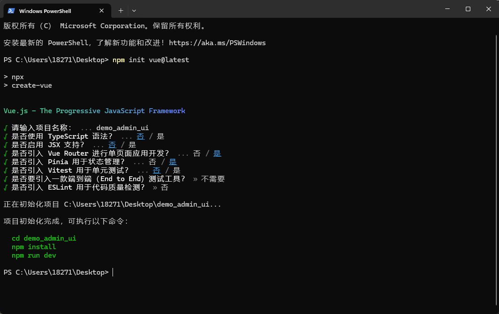
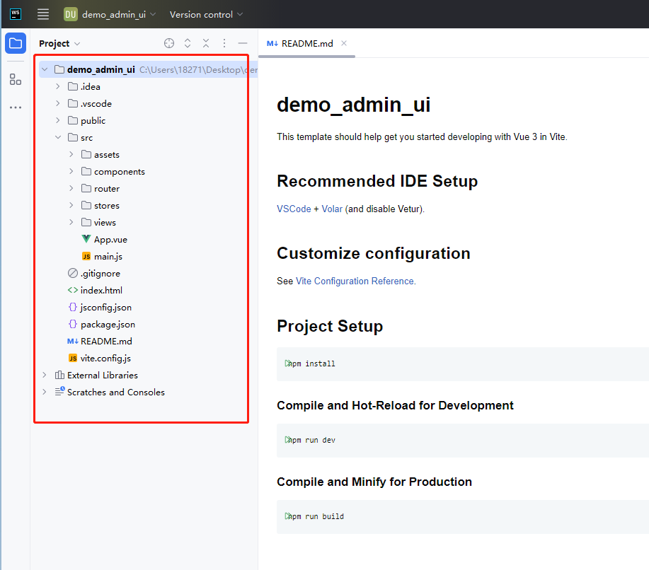
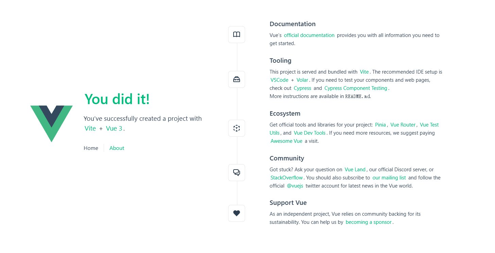
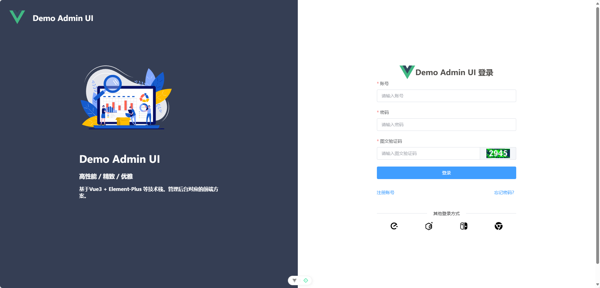
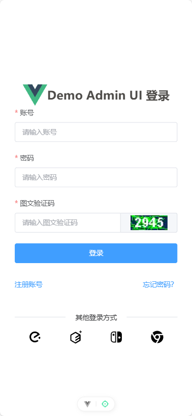

[toc]

# 管理后台的前端解决方案

## 介绍

写一个管理后台的前端解决方案，类似市面上的开源的管理后台的前端框架。

使用最新的前端技术栈，采用的技术栈为 Vue3 + Vite + Element Plus + Pinia + Vue Router4 等当前主流前端框架。并且保证页面的UI风格不过时。

主要目的是快速给其他的后台项目搭建一个对应的管理后台页面。

## 创建项目

由于采用Vue3 + Vite 等技术栈。因此可以使用下面的命令来快速创建一个vue3项目。

```js
//如果已安装create-vue脚手架工具，则直接创建一个vue3的模板工程
npm init vue@latest
```

在创建过程中，有一些选项可以选择。如图所示。


创建好后的vue3的模板工程如图所示。


安装依赖包，运行的效果如图所示。


## 初始化项目

先删除模板工程中不必要的代码和文件，将其变成一个空模板工程。例如不需要的样式文件，组件文件，页面文件等。

### 项目全局设置

为了保证后续样式的统一，因此需要先设置好项目的全局样式。当新建好前端工程后，在index.html页面中添加如下全局样式。

```html
<!DOCTYPE html>
<html lang="en">
  <!-- .....省略部分 -->
  <body>
    <div id="app"></div>
    <script type="module" src="/src/main.js"></script>
  </body>
</html>
<style>
/* 添加全局样式 */
#app, body, html {
  margin: 0;
  padding: 0;
  width: 100%;
  height: 100%;
}
</style>
```

index.html页面中的`<div id="app"></div>`元素是根元素。提前设置全局样式，主要是方便后续开发。


### 安装 Element Plus

参考 Element Plus 官网的安装文档。

[ Element Plus 官网 https://element-plus.org/zh-CN/](https://element-plus.org/zh-CN/)


## 通用页面

### 登录页面

登录页面效果图如下

桌面端效果


手机端效果


### 注册页面

### 找回密码页面

## 布局页面

### 头部页面

### 侧边栏页面

### 主体内容区域页面


