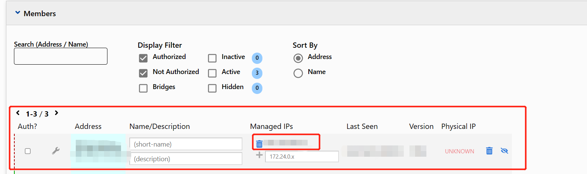
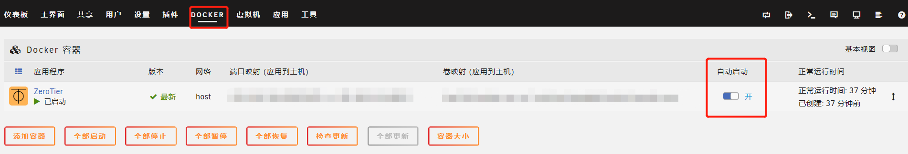

[toc]

# Zerotier内网穿透

使用Zerotier，可以无需公网IP就能进行内网穿透。

注意: 只有当控制端和被控制端都安装了Zerotier.两端之间才能在不需要公网ip的情况下,进行端对端访问.

## 注册Zerotier和设置

[Zerotier官网](https://www.zerotier.com/)

1. 注册Zerotier账户
2. 创建网络，点击“Create A Network”
3. 网络创建之后，就可以看到网络的NETWORK ID

## 自己电脑安装Zerotier软件

1. 在Zerotier官网上下载安装包,完成软件的安装.
2. 运行Zerotier软件.
3. 选中zerotier图标,鼠标右击zerotier，选择“Join Network”。
4. 输入你创建网络的NETWORK ID即可.
5. 然后登录Zerotier官网.选中你创建的网络.
6. 你就可以在Members设置中看到你的电脑出现在这个网络中.

7. 勾选方框，刷新页面,这样就把你电脑加入到你创建的网络中。
8. Managed IPs表示的是你的设备在这个网络中的ip,如果你要访问其他设备,就需要在浏览器中输入其他设备的Managed ip。

## nas端安装Zerotier

以unraid系统为例，在unraid系统中安装Zerotier。

1. 直接在应用市场中搜索Zerotier
2. 安装Zerotier docker容器
3. 在docker配置页面，填写在Zerotier网站中你注册的NETWORK ID即可。该docker容器会自动下载安装。
4. 登录Zerotier官网，把nas端设备添加到你的网络中即可。
5. 然后再浏览器中访问nas端设备分配到的ip地址，即可远程访问nas

注意设置自动启动
