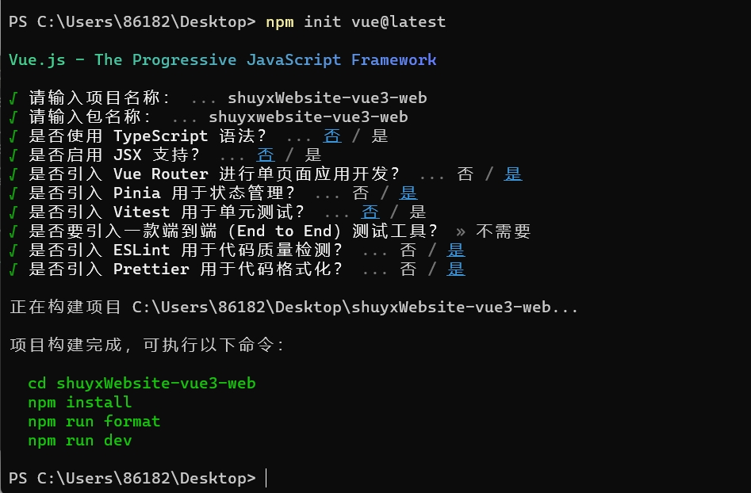
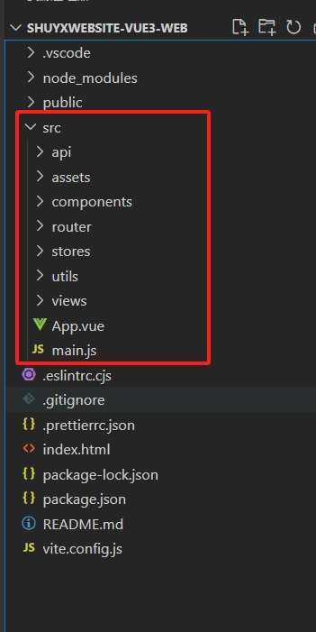

[toc]

# Vue3工程的搭建细节

## 创建Vue3工程

创建vue3工程。选择vue3工程中需要的依赖

```shell
# 创建工程
npm init vue@latest

# 进入到工程目录中
cd shuyxWebsite-vue3-web
# 安装工程依赖包
npm install
# 运行工程
npm run dev
```


vue3_20231120204637.png

- Vue Router 用于页面路由管理的
- Pinia 用于状态管理的
- ESLint 用于代码质量检测的
- Prettier 用于格式化代码的

上面几个工具都是一个完整工程必备的。

## 调整vue3工程的目录

通过脚手架创建的工程。其默认生成的目录结构并不满足工作中的开发需求。我们需要做一些自定义改动。

- 删除工程中不需要的初始文件。
  - 例如assets目录和views目录中的文件。
  - 例如components目录中的文件。
  - 例如stores目录中的counter.js文件删除。
- 新增调整我们需要的目录结构。
  - 例如在src目录下新增utils目录。用于存放一些工具函数。
  - 例如在src目录下新增api目录。用于存放一些请求函数。
- 修改文件
  - 例如router/index.js文件中的路由先清空。
  - 例如APP.vue文件中的无用代码清空，只保留最基本结构。 

App.vue
```jsx
<script setup></script>
<template>
  <div>
    <router-view></router-view>
  </div>
</template>
<style scoped></style>
```

工程完整目录如下：


- api:请求相关的代码
- assets:静态资源相关的代码
- components:组件相关的代码
- router:路由相关的代码
- stores:状态管理相关的代码
- utils:工具函数相关的代码
- views:页面相关的代码
- APP.vue 根组件文件
- main.js 入口js文件


## 请求模块封装

在实际的开发中，我们都会将axios进行封装。通常会将网络相关的业务独立放到一个文件夹中，文件夹取名为api。然后创建两个文件。
- 一个是request.js文件用于封装 axios 请求；
- 一个是api.js文件用于封装所有的 API 请求；

vue3写法的request.js文件
```js
import axios from 'axios'
const baseURL = 'http://xxx.xxx.xxx'

// 请求基础配置
const instance = axios.create({
  baseURL,
  timeout: 100000
})

// 请求拦截器
instance.interceptors.request.use(
  (config) => {
    //将token加入到请求头的Authorization中
    const token = localStorage.getItem('shuyxWebsite-token')
    if (token) {
        config.headers.Authorization = 'Bearer' + ' ' + token
    }
    return config
  },
  (err) => Promise.reject(err)
)

// 响应拦截器
instance.interceptors.response.use(
  (res) => {
    // 响应成功后,响应状态为200并且响应数据code也是200
    if (res.status === 200 && res.data.code === 200) {
        return Promise.resolve(res.data)
    }
    //否则表示业务失败
    return Promise.reject(res.data)
  },
  (err) => {
    console.log('Response Error:', err)
    return Promise.reject(err)
  }
)

export default instance

```

