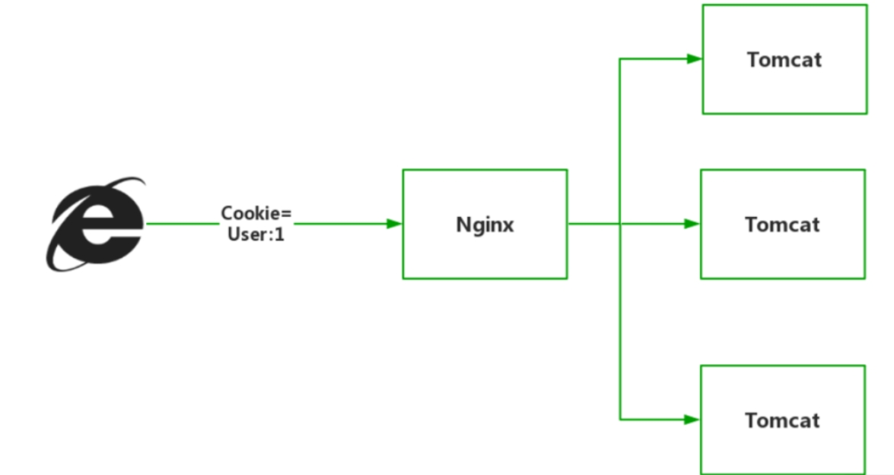

[toc]

# 用户认证方案

## 什么是用户认证？

对于系统中的大多数业务操作来说。系统必须首先要确认用户身份后，才会允许你进行业务。用户认证的形式有多种，最常见的有输入用户名密码、手机验证码、人脸识别、指纹识别等，但其目的都是为了确认用户在系统中的身份并为之提供服务。

## 用户认证方案的演变

### 单体应用的用户认证

一般用户认证的流程如下
1. 用户向服务器发送用户名和密码。
2. 服务器验证通过后，在当前对话（session）里面保存相关数据，比如用户角色、登录时间等等。
3. 服务器向用户返回一个 session_id，写入用户的 Cookie。
4. 用户随后的每一次请求，都会通过 Cookie，将 session_id 传回服务器。
5. 服务器收到 session_id，找到前期保存的数据，由此得知用户的身份。

### 集群应用的用户认证

随着系统流量的增高，单点应用以无法支撑业务运行。因此单体应用变成了集群应用。由于之前的是一台服务器存储session，现在为了用户认证必须要每台服务器都存储session。这样在集群环境下必须保证每一个服务器节点的session状态一致的才不会出问题。

因此基于Redis的分布式会话存储方案应运而生，将用户session数据统一转存至 Redis 中，因为该session数据是集中存储的，所以不会出现session数据一致性的问题。

### 客户端存储的用户认证

上面两个方式都是在服务器上存储用户数据的用户认证方案。但是我们可以让用户数据不在从服务器上存储，改为在客户端上存储。

客户端每一次发送请求时附带用户数据到服务器，然后服务器读取用户数据并进行业务处理，因为用户数据分散存储在客户端中，因此并不会对服务端产生额外的负担，此时认证架构会变成下面的情况。

一般在客户端存储并加密用户数据时有一个通用的用户认证方案：Json Web Token（JWT），JWT是一个经过加密的，包含用户信息的且具有时效性的固定格式字符串，即token。

### 微服务架构下的基于服务的用户认证方案

架构图如下

用户认证流程如下：
1. 认证中心微服务负责用户认证，在启动时从 Nacos 配置中心抽取 JWT 加密的私钥；
2. 用户在登录界面输入账户密码，客户端向认证中心微服务发起认证请求：
3. 认证中心微服务根据输入在用户数据库中进行认证校验，如果校验成功则生成用户的JSON数据并创建对应的JWT返回给客户端
4. 客户端收到JWT数据后，客户端将JWT保存在 cookie 或者本地缓存中；
5. 随后客户端向具体某个微服务发起新的请求，这个 JWT 都会附加在请求头或者 cookie 中发往 API 网关，网关根据路由规则将请求与jwt数据转发至具体的微服务。中间过程网关不对 JWT 做任何处理。
6. 某个微服务接收到请求后，发现请求附带JWT数据，于是将JWT再次转发给认证中心微服务，让其对 JWT 进行验签。若验签成功则请求继续执行下去。
7. 若验签失败，则请求直接失败。

### 微服务架构下的基于API网关的用户认证方案

架构图如下：

如图所示，基于API网关的用户认证方案主要是API网关来统一进行认证服务。其余微服务不用进行认证服务。

> 微服务架构下基于服务和基于API网关的用户认证方案的区别

基于服务的用户认证方案：
- 控制的粒度更细。比如微服务 A 提供了“商品查询”与“创建订单”两个功能，前者不需要登录用户就可以使用，因此不需要进行用户认证；而后者是登录后的功能，因此必须用户认证后才可执行。
- 因为该方案是每个服务都要进行用户认证。因此需要在所有业务方法上声明是否需要额外验签，尽管这个工作可以通过 Spring AOP+注解的方式无侵入实现。

基于API网关的用户认证方案：
- API网关不关心后端的服务逻辑，只要请求附带JWT，就自动向认证中心进行验签。
- 这种方案确实让模块耦合有所降低，处理起来也更简单

使用场景上：
- 基于服务的用户认证方案的用户认证的粒度更细，适合应用在低延迟、高并发的应用，例如导航、实时交易系统、军事应用。
- 基于API网关的用户认证方案更适合用在传统的企业应用，可以让程序员专心开发业务逻辑，同时程序也更容易维护。

