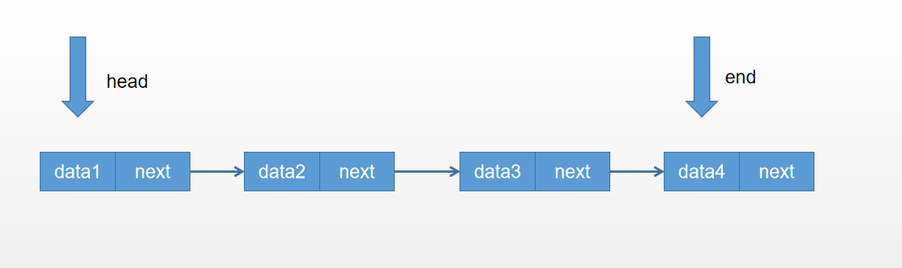
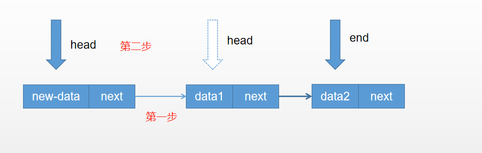
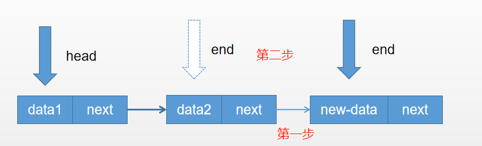
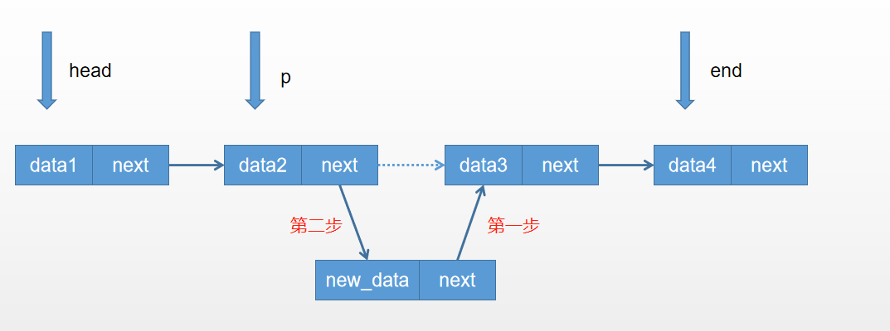
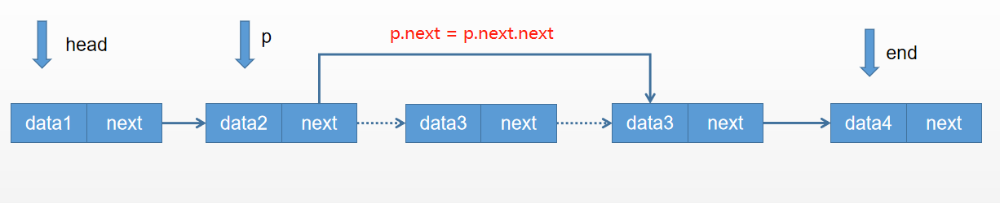
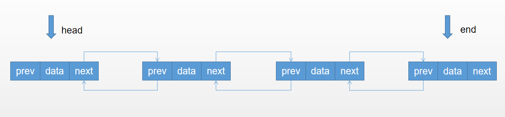
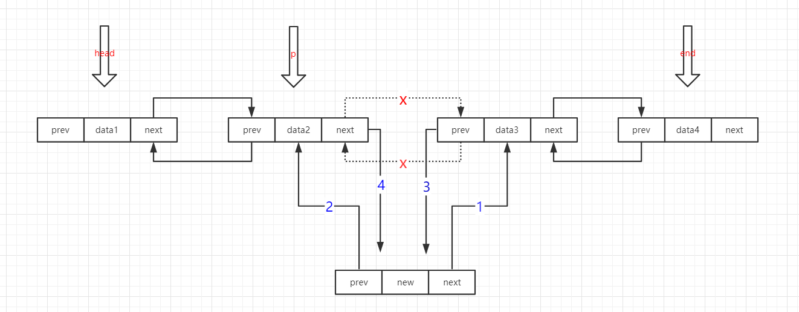
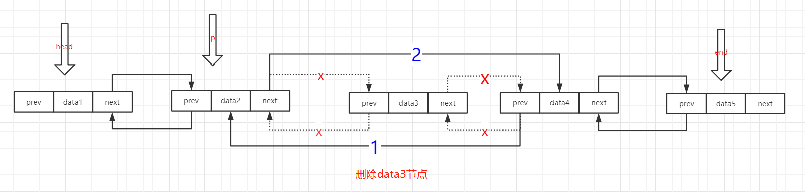
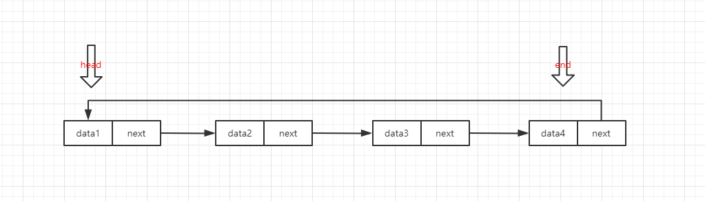
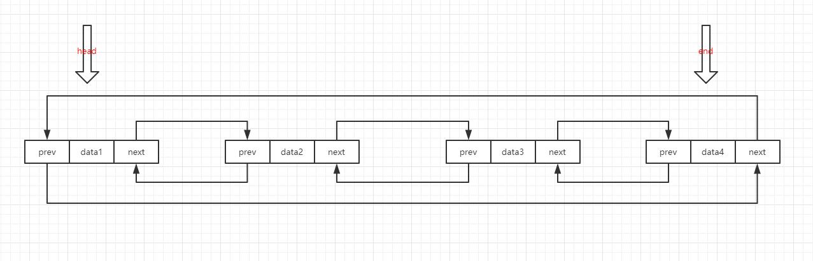

## 链表

链表是一种线性数据结构。链表中的每个节点实际上是一个单独的对象。而所有对象都通过节点中的引用字段链接在一起。链表有两种类型：单链表和双链表


### 单链表



<font color="red">PS:注意,图中头节点就是第一个节点，有的时候链表的头节点不是第一个节点。</font>

单链表中每个节点由data和next两部分组成

```java
//节点类
public class Node {
    int val;
    Node next = null; //指向下个节点的指针
    Node(){}
    Node(int val){
        this.val = val;
    }
}
```

1. 单链表头部插入新节点（头插法）



第一步：新节点的next指向头指针head.
第二步：把头指针head指向新节点

2. 单链表尾部插入新节点（尾插法）



第一步：把最后一个节点的next指向新节点
第二步：把尾指针end指向新节点

3. 单链表index处插入新节点



第一步: 创建遍历指针p,移动到index-1的位置上。
第二步：新节点的next指向p的next指向的节点
第三步：p的next指向新节点

4. 单链表index处删除一个节点



第一步: 创建遍历指针p,移动到index-1的位置上。
第二步：p的next指向p的next的next

>完整的单链表类

```java
//链表类
public class MyLinkList {
    //节点类-内部类
    class Node {
        int val;
        Node next = null;
        Node(){}
        Node(int val){
            this.val = val;
        }
    }
     //头指针
    private Node head=null;
    //尾指针
    private Node end=null;
    //记录链表节点数
    private int size = 0;

    //新增节点-尾插法（向节点尾部新增节点）
    public void addToEnd(int data){
        //创建新节点
        Node newNode = new Node(data);
        //若当前链表为空.则新节点为第一个节点
        if(head == null){
            head = newNode;
            end = newNode;
        }else{
            //若当前链表非空
            //首先最后的节点的next指向新节点
            //然后尾指针指向新节点
            end.next = newNode;
            end = newNode;
        }
        size++;
    }

    //新增节点-头插法（向节点头部新增节点）
    public void addToHead(int data){
        //创建新节点
        Node newNode = new Node(data);
        //若当前链表为空.则新节点为第一个节点
        if(head == null){
            head = newNode;
            end = newNode;
        }else{
            //若当前链表非空
            //首先新节点的next指向头节点
            //然后头指针指向新节点
            newNode.next = head;
            head = newNode;
        }
        size++;
    }

    //向链表的索引处添加新节点
    public void addToIndex(int data,int index){
        //若索引是0或size-1
        if(index<0){
            System.out.println("index < 0 无效");
        }else if(index == 0){
            //头插法
            addToHead(data);
        }else if(index >= size){
            //尾插法
            addToEnd(data);
        }else{
            //插入节点到链表中间
            //新建遍历指针p
            Node p=head;
            //创建新节点
            Node new_node = new Node(data);
            //遍历到索引的前一位,此时p指针指向index-1的节点
            //把新节点的next指向p+1指向的节点
            //把p节点的next指向新节点
            for(int i=0;i<index-1;i++){
                p = p.next;
            }
            new_node.next = p.next;
            p.next = new_node;

            //链表长度+1
            size++;
        }
    }
    //删除索引处的链表节点
    public void removeToIndex(int index){
        //判断链表是否为空
        if(head == null){
            System.out.println("链表为空，删除失败");
        }else if(index<0 || index >= size){
            System.out.println("index 无效");
        }else{
            //若索引是0或size-1
            if(index == 0){
                //删除头节点
                head = head.next;
            }else if(index == size-1){
                //删除最后一个节点
                //先遍历到倒数第二个节点，将其设为最后一个节点
                //让尾指针指向它
                Node p = head;
                for(int i=0;i<size-2;i++){
                    p = p.next;
                }
                p.next = null;
                end = p;
            }else{
                //删除中间节点，先遍历到前一个节点
                Node p = head;
                for(int j=0;j<index-1;j++){
                    p = p.next;
                }
                p.next = p.next.next;
            }
            //链表节点数-1
            size--;
        }
    }

    //获得链表长度，链表节点数
    public int getSize(){
        return size;
    }

    //返回索引处的节点数据
    public int getVal(int index){
        if(index<0 || index>=size){
            System.out.println("index无效，返回-1");
            return -1;
        }else{
            if(index == 0){
                return head.val;
            }else if(index == size-1){
                return end.val;
            }else if(index > 0 && index < size-1){
                Node p = head;
                for(int i=0;i<index;i++){
                    p = p.next;
                }
                return p.val;
            }else{
                System.out.println("index无效，返回-1");
                return -1;
            }
        }
    }

    //展示链表
    public void show(){
        //创建遍历指针p,p指向头节点
        Node p = head;
        //若链表不为空
        while(p != null){
            System.out.print(" "+p.val);
            //遍历指针p向下个节点移动
            p = p.next;
        }
    }
}

```

### 双向链表




双链表中每个节点由data和prev,next三部分组成。next指向下一个节点,prev指向上一个节点。

```java
//双链表节点类
public class Node{
    int val;
    Node prev = null; //向前指针
    Node next = null; //向后指针
    Node(){};
    Node(int val){this.val = val;};
}
```

1. 向双链表中index处插入新节点



注意：图中1234的顺序不能弄反

```java
//先创建遍历指针p，并指向index-1处
new_node.next = p.next;
new_node.prev = p;
p.next.prev = new_node;
p.next = new_node;
```


2. 双链表中index处删除一个节点



注意：图中12顺序不能弄反

```java
//先创建遍历指针p，并指向index处
Node p = head;
for(int j=0;j<index-1;j++){
    p = p.next;
}
p.next.next.prev = p;
p.next = p.next.next;

```

> 完整的双链表类

```java
package com.example.demo;

//双链表类
public class MyLinkList2 {
    //双链表节点类
    class Node{
        int val;
        Node prev = null; //向前指针
        Node next = null; //向后指针
        Node(){};
        Node(int val){this.val = val;};
    }

    private Node head = null; //头指针
    private Node end = null;  //尾指针
    private int size = 0;     //链表节点数

    //获取链表长度
    public int getSize(){ return this.size;}

    //新增节点-头插法
    public void addToHead(int data){
        //创建新节点
        Node newNode = new Node(data);
        //若当前链表为空.则新节点为第一个节点
        if(head == null){
            head = newNode;
            end = newNode;
        }else{
            //若当前链表非空
            newNode.next = head;
            head.prev = newNode;
            head = newNode;
        }
        size++;
    }

    //新增节点-尾插法
    public void addToEnd(int data){
        //创建新节点
        Node newNode = new Node(data);
        //若当前链表为空.则新节点为第一个节点
        if(head == null){
            head = newNode;
            end = newNode;
        }else{
            //若当前链表非空
            end.next = newNode;
            newNode.prev = end;
            end = newNode;
        }
        size++;
    }

    //在索引处添加新节点（在index-1处和index处插入新节点）
    public void addToIndex(int data,int index){
        //若索引是0或size-1
        if(index<0){
            System.out.println("index < 0 无效");
        }else if(index == 0){
            addToHead(data); //头插法
        }else if(index >= size){
            addToEnd(data); //尾插法
        }else{
            Node p=head;
            //遍历到索引的前一位,此时p指针指向index-1的节点
            for(int i=0;i<index-1;i++){
                p = p.next;
            }
            //创建新节点
            Node new_node = new Node(data);
            new_node.prev = p;
            new_node.next = p.next;
            p.next.prev = new_node;
            p.next = new_node;
            //链表长度+1
            size++;
        }
    }

    //删除头节点
    public void deleteToHead(){
        if(head == null){
            System.out.println("链表为空，删除失败");
        }else{
            head = head.next;
            head.prev = null;
            size--;
        }
    }

    //删除尾节点
    public void deleteToEnd(){
        if(head == null){
            System.out.println("链表为空，删除失败");
        }else{
            //先遍历到倒数第二个节点，让尾指针指向它
            Node p = head;
            for(int i=0;i<size-2;i++){
                p = p.next;
            }
            end = p;
            end.next = null;
            end.prev = null;
            size--;
        }
    }

    //删除索引处的链表节点
    public void deleteToIndex(int index){
        //判断链表是否为空
        if(head == null){
            System.out.println("链表为空，删除失败");
        }else if(index<0 || index >= size){
            System.out.println("index<0或index>=size 无效");
        }else{
            if(index == 0){
                deleteToHead(); //删除头节点
            }else if(index == size-1){
                deleteToEnd();  //删除尾节点
            }else{
                //删除中间节点，先遍历到前一个节点
                Node p = head;
                for(int j=0;j<index-1;j++){
                    p = p.next;
                }
                p.next.next.prev = p;
                p.next = p.next.next;
                size--;
            }
        }
    }

    //返回索引处的节点数据
    public int getVal(int index){
        if(index<0 || index>=size){
            System.out.println("index无效，返回-1");
            return -1;
        }else{
            if(index == 0){
                return head.val;
            }else if(index == size-1){
                return end.val;
            }else if(index > 0 && index < size-1){
                Node p = head;
                for(int i=0;i<index;i++){
                    p = p.next;
                }
                return p.val;
            }else{
                System.out.println("index无效，返回-1");
                return -1;
            }
        }
    }

    //展示链表
    public void show(){
        //创建遍历指针p,p指向头节点
        Node p = head;
        //若链表不为空
        while(p != null){
            System.out.print(" "+p.val);
            //遍历指针p向下个节点移动
            p = p.next;
        }
    }
}

```

## 循环链表

循环链表就是头节点和尾节点相连的链表。其分为循环单链表和循环双链表。

### 循环单链表



<font color="red">相比单链表，每次头节点和尾节点改动的时候，添加 end.next = head; 这段代码，确保头尾相连即可。</font>

>循环单链表

```java
package com.example.demo;

//单向循环链表
public class MyLinkList3 {
    class Node{
        int val;
        Node next = null;
        Node(){};
        Node(int val){this.val = val;}
    }

    private Node head = null; //头指针
    private Node end = null;  //尾指针
    private int size = 0;     //链表节点数

    //获取链表长度
    public int getSize(){ return this.size;}

    //新增节点-头插法
    public void addToHead(int data){
        Node newNode = new Node(data);
        //若当前链表为空.则新节点为第一个节点
        if(head == null){
            head = newNode;
            end = newNode;
            newNode.next = head;
        }else{
            //若当前链表非空
            newNode.next = head;
            head = newNode;
            //尾节点的next指向头节点，形成首尾相连
            end.next = head;
        }
        size++;
    }

    //新增节点-尾插法
    public void addToEnd(int data){
        Node newNode = new Node(data);
        //若当前链表为空
        if(head == null){
            head = newNode;
            end = newNode;
            newNode.next = head;
        }else{
            //若当前链表非空
            end.next = newNode;
            end = newNode;
            //尾节点的next指向头节点，形成首尾相连
            end.next = head;
        }
        size++;
    }

    //向链表的索引处添加新节点
    public void addToIndex(int data,int index){
        //若索引是0或size-1
        if(index<0){
            System.out.println("index < 0 无效");
        }else if(index == 0){
            //头插法
            addToHead(data);
        }else if(index >= size){
            //尾插法
            addToEnd(data);
        }else{
            //插入节点到链表中间
            //新建遍历指针p
            Node p=head;
            //创建新节点
            Node new_node = new Node(data);
            //遍历到索引的前一位,此时p指针指向index-1的节点
            //把新节点的next指向p+1指向的节点
            //把p节点的next指向新节点
            for(int i=0;i<index-1;i++){
                p = p.next;
            }
            new_node.next = p.next;
            p.next = new_node;

            //链表长度+1
            size++;
        }
    }

    //删除头节点
    public void deleteToHead(){
        if(head == null){
            System.out.println("链表为空，删除失败");
        }else{
            head = head.next;
            //尾节点的next指向头节点，形成首尾相连
            end.next = head;
            size--;
        }
    }

    //删除尾节点
    public void deleteToEnd(){
        //删除最后一个节点
        //先遍历到倒数第二个节点，让尾指针指向它
        Node p = head;
        for(int i=0;i<size-2;i++){
            p = p.next;
        }
        p.next = null;
        end = p;
        //尾节点的next指向头节点，形成首尾相连
        end.next = head;
        size--;
    }


    //删除索引处的链表节点
    public void deleteToIndex(int index){
        //判断链表是否为空
        if(head == null){
            System.out.println("链表为空，删除失败");
        }else if(index<0 || index >= size){
            System.out.println("index 无效");
        }else{
            //若索引是0或size-1
            if(index == 0){
                //删除头节点
                deleteToHead();
            }else if(index == size-1){
                //删除最后一个节点
                deleteToEnd();
            }else{
                //删除中间节点，先遍历到前一个节点
                Node p = head;
                for(int j=0;j<index-1;j++){
                    p = p.next;
                }
                p.next = p.next.next;
                size--;
            }
        }
    }

    //返回索引处的节点数据
    public int getVal(int index){
        if(index<0 || index>=size){
            System.out.println("index无效，返回-1");
            return -1;
        }else{
            if(index == 0){
                return head.val;
            }else if(index == size-1){
                return end.val;
            }else if(index > 0 && index < size-1){
                Node p = head;
                for(int i=0;i<index;i++){
                    p = p.next;
                }
                return p.val;
            }else{
                System.out.println("index无效，返回-1");
                return -1;
            }
        }
    }

    //展示链表
    // do..while循环至少循环一次
    public void show(){
        //创建遍历指针p
        Node p = head;
        do{
            System.out.print(" "+p.val);
            p = p.next;
        }while(p!=head);
    }
}

```


### 循环双链表



<font color="red">相比双向链表，每次头节点和尾节点改动的时候，添加 head.prev = end; end.next = head;这段代码，确保头尾相连即可。</font>

完整的循环双链表

```java
package com.example.demo;

//双向循环链表
public class MyLinkList4 {
    //双链表节点类
    class Node{
        int val;
        Node prev = null; //向前指针
        Node next = null; //向后指针
        Node(){};
        Node(int val){this.val = val;};
    }

    private Node head = null; //头指针
    private Node end = null;  //尾指针
    private int size = 0;     //链表节点数

    //获取链表长度
    public int getSize(){ return this.size;}

    //新增节点-头插法
    public void addToHead(int data){
        Node newNode = new Node(data);
        //若当前链表为空.则新节点为第一个节点
        if(head == null){
            head = newNode;
            end = newNode;
        }else{
            newNode.next = head;
            head.prev = newNode;
            head = newNode;
            //确保首尾相连
            head.prev = end;
            end.next = head;
        }
        size++;
    }

    //新增节点-尾插法
    public void addToEnd(int data){
        //创建新节点
        Node newNode = new Node(data);
        //若当前链表为空.则新节点为第一个节点
        if(head == null){
            head = newNode;
            end = newNode;
        }else{
            //若当前链表非空
            end.next = newNode;
            newNode.prev = end;
            end = newNode;
            //确保首尾相连
            head.prev = end;
            end.next = head;
        }
        size++;
    }

    //在索引处添加新节点（在index-1处和index处插入新节点）
    public void addToIndex(int data,int index){
        //若索引是0
        if(index<0){
            System.out.println("index < 0 无效");
        }else if(index == 0){
            addToHead(data); //头插法
        }else if(index >= size){
            addToEnd(data); //尾插法
        }else{
            Node p=head;
            //遍历到索引的前一位,此时p指针指向index-1的节点
            for(int i=0;i<index-1;i++){
                p = p.next;
            }
            //创建新节点
            Node new_node = new Node(data);
            new_node.prev = p;
            new_node.next = p.next;
            p.next.prev = new_node;
            p.next = new_node;
            //链表长度+1
            size++;
        }
    }

    //删除头节点
    public void deleteToHead(){
        if(head == null){
            System.out.println("链表为空，删除失败");
        }else{
            head = head.next;
            //确保首尾相连
            head.prev = end;
            end.next = head;
            size--;
        }
    }

    //删除尾节点
    public void deleteToEnd(){
        if(head == null){
            System.out.println("链表为空，删除失败");
        }else{
            //先遍历到倒数第二个节点，让尾指针指向它
            end = end.prev;
            //确保首尾相连
            head.prev = end;
            end.next = head;
            size--;
        }
    }

    //删除索引处的链表节点
    public void deleteToIndex(int index){
        //判断链表是否为空
        if(head == null){
            System.out.println("链表为空，删除失败");
        }else if(index<0 || index >= size){
            System.out.println("index<0或index>=size 无效");
        }else{
            if(index == 0){
                deleteToHead(); //删除头节点
            }else if(index == size-1){
                deleteToEnd();  //删除尾节点
            }else{
                //删除中间节点，先遍历到前一个节点
                Node p = head;
                for(int j=0;j<index-1;j++){
                    p = p.next;
                }
                p.next.next.prev = p;
                p.next = p.next.next;
                size--;
            }
        }
    }

    //返回索引处的节点数据
    public int getVal(int index){
        if(index<0 || index>=size){
            System.out.println("index无效，返回-1");
            return -1;
        }else{
            if(index == 0){
                return head.val;
            }else if(index == size-1){
                return end.val;
            }else if(index > 0 && index < size-1){
                Node p = head;
                for(int i=0;i<index;i++){
                    p = p.next;
                }
                return p.val;
            }else{
                System.out.println("index无效，返回-1");
                return -1;
            }
        }
    }

    //展示链表
    public void show(){
        //创建遍历指针p
        Node p = head;
        do{
            System.out.print(" "+p.val);
            p = p.next;
        }while(p!=head);
    }
}

```

