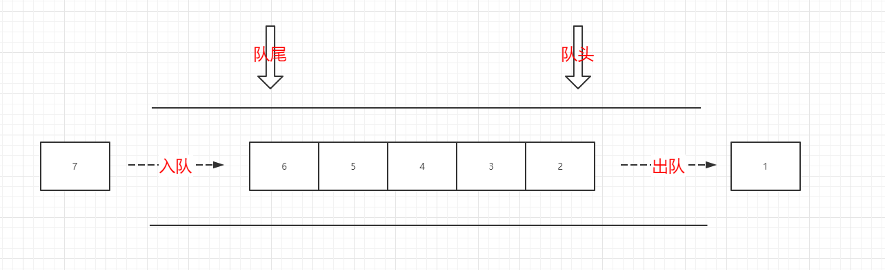
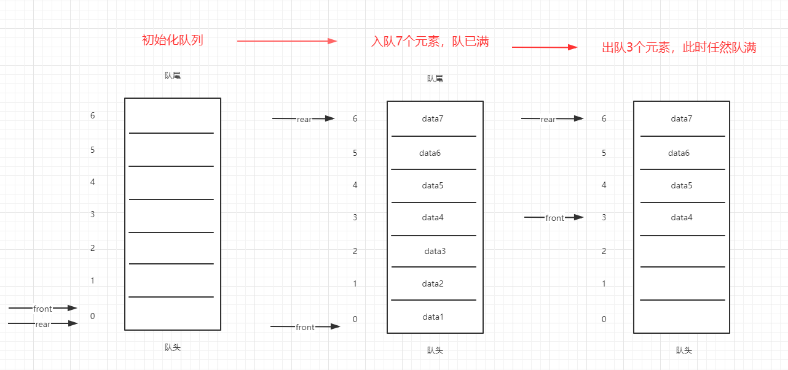

## 队列



队列是一种在队尾进行插入，而在队头进行删除元素的线性表。是一种先进先出的数据结构。

### 顺序队列-用数组来存储元素的队列




1. 顺序队列一般用一维数组进行存储数值
2. 队头指针front和队尾指针rear默认都为0
3. 入队：新元素插入rear所指的位置，然后将rear加1
4. 出队：取去front所指的元素，然后将front加1。
5. 队空：当fornt == rear 时，队空。
6. 队满：在顺序队列中，若rear >= maxsize,即队满

<font color="red">图中最右侧表示，顺序队列在几次入队出队之后，会有个假溢出现象，即实际上是队未满的，但在逻辑上是队满。这个问题可以通过循环顺序队列来解决。</font>

```java
//顺序队列代码


```

