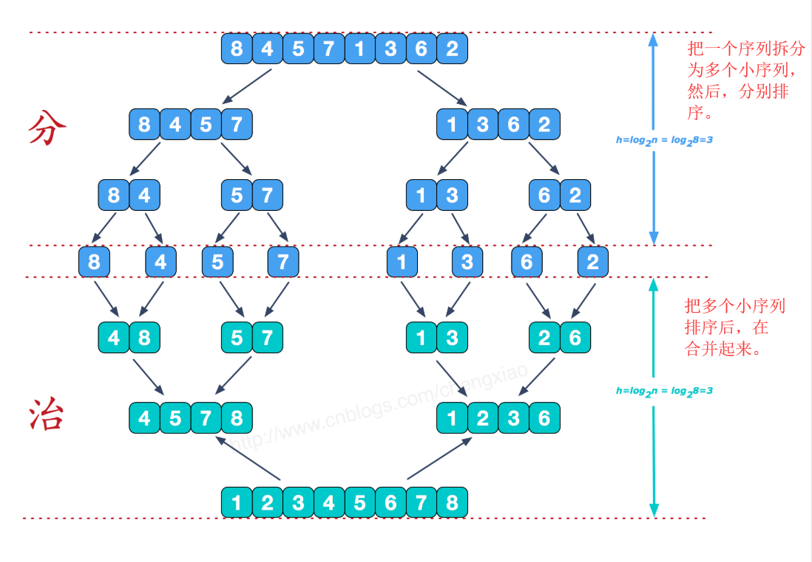

# 数据结构基础

## 1. 基本概念与术语：

**数据**： 所有能被输入到计算机中并被计算机程序处理的符号的总称。如图像，声音，字符等可以通过编码处理的数据。
**数据项：** 是数据的不可分割的最小单位。多个数据项构成一个数据元素。
**数据元素：** 数据的基本单位,在计算机中也被称为记录。
**数据对象：** 性质相同的数据元素的集合，是数据的子集。
**数据结构：** 是相互之间存在的一种或多种特定关系的数据元素的集合。

>数据结构其通常分为四种基本结构：
> 1. 集合 
> 2. 线性结构（一对一关系） 
> 3. 树形结构（一对多关系） 
> 4. 图状结构或网状结构（多对多关系）

## 2. 算法：
**算法：**  <font color="red">指的是对特定问题求解步骤的一种描述。</font>


>算法通常分为5个特性：
>>1 有穷性：一个算法的执行时间是有限度的。
>>2 确定性：算法中的每一条指令是有确切的含义。
>>3 可行性：算法是可执行到结束的，无问题。
>>4 输入：有零个或多个输入。
>>5 输出：有零个或多个输出。


**算法设计要求：**

1. 正确性：满足问题的需求。
2. 可读性：便于阅读，帮助人更好理解算法。
3. 健壮性：当输入数据不合法时，算法能做出相关处理。
4. 时间效率高与空间低存储量需求：效率高，存储量低。

**算法效率的度量方法：** 

1. 事后统计法。
2. 事前分析估计法: 时间复杂度，空间复杂度


## 3.线性表-零个或多个数据元素的有限序列：

<font color="red">
线性表中数据元素之间的关系是一对一的关系，即除了第一个和最后一个数据元素之外，其它数据元素都是首尾相接的。
</font>


### 1.线性表的顺序存储结构：

其指的是用一段连续的存储的存储单元依次存储线性表的数据元素。

<font color="red">其可以用数组实现。</font>
    
### 2.线性表的链式存储结构-单链表：

其指的是用一组任意的存储单元存储线性表的数据。这组存储单元可以是连续的，也可以是不连续的。


<font color="red">链表的第一个结点叫做头结点。头节点不存储数据。</font>


链表结点的存储结构：

```c
struct node{
    int data;  //存储该节点的数据
    struct node *next;   //next指针存放下一个结点的地址信息。
}linklist;
```

> ①：链表的创建：

头插法-逆序（始终让新结点在开头的位置），尾插法-顺序（始终让新结点在链表结尾）

头插法图解：


```c
#include<stdio.h>
#include<stdlib.h>
typedef struct node{
	int data;
	struct node *next;
}linklist;
void Createlinklist(linklist *head,int n){    //尾插法(新节点始终在链表结尾)
	linklist *p,*q;
	p=head;                  
	for(int i=0;i<n;i++){
		q=(linklist*)malloc(sizeof(linklist));  //创建一个节点给q
		q->data=i;     
		p->next=q;
		p=q;
	}
}

void Createlinklist2(linklist *head,int n){    //头插法(新创建的节点始终在链表开头)
	linklist *q;
	head->next=NULL;
	for(int i=0;i<n;i++){
		q=(linklist*)malloc(sizeof(linklist));  
		q->data=i;    
		q->next=head->next;
		head->next=q;
	}
}

void main(){
	int n;
	scanf("%d",&n);
	linklist *head,*k;
	head=(linklist*)malloc(sizeof(linklist));    //创建头节点
	
	Createlinklist(head,n);    //顺序建立链表
	k=head->next;             //k指向第一个结点
	for(int i=0;i<n;i++){
		printf("%d\n",k->data);
		k=k->next;
	}

	printf("-----------"); 

	Createlinklist2(head,n);   //逆序建立链表
	k=head->next;             //k指向第一个结点
	for(int i=0;i<n;i++){
		printf("%d\n",k->data);
		k=k->next;
	}
}
```

> ②：链表的插入与删除：

**删除指定节点数据为k的节点：**

```c
void deletepoint(linklist *head,int k){   //删除指定节点
	linklist *p,*q;
	p=head;
	while(p&&p->data!=k){    //找到指定节点k的前一个节点
		q=p;p=p->next;
	}
	if(p!=NULL){             //若指定节点存在
		q->next=p->next;	 //断开指定节点的前后链接
		free(p);			 //删除指定节点
		p=q->next;				
	}	
}
```
//创建节点a,插入到k节点之前


```c
void insertpoint(linklist *head,int a,int k){    //创建节点a,插入到k节点之前
	linklist *t,*p,*q;
	p=head;

	t=(linklist*)malloc(sizeof(linklist));
	t->data=a;

	while(p&&p->data!=k){    //找到指定节点k的前一个节点
		q=p;p=p->next;
	}
	if(p!=NULL){             //若节点k存在,则q指向节点k
		t->next=p;	         //新节点的下一个节点是节点k
		q->next=t;			 //新节点的上一个节点是节点q，即节点k的上一个节点。
	}
}
```

> ③：链表的整表删除：

思路：
1. 声明指针p,q.
2. 把第一个节点给p。
3. 循环： 把下一个节点给p -> 释放p -> 让p指向q（p=q;）
```c
void deleteAll(linklist *head){   //删除链表的全部节点，不包括头节点
	linklist *p,*q;               
	p=head->next;					//p指第一个节点
	while(p){
		q=p->next;				//q指向第二个节点
		free(p);				//删除第一个节点
		p=q;
	}
}
```

### 3.循环链表：

<font color="red">
定义： 把单链表的最后一个节点的指针域从空指针改为头节点，使整个单链表形成一个环。这种头尾相连的链表称为循环链表。
</font>


循环链表的创建与遍历：
```c
#include<stdio.h>
#include<stdlib.h>
typedef struct node{
	int data;
	struct node *next;
	
}linklist;

//创建循环链表
void Createlinklist3(linklist *head,int n){   
	linklist *p,*q,*rear; 
	q=head;
	for(int i=0;i<n;i++){    //这个循环创建链表
		p=(linklist*)malloc(sizeof(linklist));
		p->data=i;
		q->next=p;
		q=p;
	}
	//当循环结束，此时p,q均指向最后一个节点，设置尾指针，并把尾指针指向头节点
	rear=p;
	rear->next=head;

}

void main(){
	int n;
	scanf("%d",&n);
	linklist *head,*k;
	head=(linklist*)malloc(sizeof(linklist));    //创建头节点
	head->data=NULL;     //给头节点设置空值

	Createlinklist3(head,n);             //此时包括头节点，共有n+1个节点
	printf("------------");
	k=head->next;    //k指向第一个节点
	while(k!=head){                  //遍历循环链表,当k不为头节点，表示遍历未完成
		printf("%d",k->data);
		k=k->next;
	}
}
```


### 4.双向链表：

<font color="red">
定义： 在单链表的每个节点中，设计一个指向其上一个节点的指针域。
</font>


双向链表的存储结构：
```c
typedef struct node{
	int data;
	struct node *next;
	struct node *prior;
}linklist;
```

创建双向链表
```c
//创建双向链表：
void Createlinklist4(linklist *head,int n){     
	linklist *p,*q;
	q=head;
	for(int i=0;i<n;i++){
		p=(linklist*)malloc(sizeof(linklist));
		p->data=i;
		p->prior=q;        //新节点prior指向上一个节点（后面接前面）
		q->next=p;			//前面接后面
		q=p;
	}
}
```

//在双向链表中插入新节点t，插在数值为k的节点之前


```c
//在双向链表中插入新节点t，插在数值为k的节点之前：
void insertlinklist(linklist *head,linklist *t,int k){
	linklist *p,*q;    //p为始终为q的上一个节点
	q=head->next;        
	while(q&&q->data!=k){
		p=q;
		q=q->next;
	}

	//循环后，p指向数值为k的节点的上一个节点：
	s->prior=p;				
	s->next=p->next;
	p->next->prior=s;
	p->next=s;

	/* 或者
		t->prior=p;        //新节点的上一个节点为p;
		t->next=q;		  //新节点的下一个节点为q,即数值为k的节点
		q->prior=t;      //数值为k的节点q的上一个节点为新节点
		p->next=t;		//p节点的下一个节点为新节点
	*/
}
```

//在双向链表中删除数值为k的节点：

```c

void deletelinklist(linklist *head,int k){
	linklist *p;    
	p=head->next;        
	while(p&&p->data!=k){    //找到数值为k的节点
		p=p->next;
	}
	//for循环后，p指向目标节点或者目标节点不存在
	if(p){
		p->prior->next=p->next;      //目标的节点p的上一个节点指向p的下一个节点
		p->next->prior=p->prior;	 //p的下一个节点的前一个节点指向p的上一个节点
	}
}
```

## 4.栈：

<font color="red">栈是一种特殊的线性表，其仅在表尾进行插入和删除操作。栈中的元素始终遵循后进先出的顺序</font>

**栈顶与栈底：** 栈顶是线性表允许插入和删除的一端，另一端称为栈底。
**入栈，进栈:** 在栈顶一端进行的插入操作。
**出栈：** 在栈顶一端进行的删除操作。


### 1.栈的顺序存储结构-顺序栈：

注意：
1. 空栈的判断条件就是栈顶指针top=-1。
2. 当栈存在一个元素时，栈顶指针top=0.
3. s->top相当与栈内元素在顺序栈中的下标位置(例如：当s->top为1时，表示栈顶元素在下标为1的数组位置上)。

> ①顺序栈的存储结构：

```c
typedef struct stack{
	int data[100];  //int,100可修改
	int top;        //栈顶指针
}stack;
```

> ②初始化栈：

```c
//初始化栈,返回一个栈指针
stack* initStack(){
	stack *s;
	s=(stack*)malloc(sizeof(stack));   //创建栈的存储空间
	s->top=-1;     //栈顶指针为-1，表示空栈
	return s;
}
```


> ③入栈操作：

思路：

1. 判断当前栈是否栈满。
2. 先把栈顶指针+1。
3. 在把新元素，存储在当前栈顶指针指向的地址。

```c
//入栈
int push(stack *s,int a){
	if(s->top==9){
		printf("当前栈满");
		return 0;  //入栈失败
	}else{
		s->top++;  //栈顶指针+1
		s->data[s->top]=a;    //元素a进栈
		return 1;  //入栈成功
	}
}
```

> ④出栈操作：

思路：

1. 判断当前栈是否栈空。
2. 把存储在当前栈顶的元素赋值一个数a。
3. 在把栈顶指针-1。

```c
//出栈，并把栈顶元素赋值给a
int pop(stack *s,int *a){
	if(s->top==-1){
		printf("当前栈空");
		return 0;  //出栈失败
	}else{
		*a=s->data[s->top];      //把当前的栈顶元素赋值给a
		s->top--;
		return 1;   //出栈成功
	}
}
```

> ⑤遍历栈：

思路：

1. 判断当前栈是否栈空。
2. 根据s->top计算当前栈有几个元素，根据元素个数进行for循环。
3. s->top又相当与栈内元素在数组中的下标位置。
4. 要按先进后出的方式遍历栈内元素。

```c
//遍历栈,当栈顶指针为0，表示栈有一个元素。因此 栈中元素=栈顶指针数+1。
void PrintStack(stack *s){
	int t=s->top;
	if(t==-1){
		printf("当前栈空");
	}else{
		for(int i=0;i<s->top+1;i++){         
			printf("%d",s->data[t]);      //输出栈顶元素
			t--;
			printf("\n");
		}
	}
}

```

> ⑥：获取当前栈的长度&判断当前栈是否为空

```c
//获取当前栈的长度
int StackLength(stack *s){
	if(s->top==-1){
		return 0;
	}else{
		return s->top+1;
	}
}

//判断当前栈是否为空
int StackIsEmpty(stack *s){
	if(s->top==-1){
		return 1;      //表示当前栈是空
	}else{
		return 0;
	}
}
```


> ⑦：把当前栈清空&销毁当前栈

```c
//把当前栈清空
int CleanStack(stack *s){
	if(s){
		s->top=-1;
		return 1;           //成功
	}else{
		return 0;
	}
}

//销毁当前栈
int DestroyStack(stack *s){
	if(s){
		free(s);     //释放存储空间
		s=NULL;		//把指针赋值为空
		return 1;    //销毁栈成功
	}
	return 0;
}
```


<h4>java实现的栈：</h4>

>方法：  
1. public push  （item ）  把项 压入栈顶。
2. public pop () 移除栈顶对象，并作为函数的值 返回该对象。
3. public peek() 查看栈顶对象而不移除它。
4. public boolean empty （测试堆栈是否为空。）  当且仅当堆栈中不含任何项时 返回 true，否则 返回 false.
5. public int search  (object o)  返回对象在堆栈中位置

java官方提供的栈类：
```java
public static void main(String[] args) {
		//java编写好了Stack类
		Stack stack=new Stack();
		System.out.println("11111, absdder, 29999.3 三个元素入栈");
        stack.push(new Integer(11111)); //向 栈中 压入整数 11111
        stack.push("absdder"); //向 栈中 压入
        stack.push(new Double(29999.3)); //向 栈中 压入
        printStack(stack);  //显示栈中的所有元素
         
        String s = new String("absdder");
        System.out.println("元素absdder在堆栈的位置"+stack.search(s));     
        System.out.println("元素11111在堆栈的位置"+stack.search(11111));
         
        System.out.println("11111, absdder, 29999.3 三个元素出栈"); //弹出 栈顶元素
        System.out.println("元素"+stack.pop()+"出栈");
        System.out.println("元素"+stack.pop()+"出栈");
        System.out.println("元素"+stack.pop()+"出栈");
        printStack(stack);  //显示栈中的所有元素
		
	}
	private static void printStack(Stack<Integer> stack ){
        if (stack.empty())
            System.out.println("堆栈是空的，没有元素");
        else {
            System.out.print("堆栈中的元素：");
            Enumeration items = stack.elements(); // 得到 stack 中的枚举对象
            while (items.hasMoreElements()) //显示枚举（stack ） 中的所有元素
                System.out.print(items.nextElement()+" ");
        }
        System.out.println(); //换行
    }
```

自已编写的java的Stack：
```java
public class one {
	 	private int[] data = null;
	    private int maxSize=0;   //栈容量
	    private int top =-1;  //栈顶指针
	    /**
	     * 构造函数：根据给定的size初始化栈
	     */
	    one(int initialSize){
	        if(initialSize >=0){
	            this.maxSize = initialSize;
	            data = new int[initialSize];
	            top = -1;
	        }else{
	            throw new RuntimeException("初始化大小不能小于0：" + initialSize);
	        }
	    }
	    //判空
	    public boolean empty(){
	        return top==-1 ? true : false;
	    }
	    //进栈,第一个元素top=0；
	    public boolean push(int e){
	        if(top == maxSize -1){
	            throw new RuntimeException("栈已满，无法将元素入栈！");
	        }else{
	        	top++;
	            data[top]=e;
	            return true;
	        }    
	    }
	    //查看栈顶元素但不移除
	    public int peek(){
	        if(top == -1){
	            throw new RuntimeException("栈为空！");
	        }else{
	            return data[top];
	        }
	    }
	    //弹出栈顶元素
	    public int pop(){
	    	int t;
	        if(top == -1){
	            throw new RuntimeException("栈为空！");
	        }else{
	        	t= data[top];
	        	top--;
	            return t;
	        }
	    }
	    //返回对象在堆栈中的位置，以 1 为基数
	    public int search(int e){
	        int i=top;
	        while(top != -1){
	            if(peek() != e){
	                top --;
	            }else{
	                break;
	            }
	        }
	        int result = top+1;
	        top = i;
	        return result;      
	    }
}

```

### 2.栈的链式存储结构-链栈：

<font color="red">

注意在链栈中：
1. 栈顶指针就是头指针，并且不需要头结点。
2. 当 top==NUll 时，表示栈空。
3. 在链栈中，是从 an -> a1,与链表相反.

</font>

> ①：链栈存储结构：
```c
typedef struct stackNode{
	int data;
	struct stackNode *next;
}stackNode;
typedef struct {
	stackNode *top;
	int count;       //计算链栈的元素个数
}linkstack;

```


> ②：入栈，出栈：
```c
//进栈
void Push(linkstack *ls,int e){
	stackNode *s=(stackNode*)malloc(sizeof(stackNode));   //创建新的栈节点
	s->data=e;

	if(ls->top==NULL){   //如果链栈一开始为空
		ls->top=s;       //栈顶指针指向新节点
		ls->count=1;
	}else{
		s->next=ls->top;   //把新的节点放在原先的栈顶节点的上面
		ls->top=s;         //栈顶指针指向新节点
		ls->count++;  
	}
}

//出栈
void Pop(linkstack *ls,int *e){
	stackNode *p;
	if(ls==NULL){
		//栈空
	}else{
		*e=ls->top->data;    //把栈顶的数据取出来
		p=ls->top;          //用p指向栈顶节点
		ls->top=ls->top->next;   //栈顶指针向下移
		free(p);            //删除原先p指向的栈顶指针
		ls->count--;
	}
}
```

> ③：获取栈顶数据&获取链栈长度&遍历链栈
```c
//获取栈顶数据
void getTop(linkstack *ls,int *e){
	if(ls==NULL){
		//栈空
	}else{
		*e=ls->top->data;
	}
}

//获取链栈长度
int getLength(linkstack *ls){
	return ls->count;
}

//遍历链栈
void PrintStack(linkstack *ls){
	stackNode *t=ls->top;         //t指针指向栈顶节点
	while(t!=NULL){
		printf("%d\n",t->data);
		t=t->next;          
	}
}
```

> ④：主函数

<font color="red">
注意：在主函数中，不能把三行代码进行封装为初始化函数。
</font>

```c
void main(){
	//下面三行是初始化，注意不能将下面三行封装为函数
	linkstack *ls=(linkstack*)malloc(sizeof(stackNode));   //给ls指针一个指向的地址
	ls->top=NULL;
	ls->count=0;; 
	
	int e=0;
	int a[5]={5,6,7,8,9};
	for(int i=0;i<5;i++){
		Push(ls,a[i]);
	}
	printf("==\n");
	for(int i=0;i<2;i++){
		Pop(ls,&e);
		printf("%d\n",e);
	}
	printf("==\n");
	PrintStack(ls);
}
```


---

## 5.队列：

<font color="red">队列是只允许在一段进行插入操作，在另一端进行删除操作的线性表。其具有先进先出顺序。</font>

**队头：** 是队列中只允许删除的一端。
**队尾：** 是队列中只允许插入的一端。


### 1.队列的顺序存储结构-顺序队列：

<font color="red">

注意：
1. 在顺序队列中，空队列的判断条件就是head==rear,队列满是rear ==MAXSIZE。
2. 一开始head与rear的值均为0.
3. rear始终是队尾元素的下一位置，head始终指向队头元素。
4. 入队是先把数据放进rear指向的位置，再把rear++。
5. 出队是把数据先拿出来，在把head++。 

</font>

> ①：顺序队列的存储结构&队列初始化：
```c
#define MAXSIZE 10
typedef struct queue{
	int data[MAXSIZE];   //队列存储空间
	int head;      //队头
	int rear;		//队尾
}queue;

//队列初始化
void InitQueue(queue *q){
	q->head=0;
	q->rear=0;
}

```

> ②：入队，出队：
```c
//入队列操作，先把元素插入到rear的位置上,再把rear++
//rear永远指向最后一个元素的下一个位置
void InQueue(queue *q,int e){
	if(q->rear==(MAXSIZE)){
		   //队列满了
	}else{
		q->data[q->rear]=e;
		q->rear++;
	}
}

//出队列操作，先把head位置的数据取出放到e上，在把head++
void OutQueue(queue *q,int *e){
	if(q->rear==q->head){
		   //队列为空
	}else{
		*e=q->data[q->head];
		q->head++;
		printf("%d\n",*e);
	}
}
```

> ③：求当前队列的长度&清空队列&遍历队列
```c
//求当前队列的长度
int QueueLength(queue *q){
	return (q->rear-q->head+MAXSIZE)%MAXSIZE;      
}

//清空队列
void CleanQueue(queue *q){
	q->head=0;
	q->rear=0;
}

//遍历队列
void PrintQueue(queue *q){
	int t=0;
	t=q->head;
	while(t!=q->rear){
		printf("%d\n",q->data[t]);
		t++;
	}
}
```

> ④：主函数
```c
void main(){
	queue *q=(queue*)malloc(sizeof(queue));   //给队列分配存储空间
	InitQueue(q);  //初始化队列
	int a[5]={6,7,8,9,10};
	int e=0;
	for(int i=0;i<5;i++){
		InQueue(q,a[i]);
	}
	printf("====\n");
	for(int i=0;i<3;i++){
		OutQueue(q,&e);
	}
	printf("====\n");
	printf("head=%d,rear=%d\n",q->head,q->rear);
	printf("length=%d\n",QueueLength(q));
	printf("====\n");
	PrintQueue(q);
}
```

<h4>java编写的队列</h4>

```java
package acm;

import java.util.*;

public class one {
	    private int[] data=null;
	    private int maxSize; //队列容量
	    private int front;  //队列头，允许删除
	    private int rear;   //队列尾，允许插入

	    //结构函数，初始化队列
	    one(int initialSize){
	        if(initialSize >=0){
	            this.maxSize = initialSize;
	            data = new Object[initialSize];
	            front = rear =0;
	        }else{
	            throw new RuntimeException("初始化大小不能小于0：" + initialSize);
	        }
	    }
	    
	    //判空
	    public boolean empty(){
	        return rear==front?true:false;
	    }
	    
	    //插入
	    public boolean add(int e){
	        if(rear== maxSize){
	            throw new RuntimeException("队列已满，无法插入新的元素！");
	        }else{
	            data[rear++]=e;
	            return true;
	        }
	    }
	    
	    //返回队首元素，但不删除
	    public int peek(){
	        if(empty()){
	            throw new RuntimeException("空队列异常！");
	        }else{
	            return data[front];
	        }    
	    }
	    
	    //出队
	    public int poll(){
	        if(empty()){
	            throw new RuntimeException("空队列异常！");
	        }else{
	            int value = data[front];  //保留队列的front端的元素的值
	            data[front++] = 0;     //释放队列的front端的元素                
	            return value;
	        }            
	    }
	    
	    //队列长度
	    public int length(){
	        return rear-front;
	    }
}

```

### 2.顺序队列中的循环队列：

<font color="blue">我们把队列的头尾相接的顺序队列称为循环队列。</font>

在普通顺序队列中，入队操作要把尾指针rear后移，出队操作是头指针head后移。像这样进行了一定数量入队和出队操作后，可能会出现这样的情况：**尾指针rear已指到数组的最后一个元素．即rear == MAXLEN-1．此时若再执行入队操作，便会出现队满“溢出”。然而，由于在此之前可能也执行了若干次出队操作．因而数组的前面部分可能还有很多闲置的元素空间，即这种溢出并非是真的没有可用的存储空间，故称这种溢出现象为“假溢出”。** **显然，必须要解决这一假溢出的问题，否则顺序队列就没有太多使用价值.**

<font color="red">为了解决假溢出的问题，可以将数组弄成一个环状，让rear和front指针沿着环走，这样就不会出现无法继续走下去的情况，这样就产生了循环队列。</font>

<font color="red">

注意从上图可以看出循环队列：
1. 如图a,队空状态 ：Q.rear == Q.front
2. 如图d2,队满状态： (Q.rear+1)%MAXSIZE == Q.front
3. 入队列是先把数据存放在rear的位置，在rear向后移。出队是先取数据，在把front指针向后移。
4. 计算队列长度公式：(Q.rear-Q.front+MAXSIZE)%MAXSIZE.
5. **由于循环队列要牺牲一个存储单元来判断队满，因此循环队列最多存储MAXSIZE-1个数据**
6. Q.front = (Q.front + 1) % MAXSIZE; //表示front指针移向后一位置。
7. Q.rear = (Q.rear + 1) % MAXSIZE;   //表示rear指针移向后一位置。

</font>


> ①：循环队列的存储结构&队列初始化：
```c
#define MAXSIZE 10
typedef struct queue{
	int data[MAXSIZE];   //队列存储空间
	int front;      //队头
	int rear;		//队尾
}queue;

void InitQueue(queue *q){
	q->front=0;
	q->rear=0;
}
```

> ②：入队，出队：
```c
//入队列操作
int InQueue(queue *q,int e){
	if((q->rear+1)%MAXSIZE == q->front){
		printf("队列满了\n");
		   return 0; //队列满了
	}else{
		q->data[q->rear]=e;
		q->rear = (q->rear + 1) % MAXSIZE;   //rear指针移向后一位置，不再是rear++
		return 1;
	}
}

//出队列操作
int OutQueue(queue *q,int *e){
	if(q->rear==q->front){
		 printf("队列空了\n");
		 return 0;  //队列为空
	}else{
		*e=q->data[q->front];
		q->front = (q->front + 1) % MAXSIZE; //front指针移向后一位置，不再是front++
	}
}

```

> ③：求当前队列的长度&遍历队列
```c
//求当前队列的长度
int QueueLength(queue *q){
	return (q->rear-q->front+MAXSIZE)%MAXSIZE;      
}

//遍历队列
void PrintQueue(queue *q){
	int t=0;
	t=q->front;
	while(t!=q->rear){
		printf("%d\n",q->data[t]);
		t = (t + 1) % MAXSIZE;
	}
}
```

> ④：主函数
```c
void main(){
	queue *q=(queue*)malloc(sizeof(queue));
	InitQueue(q);  //初始化队列
	int a[6]={6,7,8,9,10,11};
	int e=0;
	for(int i=0;i<6;i++){
		InQueue(q,a[i]);
	}
	for(int i=0;i<7;i++){
		OutQueue(q,&e);
	}
	printf("====\n");
	printf("front=%d,rear=%d\n",q->front,q->rear);
	printf("length=%d\n",QueueLength(q));
	printf("====\n");
	PrintQueue(q);
}
```


### 3.队列的链式存储结构-链队列：

<font color="red">队列的链式存储结构就是线性表的单链表，只不过它只能头进尾出。其中队头指针指向头节点，队尾指针指向终端节点。</font>

<font color="blue">

注意：
1. 当队头指针与队尾指针相等时，表示为空队。
2. 注意，头节点本身无数据，链队的第一个有效节点是在头节点之后的。、

</font>

> ①：链队的存储结构&队列初始化：
```c
//这个是链队的节点
typedef struct queueNode{   
	int data;
	struct queueNode *next;
}queueNode;
//这个是指向链队的队头和队尾指针
typedef struct {      
	queueNode *front;
	queueNode *rear;
}linkqueue;

//链队初始化
void InitQueue(linkqueue *lq){
	lq->front=lq->rear=(queueNode*)malloc(sizeof(queueNode));
	lq->front->next=NULL;
}
```

> ②：入队，出队：
```c
//入队操作，就是在链表尾部插入新节点
void Enqueue(linkqueue *lq,int e){
	queueNode *s=(queueNode*)malloc(sizeof(queueNode));  //创建新的队列节点
	s->data=e;
	s->next=NULL;     
	lq->rear->next=s;    //把s指向的节点最为终端节点
	lq->rear=s;			 //让队尾指针指向终端节点
}

//出队操作，就是在链表头部删除一个节点
//注意链队中第一个的有效节点是在头节点之后的
void Outqueue(linkqueue *lq,int *e){
	queueNode *p;
	if(lq->rear==lq->front){
		//空队列
	}else{
		p=lq->front->next;     //把待删除的节点给p
		*e=p->data;   //数据取出来
		lq->front->next=p->next;   //把队头指针后移
		if(lq->rear==p){   //如果被删除节点就是尾节点
			lq->rear=lq->front;     //队尾指针指向队头指针
		}
		free(p);    //删除原头节点
	}
}

```

> ③：遍历队列&获取第一个节点数据
```c
//遍历链队
void PrintQueue(linkqueue *lq){
	queueNode *t=lq->front->next;   //指向第一个节点
	while(t!=lq->rear){			   //遍历第一个节点到尾节点之前
		printf("%d\n",t->data);
		t=t->next;
	}
	printf("%d\n",t->data);  //打印尾节点数据
}
//获取链队的第一个元素(注意头节点本身无数据)
void GetHead(linkqueue *lq,int *e){
	if(lq->rear==lq->front){
		//空队列
	}else{
		*e=lq->front->next->data;  //获取第一个有效的节点的元素
	}
}
```

> ④：主函数
```c
void main(){
	int a[5]={5,6,7,8,9};
	int e=0;
	linkqueue *lq=(linkqueue*)malloc(sizeof(linkqueue));
	InitQueue(lq);
	lq->front->data=NULL;                //头节点无数据
	for(int i=0;i<5;i++){
		Enqueue(lq,a[i]);
	}

	printf("=====\n");
	GetHead(lq,&e);
	printf("%d\n",e);
}
```


## 6.树：

### 1.树基本概念：


<font color="red">

在图6-2-1中：
1. A结点是整个树的根结点。
2. BDGHI 是A结点下的一个子树，CEFJ是A结点下的另一个子树。

</font>

> 关于树结构的基本术语（图6-2-1）：
> ① 度：结点拥有的子树数目，如A的度是2，B的度是1，F的度是0，**树的度是树内各结点的度中的最大值**。
> ② 叶子结点（终端结点）：度为0的结点,上图中的叶子结点是GHIJF。
> ③ 树的深度(高度)：根结点作为第一层，如上图的树的深度为4。
> ④ 分支结点（非终端结点）：**除根结点与叶子结点之外的结点。**
> **关于树中结点间的关系：**
> ① 孩子关系：某个结点的子树的根称为该结点的孩子结点，如：B是A的孩子结点。同理，A是B的双亲结点。
> ② 兄弟关系：拥有同一个双亲的结点之间是兄弟结点，如EF是兄弟结点。

<font color="red">

PS:
1. 若把树中的结点的各子树看成从左至右是有次序的（即不能互换），则称该树为有序树，否则为无序树。
2. 森林：其是n个互不相交的树的集合。对根结点来说，其子树之间的集合就是森林。

</font>

### 2.二叉树：

#### 1. 二叉树的定义：
> 二叉树是一种树型结构，它由一个根结点以及两个互不相交的左子树和右子树的二叉树组成。它的特点是每个结点至多有两个子结点，并且二叉树的子树（子结点）有左右之分，其次序不能任意颠倒。

<font color="red">
二叉树的五种基本形态：
①：空二叉树。
②：只有一个根结点的二叉树。
③：只有左子树的二叉树。
④：只有右子树的二叉树。
⑤：左右子树都有的二叉树。
</font>


#### 2. 特殊的二叉树：

>① 斜树：只有左子树的左斜树，只有右子树的右斜树。
>② 满二叉树：
	在一个二叉树中,除叶子结点之外的结点都有左右两个子结点（子树），且叶子结点都在同一层上。

> 满二叉树的特点：
> 1. 叶子节点只能在最下一层。
> 2. 非叶子节点的度只能是2.
> 3. 在同样深度的二叉树中,满二叉树的结点最多，叶子数最多。

> ③ 完全二叉树：

<font color="red">
PS：
1. 满二叉树是一个完全二叉树，但完全二叉树不一定是满二叉树。
2. 判断完全二叉树的方法：
看着树的示意图，给每个结点按照满二叉树的结构逐层顺序编号，若编号出现空档,则表示不是完全二叉树。
</font>


#### 3. 二叉树的性质：

<font color="red">性质3：
①：对任何一个二叉树，若叶子结点数为n0,度为2的结点数为n2,则n0=n2+1.
②：若二叉树的结点数为n,其中度为0的结点数为n0,度为1的结点数为n1,度为2的结点数为n2。则n=n0+n1+n2。</font>


#### 4. 二叉树的链式存储结构：

```C
#include<stdio.h>
#include<stdlib.h>
//二叉链表
typedef struct TreeNode{
	int data;
	struct TreeNode *left;
	struct TreeNode *right;
}BiNode,*BiTree;   //*BiTree :表示指向该结点的指针类型

//或
//三叉链表
typedef struct TriTreeNode{
	int data;
	struct TriTreeNode *parent;
	struct TriTreeNode *left;
	struct TriTreeNode *right;
}TriNode,*TriNode;   

```


#### 5.遍历二叉树：

> 遍历二叉树：是指从根节点开始,按照某种次序访问二叉树中的所有结点.

>遍历方法：
> ① **先序遍历**（根左右）： 
1.访问根结点 
2.先序遍历左子树 
3.先序遍历右子树。


> ② **中序遍历**（左根右）： 
1.中序遍历左子树 
2.访问根结点 
3.中序遍历右子树。


> ③ **后序遍历**（左右根）： 
1.后序遍历左子树 
2.后序遍历右子树 
3.访问根结点。


> ④ <font color="red">层序遍历</font>： 从根结点开始，依次从上往下，从左到右逐个访问。 


<font color="red">
PS：
1. 若二叉树各结点的值不同，则二叉树的先序序列，中序序列，后序序列都是唯一的。
2. 若已知二叉树的先序序列与中序序列，或者后序序列与中序序列，则可以唯一确定一个二叉树。
</font>


#### 6.遍历二叉树算法：

1. 先序遍历：
```c
//二叉链表
typedef struct TreeNode{
	int data;
	struct TreeNode *left;
	struct TreeNode *right;
}BiNode,*BiTree;   //*BiTree :表示指向该结点的指针类型

//先序遍历递归算法：
int PreOrder(BiTree T){    //参数是一个指向二叉树根结点的指针，根据这个指针就能找到整个二叉树。
	if(T==NULL){
		return 0;
	}else{
		printf("%d",T->data);  //显示遍历的结点数据
		PreOrder(T->left);     //先序遍历左子树
		PreOrder(T->right);    //先序遍历右子树
		return 1;
	}
}


```

2. 中序遍历：

```c
//中序遍历递归算法：
int InOrder(BiTree T){    
	if(T==NULL){
		return 0;
	}else{
		InOrder(T->left);     //先序遍历左子树
		printf("%d",T->data);  //显示遍历的结点数据
		InOrder(T->right);    //先序遍历右子树
		return 1;
	}
}


//-----------------------

//中序遍历非递归算法思想：
//1. 建立一个栈（栈只用建立一个）。
//2. 根节点进栈，中序遍历当前结点的左子树。
//3. 根节点出栈，输出根节点，中序遍历右子树。

int InOrder2(BiTree T){
	BiTree p,q;     //q是指向出栈的节点
	p=T;
	InitStack(S);   //建立栈
	while(p||!StackEmpty(S)){     //若当前树没遍历完，且栈不为空，则执行。
		if(p){
			Push(S,p); p=p->left;   //当前节点入栈，中序遍历节点的左子树
		}else{                      //若当前节点为空，则出栈，输出该节点的值，并中序遍历该节点的右子树
			Pop(S,q); printf("%d",q->data); p=q->right;   
		}
	}
	return 1;
}

```

3. 后序遍历：

```c
//后序遍历递归算法：
int PostOrder(BiTree T){    
	if(T==NULL){
		return 0;
	}else{
		PostOrder(T->left);     //先序遍历左子树
		PostOrder(T->right);    //先序遍历右子树
		printf("%d",T->data);  //显示遍历的结点数据
		return 1;
	}
}
```

4. 层次遍历：

```c
//层次遍历算法思想：
//1. 创建一个队列。
//2. 把根节点进队
//3. 若队列不为空时循环：从队列中取出一个节点*p
//   1. 若p有左孩子节点，则左孩子进队。
//   2. 若p有右孩子节点，则右孩子进队。

void LevelOrder(BiTree T){
	BiTree p;        //指向出队的节点
	InitQueue(qu);  //建立队列
	inQueue(qu,T);   //根节点入队
	while(!QueueEmpty(qu)){    //若队列不为空
		OutQueue(qu,p);        //队列中取出一个节点,用p指向
		printf("%d",p->data);
		if(p->left!=NULL){
			inQueue(qu,p->left);
		}
		if(p->right!=NULL){
			inQueue(qu,p->right);
		}
	}
}
```


### 3.二叉树应用：

#### 1. 先序建立二叉树：

```C
//先序建立二叉树(二叉链表)
// # 字符表示为空
void PreCreateTree(BiTree T){
	char ch;
	scanf("%c",&ch);    //输入字符
	if(ch=='#'){
		T=NULL;
	}else{
		T=(BiTree)malloc(sizeof(BiNode));    //创建一个节点
		T->data=ch;  //生成根节点
		PreCreateTree(T->left);    //生成左子树
		PreCreateTree(T->right);   //生成右子树
	}
}
```

#### 2. 复制二叉树：

```c
//复制二叉树
//1.先申请空间，复制根节点，2.在递归复制左子树，3.递归复制右子树。
int Copy(BiTree T,BiTree &newT){
	if(T==NULL){
		return 0;
	}else{
		newT=(BiTree)malloc(sizeof(BiNode));
		newT->data=T->data;
		Copy(T->left,newT->left);
		Copy(T->right,newT->right);
		return 1;
	}
}
```

#### 3. 计算二叉树的深度：

```c
//计算二叉树深度：
// 1.若为空树，深度为0.
// 2.否则，递归计算左子树的深度为m,递归计算右子树的深度为n
// 3.m与n比较，较大者+1，就是二叉树的深度。
int Deepth(BiTree T){
	int m=0,n=0;
	if(T==NULL){
		return 0;
	}else{
		m=Deepth(T->left);
		n=Deepth(T->right);
		if(m>n){ return (m+1);}
		else{ return (n+1);}
	}
}
```

#### 3. 计算二叉树节点总数与叶子节点总数：

```c
//计算二叉树的节点总数：
// 1.若为空树，总数为0.
// 2.否则，节点个数=左子树节点个数+右子树节点个数+1；
int NodeCount(BiTree T){
	if(T==NULL){
		return 0;
	}else{
		return NodeCount(T->left)+NodeCount(T->right)+1;
	}
}

//----------------


//计算二叉树的叶子节点总数：
// 1.若为空树，总数为0.
// 2.否则，叶子节点个数=左子树叶子节点个数+右子树叶子节点个数；
int leadCount(BiTree T){
	if(T==NULL){
		return 0;
	}
	if(T->left==NULL&&T->right==NULL){   //若是叶子节点，则返回1
		return 1;
	}else{
		return leadCount(T->left)+leadCount(T->right);
	}
}


```


### 4.线索二叉树：

>定义：
>  若某个节点的左孩子为空，则把空的左孩子指针域改为指向其某种遍历下的前驱节点；若某个节点的右孩子为空，则把空的右孩子指针域改为指向其某种遍历下的后继节点，这种改变指向的处理方式称为“线索”。
>  加上了线索的二叉树叫做线索二叉树。

<font color="red">对二叉树按照某种遍历次序使其变为线索二叉树的过程叫做“二叉树的线索化”。</font>


<h3>线索二叉树的存储结构：</h3>

>为了区分right与left指针是指向孩子的指针，还是指向其前驱或后继的指针，对二叉链表中设置两个标志域ltag与rtag,并规定：        

```c
//线索二叉树：
typedef struct BiThrNode{
	int data;
	int ltag,rtag;
	struct BiThrNode *left,*right;
}BiThrNode,*BiThrTree;
```


### 5.树与森林：

#### 1.双亲表示法（适用于查找某结点的双亲结点）：


```c
//树的双亲表示法的存储结构：
typedef struct PTNode{
	int data;
	int parent;
}PTNode;
typedef struct PTree{
	PTNode nodes[100];
	int r,n;      //r为根的位置，n为节点数
}PTree;
```

#### 2.孩子表示法（适用于查找某结点的孩子结点）：
>将树中的每个结点的孩子结点排列成一个线性表，用链表存储起来。对于含有 n 个结点的树来说，就会有 n 个单链表，将 n 个单链表的头指针存储在一个线性表中，这样的表示方法就是孩子表示法。


```c
//孩子表示法
typedef struct CTNode
{
　　int child;　　//链表中每个结点存储的不是数据本身，而是数据在数组中存储的位置下标
　　struct CTNode *next;
}*ChildPtr;

typedef struct 
{
    int data;　　//结点的数据类型
　　ChildPtr firstchild;　　//孩子链表的头指针
}CTBox;

typedef struct
{
　　CTBox nodes[100];　　//存储结点的数组
　　int n, r;　　//结点数量和树根的位置
}CTree;
```

<font color="red">
PS:孩子表示法+双亲表示法=孩子双亲表示法。
</font>


#### 3.孩子兄弟表示法（二叉链表表示法）：

<font color="red">
对于任意一棵树，通过孩子兄弟表示法都可以找到唯一的一棵二叉树与之对应
</font>

```c
typedef struct CSNode
{
    int data;
　　struct CSNode *firstchild, *nextsibling;   //firstchild表示指向该节点的第一个孩子，nextsibling表示指向该节点的下一个兄弟节点
}CSNode, *CSTree;
```


#### 4.森林与二叉树的转换：

森林是由多棵树组成，将森林中的所有树都组合成一颗大的二叉树，转化步骤为：
1. 首先将森林中树各自转化为二叉树<font color="red">（孩子兄弟表示法）</font>；
2. 森林中第一棵二叉树的树根作为转化后二叉树的树根；
3. <font color="red">孩子兄弟表示法：</font>其他树的树根作为第一棵树树根的兄弟结点，进行连接；


#### 5.森林与树的遍历：

> ①树的遍历：
> 1. **先根遍历**：若树不空，则先访问根节点，再依次**先根遍历**各子树，<font color="red">这个访问顺序与这棵树对应的二叉树的先序遍历顺序相同</font>。
> 2. **后根遍历**：若树不空，则先依次**后根遍历**各子树，然后访问根节点,<font color="red">其访问顺序与这棵树对应的二叉树的中序遍历顺序相同</font>。
> 3. 层次遍历：若树不空，则从上到下，从左到右访问每个节点。


> ②森林的遍历：
> 1. 森林的先序遍历：
		1.先把森林转换为二叉树。
		2.再对二叉树进行先序遍历。
> 2. 森林的中序遍历：
		1.先把森林转换为二叉树。
		2.再对二叉树进行中序遍历。


### 6.赫夫曼树(哈夫曼树，最优二叉树)：

>基本概念：
>1.路径：在一棵树中，一个结点到另一个结点之间的分支，称为路径。
>2.结点路径长度：从根节点到该节点的路径长度。
>3.树的路径长度：从根结点到其他结点的路径长度之和。
>4.结点的权：给每一个结点赋予一个新的数值，被称为这个结点的权。
>5.结点的带权路径长度：指的是从根结点到该结点之间的路径长度与该结点的权的乘积。
>6.树的带权路径长度:树中所有叶子结点的带权路径长度之和,通常记作 “WPL” 。


<font color="red">赫夫曼树定义：当用 n 个结点（都作为叶子结点且都有各自的权值）试图构建一棵树时，如果构建的这棵树的带权路径长度最小，称这棵树为“最优二叉树”，“赫夫曼树”或者“哈夫曼树”。</font>


#### 1.构建赫夫曼树：

对于给定的有各自权值的 n 个结点，构建哈夫曼树的办法：
1. 在 n 个权值中选出两个最小的权值，对应的两个结点组成一个新的二叉树，且新二叉树的根结点的权值为左右孩子权值的和；
2. 在原有的 n 个权值中删除那两个最小的权值，同时将新的权值加入到 n–2 个权值的行列中，以此类推；
3. 重复 1 和 2 ，直到所以的结点构建成了一棵二叉树为止，这棵树就是哈夫曼树。


```c
//哈夫曼树结点结构
typedef struct 
{	int weight;					//结点权重
    int parent, left, right;	//父结点、左孩子、右孩子在数组中的位置下标
}HTNode,*HuffmanTree;

//创建哈夫曼树
int CreateHuffmanTree(HuffmanTree HT,int n){   //n为总结点树
	if(n<1){ return 0; }
	int m=2*n-1;        //存放树的数组空间为m个
	HT=(HuffmanTree)malloc((m+1)*sizeof(HTNode)); // 0号位置不用
	HuffmanTree p=HT;   

	// 初始化哈夫曼树中的所有结点
	for(int i=1;i<=m;i++)
	{
		HT[i].parent = 0;
		HT[i].left = 0;
		HT[i].right = 0;
	}
	
	//输入各结点的权值
	for(int i=0;i<n;i++){
		scanf("%d",HT[i].weight);
	}

	//构建哈夫曼树
	for(int i=n+1; i<=m;i++)
	{
		int s1,s2;    
		Select(*HT,i-1,&s1, &s2);    //找两个权值最小的两个结点，返回序号给s1,s2（可以用冒泡法）
		HT[s1].parent=HT[s2].parent=i;    //删除s1,s2代表的两个结点，生成新结点i
		HT[i].left = s1;				//设置i的左右孩子是s1,s2
		HT[i].right = s2;
		HT[i].weight = HT[s1].weight + HT[s2].weight;  //计算i的权值
	}

}

```


#### 2.哈夫曼编码:

>使用程序求哈夫曼编码有两种方法：
> 1. 从叶子结点一直找到根结点，逆向记录途中经过的标记。
> 2. 从根结点出发，一直到叶子结点，记录途中经过的标记。

>方法1：
```c
//HT为哈夫曼树，HC为存储结点哈夫曼编码的二维动态数组，n为结点的个数
void HuffmanCoding(HuffmanTree HT, HuffmanCode *HC, int n)
{
　　*HC = (HuffmanCode) malloc((n+1) * sizeof(char *));
　　char *cd = (char *)malloc(n*sizeof(char)); //存放结点哈夫曼编码的字符串数组
　　cd[n-1] = '\0';//字符串结束符
　　for(int i=1; i<=n; i++)
　　{
　　　　//从叶子结点出发，得到的哈夫曼编码是逆序的，需要在字符串数组中逆序存放
　　　　int start = n-1;
　　　　//当前结点在数组中的位置
　　　　int c = i;
　　　　//当前结点的父结点在数组中的位置
　　　　int j = HT[i].parent;
　　　　// 一直寻找到根结点
　　　　while(j != 0)
　　　　{
　　　　　　// 如果该结点是父结点的左孩子则对应路径编码为0，否则为右孩子编码为1
　　　　　　if(HT[j].left == c)
　　　　　　　　cd[--start] = '0';
　　　　　　else
　　　　　　　　cd[--start] = '1';
　　　　　　//以父结点为孩子结点，继续朝树根的方向遍历
　　　　　　c = j;
　　　　　　j = HT[j].parent;
　　　　}
　　　　//跳出循环后，cd数组中从下标 start 开始，存放的就是该结点的哈夫曼编码
　　　　(*HC)[i] = (char *)malloc((n-start)*sizeof(char));
　　　　strcpy((*HC)[i], &cd[start]);
　　}
　　//使用malloc申请的cd动态数组需要手动释放
　　free(cd);
}
```


>方法2：
```c
//HT为哈夫曼树，HC为存储结点哈夫曼编码的二维动态数组，n为结点的个数
void HuffmanCoding(HuffmanTree HT, HuffmanCode *HC, int n)
{
　　*HC = (HuffmanCode) malloc((n+1) * sizeof(char *));
　　int m = 2*n-1;
　　int p = m;
　　int cdlen = 0;
　　char *cd = (char *)malloc(n*sizeof(char));
　　//将各个结点的权重用于记录访问结点的次数，首先初始化为0
　　for (int i=1; i<=m; i++) 
　　{
　　　　HT[i].weight = 0;
　　}
　　//一开始 p 初始化为 m，也就是从树根开始。一直到p为0
　　while (p) 
　　{
　　　　//如果当前结点一次没有访问，进入这个if语句
　　　　if (HT[p].weight == 0) 
　　　　{
　　　　　　HT[p].weight = 1;　　//重置访问次数为1
　　　　　　//如果有左孩子，则访问左孩子，并且存储走过的标记为0
　　　　　　if (HT[p].left != 0) 
　　　　　　{
　　　　　　　　p = HT[p].left;
　　　　　　}
　　　　　　else if(HT[p].right == 0) // 当前结点没有左孩子，也没有右孩子，说明为叶子结点，直接记录哈夫曼编码
　　　　　　{
　　　　　　　　(*HC)[p] = (char*)malloc((cdlen+1)*sizeof(char));
　　　　　　　　cd[cdlen] = '\0';
　　　　　　　　strcpy((*HC)[p], cd);
　　　　　　}
　　　　}
　　　　else if(HT[p].weight == 1) // 如果weiget为1，说明访问过一次，即使是左孩子返回的
　　　　{
　　　　　　HT[p].weight = 2;　　//设置访问次数为2
　　　　　　//如果有右孩子，遍历右孩子，记录标记值 1
　　　　　　if (HT[p].right != 0) 
　　　　　　{
　　　　　　　　p = HT[p].right;
　　　　　　　　cd[cdlen++] = '1';
　　　　　　}
　　　　}
　　　　else //如果访问次数为2，说明左孩子都遍历完了，返回父结点
　　　　{
　　　　　　HT[p].weight = 0;
　　　　　　p = HT[p].parent;
　　　　　　--cdlen;
　　　　}
　　}
}
```

## 7.图：

### 1.基本概念：

<font color="red">图是由顶点和顶点之间边的集合组成，通常表示为：G(V,E)，其中，G表示一个图，V是图G中顶点的集合，E是图G中边的集合。</font>

> 基本术语：
> 1. 顶点V：图中的数据元素。
> 2. 边E：图中边的集合。
> 3. 无向图：图中每条边是无方向的。
> 4. 有向图：图中每条边是有方向的。
> 5. 完全图：任意两个点之间都有一条边相连，分为有向完全图与无向完全图。
	其中无向完全图：有n个点，则有 [n(n-1)]/2 条边
	其中有向完全图：有n个点，则有 n(n-1) 条边
> 6. 网：指边带权或弧带权的图。
> 7. 邻接：相连的两个点的关系。
> 8. 顶点的度：与该顶点相连的边的数目。
	其中在有向图中，顶点的度=顶点的入度+顶点的出度；
	顶点的入度：表示以该点为终点的边的数目。
	顶点的出度：表示以该点为起点的边的数目。
> 9. 路径：若干个边构成的顶点序列。
> 10. 路径长度：路径上边的数目或带权之和。
> 11. 回路（环）：起点与终点相同的路径。
> 12. 简单路径：可以从起点走到终点的路径（不能再次经过起点与终点）。
> 12. 连通图：在无向图中，对于图中任意两个顶点Vi和Vj都是连通的。
> 13. 强连通图：在有向图中，对于图中任意两个顶点Vi和Vj都是连通的。
> 14. 子图：子图的边与顶点是某个图的一部分。
> 15. 极大连通子图：无向图A的最大顶点数的连通的子图，叫做A的极大连通子图。
> 15. 极大强连通子图: 有向图A的最大顶点数的连通的子图，叫做A的极大强连通子图。
> 15. 极小连通子图：无向图A的最小边数的连通的子图，叫做A的极小连通子图。
> 16. 连通分量：在无向图G中，G的极大连通子图叫做连通分量。
> 17. 强连通分量：在有向图G中，G的极大强连通子图叫做连通分量。
> 18. 生成树：包含无向图G所有顶点的极小连通子图(n个顶点，n-1条边），不能包含回路。
> 19. 生成森林：对非连通图，由各个连通分量的生成树的集合。


### 2. 图的存储结构：

#### 1.邻接矩阵（二维数组）表示法：

<font color="red">该表示法的缺点：对于顶点较少的图来说，比较浪费空间。</font>

>其是用两个数组来表示图。一个一维数组存储图中顶点信息，一个二维数组(称为邻接矩阵)存储图中的边或弧的信息。


> 无向图：


<font color="red">PS：完全图的邻接矩阵中，主对角线上元素为0，其余为1.</font>

> 有向图：


<font color="red">
PS：
顶点Vi的出度=第i行元素之和；
顶点Vi的入读=第i列元素之和；
顶点Vi的度=第i行元素之和+第i列元素之和；
</font>

> 网（有权图）:


<h3>构造算法：</h3>

>以无向网作为例子：

算法思想：
1. 输入总顶点数和总边数。
2. 依次输入点的信息存入二维数组中。
3. 初始化邻接矩阵，使每个权值初始化为极大值。
4. 构造邻接矩阵

```c
#define MaxVertices 100 //定义最大容量
typedef struct{                 //包含权的邻接矩阵的的定义
    int Vertices[MaxVertices];  //顶点信息的数组
    int Edge[MaxVertices][MaxVertices]; //边信息的数组
    int numV; //顶点数
    int numE; //边数
}AdjMatrix;

//创建邻接矩阵
int CreateGraph(AdjMatrix g){
	int vi,vj,w;
	printf("请输入图的顶点数和边数:");
	scanf("%d%d",g.numV,g.numE);  //输入图的顶点数,边数。
	//输入顶点信息到数组中
	for(int i=0;i<g.numV;i++){
		scanf("%d",g.Vertices[i]);
	}
	
	//把邻接矩阵中所有边的权值先初始化为无穷大（99代表无穷大）
	//并把主对角线上的元素赋值为0
	for(int i=0;i<g.numV;i++){
		for(int j=0;j<g.numV;j++){
			if(i==j)
                g.Edge[i][j]=0;
            else 
                g.Edge[i][j]=99;
		}
	}
	//输入边的信息，构造邻接矩阵
	for(int i=0;i<g.numE;i++)
    { 
        printf("请输入边的信息vi,vj,w(以空格分隔):");
        scanf("%d%d%d",&vi,&vj,&w); 
        //若是不带权值的图，则w输入1
        //若是带权值的图，则w输入对应权值
		g.Edge[vi-1][vj-1]=w;//①
        g.Edge[vj-1][vi-1]=w;//②
        //无向图具有对称性的规律，通过①②实现
        //有向图不具备此性质，所以只需要①
    }
}

void DispGraph(AdjMatrix G) //输出邻接矩阵的信息
{ 
    int i,j;
    //输出顶点信息
    for(i=0;i<G.numV;i++)
        printf("%8d",G.Vertices[i]);
	//输出邻接矩阵
    for(i=0;i<G.numV;i++)
    { 
        printf("\n%8d",i+1);
        for(j=0;j<G.numV;j++)
        { 
        if(G.Edge[i][j]==99) //两点之间无连接时权值为默认的99，但输出时为了方便输出 "∞"
            printf("%8s", "∞");
        else
            printf("%8d",G.Edge[i][j]);
        }
        printf("\n");   
    }
}

```


#### 2.邻接表表示法：

>1. 图中顶点用一个一维数组存储
>2. 图中每个顶点Vi的所有邻接点构成一个线性表，由于邻接点的个数不确定，所以我们选择用单链表来存储。

> 无向图：

> 有向图：

> 网：


```c
#define MAX_VERTEX_NUM 100
//最大顶点个数
 
//边的结点结构
typedef struct ArcNode{
    int adjvex;     //该弧指向的结点的序号
    int weight;     //该弧的权值，，对于非网图可以不需要
    struct ArcNode *next;   //链域，指向下一个邻接点
}ArcNode;
 
//顶点表结点结构
typedef struct VertexNode{
    char data;      //顶点域，存储顶点信息
    ArcNode *first;     //边表头指针，指向以该顶点为弧尾的第一条弧的指针
}VertexNode,AdjList[MAX_VERTEX_NUM];
 
//图的结构定义
typedef struct
{
    AdjList vertices;    //存储所有顶点的数组
    int vexnum;     //图的顶点数和弧数
    int arcnum;     
}ALGraph;

/*
//算法思想：
//1.输入总顶点数，边数
//2.建立顶点表
	1.依次输入点的信息存入顶点表中
	2.把每个表头结点的指针域初始化为null
//3.创建邻接表
	1.输入每条边的两个顶点
	2.确定两个顶点的序号ij,建立边结点
	3.把边结点分别插入到vi,vj对应的链表的头部
*/
void CreatALGraph(ALGraph *G)   //创建邻接表
{
    int i,j,k,weight;
    char q,p;
    ArcNode *s;

    cin>>G->vexnum>>G->arcnum;

    for(i=0; i<G->vexnum; i++)
    {
        cin>>G->vertices[i].data;
        G->vertices[i].in = 0;
        G->vertices[i].out = 0;
        G->vertices[i].firstarc=NULL;
    }

    for(k=0; k<G->arcnum; k++)
    {
        cin>>q>>p;
        i = q-'A';
        j = p-'A';
        G->vertices[j].in++;
        G->vertices[i].out++;
        s=(ArcNode*)malloc(sizeof(ArcNode));
        s->adjvex=j;
        s->nextarc=G->vertices[i].firstarc;
        G->vertices[i].firstarc=s;
    }
}

void outALGraph(ALGraph *G)   //输出邻接表
{
    int i,sum=0;

    for(i = 0; i<G->vexnum; i++)
    {
        sum = G->vertices[i].in+G->vertices[i].out;
        cout<< G->vertices[i].data<<" "<<G->vertices[i].in<<" "<<G->vertices[i].out<<" "<<sum<<endl;
        sum = 0;
    }

}
```


#### 3.十字链表(把邻接表和逆邻接表结合起来):


```c
//----有向图的十字链表存储表示
#define MAX_VERTEX_NUM 20
//最大顶点数
 
//弧结点
typedef struct ArcBox{
    int tailvex;    //该弧的尾顶点和头顶点的位置
    int headvex;
    struct ArcBox *hlink,*tlink;        //弧头相同和弧尾相同的链域
}ArcBox;
//顶点结点
typedef struct VexNode{
    VertexType data;    //顶点信息，类型自定义
    ArcBox *firstin,*firstout;      //分别指向该顶点第一条入弧和出弧
}VexNode;
 
typedef struct {
    VexNode xlist[MAX_VERTEX_NUM];      //表头向量
    int vexnum,arcnum;                  //有向图的顶点数和弧数
}OLGraph;
```


#### 4.邻接多重表:


<font color="red">

ps：
1. 其中iVex和jVex是与某条边依附的两个顶点在顶点表中的下标。
2. iLink指向依附顶点iVex的下一条边
3. jLink指向依附顶点jVex的下一条边。
也就是说在邻接多重表里边，边表存放的是一条边，而不是一个顶点。

</font>


### 3.图的遍历：

#### 1.深度优先遍历（DFS）：

>1、访问指定的起始顶点；
>2、若当前访问的顶点的邻接顶点有未被访问的，则任选一个访问之；反之，退回到最近访问过的顶点；直到与起始顶点相通的全部顶点都访问完毕；
>3、若此时图中尚有顶点未被访问，则再选其中一个顶点作为起始顶点并访问之，转 2； 反之，遍历结束。

<font color="red"> 连通图的深度优先遍历类似于树的先根遍历，二叉树的先序遍历</font>


<h4>邻接矩阵的方式，进行深度遍历：</h4>

```c
/**
 * 深度度优先搜索算法
 * 		1.确定图的存储方式
 * 		2.设计搜索过程中的操作，其中包括为输出问题解而进行的存储操作
 * 		3.搜索到问题的解，则输出；否则回溯
 * 		4.一般在回溯前应该将顶点状态恢复为原始状态，特别是在有多解需求的问题中。
 * 
 *
 */
	int visited[n];
	graph g[][100];
	int n;
	dfsm(int k)
	{
		int j;
		print("visited",k);
		visited[k]=1;
		//依次搜索顶点k的邻接点
		for (int j = 1; j <= n; j++) {
			if(g[k][j]=1 and visited[j]=0)//如果顶点j未被访问过，则顶点j为新出发点
				dfsm(j);//递归
				
		}
	}
```


#### 2.广度优先搜索（BFS）：

>从图的某一结点出发，首先依次访问该结点的所有邻接顶点 Vi1, Vi2, …, Vin,再按这些顶点被访问的先后次序依次访问与它们相邻接的所有未被访问的顶点，重复此过程，直至所有顶点均被访问为止。


```c
#include <iostream>
#include<queue>
using namespace std;

const int MAX = 10;
//辅助队列的初始化，置空的辅助队列Q，类似二叉树的层序遍历过程
queue<int> q;
//访问标记数组
bool visited[MAX];
//图的广度优先搜索算法
void BFSTraverse(Graph G, void (*visit)(int v))
{
    int v = 0;
    //初始化访问标记的数组
    for (v = 0; v < G.vexnum; v++)
    {
        visited[v] = false;
    }
    //依次遍历整个图的结点
    for (v = 0; v < G.vexnum; v++)
    {
        //如果v尚未访问，则访问 v
        if  (!visited[v])
        {
            //把 v 顶点对应的数组下标处的元素置为真，代表已经访问了
            visited[v] = true;
            //然后v入队列，利用了队列的先进先出的性质
            q.push(v);
            //访问 v，打印处理
            cout << q.back() << " ";
            //队不为空时
            while (!q.empty())
            {
                //队头元素出队,并把这个出队的元素置为 u，类似层序遍历
                Graph *u = q.front();
                q.pop();
                //w为u的邻接顶点
                for (int w = FirstAdjVex(G, u); w >= 0; w = NextAdjVex(G,u,w))
                {
                    //w为u的尚未访问的邻接顶点
                    if (!visited[w])
                    {
                        visited[w] = true;
                        //然后 w 入队列，利用了队列的先进先出的性质
                        q.push(w);
                        //访问 w，打印处理
                        cout << q.back() << " ";
                    }//end of if
                }//end of for
            }//end of while
        }//end of if
    }// end of for
}
```

### 4.最小生成树：

> 给定一个无向网，在该网的所有生成树中，使得各边的权值之和最小的生成树，称为该网的最小生成树（最小代价生成树）。


#### 1.普里姆（Prim）算法：


>初始状态：V是所有顶点的集合，即V={V0,V1,V2,V3,V4,V5,V6,V7,V8}；U都是空,U是最小生成树的顶点集合.
>1. 第1步：将顶点V0加入到U中。 
    此时，U={V0}。 
>2. 第2步：此时与顶点V0相连的边中权值10最小,因此将顶点v1添加到U中.此时，	U={V0,v1}。
>3. 此时与顶点V0，v1相连的边中权值11最小,因此将顶点v5添加到U中.此时，	U={V0,v1,v5}。
>4. 此时与顶点V0,v1,v5相连的边中权值12最小,因此将顶点v8添加到U中.此时，	U={V0,v1,v5,v8}。 
>5. 此时与顶点V0,v1,v5,v8相连的边中权值8最小,因此将顶点v2添加到U中.此时U={V0,v1,v5,v8,v2}。 
>6. 此时与顶点V0,v1,v5,v8,v2相连的边中权值16最小,因此将顶点v6添加到U中.此时U={V0,v1,v5,v8,v2,v6}。 
>7. 此时与顶点V0,v1,v5,v8,v2,v6相连的边中权值19最小,因此将顶点v7添加到U中.此时U={V0,v1,v5,v8,v2,v6,v7}。
>8. 此时与顶点V0,v1,v5,v8,v2,v6,v7相连的边中权值7最小,因此将顶点v4添加到U中.此时U={V0,v1,v5,v8,v2,v6,v7,v4}。
>9. 此时与顶点V0,v1,v5,v8,v2,v6,v7,v4相连的边中权值16最小,因此将顶点v3添加到U中.此时U={V0,v1,v5,v8,v2,v6,v7,v4,v3}。	
>10. 此时，U=V。最小生成树构造完成！它包括的顶点依次是：V0,v1,v5,v8,v2,v6,v7,v4,v3.

---

#### 2.克鲁斯卡尔（Kruskal）算法：


><font color="red">初始状态：一开始就把所有的顶点加入到最小生成树的顶点集合U中。即U={V0,V1,V2,V3,V4,V5,V6,V7,V8}；</font>
>1. 根据边集数组，在所有的边中(v4,v7)边权值7最小，因此把顶点v4,v7相连。
>2. 此时顶点V2,v8相连的边中权值8最小,因此把顶点V2,v8相连。
>3. 此时顶点V0,v1相连的边中权值10最小,因此将顶点V0,v1相连。
>4. 此时顶点V0,v5相连的边中权值11最小,因此将顶点v0,v5相连。
>5. 此时顶点V1,v8相连的边中权值12最小,因此将顶点v1,v8相连。
>6. 此时顶点V3,v7相连的边中权值16最小,因此将顶点v7,V3相连。
>7. 此时顶点V1,v6相连的边中权值16最小,因此将顶点V1,v6相连。
>8. <font color="red">此时顶点V5,v6相连的边权值17，顶点V1,v2相连的边权值18，若v5v6或v1v2相连会产生回路，所以不能选择。</font>
>9. 此时顶点V7,v6相连的边中权值19最小并且不会产生回路,因此将顶点V7,v6相连。
>10. 此时最小生成树构造完成！


#### 3.两种算法比较：

算法名  | 普里姆（Prim）算法 | 普里姆（Prim）算法
------ | ----------|-------------
算法思想 | 选择点 | 选择边
时间复杂度 | O(n*n) （n为顶点数） | O(eloge) (e为边数)
适用范围 | 稠密图 | 稀疏图 


### 5.最短路径：

> 在网图中，最短路径是指两个顶点之间经历的边上权值之和最短的路径

#### 1.Dijkstra算法-求一个顶点到其他顶点的最短路径：

>迪杰斯特拉（Dijkstra）算法主要是针对没有负值的网图，求解其中的单一起点到其他顶点的最短路径算法。


 
>1. 第1步：将顶点D加入到S中。 
    此时，S={D(0)}, U={A(∞),B(∞),C(3),E(4),F(∞),G(∞)},注:C(3)表示C到起点D的距离是3。
>2. 第2步：将顶点C加入到S中。 
    由于顶点C到起点D的距离最短,将C加入到S中，<font color="red">同时更新U集合中各点顶点的距离。以顶点F为例，之前F到D的距离为∞；但是将C加入到S之后，F到D的距离为9=(F,C)+(C,D)=6+3。 </font>
    此时，S={D(0),C(3)}, U={A(∞),B(13),E(4),F(9),G(∞)}。
>3. 第3步：将顶点E加入到S中。 
    顶点E到起点D的距离最短；将E加入到S中，<font color="red">同时更新U中顶点的距离。还是以顶点F为例，之前F到D的距离为9；但是将E加入到S之后，F到D的距离为6=(F,E)+(E,D)=2+4。</font> 
    此时，S={D(0),C(3),E(4)}, U={A(∞),B(23),F(6),G(12)}。
>4. 第4步：将顶点F加入到S中。 同理~
    此时，S={D(0),C(3),E(4),F(6)}, U={A(22),B(13),G(12)}。
>5. 第5步：将顶点G加入到S中。 同理~
    此时，S={D(0),C(3),E(4),F(6),G(12)}, U={A(22),B(13)}。
>6. 第6步：将顶点B加入到S中。 同理~
    此时，S={D(0),C(3),E(4),F(6),G(12),B(13)}, U={A(22)}。
>7. 第7步：将顶点A加入到S中。 同理~
    此时，S={D(0),C(3),E(4),F(6),G(12),B(13),A(22)}。

此时，起点D到各个顶点的最短距离就计算出来了：A(22) B(13) C(3) D(0) E(4) F(6) G(12)。

#### 2.弗洛伊德（Floyd）算法：


>第一步列表：当无中转点时：

>上图表示当任意两点之间不允许经过第三个点时，这些城市之间的路程。无穷大表示不能直接到达。

>第二步：当把顶点1当作中转点时：


>第三步：当把顶点1，顶点2当作中转点时：


>第四步：当把顶点1，顶点2，顶点3当作中转点时：


>第五步：当把顶点1，顶点2，顶点3，顶点4当作中转点时：


```c
#include <stdio.h>
int main()
{
    int e[10][10],k,i,j,n,m,t1,t2,t3;
    int inf=99999999; //用inf(infinity的缩写)存储一个我们认为的正无穷值
    
	//读入n和m，n表示顶点个数，m表示边的条数
    scanf("%d %d",&n,&m);

    //初始化
    for(i=1;i<=n;i++)
        for(j=1;j<=n;j++)
            if(i==j) e[i][j]=0;
              else e[i][j]=inf;    //inf表示无穷大

    //读入边
    for(i=1;i<=m;i++)
    {
        scanf("%d %d %d",&t1,&t2,&t3);
        e[t1][t2]=t3;
    }
    //Floyd-Warshall算法核心语句,k是中转结点

    for(k=1;k<=n;k++)
        for(i=1;i<=n;i++)
            for(j=1;j<=n;j++)
                if(e[i][j]>e[i][k]+e[k][j] )
                    e[i][j]=e[i][k]+e[k][j];
    //输出最终的结果
    for(i=1;i<=n;i++)
    {
     for(j=1;j<=n;j++)
        {
            printf("%10d",e[i][j]);
        }
        printf("\n");
    }
    return 0;
```


### 6.拓扑排序：

>AOV网：指的是以顶点当作活动，以边当作活动顶点之间的优先关系的有向无环图。

AOV网的特点：
1. 若顶点i到顶点j可直接到达，不经过中间顶点，则i为j的直接前驱，j为i的直接后继。
2. 若顶点i到顶点j有一条路径，经过中间顶点，则i为j的前驱，j为i的后继。
3. AOV网中不允许有回路。

>拓扑排序：把AOV网中的活动排列成一个线性序列，这个线性序列叫做拓扑有序序列，相应的算法叫做拓扑排序。

<h4>拓扑排序的步骤：</h4>

>1. 在一个有向图中选择一个没有直接前去的顶点并输出到拓扑有序序列中。
>2. 从图中删除该顶点和删除以它为尾的边。
>3. 重复上面两步，直到全部顶点都输出到拓扑有序序列中。


<h4>检测AOV网中是否存在环的方法：</h4>

>在对AOV网进行拓扑排序时，若最后网中所有的顶点都在序列中，则该AOV网中不存在环，反之，存在。


### 7.关键路径：

>AOE网:在带权的有向无环图中，以顶点表示事件(表示活动的开始与结束)，以有向边表示活动，边上的权值表示活动的开销（如该活动持续的时间），则此带权的有向无环图称为AOE网。

>AOE-网有两个待研究的问题：
>1. 完成整个工程需要的时间
>2. 哪些活动是影响工程进度的关键

<font color="red">PS:AOE网上所有的活动是可以并行进行。</font>

基本术语：
>1. 关键路径：在AOE网中，从起点到终点最长的路径的长度（长度指的是路径上边的权重和）
>2. 关键活动：关键路径上的边.


>==事件最早开始时间==：在例子图中，F点，ACF（9） 和 ADF（19），当到达F点时候，要保证AC和AD都完成，只有这样F才能开始，所以F点的最早开始时间取最大值，即19.

<font color="red">因此，要求某一点的事件最早开始时间，则需要将该点的所有路径的时间求出来，取最大值。</font>

>==事件最迟开始时间==：这里是反着推，比如H点最迟开始时间，H-J与H-I-J这两条路径，39和44，如果取44，则H-J这条路径就会拖延，最迟开始时间选择最小值。

<font color="red">因此，要求某一点的事件最迟开始时间，则需要将该点的所有路径的时间求出来，取最小值。</font>


## 8.查找：

### 1.线性表的查找：

#### 1.顺序查找：

>在顺序表中查找为key的数据元素，从第一个记录开始。

算法：


算法优化（增加哨兵：把关键字加入表头，可以免去越界问题）：


<font color="red">PS：当表中数据较大时，增加哨兵的顺序查找的平均时间是之前的一半。</font>

#### 2.折半查找（二分查找）与 插值查找法：

<h3>①折半查找</h3>

<font color="red">只适用于有序表，且限于顺序存储结构（链式存储结构无效，无法找到mid位置）。</font>

>折半查找的前提：线性表的记录是有序的（通常是从小到大）。
>算法思想：
>1. 在有序线性表中，头部第一个记录用low下标标记，尾部用high标记，中间记录用mid标记，mid=(high+low)/2。
>2. 当low下标小于high下标时循环：
	1. 当查找的关键字相等mid下标值，则查找成功。
	2.否则，若关键字大于mid值，则在mid的右边区域继续查找,low=mid+1。
	3.否则，若关键字大于mid值，则在mid的左边区域继续查找，high=mid-1.
>3. 重复1,2.


算法：


<h3>②插值查找</h3>

>插值查找法就是再二分查找的基础上，优化了算法。
><font color="red">对于表长较大，插值查找比二分查找要好。</font>

```c
mid=(low+high)/2; 
//把二分查找法中上面的换掉就是插值查找法：

mid=low+(high-low)*(key-a[low])/(a[high]-a[low]);
```


#### 3.分块查找（索引顺序表查找）：

>方法描述：将n个数据元素划分为m块。每一块中的数据元素不必有序，但块与块之间必须“按块有序”，即第1块中的任一元素的关键字都必须小于第2块中任一元素的关键字；而第2块中任一元素又都小于第3块中的任一元素，……


>分块查找的基本过程如下：
>（1）首先，将待查关键字 K 与索引表中的关键字进行比较，以确定待查记录所在的块。具体的可用顺序查找法或折半查找法进行。
>（2）进一步用顺序查找法，在相应块内查找关键字为 K的元素。


### 2.树表的查找：

#### 1.二叉排序树（二叉查找树）：

> 二叉排序树：
>1.若左子树不为空，则左子树的所有结点的值小于根结点的值。
>2.若右子树不为空，则右子树的所有结点的值大于等于根结点的值。
>3.它的左右子树也是二叉排序树。

>性质①：对二叉排序树进行中序遍历后，得到从小到大的序列。
>性质②：二叉排序树中没有值相同的节点


<h4>①查找递归算法思想：</h4>

>1.若树为空，则查找失败，返回空指针。
>2. 若树非空，把key值与根节点的数据t->data 进行比较：
>①：若key = t->data ,则查找成功，返回根结点地址。
>②: 若key > t->data,则进一步按先前的步骤查找右子树。
>③：若key < t->data,则进一步按先前的步骤查找左子树。 

<h4>②查找算法：</h4>

```c

//二叉排序树的存储结构
typedef struct BSTNode{
	int data;
	struct BSTNode *left,*right;
}BSTNode,*BSTree;

//BSTree t;//定义指向二叉排序树的指针t
//查找的递归算法
BSTree Search(BSTree t,int key){
	if(t==NULL){  //若是空树
		return NULL;   //查找失败返回NULL
	}else if(key==t->data){
		return t;  	   //查找成功，返回对应的地址
	}else if(key<t->data){
		return Search(t->left,key);   //在左子树继续查找
	}else{
		return Search(t->right,key);   //在右子树继续查找
	}
}
```

<h4>③二叉排序树的插入操作：</h4>

>算法思想(插入节点，节点值为key)：
>1. 若二叉排序树为空，则插入节点作为根节点到空树中。
>2. 若二叉树不为空，则进行比较。
>①若key > 根节点值，则到根节点的右子树去插入。
>②若key < 根节点值，则到根节点的左子树去插入。
>3. 若key在树中存在，则不再进行插入操作。
>4. 若key在树中不存在，则直到找到某个叶子节点的左子树或右子树为空为止。
>5. 把key节点插入到该叶子节点的左孩子或右孩子。

<font color="red">插入的元素一定作为树新的叶子节点。</font>

```c

//插入算法:
int insertBSTree(BSTree t,int key){
	if(t==NULL){  //若是空树
		//创建新节点
		BSTree t=(BSTree)malloc(sizeof(BSTNode));
		t->data=key;
		t->left=NULL;
		t->right=NULL;
	}else{
		if(Search(t,key)==NULL){   //若查找失败，则插入节点
			//先创建节点
			BSTree p=(BSTree)malloc(sizeof(BSTNode));
			p->data=key;
			p->left=NULL;
			p->right=NULL;
			//比较
			if(key>t->data){
				if(t->right==NULL){
					p=t->right;    //新结点插入到t的右孩子上
					return 1;      //插入成功
				}else{
					insertBSTree(t->right,key);
				}
			}else{
				if(t->left==NULL){
					p=t->left;    //新结点插入到t的左孩子上
					return 1;      //插入成功
				}else{
					insertBSTree(t->left,key);
				}
			}
		}
	}
}
```

<h4>④二叉排序树的创建操作：</h4>

>一个无序序列可通过二叉排序树，变成一个有序序列


<h4>⑤二叉排序树的删除操作：</h4>

>删除节点操作，不能把以该节点为根的子树都删除，只删除该节点。<font color="red">并保证删除后的二叉树任然是二叉排序树。</font>
>删除思路：
>①：若被删除的节点是叶子节点(无子树)，则直接删除该节点。
>②：若删除的节点只有一个子树，用它的子树进行替换该节点（<font color="blue">通过修改指针，指向被删除节点的左子树或右子树</font>）。


>③：若被删除的节点有左右子树（有两个方法）：
方法①：
	第一步：对二叉树进行中序遍历。
	第二步：用被删除节点在中序序列下的直接前驱结点进行替换（值替换）。
	第三步：删除那个前驱结点（即被删除结点的左子树中数值最大的结点）。
方法②：
	第一步：对二叉树进行中序遍历。
	第二步：用被删除节点在中序序列下的直接后继结点进行替换（值替换）。
	第三步：删除那个后继结点（即被删除结点的右子树中数值最小的结点）。


#### 2.平衡二叉树（AVL树）：

>平衡二叉树性质：
>①：平衡二叉树也是一种二叉排序树。
>②：其左子树与右子树的高度之差的绝对值小于等于1.
>③：其左子树与右子树也是平衡二叉排序树。

基本概念：
>某个结点的BF(平衡因子)=某个结点的左子树高度-某个结点的右子树高度。
>最小不平衡子树：距离插入节点最近，且不平衡的子树。
><font color="blue">平衡二叉树的所有结点的BF只能是 -1，0，1.</font>

<h4>1.平衡二叉树的调整规则：</h4>

>①：每当插入一个新节点时，检查树的平衡性。
>②：若发现树不平衡，找到最小不平衡子树。
>③：通过调整最小不平衡子树，来实现整个树的平衡。

<h4>2.最小不平衡子树的四种类型：</h4>

>调整原则：
>1.降低高度。
>2.保持二叉排序树的性质。

>①LL型：新插入节点在失衡节点的左子树的左子树上：


>②LR型：新插入节点在失衡节点的左子树的右子树上：


>③RR型：新插入节点在失衡节点的右子树的右子树上：


>④RL型：新插入节点在失衡节点的右子树的左子树上：


### 3.散列（Hash）表的查找：
基本概念：
>1.散列方法：通过散列函数计算出数据记录的存储位置，查找时，也通过该函数对数据记录计算出地址k,在根据地址k查找数据记录。
>2.散列函数：散列方法使用的函数。
>3.冲突：对不同的数据记录，通过散列函数却计算出同一个散列地址（存储地址）。key1!=key2,但是Hash(key1)==Hash(key2)

#### 1.散列函数的构造方法：

##### 1.直接定址法：

>取关键字的某个线性函数值为散列地址。
> f(key) = a × key + b
>优点就是简单、均匀，也不会产生冲突，适合査找表较小且连续的情况。


##### 2.除留余数法：

>对于散列表长m的散列函数公式：
>f(key)=key mod p (p小于等于m,且为质数)


#### 2.处理散列冲突的方法：

##### 1.开放定址法（开地址法）：

>当产生冲突时，就去寻找下一个空的散列地址。有三种方式用于寻找下一个散列地址。1.线性探测法。2.二次探测法。3.伪随机探测法。

>①线性探测法：对表长为m的其hash函数公式：
>f(key)=(f(key)+di) mod m ,(di=1,2,3,4 ... m-1)


>②二次探测法：对表长为m的其hash函数公式：
>

>③伪随机探测法:对表长为m的其hash函数公式：
>f(key)=(f(key)+di) mod m,(di是伪随机数)


##### 2.链地址法：
>基本思想：把相同散列地址的记录链成一个单链表，m个散列地址就设m个单链表，然后用一个数组把m个单链表的表头指针存储起来。

>链地址法建立散列表步骤：
>①：取记录，计算其地址，若地址对应的链表为空，则创建链表并把记录插入到此链表中，否则执行②解决冲突。
>②：若地址对应的链表不为空，则用链表的前插法或后插法把该记录插入到链表中。


## 9.排序：

### 1.插入排序：

#### 1.直接插入排序：
>算法思想：假设第一个数是有序的，那么把后面的数拿出来插入到这个有序数的合适位置，假设是升序（比第一个数小则向后移动第一个数，否则将数插入到第一个数的前面），插入后有序区间扩大为两个，依次向后，不断拿出新的数插入到有序区间，再扩大这个有序区间直至区间大小等于排序数组的大小。

>算法步骤：
>1. 将第一个元素看做一个有序序列，把第二个元素到最后一个元素当成是未排序序列。
>2. 从头到尾依次扫描未排序序列，将扫描到的每个元素插入有序序列的适当位置。（如果待插入的元素与有序序列中的某个元素相等，则将待插入元素插入到相等元素的后面。）


c语言实现
```c
void InsertSort(int array[], int len)
{
    int i, j, temp;
    for(i = 1; i < len; i++)  //遍历数组中所有元素
    {
        temp = array[i];    //temp存放被插入元素
		//循环作用:
		//例如：a[i]与之前有序序列进行比较
		//....    
        for(j = i - 1; j >= 0; j--)   
        {
            if(temp < array[j])
            {
                array[j + 1] = array[j];
            }
            else
            {
                break;
            }
        }
        array[j + 1] = temp;   //把被插入的值放到合适的位置
    }
}


//带哨兵的直接插入排序算法：
//把数组的第一个位置作为哨兵
void InsertSort(int array[], int len)
{
    int i,j;
    for(i=2; i<len; i++)  //遍历数组中所有元素，其中a[0]是哨兵的位置，a[1]是第一个元素，其默认是有序的，所有从a[2]开始
    {
		if(array[i]<array[i-1]){   //如果被插入元素小于前一个元素，则进行排序
			array[0] = array[i];    //array数组的第一个元素作为哨兵
			for(j = i-1;array[j]>array[0] ; j--)   
			{
			   array[j+1] = array[j];  //记录后移
			}
			array[j+1] = array[0];   //把被插入的值放到合适的位置
		}
    }
}
```

java实现
```java
public static void main(String[] args) {
		int a[]={4,2,8,9,5,7,6,1,3,0};;
		
		int j;
		 
        for(int i=1;i<a.length;i++){
            int tmp = a[i];//记录要插入的数据
            j = i;
            while(j > 0 && tmp < a[j-1]){//从已经排序的序列最右边的开始比较，找到比其小的数
                a[j] = a[j-1];//向后挪动
                j--;
            }
            a[j] = tmp;//存在比其小的数，插入
        }
		
		//增强for循环，遍历数组
		for(int b:a) {
			System.out.println(b);
		}
	}
```


#### 2.折半插入排序：

>在直接插入排序的基础上对查找插入位置时使用折半查找法。


```c
/*折半插入排序升序排列*/
void BinaryInsertSortup(int Array[],int len)
{
	int i,j,x,m;      /*i,j均为循环变量，x用来存储当前待排序的数据，m充当比较区间的中点*/
	int low,high;     /*low代表要与Array[i]进行比较的有序区间的第一个元素所在位置。
	                    high代表要与Array[i]进行比较的有序区间的最后一个元素所在位置。*/
	for (i=1; i<len;i++)
	{
		x = Array[i];
		low = 0;		/*第一次划分有序比较区间，比较区间的第一个元素所在位置为0*/
		high = i-1;		/*第一次划分有序比较区间，比较区间的最后一个元素所在位置为n-1*/
						
		/*使用折半查找法来查找Array[i]合适插入的位置*/
		while (low <= high)
		{
			m = (low + high)/2;
			if (x > Array[m])
			{
				low = m+1;
			}
			else
			{
				high = m-1;
			}
		}

		/*找到位置，数据后移*/
		for (j = i-1;j > high; j--)
		{
			Array[j+1] = Array[j];
		}
		Array[j+1] = x;  //插入待排序数据
	}
}
```

#### 3.希尔排序：

>希尔排序的基本思想是：先将整个待排序的记录序列分割成为若干子序列，分别进行直接插入排序，待各个序列中的记录“基本有序”时，再对各个序列进行直接插入排序。


### 2.交换排序：

#### 1.冒泡排序：

>冒泡排序的基本思想是，对相邻的元素进行两两比较，顺序相反则进行交换，这样，每一趟会将最小或最大的元素“浮”到顶端，最终达到完全有序.


C语言实现：
```c
//升序冒泡排序算法：
void MaoPaoSort(int arr[], int len){
	int i,j,temp;
	for (i=0;i<len-1;i++){		//长度为len,需要比len-1趟
		for (j = 0; j <len-1-i; j++){	//每一趟依次比较相邻的两个元素,使较大的那个向后移
			if(arr[j] > arr[j+1]){			//交换两个数
				temp = arr[j];
				arr[j] = arr[j+1];
				arr[j+1] = temp;
			}
		}
	}
}


//升序冒泡排序优化算法：
void MaoPaoSortChange(int arr[], int len){
	int i,j,temp;
	int swapped = 1;
	for(j =0;swapped==1;j++){			//每次最大元素就像气泡一样"浮"到数组的最后
		swapped = 0;
		for (i = 0; i < len - 1 - j; i++){	//依次比较相邻的两个元素,使较大的那个向后移
			if(arr[i] > arr[i + 1]){			//交换两个数
				temp = arr[i];
				arr[i] = arr[i + 1];
				arr[i + 1] = temp;
				swapped = 1;
			}
		}
		if(	swapped==0)  //如果某一趟中没有元素交换，说明序列已经是顺序的,退出循环
		{
			j = len-1;
		}
	}
}

```

java语言实现：
```java
public static void main(String[] args) {
		int a[]={4,2,8,9,5,7,6,1,3,0};;
		int t;
		//冒泡，从小到大
		for(int i=0;i<10;i++) {
			for(int j=0;j<10-i-1;j++) {
				if(a[j]>a[j+1]) {
					t=a[j];
					a[j]=a[j+1];
					a[j+1]=t;
				}
			}
		}
		//增强for循环，遍历数组
		for(int b:a) {
			System.out.println(b);
		}
	}
```


#### 2.快速排序：

>快速排序以一个数为基准。以从小到大排序为例，比它小的都“扔”到它的左边，比它大的都“扔”到它的右边，然后左右两边再分别重复这个操作，不停地分，直至分到每一个分区的基准数的左边或者右边都只剩一个数为止。这时排序也就完成了。

>假设序列中有 n 个数，将这 n 个数放到数组 A 中。一趟快速排序的算法是：
①：设置两个变量 i、j，排序开始的时候：i=0，j=n–1。
②：以数组第一个元素为关键数据，赋给变量 key，即 key=A[0]。
③：从 j 开始向前搜索，即由后开始向前搜索（j--），找到第一个小于 key 的值 A[j]，将 A[j] 和 A[i] 互换。
④：然后再从 i 开始向后搜索，即由前开始向后搜索（++i），找到第一个大于 key 的 A[i]，将 A[i] 和 A[j] 互换。
⑤：重复第 3、4 步，直到 i=j。此时就能确保序列中所有元素都与 key 比较过了，且 key 的左边全部是比 key 小的，key 的右边全部是比 key 大的。


```c
int partition(int a[],int low,int high){
	int pivotkey;
	pivotkey=a[low];    //以第一个数字作为基准
	while(low<high){
		while(low<high&&a[high]>=pivotkey){
			high--;
		}
		swap(a,low,high);   //把比基准小的交换到左边
		while(low<high&&a[low]<=pivotkey){
			low++;
		}
		swap(a,low,high);  //把比基准大的交换到左边
	}
	return low; //返回基准的地址

}

void quicksort(int a[],int low,int high) {
	int pivot;  //基准的地址
	if(high>low){
		pivot=partition(a,low,high);  //把数组一分为二，并计算出基准
		quicksort(a,low,pivot-1);     //对基准左边的进行快速排序
		quicksort(a,pivot+1,high);    //对基准右边的进行快速排序
	}
}

```

---

### 3.选择排序：


#### 1.简单选择排序：

>简单排序处理流程:
>(1)从待排序序列中，找到关键字最小的元素；
>(2)如果最小元素不是待排序序列的第一个元素，将其和第一个元素互换；
>(3)从余下的 N - 1 个元素中，找出关键字最小的元素，重复(1)、(2)步，直到排序结束。


c语言
```c
void SelectSort(int a[],int len){
	for (int i = 0; i < len-1; i++) {
        int temp = 0;
        int min = i; // 用来保存最小值得索引
        // 寻找第i个小的数值
        for (int j = i + 1; j < len; j++) {
            if (a[min] > a[j]) {
                min = j;
            }
        }
 
        // 将找到的第i个小的数值放在第i个位置上
        temp = a[min];
        a[min] = a[i];
        a[i] = temp;
    }
	//排序完成
}
```

java实现
```java
public static void main(String[] args) {
		int a[]={4,2,8,9,5,7,6,1,3,0};;
		
        for(int i=0;i<a.length;i++){
            int min = i;   //设置最小数
            //每轮需要比较的次数
            for(int j=i+1;j<a.length;j++){
                if(a[j]<a[min]){
                    min = j;//记录最小值元素的下标
                }
            }
            
            //将找到的最小值和i位置所在的值进行交换
            if(i!=min){
                int temp = a[i];
                a[i] = a[min];
                a[min] = temp;
            }
        }
		
		//增强for循环，遍历数组
		for(int b:a) {
			System.out.println(b);
		}
	}
```

#### 2.堆排序：


>基本思想：
>①：把待排序的序列建成一个大根堆，此时堆的根节点是序列中的最大值。
>②：把根节点与堆数组的最后一个元素交换，此时数组末尾是最大值，输出它。
>③: 然后移除根节点，把剩下的n-1个元素重新创建一个堆.
>④：如此反复，会得到一个从小到大的序列。

<h4>如何调整剩余元素成为一个新的堆？</h4>

>调整成小根堆：
>①：输出堆顶元素后，以堆中最后一个元素代替。
>②：然后把根节点的值与其左右子树的根节点值进行比较，与其中较小的进行交换。
>③: 重复上述操作，直至叶子节点，最终得到新的小根堆。


>调整成大根堆：
>①：输出堆顶元素后，以堆中最后一个元素代替。
>②：然后把根节点的值与其左右子树的根节点值进行比较，与其中较大的进行交换。
>③: 重复上述操作，直至叶子节点，最终得到新的大根堆。


### 4.归并排序：

>归并：将两个或两个以上的有序表组合成一个新的有序表。




<h4>合并两个相邻子序列</h4>


---

### 5.基数排序：
>其原理是将整数按位数切割成不同的数字，然后按每个位数分别比较。由于整数也可以表达字符串（比如名字或日期）和特定格式的浮点数，所以基数排序不是只能使用于整数。基数排序是稳定性的排序。

>排序步骤：
>将所有待比较数值（正整数）统一为同样的数位长度，数位较短的数前面补零。然后，从最低位开始（例如个位开始），依次进行一次排序。这样从最低位排序一直到最高位排序完成以后，数列就变成一个有序序列。

