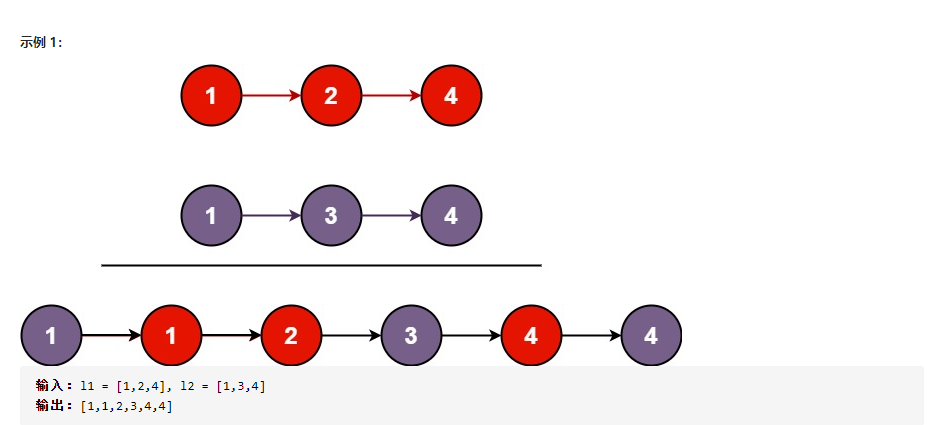

## 基础

### 两数之和（简单）

```
给定一个整数数组 nums 和一个整数目标值 target，请你在该数组中找出 和为目标值 的那 两个 整数，并返回它们的数组下标。
你可以假设每种输入只会对应一个答案。但是，数组中同一个元素在答案里不能重复出现。
你可以按任意顺序返回答案。

示例 1：
输入：nums = [2,7,11,15], target = 9
输出：[0,1]
解释：因为 nums[0] + nums[1] == 9 ，返回 [0, 1] 。

示例 2：
输入：nums = [3,2,4], target = 6
输出：[1,2]

示例 3：
输入：nums = [3,3], target = 6
输出：[0,1]

```

java 解法
```java
public int[] twoSum(int[] nums, int target) {
        int size = nums.length;
        //运用冒泡法的思想,暴力破解
        for(int i=0;i<size -1;i++){
            for(int j=i+1;j<size;j++){
                if(nums[i] + nums[j] == target){
                    return new int[]{i,j};
                }
            }
        }
        return null;
}

```

### 整数反转（简单）

```
给你一个 32 位的有符号整数 x ，返回将 x 中的数字部分反转后的结果。
如果反转后整数超过 32 位的有符号整数的范围 [−231,  231 − 1] ，就返回 0。
假设环境不允许存储 64 位整数（有符号或无符号）。

提示：
-2^31 <= x <= 2^31 - 1

示例 1：
输入：x = 123
输出：321

示例 2：
输入：x = -123
输出：-321

示例 3：
输入：x = 120
输出：21

示例 4：
输入：x = 0
输出：0
```

java 解法
```java
//两数相加
//注意点：反转后超过int的最大最小值，就返回0
//思路：int的最大数为2147483647，若反转则为7463847412，绝对超过了int的存储范围，所以反转后的数要用long存储
public int reverse(int x) {
    long rsum = 0;
    while(x!=0){
        int a = x % 10;
        rsum = rsum*10 + a;
        x = x/10;
    }
    if(rsum> Integer.MAX_VALUE || rsum < Integer.MIN_VALUE){
        return 0;
    }else{
        return (int)rsum;
    }
}
```


### 回文数（简单）

```
给你一个整数 x ，如果 x 是一个回文整数，返回 true ；否则，返回 false 。
回文数是指正序（从左向右）和倒序（从右向左）读都是一样的整数。例如，121 是回文，而 123 不是。

示例 1：
输入：x = 121
输出：true

示例 2：
输入：x = -121
输出：false
解释：从左向右读, 为 -121 。 从右向左读, 为 121- 。因此它不是一个回文数。

示例 3：
输入：x = 10
输出：false
解释：从右向左读, 为 01 。因此它不是一个回文数。

示例 4：
输入：x = -101
输出：false

```

java 解法
```java
public boolean isPalindrome(int x) {
        int a = x;
        //负数不是回文数
        if(x<0){
            return false;
        }
        //通过的逆序的方式来判断是否是回文数
        int r_num = 0;
        while(x!=0){
            r_num = r_num*10 + x%10;
            x = x/10;
        }
        if(r_num == a){
            return true;
        }else {
            return false;
        }
}
```

### 罗马数字转整数(简单)

```
罗马数字包含以下七种字符: I， V， X， L，C，D 和 M。

字符          数值
I             1
V             5
X             10
L             50
C             100
D             500
M             1000

例如， 罗马数字 2 写做 II ，即为两个并列的 1。12 写做 XII ，即为 X + II 。 27 写做  XXVII, 即为 XX + V + II 。

通常情况下，罗马数字中小的数字在大的数字的右边。但也存在特例，例如 4 不写做 IIII，而是 IV。数字 1 在数字 5 的左边，所表示的数等于大数 5 减小数 1 得到的数值 4 。同样地，数字 9 表示为 IX。这个特殊的规则只适用于以下六种情况：

I 可以放在 V (5) 和 X (10) 的左边，来表示 4 和 9。
X 可以放在 L (50) 和 C (100) 的左边，来表示 40 和 90。 
C 可以放在 D (500) 和 M (1000) 的左边，来表示 400 和 900。
给定一个罗马数字，将其转换成整数。输入确保在 1 到 3999 的范围内。

示例 1:
输入: "III"
输出: 3

示例 2:
输入: "IV"
输出: 4

示例 3:
输入: "IX"
输出: 9

示例 4:
输入: "LVIII"
输出: 58
解释: L = 50, V= 5, III = 3.

示例 5:
输入: "MCMXCIV"
输出: 1994
解释: M = 1000, CM = 900, XC = 90, IV = 4.

```

java解法：
```java
//思路：读取单个字符，转换为对应的数值，相加起来。
//pre_char记录当前字符的上一个字符是什么
// IV = (1+5)-2*1 = 4
// IX = (1+10)-2*1 = 9
// XL = (10 + 50) - 2*10 = 40
public int romanToInt(String s) {
    char[] chars = s.toCharArray();
    int sum = 0;
    char pre_char = '0';
    for(int i=0;i<chars.length;i++){
        switch (chars[i]){
            case 'I':
                sum += 1;
                pre_char = 'I';
                break;
            case 'V':
                sum += 5;
                //若V的左边字符是I
                if(pre_char == 'I'){
                    sum -= 2;
                }
                pre_char = 'V';
                break;
            case 'X':
                sum += 10;
                if(pre_char == 'I'){
                    sum -= 2;
                }
                pre_char = 'X';
                break;
            case 'L':
                sum += 50;
                if(pre_char == 'X'){
                    sum -= 20;
                }
                pre_char = 'L';
                break;
            case 'C':
                sum += 100;
                if(pre_char == 'X'){
                    sum -= 20;
                }
                pre_char = 'C';
                break;
            case 'D':
                sum += 500;
                if(pre_char == 'C'){
                    sum -= 200;
                }
                pre_char = 'D';
                break;
            case 'M':
                sum += 1000;
                if(pre_char == 'C'){
                    sum -= 200;
                }
                pre_char = 'M';
                break;
        }
    }
    return sum;
}
```

### 最长公共前缀（简单）

```
编写一个函数来查找字符串数组中的最长公共前缀。
如果不存在公共前缀，返回空字符串 ""。

示例 1：
输入：strs = ["flower","flow","flight"]
输出："fl"

示例 2：
输入：strs = ["dog","racecar","car"]
输出：""
解释：输入不存在公共前缀。
 

提示：
0 <= strs.length <= 200
0 <= strs[i].length <= 200
strs[i] 仅由小写英文字母组成

```

java解法
```java
public String longestCommonPrefix(String[] strs) {
        //解题思路：
        //取出第一个字符串的第1个字符，与其他字符串上的第1个字符比较，若都相等。则继续。并存入到一个临时变量中
        //取出第一个字符串的第n个字符，与其他字符串对应位置比较，若相等，则继续。若不相等，则之前比较的就是最长公共前缀
        //注意：若第一个字符串字符个数不是最小的，则容易出现读取其他字符串某个字符时，会出现读取越界异常。此时抛出异常，并退出循环即可。

        //第一个字符串字符个数
        char[] chars = strs[0].toCharArray();
        int length = chars.length;
        //数组中字符串个数
        int size = strs.length;
        //判断字符串对应位置的字符是否相等
        boolean isEquals = true;
        //存储最长公共前缀的变量
        StringBuffer sb = new StringBuffer();

        //循环。次数为第一个字符串的字符个数
        //若其他字符串的字符个数小于这个数，容器发送读取异常。需抛出异常
        for(int i=0;i<length;i++){
            //若出现下标越界异常则直接结束程序
            try{
                //取出第一个字符串的第n个字符
                char a = strs[0].charAt(i);

                //将字符a与其他字符串对应位置字符比较
                //不用自己比较自己，所以j=1
                for(int j=1;j<size;j++){
                    if(a != strs[j].charAt(i)){
                        isEquals = false;
                    }
                }
                //判断对应位置的字符是否全部相等。
                if(isEquals){
                    sb.append(a);
                }
            }catch (Exception e){
                break;
            }
        }
        return sb.toString();
    }

```

### 有效的括号（简单）

```
给定一个只包括 '('，')'，'{'，'}'，'['，']' 的字符串 s ，判断字符串是否有效。

有效字符串需满足：

左括号必须用相同类型的右括号闭合。
左括号必须以正确的顺序闭合。
 
示例 1：
输入：s = "()"
输出：true

示例 2：
输入：s = "()[]{}"
输出：true

示例 3：
输入：s = "(]"
输出：false

示例 4：
输入：s = "([)]"
输出：false

示例 5：
输入：s = "{[]}"
输出：true
 

提示：
1 <= s.length <= 104
s 仅由括号 '()[]{}' 组成
```


java解法1
```java
public boolean isValid(String s) {
        //解题思路，通过栈来存储这个字符串
        //遇到左括号，则把该左括号入栈，遇到右括号，则判断栈顶元素是否是对应的左括号。若对应，则栈顶元素出栈。若不对应则把右括号入栈
        //字符串有效的条件：1.读取完字符串后栈是否为空
        //注意点：每次读取栈顶元素时，需要先判断栈是否为空

        //创建栈
        Stack stack = new Stack();
        //将字符串转换为字符数组
        char[] chars = s.toCharArray();
        //存储栈顶字符
        char a;
        //循环
        for(int i=0;i<chars.length;i++){
            switch (chars[i]){
                case '(':
                    stack.push('(');
                    break;
                case '[':
                    stack.push('[');
                    break;
                case '{':
                    stack.push('{');
                    break;
                case ')':
                    //判断栈是否为空
                    if(!stack.isEmpty()){
                        a = (char) stack.peek();
                        //判断栈顶元素是否为对应的左括号
                        if(a == '('){
                            stack.pop();
                        }else{
                            stack.push(')');
                        }
                    }else{
                        //若栈为空，则直接入栈
                        stack.push(')');
                    }
                    break;
                case ']':
                    if(!stack.isEmpty()){
                        a = (char) stack.peek();
                        if(a == '['){
                            stack.pop();
                        }else{
                            stack.push(']');
                        }
                    }else{
                        stack.push(']');
                    }
                    break;
                case '}':
                    if(!stack.isEmpty()){
                        a = (char) stack.peek();
                        if(a == '{'){
                            stack.pop();
                        }else{
                            stack.push('}');
                        }
                    }else{
                        stack.push('}');
                    }
                    break;
            }
        }
        //判断字符串是否有效
        if(stack.isEmpty()){
            return true;
        }else{
            return false;
        }
    }
```

java解法2
```java
public boolean isValid(String s) {
        //解题思路，通过栈来存储这个字符串
        //遇到左括号，则把该左括号入栈，遇到右括号，则判断栈顶元素是否是对应的左括号。若对应，则栈顶元素出栈。若不对应则字符串无效
        //字符串有效的条件：1.读取右括号时栈顶元素是否为对应的左括号。2，读取完字符串后栈是否为空
        //注意点：每次读取栈顶元素时，需要先判断栈是否为空

        //创建栈
        Stack stack = new Stack();
        //将字符串转换为字符数组
        char[] chars = s.toCharArray();
        //判断字符串是否有效
        boolean isOk = true;
        //存储栈顶字符
        char a;
        //循环
        for(int i=0;i<chars.length;i++){
            switch (chars[i]){
                case '(':
                    stack.push('(');
                    break;
                case '[':
                    stack.push('[');
                    break;
                case '{':
                    stack.push('{');
                    break;
                case ')':
                    //判断栈是否为空
                    if(!stack.isEmpty()){
                        a = (char) stack.peek();
                        //判断栈顶元素是否为对应的左括号
                        if(a == '('){
                            stack.pop();
                        }else{
                            isOk = false;
                        }
                    }else{
                        isOk = false;
                    }
                    break;
                case ']':
                    if(!stack.isEmpty()){
                        a = (char) stack.peek();
                        if(a == '['){
                            stack.pop();
                        }else{
                            isOk = false;
                        }
                    }else{
                        isOk = false;
                    }
                    break;
                case '}':
                    if(!stack.isEmpty()){
                        a = (char) stack.peek();
                        if(a == '{'){
                            stack.pop();
                        }else{
                            isOk = false;
                        }
                    }else{
                        isOk = false;
                    }
                    break;
            }
        }
        //判断字符串是否有效。先判断栈是否为空
        if(stack.isEmpty()){
            if(isOk){
                return true;
            }else{
                return false;
            }
        }else{
            return false;
        }
    }

```

### 删除有序数组中的重复项(简单)

```
给你一个有序数组 nums ，请你 原地 删除重复出现的元素，使每个元素 只出现一次 ，返回删除后数组的新长度。

不要使用额外的数组空间，你必须在 原地 修改输入数组。

示例 1：
输入：nums = [1,1,2]
输出：2, nums = [1,2]
解释：函数应该返回新的长度 2 ，并且原数组 nums 的前两个元素被修改为 1, 2 。不需要考虑数组中超出新长度后面的元素。

示例 2：
输入：nums = [0,0,1,1,1,2,2,3,3,4]
输出：5, nums = [0,1,2,3,4]
解释：函数应该返回新的长度 5 ， 并且原数组 nums 的前五个元素被修改为 0, 1, 2, 3, 4 。不需要考虑数组中超出新长度后面的元素。
 

提示：
0 <= nums.length <= 3 * 104
-104 <= nums[i] <= 104
nums 已按升序排列

```

java解法
```java
public class test1 {

    public static void main(String[] args){
        Scanner input=new Scanner(System.in);
        test1 s = new test1();
        int[] strs = {0,0,1,1,1,2,2,3,3,4};
        System.out.println(s.removeDuplicates(strs));
    }

    public int removeDuplicates(int[] nums) {
        //由于是有序数组，元素依此递增。
        //通过快慢指针来实现，快指针用于遍历该数组，慢指针指向最后一个索引，即新数组的长度
        //当慢指针与快指针指向的值相等时，慢指针+1，并且慢指针指向的值改为快指针指向的值
        int slow=0;
        for (int fast=0;fast<nums.length;fast++){
            if(nums[fast] != nums[slow]) {
                slow ++;
                nums[slow] = nums[fast];
            }
        }
        return slow+1;
    }
}

```


### 移除元素（简单）

```
给你一个数组 nums 和一个值 val，你需要 原地 移除所有数值等于 val 的元素，并返回移除后数组的新长度。
不要使用额外的数组空间，你必须仅使用 O(1) 额外空间并 原地 修改输入数组。
元素的顺序可以改变。你不需要考虑数组中超出新长度后面的元素。

示例 1：
输入：nums = [3,2,2,3], val = 3
输出：2, nums = [2,2]
解释：函数应该返回新的长度 2, 并且 nums 中的前两个元素均为 2。你不需要考虑数组中超出新长度后面的元素。例如，函数返回的新长度为 2 ，而 nums = [2,2,3,3] 或 nums = [2,2,0,0]，也会被视作正确答案。

示例 2：
输入：nums = [0,1,2,2,3,0,4,2], val = 2
输出：5, nums = [0,1,4,0,3]
解释：函数应该返回新的长度 5, 并且 nums 中的前五个元素为 0, 1, 3, 0, 4。注意这五个元素可为任意顺序。你不需要考虑数组中超出新长度后面的元素。

提示：
0 <= nums.length <= 100
0 <= nums[i] <= 50
0 <= val <= 100

```

java解法
```java
public class test1 {
    public static void main(String[] args){
        Scanner input=new Scanner(System.in);
        test1 s = new test1();
        int[] strs = {0,1,2,2,3,0,4,2};
        System.out.println(s.removeElement(strs,2));
    }

    public int removeElement(int[] nums, int val) {
        //通过快慢指针来实现，快指针用于遍历该数组，慢指针表示新数组的长度
        //当快指针指向的值与值val不相等时，将此时快指针指向的值赋值给慢指针所指的元素.并且慢指针自身前进一位
        int slow=0;
        for (int fast=0;fast<nums.length;fast++){
            if(nums[fast] != val){
                nums[slow] = nums[fast];
                slow ++;
            }
        }
        return slow;
    }

}
```


### 实现strStr(),母串和子串的匹配问题（简单）

```
实现 strStr() 函数。
给你两个字符串 haystack 和 needle ，请你在 haystack 字符串中找出 needle 字符串出现的第一个位置（下标从 0 开始）。如果不存在，则返回  -1 。

说明：
当 needle 是空字符串时，我们应当返回什么值呢？这是一个在面试中很好的问题。
对于本题而言，当 needle 是空字符串时我们应当返回 0 。这与 C 语言的 strstr() 以及 Java 的 indexOf() 定义相符。

示例 1：
输入：haystack = "hello", needle = "ll"
输出：2

示例 2：
输入：haystack = "aaaaa", needle = "bba"
输出：-1

示例 3：
输入：haystack = "", needle = ""
输出：0

提示：
0 <= haystack.length, needle.length <= 5 * 104
haystack 和 needle 仅由小写英文字符组成

```

java解法
```java
public class test1 {

    public static void main(String[] args){
        Scanner input=new Scanner(System.in);
        test1 s = new test1();

        String haystack = "hello";
        String needle = "ll";
        System.out.println(s.strStr(haystack,needle));
    }

    public int strStr(String haystack, String needle) {
        //思路：母串的每个字符都与子串的第一个字符进行比较。
        // 若相同，则从该字符索引处开始逐个与子串比较，若有一处不同，则母串与子串不匹配
        // 注意：由于母串能包含子串，所以遍历母串的索引从0 到 （母串长度-子串长度）为止。后面不用再次比较了，因为长度不够容纳子串了
        int a = haystack.length();
        int b = needle.length();
        //若子串长度为0，返回0
        if(b==0){
            return 0;
        }
        //若子串长度大于母串，则表示母串内无子串。返回-1
        if(b>a){
            return -1;
        }
        int index = -1;
        for(int i=0;i<=a-b;i++){
            if(haystack.charAt(i) == needle.charAt(0)){
                boolean isHave = true;
                for(int j=0;j<b;j++){
                    if(haystack.charAt(i+j) != needle.charAt(j)){
                        isHave = false;
                        break;
                    }
                }
                if(isHave){
                    index = i;
                    return index;
                }
            }
        }
        return index;
    }
}
```

### 搜索插入位置

```
给定一个排序数组和一个目标值，在数组中找到目标值，并返回其索引。
如果目标值不存在于数组中，返回它将会被按顺序插入的位置。

你可以假设数组中无重复元素。

示例 1:
输入: [1,3,5,6], 5
输出: 2

示例 2:
输入: [1,3,5,6], 2
输出: 1

示例 3:
输入: [1,3,5,6], 7
输出: 4

示例 4:
输入: [1,3,5,6], 0
输出: 0

```

java解法
```java
public int searchInsert(int[] nums, int target) {
    //排序数组，元素从小到大
    //遍历该数组，遇到与目标值相等的元素，返回索引。
    //遇到小于目标值的继续遍历，大于目标值的元素，返回该处索引-1
    //若目标值小于数组中全部元素，则将其插入到数组第一个位置，返回索引0
    //若目标值大于数组中全部元素，则将其新增到数组末尾，返回最后一个位置的索引

    int index=0;
    //若目标值小于数组中全部元素
    if(target<=nums[0]){
        return 0;
    }
    //若目标值大于数组中全部元素
    if(target>nums[nums.length-1]){
        return nums.length;
    }
    //其他情况
    for(int i=0;i<nums.length;i++){
        if(nums[i] >= target){
            index = i;
            break;
        }
    }
    return index;
}

```

### 最大子序和（简单）

```
给定一个整数数组 nums ，找到一个具有最大和的连续子数组（子数组最少包含一个元素），返回其最大和。

示例 1：
输入：nums = [-2,1,-3,4,-1,2,1,-5,4]
输出：6
解释：连续子数组 [4,-1,2,1] 的和最大，为 6 。

示例 2：
输入：nums = [1]
输出：1

示例 3：
输入：nums = [0]
输出：0

示例 4：
输入：nums = [-1]
输出：-1

示例 5：
输入：nums = [-100000]
输出：-100000

提示：
1 <= nums.length <= 3 * 104
-105 <= nums[i] <= 105

```

java解法
```java


```


### 最后一个单词的长度（简单）

```
给你一个字符串 s，由若干单词组成，单词之间用空格隔开。返回字符串中最后一个单词的长度。如果不存在最后一个单词，请返回 0 。
单词 是指仅由字母组成、不包含任何空格字符的最大子字符串。

示例 1：
输入：s = "Hello World"
输出：5

示例 2：
输入：s = " "
输出：0
 
提示：
1 <= s.length <= 104
s 仅有英文字母和空格 ' ' 组成
```

java解法
```java
public int lengthOfLastWord(String s) {
        //思路：1. 从后往前遍历，遇到单词就+1，遇到空格就退出循环
        //注意：若最后一次字符为空格的时候，不退出循环，继续遍历

        int last_word_size = 0;

        if(s.length() == 0){
            return 0;
        }

        for(int i=s.length()-1;i>=0;i--){
            if(s.charAt(i) != ' '){
                last_word_size ++;
            }else{
                //读取到空格
                if(last_word_size != 0){
                    break;
                }else{
                    //若最后一次字符为空格的时候，不退出循环，继续遍历
                }
            }
        }
        return last_word_size;
    }
```


## 链表

### 合并两个有序链表（简单）



```
将两个升序链表合并为一个新的升序链表并返回。新链表是通过拼接给定的两个链表的所有节点组成的。 

输入：l1 = [1,2,4], l2 = [1,3,4]
输出：[1,1,2,3,4,4]

输入：l1 = [], l2 = []
输出：[]

输入：l1 = [], l2 = [0]
输出：[0]

提示：
两个链表的节点数目范围是 [0, 50]
-100 <= Node.val <= 100
l1 和 l2 均按 非递减顺序 排列

```

java解法
```java
public ListNode mergeTwoLists(ListNode l1, ListNode l2) {
    //思路：创建一个新链表，每次比较l1和l2链表中小的那个，把值取出来存入新链表中

    // 头指针head，索引指针p
    ListNode head = null;
    ListNode p = new ListNode();
    head = p;
    if(l1 == null){
        return l2;
    }else if(l2 == null){
        return l1;
    }
    //创建新的节点，把值存入节点中
    //把新节点设置为链表的下一个节点
    //索引指针p指向新节点
    while(l1 != null && l2 !=null){
        ListNode aNode = new ListNode();
        if(l1.val <= l2.val){
            aNode.val = l1.val;
            l1 = l1.next;
        }else{
            aNode.val = l2.val;
            l2 = l2.next;
        }
        p.next  = aNode;
        p = p.next;
    }
    //当l1或l2链表其中一个为空时，就把另一个链表直接拼接在新链表后面
    if(l1 == null){
        p.next = l2;
    }else{
        p.next = l1;
    }
    //新链表的第一个节点没存值，所以返回新链表的第二个节点
    return head.next;
}

```