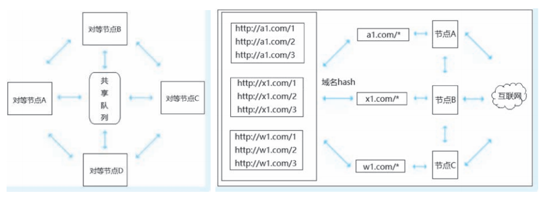

[toc]

# 爬虫笔记01

参考书籍：爬虫逆向进阶实战[李玺/著]

# 爬虫发展史

在大数据时代下，传统的数据采集方法已经无法满足高质量研究的需求，此时网络爬虫应运而生。相对于传统的数据采集方法，网络爬虫通常能在有限的资源下保障数据的质量和数量。 

目前爬虫技术逐渐成为一套完整的系统性工程技术，涉及的知识面广，平台多，技术越来越多样化，对抗性也日益显著。

首先从网页数据采集开始，爬虫从最开始的单一化请求变成分布式采集。网站为了反爬虫，出现了人机验证。比如滑块、 图文、 点选等验证方法。爬虫为了对抗，出现了很多自动化工具， 比如 Selenium、Puppeteer 等。 同时网站为了保证API数据接口不被非法调用， 出现了以 JS 为主的混淆加密和签名技术。不过爬虫也可以使用 Nodejs 或者 Chrome 来加载原生代码进行模拟。

随着爬虫与反爬虫之间的不断对抗， 导致很多大厂会把比较重要的数据只会在移动端的 App 展示，甚至部分厂家只有移动端。 因为 App 逆向技术本身具有一定的灰度和风险， 在市面上并不被推广， 而且逆向技术在目前依旧有比较高的门槛。 

以 Android 为例， 从之前的 Java 层混淆加密已经下沉到了 C/C++ 的 Native 层， Native层 中通常会存在混杂代码、 花指令、 Ollvm 以及各种安全公司做的壳。 为了在不改变应用本身的前提下获取App 数据， 以 Xposed 和 Frida 为首的 Hook 工具的应用日渐增长， 另外还有一些 App 自动化测试工具也开始被使用起来， 比如 Appnium、 Airtest， 还有无障碍工具 Autojs 等。

除了 Web 端到移动端的数据载体变化外， 还有数据类型的增加，比如从单一的文本数据变成了图片、短视频等， 还有数据通信协议的变化， 从之前的 HTTP / HTTPS 变成了 SPDY、 Protobuf 以及一些私有协议。

各种各样的反爬虫方式导致了爬虫工程师所需的技术栈越来越广泛。

# 爬虫技术方向（架构和逆向）

现阶段高级爬虫工程师主要分为架构和逆向两种技术方向。

- 架构方向通常侧重于设计和构建高效的爬虫系统，处理数据并存储、分布式爬取等技术挑战。
- 逆向方向则涉及破解网站的防护机制，分析动态内容生成等，要求对网络协议和浏览器行为有深入理解。

> 架构方向

架构方向包括设计高效的爬虫架构、优化数据存储和处理流程。你需要处理分布式系统中的协调和负载均衡问题，确保系统的可扩展性和稳定性。

关键技术如下。
1. 系统设计与架构：
    - 分布式爬取：设计分布式爬虫架构，以应对大规模数据采集需求。这包括爬虫调度、任务分配和数据收集。
    - 负载均衡：确保系统能够处理大量请求并分散负载，以避免单点故障和性能瓶颈。
    - 高可用性与容错：实现系统的高可用性和容错机制，以应对爬虫节点的故障和网络问题。
2. 数据存储与管理：
    - 存储方案：选择合适的存储方案，包括关系型数据库（如MySQL、PostgreSQL）和非关系型数据库（如MongoDB、Elasticsearch）。
    - 数据清洗与处理：开发数据清洗和预处理流程，处理抓取到的数据，确保数据质量和一致性。
3. 性能优化：
    - 爬取速度：优化爬取速度，包括请求并发、连接池和延迟控制。
    - 内存与资源管理：有效管理系统资源，防止内存泄漏和资源浪费。
4. 扩展与维护：
    - 插件与模块化：设计可扩展的系统架构，支持功能模块的扩展和插件的添加。
    - 监控与日志：实施系统监控，记录和分析日志，以便跟踪问题和优化性能。

> 逆向方向

逆向方向则聚焦于分析和绕过防爬虫技术，如验证码、动态加载内容和IP限制。需要深入了解网络协议、浏览器内核、JavaScript执行机制，并使用逆向工程工具进行调试和分析。

关键技术如下。
1. 防爬虫技术分析：
    - 验证码绕过：研究和破解不同类型的验证码技术，包括图像验证码、短信验证码等。
    - 动态内容分析：分析JavaScript生成的动态内容，使用工具（如Selenium、Puppeteer）抓取动态加载的数据。
2. 逆向工程：
    - 网络协议分析：分析HTTP/HTTPS协议和其他网络协议，理解数据传输方式和接口设计。
    - 浏览器调试：使用浏览器的开发者工具（如Chrome DevTools）调试和分析网页的网络请求和JavaScript执行。
3. 破解技术：
    - 反爬虫机制识别：识别和绕过各种反爬虫机制，如IP封禁、流量限制、用户代理检测等。
    - 数据抓取：使用逆向工程技术抓取被保护的数据，包括API接口的逆向和数据解密。
4. 工具与技术：
    - 逆向工具：熟悉使用工具如Burp Suite、Fiddler、Charles等进行网络流量分析和请求伪造。
    - 自动化测试：使用自动化测试工具对网站进行压力测试，评估其防护能力。


# 爬虫架构方向

## 爬虫架构

### 爬虫基本流程

一个爬虫任务的基本流程由四部分组成，确定采集目标、发起请求、数据解析、数据存储。

1. 确定采集目标是指开发者需要提前准备好目标URL 或者通过某种规则去获取目标 URL。
2. 发起请求是指通过某种协议对目标 URL 进行请求， 一般在请求成功后都会得到服务端的响应内容。
3. 数据解析是指对服务端的响应数据进行解析。从而获得想要的数据。
4. 数据存储是指将得到的数据进行存储。

### 分布式爬虫的架构

分布式爬虫是指多台服务器或者多个工作节点对爬虫任务的同时处理，可以极大程度提升爬虫采集数据的效率，并具有良好的稳定性和可扩展性。 

分布式爬虫一般需要配合消息队列使用， 目前使用比较多的是结合 Redis 数据库共享队列,RabbitMQ 消息队列等。

目前常用的两种分布式爬虫架构。主从分布式，对等分布式。

> 主从分布式

主从分布式是目前使用最多的爬虫分布式架构，采用 master-slaver 体系， 一个 master
多个 slaver。 
- master 端是主控制节点，负责任务管理调度分发。
- slaver 端是工作子节点，负责爬虫采集、解析以及存储任务。

如图所示


Python的分布式爬虫框架 Scrapy-Redis， Java中的 WebMag 框架，GO 的 Zerg 框架都是使用主从分布式的架构。

> 对等分布式

对等分布式是指分布式系统中的所有工作节点间没有主从之分， 虽然在相同的环境下具有相同的功能。但是既没有控制中心主节点，也没有被调度的子节点，组成分布式系统的所有节点都是对等的。

在爬虫架构中的具体体现是每个对等节点根据特定规则主动从共享任务队列取出自己负责的采集任务，然后开始负责各自的采集工作， 各个对等节点互不干扰。

这里的特定规则在对等分布式爬虫中也叫作取模算法，取模算法可以自己实现。例如一个任务队列中有很多的URL，每个URL中都有特殊标识 flag1、 flag2、 flag3、 flag4。 此时可以根据规则将所有的 URL 进行 hash 分类编号， 每个对等节点根据取模算法取出自己负责的种子 URL， 如果取到了不属于自己的种子， 则传递给另一个对等节点。

如图所示


> 主从分布和对等分布的优缺点

主从式分布爬虫对任务分配比较合理， 可以有效利用采集节点的资源， 但是由于只有一个 master 端的限制， 当任务队列非常庞大时， 可能会影响 master 端的任务调度， 或者在 master 端出现异常时， 会导致整个爬虫系统崩溃。

对等分布式爬虫虽然不会牵一发而动全身， 一个采集节点宕机后， 其他节点依旧正常工作， 但是由于任务分配的限制， 在某节点宕机或者新加采集节点时， 每台抓取服务器的取模算法都需要进行更新。

# Python 爬虫技术

相比其他开发语言，Python 灵活的脚本特性和丰富的开源库能为爬虫开发者节省大量时间和人力。

## Scrapy 框架

Scrapy 目前应该是使用人数最多，扩展和插件最为丰富的 Python 爬虫框架。 

Scrapy 是基于 twisted 的多线程爬虫框架。Scrapy 在普通爬虫框架的基础上支持下载解析中间件、 断点续爬、 信号回调、 异常捕获、 深度广度采集策略等功能。

twisted 是异步网络请求框架，Scrapy 在请求时采用的是异步请求策略， 而在处理时使用的是多线程处理模式， 可以说 Scrapy 是单线程，也可以说是多线程的。

> Scrapy的架构

Scrapy 的核心处理流程由五大模块构成，分别是调度器（Scheduler）、下载器（Downloader）、爬虫（Spiders）、实体管道（Item Pipeline） 和引擎（Scrapy Engine）。

- 引擎是整个Scrapy框架的核心。它用来控制调试器、下载器、爬虫，相当于计算机的CPU。
- 调度器相当于任务中心，相当于一个存放 URL 的队列，由它来决定采集目标，同时支持去重URL。
- 下载器就是根据目标URL从网络上抓取资源，下载器是基于在 twisted 异步框架上的，保障采效率和稳定性。
- 爬虫是指从特定的网页中提取自己需要的信息。

> Scrapy的工作流程

1. 将目标URL传递给 Scrapy 引擎。
2. Scrapy 引擎将网址URL传给下载中间件。
3. 下载中间件将网址给下载器。
4. 下载器向网址发送 request 请求进行下载。
5. 网址接收请求，将响应返回给下载器。
6. 下载器将收到的响应返回给下载中间件。
7. 下载中间件与 Scrapy 引擎通信。
8. Scrapy 将 response 响应信息传递给爬虫中间件。
9. 爬虫中间件将响应传递给对应的爬虫进行处理。
10. 爬虫处理之后，会提取出数据和新的请求信息，将处理的信息传递给爬虫中间件。
11. 爬虫中间件将处理后的信息传递给 Scrapy 引擎。
12. Scrapy 接收到信息之后，会将项目实体传递给实体管道进行进一步处理，同时将新的信息传递给调度器。
13. 随后再重复执行 1～12 步， 一直到调度器中没有URL或异常退出为止。

## Scrapy-Redis 框架

Scrapy-Redis 是一个基于 Redis 的 Scrapy 组件，用于快速实现 Scrapy 项目的分布式部署， 通过 Scrapy-Redis 可以快速搭建一个分布式爬虫。

## Crawlab 框架

Crawlab 是基于 Golang 的分布式网络爬虫管理平台。可以运行任何语言和框架，精美的 UI 界面，支持分布式爬虫、节点管理、爬虫管理、任务管理、定时任务、结果导出、数据统计、消息通知、可配置爬虫、在线编辑代码等功能。

# 爬虫逆向方向

## Web JS 逆向

在Web开发中，后端负责数据，前端负责页面。在这种前后端分离的开发方式中，以API接口为标准来进行前端和后端的联合。

网站为了保证API接口在调用时数据的安全性，会对API接口进行各种各样的反爬虫机制。例如请求签名、身份认证、动态 Cookie、参数加密等机制。这些反爬虫机制通常利用AES,RSA等加密方式，并且往往是通过网站的 JavaScript 代码去实现的。 

为了能够破解这些反爬虫机制，从而能够从API接口上爬取数据。我们需要去调试，去分析网站的 JavaScript 的调用逻辑、调用关系来弄清楚网站反爬虫的实现方式。并利用这种实现方式，从而破解这些反爬虫机制。 这个过程称之为 JS 逆向。

<font color="red">目前的常用逆向方式， 一种是解析网站中 JS 的调用逻辑来还原加密代码。另一种是补环境 即Copy网站源码 从而在程序中模拟浏览器环境。</font>

## 加密参数的定位方法

想要在网站的JS代码中找到加密参数的生成过程。 就必须先在JS代码中找到加密参数的位置， 然后通过 debug 的方式来一步一步观察加密参数的生成过程。

下面是几种加密参数的定位方法。

### 定位方法1 搜索

打开控制台，通过快捷键 Ctrl+F 打开搜索框。在控制台的不同位置，使用Ctrl+F会打开不同的搜索区域， 有全局搜索、页面搜索等。

如图所示


另外关于搜索也是有一定技巧的， 如果加密参数的关键词是 signature， 可以直接全局搜索 signature，搜索不到可以尝试搜索 sign 或者搜索API接口的名称。

### 定位方法2 堆栈调试

对于AJAX请求，即XHR请求的时候，我们可以在控制台中的网络中查看该请求堆栈路径。

具体使用方式是先找到目标接口， 然后进入 Initiator， 单击第一个 Request call stack 参数，进入 Js 文件后， 在跳转行上打上断点， 然后刷新页面等待调试即可。


### 定位方法3 控制台调试

在断点到某一位置时， 可以通过console.log(xxx) 输出此时的参数来查看状态
和属性，console.log(xxx) 方法在后面的参数还原中也很重要。

### 定位方法4 监听XHR

XHR是 XMLHttpRequest 的简称， 通过监听 XHR 的断点，可以匹配 URL 中 params 参数的触发点和调用堆栈， 另外 post 请求中 From Data 的参数也可以用 XHR 来拦截。

假如某个API接口(`http://xxx:8080/aaa/bbb/ccc`)的请求参数是加密参数。如果想要找到加密参数，可以先找到该API接口的调用位置。

我们可以通过XHR断点的方式来监听这个XHR接口
1. 打开F12开发者工具，找到源代码选项卡。
2. 添加XHR断点。将API接口的路径输入进去。
3. 刷新页面，让浏览器重新调用该API接口即可。
4. 之后程序会断点进入到该API接口调用的JS代码。

如图所示。


### 定位方法5 添加代码片段（暂无）

在控制台中添加代码片来完成 Js 代码注入， 也是一种定位参数的方式。

使用方法：打开控制台，单击 Sources， 然后单击左侧的 Snippets， 新建一个 Script Snippet， 就可以在
空白区域编辑 Js 代码了。

### 定位方法6 注入Hook （暂无）

暂无

## 常见的代码压缩和代码混淆

随着 WEB 技术的发展， Js 文件的也日渐增大， 为了加快 Js 文件的传输速度并提高接口的安全性，出现了很
多的压缩工具和混淆加密工具。

代码混淆的本质是对代码中的标识符和逻辑结构的调整， 从而达到代码不可读不可调试的目的。

常用的代码混淆方法有 字符串变量名混淆， 比如把字符串转换为_0x， 把变量重命名等。代码逻辑结构的混淆包括控制流平坦化、虚假控制流和指令替换等方式。 

代码加密主要有通过 eval 方法去执行字符串函数、 通过 escape 等方法编码字符串、通过转义字符加密代码、自定义加解密方法( RSA、 Base64、 AES、 MD5 等)， 或者通过一些开源工具进行加密。

另外目前市面上比较常见的混淆还有 ob 混淆（obfuscator），特征是定义数组、数组位移。 不仅 Js 的变量名混淆， 运行逻辑等也高度混淆， 应对这种混淆可以使用已有的工具 ob-decrypt 或者 AST 解混淆或者使用第三方提供的反混淆接口。 

大家平时可以多准备一些工具，在遇到无法识别的 Js 时，可以直接使用工具来反混淆和解密，当然逆向工作本身就很看运气。

### eval 混淆

eval 是浏览器 v8 引擎定义的一个方法， 该方法具有执行 Js 代码的能力。 eval(string) 方法中传入的是字符串， 字符串是要执行的 JavaScript 表达式或 JavaScript语句。

例如先定义一个方法a(),然后通过浏览器的内置方法btoa()方法对方法a()的文本进行base64转换。这样就将方法a()进行了混淆。

之后再用atob()将base64解码，然后通过eval方法执行解码后的 js 代码。

```js
// btoa对方法进行base64转换
btoa("function a(){console.log('aaa')}")
// 'ZnVuY3Rpb24gYSgpe2NvbnNvbGUubG9nKCdhYWEnKX0='
atob('ZnVuY3Rpb24gYSgpe2NvbnNvbGUubG9nKCdhYWEnKX0=')
// "function a(){console.log('aaa')}"
eval(atob('ZnVuY3Rpb24gYSgpe2NvbnNvbGUubG9nKCdhYWEnKX0='))
```

上面就相当于eval混淆的实现。当然也可以把 btoa方法 换成其他的编码、加密方法。或者也可以将内层的eval方法和js文本一起加密。

### aa和jj混淆

JavaScript 语言支持 unicode 编码，也就是说支持全球国家的标准语言。我们可以通过定义定义相似的变量，例如变量l,变量I 两个变量看起来相似。通过这种不同却相似的变量字符进行不断的组合搭配，可以衍生出很多混淆变量名。这就是aa混淆。

aa 混淆（aaencode/aadecode） 就是利用了unicode 编码的特性进行混淆，主要是把 Js 代码转成相似的字符，或常用的网络表情。 

这里提供一个可以进行aa 混淆的在线加密网站。`https://www.sojson.com/aaencode.html`

jj 混淆（jjencode/jjdecode） 和 aa混淆差不多。主要是将 Js 代码转换成只有符号的字符串。 代码中会有很多的$符号。

关于这种混淆代码的解码方法，一般直接复制到控制台运行或者用解码工具进行转换，如果运行失败，就需要按分号分割语句，逐行调试分析源码。

### Jsfuck 混淆

Jsfuck 混淆使用了6个不同的字符"[]！（）+" 进行代码混淆。 比如 false 可以表示为！[] , true 可以表示为！！[]， Nan表示为+[！[]]等。 我们可以利用在线工具对代码进行 Jsfuck 混淆。

在线Jsfuck 混淆工具网址: https://www.sojson.com/jsfuck.html
在线Jsfuck 反混淆工具网址：http://codertab.com/JsUnFuck

### OLLVM 混淆

OLLVM 混淆有三大功能：控制流平坦化，虚假控制流，指令替换。

> 控制流平坦化

控制流平坦化是一种代码保护方式，它会降低代码运行速度，增加代码量。控制流平坦化的主要思想是以基本块为单位，通过一个主分发器来控制程序的执行流程。

如图所示，一个常见的 if-else 分支结构的程序可以是这样的。


经过控制流平坦化之后，混淆后的代码程序会形成了一个相当平坦的流程图。如下图所示。


控制流平坦化在代码上体现出来可以简要地理解为 while+switch 的结构， 其中的主分发器可以理解为switch。 这样的好处是可以模糊基本块之间的前后关系，增加程序逆向的难度。

> 虚假控制流

虚假控制流是把原来的一个基本块膨胀成若干个虚假的基本块与该基本块的比较判断结构， 通过一个控制变量保证控制流能运行到原来的那个基本块，其他基本块都是虚假的。 这种混淆方式的代码膨胀率还是很高的。

> 指令替换

指令替换是对标准二进制运算（比如加、减、位运算）使用更复杂的指令序列进行功能等价替换，当存在多种等价指令序列时，随机选择一种。

### soJson 加密解密逆向在线网址

soJson 是一个加密工具，是一个集合了所有高级反调试和反逆向于一身的加密工具。

soJson在线工具网址：https://www.jsjiami.com/sojson.v5.html


## 常见的编码和加密方式

常见的编码有 base64、unicode、urlencode 编码， 加密有MD5、SHA1、HMAC、AES、DES、RSA等。

下面简单介绍一下常见的编码加密和其在 Js 代码中的特征， 同时附上 Js 和 Python 实现加密的方法。

### base64 编码

base64 是一种基于 64 个可打印 ASCII 字符对任意字节数据进行编码的算法，其在编码后具有一定意义的加密作用。

浏览器的Js 环境中提供了原生的 base64 编码、解码方法，方法名就是 btoa 和 atob。

但是本地的JS 环境是没有btoa 和 atob方法的。因此在本地js环境中实现base64 编码、解码需要其他方式。

```py
# python 语言的 base64 编码、解码方式
import base64
print(base64. b64encode('lx'.encode())) # lx字符串的base64编码就是字符串bHg=
print(base64.b64decode("bHg=".encode()))
```

### unicode编码和urlencode编码

unicode 和 urlencode 比较简单。

unicode 是计算机中字符集编码的一项业界标准， 被称为统一码、万国码。unicode编码的表现形式一般以"\u"或"&#" 开头。 

urlencode 是 URL 编码， 也称作百分号编码， 用于把 URL 中的符号进行转换。

### MD5 加密算法

MD5 消息摘要算法（MD5 Message-Digest Algorithm），一种被广泛使用的密码散列函数，可以产生出一个 128 位（16 字节）的散列值， 用于确保信息传输完整一致。 

MD5 加密算法是不可逆的，所以解密一般都是通过暴力穷举方法，以及网站的接口实现解密。

当我们在 Js 逆向分析时，如果加密参数是长度为 32 位的字符， 那么这个加密参数可能是通过MD5加密算法进行加密的。我们可以在JS代码中全局搜索 MD5 相关关键词来检索加密位置。

这是js的 crypto-js 加密库进行 MD5 算法实现。
```js
const CryptoJs = require ("crypto-js");
// MD5 加密
let password = "lx123";
let encPwd = CryptoJs.MD5(password).toString();
console.log(encPwd);
```

这是python的 MD5 算法实现。
```js
import hashlib
m =hashlib.md5()
m.update(str.encode("utf8"))
m.hexdigest()
```


## 补环境

补环境逆向方式，主要是指将浏览器环境移植到 Node 环境中，Node Js 采用的内核也为 V8 引擎，同时由于 Node环境 没有界面渲染， 因此在浏览器中可使用的例如 window、 navigator、 dom 等操作在 Node环境 中是不存在的， 所以对于 Node Js 的环境搭建和浏览器环境补齐也是 Js 逆向需要掌握的。

### 浏览器窗口对象的属性

浏览器窗口对象 window 的常见属性和方法。因为浏览器中的很多JS代码都会涉及到 窗口对象 window 的这些属性和方法。因此我们在补环境前， 需要了解 window 对象的常用属性和方法。

1. Window 窗口对象表示浏览器当前打开的窗口，常用属性和方法如下。
```
document属性         返回 Document 对象
history属性          返回 History 对象
location属性         返回 Location 对象
navigator属性        返回 Navigator 对象
screen属性           返回 Screen 对象
scrollBy()方法       按照指定的像素值来滚动内容
scrollTo()方法       把内容滚动到指定的坐标
setInterval()方法    定时器
setTimeout()方法     延时器
alert()方法          弹出警告框
prompt()方法         弹出对话框
open()方法           打开新页面
close()方法          关闭页面
```

2. Document 文档对象，表示浏览器当前显示的 HTML 文档，常用属性和方法如下。
```
body属性                        返回body元素
cookie属性                      返回当前cookie
domain属性                      文档域名
lastModified属性                文档最后修改日期和时间
referrer属性                    访问来源
title属性                       文档标题
URL属性                         当前 URL
getElementById()方法            返回指定 id 的引用对象
getElementsByName()方法         返回指定名称的对象集合
getElementsByTagName()方法      返回指定标签名的对象集合
open()方法                      打开流接收输入输出
write()方法                     向文档输入
```

3. Navigator 对象，表示当前使用的浏览器信息。
```
userAgent属性                   返回用户代理
AppCodeName属性                 浏览器代码名
AppName属性                     浏览器名称
AppVersion属性                  浏览器版本
browserLanguage属性             浏览器语言
cookieEnabled属性               指明是否启用 cookie 的布尔值
cpuClass属性                    浏览器系统的 cpu 等级
onLine属性                      是否处于脱机模式
platform属性                    浏览器的操作系统平台
plugins属性                     插件,所有嵌入式对象的引用
webdriver属性                   是否启用驱动
product属性                     引擎名
hardwareConcurrency属性         硬件支持并发数
connection属性                  网络信息
javaEnabled()方法               是否启用 Java
taintEnabled()方法              是否启用数据污点
```

4. Location对象，包含有关当前 URL 的信息。
```
hash属性                        返回 URL的锚点
host属性                        当前主机名和端口号
hostname属性                    当前主机名
href属性                        当前 URL
pathname属性                    当前 URL 的路径
port属性                        当前 URL 的端口号
protocol属性                    当前 URL 的协议
search属性                      设置 URL 查询部分
assign()方法                    加载新文档
reload()方法                    重新加载文档
replace()方法                   替换当前文档
```

5. Screen对象，表示当前浏览器中屏幕信息

```
availHeight属性                 屏幕高度
availWidth属性                  屏幕宽度
bufferDepth属性                 调色板比特深度
deviceXDPI属性                  显示屏每英寸水平点数
deviceYDPI属性                  显示屏每英寸垂直点数
fontSmoothingEnabled属性        是否启用字体平滑
height属性                      显示屏高度
pixelDepth属性                  显示屏分辨率
updateInterval属性              屏幕刷新率
width属性                       显示屏宽度
```

6. History 对象包含用户在浏览器窗口中访问过的 URL。

```
length                          浏览器历史列表中的 URL 数量
back()                          加载前一个 URL
forward()                       加载下一个 URL
go()                            加载某个具体页面
```


## 网站的爬取

网站分为静态网站和动态网站。

### 静态网站的爬取

静态网站的页面内容和数据通常是固定的，服务器上存储的是 HTML 文件以及包含在其中的数据，当用户请求页面时，服务器直接返回这些文件。

> 对于静态网站的爬取，有几种方式。

方式1：
1. 通过 requests 库去请求，获取目标网站的html文本数据。
2. 搭配 html 解析工具 （BeautifulSoup 库 或 lxml库 ），从而获取html文本中的数据。

方式2：
1. 通过 selenium 或 DrissionPage 等模拟浏览器的工具，获取目标网站的html文本数据。
2. 再搭配 selenium 或 DrissionPage 等自带的html 解析工具，来解析html，获得数据。

### 动态网站的爬取

动态网站的页面内容和数据是动态生成的。动态网站会根据用户请求或其他条件实时生成不同的页面内容。它们通常涉及服务器端语言（如 PHP、Python、Ruby 等）和数据库（如 MySQL、PostgreSQL）。

动态网站的动态内容主要分为两种方式：
- 方式1： 直接再服务器中生成渲染好的html页面。返回给客户端。
- 方式2： html页面是固定的，但是服务器通过 AJAX 技术，来返回动态数据给客户端，从而使页面数据显示不同。

> 对于动态网站的爬取，有几种方式。

方式1： 
1. 如果目标网站，每次请求返回的都是渲染好的html页面。
2. 那么可以通过 selenium 或 DrissionPage 等模拟浏览器的工具，直接获取目标网站的html文本数据。
3. 然后搭配 html 解析工具 （BeautifulSoup 库 或 lxml库 ）。解析html文件中的数据。

方式2：
1. 如果目标网站中的数据是通过 AJAX 技术来获取的。
2. 那么可以直接通过 requests 库去请求对于的API接口，从而直接获取网站数据。不必解析网站的html文本。


### 爬虫方法的区别

上面的爬取数据的方式主要分为两种：
- 方式1：直接去请求API接口，要么返回的html文本，要么返回的json数据。
- 方式2：通过模拟浏览器的方式，去获取网站的数据。

方式1的优缺点是：直接请求可以很快速的获取想要的数据。但是有的网站会对数据进行加解密处理。这种方式还需要对数据进行分析，然后通过各种算法或者加密解密之后才能使用。优点就是占用电脑内存小，速度快。但是碰到数据加密解密的情况下，就很复杂。因此这种方式需要的技术含量高。


方式2的优缺点是：通过浏览器工具，来模拟正常用户来访问网站。因此这种方式可以获取网站渲染好的数据结果，无需我们对数据进行分析和加解密处理，拿来就可以用。缺点就是如果爬取大量用户的数据，对电脑的负载要高。

上面两种方式，方式2由于是直接模拟浏览器，因此方式2的爬虫能力比方式1强，可以躲过大部分网站的反爬虫检测。

因此这两种爬虫方法都要掌握，针对不同的网站可以使用不同的爬虫策略。