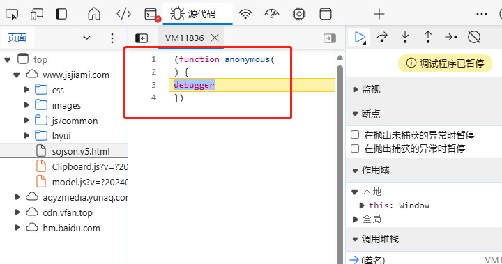
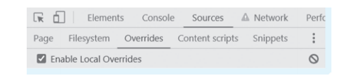
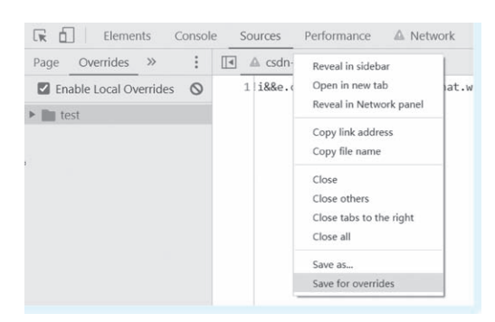

[toc]

# 爬虫笔记02

参考书籍：爬虫逆向进阶实战[李玺/著]

## Web js逆向

### 浏览器环境补充（补环境）

浏览器环境补充，即补环境。是指把浏览器环境移植到 Node 环境的代码中。

通常情况下，用 NodeJS 直接去运行浏览器中复制下来的 Js 代码，可能会报未定义的错误或者找不到方法，导致无法运行或者得到的结果与浏览器不一致。

这是因为 NodeJS 的JS代码 和 浏览器中的JS代码具有一定的区别。虽然浏览器和NodeJS环境的内核都是V8引擎，但是由于Node环境 没有界面渲染， 因此在浏览器中可使用的例如 window、 navigator、 dom 等操作在 Node环境 中是不存在的。

另外 NodeJS 的JS代码 和 浏览器中的JS代码还具有一定的区别，比如 window 对象区别、 this 指向区别、Js 引擎区别， 以及一些 DOM 操作区别等。

此时我们就需要对 NodeJS 中的JS代码进行补充，把 NodeJS中的JS运行环境补充到能运行浏览器的 JS 代码为止。

通常情况下简单的补环境只需要在 NodeJS 环境中填补上 window 或者 document 以及定义一些变量， 比如直接在开头定义一个 window=global； 之后可以根据报错和调试结果缺啥补啥。 

#### 常用的浏览器环境

目前许多网站中的JS代码，加入了检测功能。即检测JS代码的运行环境是否是浏览器环境。如果JS代码不是在浏览器环境中，则无法运行。

经常被检测的浏览器对象，有 window、 location、 navigate、 document、 native、 canvas 等。 除了这些属性外，还有针对自动化的检测、Node 环境的检测，以及浏览器指纹检测、TLS 指纹校验等。

#### 浏览器窗口对象的属性

浏览器窗口对象 window 的常见属性和方法。因为浏览器中的很多JS代码都会涉及到 窗口对象 window 的这些属性和方法。因此我们在补环境前， 需要了解 window 对象的常用属性和方法。

1. Window 窗口对象表示浏览器当前打开的窗口，常用属性和方法如下。
```
document属性         返回 Document 对象
history属性          返回 History 对象
location属性         返回 Location 对象
navigator属性        返回 Navigator 对象
screen属性           返回 Screen 对象
scrollBy()方法       按照指定的像素值来滚动内容
scrollTo()方法       把内容滚动到指定的坐标
setInterval()方法    定时器
setTimeout()方法     延时器
alert()方法          弹出警告框
prompt()方法         弹出对话框
open()方法           打开新页面
close()方法          关闭页面
```

2. Document 文档对象，表示浏览器当前显示的 HTML 文档，常用属性和方法如下。
```
body属性                        返回body元素
cookie属性                      返回当前cookie
domain属性                      文档域名
lastModified属性                文档最后修改日期和时间
referrer属性                    访问来源
title属性                       文档标题
URL属性                         当前 URL
getElementById()方法            返回指定 id 的引用对象
getElementsByName()方法         返回指定名称的对象集合
getElementsByTagName()方法      返回指定标签名的对象集合
open()方法                      打开流接收输入输出
write()方法                     向文档输入
```

3. Navigator 对象，表示当前使用的浏览器信息。
```
userAgent属性                   返回用户代理
AppCodeName属性                 浏览器代码名
AppName属性                     浏览器名称
AppVersion属性                  浏览器版本
browserLanguage属性             浏览器语言
cookieEnabled属性               指明是否启用 cookie 的布尔值
cpuClass属性                    浏览器系统的 cpu 等级
onLine属性                      是否处于脱机模式
platform属性                    浏览器的操作系统平台
plugins属性                     插件,所有嵌入式对象的引用
webdriver属性                   是否启用驱动
product属性                     引擎名
hardwareConcurrency属性         硬件支持并发数
connection属性                  网络信息
javaEnabled()方法               是否启用 Java
taintEnabled()方法              是否启用数据污点
```

4. Location对象，包含有关当前 URL 的信息。
```
hash属性                        返回 URL的锚点
host属性                        当前主机名和端口号
hostname属性                    当前主机名
href属性                        当前 URL
pathname属性                    当前 URL 的路径
port属性                        当前 URL 的端口号
protocol属性                    当前 URL 的协议
search属性                      设置 URL 查询部分
assign()方法                    加载新文档
reload()方法                    重新加载文档
replace()方法                   替换当前文档
```

5. Screen对象，表示当前浏览器中屏幕信息

```
availHeight属性                 屏幕高度
availWidth属性                  屏幕宽度
bufferDepth属性                 调色板比特深度
deviceXDPI属性                  显示屏每英寸水平点数
deviceYDPI属性                  显示屏每英寸垂直点数
fontSmoothingEnabled属性        是否启用字体平滑
height属性                      显示屏高度
pixelDepth属性                  显示屏分辨率
updateInterval属性              屏幕刷新率
width属性                       显示屏宽度
```

6. History 对象包含用户在浏览器窗口中访问过的 URL。

```
length                          浏览器历史列表中的 URL 数量
back()                          加载前一个 URL
forward()                       加载下一个 URL
go()                            加载某个具体页面
```

#### 手动补充浏览器环境

一般在手动补充环境时，主要是根据报错信息缺什么补什么。 比如 `window is not defined`， 就补上`window=global；` 或者 `window={}；` 

除此之外还可以通过 Proxy 代理的方式，一键补充浏览器环境的脚本。

下面是几个补环境的例子。

> 例子1

假如代码报错，提示没有plugin，可以在 navigator 中写上 plugins。 同时用 Symbol. toStringTag 标识一下该对象的类型标签， 因为目前有很多 toString 检测， 而 toStringTag 也能被 toString（）方法识别并返回。

```js
var navigator = {
plugins :{
    0:{
        0:{description :"",type :""},
            name :"",
            length :1,
            filename :"",
            description :"",
            length :1
        }
    }
};
navigator.plugins[Symbol.toStringTag] = "PluginArray";
navigator.plugins[0][Symbol.toStringTag] = "Plugin";

```

> 例子2

如果代码报错没有 getElementByTagName， 就到document 中去定义一个， 但是参数和方法中具体实现， 以
及返回内容都需要根据调试结果来进行补充。

```js
document = {
    getElementsByTagName:function (x){
        return {}
    },
    createElement:function (x){
        return {}
    }
}
```

> 例子3

如果JS代码报错没有canvas，那么可以用 createElement 去创建一个简单的元素节点， 通过此方法可返回一个canvas 对象。

```js
var document = {
    createElement:function createElement (x) {
        if (x= ="canvas"){
            return {
                toDataURL:function toDataURL () {
                    return "data:image/png;base64,* * * * * * ";
                }
            }
        }
    }
}
```


#### 使用JSDOM 补充浏览器环境

一般来说，在 NodoJS 环境下最多需要补充的就是 document 和 window 对象。

我们可以使用无头浏览器JSDOM，来补充浏览器环境。

下面代码中创建一个JSDOM 实例。然后通过JSDOM实例取得 window 对象和 document 对象。并且JSDOM实例中生成的 window 对象下还实现了 history、 location、 postMessage、 setTimeout、 setInterval 等熟悉的浏览器 Api。

```js
const { JSDOM } = require ( jsdom );
const NewjsDom = new JSDOM(`
 <! DOCTYPE html>
 <html>
    <body>
        <div>
            <p> 爬虫逆向开发实战</p>
        </div>
    </body>
 </html>
`);
const window = NewjsDom.window ; // window 对象
const document = window.document ; // document 对象

```

JSDOM本质上就是一个包含各个浏览器环境的库。JSDOM 能满足大部分测试场景下对浏览器环境的还原，但在一些场景下也会被检测出来。

JSDOM的安装：`npm i jsdom -g`。查看 jsdom 的安装位置： `npm root -g`。

#### 使用浏览器驱动工具来模拟浏览器环境

某些情况下。我们并不知道网站检测了什么浏览器属性，从而也不知道如何修补浏览器环境时，我们可以使用浏览器驱动工具来加载浏览器的 Js 代码。

浏览器驱动工具，可以通过代码的方式，来操作浏览器。并且也可以对浏览器进行个性化设置。

##### Selenium 浏览器驱动工具

Selenium是一个浏览器驱动工具。我们可以先把 Js 和 需要加密的参数都写到本地的 html 文件， 然后用 selenium 驱动浏览器打开 html 文件，加载其中的Js代码，最终生成加密参数。

### 加密方法的远程调用

加密方法的远程调用 主要是指使用了RPC协议，RPC（Remote Procedure Call）是远程调用的意思。RPC 的应用十分广泛，比如在分布式中的进程间通信、微服务中的节点通信。

在 Js 逆向时，本地JS环境 和 浏览器 以 服务端 和 客户端的形式通过 webSocket 协议进行RPC通信。这样可以让本地JS环境直接调用浏览器中的一些函数方法，从而不必去在意函数具体的执行逻辑， 可以省去大量的逆向调试时间。

学习了 Web 自动化工具之后， 可以通过自启动一个浏览器来拦截 Js 文件实现 RPC 服务， 熟练掌握后，各种难度的 Js 都能操作起来。

#### 各个RPC逆向案例(暂无)

暂无

### 常见协议分析

常用通信协议有 http/https、WebSocket/wss、TLS 等。常用数据传输协议有 json、xml、Protobuf、Tlv等。

#### WebSocket 协议

webSocket 是基于 TCP 的应用层协议， webSocket 和 wss 协议的关系类似 http 和 https协议。

webSocket 采用双向通信模式，客户端与服务器之间建立连接后，不论是客户端还是服务端都可以随时将数据发送给对方，不过每隔一段时间就发送一次心跳包维持长连接。

webSocket协议的常见应用场景就是社交聊天室、股票基金实时报价、实时定位、直播间的信息流等。

#### Protobuf 协议

Protobuf 是和 json、xml 类似的数据通信协议。它提供了高效率的序列化和反序列化机制，序列化就是把对象转换成二进制数据发送给服务端，反序列化就是将收到的二进制数据转换成对应的对象。据说在传输速度方面 Protobuf协议 是Json协议 的 3～10 倍， 是 xml协议 的 20～100 倍。

很多网站和 App 都采用了 Protobuf 来加速数据传输， 比如某 App 的推荐流、 直播数据流和一些 App 的直播间请求。


### 常见反调试手段

反调试是指影响正常调试的方式和方法。例如压缩混淆加密，无限debugger，控制台状态检测， 蜜罐和内存爆破等。

#### 无限debugger

当对某些网页进行调试的时候。我们在通过 F12 控制台查看请求信息时，总是被自动断点到一串代码处,并且无限debugger。

例如网站`https://www.jsjiami.com/sojson.v5.html`,打开F12的时候，会无限debugger。如图所示。



关于这个反调试手段，有4种解决方案。

> 解决方案1： 添加条件断点

1. 在 debugger 断点行数的位置单击鼠标右键。
2. 选择【add conditional breakpoint（添加条件断点）】 命令，添加false，然后按 Enter 键。
3. 刷新网页后发现。成功跳过无限 debugger。

> 解决方案2：禁用某处断点

在 debugger 行数的位置单击鼠标右键，选择【Never paush here（禁用此处断点）】 命令，刷新网页后发现成功跳过无限 debugger。

> 解决方案3：利用中间人修改响应文件

把 Js 文件保存到本地进行修改，修改范围主要是将 debugger 相关代码删除或者改写。修改后使用 控制台或者 fiddler、 charles、 mitmproxy 等工具动态拦截并替换 Js 文件。

> 解决方案4：注入代码到 Js 文件

可以通过编写插件来注入Js代码，来进行拦截和替换原有的JS代码。

或者直接在控制台中重置定时任务，比如下面这段代码，如果网页的定时 debug 时间为 3000 毫秒，那么就修改方法，当参数为 3000 时，就让它返回一个空方法，等于覆盖了原有的定时任务。

```js
var setInterval_ = setInterval;
setInterval = function (func, time){
    if (time = = 3000){
        return function () {};
    }
    return setInterval_(func, time)
}

```

#### 无法打开控制台

如果只是单纯的抓包，碰到按 F12 键无法打开控制台时，使用抓包工具即可。但是有时候需要断点调试的时候，连控制台都无法打开实在是不好办。

下面总结了几种解决方法：
1. 如果按 F12 键没反应，可以选中域名栏，再按 F12 键就调出控制台了。
2. 打不开就切换浏览器。换火狐或者其他浏览器，还不行就换 IE 浏览器。
3. 打开控制台就关闭页面。这种情况可以使用之前提到的 chrome 插件来注入代码定位参数，在页面关闭之前进行断点。
4. 打开控制台就跳转到某页面。这种情况是网站做了触发检测限制，可以使用页面事件监听断点，event listener breakpoints。

#### 禁用控制台输出

为了防止他人调试，部分网站可能会禁止控制台输出。简单的方法是重新定义日志函数，比如 `var console={}` 或者 `console.log = function（）{}` 等方式。相当于禁用了日志输出。

解决方法也是找到对应的 Js 代码， 进行删除或者替换即可。

#### 蜜罐和内存爆破

蜜罐是指 Js 代码中有大量无用代码、花指令，影响正常的代码逻辑分析。解决方式通常是先对 Js 文件的代码块进行分析，正常代码都是会互相关联的，而无用代码大都是单独一块或者多块，删除之后不会影响页面的运行的。

花指令在汇编中使用得比较多，比如一些调用、跳转指令，通常会引导大家进入错误的调用逻辑中。

内存爆破的场景是在调试 Js 时，或者打开控制台，或者格式化 Js代码后，浏览器就会卡顿崩溃。这种情况的主要原因是有监测状态的代码，比如监测到控制台打开后，就会循环执行一段占用内存的代码或者能让浏览器内存溢出的代码，促使内存爆破，从而导致无法正常调试。

> 解决蜜罐和内存爆破

1. 先断点后进行调试，如果浏览器开始卡顿，就单击控制台右上角的暂停按钮，然后查看 Call Stack 调用栈，直接定位到发生卡顿的代码位置上。
2. 然后分析该段代码，可进行代码删除或者替换。替换 Js 文件的方法有很多，可以通过抓包工具来替换，也可以通过浏览器控制台的Overrides 将 Js 保存到本地并且覆盖网站的 Js 文件。

> Overrides 替换JS文件方法如下




1. 先通过 Overrides 创建一个本地文件夹，然后使用鼠标右键单击对应的 Js 文件，选择Save for overrides 命令。
2. 然后把格式化后的代码复制到创建的文件中，就可以进行修改了，修改后需要按 Ctrl+s 快捷键进行保存，并且刷新页面后才能执行。

#### 控制台状态检测

控制台状态检测是检测控制台是否启用。如果启用，会让代码进行无限 debugger 或者进入错误逻辑中，或者直接死循环导致界面卡死。

除此之外，还有其他各种各样的检测方式。包括但不限于键盘监听、浏览器窗口高度差值检测、DevTools 检测、代码运行时间差值检测、代理对象检测。

- 键盘监听是用来检测是否按下了 F12 键或者其他适用于调试时的快捷键。
- 浏览器窗口高度差值检测是根据浏览器窗口和页面浏览的比值来进行判断。
- DevTools 检测是利用 div 元素的 id 属性，当 div 元素被发送至控制台，例如 console. log （div）时，浏览器会自动尝试获取其中的元素 id。如果代码在调用了 console.log 之后又调用了 getter 方法，说明控制台当前正在运行。
- 代码运行时间差值检测是通过两段代码执行的时间差来判断是否处于 debugger状态。
- 代理对象检测是指，如果对象使用了代理，浏览器就能通过 toString（）方式判断是否被调用，因为对象未定义时该方法会报错。当然解决方式是手动给对象添加一个toString 方法。


## 调试工具推荐

虽然在大部分场景下直接使用 chrome 控制台进行调试就能完成任务， 但是有些时候可以使用 Js 调试工具的附加功能来提高调试速度。

### WT-JS 调试工具

WT-JS_DEBUG 调试器内置了诸多调试函数， 有很多加密函数库， 基本满足使用需求。

### 发条 JS 调试工具

发条 JS 也是一款非常好用的调试工具， 支持对 Js 代码进行压缩、 查找、 解密、 格式化等。

### 鬼鬼 JS 调试工具

鬼鬼 JS 是目前使用较多的调试工具，同样支持代码格式化、加解密，也可以选择不同的运行方式。


## 自动化工具的使用

使用自动化工具来做爬虫算是一种退而求其次的采集方法，但是在某些场景并不比使用协议请求的效果差， 只不过采集效率确实会相差很大。

所谓的自动化工具，一般都内置了浏览器驱动。我们可以通过代码，直接操作自动化工具，从而间接操作浏览器。实现各种爬虫或逆向操作。即 代码-> 自动化工具 -> 浏览器。

因此直接通过自动化工具，操作浏览器的方式。即可绕过网站设置的反调试或者反爬虫的手段。

因为自动化工具本质上就是再调用浏览器来登录或访问网站。

### Selenium

Selenium 是爬虫工程师最常用的 Web 自动化测试工具之一。最近的Selenium 内置了浏览器驱动，它可以通过代码的方式，来驱动浏览器，从而模拟鼠标、键盘操作来完成很多自动化任务，比如网站模拟登录、表单提交、 窗口管理、 翻页等。

并且用 Selenium 做爬虫可以绕过 Js 的加密校验，所以很多网站都通过 Js 对 webdriver 进行检测。防止他人用Selenium 自动化工具来做爬虫。

### Pyppeteer

Pyppeteer类似与Selenium。

Pyppeteer 是 Puppeteer 的 Python 版本，是Google基于Node.js开发的工具，可以通过JavaScript代码来操纵浏览器。

所以在浏览器中绝大多数操作都可以使用 Pyppeteer 来完成，比如页面功能测试，自动提交表单、请求响应拦截、导出页面PDF、 测试浏览器扩展等。

### Playwright

Playwright 是一个支持异步的自动化库， 仅用一个 Api 即可自动执行 Chromium、Firefox、WebKit等主流浏览器自动化操作， 并同时支持以无头模式运行。 

### Appnium

Appium 是一个开源自动化测试工具，使用与 Selenium 相同的 webdriver 协议。主要用于Android、iOS 和 Windows 桌面平台上的原生、 移动 Web 和混合应用等。

Appium 支持多种设备以及各种测试方式（native、 hybrid、 web、 真机、 模拟器等）。

## 抓包工具的使用

不同的抓包工具有不同的效果，在很多场景下，一些抓包工具并不能有效拦截到协议。

### Fiddler 

Fiddler 是位于客户端和服务器之间的代理， 它能够记录客户端和服务器之间的所有 HTTP 请求，可以针对特定的HTTP 请求，分析请求数据、设置断点、调试 Web 应用、修改请求的数据，甚至可以修改服务器返回的数据，功能非常
强大，是调试的利器。

### Charles

Charles 是必备的抓包工具，也是一个 HTTP/HTTPS 监视器/代理工具，使开发人员能够查看本机和服务器之间的所有 HTTP 和 SSL/HTTPS 流量。 这包括请求、响应和 HTTP 标头（其中包含 cookie 和缓存信息）。

### MitmProxy

Mitm 的全称是 Man-in-the-MiddleAttack （中间人攻击）。它是一种 “间接” 的入侵攻击，这种攻击模式是通过各种技术手段将受入侵者控制的一台计算机虚拟放置在网络连接中的两台通信计算机之间， 这台计算机就称为中间人。

而 Mitmproxy 是一个免费和开源的交互式 HTTPS 代理， 基于中间人的方式用于调试、 测试、 抓包和渗透测试。 它可用于拦截、检查、修改和重播 Web 通信，例如 HTTP/1、HTTP/2、webSocket 或任何其他受 SSL/TLS 保护的议。 可以解码从HTML 到 Protobuf的各种消息类型，即时拦截特定消息，在它们到达目的地之前， 对其进行修改， 稍后将其重放到客户端或服务器。

Mitmproxy-mitmdump 可编写强大的插件和脚本。脚本 Api 提供对 Mitmproxy 的完全控制，并可以自动修改消息，重定向流量，可视化消息或实现自定义命令。

最重要的原因是可配合 Python 脚本对数据包进行拦截修改，使用简单，所以 Mitmproxy 是爬虫工程师必须掌握的利器之一。

### HTTP Canary

HTTP Canary 是 Android 平台下的网络分析工具，因其 logo 又被称为黄鸟。 它是目前在Android 上使用最顺手的抓包工具，免root、界面清新、功能齐全、使用方便，支持 TCP / UDP / HTTP / HTTPS / webSocket 等多种协议。