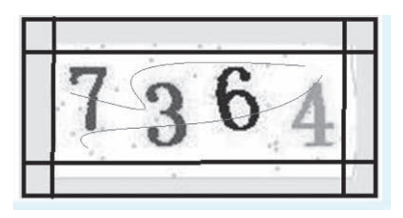
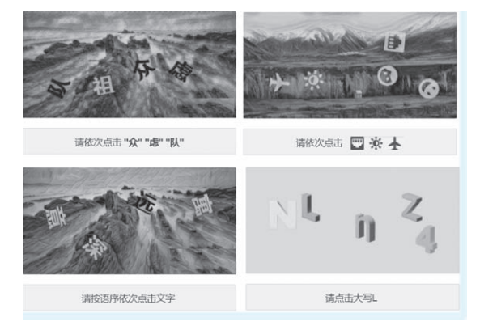

[toc]

# 爬虫笔记03

参考书籍：爬虫逆向进阶实战[李玺/著]

## Android 逆向(暂无)

目前 Android 逆向已经成为高级爬虫工程师的必备技能， 但是逆向本身的教程和案例由于其可能带来的风险性导致少之又少。

当然除了逆向工具之外，还需要掌握一些Android基本知识，比如 Java 语法、 Smali 语法、arm 指令、NDK 开发
等，因为这些都是Android 逆向必须要面对和接触的知识。

## 小程序 逆向(暂无)

小程序是指微信小程序。小程序提供了一个简单、高效的应用开发框架和丰富的组件及 Api，帮助开发者在微信中开发具有原生 App 体验的服务。

现在很多应用都在小程序上做了备份， 比如微博、 知乎、 小红书等。 在 App 采集难度相对较高的时候，就可以转战小程序，根据小程序的接口进行逆向和分析。

小程序的主要开发语言是 JavaScript，代码结构、目录、文件与 HTML 类似， 小程序中也有类似WXML、 WXSS 等模板和样式文件。

因此小程序的开发同普通的网页开发相比有很大的相似性。小程序开发过程中需要面对的是两大操作系统 iOS 和 Android 的微信客户端，以及用于辅助开发的小程序开发者工具。

### 小程序逆向基础


## 验证码识别技术

随着互联网的高速发展，验证码已经成为一项广泛使用且成熟的验证手段。

爬虫开发过程中往往会因为提交表单或者高频采集触发验证码，而不同网站的验证码又有不同的检验方式，比如复杂的图文验证码、滑块验证码、语义验证码、点触验证码等。所以验证码也成为爬虫的一个壁垒，并且不同类型的验证码需要定制专属的解决方案。

### 图文验证码

图文验证码是最常见的一种， 大多由数字、 字母组成， 复杂的图文验证码有字符粘连、 重叠、 透视变形、 模糊、 噪声等各种干扰情况。

#### EasyOCR 和 ddddocr 开源图文识别库

一些简单的图文验证码可以直接使用 Python 开源的 OCR 库进行识别， 比如 pytesseract， 它是基于Google 的 Tesseract-OCR，可惜识别率并不高，只能识别简单的验证码。

推荐使用的图文识别开源库是 EasyOCR 和 ddddocr， 这两个开源库都是即用型的， pip 安装即可使用。

> EasyOCR 使用代码示例

```py
import easyocr
# 设置图文识别模式
reader = easyocr.Reader(['ch_sim','en'])
# 对图片进行识别，返回识别结果
result = reader.readtext( 'C://test.jpg')
```

> ddddocr 使用代码示例

```js
import ddddocr
ocr = ddddocr.DdddOcr()
with open("test.jpg", rb) as f:
    image = f.read()
    
res = ocr.classification(image)

```

EasyOCR 和 ddddocr 的通用识别性很高， 对爬虫开发者来说非常实用。但是识别某些包含特殊符号或特殊样式的图片准确率并不高。 

所以在使用这些开源库时，最好先对这些验证码图片进行基础处理， 比如去边、去线、降噪等。

#### 验证码图片处理

在对验证码图片进行图文识别前，可以对图片进行一些基础处理。这样能够提高图文识别的成功率。

opencv 是开源且高效的跨平台计算机视觉和机器学习软件库，可以运行在 Linux、 Windows、 Android 和 Mac OS 操作系统上。

我们可以使用 opencv 对验证码图片进行二值化、 去边、 去线、 降噪。

```py
import cv2
# 读取验证码图片
img = cv2.imread( 1.png )
# 使用 cvtColor 方法进行颜色空间转换，把图片二值化处理，并把像素转成黑白的。
img = cv2.cvtColor(im, cv2.COLOR_BGR2GRAY)

# 去除边框，原理是把边框范围所有坐标的像素都变成 255 白色。具体数据要看图片的边框值是多少。
def clear_border(img):
    h,w =img.shape[:2] # h 高、w 宽
    for y in range(0, w):
        for x in range(0, h):
            # 把 50 以内的像素坐标[0,0]到[高,50],[0,宽-50]到[高，宽]，都变成 255白色
            if y < 50 or y > w - 61: 
                img[x, y] = 255
            if x < 60 or x > h - 60:
                img[x, y] = 255
    cv2.imwrite(new.png,img)
    return img

#去除图片中的线，也就是干扰线降噪。这个处理原理是判断某个像素点周围的像素是不是白的， 如果是白的， 说明它是干扰线， 就把它也变成白的。
def interference_line(img):
    h, w =img.shape[:2]
    # opencv 矩阵点是反的
    #img[1,2] 1:图片的高度，2：图片的宽度
    for y in range(1, w - 1):
        for x in range(1, h - 1):
            count =0
            if img[x, y - 1] > 245:
                count = count +1
            if img[x, y + 1] > 245:
                count = count +1
            if img[x - 1, y] > 245:
                count = count +1
            if img[x + 1, y] > 245:
                count = count +1
            if count > 2:
                #判断一圈有多少白的，超过 2，就转成白的
                img[x, y] = 255 
    cv2.imwrite(new.png,img)
    return img

# 去除图片中的干扰点，也就是点降噪。有两种方式:中值滤波和高斯滤波.

# 中值滤波方法。中值滤波基本思想是用像素点邻域灰度值的中值来代替该像素点的灰度值， 让周围的像素值接近真实的值， 从而消除孤立的噪声点。
import numpy
image = cv2.imread(img)
result =numpy.array(image)
ss = cv2.medianBlur(result,5)
cv2.imwrite(new.png,ss)

# 高斯滤波方法。高斯滤波是需要对一个像素周围的像素给予更多的重视，通过分配权重来重新计算这些周围点的值。
image1 = cv2.imread(img)
result = cv2.blur(image1,(5,5))
gaussianResult = cv2.GaussianBlur(result,(5,5),1.5)
cv2.imwrite(new.png,gaussianResult)

```

如图所示，第一张图片是未处理的验证码图片。经过代码的去边、 去线、 降噪处理之后。变成了第二张图片。




### 滑块验证码

处理滑块验证码有很两种方法。第一种是通过自动化工具进行行为模拟，生成轨迹把滑块拖动到验证码图片的缺口处完成验证。这种方式适合一次性登录时使用，登录之后获取 Cookie 再通过协议完成请求。

第二种方式是分析滑块验证成功时所请求的接口，一般请求成功会携带滑块验证的坐标和一些加密参数，通过构造请求完成滑块验证，这种效率很高，适合处理频繁访问时的验证。

滑块验证码一般可以通过 opencv+selenium 来进行模拟。

### 点选验证码

点选是一种新型的验证码，根据验证规则，通过点击完成验证，常见的有文字点选、图标点选、语序点选、空间推理点选等。

如图所示


一般来说， 要完成一个文字点选验证的逻辑前， 应先找到目标文件，然后确定点击内容，最后在图片符合的位置上进行点击。 所以通过程序实现文字点选， 则需要有目标检测、 文字定位、 文字识别。

### 短信验证码

短信验证码也是目前很常见的一种验证方式，相对于其他验证类型更能够确保用户的真实性和安全性，虽然目前有很多接码平台利用虚拟手机号接收短信和语音，但是接码平台属于灰色产业，不推荐大家使用。

> 如何处理短信验证码呢?

可以使用 Xposed 等工具拦截短信内容， 或者使用 Gsm 模块读取短信内容。在读取到新短信时，通过消息队列把短信内容推送或者存入数据库中，爬虫程序去读取短信并进行验证。

同理，如果是需要用户主动发送验证码到服务端验证,也可以使用上面两种方法发送短信完成验证。

