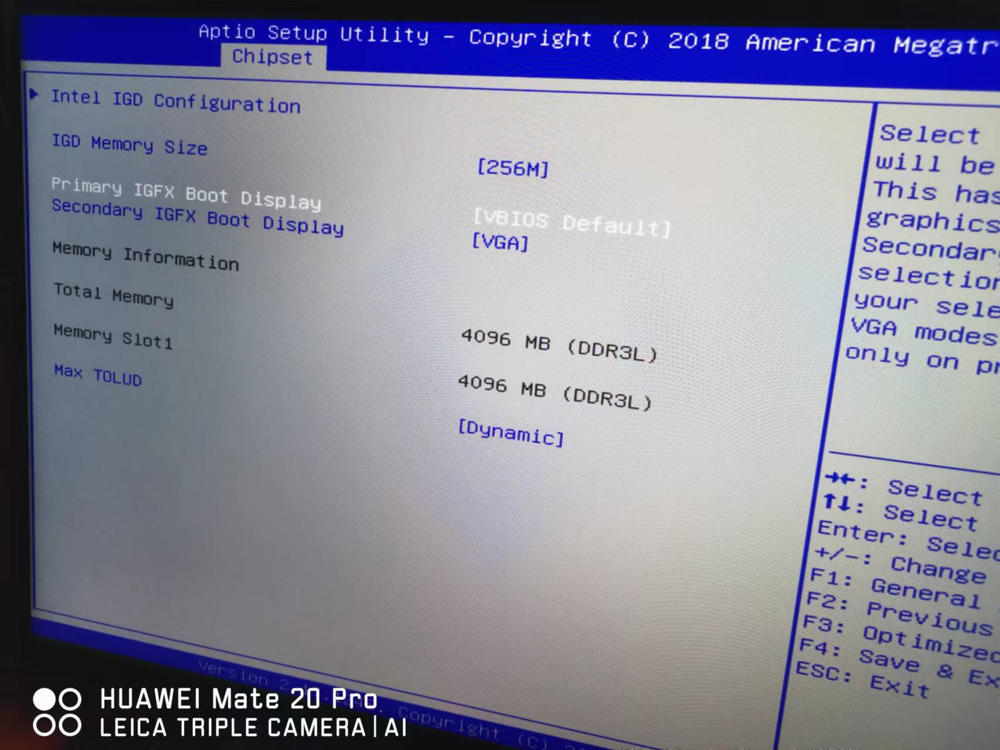
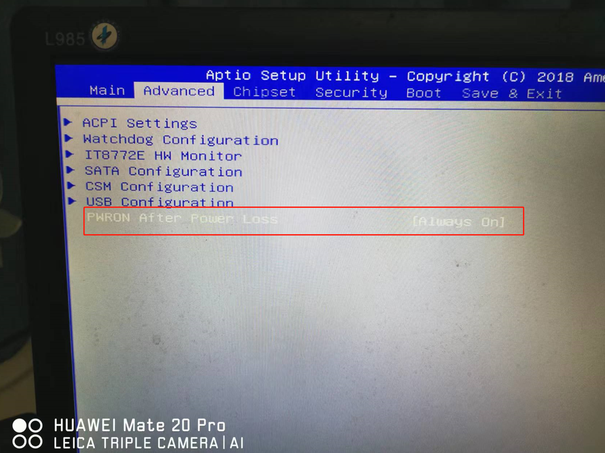

[toc]

## 黑群晖J1900主板

### 1. 黑群晖必须插入HDMI才能正常启动。否则无法获取IP，导致不能启动

原因：之前想通过hdmi线连接黑群晖和显示器。所以在黑群晖的J1900主板上设置Primary IGFX BOOT Display选项为hdmi。后来发现当拔掉黑群晖上的hdmi线后，会导致黑群晖获取不到ip,进而无法启动。

```
Primary IGFX BOOT Display 为主显示设备
```

解决方式：设置Primary IGFX BOOT Display 选项为vbios default。设置为这个选项后。当拔掉黑群晖上的hdmi线后，黑群晖可以正常启动。这个选项会默认导致黑群晖只能通过VGA线的方式连接到显示器上。hdmi线无效。




### 2. J1900主板来电开机

原因：通过J1900主板设置来电开机，然后配合小米智能插座。可以实现黑群晖J1900主板的远程开机。

```
黑群晖J1900主板的远程关机可以通过内网穿透的方式来访问黑群晖系统，然后手动关机即可。
```

解决方式：设置J1900主板bios的PWRON AFTER POWER LOSS选项为always on即可。


```
PWRON AFTER POWER LOSS (如果发生断电后，恢复供电后系统如何反应?)
选择always Off，接通交流电源后保持关机状态；
选择always on，来电后开机；
选择LastState 将机器恢复到断电前的状态。

```



<font color="red">注意：当在系统中选择关机时，需要等服务器完全关机后。然后才断开智能插座的电源。并且还需要等一段时间之后，再打开智能插座的电源。此时服务器会来电开机。</font>